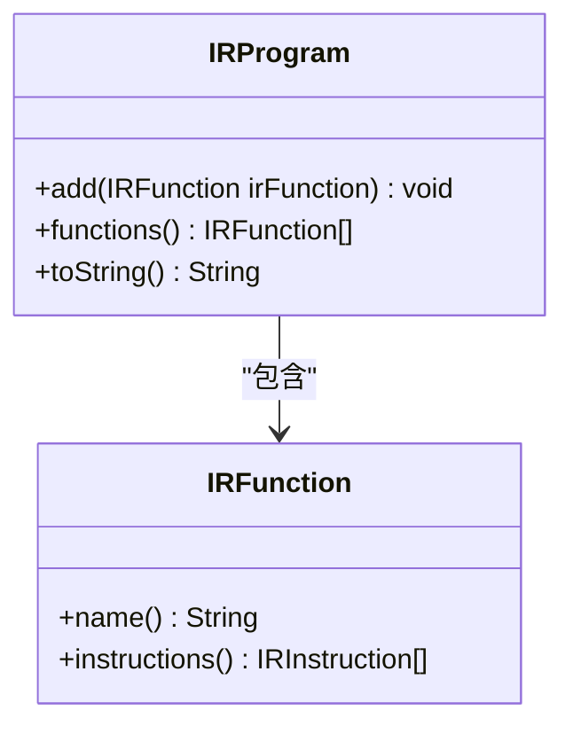
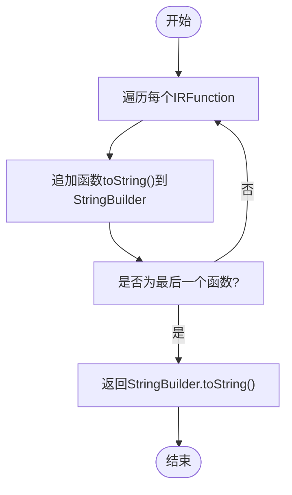
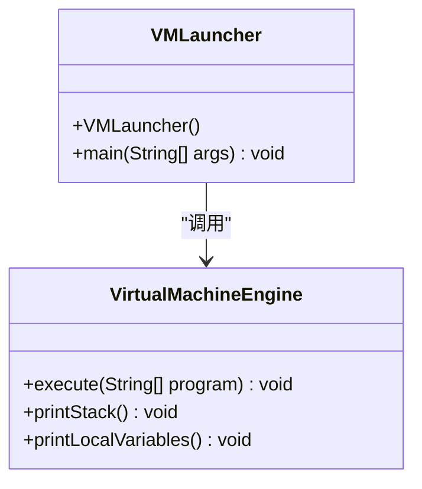
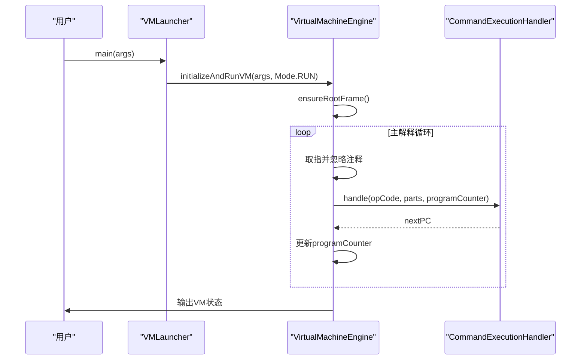
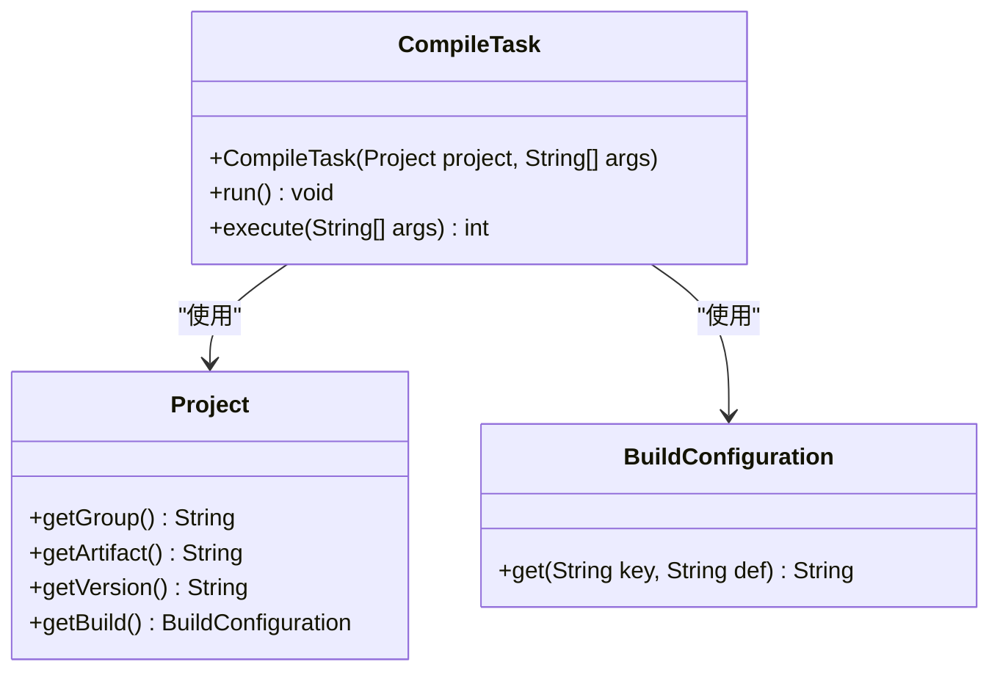
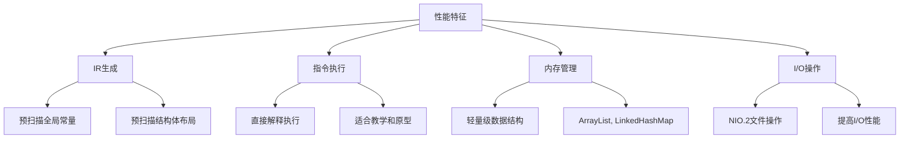

# API参考

<cite>
**本文档中引用的文件**  
- [IRProgram.java](file://src/main/java/org/jcnc/snow/compiler/ir/core/IRProgram.java)
- [IRProgramBuilder.java](file://src/main/java/org/jcnc/snow/compiler/ir/builder/core/IRProgramBuilder.java)
- [VMLauncher.java](file://src/main/java/org/jcnc/snow/vm/VMLauncher.java)
- [VirtualMachineEngine.java](file://src/main/java/org/jcnc/snow/vm/engine/VirtualMachineEngine.java)
- [VMOpCode.java](file://src/main/java/org/jcnc/snow/vm/engine/VMOpCode.java)
- [SyscallOpCode.java](file://src/main/java/org/jcnc/snow/vm/engine/SyscallOpCode.java)
- [CompileTask.java](file://src/main/java/org/jcnc/snow/pkg/tasks/CompileTask.java)
- [Project.java](file://src/main/java/org/jcnc/snow/pkg/model/Project.java)
- [BuildConfiguration.java](file://src/main/java/org/jcnc/snow/pkg/model/BuildConfiguration.java)
- [SnowConfig.java](file://src/main/java/org/jcnc/snow/common/SnowConfig.java)
- [Mode.java](file://src/main/java/org/jcnc/snow/common/Mode.java)
</cite>

## 目录
1. [编译器API](#编译器api)
2. [虚拟机API](#虚拟机api)
3. [包管理API](#包管理api)
4. [线程安全与性能特征](#线程安全与性能特征)
5. [API版本管理与向后兼容性](#api版本管理与向后兼容性)
6. [API使用模式与最佳实践](#api使用模式与最佳实践)

## 编译器API

编译器API提供了从源代码到中间表示（IR）再到虚拟机字节码的完整编译流程。核心组件包括IRProgram、IRProgramBuilder等，支持源码解析、语义分析、IR生成和优化。

### IRProgram的创建与操作

`IRProgram`类表示一个完整的中间表示程序，是编译器后端处理阶段的核心数据结构。它承载所有由源代码翻译得到的`IRFunction`实例，形成整体性的中间表示单元。



**Diagram sources**
- [IRProgram.java](file://src/main/java/org/jcnc/snow/compiler/ir/core/IRProgram.java#L13-L61)
- [IRFunction.java](file://src/main/java/org/jcnc/snow/compiler/ir/core/IRFunction.java)

**Section sources**
- [IRProgram.java](file://src/main/java/org/jcnc/snow/compiler/ir/core/IRProgram.java#L13-L61)

#### IRProgram创建方法

`IRProgram`通过其构造函数隐式创建，主要通过`add`方法添加`IRFunction`对象。`IRProgramBuilder`负责将AST节点转换为`IRProgram`。

- **add(IRFunction irFunction)**: 将一个`IRFunction`添加到程序中。函数会按添加顺序保留在内部集合中。
  - 参数: `irFunction` - 要加入的IR函数对象
  - 返回值: void
  - 异常: 无

- **functions()**: 获取程序中全部函数的只读视图。外部调用者无法通过返回的列表修改函数集合，从而确保封装性与结构完整性。
  - 参数: 无
  - 返回值: 不可变的函数列表
  - 异常: 无

- **toString()**: 返回该IR程序的字符串形式。每个函数按其`toString()`表示输出，换行分隔。通常用于调试与日志输出。
  - 参数: 无
  - 返回值: 表示整个IR程序的格式化字符串
  - 异常: 无

### IRProgram的序列化

`IRProgram`的序列化主要通过`toString()`方法实现，该方法将程序中所有函数的字符串表示按顺序输出，换行分隔。此功能主要用于调试和日志输出。



**Diagram sources**
- [IRProgram.java](file://src/main/java/org/jcnc/snow/compiler/ir/core/IRProgram.java#L50-L61)

**Section sources**
- [IRProgram.java](file://src/main/java/org/jcnc/snow/compiler/ir/core/IRProgram.java#L50-L61)

## 虚拟机API

虚拟机API提供了虚拟机的启动、执行控制和状态查询功能。核心组件包括VMLauncher、VirtualMachineEngine等，支持指令执行、状态管理和调试。

### VMLauncher启动参数

`VMLauncher`类负责启动虚拟机执行过程，作为虚拟机的入口点。它处理命令行参数，加载指令集，并调用虚拟机引擎执行指令。



**Diagram sources**
- [VMLauncher.java](file://src/main/java/org/jcnc/snow/vm/VMLauncher.java#L17-L49)
- [VirtualMachineEngine.java](file://src/main/java/org/jcnc/snow/vm/engine/VirtualMachineEngine.java#L29-L189)

**Section sources**
- [VMLauncher.java](file://src/main/java/org/jcnc/snow/vm/VMLauncher.java#L17-L49)

#### 启动参数说明

- **构造函数 VMLauncher()**: 默认构造函数，无需特定初始化。
  - 参数: 无
  - 返回值: 新的VMLauncher实例
  - 异常: 无

- **main(String[] args)**: 主方法，作为启动虚拟机执行过程的入口点。处理命令行参数以获取虚拟机指令集的文件路径，加载指令并执行。
  - 参数: `args` - 命令行参数，主要包含指向虚拟机指令集的文件路径
  - 返回值: void
  - 异常: 无

### VirtualMachineEngine执行控制

`VirtualMachineEngine`类是虚拟机的核心执行引擎，负责解释和执行指令列表，同时维护程序计数器（PC）和运行时数据结构。

#### 执行控制方法

- **execute(List<String> program)**: 执行提供的程序指令列表。
  - 参数: `program` - 文本指令列表（"opcode arg1 arg2 ..."格式）
  - 返回值: void
  - 异常: `IllegalArgumentException` - 当程序为空或null时抛出

- **printStack()**: 打印操作数栈和调用栈的快照。
  - 参数: 无
  - 返回值: void
  - 异常: 无

- **printLocalVariables()**: 打印当前顶层栈帧的局部变量表。
  - 参数: 无
  - 返回值: void
  - 异常: 无

### 状态查询接口

虚拟机提供了多种状态查询接口，用于调试和监控虚拟机的运行状态。

- **getCallStack()**: 获取调用栈的引用（包级私有访问，供调试助手使用）。
  - 参数: 无
  - 返回值: CallStack对象
  - 异常: 无

- **operandStack**: 操作数栈，存储中间值。
- **localVariableStore**: 局部变量存储，保存当前栈帧的局部变量。
- **callStack**: 调用栈，管理栈帧和返回地址。
- **programCounter**: 程序计数器，指示当前执行的指令位置。



**Diagram sources**
- [VMLauncher.java](file://src/main/java/org/jcnc/snow/vm/VMLauncher.java#L30-L49)
- [VirtualMachineEngine.java](file://src/main/java/org/jcnc/snow/vm/engine/VirtualMachineEngine.java#L88-L189)
- [VMInitializer.java](file://src/main/java/org/jcnc/snow/vm/VMInitializer.java#L45-L64)

**Section sources**
- [VirtualMachineEngine.java](file://src/main/java/org/jcnc/snow/vm/engine/VirtualMachineEngine.java#L88-L189)

## 包管理API

包管理API提供了项目构建、依赖管理和任务执行的功能。核心组件包括CompileTask、Project、BuildConfiguration等，支持项目配置、编译和运行。

### CompileTask配置选项

`CompileTask`类负责将.snow源文件编译为VM字节码（.water文件），是命令行编译任务的具体实现。



**Diagram sources**
- [CompileTask.java](file://src/main/java/org/jcnc/snow/pkg/tasks/CompileTask.java#L13-L425)
- [Project.java](file://src/main/java/org/jcnc/snow/pkg/model/Project.java#L19-L233)
- [BuildConfiguration.java](file://src/main/java/org/jcnc/snow/pkg/model/BuildConfiguration.java#L11-L65)

**Section sources**
- [CompileTask.java](file://src/main/java/org/jcnc/snow/pkg/tasks/CompileTask.java#L13-L425)

#### 配置选项说明

- **runAfterCompile**: 是否在编译后自动运行VM。
- **outputName**: 用户指定的输出文件名。
- **dir**: 源文件目录。
- **sources**: 源文件列表。

### CompileTask执行方法

`CompileTask`提供了两种执行方式：通过`run()`方法或`execute()`方法。

- **run()**: 执行具体任务的入口方法。
  - 参数: 无
  - 返回值: void
  - 异常: `Exception` - 任务执行过程中发生的任意异常

- **execute(String[] args)**: 编译.snow文件为.water字节码文件，可选自动运行。
  - 参数: `args` - 命令行参数
  - 返回值: 0表示成功，非0表示失败
  - 异常: `Exception` - 编译过程中发生的异常

## 线程安全与性能特征

### 线程安全性

- **IRProgram**: 线程安全。`functions()`方法返回不可变列表，确保封装性与结构完整性。
- **VirtualMachineEngine**: 非线程安全。每个虚拟机实例应由单个线程独占使用。
- **CompileTask**: 非线程安全。任务执行过程中会修改内部状态，不应在多线程环境中共享实例。
- **SnowConfig**: 线程安全。静态字段和方法使用适当的同步机制。

### 性能特征

- **IR生成**: 使用预扫描机制收集全局常量和结构体布局，提高后续处理效率。
- **指令执行**: 虚拟机采用直接解释执行模式，性能适中，适合教学和原型开发。
- **内存管理**: 使用轻量级数据结构，如ArrayList和LinkedHashMap，优化内存使用。
- **I/O操作**: 编译任务中使用NIO.2进行文件操作，提高I/O性能。



**Diagram sources**
- [IRProgramBuilder.java](file://src/main/java/org/jcnc/snow/compiler/ir/builder/core/IRProgramBuilder.java#L13-L385)
- [VirtualMachineEngine.java](file://src/main/java/org/jcnc/snow/vm/engine/VirtualMachineEngine.java#L29-L189)
- [CompileTask.java](file://src/main/java/org/jcnc/snow/pkg/tasks/CompileTask.java#L13-L425)

## API版本管理与向后兼容性

### 版本管理策略

- **语义化版本**: 采用MAJOR.MINOR.PATCH格式，遵循语义化版本规范。
- **向后兼容性**: MAJOR版本变更时可能引入不兼容的API更改，MINOR版本添加功能但保持向后兼容，PATCH版本仅包含bug修复。
- **废弃策略**: 通过@Deprecated注解标记即将移除的API，并在文档中说明替代方案。

### 向后兼容性保证

- **IRProgram API**: 保证`add()`和`functions()`方法的向后兼容性，未来版本不会改变其行为。
- **虚拟机指令集**: 保证现有指令的语义不变，新增指令使用新的操作码。
- **配置系统**: `SnowConfig`类的静态字段和方法保持向后兼容，新增配置项不会影响现有功能。

## API使用模式与最佳实践

### 编译器API使用模式

- **创建IRProgram**: 使用`IRProgramBuilder`从AST节点构建`IRProgram`。
- **添加函数**: 通过`add()`方法将`IRFunction`添加到`IRProgram`。
- **获取函数列表**: 使用`functions()`方法获取只读函数列表进行遍历或分析。

### 虚拟机API使用模式

- **启动虚拟机**: 通过`VMLauncher.main()`方法启动虚拟机，传入字节码文件路径。
- **执行指令**: 使用`VirtualMachineEngine.execute()`方法执行指令列表。
- **调试**: 利用`printStack()`和`printLocalVariables()`方法进行调试。

### 包管理API使用模式

- **配置项目**: 使用`Project.fromFlatMap()`方法从扁平Map创建项目实例。
- **执行编译任务**: 创建`CompileTask`实例并调用`run()`或`execute()`方法。
- **管理依赖**: 通过`Dependency.fromString()`方法创建依赖对象，支持占位符替换。

```mermaid
flowchart TD
A[API使用模式] --> B[编译器API]
A --> C[虚拟机API]
A --> D[包管理API]
B --> B1[使用IRProgramBuilder]
B --> B2[调用add()方法]
B --> B3[使用functions()获取列表]
C --> C1[调用VMLauncher.main()]
C --> C2[使用execute()执行指令]
C --> C3[调用printStack()调试]
D --> D1[使用Project.fromFlatMap()]
D --> D2[创建CompileTask实例]
D --> D3[调用Dependency.fromString()]
```

**Diagram sources**
- [IRProgramBuilder.java](file://src/main/java/org/jcnc/snow/compiler/ir/builder/core/IRProgramBuilder.java#L13-L385)
- [VMLauncher.java](file://src/main/java/org/jcnc/snow/vm/VMLauncher.java#L30-L49)
- [CompileTask.java](file://src/main/java/org/jcnc/snow/pkg/tasks/CompileTask.java#L13-L425)
- [Project.java](file://src/main/java/org/jcnc/snow/pkg/model/Project.java#L70-L94)

**Section sources**
- [IRProgramBuilder.java](file://src/main/java/org/jcnc/snow/compiler/ir/builder/core/IRProgramBuilder.java#L13-L385)
- [VMLauncher.java](file://src/main/java/org/jcnc/snow/vm/VMLauncher.java#L30-L49)
- [CompileTask.java](file://src/main/java/org/jcnc/snow/pkg/tasks/CompileTask.java#L13-L425)