# 包管理API

<cite>
**本文档引用的文件**
- [CompileTask.java](file://src/main/java/org/jcnc/snow/pkg/tasks/CompileTask.java)
- [Task.java](file://src/main/java/org/jcnc/snow/pkg/tasks/Task.java)
- [BuildConfiguration.java](file://src/main/java/org/jcnc/snow/pkg/model/BuildConfiguration.java)
- [Project.java](file://src/main/java/org/jcnc/snow/pkg/model/Project.java)
- [DependencyResolver.java](file://src/main/java/org/jcnc/snow/pkg/resolver/DependencyResolver.java)
- [LifecycleManager.java](file://src/main/java/org/jcnc/snow/pkg/lifecycle/LifecycleManager.java)
- [RunTask.java](file://src/main/java/org/jcnc/snow/pkg/tasks/RunTask.java)
- [Dependency.java](file://src/main/java/org/jcnc/snow/pkg/model/Dependency.java)
- [Repository.java](file://src/main/java/org/jcnc/snow/pkg/model/Repository.java)
- [CleanTask.java](file://src/main/java/org/jcnc/snow/pkg/tasks/CleanTask.java)
- [PackageTask.java](file://src/main/java/org/jcnc/snow/pkg/tasks/PackageTask.java)
- [PublishTask.java](file://src/main/java/org/jcnc/snow/pkg/tasks/PublishTask.java)
- [GenerateTask.java](file://src/main/java/org/jcnc/snow/pkg/tasks/GenerateTask.java)
- [LifecyclePhase.java](file://src/main/java/org/jcnc/snow/pkg/lifecycle/LifecyclePhase.java)
</cite>

## 目录
1. [简介](#简介)
2. [核心组件](#核心组件)
3. [编译任务配置与流程](#编译任务配置与流程)
4. [任务接口与生命周期管理](#任务接口与生命周期管理)
5. [构建配置解析](#构建配置解析)
6. [项目模型结构](#项目模型结构)
7. [依赖解析机制](#依赖解析机制)
8. [生命周期管理器](#生命周期管理器)
9. [运行任务执行环境](#运行任务执行环境)
10. [线程安全与性能特征](#线程安全与性能特征)
11. [任务扩展最佳实践](#任务扩展最佳实践)
12. [完整构建流程示例](#完整构建流程示例)

## 简介
Snow包管理系统是一个用于Snow语言的自动化构建与依赖管理工具。本API文档详细说明了系统的核心组件、配置选项、执行流程和扩展机制，为开发者提供全面的技术参考。

## 核心组件

Snow包管理系统由多个核心组件构成，包括任务执行接口、生命周期管理、依赖解析、项目模型等。这些组件协同工作，实现了从项目初始化到发布的一站式自动化构建流程。

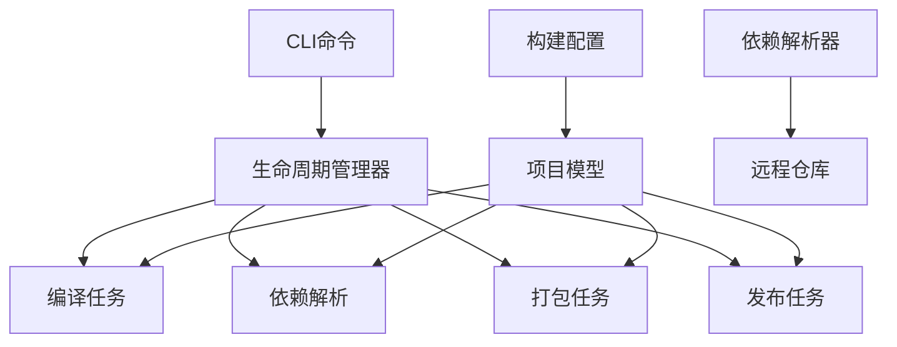

**图源**
- [LifecycleManager.java](file://src/main/java/org/jcnc/snow/pkg/lifecycle/LifecycleManager.java)
- [Task.java](file://src/main/java/org/jcnc/snow/pkg/tasks/Task.java)
- [Project.java](file://src/main/java/org/jcnc/snow/pkg/model/Project.java)

## 编译任务配置与流程

### CompileTask配置选项
`CompileTask`是Snow系统的核心编译组件，支持多种配置选项：

- **输出文件名**: 通过`-o`参数指定输出文件名
- **源码目录**: 通过`-d`参数指定源码目录
- **自动运行**: 使用`run`参数在编译后自动执行生成的字节码
- **调试模式**: 使用`--debug`参数启用调试输出

### 编译流程
编译流程遵循以下步骤：

1. 解析命令行参数
2. 收集源码文件（.snow）
3. 执行词法分析和语法分析
4. 进行语义分析
5. 生成中间表示（IR）
6. 将IR转换为VM字节码
7. 输出到.water文件
8. 可选：自动运行生成的程序

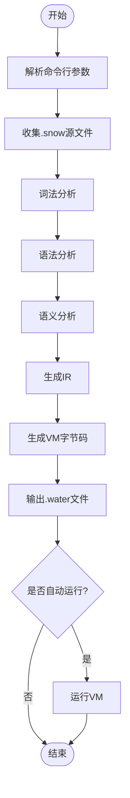

**图源**
- [CompileTask.java](file://src/main/java/org/jcnc/snow/pkg/tasks/CompileTask.java#L1-L425)
- [VMCodeGenerator.java](file://src/main/java/org/jcnc/snow/compiler/backend/builder/VMCodeGenerator.java)

**节源**
- [CompileTask.java](file://src/main/java/org/jcnc/snow/pkg/tasks/CompileTask.java#L1-L425)

## 任务接口与生命周期管理

### Task接口执行契约
`Task`接口定义了所有构建任务的统一执行契约：

```java
public interface Task {
    void run() throws Exception;
}
```

所有具体任务类都必须实现此接口，确保任务执行的一致性和可预测性。

### 生命周期管理
`LifecycleManager`负责管理任务的生命周期，支持以下阶段：

- 初始化（INIT）
- 依赖解析（RESOLVE_DEPENDENCIES）
- 编译（COMPILE）
- 打包（PACKAGE）
- 发布（PUBLISH）
- 清理（CLEAN）

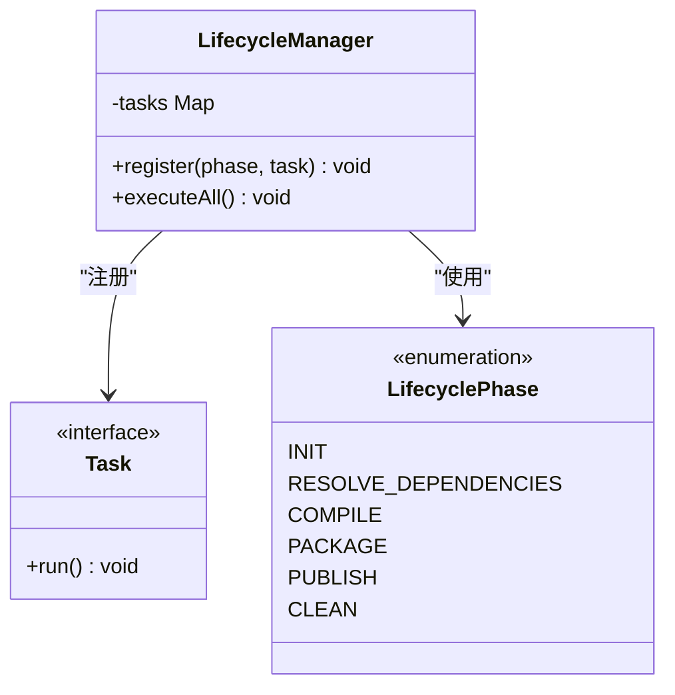

**图源**
- [Task.java](file://src/main/java/org/jcnc/snow/pkg/tasks/Task.java#L1-L21)
- [LifecycleManager.java](file://src/main/java/org/jcnc/snow/pkg/lifecycle/LifecycleManager.java#L1-L66)
- [LifecyclePhase.java](file://src/main/java/org/jcnc/snow/pkg/lifecycle/LifecyclePhase.java#L1-L34)

**节源**
- [Task.java](file://src/main/java/org/jcnc/snow/pkg/tasks/Task.java#L1-L21)
- [LifecycleManager.java](file://src/main/java/org/jcnc/snow/pkg/lifecycle/LifecycleManager.java#L1-L66)

## 构建配置解析

### BuildConfiguration构建参数
`BuildConfiguration`类封装了构建过程中的所有配置选项：

- **源目录**: 指定源码文件的根目录
- **输出目录**: 指定编译输出的目标目录
- **依赖路径**: 指定依赖库的搜索路径
- **模板变量**: 支持`@{key}`格式的变量替换

### 配置解析方式
配置解析通过`fromFlatMap`静态工厂方法实现：

1. 接收扁平化的配置映射
2. 处理模板变量替换
3. 创建不可变的配置对象

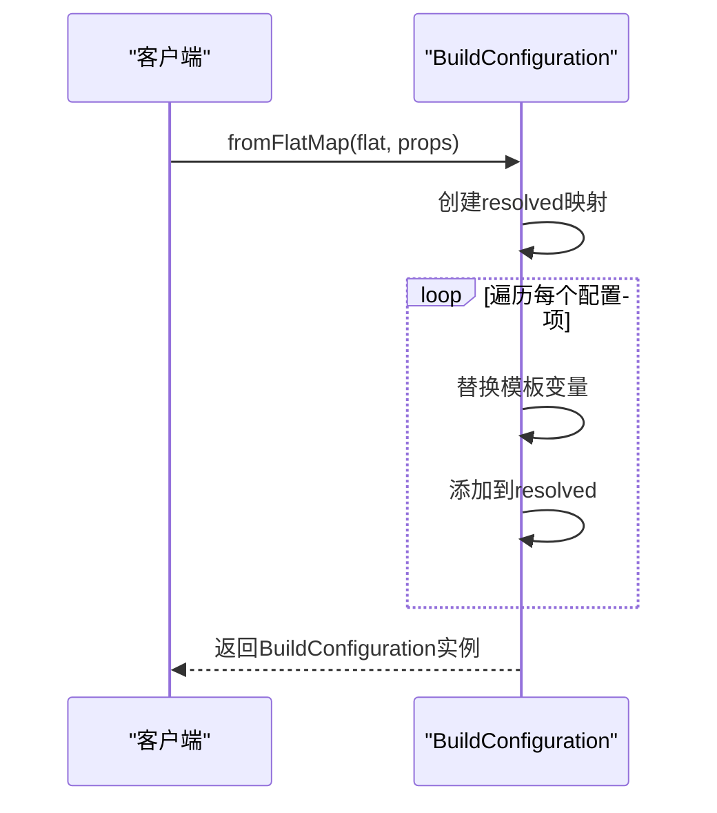

**图源**
- [BuildConfiguration.java](file://src/main/java/org/jcnc/snow/pkg/model/BuildConfiguration.java#L1-L66)

**节源**
- [BuildConfiguration.java](file://src/main/java/org/jcnc/snow/pkg/model/BuildConfiguration.java#L1-L66)

## 项目模型结构

### Project模型组成
`Project`类表示一个完整的软件包项目，包含以下组成部分：

- **元数据**: 组织名、构件名、版本号等
- **属性**: 额外的配置属性
- **仓库**: 远程仓库列表
- **依赖**: 项目依赖列表
- **构建配置**: 构建过程的配置

### 模型组织方式
项目模型通过`fromFlatMap`静态工厂方法从扁平化配置创建：

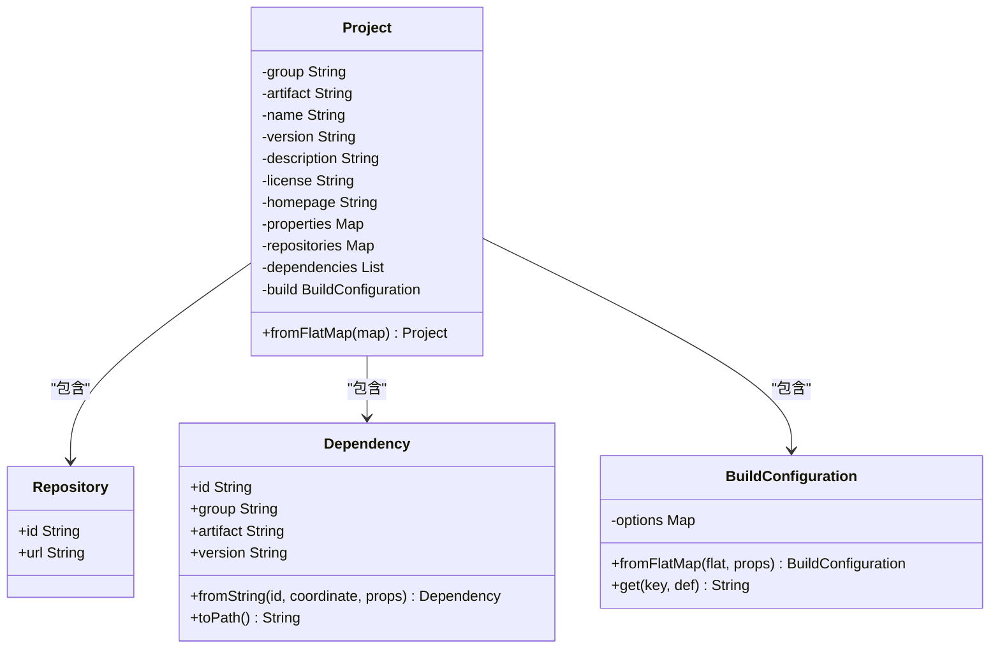

**图源**
- [Project.java](file://src/main/java/org/jcnc/snow/pkg/model/Project.java#L1-L234)
- [Repository.java](file://src/main/java/org/jcnc/snow/pkg/model/Repository.java#L1-L18)
- [Dependency.java](file://src/main/java/org/jcnc/snow/pkg/model/Dependency.java#L1-L87)

**节源**
- [Project.java](file://src/main/java/org/jcnc/snow/pkg/model/Project.java#L1-L234)

## 依赖解析机制

### 依赖解析算法
`DependencyResolver`采用以下算法解析依赖：

1. 检查本地缓存是否存在依赖
2. 如果不存在，则从配置的远程仓库下载
3. 下载的依赖存储到本地缓存

### 版本冲突解决策略
系统采用以下策略处理版本冲突：

- 优先使用项目直接声明的依赖版本
- 传递性依赖的版本冲突通过依赖收敛解决
- 支持通过属性映射进行版本覆盖

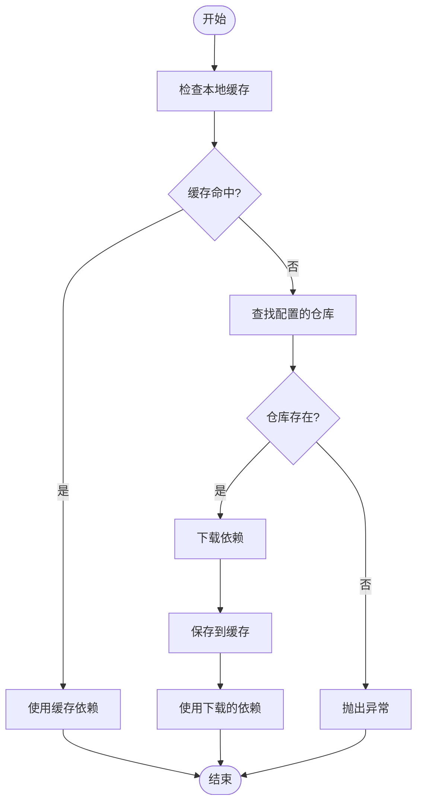

**图源**
- [DependencyResolver.java](file://src/main/java/org/jcnc/snow/pkg/resolver/DependencyResolver.java#L1-L84)
- [Dependency.java](file://src/main/java/org/jcnc/snow/pkg/model/Dependency.java#L1-L87)

**节源**
- [DependencyResolver.java](file://src/main/java/org/jcnc/snow/pkg/resolver/DependencyResolver.java#L1-L84)

## 生命周期管理器

### 生命周期阶段
`LifecycleManager`定义了以下生命周期阶段：

- **初始化**: 项目初始化和环境准备
- **编译**: 源码编译为字节码
- **测试**: 执行单元测试
- **打包**: 将编译结果打包
- **发布**: 发布到远程仓库
- **清理**: 清理构建产物

### 钩子机制
系统提供灵活的钩子机制：

- 每个生命周期阶段可以注册一个任务
- 任务按阶段顺序执行
- 支持覆盖已注册的任务

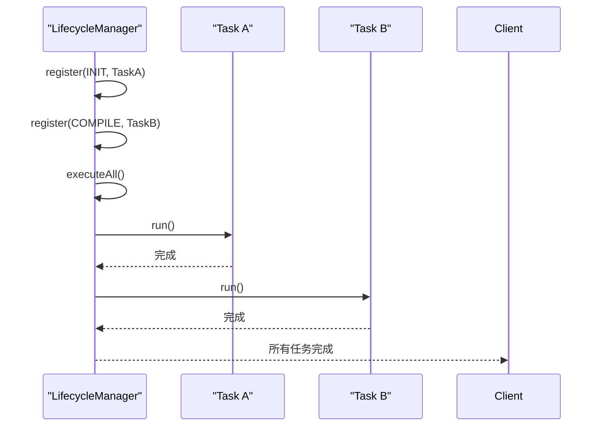

**图源**
- [LifecycleManager.java](file://src/main/java/org/jcnc/snow/pkg/lifecycle/LifecycleManager.java#L1-L66)
- [LifecyclePhase.java](file://src/main/java/org/jcnc/snow/pkg/lifecycle/LifecyclePhase.java#L1-L34)

**节源**
- [LifecycleManager.java](file://src/main/java/org/jcnc/snow/pkg/lifecycle/LifecycleManager.java#L1-L66)

## 运行任务执行环境

### RunTask执行环境配置
`RunTask`负责执行已编译的VM字节码程序：

- 第一个参数为.water程序路径
- 后续参数为传递给程序的命令行参数
- 通过VMLauncher启动虚拟机

### 参数传递方法
参数通过数组形式传递：

```java
RunTask task = new RunTask("program.water", "arg1", "arg2");
task.run();
```

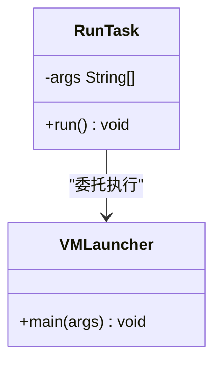

**图源**
- [RunTask.java](file://src/main/java/org/jcnc/snow/pkg/tasks/RunTask.java#L1-L41)
- [VMLauncher.java](file://src/main/java/org/jcnc/snow/vm/VMLauncher.java)

**节源**
- [RunTask.java](file://src/main/java/org/jcnc/snow/pkg/tasks/RunTask.java#L1-L41)

## 线程安全与性能特征

### 线程安全性
系统组件的线程安全性如下：

- `CompileTask`: 无状态，线程安全
- `CleanTask`: 无状态，线程安全
- `DependencyResolver`: 实例级线程安全
- `GlobalConstTable`: 全局线程安全

### 性能优化建议
针对大规模依赖解析的性能优化建议：

- 合理使用本地缓存减少网络请求
- 并行处理独立的依赖解析任务
- 预加载常用依赖到内存
- 使用ConcurrentHashMap等高性能集合

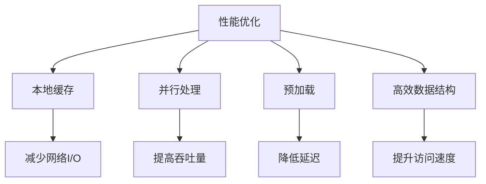

**图源**
- [DependencyResolver.java](file://src/main/java/org/jcnc/snow/pkg/resolver/DependencyResolver.java#L1-L84)
- [GlobalConstTable.java](file://src/main/java/org/jcnc/snow/compiler/ir/common/GlobalConstTable.java#L1-L40)

**节源**
- [DependencyResolver.java](file://src/main/java/org/jcnc/snow/pkg/resolver/DependencyResolver.java#L1-L84)

## 任务扩展最佳实践

### 创建自定义构建任务
创建自定义任务的步骤：

1. 实现`Task`接口
2. 实现`run()`方法
3. 注册到`LifecycleManager`

```java
public class CustomTask implements Task {
    @Override
    public void run() throws Exception {
        // 自定义任务逻辑
    }
}
```

### 集成第三方工具
集成第三方工具的方法：

- 将工具调用封装为任务
- 通过ProcessBuilder执行外部命令
- 处理输入输出流

### 实现增量编译
增量编译的实现策略：

- 跟踪文件修改时间戳
- 只编译发生变化的文件
- 缓存未变化文件的编译结果

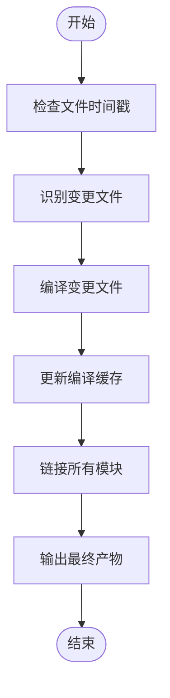

**图源**
- [Task.java](file://src/main/java/org/jcnc/snow/pkg/tasks/Task.java#L1-L21)
- [CompileTask.java](file://src/main/java/org/jcnc/snow/pkg/tasks/CompileTask.java#L1-L425)

**节源**
- [Task.java](file://src/main/java/org/jcnc/snow/pkg/tasks/Task.java#L1-L21)

## 完整构建流程示例

### 构建任务执行流程
完整的构建任务执行流程如下：

1. 初始化项目结构
2. 解析项目依赖
3. 编译源码
4. 执行测试
5. 打包产物
6. 发布到仓库

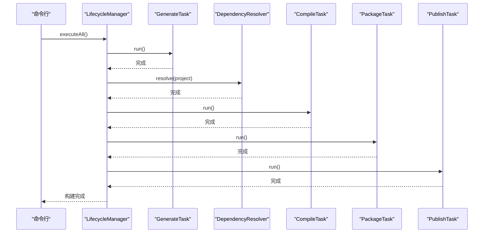

**图源**
- [LifecycleManager.java](file://src/main/java/org/jcnc/snow/pkg/lifecycle/LifecycleManager.java#L1-L66)
- [GenerateTask.java](file://src/main/java/org/jcnc/snow/pkg/tasks/GenerateTask.java#L1-L89)
- [DependencyResolver.java](file://src/main/java/org/jcnc/snow/pkg/resolver/DependencyResolver.java#L1-L84)
- [CompileTask.java](file://src/main/java/org/jcnc/snow/pkg/tasks/CompileTask.java#L1-L425)
- [PackageTask.java](file://src/main/java/org/jcnc/snow/pkg/tasks/PackageTask.java#L1-L71)
- [PublishTask.java](file://src/main/java/org/jcnc/snow/pkg/tasks/PublishTask.java#L1-L35)

**节源**
- [LifecycleManager.java](file://src/main/java/org/jcnc/snow/pkg/lifecycle/LifecycleManager.java#L1-L66)