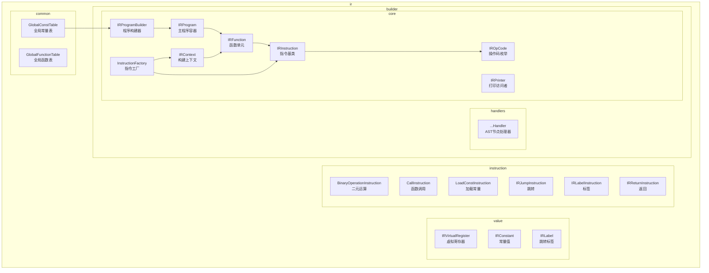
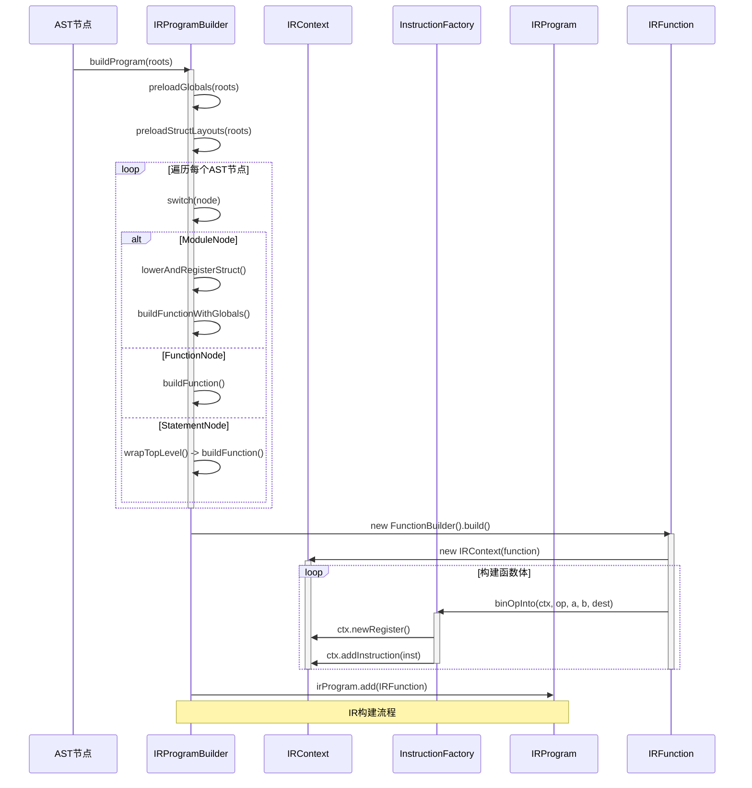
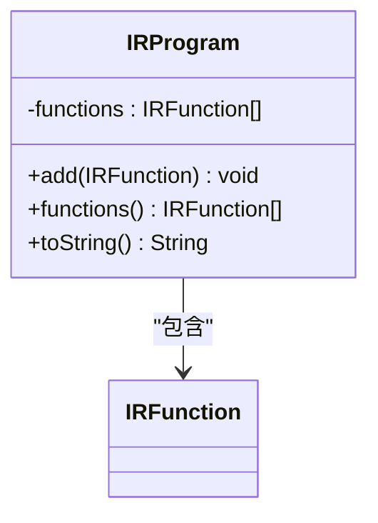
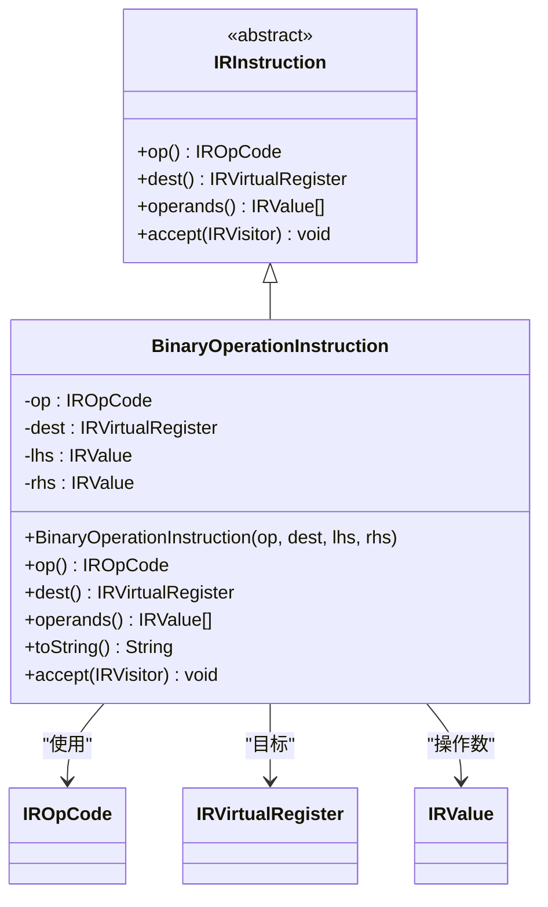
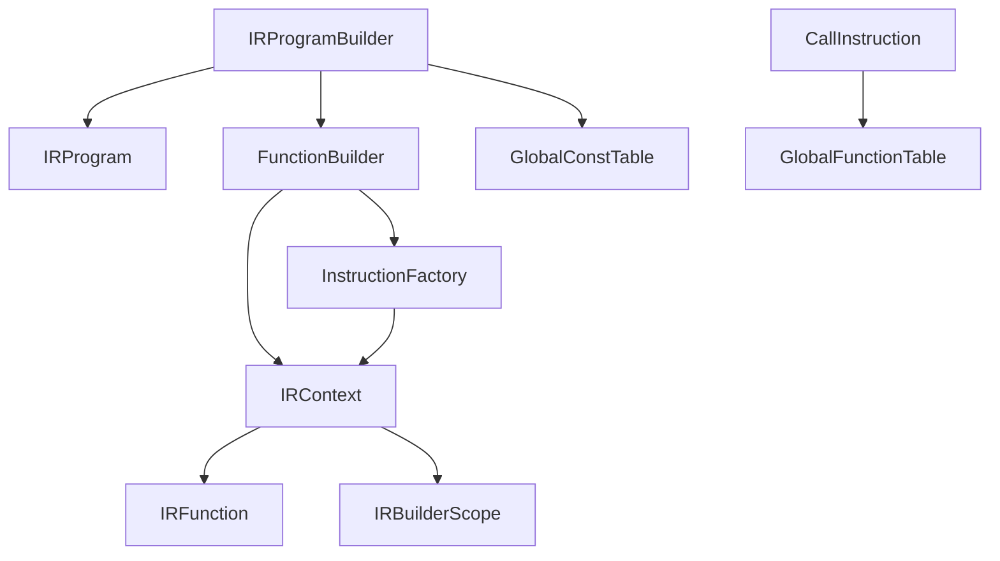

# 编译器API

<cite>
**本文档引用的文件**   
- [IRProgram.java](file://src/main/java/org/jcnc/snow/compiler/ir/core/IRProgram.java)
- [IRProgramBuilder.java](file://src/main/java/org/jcnc/snow/compiler/ir/builder/core/IRProgramBuilder.java)
- [IRFunction.java](file://src/main/java/org/jcnc/snow/compiler/ir/core/IRFunction.java)
- [IRInstruction.java](file://src/main/java/org/jcnc/snow/compiler/ir/core/IRInstruction.java)
- [BinaryOperationInstruction.java](file://src/main/java/org/jcnc/snow/compiler/ir/instruction/BinaryOperationInstruction.java)
- [CallInstruction.java](file://src/main/java/org/jcnc/snow/compiler/ir/instruction/CallInstruction.java)
- [IRVirtualRegister.java](file://src/main/java/org/jcnc/snow/compiler/ir/value/IRVirtualRegister.java)
- [IRConstant.java](file://src/main/java/org/jcnc/snow/compiler/ir/value/IRConstant.java)
- [IRPrinter.java](file://src/main/java/org/jcnc/snow/compiler/ir/core/IRPrinter.java)
- [GlobalConstTable.java](file://src/main/java/org/jcnc/snow/compiler/ir/common/GlobalConstTable.java)
- [IRContext.java](file://src/main/java/org/jcnc/snow/compiler/ir/builder/core/IRContext.java)
- [InstructionFactory.java](file://src/main/java/org/jcnc/snow/compiler/ir/builder/core/InstructionFactory.java)
- [IROpCode.java](file://src/main/java/org/jcnc/snow/compiler/ir/core/IROpCode.java)
- [IRLabel.java](file://src/main/java/org/jcnc/snow/compiler/ir/value/IRLabel.java)
</cite>

## 目录
1. [简介](#简介)
2. [项目结构](#项目结构)
3. [核心组件](#核心组件)
4. [架构概述](#架构概述)
5. [详细组件分析](#详细组件分析)
6. [依赖分析](#依赖分析)
7. [性能考虑](#性能考虑)
8. [故障排除指南](#故障排除指南)
9. [结论](#结论)

## 简介
本文档为Snow编译器的API参考文档，重点围绕其核心中间表示（Intermediate Representation, IR）系统。文档详细说明了如何通过`IRProgramBuilder`从抽象语法树（AST）构建完整的`IRProgram`，并深入解析了`IRFunction`、`IRInstruction`、`IRVirtualRegister`和`IRConstant`等关键IR组件的结构与使用方法。同时，文档涵盖了IR的序列化、打印、线程安全性和性能特征，并为开发者提供了构建高效IR代码的最佳实践。

## 项目结构
Snow编译器的IR系统位于`src/main/java/org/jcnc/snow/compiler/ir`包下，采用分层设计，各子包职责明确。

**图源**
- [IRProgram.java](file://src/main/java/org/jcnc/snow/compiler/ir/core/IRProgram.java)
- [IRProgramBuilder.java](file://src/main/java/org/jcnc/snow/compiler/ir/builder/core/IRProgramBuilder.java)
- [IRFunction.java](file://src/main/java/org/jcnc/snow/compiler/ir/core/IRFunction.java)
- [IRInstruction.java](file://src/main/java/org/jcnc/snow/compiler/ir/core/IRInstruction.java)
- [IROpCode.java](file://src/main/java/org/jcnc/snow/compiler/ir/core/IROpCode.java)
- [IRContext.java](file://src/main/java/org/jcnc/snow/compiler/ir/builder/core/IRContext.java)
- [InstructionFactory.java](file://src/main/java/org/jcnc/snow/compiler/ir/builder/core/InstructionFactory.java)
- [GlobalConstTable.java](file://src/main/java/org/jcnc/snow/compiler/ir/common/GlobalConstTable.java)

## 核心组件
Snow编译器的IR系统由一系列核心类构成，它们共同协作，将高级语言的AST转换为低级的、可优化的中间代码。`IRProgram`是整个IR的顶层容器，`IRFunction`代表单个函数的IR，`IRInstruction`是构成函数体的基本指令单元。`IRVirtualRegister`和`IRConstant`作为`IRValue`的实现，是所有指令的操作数。`IRProgramBuilder`是构建IR的入口点，而`InstructionFactory`则提供了便捷的指令创建方法。

**节源**
- [IRProgram.java](file://src/main/java/org/jcnc/snow/compiler/ir/core/IRProgram.java#L1-L62)
- [IRFunction.java](file://src/main/java/org/jcnc/snow/compiler/ir/core/IRFunction.java#L1-L141)
- [IRInstruction.java](file://src/main/java/org/jcnc/snow/compiler/ir/core/IRInstruction.java#L1-L62)
- [IRVirtualRegister.java](file://src/main/java/org/jcnc/snow/compiler/ir/value/IRVirtualRegister.java#L1-L34)
- [IRConstant.java](file://src/main/java/org/jcnc/snow/compiler/ir/value/IRConstant.java#L1-L101)

## 架构概述
Snow编译器的IR生成流程遵循一个清晰的架构：首先，`IRProgramBuilder`接收AST的根节点列表，通过预扫描收集全局常量和结构体布局。接着，它遍历每个AST节点，利用`FunctionBuilder`等内部组件，将函数、模块和顶层语句逐步转换为`IRFunction`。在构建单个`IRFunction`时，`IRContext`管理着当前的作用域和寄存器分配，`InstructionFactory`被用来创建具体的`IRInstruction`实例。最终，所有生成的`IRFunction`被添加到`IRProgram`中，形成完整的中间表示。

**图源**
- [IRProgramBuilder.java](file://src/main/java/org/jcnc/snow/compiler/ir/builder/core/IRProgramBuilder.java#L1-L385)
- [IRContext.java](file://src/main/java/org/jcnc/snow/compiler/ir/builder/core/IRContext.java#L1-L125)
- [InstructionFactory.java](file://src/main/java/org/jcnc/snow/compiler/ir/builder/core/InstructionFactory.java#L1-L214)
- [IRFunction.java](file://src/main/java/org/jcnc/snow/compiler/ir/core/IRFunction.java#L1-L141)

## 详细组件分析
本节将深入分析IR系统中的各个关键组件，包括它们的创建、管理、序列化方法以及最佳实践。

### IRProgram与IRProgramBuilder分析
`IRProgram`是整个中间表示的根容器，它负责管理程序中所有的`IRFunction`。开发者通过`IRProgramBuilder`来创建`IRProgram`实例。

#### IRProgram的创建与管理
`IRProgram`是一个不可变的容器，其内部使用`ArrayList`存储函数。通过`add(IRFunction)`方法可以向程序中添加新的函数。`functions()`方法返回一个不可变的函数列表，确保了IR结构的封装性和完整性。`toString()`方法提供了IR程序的文本表示，便于调试和日志输出。

**图源**
- [IRProgram.java](file://src/main/java/org/jcnc/snow/compiler/ir/core/IRProgram.java#L1-L62)

#### IRProgramBuilder的构建流程
`IRProgramBuilder`是构建`IRProgram`的入口。它是一个无状态的工具类，主要流程如下：
1.  **预扫描**：调用`preloadGlobals()`和`preloadStructLayouts()`，分别收集全局常量和结构体字段布局，为后续的常量折叠和成员访问做准备。
2.  **遍历处理**：遍历AST根节点列表，根据节点类型进行处理：
    *   `ModuleNode`：先处理结构体（`lowerAndRegisterStruct`），再处理模块内的函数。
    *   `FunctionNode`：直接构建为`IRFunction`。
    *   `StatementNode`：包装成名为`_start`的特殊函数，以支持脚本模式。
3.  **构建函数**：对于每个函数节点，委托给`FunctionBuilder`进行实际的IR指令生成。

**节源**
- [IRProgramBuilder.java](file://src/main/java/org/jcnc/snow/compiler/ir/builder/core/IRProgramBuilder.java#L1-L385)

### IRFunction分析
`IRFunction`是IR系统中表示单个函数的核心类，它封装了函数的名称、参数、指令序列和虚拟寄存器分配器。

#### 结构与参数管理
`IRFunction`的结构包括：
*   **name**：函数的名称，用于标识。
*   **parameters**：一个`List<IRVirtualRegister>`，按声明顺序存储函数的正式参数。
*   **body**：一个`List<IRInstruction>`，存储函数体内的所有IR指令。
*   **regCounter**：一个计数器，用于生成唯一的虚拟寄存器ID。

通过`addParameter(IRVirtualRegister)`方法可以将虚拟寄存器添加到参数列表中。`parameters()`方法返回参数列表的只读视图。

#### 基本块组织方式
Snow的IR目前采用线性指令列表的形式，而非显式的“基本块”（Basic Block）对象。控制流指令（如`IRJumpInstruction`和`IRLabelInstruction`）隐式地定义了基本块的边界。例如，一个`IRLabelInstruction`标志着一个新基本块的开始，而`IRJumpInstruction`则标志着一个基本块的结束。这种设计简化了IR的构建，但将基本块的识别和分析留给了后续的优化阶段。

**节源**
- [IRFunction.java](file://src/main/java/org/jcnc/snow/compiler/ir/core/IRFunction.java#L1-L141)

### IRInstruction分析
`IRInstruction`是所有IR指令的抽象基类，它定义了指令的基本接口。

#### 创建方法与操作数管理
`IRInstruction`是一个抽象类，具体的指令通过继承它来实现。其核心方法包括：
*   `op()`：返回指令的操作码（`IROpCode`），用于区分不同类型的指令。
*   `dest()`：返回指令的目标虚拟寄存器，如果指令没有目标寄存器，则返回`null`。
*   `operands()`：返回指令的操作数列表，通常包含源操作数。
*   `accept(IRVisitor)`：实现访问者模式，允许外部组件（如代码生成器或优化器）对指令进行处理。

#### BinaryOperationInstruction详解
`BinaryOperationInstruction`表示形如`dest = lhs OP rhs`的二元运算指令。它通过`IROpCode`指定运算类型（如`ADD_I32`、`MUL_F32`等），并持有目标寄存器和左右操作数。`toString()`方法的输出格式为`%dest = OP %lhs, %rhs`。

**图源**
- [IRInstruction.java](file://src/main/java/org/jcnc/snow/compiler/ir/core/IRInstruction.java#L1-L62)
- [BinaryOperationInstruction.java](file://src/main/java/org/jcnc/snow/compiler/ir/instruction/BinaryOperationInstruction.java#L1-L105)

#### CallInstruction详解
`CallInstruction`表示一次函数调用，其格式为`dest = CALL functionName, arg1, arg2, ...`。如果被调函数返回`void`，则`dest`为`null`。该指令持有目标寄存器（可选）、被调函数的全限定名和实参列表。`isVoidReturn()`方法通过查询`GlobalFunctionTable`来判断返回类型。

**节源**
- [CallInstruction.java](file://src/main/java/org/jcnc/snow/compiler/ir/instruction/CallInstruction.java#L1-L111)

### IRVirtualRegister与IRConstant分析
`IRVirtualRegister`和`IRConstant`是`IRValue`接口的两个具体实现，它们是所有IR指令的操作数。

#### IRVirtualRegister的分配机制
`IRVirtualRegister`代表一个静态单赋值（SSA）形式的虚拟寄存器。每个`IRFunction`维护一个`regCounter`，每次调用`newRegister()`时，都会创建一个ID递增的新寄存器。这确保了每个虚拟寄存器在程序中只被赋值一次，符合SSA形式，有利于后续的优化。

#### IRConstant的类型支持
`IRConstant`用于表示编译期已知的常量值。它支持多种类型：
*   **数值**：通过`fromNumber(String)`工厂方法，可以解析整数、浮点数，并支持下划线分隔符和类型后缀（如`123L`、`3.14f`）。
*   **字符串**：通过`fromString(String)`创建。
*   **布尔值**：通过`fromBoolean(boolean)`创建。
*   **任意对象**：通过`fromObject(Object)`创建。

**节源**
- [IRVirtualRegister.java](file://src/main/java/org/jcnc/snow/compiler/ir/value/IRVirtualRegister.java#L1-L34)
- [IRConstant.java](file://src/main/java/org/jcnc/snow/compiler/ir/value/IRConstant.java#L1-L101)

### IRPrinter分析
`IRPrinter`是一个抽象类，实现了`IRVisitor`接口，用于打印IR指令。它为不同类型的指令提供了默认的`visit`方法，例如`visit(IRAddInstruction)`会输出`Add: <inst>`。开发者可以继承`IRPrinter`并重写这些方法，以实现自定义的打印格式或调试逻辑。

**节源**
- [IRPrinter.java](file://src/main/java/org/jcnc/snow/compiler/ir/core/IRPrinter.java#L1-L58)

## 依赖分析
IR系统内部组件之间存在清晰的依赖关系。`IRProgramBuilder`依赖于`IRProgram`和`FunctionBuilder`来构建程序。`FunctionBuilder`在构建过程中依赖`IRContext`来管理作用域和寄存器，并使用`InstructionFactory`来创建指令。`InstructionFactory`又依赖`IRContext`来分配寄存器和添加指令。`CallInstruction`依赖`GlobalFunctionTable`来查询函数的返回类型。`IRProgramBuilder`在预扫描阶段依赖`GlobalConstTable`来注册和查询全局常量。

**图源**
- [IRProgramBuilder.java](file://src/main/java/org/jcnc/snow/compiler/ir/builder/core/IRProgramBuilder.java)
- [FunctionBuilder.java](file://src/main/java/org/jcnc/snow/compiler/ir/builder/statement/FunctionBuilder.java)
- [IRContext.java](file://src/main/java/org/jcnc/snow/compiler/ir/builder/core/IRContext.java)
- [InstructionFactory.java](file://src/main/java/org/jcnc/snow/compiler/ir/builder/core/InstructionFactory.java)
- [CallInstruction.java](file://src/main/java/org/jcnc/snow/compiler/ir/instruction/CallInstruction.java)
- [GlobalFunctionTable.java](file://src/main/java/org/jcnc/snow/compiler/ir/common/GlobalFunctionTable.java)
- [GlobalConstTable.java](file://src/main/java/org/jcnc/snow/compiler/ir/common/GlobalConstTable.java)

## 性能考虑
### 线程安全性
*   **IRProgramBuilder**：该类是无状态的，其所有方法都是静态的，因此是线程安全的。
*   **GlobalConstTable**：使用`ConcurrentHashMap`存储常量，保证了注册和查询操作的线程安全。
*   **IRFunction**：`IRFunction`实例本身不是线程安全的。在构建阶段，每个`IRFunction`通常由单个线程独占构建。构建完成后，`IRFunction`被视为不可变对象，可以安全地在多个线程间共享和读取。

### 内存消耗与优化建议
*   **内存消耗**：IR构建过程中的主要内存消耗来自于`IRProgram`中存储的`IRFunction`列表和每个`IRFunction`内部的指令列表。虚拟寄存器和常量对象的开销相对较小。
*   **优化建议**：
    1.  **避免重复常量**：对于相同的常量值，应尽量复用`IRConstant`实例，而不是创建多个副本。`GlobalConstTable`有助于跨模块的常量去重。
    2.  **高效构建表达式**：使用`InstructionFactory`提供的`binOp`和`loadConst`等便捷方法，可以减少手动创建指令和寄存器的样板代码，提高构建效率。
    3.  **正确管理作用域**：`IRBuilderScope`负责管理变量名到虚拟寄存器的映射。确保在正确的上下文中声明和查找变量，可以避免作用域混乱导致的错误。

**节源**
- [IRProgramBuilder.java](file://src/main/java/org/jcnc/snow/compiler/ir/builder/core/IRProgramBuilder.java#L1-L385)
- [GlobalConstTable.java](file://src/main/java/org/jcnc/snow/compiler/ir/common/GlobalConstTable.java#L1-L72)
- [IRFunction.java](file://src/main/java/org/jcnc/snow/compiler/ir/core/IRFunction.java#L1-L141)

## 故障排除指南
*   **构建失败**：如果`IRProgramBuilder.buildProgram()`抛出`IllegalStateException`，通常是因为遇到了不支持的顶层节点类型。请检查AST的根节点列表是否包含预期的`ModuleNode`、`FunctionNode`或`StatementNode`。
*   **找不到函数**：在`CallInstruction`中，如果被调函数的全限定名拼写错误，`GlobalFunctionTable.getReturnType()`将返回`null`，可能导致后续逻辑错误。请确保函数名正确无误。
*   **寄存器冲突**：虽然`IRFunction.newRegister()`保证了ID的唯一性，但如果在代码中错误地重用了同一个`IRVirtualRegister`对象来表示不同的值，可能会导致逻辑错误。应始终通过`newRegister()`获取新的寄存器。

**节源**
- [IRProgramBuilder.java](file://src/main/java/org/jcnc/snow/compiler/ir/builder/core/IRProgramBuilder.java#L1-L385)
- [CallInstruction.java](file://src/main/java/org/jcnc/snow/compiler/ir/instruction/CallInstruction.java#L1-L111)
- [IRFunction.java](file://src/main/java/org/jcnc/snow/compiler/ir/core/IRFunction.java#L1-L141)

## 结论
Snow编译器的IR系统提供了一个强大且灵活的框架，用于将高级语言代码转换为中间表示。通过`IRProgramBuilder`和`InstructionFactory`等工具，开发者可以高效地从AST构建出结构化的IR。`IRFunction`和`IRInstruction`的设计清晰地分离了函数和指令的概念，而`IRVirtualRegister`和`IRConstant`则为SSA形式的代码生成提供了基础。该系统在保证线程安全的同时，也为后续的优化和代码生成阶段提供了坚实的基础。遵循最佳实践，如复用常量和正确管理作用域，可以构建出高效且易于维护的IR代码。