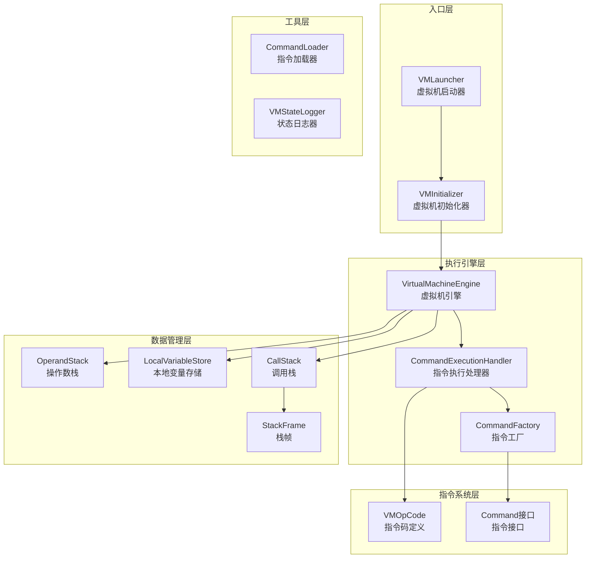
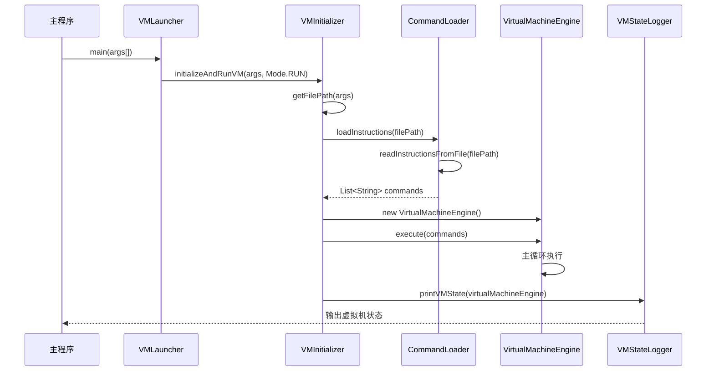
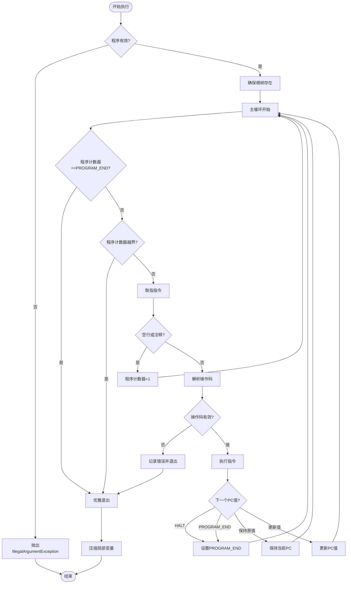
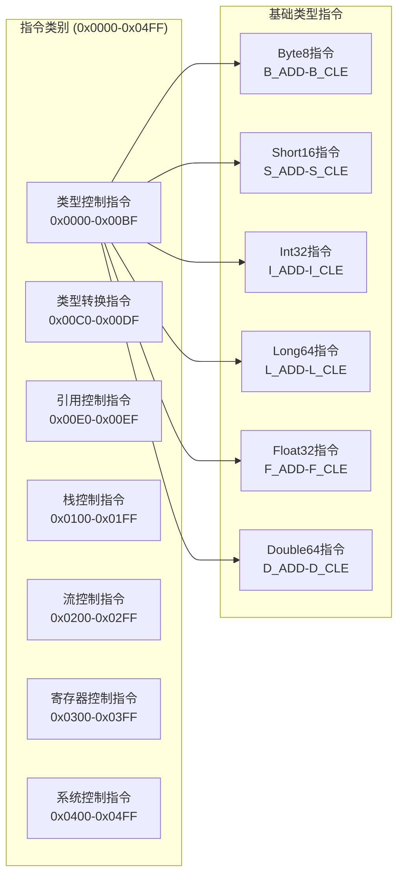
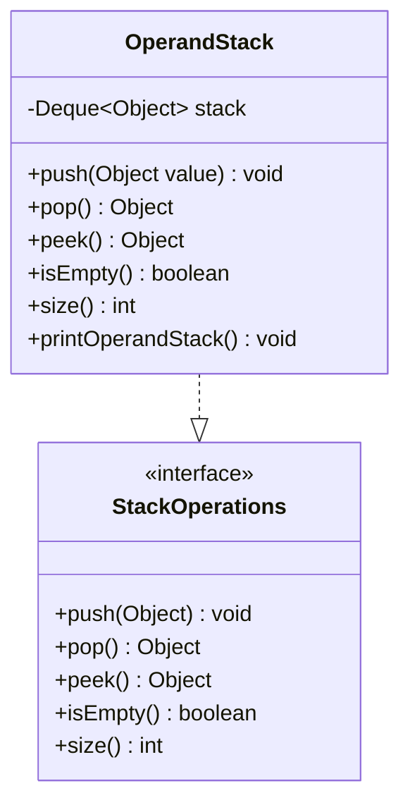
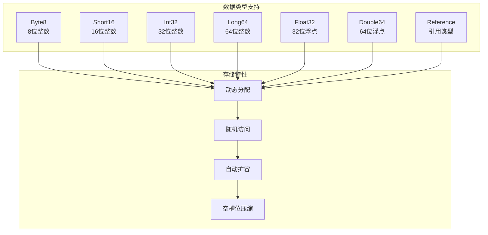
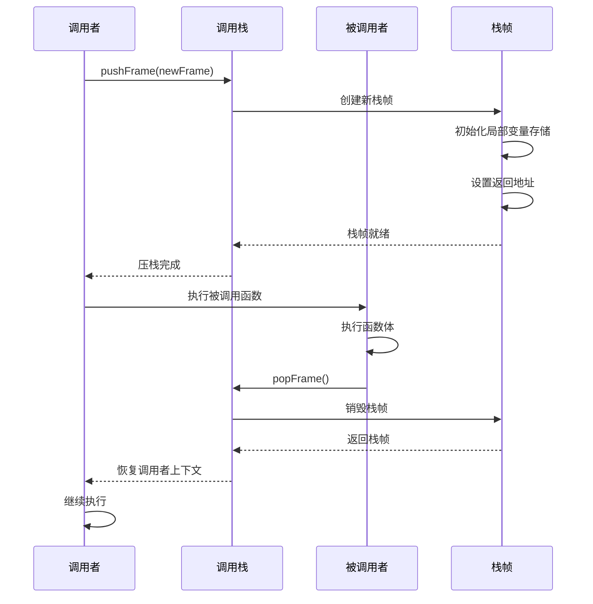
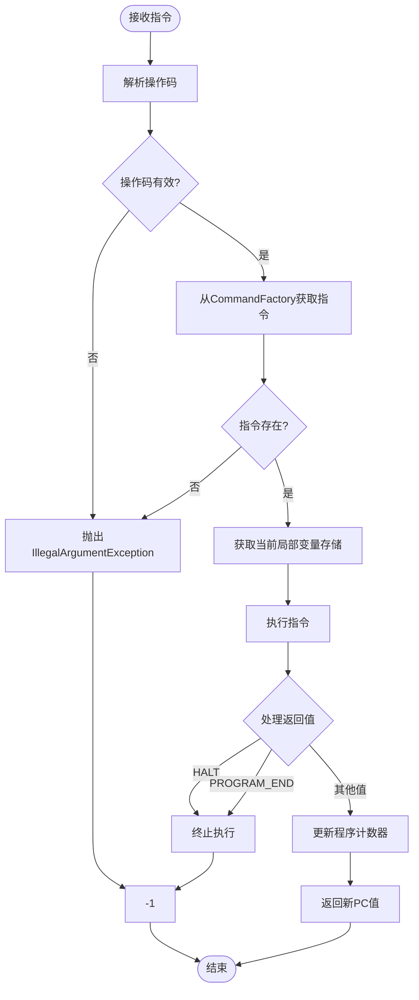
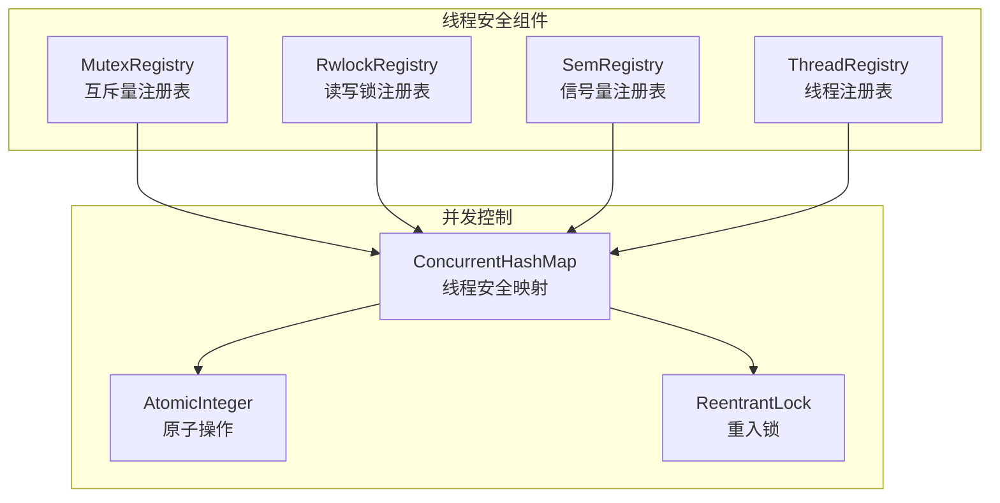
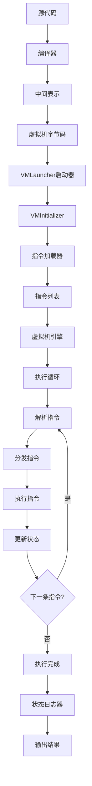

# Snow虚拟机API参考文档

<cite>
**本文档中引用的文件**
- [VMLauncher.java](file://src/main/java/org/jcnc/snow/vm/VMLauncher.java)
- [VirtualMachineEngine.java](file://src/main/java/org/jcnc/snow/vm/engine/VirtualMachineEngine.java)
- [VMOpCode.java](file://src/main/java/org/jcnc/snow/vm/engine/VMOpCode.java)
- [CommandExecutionHandler.java](file://src/main/java/org/jcnc/snow/vm/execution/CommandExecutionHandler.java)
- [CommandFactory.java](file://src/main/java/org/jcnc/snow/vm/factories/CommandFactory.java)
- [OperandStack.java](file://src/main/java/org/jcnc/snow/vm/module/OperandStack.java)
- [LocalVariableStore.java](file://src/main/java/org/jcnc/snow/vm/module/LocalVariableStore.java)
- [CallStack.java](file://src/main/java/org/jcnc/snow/vm/module/CallStack.java)
- [StackFrame.java](file://src/main/java/org/jcnc/snow/vm/module/StackFrame.java)
- [VMInitializer.java](file://src/main/java/org/jcnc/snow/vm/VMInitializer.java)
- [CommandLoader.java](file://src/main/java/org/jcnc/snow/vm/execution/CommandLoader.java)
- [Command.java](file://src/main/java/org/jcnc/snow/vm/interfaces/Command.java)
- [VMStateLogger.java](file://src/main/java/org/jcnc/snow/vm/utils/VMStateLogger.java)
</cite>

## 目录
1. [简介](#简介)
2. [项目架构概览](#项目架构概览)
3. [VMLauncher启动流程](#vm-launcher启动流程)
4. [VirtualMachineEngine核心执行循环](#virtualmachineengine核心执行循环)
5. [VMOpCode指令集架构](#vmopcode指令集架构)
6. [OperandStack栈操作](#operandstack栈操作)
7. [LocalVariableStore槽位管理](#localvariablestore槽位管理)
8. [CallStack调用帧管理](#callstack调用帧管理)
9. [CommandExecutionHandler指令处理](#commandexecutionhandler指令处理)
10. [线程安全性与性能特征](#线程安全性与性能特征)
11. [开发者最佳实践](#开发者最佳实践)
12. [完整程序执行流程](#完整程序执行流程)

## 简介

Snow虚拟机是一个基于栈的解释型虚拟机，专为Snow编程语言设计。它提供了完整的虚拟机执行环境，包括指令解析、栈管理、内存管理和系统调用支持。本文档详细介绍了虚拟机的核心API接口和使用方法。

## 项目架构概览

Snow虚拟机采用模块化设计，主要包含以下核心组件：



**图表来源**
- [VMLauncher.java](file://src/main/java/org/jcnc/snow/vm/VMLauncher.java#L1-L51)
- [VirtualMachineEngine.java](file://src/main/java/org/jcnc/snow/vm/engine/VirtualMachineEngine.java#L1-L191)
- [CommandExecutionHandler.java](file://src/main/java/org/jcnc/snow/vm/execution/CommandExecutionHandler.java#L1-L61)

## VMLauncher启动流程

VMLauncher是虚拟机的入口点，负责初始化和启动虚拟机执行过程。

### 启动序列图



**图表来源**
- [VMLauncher.java](file://src/main/java/org/jcnc/snow/vm/VMLauncher.java#L40-L51)
- [VMInitializer.java](file://src/main/java/org/jcnc/snow/vm/VMInitializer.java#L40-L65)
- [CommandLoader.java](file://src/main/java/org/jcnc/snow/vm/execution/CommandLoader.java#L30-L49)

### 命令行参数解析

VMLauncher通过以下步骤处理命令行参数：

1. **参数验证**：检查传入的命令行参数
2. **文件路径提取**：从参数中提取指令文件路径
3. **模式设置**：设置虚拟机运行模式（RUN模式）

**章节来源**
- [VMLauncher.java](file://src/main/java/org/jcnc/snow/vm/VMLauncher.java#L40-L51)
- [VMInitializer.java](file://src/main/java/org/jcnc/snow/vm/VMInitializer.java#L40-L65)

## VirtualMachineEngine核心执行循环

VirtualMachineEngine是虚拟机的核心执行引擎，实现了完整的指令解释执行循环。

### 执行循环架构



**图表来源**
- [VirtualMachineEngine.java](file://src/main/java/org/jcnc/snow/vm/engine/VirtualMachineEngine.java#L60-L150)

### 程序计数器管理

虚拟机使用程序计数器（PC）来跟踪当前正在执行的指令位置：

- **PROGRAM_END**：哨兵值，表示程序正常结束
- **HALT**：哨兵值，表示立即终止程序
- **边界检查**：防止程序计数器越界访问

### 异常处理机制

虚拟机实现了多层次的异常处理：

1. **语法错误处理**：指令格式验证
2. **运行时错误处理**：栈溢出、除零异常等
3. **系统错误处理**：文件读取失败、内存不足等

**章节来源**
- [VirtualMachineEngine.java](file://src/main/java/org/jcnc/snow/vm/engine/VirtualMachineEngine.java#L60-L191)

## VMOpCode指令集架构

VMOpCode定义了虚拟机的完整指令集，按功能分为多个类别。

### 指令分类体系



**图表来源**
- [VMOpCode.java](file://src/main/java/org/jcnc/snow/vm/engine/VMOpCode.java#L30-L800)

### 指令编码规则

每个指令由以下部分组成：

1. **操作码（Opcode）**：4字节十六进制值（如0x0000）
2. **参数（Parameters）**：可变数量的操作数
3. **格式**：`OPCODE 参数1 参数2 ...`

### 常用指令示例

| 指令类别 | 操作码范围 | 功能描述 | 示例 |
|---------|-----------|----------|------|
| 字节8算术 | 0x0000-0x0005 | 字节8加减乘除、取反 | B_ADD, B_SUB, B_MUL, B_DIV, B_MOD, B_NEG |
| 条件跳转 | 0x000D-0x0012 | 字节8比较跳转 | B_CE, B_CNE, B_CG, B_CGE, B_CL, B_CLE |
| 栈操作 | 0x0100-0x0102 | 栈元素操作 | POP, DUP, SWAP |
| 流控制 | 0x0200-0x0202 | 控制流转移 | JUMP, CALL, RET |
| 系统控制 | 0x0400-0x0401 | 系统级操作 | HALT, SYSCALL |

**章节来源**
- [VMOpCode.java](file://src/main/java/org/jcnc/snow/vm/engine/VMOpCode.java#L30-L800)

## OperandStack栈操作

OperandStack提供了虚拟机操作数栈的完整管理功能。

### 栈操作方法



**图表来源**
- [OperandStack.java](file://src/main/java/org/jcnc/snow/vm/module/OperandStack.java#L15-L104)

### 栈操作详解

| 方法 | 功能 | 异常处理 | 使用场景 |
|------|------|----------|----------|
| push() | 将值压入栈顶 | 无 | 常量加载、中间结果存储 |
| pop() | 弹出栈顶元素 | IllegalStateException（空栈） | 运算结果获取、栈清理 |
| peek() | 查看栈顶元素 | EmptyStackException（空栈） | 条件判断、栈顶检查 |
| isEmpty() | 检查栈是否为空 | 无 | 循环条件判断 |
| size() | 获取栈大小 | 无 | 栈深度监控 |

### 表达式求值中的作用

OperandStack在表达式求值中扮演关键角色：

1. **中间结果存储**：临时保存运算过程中的中间结果
2. **参数传递**：函数调用时的参数传递
3. **控制流支持**：条件判断和循环控制的条件值存储

**章节来源**
- [OperandStack.java](file://src/main/java/org/jcnc/snow/vm/module/OperandStack.java#L15-L104)

## LocalVariableStore槽位管理

LocalVariableStore管理方法级别的局部变量存储。

### 类型管理系统



**图表来源**
- [LocalVariableStore.java](file://src/main/java/org/jcnc/snow/vm/module/LocalVariableStore.java#L20-L182)

### 槽位分配策略

LocalVariableStore采用动态数组实现，具有以下特点：

1. **索引访问**：通过整数索引直接访问变量
2. **自动扩容**：根据需要自动扩展数组容量
3. **稀疏存储**：支持非连续索引的变量存储
4. **内存优化**：执行结束后自动压缩尾部空槽位

### 类型兼容性

| 操作 | Byte8 | Short16 | Int32 | Long64 | Float32 | Double64 |
|------|-------|---------|-------|--------|---------|----------|
| 加载 | load() | load() | load() | load() | load() | load() |
| 存储 | store() | store() | store() | store() | store() | store() |
| 推送 | push() | push() | push() | push() | push() | push() |
| 弹出 | pop() | pop() | pop() | pop() | pop() | pop() |

**章节来源**
- [LocalVariableStore.java](file://src/main/java/org/jcnc/snow/vm/module/LocalVariableStore.java#L20-L182)

## CallStack调用帧管理

CallStack管理函数调用的层次结构和返回地址。

### 调用帧生命周期



**图表来源**
- [CallStack.java](file://src/main/java/org/jcnc/snow/vm/module/CallStack.java#L20-L97)
- [StackFrame.java](file://src/main/java/org/jcnc/snow/vm/module/StackFrame.java#L20-L104)

### 栈回溯功能

CallStack提供了完整的栈回溯能力：

1. **快照功能**：takeSnapshot()生成当前调用栈状态
2. **调试支持**：打印调用栈信息用于调试
3. **异常处理**：在异常发生时提供完整的调用链信息

### 栈溢出保护

虚拟机实现了栈深度保护机制：

- **最大深度限制**：1024个栈帧
- **异常检测**：超过限制时抛出StackOverflowError
- **预防措施**：递归调用的深度监控

**章节来源**
- [CallStack.java](file://src/main/java/org/jcnc/snow/vm/module/CallStack.java#L20-L97)
- [StackFrame.java](file://src/main/java/org/jcnc/snow/vm/module/StackFrame.java#L20-L104)

## CommandExecutionHandler指令处理

CommandExecutionHandler负责指令的分发和执行。

### 指令处理流程



**图表来源**
- [CommandExecutionHandler.java](file://src/main/java/org/jcnc/snow/vm/execution/CommandExecutionHandler.java#L35-L61)

### 指令扩展机制

开发者可以通过以下方式扩展自定义指令：

1. **实现Command接口**：定义指令的具体执行逻辑
2. **注册到CommandFactory**：在静态初始化块中添加映射
3. **定义操作码**：在VMOpCode中添加新的指令码

### 性能优化考虑

指令处理的性能特征：

- **快速查找**：使用数组实现O(1)的指令查找
- **参数解析**：最小化字符串解析开销
- **异常处理**：统一的异常处理机制

**章节来源**
- [CommandExecutionHandler.java](file://src/main/java/org/jcnc/snow/vm/execution/CommandExecutionHandler.java#L35-L61)
- [CommandFactory.java](file://src/main/java/org/jcnc/snow/vm/factories/CommandFactory.java#L25-L285)

## 线程安全性与性能特征

### 线程安全性分析

Snow虚拟机的设计考虑了多线程环境下的安全性：



**图表来源**
- [MutexRegistry.java](file://src/main/java/org/jcnc/snow/vm/io/MutexRegistry.java#L1-L38)
- [RwlockRegistry.java](file://src/main/java/org/jcnc/snow/vm/io/RwlockRegistry.java#L1-L35)
- [SemRegistry.java](file://src/main/java/org/jcnc/snow/vm/io/SemRegistry.java#L1-L39)

### 性能瓶颈分析

虚拟机的主要性能瓶颈包括：

1. **指令解析开销**：字符串到整数的转换
2. **栈操作频率**：频繁的push/pop操作
3. **内存分配**：局部变量存储的动态扩展
4. **系统调用**：I/O操作和同步原语

### 优化建议

针对性能瓶颈的优化策略：

1. **指令缓存**：预解析常用指令
2. **栈优化**：使用更高效的栈实现
3. **内存池**：减少垃圾回收压力
4. **并行化**：利用多核CPU并行执行

**章节来源**
- [MutexRegistry.java](file://src/main/java/org/jcnc/snow/vm/io/MutexRegistry.java#L1-L38)
- [RwlockRegistry.java](file://src/main/java/org/jcnc/snow/vm/io/RwlockRegistry.java#L1-L35)
- [SemRegistry.java](file://src/main/java/org/jcnc/snow/vm/io/SemRegistry.java#L1-L39)

## 开发者最佳实践

### 虚拟机集成指南

#### 嵌入到宿主应用

```java
// 基本集成示例
public class HostApplication {
    public static void main(String[] args) {
        // 1. 创建虚拟机实例
        VirtualMachineEngine vm = new VirtualMachineEngine();
        
        // 2. 加载指令
        List<String> instructions = CommandLoader.loadInstructions("program.snow");
        
        // 3. 执行程序
        vm.execute(instructions);
        
        // 4. 获取执行结果
        VMStateLogger.printVMState(vm);
    }
}
```

#### 实现调试器

```java
// 调试器实现示例
public class SnowDebugger {
    private VirtualMachineEngine vm;
    
    public void debugProgram(String programPath) {
        // 设置断点
        // 单步执行
        // 查看变量状态
        // 修改执行状态
    }
}
```

### 系统调用扩展

开发者可以通过以下方式扩展系统调用：

1. **实现SyscallHandler接口**
2. **注册到SyscallFactory**
3. **定义系统调用号**

### 最佳实践原则

1. **单一职责**：每个指令类只负责一种特定操作
2. **异常处理**：完善的错误处理和恢复机制
3. **资源管理**：及时释放不再使用的资源
4. **性能监控**：定期检查性能指标

**章节来源**
- [VMStateLogger.java](file://src/main/java/org/jcnc/snow/vm/utils/VMStateLogger.java#L1-L49)
- [Command.java](file://src/main/java/org/jcnc/snow/vm/interfaces/Command.java#L1-L54)

## 完整程序执行流程

### 从源码到执行的完整流程



**图表来源**
- [VMLauncher.java](file://src/main/java/org/jcnc/snow/vm/VMLauncher.java#L1-L51)
- [VMInitializer.java](file://src/main/java/org/jcnc/snow/vm/VMInitializer.java#L1-L65)
- [VirtualMachineEngine.java](file://src/main/java/org/jcnc/snow/vm/engine/VirtualMachineEngine.java#L60-L191)

### 实际用例展示

#### 简单算术运算示例

```snow
// 程序示例：计算斐波那契数列
module: Fibonacci
    import: stdio
    
    function: fib
        params: n: int
        returns: int
        body:
            if n <= 1:
                return n
            else:
                return fib(n-1) + fib(n-2)
        end body
    end function
    
    function: main
        returns: int
        body:
            declare result: int = fib(10)
            stdio.println("Fibonacci(10) = " + result)
            return 0
        end body
    end function
end module
```

#### 对应的虚拟机指令序列

```
# 加载参数n
I_LOAD 0
# 比较n <= 1
I_PUSH 1
I_CE 10
# 跳转到返回n
JUMP 15
# 计算fib(n-1)
I_LOAD 0
I_PUSH 1
I_SUB
CALL fib
# 计算fib(n-2)
I_LOAD 0
I_PUSH 2
I_SUB
CALL fib
# 相加
I_ADD
# 返回结果
RET
```

这个完整的流程展示了Snow虚拟机从源码到最终执行的全过程，涵盖了编译、加载、解释执行和结果输出的各个环节。

**章节来源**
- [VMLauncher.java](file://src/main/java/org/jcnc/snow/vm/VMLauncher.java#L1-L51)
- [VirtualMachineEngine.java](file://src/main/java/org/jcnc/snow/vm/engine/VirtualMachineEngine.java#L60-L191)
- [CommandLoader.java](file://src/main/java/org/jcnc/snow/vm/execution/CommandLoader.java#L1-L49)