# 编译任务库目录搜索

<cite>
**本文档中引用的文件**
- [CompileCommand.java](file://src/main/java/org/jcnc/snow/cli/commands/CompileCommand.java)
- [CompileTask.java](file://src/main/java/org/jcnc/snow/pkg/tasks/CompileTask.java)
- [VMCodeGenerator.java](file://src/main/java/org/jcnc/snow/compiler/backend/builder/VMCodeGenerator.java)
- [VMProgramBuilder.java](file://src/main/java/org/jcnc/snow/compiler/backend/builder/VMProgramBuilder.java)
- [Project.java](file://src/main/java/org/jcnc/snow/pkg/model/Project.java)
- [CloudDSLParser.java](file://src/main/java/org/jcnc/snow/pkg/dsl/CloudDSLParser.java)
- [SnowConfig.java](file://src/main/java/org/jcnc/snow/common/SnowConfig.java)
- [InstructionGeneratorProvider.java](file://src/main/java/org/jcnc/snow/compiler/backend/generator/InstructionGeneratorProvider.java)
- [IRBuilderScope.java](file://src/main/java/org/jcnc/snow/compiler/ir/builder/core/IRBuilderScope.java)
- [README.md](file://README.md)
</cite>

## 目录

1. [概述](#概述)
2. [项目架构](#项目架构)
3. [编译命令系统](#编译命令系统)
4. [编译任务核心](#编译任务核心)
5. [目录搜索机制](#目录搜索机制)
6. [标准库路径解析](#标准库路径解析)
7. [源文件收集策略](#源文件收集策略)
8. [依赖解析算法](#依赖解析算法)
9. [虚拟机指令生成](#虚拟机指令生成)
10. [符号解析与继承链](#符号解析与继承链)
11. [性能优化考虑](#性能优化考虑)
12. [故障排除指南](#故障排除指南)
13. [总结](#总结)

## 概述

Snow编译器项目实现了一套完整的编译任务系统，支持从源代码到虚拟机字节码的完整转换流程。该系统的核心功能包括智能的目录搜索、标准库路径解析、依赖管理以及高效的源文件收集机制。

本文档详细分析了编译任务库目录搜索功能的实现原理，涵盖了从命令行接口到底层文件系统操作的完整技术栈。

## 项目架构

Snow编译器采用模块化的架构设计，主要包含以下几个核心组件：

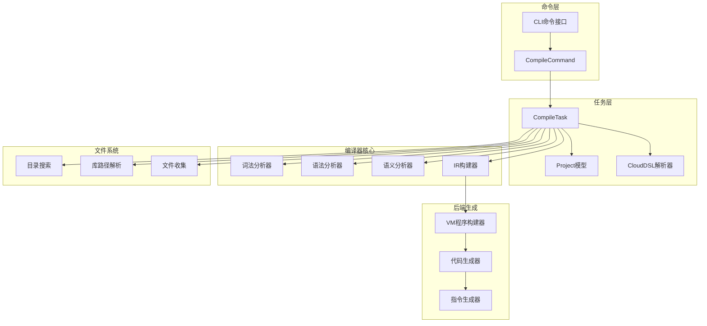

**图表来源**
- [CompileCommand.java](file://src/main/java/org/jcnc/snow/cli/commands/CompileCommand.java#L31-L93)
- [CompileTask.java](file://src/main/java/org/jcnc/snow/pkg/tasks/CompileTask.java#L48-L454)

**章节来源**
- [README.md](file://README.md#L580-L608)

## 编译命令系统

编译命令系统提供了两种不同的编译模式，分别针对不同的使用场景：

### Cloud模式

Cloud模式基于项目配置文件`project.cloud`，提供标准化的项目管理功能：

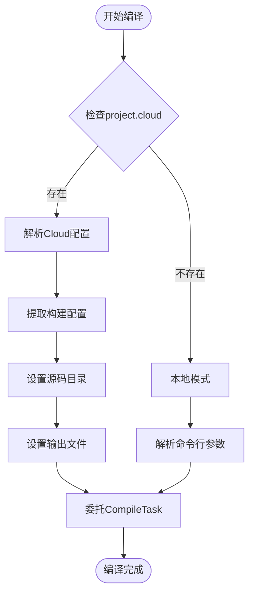

**图表来源**
- [CompileCommand.java](file://src/main/java/org/jcnc/snow/cli/commands/CompileCommand.java#L53-L90)

### 本地模式

本地模式提供传统的命令行编译方式，支持灵活的参数配置：

| 参数 | 功能 | 示例 |
|------|------|------|
| `-o <name>` | 指定输出文件名 | `-o myapp.water` |
| `-d <srcDir>` | 指定源码目录 | `-d src/main/snow` |
| `[file1.snow ...]` | 指定源文件列表 | `Main.snow Utils.snow` |
| `run` | 编译后自动运行 | `snow compile run` |
| `--debug` | 启用调试模式 | `snow compile --debug` |

**章节来源**
- [CompileCommand.java](file://src/main/java/org/jcnc/snow/cli/commands/CompileCommand.java#L43-L48)

## 编译任务核心

编译任务`CompileTask`是整个编译流程的核心控制器，负责协调各个编译阶段的工作：

### 主要职责

1. **参数解析与验证**
2. **源文件收集与排序**
3. **标准库路径解析**
4. **依赖关系分析**
5. **编译流程控制**

### 编译流程

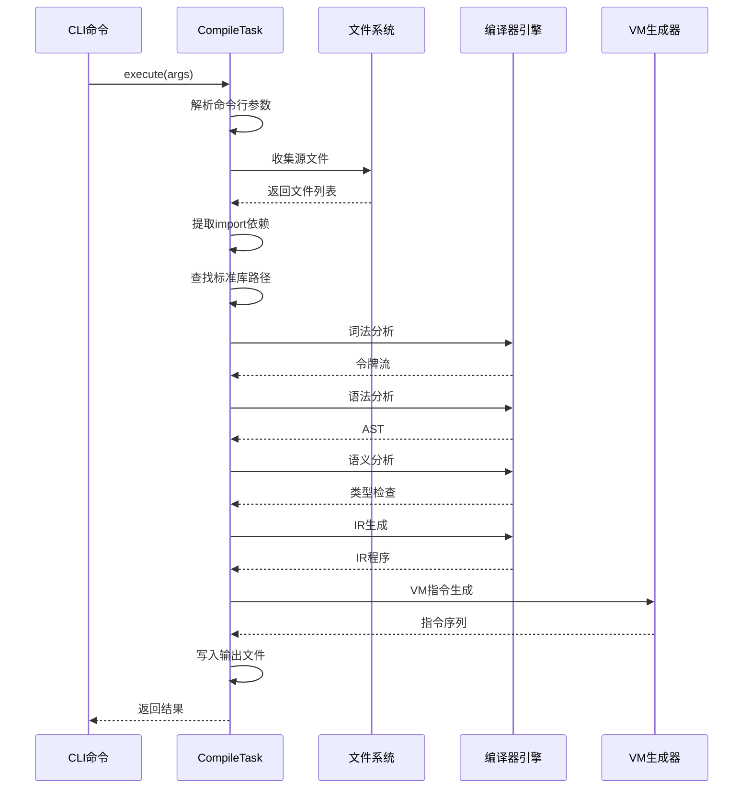

**图表来源**
- [CompileTask.java](file://src/main/java/org/jcnc/snow/pkg/tasks/CompileTask.java#L305-L453)

**章节来源**
- [CompileTask.java](file://src/main/java/org/jcnc/snow/pkg/tasks/CompileTask.java#L37-L47)

## 目录搜索机制

目录搜索机制是编译任务的核心功能之一，负责在复杂的项目结构中定位源文件和标准库文件。

### 搜索策略

系统采用多层次的搜索策略，按照优先级顺序查找：

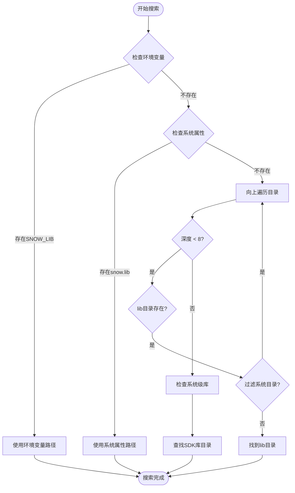

**图表来源**
- [CompileTask.java](file://src/main/java/org/jcnc/snow/pkg/tasks/CompileTask.java#L120-L161)

### 路径解析算法

标准库路径解析遵循以下优先级顺序：

| 优先级 | 检查项 | 实现方式 |
|--------|--------|----------|
| 1 | 环境变量 `SNOW_LIB` | `System.getenv("SNOW_LIB")` |
| 2 | 系统属性 `snow.lib` | `System.getProperty("snow.lib")` |
| 3 | 项目目录向上查找 | 最多向上8层，跳过系统目录 |
| 4 | SDK安装目录 | 通过可执行文件路径推断 |

**章节来源**
- [CompileTask.java](file://src/main/java/org/jcnc/snow/pkg/tasks/CompileTask.java#L120-L161)

## 标准库路径解析

标准库路径解析是编译器正确加载依赖的基础，实现了智能的路径发现机制。

### SDK库目录查找

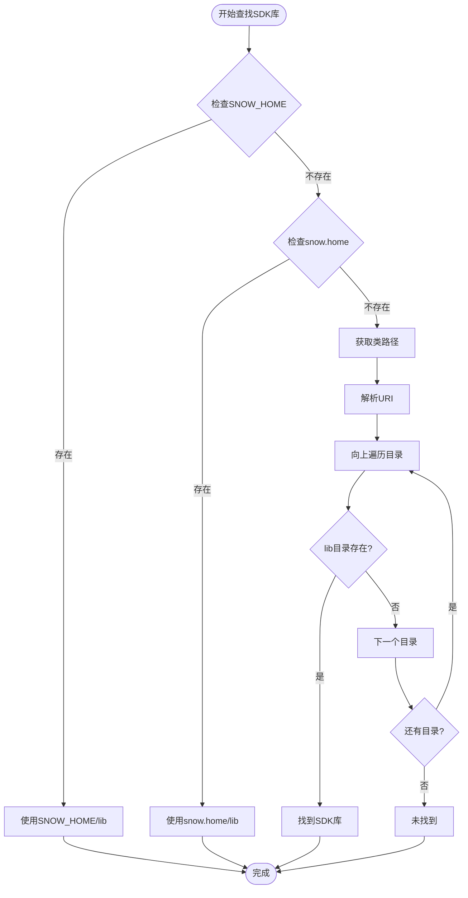

**图表来源**
- [CompileTask.java](file://src/main/java/org/jcnc/snow/pkg/tasks/CompileTask.java#L164-L216)

### 路径验证机制

系统实现了严格的路径验证机制，确保找到的库目录的有效性：

- **目录存在性检查**：确认路径确实指向一个目录
- **系统目录过滤**：跳过Linux系统级库目录（`/lib`、`/usr/lib`）
- **权限检查**：确保编译器有访问权限
- **重复路径避免**：防止重复扫描同一目录

**章节来源**
- [CompileTask.java](file://src/main/java/org/jcnc/snow/pkg/tasks/CompileTask.java#L164-L216)

## 源文件收集策略

源文件收集是编译流程的第一步，负责发现项目中的所有`.snow`源文件。

### 文件收集算法

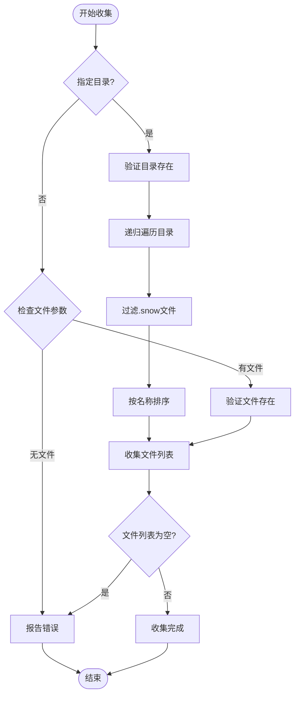

**图表来源**
- [CompileTask.java](file://src/main/java/org/jcnc/snow/pkg/tasks/CompileTask.java#L346-L357)

### 模块名提取机制

系统能够从源代码中智能提取模块名和导入依赖：

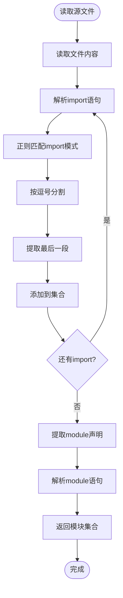

**图表来源**
- [CompileTask.java](file://src/main/java/org/jcnc/snow/pkg/tasks/CompileTask.java#L229-L244)

### 模块索引构建

系统为标准库文件构建模块索引，支持高效的依赖查找：

| 步骤 | 操作 | 数据结构 |
|------|------|----------|
| 1 | 收集所有`.snow`文件 | `List<Path>` |
| 2 | 读取文件内容 | `String` |
| 3 | 提取模块名 | `String` |
| 4 | 构建索引映射 | `Map<String, Path>` |
| 5 | 去重和验证 | `LinkedHashMap` |

**章节来源**
- [CompileTask.java](file://src/main/java/org/jcnc/snow/pkg/tasks/CompileTask.java#L254-L264)

## 依赖解析算法

依赖解析算法实现了智能的模块依赖分析，支持递归依赖查找和循环依赖检测。

### 依赖解析流程

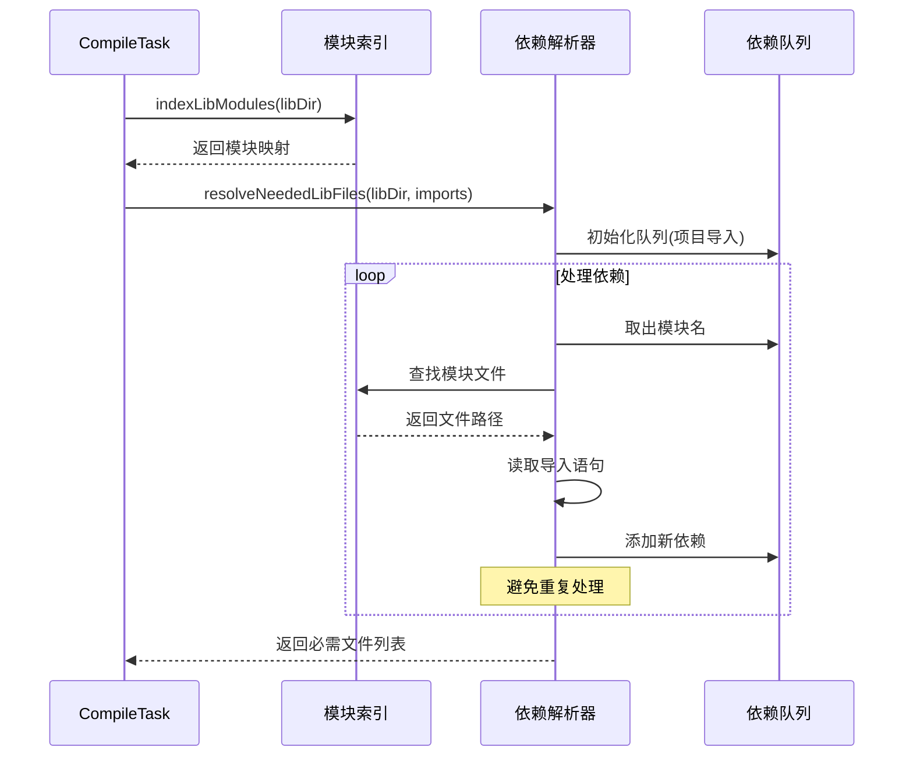

**图表来源**
- [CompileTask.java](file://src/main/java/org/jcnc/snow/pkg/tasks/CompileTask.java#L272-L292)

### 依赖解析策略

系统采用广度优先搜索算法处理依赖关系：

1. **初始阶段**：将项目直接导入的模块加入队列
2. **处理阶段**：逐个处理队列中的模块
3. **递归阶段**：分析每个模块的导入依赖
4. **去重阶段**：避免重复添加相同模块
5. **结果阶段**：返回完整的依赖文件列表

### 循环依赖检测

系统实现了循环依赖检测机制：

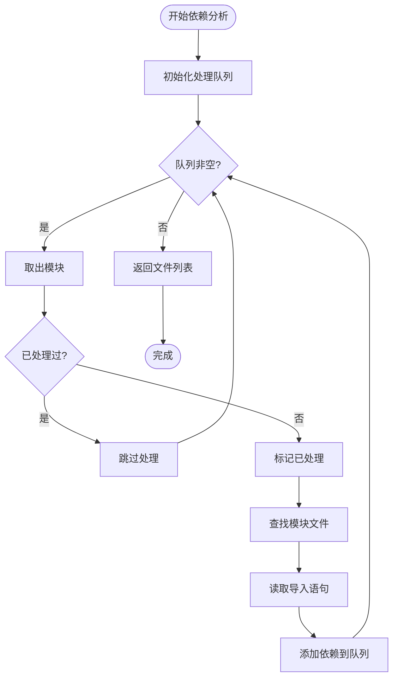

**图表来源**
- [CompileTask.java](file://src/main/java/org/jcnc/snow/pkg/tasks/CompileTask.java#L278-L289)

**章节来源**
- [CompileTask.java](file://src/main/java/org/jcnc/snow/pkg/tasks/CompileTask.java#L272-L292)

## 虚拟机指令生成

虚拟机指令生成是编译流程的最后阶段，负责将中间表示转换为可执行的虚拟机指令。

### 指令生成架构

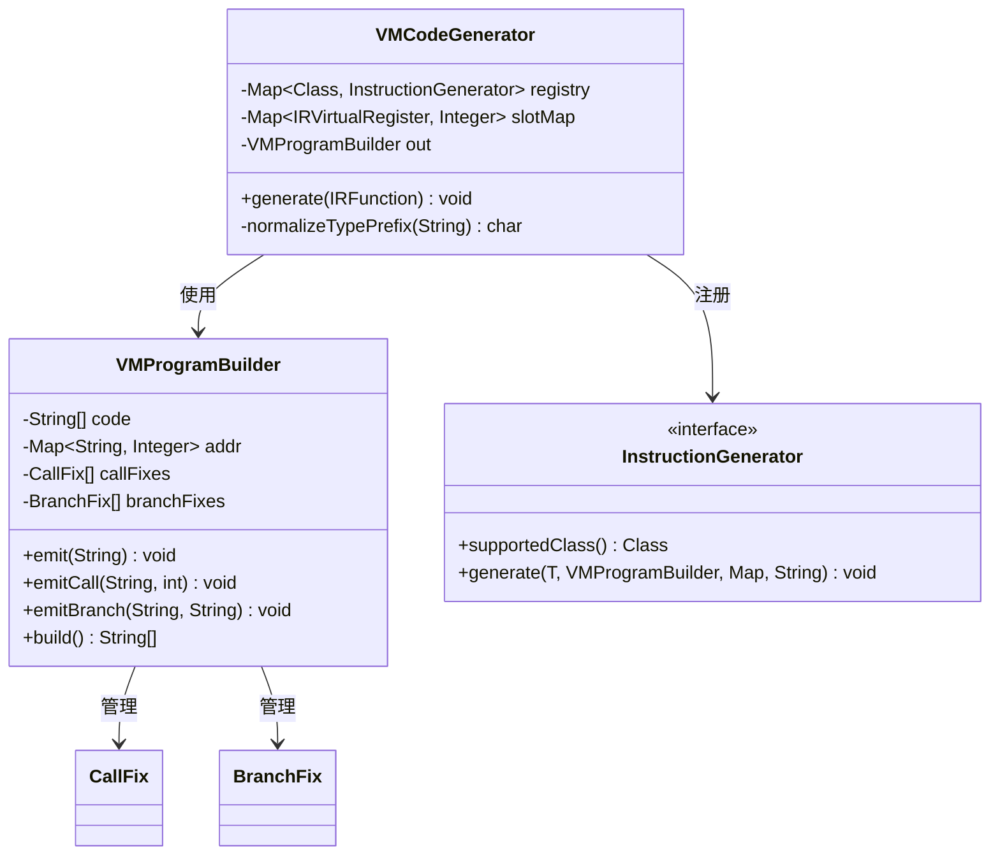

**图表来源**
- [VMCodeGenerator.java](file://src/main/java/org/jcnc/snow/compiler/backend/builder/VMCodeGenerator.java#L24-L137)
- [VMProgramBuilder.java](file://src/main/java/org/jcnc/snow/compiler/backend/builder/VMProgramBuilder.java#L23-L400)

### 指令生成流程

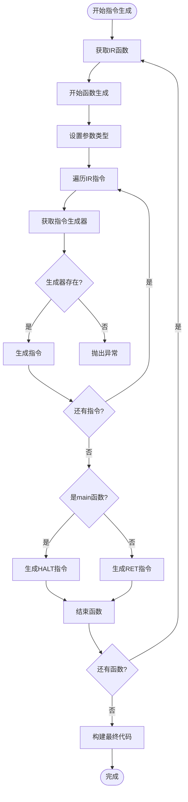

**图表来源**
- [VMCodeGenerator.java](file://src/main/java/org/jcnc/snow/compiler/backend/builder/VMCodeGenerator.java#L78-L113)

### 类型前缀映射

系统实现了完整的类型到虚拟机槽位前缀的映射：

| Snow类型 | 虚拟机前缀 | 说明 |
|----------|------------|------|
| `byte` | `B` | 字节类型 |
| `short` | `S` | 短整型 |
| `int` | `I` | 整型（默认） |
| `long` | `L` | 长整型 |
| `float` | `F` | 单精度浮点 |
| `double` | `D` | 双精度浮点 |
| `string` | `R` | 字符串引用 |
| `void` | `V` | 空类型 |

**章节来源**
- [VMCodeGenerator.java](file://src/main/java/org/jcnc/snow/compiler/backend/builder/VMCodeGenerator.java#L115-L137)

## 符号解析与继承链

符号解析是虚拟机指令生成的重要组成部分，负责处理函数调用和分支跳转的目标解析。

### 符号修补机制

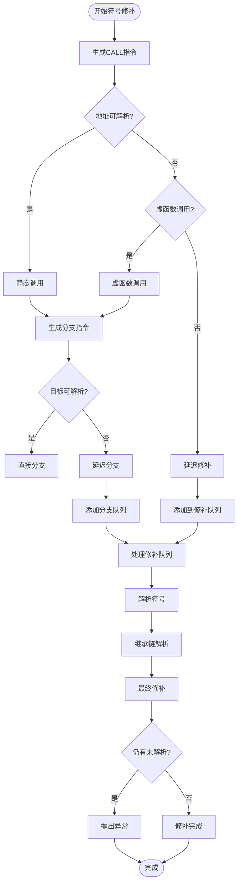

**图表来源**
- [VMProgramBuilder.java](file://src/main/java/org/jcnc/snow/compiler/backend/builder/VMProgramBuilder.java#L178-L219)

### 继承链解析策略

系统实现了智能的继承链解析算法：

1. **精确匹配优先**：优先匹配子类重写的方法
2. **继承链查找**：沿父类链向上查找同名方法
3. **简名唯一匹配**：在唯一情况下允许简名匹配
4. **多义性处理**：避免歧义，只有唯一匹配时才绑定

### 标签作用域管理

系统实现了函数级别的标签作用域管理：

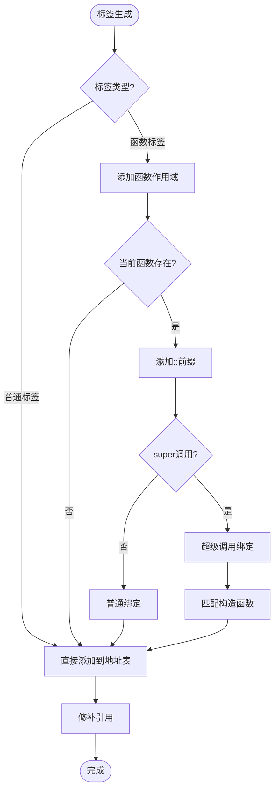

**图表来源**
- [VMProgramBuilder.java](file://src/main/java/org/jcnc/snow/compiler/backend/builder/VMProgramBuilder.java#L240-L251)

**章节来源**
- [VMProgramBuilder.java](file://src/main/java/org/jcnc/snow/compiler/backend/builder/VMProgramBuilder.java#L253-L318)

## 性能优化考虑

编译任务库在设计时充分考虑了性能优化，采用了多种策略提升编译效率。

### 缓存策略

1. **模块索引缓存**：标准库模块索引一次性构建并缓存
2. **依赖关系缓存**：避免重复计算相同的依赖关系
3. **路径解析缓存**：标准库路径解析结果缓存

### 并发优化

虽然当前实现主要是单线程的，但架构设计支持未来的并发优化：

- **文件收集并发**：多个目录可以并行扫描
- **依赖解析并发**：不同模块的依赖可以并行处理
- **指令生成并发**：不同函数的指令生成可以并行

### 内存优化

1. **流式处理**：大量文件处理采用流式读取
2. **及时释放**：处理完的文件立即释放内存
3. **弱引用**：对大型数据结构使用弱引用

## 故障排除指南

### 常见问题及解决方案

#### 1. 标准库路径未找到

**症状**：编译时提示找不到标准库文件

**原因**：
- 环境变量`SNOW_LIB`未设置
- 系统属性`snow.lib`未配置
- SDK安装不完整

**解决方案**：
```bash
# 设置环境变量
export SNOW_LIB=/path/to/snow/lib

# 或设置系统属性
java -Dsnow.lib=/path/to/snow/lib -jar snow.jar compile ...

# 或检查SDK安装
ls $SNOW_HOME/lib/
```

#### 2. 依赖解析失败

**症状**：编译时提示模块未找到

**原因**：
- 模块导入路径错误
- 标准库文件损坏
- 依赖循环

**解决方案**：
- 检查`import:`语句的模块名
- 验证标准库文件完整性
- 使用`--debug`模式查看详细信息

#### 3. 源文件收集失败

**症状**：编译时提示未找到源文件

**原因**：
- 指定的源文件不存在
- 目录权限不足
- 文件名编码问题

**解决方案**：
```bash
# 检查文件存在性
ls -la src/

# 检查权限
chmod +r src/*.snow

# 使用完整路径
snow compile /full/path/to/Main.snow
```

### 调试技巧

1. **启用调试模式**：使用`--debug`参数获取详细信息
2. **查看中间结果**：编译过程会输出源码、AST、IR等
3. **分步测试**：逐步验证各个编译阶段
4. **日志分析**：仔细阅读编译器输出的日志信息

**章节来源**
- [CompileTask.java](file://src/main/java/org/jcnc/snow/pkg/tasks/CompileTask.java#L360-L367)

## 总结

Snow编译器的编译任务库目录搜索功能实现了一个完整、高效、可靠的编译系统。该系统的主要特点包括：

### 技术优势

1. **智能路径解析**：多层级的路径查找机制确保标准库的正确加载
2. **高效的文件收集**：递归目录遍历结合智能过滤，快速定位源文件
3. **完善的依赖管理**：递归依赖解析算法支持复杂的模块依赖关系
4. **健壮的符号解析**：继承链解析和符号修补机制确保函数调用的正确性

### 设计亮点

1. **模块化架构**：清晰的职责分离，便于维护和扩展
2. **容错机制**：完善的错误处理和恢复策略
3. **性能优化**：多种缓存和优化策略提升编译效率
4. **可扩展性**：良好的接口设计支持未来的功能扩展

### 应用价值

该编译任务库不仅为Snow语言提供了强大的编译能力，也为其他类似项目提供了优秀的参考实现。其设计理念和实现技术对于构建高质量的编译器系统具有重要的借鉴意义。

通过深入理解这些核心功能的实现原理，开发者可以更好地利用Snow编译器的强大功能，同时也能为编译器技术的发展贡献自己的力量。