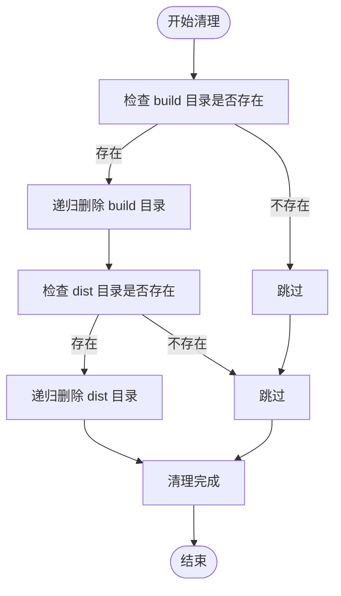
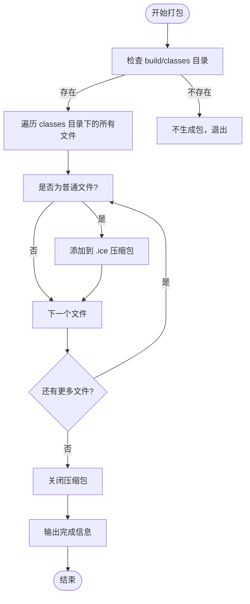
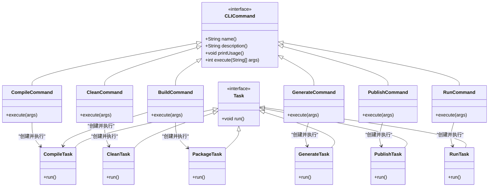
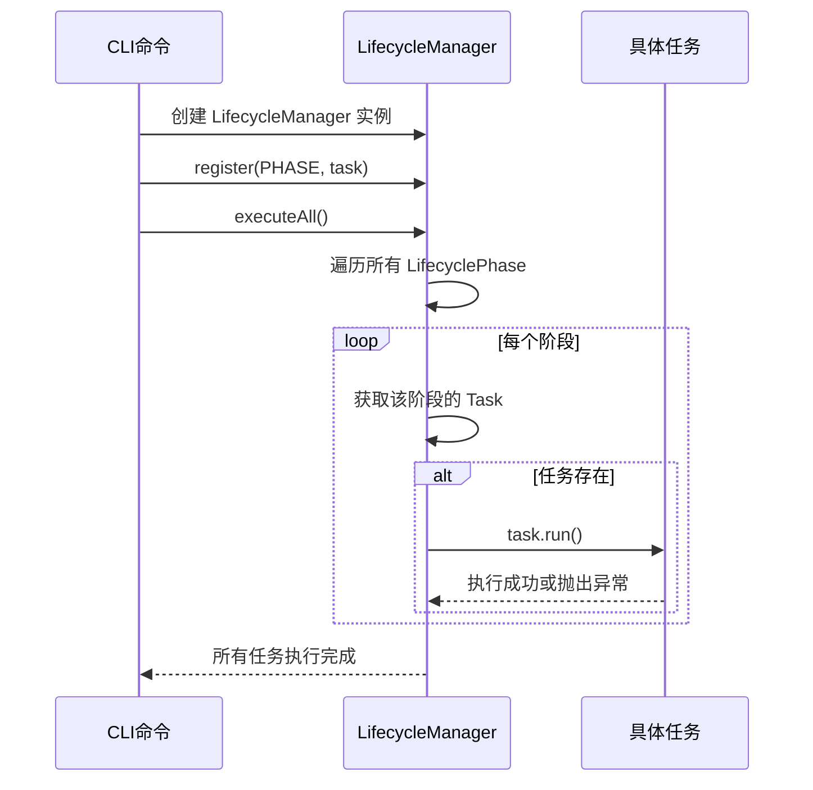

# 任务体系

<cite>
**本文档引用的文件**
- [Task.java](file://src/main/java/org/jcnc/snow/pkg/tasks/Task.java)
- [CompileTask.java](file://src/main/java/org/jcnc/snow/pkg/tasks/CompileTask.java)
- [CleanTask.java](file://src/main/java/org/jcnc/snow/pkg/tasks/CleanTask.java)
- [GenerateTask.java](file://src/main/java/org/jcnc/snow/pkg/tasks/GenerateTask.java)
- [PackageTask.java](file://src/main/java/org/jcnc/snow/pkg/tasks/PackageTask.java)
- [PublishTask.java](file://src/main/java/org/jcnc/snow/pkg/tasks/PublishTask.java)
- [RunTask.java](file://src/main/java/org/jcnc/snow/pkg/tasks/RunTask.java)
- [LifecycleManager.java](file://src/main/java/org/jcnc/snow/pkg/lifecycle/LifecycleManager.java)
- [LifecyclePhase.java](file://src/main/java/org/jcnc/snow/pkg/lifecycle/LifecyclePhase.java)
- [BuildCommand.java](file://src/main/java/org/jcnc/snow/cli/commands/BuildCommand.java)
- [CompileCommand.java](file://src/main/java/org/jcnc/snow/cli/commands/CompileCommand.java)
- [CleanCommand.java](file://src/main/java/org/jcnc/snow/cli/commands/CleanCommand.java)
- [GenerateCommand.java](file://src/main/java/org/jcnc/snow/cli/commands/GenerateCommand.java)
- [PublishCommand.java](file://src/main/java/org/jcnc/snow/cli/commands/PublishCommand.java)
- [RunCommand.java](file://src/main/java/org/jcnc/snow/cli/commands/RunCommand.java)
</cite>

## 目录
1. [任务接口与契约](#任务接口与契约)
2. [具体任务类详解](#具体任务类详解)
3. [任务与CLI命令的交互](#任务与cli命令的交互)
4. [自定义任务实现指南](#自定义任务实现指南)
5. [生命周期管理](#生命周期管理)

## 任务接口与契约

`Task` 接口是Snow构建系统中所有任务的统一契约，定义了所有构建任务（如编译、打包、清理等）必须遵循的执行规范。

该接口的核心方法是 `run()`，所有实现类都必须提供具体的执行逻辑。`run()` 方法声明抛出 `Exception`，这意味着任务执行过程中任何阶段的异常（如IO错误、编译错误、运行时错误）都应直接向上抛出，由调用方（如 `LifecycleManager` 或CLI命令）进行统一捕获和处理。

这种设计确保了任务执行的失败能够被及时发现和响应，避免了错误被静默吞没。

**Section sources**
- [Task.java](file://src/main/java/org/jcnc/snow/pkg/tasks/Task.java#L15-L21)

## 具体任务类详解

Snow系统定义了多个具体任务类，每个类都实现了 `Task` 接口，负责特定的构建或管理功能。

### CompileTask

`CompileTask` 负责将 `.snow` 源文件编译为虚拟机可执行的 `.water` 字节码文件。其执行逻辑非常复杂，涵盖了从源码解析到字节码生成的完整流程。

1.  **参数解析**：解析CLI参数，如 `-o` (输出文件名)、`-d` (源码目录)、`run` (编译后立即运行)。
2.  **源码收集**：递归扫描指定目录或直接指定的 `.snow` 文件。
3.  **依赖解析**：分析源码中的 `import` 语句，并从 `lib` 目录或Snow SDK中递归加载所需的标准库文件。
4.  **编译流程**：依次执行词法分析、语法分析、语义分析、中间表示（IR）生成和最终的VM字节码生成。
5.  **输出与运行**：将生成的字节码写入 `.water` 文件，并根据参数决定是否立即启动虚拟机运行。

**Section sources**
- [CompileTask.java](file://src/main/java/org/jcnc/snow/pkg/tasks/CompileTask.java#L15-L425)

### CleanTask

`CleanTask` 是一个简单的清理任务，负责删除项目中的构建产物目录。

其主要职责是递归删除 `build` 和 `dist` 目录。它使用 `Files.walk()` 方法遍历目录树，并通过 `Comparator.reverseOrder()` 确保子文件和子目录先于父目录被删除，从而避免了删除非空目录的权限问题。

**Diagram sources**
- [CleanTask.java](file://src/main/java/org/jcnc/snow/pkg/tasks/CleanTask.java#L15-L58)

**Section sources**
- [CleanTask.java](file://src/main/java/org/jcnc/snow/pkg/tasks/CleanTask.java#L15-L58)

### GenerateTask

`GenerateTask` 用于生成项目的标准目录结构和示例文件，是项目脚手架功能的核心。

它根据 `Project` 对象中的元数据（如 `group`）来创建目录。例如，如果 `group` 是 `com.example`，它会在 `src` 目录下创建 `com/example` 的包路径。同时，它会生成 `main.snow` 和 `OS.snow` 两个示例文件，帮助用户快速开始。

该任务在创建文件前会检查文件是否已存在，避免覆盖用户已有的代码。

**Section sources**
- [GenerateTask.java](file://src/main/java/org/jcnc/snow/pkg/tasks/GenerateTask.java#L15-L89)

### PackageTask

`PackageTask` 负责将编译输出打包成 `.ice` 文件。

它会查找 `build/classes` 目录，将其中的所有普通文件（不包括目录）压缩到 `dist` 目录下的一个 `.ice` 文件中。文件名由项目的 `artifact` 和 `version` 组成（例如 `myapp-1.0.0.ice`）。如果 `dist` 目录不存在，会自动创建。

**Diagram sources**
- [PackageTask.java](file://src/main/java/org/jcnc/snow/pkg/tasks/PackageTask.java#L15-L71)

**Section sources**
- [PackageTask.java](file://src/main/java/org/jcnc/snow/pkg/tasks/PackageTask.java#L15-L71)

### PublishTask

`PublishTask` 用于将打包好的构件发布到远程仓库。

目前，该任务的实现是占位性的，仅打印一条提示信息。其设计为未来扩展预留了接口，例如可以通过HTTP协议将 `.ice` 文件上传到Maven仓库或私有服务器。

**Section sources**
- [PublishTask.java](file://src/main/java/org/jcnc/snow/pkg/tasks/PublishTask.java#L15-L35)

### RunTask

`RunTask` 负责启动虚拟机并运行指定的 `.water` 字节码程序。

它是一个薄封装，主要职责是将传入的命令行参数（第一个参数是 `.water` 文件路径）传递给 `VMLauncher.main()` 方法。如果未提供任何参数，它会抛出 `IllegalArgumentException`。

**Section sources**
- [RunTask.java](file://src/main/java/org/jcnc/snow/pkg/tasks/RunTask.java#L15-L41)

## 任务与CLI命令的交互

具体任务类通常不被直接调用，而是由CLI命令（位于 `cli.commands` 包）触发。CLI命令负责解析用户输入，然后创建相应的任务实例并执行。

**Diagram sources**
- [BuildCommand.java](file://src/main/java/org/jcnc/snow/cli/commands/BuildCommand.java#L15-L86)
- [CompileCommand.java](file://src/main/java/org/jcnc/snow/cli/commands/CompileCommand.java#L15-L92)
- [CleanCommand.java](file://src/main/java/org/jcnc/snow/cli/commands/CleanCommand.java#L15-L63)
- [GenerateCommand.java](file://src/main/java/org/jcnc/snow/cli/commands/GenerateCommand.java#L15-L87)
- [PublishCommand.java](file://src/main/java/org/jcnc/snow/cli/commands/PublishCommand.java#L15-L74)
- [RunCommand.java](file://src/main/java/org/jcnc/snow/cli/commands/RunCommand.java#L15-L66)
- [CompileTask.java](file://src/main/java/org/jcnc/snow/pkg/tasks/CompileTask.java#L15-L425)
- [CleanTask.java](file://src/main/java/org/jcnc/snow/pkg/tasks/CleanTask.java#L15-L58)
- [GenerateTask.java](file://src/main/java/org/jcnc/snow/pkg/tasks/GenerateTask.java#L15-L89)
- [PackageTask.java](file://src/main/java/org/jcnc/snow/pkg/tasks/PackageTask.java#L15-L71)
- [PublishTask.java](file://src/main/java/org/jcnc/snow/pkg/tasks/PublishTask.java#L15-L35)
- [RunTask.java](file://src/main/java/org/jcnc/snow/pkg/tasks/RunTask.java#L15-L41)

**Section sources**
- [BuildCommand.java](file://src/main/java/org/jcnc/snow/cli/commands/BuildCommand.java#L15-L86)
- [CompileCommand.java](file://src/main/java/org/jcnc/snow/cli/commands/CompileCommand.java#L15-L92)
- [CleanCommand.java](file://src/main/java/org/jcnc/snow/cli/commands/CleanCommand.java#L15-L63)
- [GenerateCommand.java](file://src/main/java/org/jcnc/snow/cli/commands/GenerateCommand.java#L15-L87)
- [PublishCommand.java](file://src/main/java/org/jcnc/snow/cli/commands/PublishCommand.java#L15-L74)
- [RunCommand.java](file://src/main/java/org/jcnc/snow/cli/commands/RunCommand.java#L15-L66)

## 自定义任务实现指南

要创建一个自定义任务，需要遵循以下步骤：

1.  **实现 `Task` 接口**：创建一个新类或记录（record），并实现 `Task` 接口。
2.  **重写 `run()` 方法**：在此方法中编写你的业务逻辑。确保正确处理异常，对于可恢复的错误可以捕获并记录，对于致命错误应直接抛出 `Exception`。
3.  **依赖注入**：如果任务需要外部依赖（如配置、服务），应在构造函数或记录的参数中声明它们，而不是在 `run()` 方法内部创建。这有利于测试和解耦。
4.  **日志输出**：使用 `System.out.println()` 或更高级的日志框架输出信息。遵循现有任务的命名约定，如 `[task-name] info message`。
5.  **错误处理**：优先使用 `throws Exception` 将异常抛出。如果必须捕获异常，应记录详细的错误信息，并考虑包装成更具体的异常再抛出。

## 生命周期管理

`LifecycleManager` 是任务调度的核心，它将多个任务组织到不同的生命周期阶段中，并按顺序执行。

`LifecyclePhase` 枚举定义了标准的构建阶段，如 `INIT`、`RESOLVE_DEPENDENCIES`、`COMPILE`、`PACKAGE`、`PUBLISH` 和 `CLEAN`。

`LifecycleManager` 维护一个 `EnumMap`，将每个 `LifecyclePhase` 映射到一个 `Task`。通过 `register()` 方法可以为某个阶段注册任务。`executeAll()` 方法会按 `LifecyclePhase` 的声明顺序遍历所有阶段，执行已注册的任务。

**Diagram sources**
- [LifecycleManager.java](file://src/main/java/org/jcnc/snow/pkg/lifecycle/LifecycleManager.java#L15-L66)
- [LifecyclePhase.java](file://src/main/java/org/jcnc/snow/pkg/lifecycle/LifecyclePhase.java#L15-L34)

**Section sources**
- [LifecycleManager.java](file://src/main/java/org/jcnc/snow/pkg/lifecycle/LifecycleManager.java#L15-L66)
- [LifecyclePhase.java](file://src/main/java/org/jcnc/snow/pkg/lifecycle/LifecyclePhase.java#L15-L34)