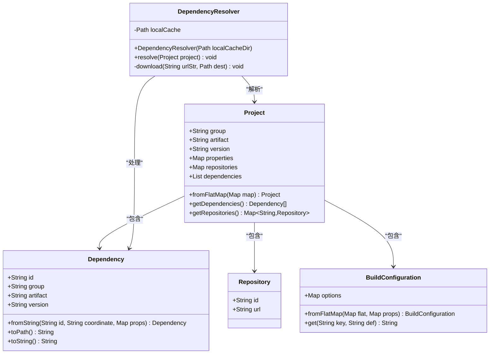
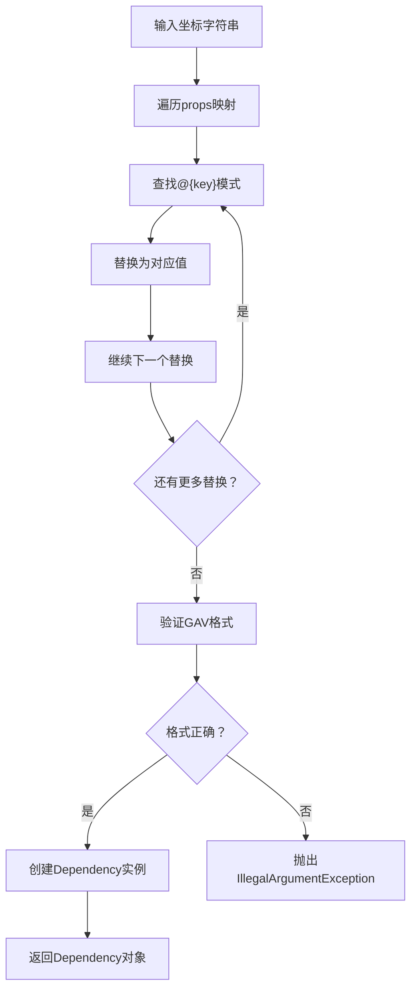
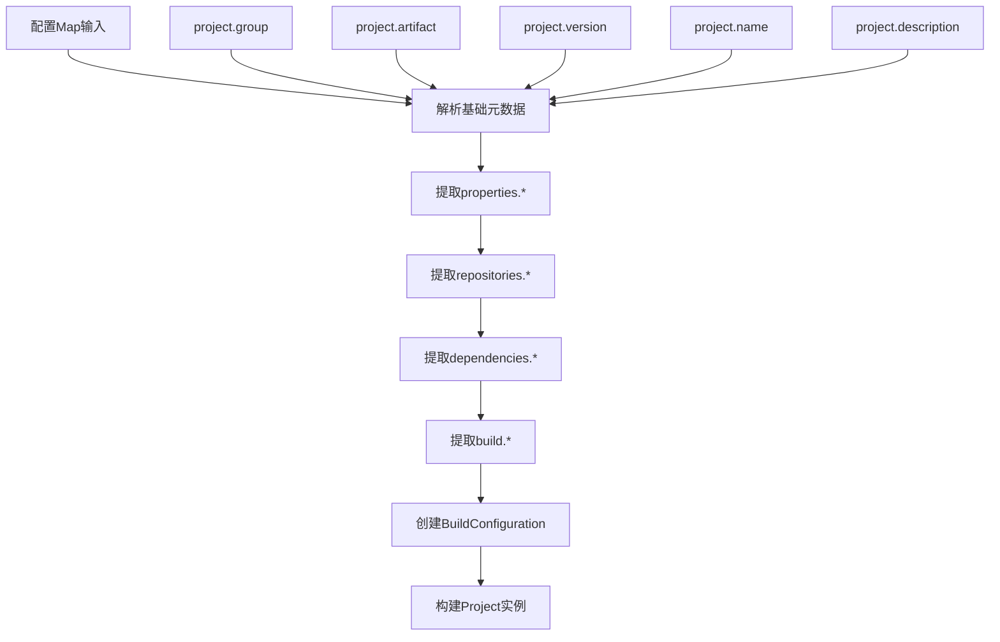
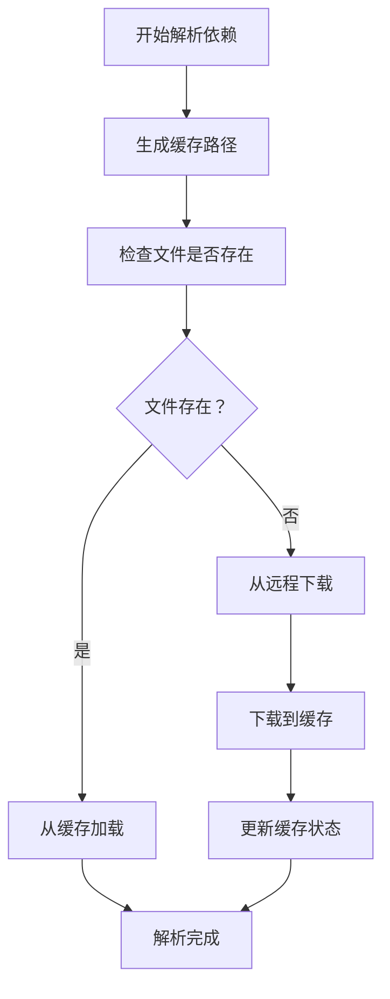
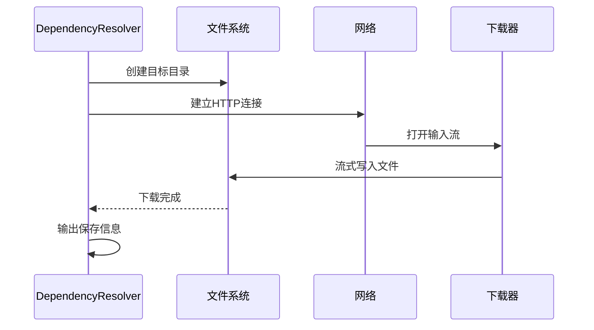
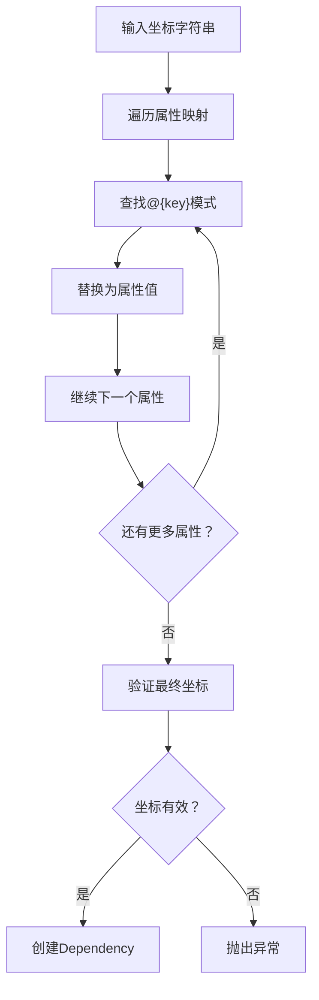
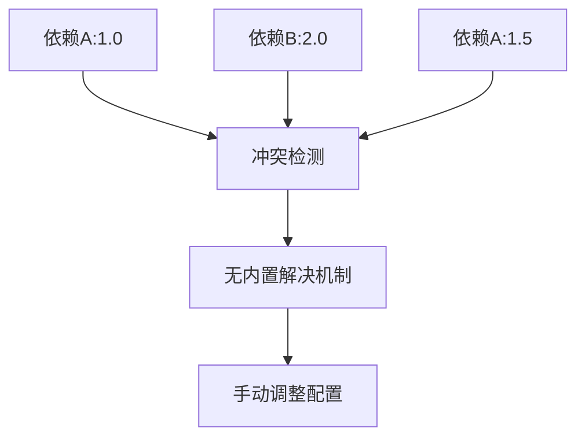
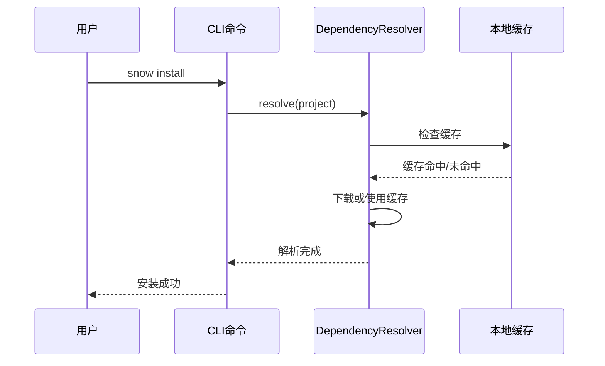

# Snow依赖解析机制全面文档

<cite>
**本文档引用的文件**
- [DependencyResolver.java](file://src/main/java/org/jcnc/snow/pkg/resolver/DependencyResolver.java)
- [Dependency.java](file://src/main/java/org/jcnc/snow/pkg/model/Dependency.java)
- [Project.java](file://src/main/java/org/jcnc/snow/pkg/model/Project.java)
- [Repository.java](file://src/main/java/org/jcnc/snow/pkg/model/Repository.java)
- [BuildConfiguration.java](file://src/main/java/org/jcnc/snow/pkg/model/BuildConfiguration.java)
- [InstallCommand.java](file://src/main/java/org/jcnc/snow/cli/commands/InstallCommand.java)
- [CloudDSLParser.java](file://src/main/java/org/jcnc/snow/pkg/dsl/CloudDSLParser.java)
</cite>

## 目录
1. [概述](#概述)
2. [核心组件架构](#核心组件架构)
3. [DependencyResolver解析器](#dependencyresolver解析器)
4. [Dependency记录类详解](#dependency记录类详解)
5. [Project项目模型](#project项目模型)
6. [Repository仓库模型](#repository仓库模型)
7. [本地缓存策略](#本地缓存策略)
8. [远程仓库优先级](#远程仓库优先级)
9. [下载重试机制](#下载重试机制)
10. [占位符替换机制](#占位符替换机制)
11. [路径生成规则](#路径生成规则)
12. [依赖冲突处理](#依赖冲突处理)
13. [离线模式指南](#离线模式指南)
14. [最佳实践建议](#最佳实践建议)

## 概述

Snow的依赖解析机制是一个完整的包管理系统，负责解析、下载和缓存项目依赖。该系统采用本地缓存优先的策略，支持占位符动态替换，并提供了灵活的仓库配置机制。

### 核心特性
- **本地缓存优先**：优先使用本地缓存避免重复下载
- **占位符支持**：支持`@{key}`格式的动态变量替换
- **单一仓库优先**：从第一个配置的仓库下载依赖
- **离线友好**：支持离线模式下的缓存使用
- **路径规范化**：统一的依赖文件路径生成规则

## 核心组件架构



**图表来源**
- [DependencyResolver.java](file://src/main/java/org/jcnc/snow/pkg/resolver/DependencyResolver.java#L1-L85)
- [Dependency.java](file://src/main/java/org/jcnc/snow/pkg/model/Dependency.java#L1-L88)
- [Project.java](file://src/main/java/org/jcnc/snow/pkg/model/Project.java#L1-L235)
- [Repository.java](file://src/main/java/org/jcnc/snow/pkg/model/Repository.java#L1-L19)

## DependencyResolver解析器

DependencyResolver是依赖解析的核心组件，负责协调整个依赖解析流程。

### 构造函数
```java
public DependencyResolver(Path localCacheDir)
```
创建DependencyResolver实例，指定本地缓存目录位置。

### 核心解析方法
```java
public void resolve(Project project) throws IOException, URISyntaxException
```
解析并下载项目的所有依赖，遵循以下流程：

1. **创建缓存目录**：确保本地缓存目录存在
2. **遍历依赖列表**：对每个依赖执行解析
3. **缓存检查**：检查本地缓存中是否存在对应文件
4. **仓库选择**：从配置的第一个仓库下载
5. **文件下载**：执行实际的文件下载操作

### 下载机制
```java
private void download(String urlStr, Path dest) throws IOException, URISyntaxException
```
实现具体的文件下载功能：
- 创建目标父目录
- 建立网络连接
- 流式下载并保存文件
- 输出下载状态信息

**章节来源**
- [DependencyResolver.java](file://src/main/java/org/jcnc/snow/pkg/resolver/DependencyResolver.java#L25-L85)

## Dependency记录类详解

Dependency记录类是依赖坐标的载体，支持GAV（Group:Artifact:Version）格式和动态占位符替换。

### 数据结构
```java
record Dependency(
    String id,
    String group,
    String artifact,
    String version
)
```

### GAV坐标解析
使用正则表达式`([^:]+):([^:]+):(.+)`匹配标准的GAV格式：
- `group`：组织/分组名（如`com.example`）
- `artifact`：构件名（如`core`）
- `version`：版本号（如`1.2.3`）

### fromString方法详解

```java
public static Dependency fromString(String id, String coordinate, Map<String, String> props)
```

该方法实现了复杂的占位符替换逻辑：

1. **占位符替换**：遍历props映射，将`@{key}`替换为对应值
2. **格式验证**：使用GAV正则表达式验证坐标格式
3. **对象创建**：返回新的Dependency实例

### 占位符替换机制



**图表来源**
- [Dependency.java](file://src/main/java/org/jcnc/snow/pkg/model/Dependency.java#L45-L65)

**章节来源**
- [Dependency.java](file://src/main/java/org/jcnc/snow/pkg/model/Dependency.java#L1-L88)

## Project项目模型

Project类是项目的完整描述，包含了依赖解析所需的所有信息。

### 核心属性
- **基础信息**：group、artifact、version、name、description等
- **额外属性**：properties映射，用于占位符替换
- **仓库配置**：repositories映射，存储多个仓库信息
- **依赖列表**：dependencies列表，包含所有项目依赖
- **构建配置**：build配置对象

### 配置解析机制

```java
public static Project fromFlatMap(Map<String, String> map)
```

该静态工厂方法实现了复杂的配置解析逻辑：



**图表来源**
- [Project.java](file://src/main/java/org/jcnc/snow/pkg/model/Project.java#L105-L163)

### 依赖解析流程

Project类通过以下方式支持依赖解析：

1. **getDependencies()**：返回项目的所有依赖列表
2. **getRepositories()**：返回配置的仓库映射
3. **getProperties()**：提供占位符替换所需的属性

**章节来源**
- [Project.java](file://src/main/java/org/jcnc/snow/pkg/model/Project.java#L105-L163)

## Repository仓库模型

Repository模型表示远程仓库的基本信息，支持依赖下载。

### 数据结构
```java
record Repository(String id, String url)
```

### 使用方式
```java
Repository repo = new Repository("central", "https://repo.example.com/maven2/");
```

### URL拼接规则
在依赖解析过程中，Repository的URL与依赖路径组合形成完整的下载地址：
```
repo.url + "/" + dep.toPath()
```

**章节来源**
- [Repository.java](file://src/main/java/org/jcnc/snow/pkg/model/Repository.java#L1-L19)

## 本地缓存策略

Snow采用智能的本地缓存策略，最大化利用本地资源。

### 缓存目录结构
本地缓存默认位于用户主目录下的`.snow/cache`目录：
```
~/.snow/cache/
```

### 缓存检查流程


**图表来源**
- [DependencyResolver.java](file://src/main/java/org/jcnc/snow/pkg/resolver/DependencyResolver.java#L48-L60)

### 缓存路径生成
依赖文件在缓存中的路径遵循特定规则：
```
groupId/artifactId/version/artifactId.snow
```

**章节来源**
- [DependencyResolver.java](file://src/main/java/org/jcnc/snow/pkg/resolver/DependencyResolver.java#L48-L60)

## 远程仓库优先级

Snow采用简单的单一仓库优先策略，从配置的第一个仓库下载依赖。

### 仓库选择逻辑
```java
Optional<Repository> repo = project.getRepositories().values().stream().findFirst();
```

### 优先级特点
1. **单一优先**：只使用第一个配置的仓库
2. **顺序重要**：仓库配置的顺序决定下载优先级
3. **降级机制**：如果首选仓库不可用，系统无法自动切换

### 配置建议
- 将最可靠的仓库放在第一位
- 考虑网络延迟和可用性因素
- 在企业环境中配置内部仓库作为首选

**章节来源**
- [DependencyResolver.java](file://src/main/java/org/jcnc/snow/pkg/resolver/DependencyResolver.java#L56-L62)

## 下载重试机制

Snow的下载机制虽然简单，但提供了基本的错误处理能力。

### 下载流程


**图表来源**
- [DependencyResolver.java](file://src/main/java/org/jcnc/snow/pkg/resolver/DependencyResolver.java#L64-L83)

### 错误处理
- **IOException**：网络错误、文件权限等问题
- **URISyntaxException**：URL格式错误
- **仓库不可用**：当没有配置仓库时抛出

### 改进建议
1. **重试机制**：添加指数退避重试
2. **断点续传**：支持大文件的断点续传
3. **并发下载**：支持多个依赖同时下载

**章节来源**
- [DependencyResolver.java](file://src/main/java/org/jcnc/snow/pkg/resolver/DependencyResolver.java#L64-L83)

## 占位符替换机制

Snow的依赖系统支持复杂的占位符替换，实现动态配置。

### 占位符语法
```
@{key}
```

### 替换流程


**图表来源**
- [Dependency.java](file://src/main/java/org/jcnc/snow/pkg/model/Dependency.java#L48-L58)

### 应用场景
1. **版本统一管理**：`com.example:core:@{version}`
2. **环境区分**：`com.example:config:@{env}.properties`
3. **构建配置**：`com.example:plugin:@{build.type}`

### 与Project属性的联动
Project的properties映射提供了全局的占位符替换能力，确保配置的一致性。

**章节来源**
- [Dependency.java](file://src/main/java/org/jcnc/snow/pkg/model/Dependency.java#L45-L65)

## 路径生成规则

Dependency的toPath方法实现了标准化的依赖文件路径生成。

### 路径格式
```
groupId/artifactId/version/artifactId.snow
```

### 生成算法
```java
public String toPath() {
    String groupPath = group.replace('.', '/');
    return groupPath + "/" + artifact + "/" + version + "/" + artifact + ".snow";
}
```

### 路径示例
对于依赖`com.example:core:1.2.3`，生成的路径为：
```
com/example/core/1.2.3/core.snow
```

### 设计原则
1. **层次化组织**：按组织结构分层存储
2. **版本隔离**：不同版本独立存放
3. **文件命名**：使用artifact作为文件名

**章节来源**
- [Dependency.java](file://src/main/java/org/jcnc/snow/pkg/model/Dependency.java#L67-L73)

## 依赖冲突处理

目前Snow的依赖解析系统缺乏内置的冲突解决机制。

### 当前限制
1. **单一版本**：不支持同一依赖的多个版本
2. **仓库优先**：只使用第一个仓库，无法自动解决冲突
3. **手动干预**：需要手动调整依赖配置

### 冲突场景


### 处理建议
1. **版本统一**：尽量使用相同的依赖版本
2. **范围限定**：使用版本范围避免冲突
3. **依赖排除**：通过排除机制解决冲突
4. **模块化设计**：减少跨模块的依赖冲突

## 离线模式指南

Snow的依赖系统完全支持离线模式，充分利用本地缓存。

### 离线使用流程


**图表来源**
- [InstallCommand.java](file://src/main/java/org/jcnc/snow/cli/commands/InstallCommand.java#L50-L55)

### 离线模式优势
1. **快速启动**：无需网络连接即可使用
2. **可靠性高**：不受网络波动影响
3. **安全性好**：避免网络传输风险
4. **成本节约**：减少带宽消耗

### 离线使用步骤
1. **预热缓存**：使用`snow install`命令预先下载依赖
2. **离线开发**：在无网络环境下正常工作
3. **增量更新**：定期更新缓存保持依赖最新

**章节来源**
- [InstallCommand.java](file://src/main/java/org/jcnc/snow/cli/commands/InstallCommand.java#L1-L66)

## 最佳实践建议

### 仓库配置
1. **首选可靠仓库**：将最稳定的仓库配置在第一位
2. **镜像加速**：配置国内镜像提高下载速度
3. **安全考虑**：使用HTTPS协议确保传输安全

### 依赖管理
1. **版本锁定**：使用固定版本避免意外升级
2. **范围控制**：合理使用版本范围平衡稳定性与更新
3. **依赖审查**：定期审查项目依赖，移除不必要的依赖

### 缓存优化
1. **定期清理**：清理过期的缓存文件释放空间
2. **缓存监控**：监控缓存大小和使用情况
3. **备份策略**：重要项目的缓存需要备份

### 开发环境
1. **离线开发**：在开发阶段使用离线模式
2. **预热机制**：建立依赖预热的工作流程
3. **版本同步**：确保开发环境与生产环境的依赖版本一致

### 性能优化
1. **并发下载**：考虑实现并发下载机制
2. **增量更新**：支持增量更新减少下载量
3. **智能缓存**：实现更智能的缓存策略

## 总结

Snow的依赖解析机制提供了一个简洁而有效的包管理系统。通过本地缓存优先策略、智能的占位符替换机制和标准化的路径生成规则，系统能够高效地管理项目依赖。虽然目前缺乏复杂的冲突解决机制，但其简单性和可靠性使其非常适合Snow语言的开发需求。

未来的改进方向包括增强的冲突解决能力、更智能的缓存策略和更完善的错误处理机制。这些改进将进一步提升Snow生态系统的开发体验和可靠性。