# 包管理系统

<cite>
**本文档引用的文件**
- [Project.java](file://src/main/java/org/jcnc/snow/pkg/model/Project.java)
- [Dependency.java](file://src/main/java/org/jcnc/snow/pkg/model/Dependency.java)
- [LifecycleManager.java](file://src/main/java/org/jcnc/snow/pkg/lifecycle/LifecycleManager.java)
- [LifecyclePhase.java](file://src/main/java/org/jcnc/snow/pkg/lifecycle/LifecyclePhase.java)
- [Task.java](file://src/main/java/org/jcnc/snow/pkg/tasks/Task.java)
- [CompileTask.java](file://src/main/java/org/jcnc/snow/pkg/tasks/CompileTask.java)
- [PackageTask.java](file://src/main/java/org/jcnc/snow/pkg/tasks/PackageTask.java)
- [CleanTask.java](file://src/main/java/org/jcnc/snow/pkg/tasks/CleanTask.java)
- [BuildConfiguration.java](file://src/main/java/org/jcnc/snow/pkg/model/BuildConfiguration.java)
- [Repository.java](file://src/main/java/org/jcnc/snow/pkg/model/Repository.java)
- [DependencyResolver.java](file://src/main/java/org/jcnc/snow/pkg/resolver/DependencyResolver.java)
- [BuildCommand.java](file://src/main/java/org/jcnc/snow/cli/commands/BuildCommand.java)
- [InitCommand.java](file://src/main/java/org/jcnc/snow/cli/commands/InitCommand.java)
- [SnowConfig.java](file://src/main/java/org/jcnc/snow/common/SnowConfig.java)
- [README.md](file://README.md)
</cite>

## 目录
1. [项目结构](#项目结构)
2. [核心数据模型](#核心数据模型)
3. [项目生命周期管理](#项目生命周期管理)
4. [任务抽象与具体实现](#任务抽象与具体实现)
5. [依赖解析机制](#依赖解析机制)
6. [构建任务执行流程](#构建任务执行流程)
7. [自定义构建任务开发指南](#自定义构建任务开发指南)
8. [性能优化与高级主题](#性能优化与高级主题)

## 项目结构

Snow包管理系统具有清晰的模块化结构，主要分为编译器、虚拟机和包管理三个核心部分。包管理功能位于`pkg`目录下，包含模型定义、生命周期管理、任务执行和依赖解析等关键组件。

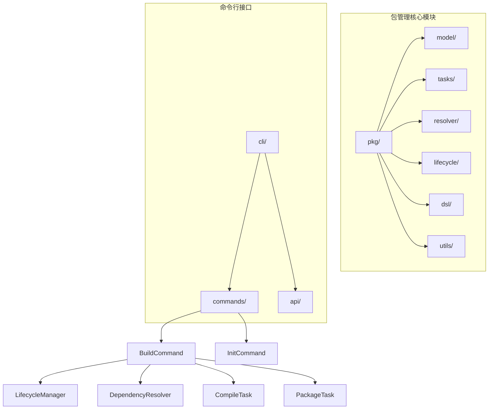

**图示来源**
- [README.md](file://README.md#L180-L220)

## 核心数据模型

Snow包管理系统的核心数据模型包括项目、依赖、仓库和构建配置等实体，这些实体共同构成了项目的元数据描述体系。

### 项目模型

`Project`类是Snow包管理系统的核心数据模型，表示一个软件包或模块的完整项目信息。该类为不可变对象，仅提供getter方法，通过`fromFlatMap`静态工厂方法从扁平Map创建实例。

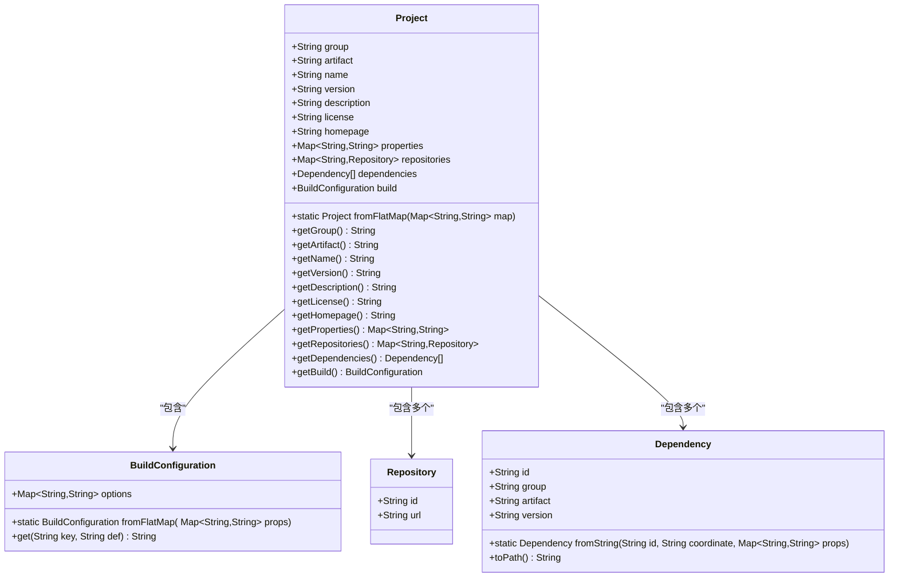

**图示来源**
- [Project.java](file://src/main/java/org/jcnc/snow/pkg/model/Project.java#L15-L234)
- [BuildConfiguration.java](file://src/main/java/org/jcnc/snow/pkg/model/BuildConfiguration.java#L15-L66)
- [Repository.java](file://src/main/java/org/jcnc/snow/pkg/model/Repository.java#L15-L18)
- [Dependency.java](file://src/main/java/org/jcnc/snow/pkg/model/Dependency.java#L15-L87)

**本节来源**
- [Project.java](file://src/main/java/org/jcnc/snow/pkg/model/Project.java#L15-L234)
- [BuildConfiguration.java](file://src/main/java/org/jcnc/snow/pkg/model/BuildConfiguration.java#L15-L66)
- [Repository.java](file://src/main/java/org/jcnc/snow/pkg/model/Repository.java#L15-L18)
- [Dependency.java](file://src/main/java/org/jcnc/snow/pkg/model/Dependency.java#L15-L87)

## 项目生命周期管理

Snow包管理系统通过`LifecycleManager`和`LifecyclePhase`两个核心类实现项目生命周期的标准化管理。这种设计模式确保了构建流程的可预测性和可扩展性。

### 生命周期阶段

`LifecyclePhase`枚举定义了典型的软件包生命周期各个阶段，为构建流程提供了标准化的执行顺序。

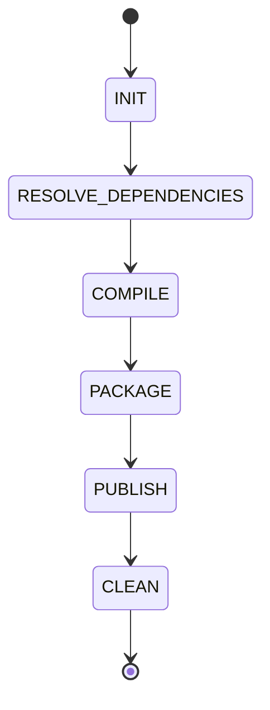

**图示来源**
- [LifecyclePhase.java](file://src/main/java/org/jcnc/snow/pkg/lifecycle/LifecyclePhase.java#L15-L34)

### 生命周期管理器

`LifecycleManager`负责管理不同生命周期阶段与对应任务的映射关系，并支持按顺序执行所有已注册的任务。

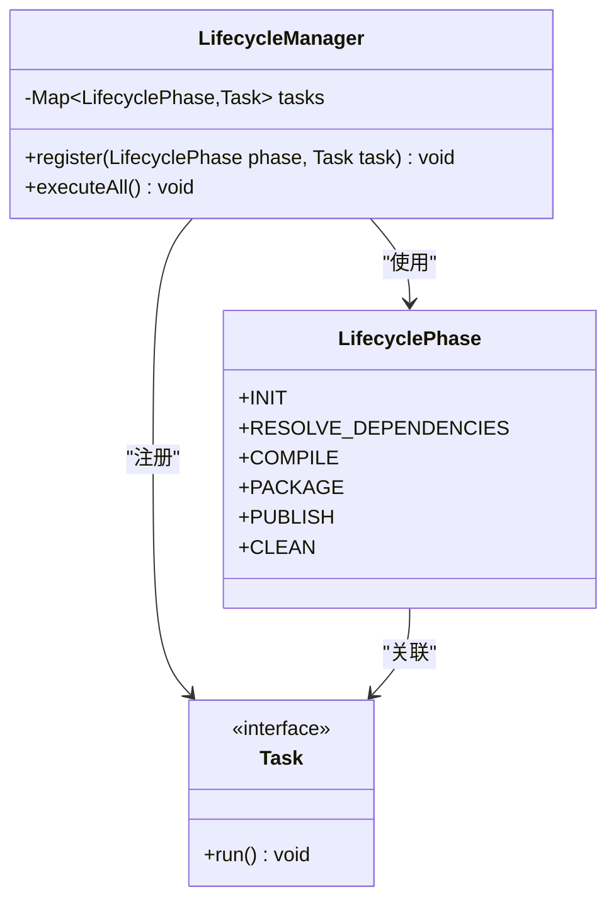

**图示来源**
- [LifecycleManager.java](file://src/main/java/org/jcnc/snow/pkg/lifecycle/LifecycleManager.java#L15-L66)
- [LifecyclePhase.java](file://src/main/java/org/jcnc/snow/pkg/lifecycle/LifecyclePhase.java#L15-L34)
- [Task.java](file://src/main/java/org/jcnc/snow/pkg/tasks/Task.java#L15-L21)

**本节来源**
- [LifecycleManager.java](file://src/main/java/org/jcnc/snow/pkg/lifecycle/LifecycleManager.java#L15-L66)
- [LifecyclePhase.java](file://src/main/java/org/jcnc/snow/pkg/lifecycle/LifecyclePhase.java#L15-L34)

## 任务抽象与具体实现

Snow包管理系统通过`Task`接口定义了所有构建任务的统一契约，实现了任务的可插拔性和可组合性。

### 任务接口

`Task`接口是所有构建任务的统一抽象，定义了任务执行的入口方法。

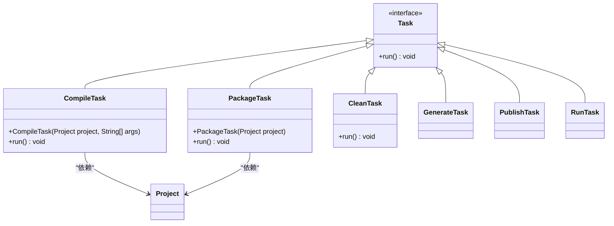

**图示来源**
- [Task.java](file://src/main/java/org/jcnc/snow/pkg/tasks/Task.java#L15-L21)
- [CompileTask.java](file://src/main/java/org/jcnc/snow/pkg/tasks/CompileTask.java#L15-L425)
- [PackageTask.java](file://src/main/java/org/jcnc/snow/pkg/tasks/PackageTask.java#L15-L71)
- [CleanTask.java](file://src/main/java/org/jcnc/snow/pkg/tasks/CleanTask.java#L15-L58)

### 具体任务实现

#### 编译任务

`CompileTask`负责将`.snow`源文件编译为VM字节码（`.water`文件），是命令行编译任务的具体实现。

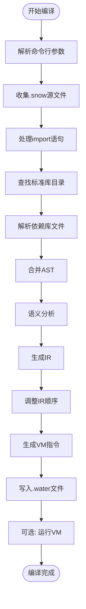

**图示来源**
- [CompileTask.java](file://src/main/java/org/jcnc/snow/pkg/tasks/CompileTask.java#L15-L425)

#### 打包任务

`PackageTask`负责将项目的编译输出目录打包为`.ice`文件，用于项目分发。

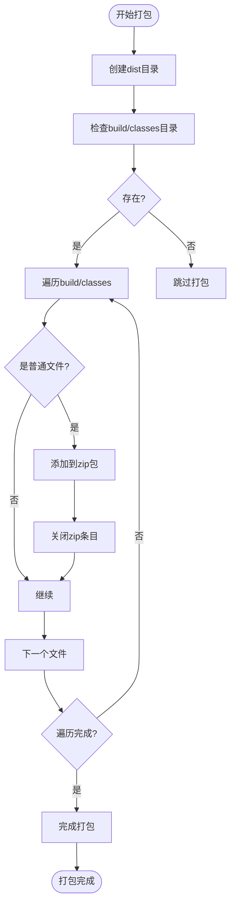

**图示来源**
- [PackageTask.java](file://src/main/java/org/jcnc/snow/pkg/tasks/PackageTask.java#L15-L71)

#### 清理任务

`CleanTask`负责清理构建输出目录，递归删除`build`和`dist`目录。

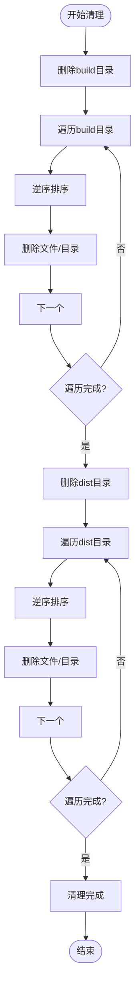

**图示来源**
- [CleanTask.java](file://src/main/java/org/jcnc/snow/pkg/tasks/CleanTask.java#L15-L58)

**本节来源**
- [Task.java](file://src/main/java/org/jcnc/snow/pkg/tasks/Task.java#L15-L21)
- [CompileTask.java](file://src/main/java/org/jcnc/snow/pkg/tasks/CompileTask.java#L15-L425)
- [PackageTask.java](file://src/main/java/org/jcnc/snow/pkg/tasks/PackageTask.java#L15-L71)
- [CleanTask.java](file://src/main/java/org/jcnc/snow/pkg/tasks/CleanTask.java#L15-L58)

## 依赖解析机制

Snow包管理系统的依赖解析机制通过`DependencyResolver`类实现，支持本地缓存和远程仓库下载。

### 依赖解析流程

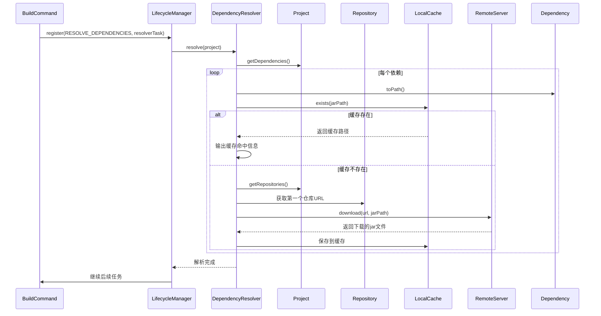

**图示来源**
- [DependencyResolver.java](file://src/main/java/org/jcnc/snow/pkg/resolver/DependencyResolver.java#L15-L84)
- [BuildCommand.java](file://src/main/java/org/jcnc/snow/cli/commands/BuildCommand.java#L15-L86)

### 依赖解析策略

`DependencyResolver`采用以下策略进行依赖解析：

1. **本地缓存优先**: 首先检查依赖是否已存在于本地缓存目录中
2. **单仓库下载**: 从项目配置的第一个仓库下载依赖
3. **路径映射**: 将依赖坐标转换为仓库中的文件路径
4. **自动创建目录**: 自动创建必要的目录结构

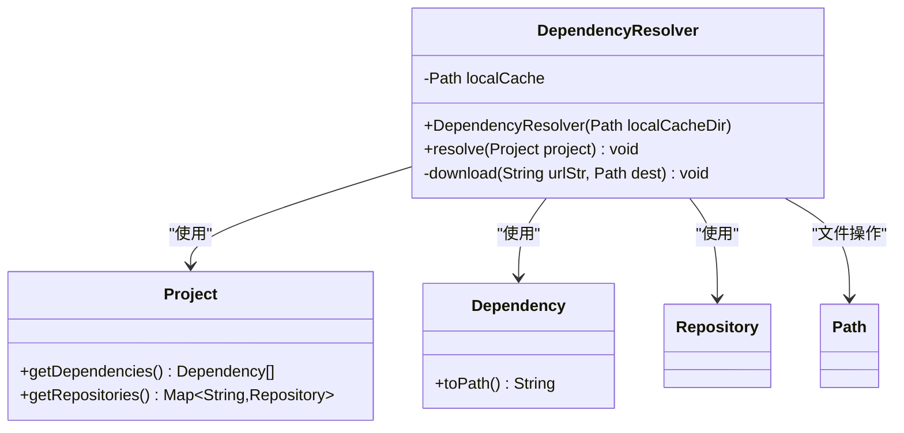

**图示来源**
- [DependencyResolver.java](file://src/main/java/org/jcnc/snow/pkg/resolver/DependencyResolver.java#L15-L84)

**本节来源**
- [DependencyResolver.java](file://src/main/java/org/jcnc/snow/pkg/resolver/DependencyResolver.java#L15-L84)
- [BuildCommand.java](file://src/main/java/org/jcnc/snow/cli/commands/BuildCommand.java#L15-L86)

## 构建任务执行流程

Snow包管理系统的构建任务执行流程通过`BuildCommand`协调`LifecycleManager`来实现，确保了构建过程的标准化和可预测性。

### 构建命令执行流程

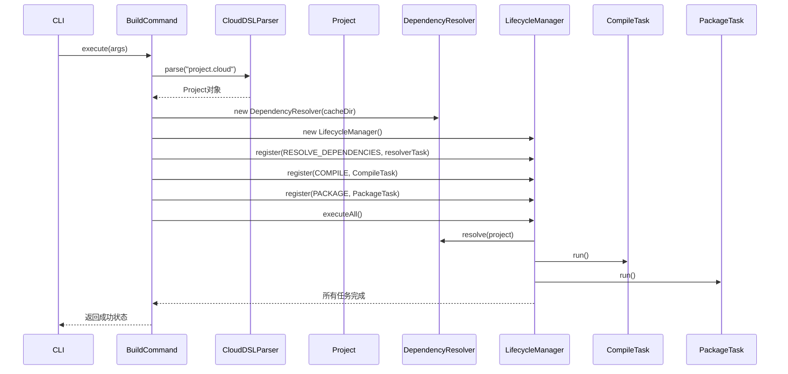

**图示来源**
- [BuildCommand.java](file://src/main/java/org/jcnc/snow/cli/commands/BuildCommand.java#L15-L86)

### 初始化命令执行流程

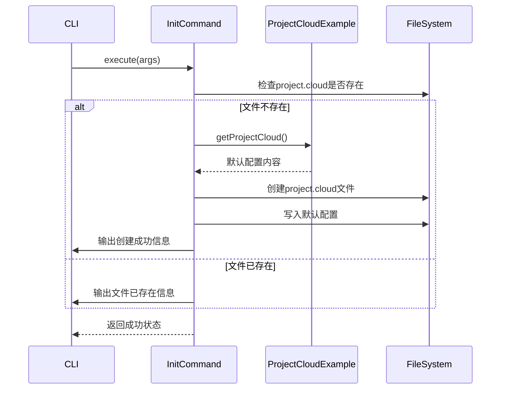

**图示来源**
- [InitCommand.java](file://src/main/java/org/jcnc/snow/cli/commands/InitCommand.java#L15-L71)

**本节来源**
- [BuildCommand.java](file://src/main/java/org/jcnc/snow/cli/commands/BuildCommand.java#L15-L86)
- [InitCommand.java](file://src/main/java/org/jcnc/snow/cli/commands/InitCommand.java#L15-L71)

## 自定义构建任务开发指南

开发者可以基于Snow包管理系统的任务框架创建自定义构建任务，以满足特定的构建需求。

### 自定义任务开发步骤

1. **实现Task接口**: 创建新类并实现`Task`接口
2. **注入项目上下文**: 在构造函数中接收必要的项目信息
3. **实现run方法**: 定义任务的具体执行逻辑
4. **注册到生命周期**: 在适当的位置注册自定义任务

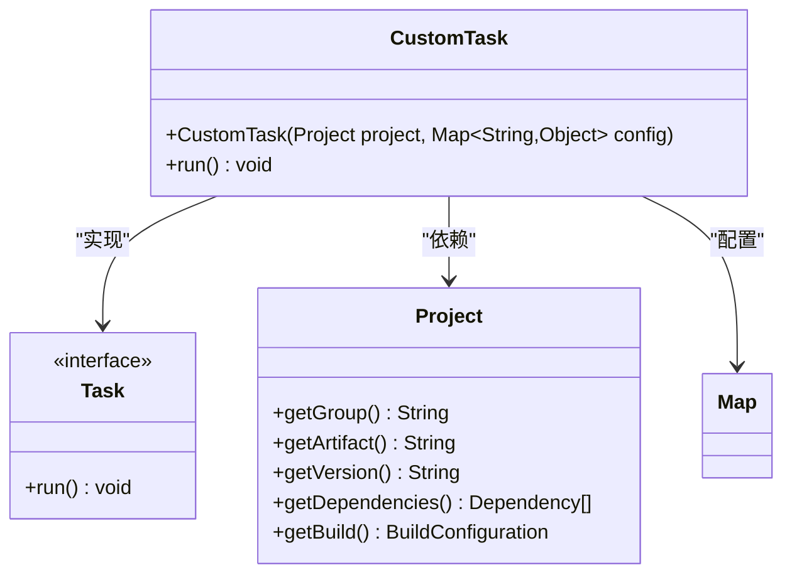

### 最佳实践

- **保持幂等性**: 确保任务可以安全地重复执行
- **处理异常**: 捕获并妥善处理可能的异常情况
- **输出日志**: 提供清晰的执行进度和结果信息
- **资源管理**: 正确管理文件句柄、网络连接等资源
- **配置驱动**: 通过配置而非硬编码控制行为

**本节来源**
- [Task.java](file://src/main/java/org/jcnc/snow/pkg/tasks/Task.java#L15-L21)
- [CompileTask.java](file://src/main/java/org/jcnc/snow/pkg/tasks/CompileTask.java#L15-L425)
- [PackageTask.java](file://src/main/java/org/jcnc/snow/pkg/tasks/PackageTask.java#L15-L71)

## 性能优化与高级主题

Snow包管理系统提供了多种性能优化和高级功能，以提升开发效率和系统可靠性。

### 依赖缓存机制

依赖缓存是Snow包管理系统的核心性能优化特性，通过本地缓存避免重复下载相同的依赖。

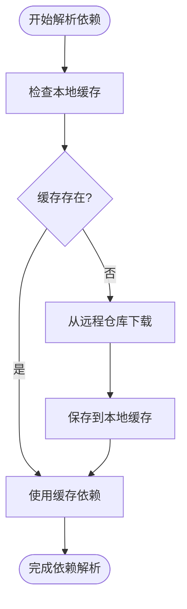

**图示来源**
- [DependencyResolver.java](file://src/main/java/org/jcnc/snow/pkg/resolver/DependencyResolver.java#L15-L84)

### 离线模式支持

通过本地缓存机制，Snow包管理系统天然支持离线模式。当所有依赖都已缓存时，构建过程无需网络连接。

### 安全验证

虽然当前代码中未直接体现，但可以通过以下方式增强安全验证：
- 依赖完整性校验（如SHA256哈希）
- 仓库SSL/TLS加密连接
- 依赖来源签名验证
- 恶意代码扫描

### 性能优化建议

1. **合理使用缓存**: 确保网络稳定时及时更新本地缓存
2. **并行任务执行**: 在不影响依赖关系的前提下并行执行独立任务
3. **增量编译**: 只重新编译修改过的文件
4. **资源池化**: 复用编译器实例和虚拟机环境
5. **内存优化**: 控制大文件处理时的内存使用

**本节来源**
- [DependencyResolver.java](file://src/main/java/org/jcnc/snow/pkg/resolver/DependencyResolver.java#L15-L84)
- [SnowConfig.java](file://src/main/java/org/jcnc/snow/common/SnowConfig.java#L15-L91)