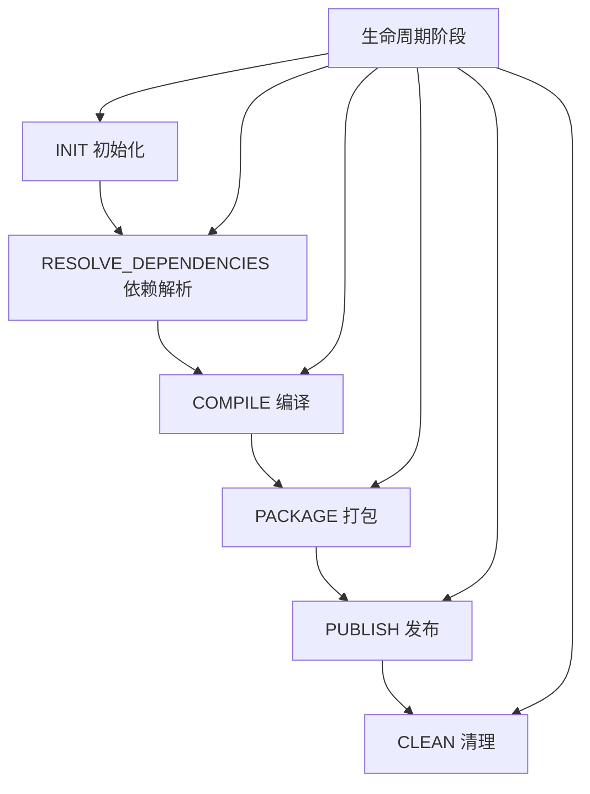
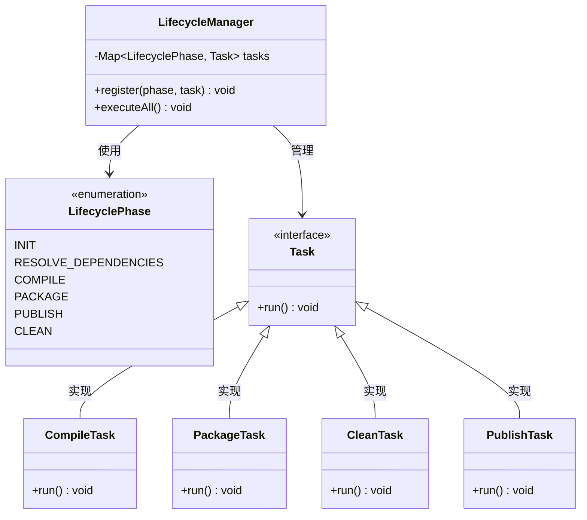
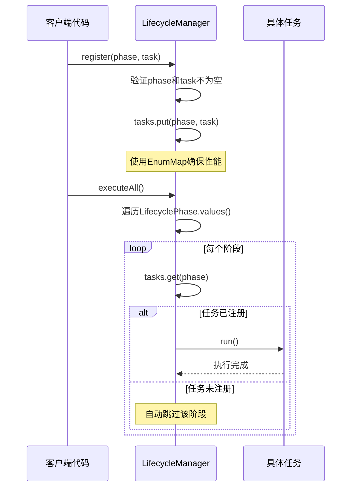
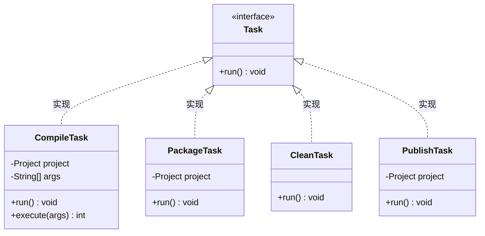
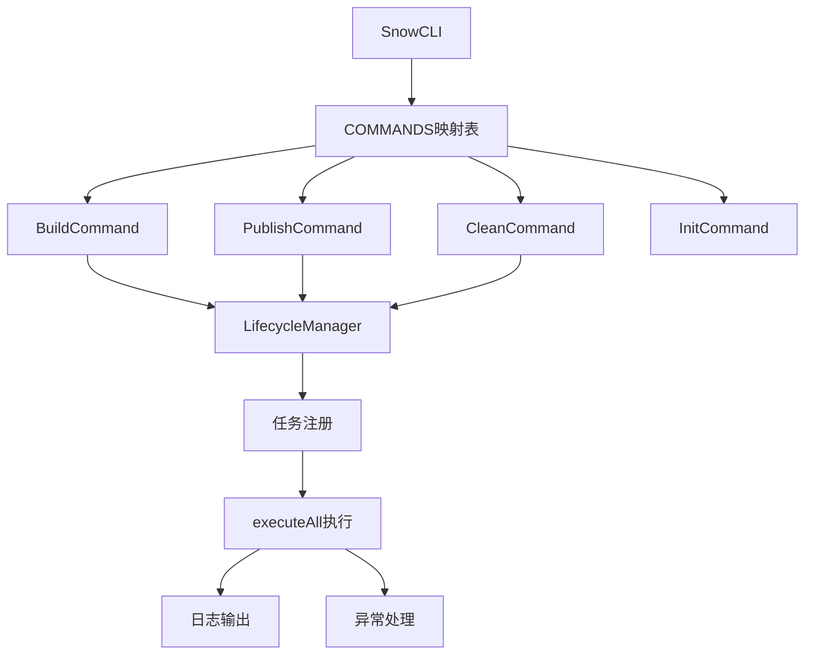
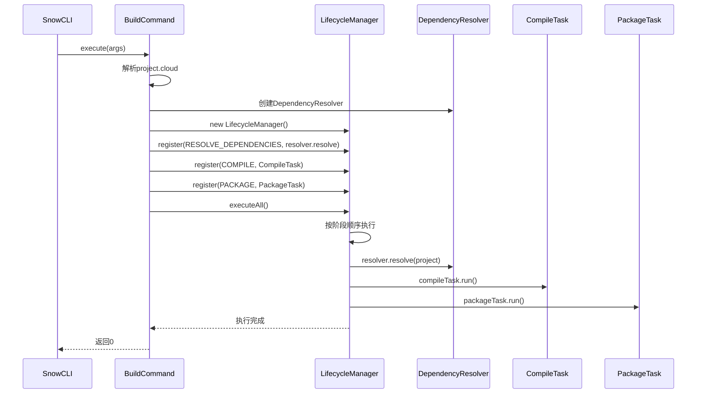
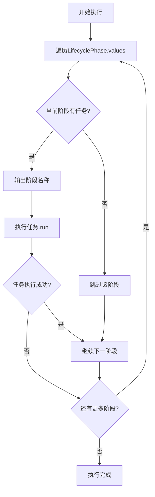
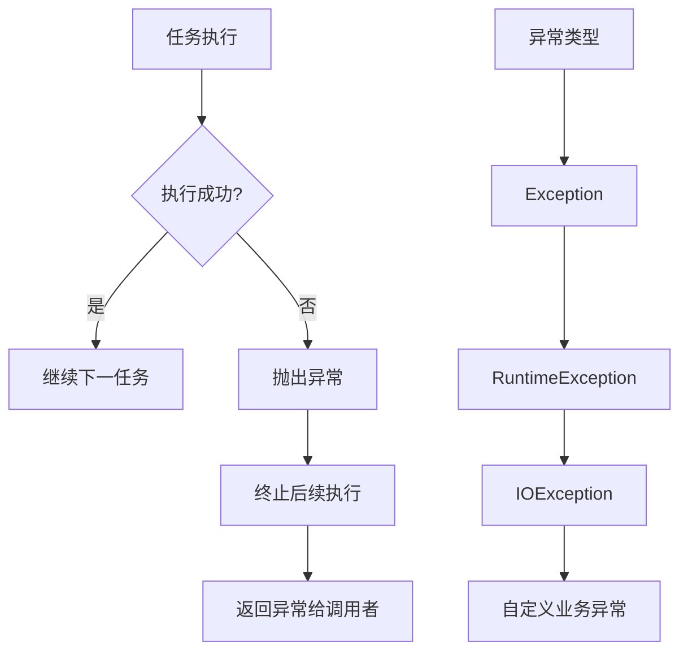

# Snow项目生命周期管理详细文档

<cite>
**本文档引用的文件**
- [LifecyclePhase.java](file://src/main/java/org/jcnc/snow/pkg/lifecycle/LifecyclePhase.java)
- [LifecycleManager.java](file://src/main/java/org/jcnc/snow/pkg/lifecycle/LifecycleManager.java)
- [Task.java](file://src/main/java/org/jcnc/snow/pkg/tasks/Task.java)
- [BuildCommand.java](file://src/main/java/org/jcnc/snow/cli/commands/BuildCommand.java)
- [CompileTask.java](file://src/main/java/org/jcnc/snow/pkg/tasks/CompileTask.java)
- [PackageTask.java](file://src/main/java/org/jcnc/snow/pkg/tasks/PackageTask.java)
- [CleanTask.java](file://src/main/java/org/jcnc/snow/pkg/tasks/CleanTask.java)
- [PublishTask.java](file://src/main/java/org/jcnc/snow/pkg/tasks/PublishTask.java)
- [PublishCommand.java](file://src/main/java/org/jcnc/snow/cli/commands/PublishCommand.java)
- [CleanCommand.java](file://src/main/java/org/jcnc/snow/cli/commands/CleanCommand.java)
- [InitCommand.java](file://src/main/java/org/jcnc/snow/cli/commands/InitCommand.java)
- [GenerateTask.java](file://src/main/java/org/jcnc/snow/pkg/tasks/GenerateTask.java)
- [SnowCLI.java](file://src/main/java/org/jcnc/snow/cli/SnowCLI.java)
</cite>

## 目录
1. [概述](#概述)
2. [生命周期阶段定义](#生命周期阶段定义)
3. [生命周期管理器架构](#生命周期管理器架构)
4. [任务系统设计](#任务系统设计)
5. [CLI命令集成](#cli命令集成)
6. [任务执行流程](#任务执行流程)
7. [异常处理机制](#异常处理机制)
8. [扩展开发指南](#扩展开发指南)
9. [最佳实践](#最佳实践)
10. [总结](#总结)

## 概述

Snow项目采用了一套完整的生命周期管理系统，通过`LifecyclePhase`枚举定义了软件包开发的标准阶段，并通过`LifecycleManager`实现了这些阶段的有序执行。该系统为项目构建、测试、打包和发布提供了统一的流程控制框架。

### 核心特性

- **标准化阶段划分**：定义了INIT、RESOLVE_DEPENDENCIES、COMPILE、PACKAGE、PUBLISH、CLEAN六个核心阶段
- **灵活的任务注册**：支持为每个阶段动态注册自定义任务
- **顺序执行控制**：严格按照阶段声明顺序执行任务
- **异常安全保障**：提供完善的异常处理和跳过机制
- **CLI集成**：与命令行工具无缝集成，支持多种构建场景

## 生命周期阶段定义

### 阶段枚举详解



**图表来源**
- [LifecyclePhase.java](file://src/main/java/org/jcnc/snow/pkg/lifecycle/LifecyclePhase.java#L10-L34)

#### INIT（初始化阶段）
- **目的**：准备项目环境和基础配置
- **典型任务**：创建项目目录结构、生成配置文件
- **实现示例**：[InitCommand.java](file://src/main/java/org/jcnc/snow/cli/commands/InitCommand.java#L40-L60)

#### RESOLVE_DEPENDENCIES（依赖解析阶段）
- **目的**：解析和下载项目所需的外部依赖
- **典型任务**：检查依赖版本、下载缺失组件
- **实现示例**：[BuildCommand.java](file://src/main/java/org/jcnc/snow/cli/commands/BuildCommand.java#L60-L65)

#### COMPILE（编译阶段）
- **目的**：将源代码转换为目标格式
- **典型任务**：语法分析、语义检查、代码生成
- **实现示例**：[CompileTask.java](file://src/main/java/org/jcnc/snow/pkg/tasks/CompileTask.java#L300-L425)

#### PACKAGE（打包阶段）
- **目的**：将编译输出打包为可分发格式
- **典型任务**：文件压缩、元数据生成、版本标记
- **实现示例**：[PackageTask.java](file://src/main/java/org/jcnc/snow/pkg/tasks/PackageTask.java#L45-L71)

#### PUBLISH（发布阶段）
- **目的**：将制品发布到远程仓库
- **典型任务**：上传文件、更新索引、通知下游
- **实现示例**：[PublishTask.java](file://src/main/java/org/jcnc/snow/pkg/tasks/PublishTask.java#L30-L34)

#### CLEAN（清理阶段）
- **目的**：清理构建产物和临时文件
- **典型任务**：删除输出目录、清空缓存
- **实现示例**：[CleanTask.java](file://src/main/java/org/jcnc/snow/pkg/tasks/CleanTask.java#L35-L58)

**章节来源**
- [LifecyclePhase.java](file://src/main/java/org/jcnc/snow/pkg/lifecycle/LifecyclePhase.java#L10-L34)

## 生命周期管理器架构

### 核心组件设计



**图表来源**
- [LifecycleManager.java](file://src/main/java/org/jcnc/snow/pkg/lifecycle/LifecycleManager.java#L20-L66)
- [Task.java](file://src/main/java/org/jcnc/snow/pkg/tasks/Task.java#L10-L21)

### 注册机制

LifecycleManager通过`register`方法建立阶段与任务的映射关系：



**图表来源**
- [LifecycleManager.java](file://src/main/java/org/jcnc/snow/pkg/lifecycle/LifecycleManager.java#L30-L66)

**章节来源**
- [LifecycleManager.java](file://src/main/java/org/jcnc/snow/pkg/lifecycle/LifecycleManager.java#L20-L66)

## 任务系统设计

### 任务接口规范

所有生命周期任务都必须实现`Task`接口，确保统一的执行契约：



**图表来源**
- [Task.java](file://src/main/java/org/jcnc/snow/pkg/tasks/Task.java#L10-L21)
- [CompileTask.java](file://src/main/java/org/jcnc/snow/pkg/tasks/CompileTask.java#L50-L60)

### 任务实现模式

#### 编译任务（CompileTask）
- **职责**：将Snow源代码编译为VM字节码
- **特点**：支持命令行参数解析、多文件编译、自动运行
- **实现细节**：词法分析、语法解析、语义分析、IR生成、VM代码生成

#### 打包任务（PackageTask）
- **职责**：将编译输出打包为ICE格式
- **特点**：保持目录结构、自动创建输出目录
- **实现细节**：ZIP压缩、文件过滤、路径处理

#### 清理任务（CleanTask）
- **职责**：删除构建产物和临时文件
- **特点**：递归删除、线程安全、无状态设计
- **实现细节**：深度优先遍历、异常处理

**章节来源**
- [CompileTask.java](file://src/main/java/org/jcnc/snow/pkg/tasks/CompileTask.java#L50-L425)
- [PackageTask.java](file://src/main/java/org/jcnc/snow/pkg/tasks/PackageTask.java#L20-L71)
- [CleanTask.java](file://src/main/java/org/jcnc/snow/pkg/tasks/CleanTask.java#L15-L58)

## CLI命令集成

### 命令架构



**图表来源**
- [SnowCLI.java](file://src/main/java/org/jcnc/snow/cli/SnowCLI.java#L30-L45)
- [BuildCommand.java](file://src/main/java/org/jcnc/snow/cli/commands/BuildCommand.java#L70-L85)

### BuildCommand集成示例

BuildCommand展示了完整的生命周期管理集成：



**图表来源**
- [BuildCommand.java](file://src/main/java/org/jcnc/snow/cli/commands/BuildCommand.java#L70-L85)

### 其他命令集成

#### PublishCommand
- **特点**：专注于发布阶段，简化任务注册
- **实现**：[PublishCommand.java](file://src/main/java/org/jcnc/snow/cli/commands/PublishCommand.java#L60-L74)

#### CleanCommand  
- **特点**：单阶段清理，最小化复杂度
- **实现**：[CleanCommand.java](file://src/main/java/org/jcnc/snow/cli/commands/CleanCommand.java#L55-L62)

**章节来源**
- [BuildCommand.java](file://src/main/java/org/jcnc/snow/cli/commands/BuildCommand.java#L70-L85)
- [PublishCommand.java](file://src/main/java/org/jcnc/snow/cli/commands/PublishCommand.java#L60-L74)
- [CleanCommand.java](file://src/main/java/org/jcnc/snow/cli/commands/CleanCommand.java#L55-L62)

## 任务执行流程

### 执行顺序控制

LifecycleManager严格按照`LifecyclePhase`枚举的声明顺序执行任务：



**图表来源**
- [LifecycleManager.java](file://src/main/java/org/jcnc/snow/pkg/lifecycle/LifecycleManager.java#L50-L66)

### 日志输出机制

每个任务执行前都会输出阶段名称，便于跟踪执行过程：

```java
// 输出格式示例
System.out.println(">>> Phase: " + phase);
```

这种设计提供了：
- **清晰的执行轨迹**：用户可以清楚知道当前执行到哪个阶段
- **调试友好**：便于排查执行过程中的问题
- **用户体验**：提供进度反馈，避免长时间等待的困惑

### 阶段跳过策略

未注册任务的阶段会被自动跳过，这种设计提供了：
- **灵活性**：允许部分阶段的可选执行
- **向后兼容**：新添加的阶段不会影响现有流程
- **性能优化**：跳过不必要的步骤

**章节来源**
- [LifecycleManager.java](file://src/main/java/org/jcnc/snow/pkg/lifecycle/LifecycleManager.java#L50-L66)

## 异常处理机制

### 异常传播策略

LifecycleManager采用"一旦失败，立即终止"的异常处理策略：



### 异常处理优势

1. **一致性**：所有任务都遵循相同的异常处理规则
2. **可靠性**：防止部分失败导致的数据不一致
3. **可预测性**：明确的失败点便于错误定位
4. **资源保护**：及时终止避免资源泄漏

### 异常恢复建议

虽然当前设计采用立即终止策略，但可以通过以下方式增强异常处理：

```java
// 建议的异常处理模式
try {
    lifecycleManager.executeAll();
} catch (Exception e) {
    // 记录完整堆栈信息
    logger.error("生命周期执行失败", e);
    // 清理已执行的部分
    cleanupPartialResults();
    // 返回适当的退出码
    return 1;
}
```

**章节来源**
- [LifecycleManager.java](file://src/main/java/org/jcnc/snow/pkg/lifecycle/LifecycleManager.java#L50-L66)

## 扩展开发指南

### 自定义生命周期阶段

虽然当前系统定义了六个标准阶段，但可以通过继承或扩展来添加新的阶段：

```java
// 扩展示例：添加TEST阶段
public enum ExtendedLifecyclePhase {
    INIT,
    RESOLVE_DEPENDENCIES,
    COMPILE,
    TEST,          // 新增测试阶段
    PACKAGE,
    PUBLISH,
    CLEAN
}
```

### 自定义任务开发

开发自定义任务需要实现`Task`接口：

```java
public class CustomTask implements Task {
    private final Project project;
    
    public CustomTask(Project project) {
        this.project = project;
    }
    
    @Override
    public void run() throws Exception {
        // 实现自定义逻辑
        System.out.println("执行自定义任务...");
        
        // 可能的操作
        // 1. 项目分析
        // 2. 资源准备
        // 3. 业务逻辑执行
        // 4. 结果验证
        
        System.out.println("自定义任务完成");
    }
}
```

### 生命周期管理器扩展

可以创建专门的管理器来处理特定场景：

```java
public class TestLifecycleManager extends LifecycleManager {
    public void registerTestTasks(Project project) {
        // 注册测试相关任务
        register(LifecyclePhase.TEST, new UnitTestTask(project));
        register(LifecyclePhase.TEST, new IntegrationTestTask(project));
        // 可以添加更多测试阶段
    }
}
```

### 实际应用示例

#### 添加测试阶段

```java
// 在BuildCommand中添加测试阶段
@Override
public int execute(String[] args) throws Exception {
    Project project = CloudDSLParser.parse(Paths.get("project.cloud"));
    DependencyResolver resolver = new DependencyResolver(cacheDir);
    LifecycleManager lm = new LifecycleManager();
    
    // 注册现有阶段
    lm.register(LifecyclePhase.RESOLVE_DEPENDENCIES, () -> resolver.resolve(project));
    lm.register(LifecyclePhase.COMPILE, new CompileTask(project));
    lm.register(LifecyclePhase.PACKAGE, new PackageTask(project));
    
    // 添加测试阶段
    lm.register(LifecyclePhase.TEST, new TestTask(project));
    
    lm.executeAll();
    return 0;
}
```

#### 自定义发布任务

```java
public class AdvancedPublishTask implements Task {
    private final Project project;
    private final String repositoryUrl;
    
    public AdvancedPublishTask(Project project, String repositoryUrl) {
        this.project = project;
        this.repositoryUrl = repositoryUrl;
    }
    
    @Override
    public void run() throws Exception {
        // 实现高级发布逻辑
        System.out.println("发布到: " + repositoryUrl);
        // 包含认证、签名、重试等逻辑
    }
}
```

**章节来源**
- [Task.java](file://src/main/java/org/jcnc/snow/pkg/tasks/Task.java#L10-L21)
- [BuildCommand.java](file://src/main/java/org/jcnc/snow/cli/commands/BuildCommand.java#L70-L85)

## 最佳实践

### 任务设计原则

1. **单一职责**：每个任务只负责一个明确的功能
2. **幂等性**：重复执行应该产生相同的结果
3. **状态无关**：任务不应该依赖外部状态
4. **异常安全**：正确处理各种异常情况

### 生命周期管理最佳实践

1. **阶段顺序**：严格遵循标准的阶段顺序
2. **任务注册**：在执行前完成所有任务注册
3. **资源管理**：确保任务使用的资源得到正确释放
4. **日志记录**：提供足够的执行信息

### 性能优化建议

1. **并行执行**：对于独立的阶段可以考虑并行执行
2. **增量构建**：只处理发生变化的文件
3. **缓存利用**：合理利用编译缓存和依赖缓存
4. **内存管理**：大型项目注意内存使用

### 错误处理策略

1. **预防性检查**：在任务执行前进行充分验证
2. **优雅降级**：某些阶段失败时的备选方案
3. **详细日志**：提供足够的错误信息用于调试
4. **用户友好**：向用户提供清晰的错误指导

## 总结

Snow项目的生命周期管理系统提供了一个完整、灵活且易于扩展的构建流程控制框架。通过标准化的阶段定义、灵活的任务注册机制和可靠的执行控制，该系统能够满足从简单项目到复杂企业应用的各种构建需求。

### 核心价值

- **标准化**：提供业界认可的软件包生命周期模型
- **灵活性**：支持自定义阶段和任务的扩展
- **可靠性**：完善的异常处理和执行控制机制
- **易用性**：简洁的API设计和清晰的执行流程

### 发展方向

随着项目的发展，该生命周期管理系统可以在以下方面进一步完善：

1. **并行执行**：支持阶段间的并行处理
2. **条件执行**：基于配置的阶段选择性执行
3. **插件系统**：更灵活的任务扩展机制
4. **可视化**：提供执行流程的图形化展示

这个生命周期管理系统不仅为Snow项目本身提供了强大的构建能力，也为其他类似项目提供了优秀的参考架构。