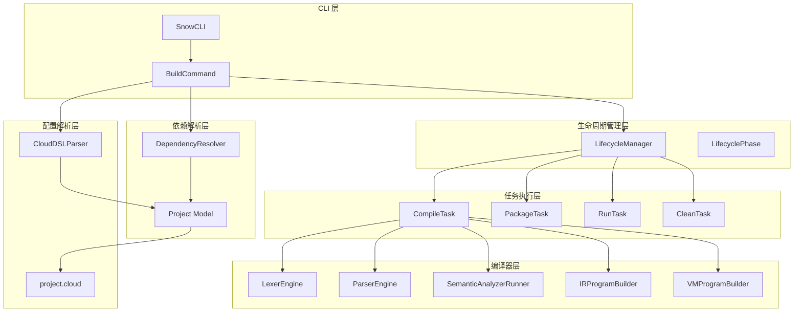
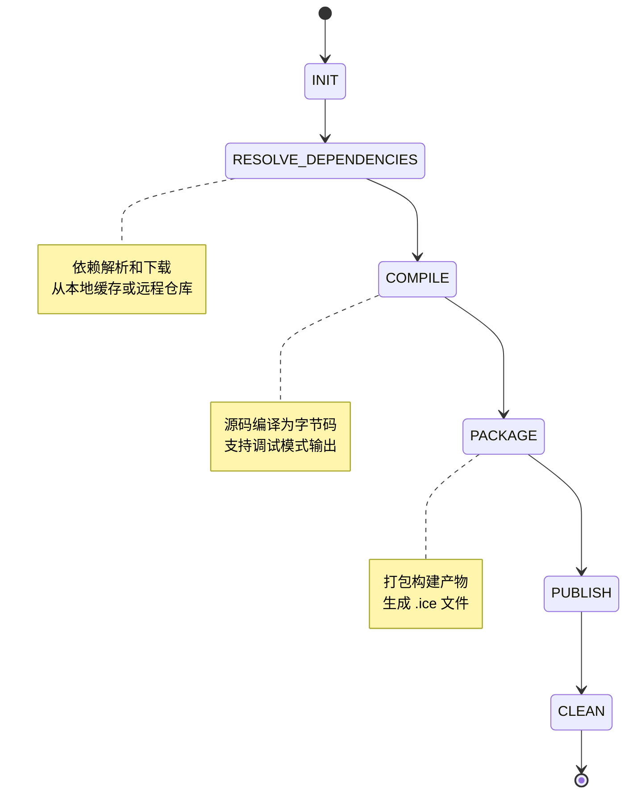
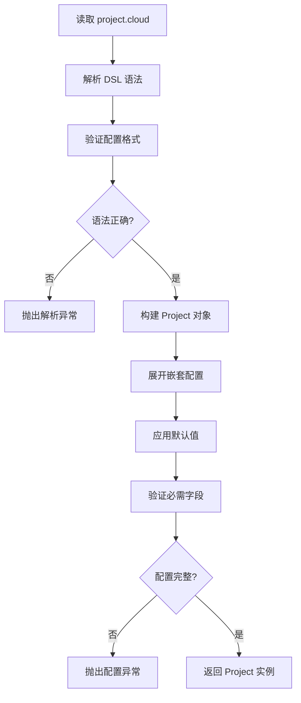
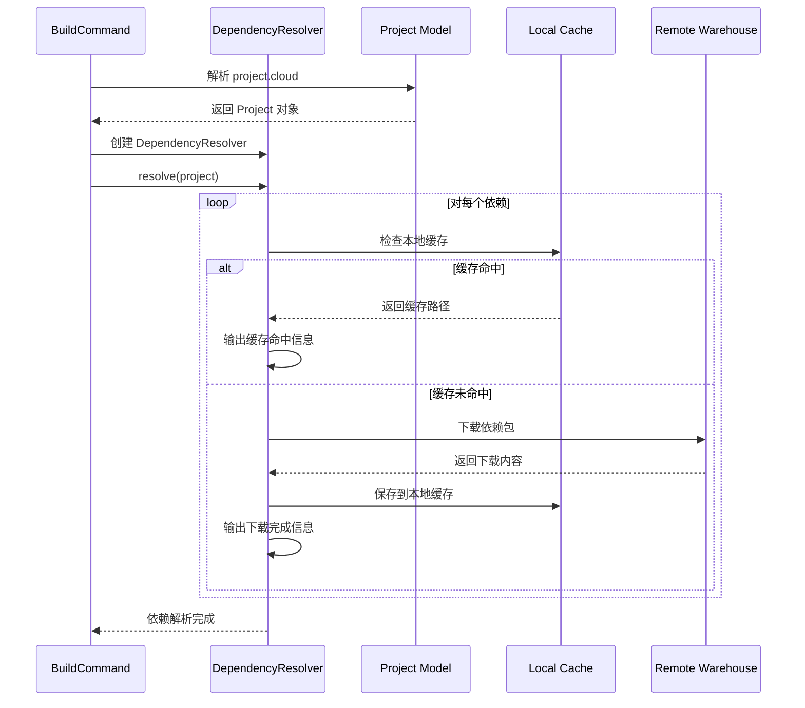
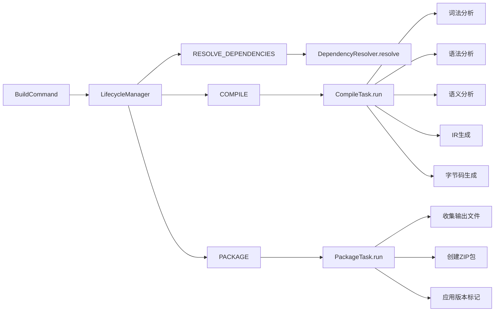

# build 命令

<cite>
**本文档中引用的文件**
- [BuildCommand.java](file://src/main/java/org/jcnc/snow/cli/commands/BuildCommand.java)
- [LifecycleManager.java](file://src/main/java/org/jcnc/snow/pkg/lifecycle/LifecycleManager.java)
- [LifecyclePhase.java](file://src/main/java/org/jcnc/snow/pkg/lifecycle/LifecyclePhase.java)
- [DependencyResolver.java](file://src/main/java/org/jcnc/snow/pkg/resolver/DependencyResolver.java)
- [CompileTask.java](file://src/main/java/org/jcnc/snow/pkg/tasks/CompileTask.java)
- [PackageTask.java](file://src/main/java/org/jcnc/snow/pkg/tasks/PackageTask.java)
- [CloudDSLParser.java](file://src/main/java/org/jcnc/snow/pkg/dsl/CloudDSLParser.java)
- [Project.java](file://src/main/java/org/jcnc/snow/pkg/model/Project.java)
- [SnowConfig.java](file://src/main/java/org/jcnc/snow/common/SnowConfig.java)
- [Mode.java](file://src/main/java/org/jcnc/snow/common/Mode.java)
- [ProjectCloudExample.java](file://src/main/java/org/jcnc/snow/cli/utils/ProjectCloudExample.java)
</cite>

## 目录
1. [简介](#简介)
2. [命令概述](#命令概述)
3. [核心架构](#核心架构)
4. [构建生命周期](#构建生命周期)
5. [配置文件系统](#配置文件系统)
6. [依赖解析机制](#依赖解析机制)
7. [任务执行流程](#任务执行流程)
8. [使用示例](#使用示例)
9. [高级配置](#高级配置)
10. [故障排除](#故障排除)

## 简介

`build` 命令是 Snow 构建系统的中央控制台工具，提供了一键式项目构建体验。它自动协调整个构建生命周期，包括依赖解析、源码编译、资源打包等关键步骤，确保项目能够从源代码到最终产物的完整转换。

该命令设计遵循现代构建工具的最佳实践，采用模块化架构，支持多种构建配置和目标环境，同时提供了丰富的调试和诊断功能。

## 命令概述

### 基本语法

```bash
snow build [options]
```

### 功能特性

- **自动化构建**：一键执行完整的构建流程
- **依赖管理**：自动解析和下载项目依赖
- **多阶段构建**：支持初始化、依赖解析、编译、打包、发布、清理等阶段
- **配置灵活**：支持多种配置文件格式和构建目标
- **调试友好**：提供详细的构建过程日志和错误信息

**章节来源**
- [BuildCommand.java](file://src/main/java/org/jcnc/snow/cli/commands/BuildCommand.java#L15-L25)

## 核心架构

### 系统架构图



**图表来源**
- [BuildCommand.java](file://src/main/java/org/jcnc/snow/cli/commands/BuildCommand.java#L60-L85)
- [LifecycleManager.java](file://src/main/java/org/jcnc/snow/pkg/lifecycle/LifecycleManager.java#L15-L35)
- [DependencyResolver.java](file://src/main/java/org/jcnc/snow/pkg/resolver/DependencyResolver.java#L15-L35)

### 核心组件说明

#### BuildCommand 类
负责 CLI 接口的实现，作为整个构建流程的入口点。它协调各个子系统的工作，确保构建过程的顺利进行。

#### LifecycleManager 类
提供构建生命周期的统一管理，支持任务注册、顺序执行和阶段划分。

#### 任务系统
包含多个专门的任务类，每个任务负责构建流程中的特定阶段：
- **CompileTask**：源码编译和字节码生成
- **PackageTask**：构建产物打包
- **RunTask**：字节码运行
- **CleanTask**：构建清理

**章节来源**
- [BuildCommand.java](file://src/main/java/org/jcnc/snow/cli/commands/BuildCommand.java#L25-L45)
- [LifecycleManager.java](file://src/main/java/org/jcnc/snow/pkg/lifecycle/LifecycleManager.java#L15-L66)

## 构建生命周期

### 生命周期阶段

Snow 构建系统定义了标准化的生命周期阶段，每个阶段都有明确的职责和执行顺序：



**图表来源**
- [LifecyclePhase.java](file://src/main/java/org/jcnc/snow/pkg/lifecycle/LifecyclePhase.java#L10-L34)

### 阶段详解

#### 1. INIT（初始化）
- 创建必要的目录结构
- 初始化构建环境
- 准备临时文件和缓存

#### 2. RESOLVE_DEPENDENCIES（依赖解析）
- 分析项目依赖声明
- 检查本地缓存
- 下载缺失的依赖包

#### 3. COMPILE（编译）
- 解析源代码文件
- 执行语义分析
- 生成中间表示（IR）
- 编译为目标字节码

#### 4. PACKAGE（打包）
- 收集编译输出
- 创建最终产物
- 应用版本标记

#### 5. PUBLISH（发布）
- 上传构建产物
- 更新版本记录
- 执行发布验证

#### 6. CLEAN（清理）
- 删除临时文件
- 清理构建缓存
- 释放系统资源

**章节来源**
- [LifecyclePhase.java](file://src/main/java/org/jcnc/snow/pkg/lifecycle/LifecyclePhase.java#L10-L34)
- [LifecycleManager.java](file://src/main/java/org/jcnc/snow/pkg/lifecycle/LifecycleManager.java#L45-L66)

## 配置文件系统

### project.cloud 配置文件

Snow 使用自定义的 DSL（领域特定语言）来定义项目配置，文件名为 `project.cloud`。

#### 基本配置结构

```yaml
project {
    group    = "com.example"
    artifact = "demo-app"
    version  = "1.0.0"
    name     = "Demo Application"
    description = "A sample Snow application"
    license  = "MIT"
    homepage = "https://example.com"
}

repositories {
    central = "https://repo.maven.apache.org/maven2"
}

dependencies {
    snow-stdlib = "0.1.0"
    snow-utils  = "0.1.0"
}

build {
    srcDir = "src"
    output = "build/demo-app"
    debug  = false
}
```

#### 配置项说明

| 配置项 | 类型 | 必需 | 描述 |
|--------|------|------|------|
| `project.group` | String | 是 | 项目组织标识符 |
| `project.artifact` | String | 是 | 项目构件名称 |
| `project.version` | String | 是 | 项目版本号 |
| `project.name` | String | 否 | 项目显示名称 |
| `project.description` | String | 否 | 项目描述信息 |
| `project.license` | String | 否 | 许可证标识 |
| `project.homepage` | String | 否 | 项目主页URL |

#### 构建配置

| 配置项 | 类型 | 默认值 | 描述 |
|--------|------|--------|------|
| `build.srcDir` | String | "src" | 源代码目录 |
| `build.output` | String | artifact | 输出文件名 |
| `build.debug` | Boolean | false | 调试模式开关 |

**章节来源**
- [CloudDSLParser.java](file://src/main/java/org/jcnc/snow/pkg/dsl/CloudDSLParser.java#L15-L40)
- [ProjectCloudExample.java](file://src/main/java/org/jcnc/snow/cli/utils/ProjectCloudExample.java#L15-L30)

### 配置解析机制



**图表来源**
- [CloudDSLParser.java](file://src/main/java/org/jcnc/snow/pkg/dsl/CloudDSLParser.java#L60-L146)

**章节来源**
- [CloudDSLParser.java](file://src/main/java/org/jcnc/snow/pkg/dsl/CloudDSLParser.java#L60-L146)
- [Project.java](file://src/main/java/org/jcnc/snow/pkg/model/Project.java#L70-L120)

## 依赖解析机制

### 依赖解析流程

Snow 的依赖解析系统提供了智能的依赖管理功能，支持本地缓存和远程仓库访问。



**图表来源**
- [DependencyResolver.java](file://src/main/java/org/jcnc/snow/pkg/resolver/DependencyResolver.java#L35-L65)

### 依赖解析策略

#### 1. 本地缓存优先
- 检查本地缓存目录（默认：`~/.snow/cache`）
- 如果找到匹配的依赖，直接使用缓存版本
- 避免重复下载，提高构建速度

#### 2. 远程仓库回退
- 从配置的第一个仓库下载依赖
- 支持 Maven 仓库格式
- 自动处理依赖版本冲突

#### 3. 缓存管理
- 依赖按组织、构件、版本分类存储
- 支持手动清理缓存
- 提供缓存统计信息

**章节来源**
- [DependencyResolver.java](file://src/main/java/org/jcnc/snow/pkg/resolver/DependencyResolver.java#L35-L84)

## 任务执行流程

### 构建任务链



**图表来源**
- [BuildCommand.java](file://src/main/java/org/jcnc/snow/cli/commands/BuildCommand.java#L70-L85)
- [CompileTask.java](file://src/main/java/org/jcnc/snow/pkg/tasks/CompileTask.java#L350-L425)

### 任务执行顺序

1. **依赖解析阶段**
   - 解析项目依赖声明
   - 检查本地缓存
   - 下载缺失的依赖包
   - 验证依赖完整性

2. **编译阶段**
   - 递归扫描源代码文件
   - 执行词法分析和语法分析
   - 进行语义分析和类型检查
   - 生成中间表示（IR）
   - 编译为目标字节码

3. **打包阶段**
   - 收集编译输出文件
   - 创建 ZIP 格式的产物包
   - 应用版本和构建信息
   - 输出最终的 .ice 文件

**章节来源**
- [BuildCommand.java](file://src/main/java/org/jcnc/snow/cli/commands/BuildCommand.java#L70-L85)
- [LifecycleManager.java](file://src/main/java/org/jcnc/snow/pkg/lifecycle/LifecycleManager.java#L45-L66)

## 使用示例

### 基础构建

```bash
# 在项目根目录执行
snow build

# 输出示例
>>> Phase: RESOLVE_DEPENDENCIES
[dependency] snow-stdlib@0.1.0 resolved from cache.
>>> Phase: COMPILE
## 编译器输出
### Snow 源代码
#### main.snow
module: main
    function: main
        returns: void
        body:
            os.print("Hello World!")
        end body
    end function
end module

### IR
IRProgram {
    functions: [
        IRFunction {
            name: "main",
            params: [],
            returnType: "void",
            ...
        }
    ]
}

### VM code
0000: LOAD_CONST 0
0001: CALL 1
0002: RET

Written to build/demo-app.water
>>> Phase: PACKAGE
[package] created dist/demo-app-1.0.0.ice
```

### 调试模式构建

```bash
# 启用调试模式
snow build --debug

# 输出更详细的编译信息
>>> Phase: COMPILE
## 编译器输出
### Snow 源代码
#### main.snow
module: main
    function: main
        returns: void
        body:
            os.print("Hello World!")
        end body
    end function
end module

### IR
IRProgram {
    functions: [
        IRFunction {
            name: "main",
            params: [],
            returnType: "void",
            instructions: [
                IRCallInstruction {
                    function: "os.print",
                    arguments: [IRIdentifier("Hello World!")]
                },
                IRReturnInstruction {}
            ]
        }
    ]
}

### VM code
0000: LOAD_CONST 0    ; "Hello World!"
0001: CALL 1          ; os.print
0002: RET
```

### 自定义输出构建

```bash
# 指定输出文件名
snow build -o myapp

# 指定输出目录
snow build -d build/release

# 结合运行模式
snow build -o program --debug
```

### 多目标构建

```bash
# 构建发布版本
snow build --target release

# 构建测试版本
snow build --target debug

# 自定义目标配置
snow build --target custom --config custom.yml
```

**章节来源**
- [BuildCommand.java](file://src/main/java/org/jcnc/snow/cli/commands/BuildCommand.java#L45-L55)
- [CompileTask.java](file://src/main/java/org/jcnc/snow/pkg/tasks/CompileTask.java#L350-L425)

## 高级配置

### 构建目标配置

Snow 支持多种构建目标，每种目标都有特定的配置和优化策略：

#### Debug 目标
- 启用完整调试信息
- 保留源码映射
- 禁用优化
- 生成详细日志

#### Release 目标
- 启用代码优化
- 移除调试信息
- 最大化性能
- 生成压缩包

#### Custom 目标
- 自定义配置文件
- 灵活的构建选项
- 支持复杂场景

### 环境变量配置

| 环境变量 | 描述 | 默认值 |
|----------|------|--------|
| `SNOW_HOME` | Snow SDK 安装目录 | 自动检测 |
| `SNOW_LIB` | 标准库路径 | `./lib` |
| `SNOW_CACHE` | 依赖缓存目录 | `~/.snow/cache` |
| `SNOW_CONFIG` | 配置文件路径 | `project.cloud` |

### 配置文件优先级

1. 命令行参数
2. 环境变量
3. 项目配置文件
4. 默认配置

**章节来源**
- [SnowConfig.java](file://src/main/java/org/jcnc/snow/common/SnowConfig.java#L15-L40)
- [Mode.java](file://src/main/java/org/jcnc/snow/common/Mode.java#L8-L20)

## 故障排除

### 常见问题及解决方案

#### 1. 依赖解析失败

**问题症状：**
```
[dependency] snow-stdlib@0.1.0 not found in any repository
```

**解决方案：**
- 检查网络连接
- 验证仓库配置
- 手动下载依赖到本地缓存

#### 2. 编译错误

**问题症状：**
```
Syntax error: unexpected token 'invalid'
```

**解决方案：**
- 检查源代码语法
- 验证导入语句
- 查看详细错误信息

#### 3. 打包失败

**问题症状：**
```
[package] failed to create dist directory
```

**解决方案：**
- 检查磁盘空间
- 验证权限设置
- 清理临时文件

### 调试技巧

#### 启用详细日志
```bash
# 设置调试模式
export SNOW_DEBUG=true
snow build --debug
```

#### 检查配置
```bash
# 验证配置文件
snow compile --debug
```

#### 清理缓存
```bash
# 清理依赖缓存
rm -rf ~/.snow/cache
snow build
```

### 性能优化

#### 1. 并行构建
- 利用多核处理器
- 并行编译独立模块
- 优化依赖解析顺序

#### 2. 缓存策略
- 启用增量编译
- 优化依赖缓存
- 使用本地镜像仓库

#### 3. 资源管理
- 控制内存使用
- 限制并发任务数
- 优化磁盘 I/O

**章节来源**
- [CompileTask.java](file://src/main/java/org/jcnc/snow/pkg/tasks/CompileTask.java#L350-L425)
- [DependencyResolver.java](file://src/main/java/org/jcnc/snow/pkg/resolver/DependencyResolver.java#L35-L84)

## 总结

Snow 的 `build` 命令提供了一个完整、灵活且强大的构建系统。通过模块化的架构设计，它能够处理复杂的构建需求，同时保持简洁易用的接口。无论是简单的项目还是大型企业应用，都能通过这个构建系统获得可靠的构建体验。

主要优势包括：
- **自动化程度高**：无需手动配置复杂的构建流程
- **依赖管理智能**：自动处理依赖解析和缓存
- **扩展性强**：支持自定义配置和插件
- **调试友好**：提供详细的构建信息和错误诊断
- **跨平台支持**：在不同操作系统上保持一致的行为

通过合理使用这些功能，开发者可以显著提高开发效率，确保项目的质量和可维护性。