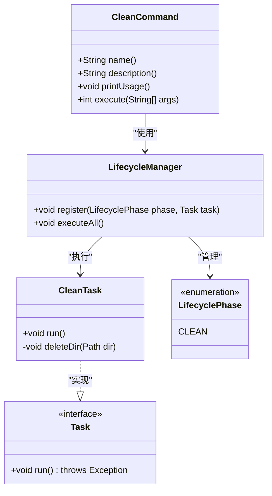
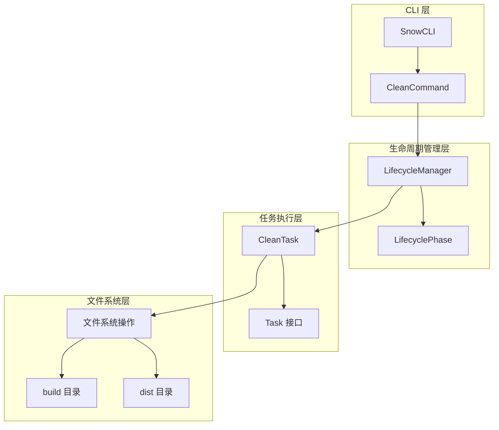
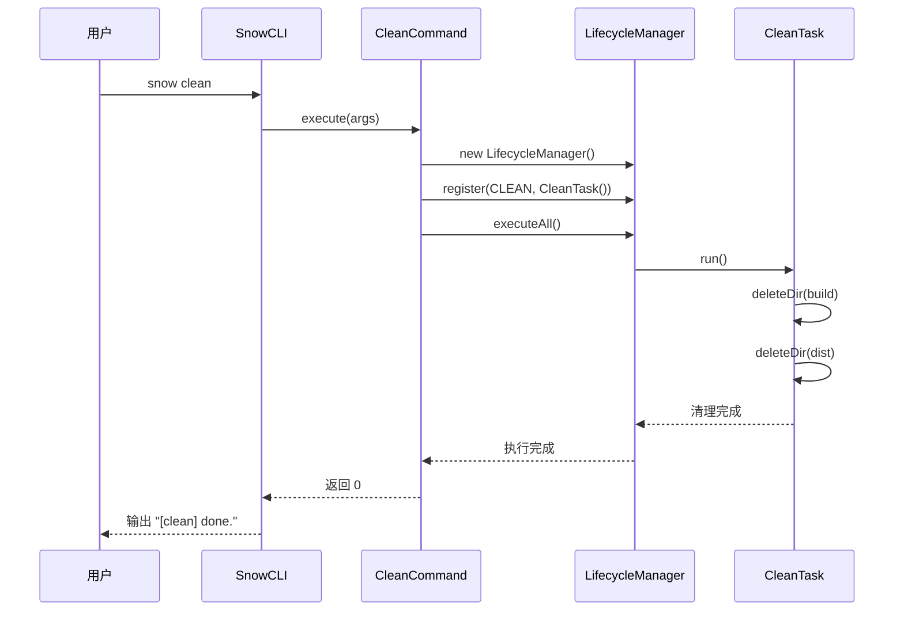
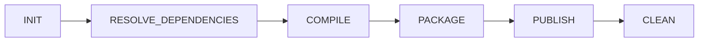

# clean 命令

<cite>
**本文档中引用的文件**
- [CleanCommand.java](file://src/main/java/org/jcnc/snow/cli/commands/CleanCommand.java)
- [CleanTask.java](file://src/main/java/org/jcnc/snow/pkg/tasks/CleanTask.java)
- [LifecycleManager.java](file://src/main/java/org/jcnc/snow/pkg/lifecycle/LifecycleManager.java)
- [LifecyclePhase.java](file://src/main/java/org/jcnc/snow/pkg/lifecycle/LifecyclePhase.java)
- [Task.java](file://src/main/java/org/jcnc/snow/pkg/tasks/Task.java)
- [SnowCLI.java](file://src/main/java/org/jcnc/snow/cli/SnowCLI.java)
- [README.md](file://README.md)
</cite>

## 目录
1. [简介](#简介)
2. [命令概述](#命令概述)
3. [核心组件分析](#核心组件分析)
4. [架构设计](#架构设计)
5. [详细组件分析](#详细组件分析)
6. [使用示例](#使用示例)
7. [最佳实践](#最佳实践)
8. [故障排除](#故障排除)
9. [总结](#总结)

## 简介

Snow 编程语言的 `clean` 命令是一个专门用于清理项目构建产物和临时文件的工具。该命令能够递归删除项目中的 `build` 和 `dist` 目录，帮助开发者维护项目整洁的工作环境，特别是在重新构建项目或切换分支之前进行清理操作。

## 命令概述

`clean` 命令的主要功能包括：
- 清理构建输出目录（`build/`）
- 清理打包输出目录（`dist/`）
- 释放磁盘空间
- 保持项目工作区整洁
- 支持在自动化构建流程中使用

### 基本语法

```bash
snow clean
```

## 核心组件分析

clean 命令的实现涉及多个核心组件，形成了清晰的分层架构：



**图表来源**
- [CleanCommand.java](file://src/main/java/org/jcnc/snow/cli/commands/CleanCommand.java#L1-L64)
- [CleanTask.java](file://src/main/java/org/jcnc/snow/pkg/tasks/CleanTask.java#L1-L59)
- [LifecycleManager.java](file://src/main/java/org/jcnc/snow/pkg/lifecycle/LifecycleManager.java#L1-L65)
- [Task.java](file://src/main/java/org/jcnc/snow/pkg/tasks/Task.java#L1-L22)

**章节来源**
- [CleanCommand.java](file://src/main/java/org/jcnc/snow/cli/commands/CleanCommand.java#L1-L64)
- [CleanTask.java](file://src/main/java/org/jcnc/snow/pkg/tasks/CleanTask.java#L1-L59)

## 架构设计

clean 命令采用了典型的命令模式和任务管理架构，确保了良好的可扩展性和维护性：



**图表来源**
- [SnowCLI.java](file://src/main/java/org/jcnc/snow/cli/SnowCLI.java#L1-L99)
- [CleanCommand.java](file://src/main/java/org/jcnc/snow/cli/commands/CleanCommand.java#L1-L64)
- [LifecycleManager.java](file://src/main/java/org/jcnc/snow/pkg/lifecycle/LifecycleManager.java#L1-L65)

## 详细组件分析

### CleanCommand - CLI 命令实现

CleanCommand 是 clean 命令的入口点，实现了 CLICommand 接口：

#### 主要特性
- **命令标识**: 返回 `"clean"` 作为命令名称
- **描述信息**: 提供简洁的命令描述
- **参数处理**: 支持空参数调用
- **生命周期集成**: 与 Snow 的生命周期管理系统无缝集成

#### 执行流程



**图表来源**
- [CleanCommand.java](file://src/main/java/org/jcnc/snow/cli/commands/CleanCommand.java#L45-L62)
- [LifecycleManager.java](file://src/main/java/org/jcnc/snow/pkg/lifecycle/LifecycleManager.java#L45-L65)

**章节来源**
- [CleanCommand.java](file://src/main/java/org/jcnc/snow/cli/commands/CleanCommand.java#L1-L64)

### CleanTask - 核心清理逻辑

CleanTask 实现了具体的清理功能，采用安全的递归删除策略：

#### 核心算法

```mermaid
flowchart TD
Start([开始清理]) --> CheckBuild{"build 目录存在?"}
CheckBuild --> |是| DeleteBuild[递归删除 build 目录]
CheckBuild --> |否| SkipBuild[跳过 build 清理]
DeleteBuild --> CheckDist{"dist 目录存在?"}
SkipBuild --> CheckDist
CheckDist --> |是| DeleteDist[递归删除 dist 目录]
CheckDist --> |否| SkipDist[跳过 dist 清理]
DeleteDist --> PrintDone[输出 "done."]
SkipDist --> PrintDone
PrintDone --> End([清理完成])
```

**图表来源**
- [CleanTask.java](file://src/main/java/org/jcnc/snow/pkg/tasks/CleanTask.java#L25-L58)

#### 安全机制
- **目录检查**: 在删除前验证目录是否存在
- **排序删除**: 使用 `Comparator.reverseOrder()` 确保先删除子文件再删除父目录
- **异常处理**: 将 IO 异常包装为运行时异常以便传播
- **幂等性**: 支持重复执行，即使目标目录不存在也不会报错

**章节来源**
- [CleanTask.java](file://src/main/java/org/jcnc/snow/pkg/tasks/CleanTask.java#L1-L59)

### 生命周期管理集成

clean 命令通过 LifecycleManager 与 Snow 的构建生命周期系统集成：

#### 生命周期阶段

| 阶段 | 枚举值 | 功能描述 |
|------|--------|----------|
| INIT | INIT | 项目初始化阶段 |
| RESOLVE_DEPENDENCIES | RESOLVE_DEPENDENCIES | 依赖解析阶段 |
| COMPILE | COMPILE | 编译阶段 |
| PACKAGE | PACKAGE | 打包阶段 |
| PUBLISH | PUBLISH | 发布阶段 |
| CLEAN | CLEAN | 清理阶段 |

#### 执行顺序



**图表来源**
- [LifecyclePhase.java](file://src/main/java/org/jcnc/snow/pkg/lifecycle/LifecyclePhase.java#L1-L33)
- [LifecycleManager.java](file://src/main/java/org/jcnc/snow/pkg/lifecycle/LifecycleManager.java#L45-L65)

**章节来源**
- [LifecycleManager.java](file://src/main/java/org/jcnc/snow/pkg/lifecycle/LifecycleManager.java#L1-L65)
- [LifecyclePhase.java](file://src/main/java/org/jcnc/snow/pkg/lifecycle/LifecyclePhase.java#L1-L33)

## 使用示例

### 基本用法

```bash
# 清理当前项目的所有构建产物
snow clean

# 输出示例:
# >>> Phase: CLEAN
# [clean] done.
```

### 典型使用场景

#### 1. 重新构建前清理
```bash
# 切换分支前清理
git checkout feature/new-feature
snow clean
snow build
```

#### 2. 清理失败后的修复
```bash
# 编译失败后清理并重试
snow clean
snow compile main.snow
```

#### 3. 自动化脚本集成
```bash
#!/bin/bash
echo "Starting build process..."
snow clean
if snow build; then
    echo "Build successful!"
else
    echo "Build failed, cleaning up..."
    snow clean
    exit 1
fi
```

### 与其他命令的组合使用

```bash
# 清理后重新构建
snow clean && snow build

# 清理并运行测试
snow clean && snow test-all

# 清理并发布
snow clean && snow publish
```

## 最佳实践

### 清理时机建议

1. **分支切换前**: 避免旧构建产物影响新分支
2. **依赖更新后**: 确保使用最新的依赖版本
3. **编译失败后**: 清理可能损坏的中间文件
4. **定期维护**: 定期清理以释放磁盘空间

### 安全注意事项

1. **确认清理范围**: clean 命令只清理 `build/` 和 `dist/` 目录
2. **备份重要数据**: 在执行清理前备份重要源代码
3. **检查权限**: 确保对目标目录有读写权限
4. **监控磁盘空间**: 清理后验证磁盘空间释放情况

### 性能优化建议

1. **增量清理**: 只在必要时执行清理操作
2. **并行处理**: 在大型项目中考虑并行清理策略
3. **缓存利用**: 合理利用编译缓存减少清理频率

## 故障排除

### 常见问题及解决方案

#### 1. 权限不足错误
**问题**: 无法删除某些文件或目录
**解决方案**: 
- 检查文件权限
- 以管理员权限运行
- 关闭占用文件的进程

#### 2. 目录不存在警告
**问题**: clean 命令提示目录不存在
**解决方案**: 
- 这是正常现象，表示无需清理
- 可忽略此信息

#### 3. 清理速度慢
**问题**: 大型项目清理耗时较长
**解决方案**:
- 检查磁盘性能
- 确保有足够的磁盘空间
- 考虑使用 SSD 存储

#### 4. 清理不彻底
**问题**: 部分文件未被删除
**解决方案**:
- 检查文件是否被其他进程占用
- 手动检查残留文件
- 重启系统后再次尝试清理

### 调试技巧

1. **启用详细输出**: 在 CleanTask 中添加调试日志
2. **检查目录结构**: 验证 build/ 和 dist/ 目录的存在性
3. **权限验证**: 确认对目标目录的访问权限
4. **系统资源监控**: 监控 CPU 和内存使用情况

**章节来源**
- [CleanTask.java](file://src/main/java/org/jcnc/snow/pkg/tasks/CleanTask.java#L25-L58)

## 总结

Snow 的 clean 命令是一个设计精良的项目清理工具，具有以下特点：

### 核心优势
- **简洁易用**: 单命令即可完成项目清理
- **安全可靠**: 采用递归删除策略，确保文件系统安全
- **集成度高**: 与 Snow 的生命周期管理系统深度集成
- **扩展性强**: 基于 Task 接口设计，易于扩展新的清理逻辑

### 技术亮点
- **分层架构**: 清晰的 CLI、生命周期管理和任务执行分层
- **异常处理**: 完善的错误处理和异常传播机制
- **幂等性**: 支持重复执行而不产生副作用
- **安全性**: 目录存在性检查和排序删除策略

### 应用价值
clean 命令不仅简化了项目维护流程，还为开发者提供了可靠的项目清理解决方案，是 Snow 开发工作流中不可或缺的重要工具。

通过合理使用 clean 命令，开发者可以有效维护项目整洁，提高开发效率，并确保构建过程的一致性和可靠性。