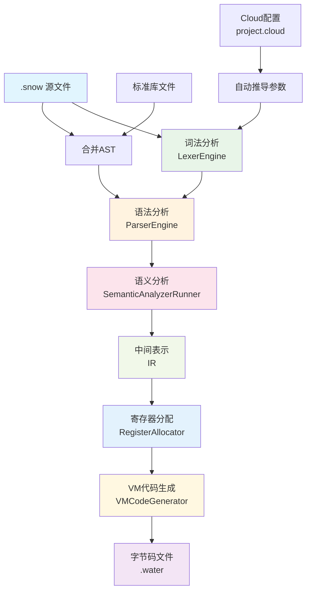
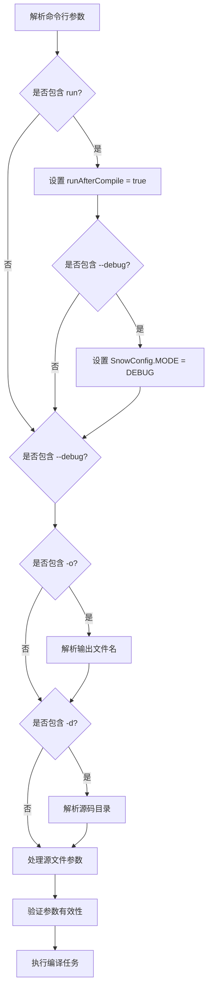
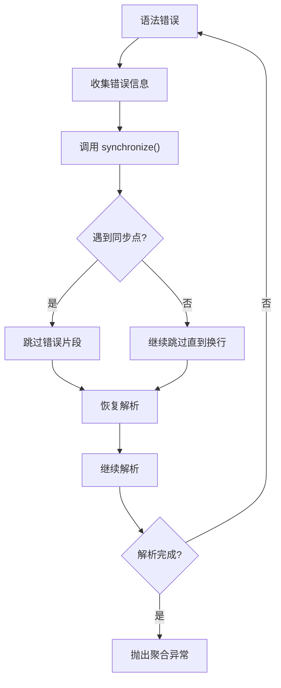
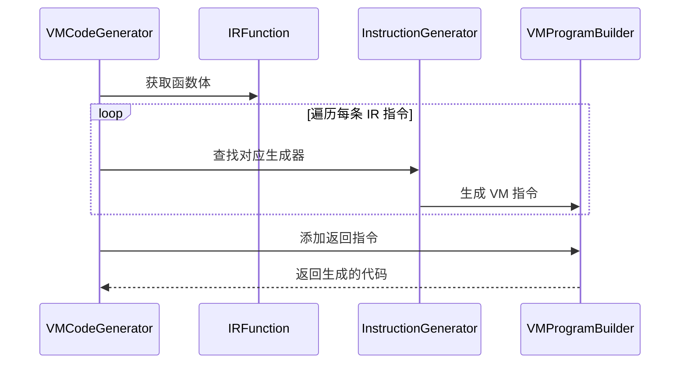
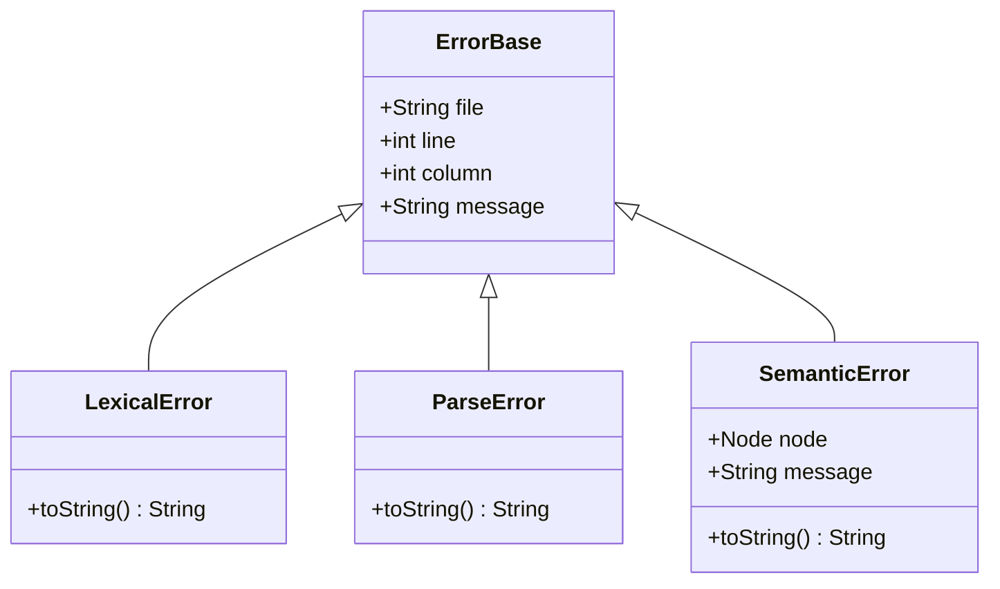
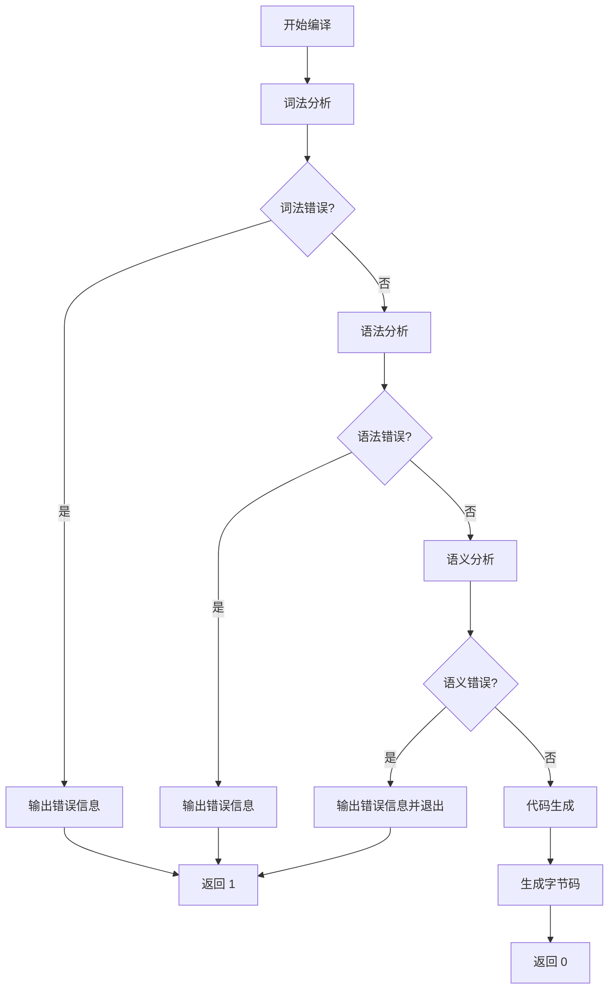

# compile 命令

<cite>
**本文档中引用的文件**
- [CompileCommand.java](file://src/main/java/org/jcnc/snow/cli/commands/CompileCommand.java)
- [CompileTask.java](file://src/main/java/org/jcnc/snow/pkg/tasks/CompileTask.java)
- [VMCodeGenerator.java](file://src/main/java/org/jcnc/snow/compiler/backend/builder/VMCodeGenerator.java)
- [VMProgramBuilder.java](file://src/main/java/org/jcnc/snow/compiler/backend/builder/VMProgramBuilder.java)
- [LexerEngine.java](file://src/main/java/org/jcnc/snow/compiler/lexer/core/LexerEngine.java)
- [ParserEngine.java](file://src/main/java/org/jcnc/snow/compiler/parser/core/ParserEngine.java)
- [SemanticAnalyzerRunner.java](file://src/main/java/org/jcnc/snow/compiler/semantic/core/SemanticAnalyzerRunner.java)
- [CloudDSLParser.java](file://src/main/java/org/jcnc/snow/pkg/dsl/CloudDSLParser.java)
- [Project.java](file://src/main/java/org/jcnc/snow/pkg/model/Project.java)
- [LexicalError.java](file://src/main/java/org/jcnc/snow/compiler/lexer/core/LexicalError.java)
- [ParseError.java](file://src/main/java/org/jcnc/snow/compiler/parser/context/ParseError.java)
- [SemanticError.java](file://src/main/java/org/jcnc/snow/compiler/semantic/error/SemanticError.java)
</cite>

## 目录
1. [简介](#简介)
2. [命令概述](#命令概述)
3. [编译流程架构](#编译流程架构)
4. [命令行选项详解](#命令行选项详解)
5. [编译模式](#编译模式)
6. [编译器核心组件](#编译器核心组件)
7. [错误处理机制](#错误处理机制)
8. [退出码说明](#退出码说明)
9. [使用示例](#使用示例)
10. [故障排除指南](#故障排除指南)

## 简介

Snow 编译器的 `compile` 命令是将 `.snow` 源文件编译为虚拟机字节码（`.water` 文件）的核心工具。该命令支持两种编译模式：Cloud 模式和传统 GOPATH 模式，能够处理复杂的项目结构和依赖关系，同时提供详细的错误报告和调试信息。

## 命令概述

### 基本语法

```bash
# Cloud 模式
snow compile [run]

# GOPATH 模式
snow compile [run] [-o <name>] [-d <srcDir>] [file1.snow …]
```

### 功能特性

- **多文件编译**：支持编译单个或多个 `.snow` 源文件
- **输出控制**：可指定输出文件名和目录
- **自动运行**：编译完成后可直接运行生成的字节码
- **调试支持**：提供详细的编译过程和调试信息
- **错误报告**：统一输出词法、语法和语义错误

## 编译流程架构

Snow 编译器采用经典的多阶段编译架构，将 `.snow` 源代码逐步转换为可执行的虚拟机字节码。



**图表来源**
- [CompileTask.java](file://src/main/java/org/jcnc/snow/pkg/tasks/CompileTask.java#L300-L425)
- [LexerEngine.java](file://src/main/java/org/jcnc/snow/compiler/lexer/core/LexerEngine.java#L30-L50)
- [ParserEngine.java](file://src/main/java/org/jcnc/snow/compiler/parser/core/ParserEngine.java#L30-L50)
- [SemanticAnalyzerRunner.java](file://src/main/java/org/jcnc/snow/compiler/semantic/core/SemanticAnalyzerRunner.java#L30-L50)

## 命令行选项详解

### 标准选项

| 选项 | 描述 | 示例 |
|------|------|------|
| `-o <name>` | 指定输出文件名（不含扩展名） | `snow compile -o myapp` |
| `-d <srcDir>` | 指定源文件目录 | `snow compile -d src` |
| `run` | 编译完成后自动运行 | `snow compile run` |
| `--debug` | 启用调试模式，显示详细编译信息 | `snow compile --debug` |

### 参数处理逻辑



**图表来源**
- [CompileTask.java](file://src/main/java/org/jcnc/snow/pkg/tasks/CompileTask.java#L250-L320)

**章节来源**
- [CompileCommand.java](file://src/main/java/org/jcnc/snow/cli/commands/CompileCommand.java#L40-L50)
- [CompileTask.java](file://src/main/java/org/jcnc/snow/pkg/tasks/CompileTask.java#L250-L320)

## 编译模式

Snow 编译器支持两种不同的编译模式，适应不同的项目组织方式。

### Cloud 模式

Cloud 模式基于 `project.cloud` 配置文件，提供现代化的项目管理方式。

#### 配置文件结构

```yaml
project {
  group = com.example
  artifact = myapp
  version = 1.0.0
}

build {
  srcDir = src
  output = program
  optimize = true
}
```

#### 自动参数推导

| Cloud 配置项 | 推导的 CLI 参数 |
|--------------|-----------------|
| `build.srcDir` | `-d <srcDir>` |
| `build.output` | `-o <output>` |
| `project.artifact` | 默认输出名 |

### GOPATH 模式

传统模式，完全兼容现有的 GOPATH 工作流。

#### 参数组合规则

| 源文件数量 | 输出参数 | 结果 |
|-----------|----------|------|
| 单个文件 | 无 | 使用源文件名 |
| 单个文件 | `-o` | 使用指定输出名 |
| 多个文件 | 无 | 错误：需要指定输出名 |
| 多个文件 | `-o` | 使用指定输出名 |

**章节来源**
- [CompileCommand.java](file://src/main/java/org/jcnc/snow/cli/commands/CompileCommand.java#L50-L92)
- [CloudDSLParser.java](file://src/main/java/org/jcnc/snow/pkg/dsl/CloudDSLParser.java#L30-L80)

## 编译器核心组件

### 词法分析器（LexerEngine）

负责将源代码转换为标记（Token）序列，执行词法分析和初步的语法检查。

#### 核心功能

- **扫描器链**：按优先级顺序尝试各种扫描器
- **错误处理**：捕获并转换为 `LexicalError`
- **上下文验证**：检查 `declare` 等特殊语法

#### 支持的扫描器

| 扫描器类型 | 功能描述 |
|------------|----------|
| `WhitespaceTokenScanner` | 跳过空白字符 |
| `NewlineTokenScanner` | 处理换行符 |
| `CommentTokenScanner` | 处理注释 |
| `NumberTokenScanner` | 处理数字字面量 |
| `IdentifierTokenScanner` | 处理标识符 |
| `StringTokenScanner` | 处理字符串 |
| `OperatorTokenScanner` | 处理运算符 |
| `SymbolTokenScanner` | 处理符号 |
| `UnknownTokenScanner` | 处理未知字符 |

### 语法分析器（ParserEngine）

执行语法分析，构建抽象语法树（AST），支持错误恢复机制。

#### 错误恢复策略



**图表来源**
- [ParserEngine.java](file://src/main/java/org/jcnc/snow/compiler/parser/core/ParserEngine.java#L70-L97)

### 语义分析器（SemanticAnalyzerRunner）

执行语义分析，检查类型兼容性、变量声明等语义规则。

#### 分析流程

1. **模块注册**：收集所有模块信息
2. **签名登记**：注册函数和方法签名
3. **函数体检查**：分析函数体内的语义规则
4. **错误报告**：统一输出所有语义错误

### 后端代码生成器

#### VMCodeGenerator

将中间表示（IR）转换为虚拟机指令序列。



**图表来源**
- [VMCodeGenerator.java](file://src/main/java/org/jcnc/snow/compiler/backend/builder/VMCodeGenerator.java#L60-L88)
- [VMProgramBuilder.java](file://src/main/java/org/jcnc/snow/compiler/backend/builder/VMProgramBuilder.java#L100-L150)

**章节来源**
- [LexerEngine.java](file://src/main/java/org/jcnc/snow/compiler/lexer/core/LexerEngine.java#L30-L185)
- [ParserEngine.java](file://src/main/java/org/jcnc/snow/compiler/parser/core/ParserEngine.java#L30-L97)
- [SemanticAnalyzerRunner.java](file://src/main/java/org/jcnc/snow/compiler/semantic/core/SemanticAnalyzerRunner.java#L30-L49)
- [VMCodeGenerator.java](file://src/main/java/org/jcnc/snow/compiler/backend/builder/VMCodeGenerator.java#L30-L88)

## 错误处理机制

Snow 编译器实现了统一的错误处理机制，确保所有类型的错误都能被正确捕获、分类和报告。

### 错误类型层次



**图表来源**
- [LexicalError.java](file://src/main/java/org/jcnc/snow/compiler/lexer/core/LexicalError.java#L10-L55)
- [ParseError.java](file://src/main/java/org/jcnc/snow/compiler/parser/context/ParseError.java#L10-L53)
- [SemanticError.java](file://src/main/java/org/jcnc/snow/compiler/semantic/error/SemanticError.java#L10-L33)

### 错误报告流程

#### 词法错误处理

1. **捕获异常**：扫描器抛出 `LexicalException`
2. **转换错误**：转换为 `LexicalError` 对象
3. **位置记录**：保存文件名、行号、列号
4. **批量报告**：编译结束时统一输出

#### 语法错误处理

1. **异常收集**：捕获 `ParseException` 并收集到列表
2. **错误恢复**：调用 `synchronize()` 恢复解析
3. **聚合报告**：编译结束时抛出聚合异常

#### 语义错误处理

1. **分析执行**：语义分析器收集所有错误
2. **统一报告**：调用 `SemanticAnalysisReporter`
3. **程序终止**：如有错误，调用 `System.exit(1)`

### 错误输出格式

所有错误都采用统一的输出格式：

```
file:///absolute/path:line:column: 错误描述
```

**章节来源**
- [LexicalError.java](file://src/main/java/org/jcnc/snow/compiler/lexer/core/LexicalError.java#L10-L55)
- [ParseError.java](file://src/main/java/org/jcnc/snow/compiler/parser/context/ParseError.java#L10-L53)
- [SemanticError.java](file://src/main/java/org/jcnc/snow/compiler/semantic/error/SemanticError.java#L10-L33)

## 退出码说明

Snow 编译器使用标准化的退出码来指示编译结果：

| 退出码 | 含义 | 触发条件 |
|--------|------|----------|
| `0` | 编译成功 | 所有阶段正常完成 |
| `1` | 编译失败 | 任何阶段检测到错误 |

### 退出码决策流程



**图表来源**
- [CompileTask.java](file://src/main/java/org/jcnc/snow/pkg/tasks/CompileTask.java#L350-L425)

**章节来源**
- [CompileTask.java](file://src/main/java/org/jcnc/snow/pkg/tasks/CompileTask.java#L350-L425)

## 使用示例

### 基本编译

```bash
# 编译单个文件
snow compile src/main.snow

# 编译多个文件并指定输出
snow compile src/main.snow src/utils.snow -o myapp

# 编译目录中的所有文件
snow compile -d src -o program
```

### Cloud 模式编译

```bash
# 使用 project.cloud 配置
snow compile

# 编译后立即运行
snow compile run
```

### 调试编译

```bash
# 启用调试模式
snow compile --debug src/main.snow

# 调试模式下编译并运行
snow compile --debug run src/main.snow
```

### 错误处理示例

```bash
# 语法错误示例
$ snow compile invalid.snow
file:///path/to/invalid.snow:10:5: 语法错误: 缺少右括号

# 语义错误示例
$ snow compile semantic_error.snow
file:///path/to/semantic_error.snow:15:8: 语义错误: 变量未声明

# 多个错误示例
$ snow compile multiple_errors.snow
file:///path/to/multiple_errors.snow:5:3: 词法错误: 未知字符 '@'
file:///path/to/multiple_errors.snow:10:7: 语法错误: 不期望的令牌 'else'
file:///path/to/multiple_errors.snow:15:12: 语义错误: 类型不匹配
```

### 项目结构示例

```
my_project/
├── project.cloud          # Cloud 配置文件
├── src/
│   ├── main.snow         # 主程序文件
│   ├── utils.snow        # 工具函数
│   └── models/
│       └── user.snow     # 数据模型
└── lib/
    ├── std.snow          # 标准库
    └── math.snow         # 数学库
```

**章节来源**
- [CompileCommand.java](file://src/main/java/org/jcnc/snow/cli/commands/CompileCommand.java#L40-L50)
- [CompileTask.java](file://src/main/java/org/jcnc/snow/pkg/tasks/CompileTask.java#L250-L320)

## 故障排除指南

### 常见问题及解决方案

#### 1. 文件未找到错误

**问题**：`No .snow source files found.`

**原因**：
- 指定的文件不存在
- 文件扩展名错误
- 目录权限问题

**解决方案**：
```bash
# 检查文件是否存在
ls -la src/

# 确认文件扩展名
find src/ -name "*.snow"

# 检查权限
chmod +r src/main.snow
```

#### 2. 语法错误

**问题**：编译过程中出现语法错误

**诊断步骤**：
1. 检查错误报告中的行号和列号
2. 查看错误附近的代码
3. 确认语法结构完整性

**常见语法错误**：
- 缺少右括号或大括号
- 不正确的缩进
- 错误的操作符使用

#### 3. 语义错误

**问题**：类型不匹配或变量未声明

**解决方案**：
```snow
# 错误示例
var x = 10
x = "string"  # 类型不匹配

# 正确示例
var x: int = 10
x = 20        # 类型匹配
```

#### 4. 依赖问题

**问题**：无法找到导入的模块

**解决方案**：
- 检查 `lib/` 目录结构
- 确认模块名称拼写正确
- 验证 `import:` 语句格式

#### 5. 性能问题

**问题**：编译速度慢

**优化建议**：
- 使用 `--debug` 模式查看详细信息
- 分解大型文件为多个小文件
- 移除不必要的导入

### 调试技巧

#### 启用详细输出

```bash
# 启用调试模式
snow compile --debug src/main.snow

# 查看中间表示
# （需要修改编译器源码）
```

#### 分阶段测试

```bash
# 只进行词法分析
# （需要单独调用 LexerEngine）

# 只进行语法分析
# （需要单独调用 ParserEngine）

# 只进行语义分析
# （需要单独调用 SemanticAnalyzerRunner）
```

#### 错误定位

```bash
# 使用行号快速定位
sed -n '10p' src/main.snow  # 查看第10行

# 搜索特定模式
grep "function" src/main.snow
```

**章节来源**
- [CompileTask.java](file://src/main/java/org/jcnc/snow/pkg/tasks/CompileTask.java#L350-L425)
- [LexerEngine.java](file://src/main/java/org/jcnc/snow/compiler/lexer/core/LexerEngine.java#L150-L185)