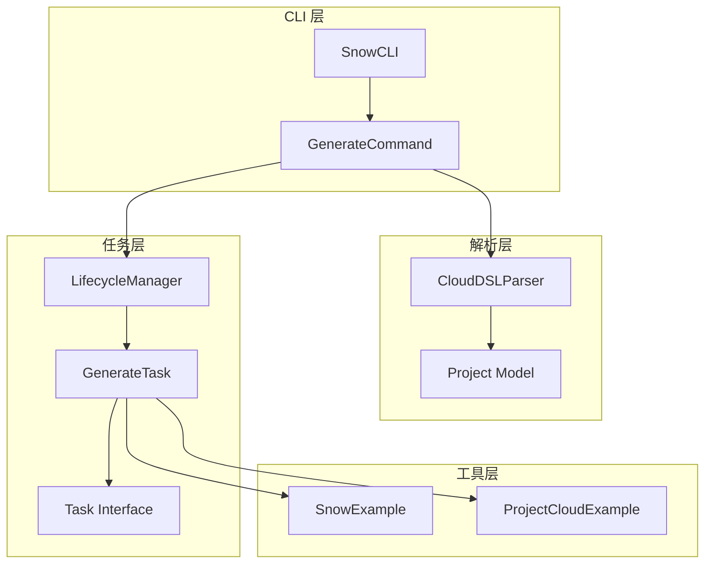
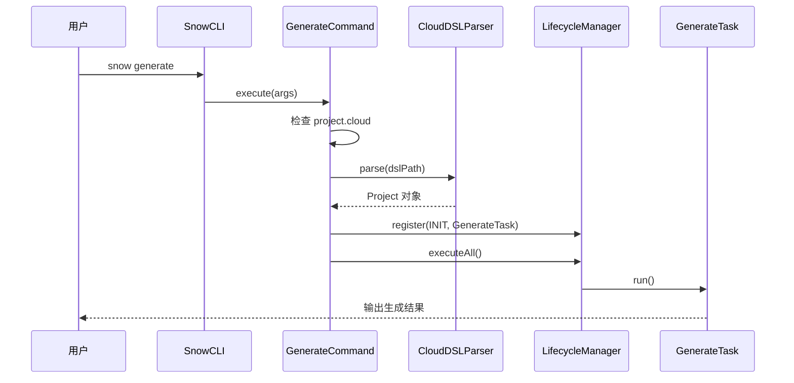
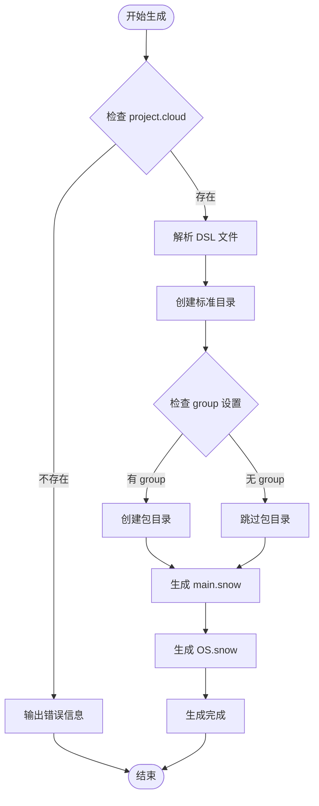
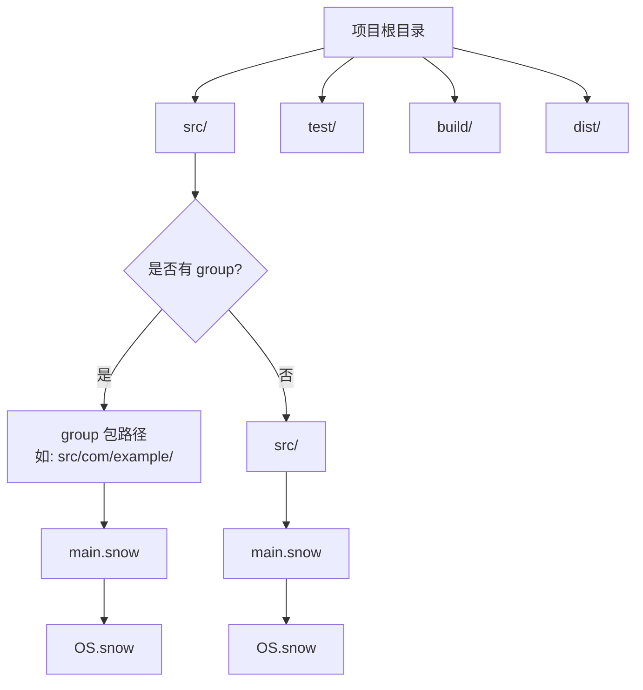

# generate 命令详细文档

<cite>
**本文档引用的文件**
- [GenerateCommand.java](file://src/main/java/org/jcnc/snow/cli/commands/GenerateCommand.java)
- [CloudDSLParser.java](file://src/main/java/org/jcnc/snow/pkg/dsl/CloudDSLParser.java)
- [GenerateTask.java](file://src/main/java/org/jcnc/snow/pkg/tasks/GenerateTask.java)
- [Project.java](file://src/main/java/org/jcnc/snow/pkg/model/Project.java)
- [SnowExample.java](file://src/main/java/org/jcnc/snow/pkg/utils/SnowExample.java)
- [ProjectCloudExample.java](file://src/main/java/org/jcnc/snow/cli/utils/ProjectCloudExample.java)
- [LifecycleManager.java](file://src/main/java/org/jcnc/snow/pkg/lifecycle/LifecycleManager.java)
- [Task.java](file://src/main/java/org/jcnc/snow/pkg/tasks/Task.java)
- [SnowCLI.java](file://src/main/java/org/jcnc/snow/cli/SnowCLI.java)
</cite>

## 目录
1. [概述](#概述)
2. [命令功能](#命令功能)
3. [架构设计](#架构设计)
4. [核心组件分析](#核心组件分析)
5. [使用方法](#使用方法)
6. [项目结构生成规则](#项目结构生成规则)
7. [配置文件解析](#配置文件解析)
8. [示例演示](#示例演示)
9. [错误处理](#错误处理)
10. [最佳实践](#最佳实践)

## 概述

`generate` 命令是 Snow 编程语言工具链中的核心项目初始化和脚手架生成命令。它根据 `project.cloud` 配置文件自动生成标准的项目目录结构和示例文件，为开发者提供标准化的项目起点。

该命令采用分层架构设计，通过 DSL 解析器解析配置文件，然后利用生命周期管理器协调生成任务的执行，确保项目结构的正确性和一致性。

## 命令功能

### 主要特性

- **项目脚手架生成**：自动创建标准的项目目录结构
- **配置驱动**：基于 `project.cloud` 文件的声明式配置
- **生命周期集成**：复用 Snow 的生命周期管理机制
- **可扩展性**：支持自定义生成模板和规则
- **错误防护**：避免覆盖已存在的文件和目录

### 支持的生成器类型

虽然当前版本主要提供基础的项目脚手架功能，但架构设计支持以下类型的生成器扩展：

- **基础项目结构**：标准的源码、测试、构建目录
- **模块化结构**：基于包名的目录层次
- **示例文件**：提供 `main.snow` 和 `OS.snow` 示例模块
- **配置文件**：生成项目相关的配置模板

## 架构设计



**图表来源**
- [GenerateCommand.java](file://src/main/java/org/jcnc/snow/cli/commands/GenerateCommand.java#L1-L88)
- [CloudDSLParser.java](file://src/main/java/org/jcnc/snow/pkg/dsl/CloudDSLParser.java#L1-L147)
- [LifecycleManager.java](file://src/main/java/org/jcnc/snow/pkg/lifecycle/LifecycleManager.java#L1-L67)
- [GenerateTask.java](file://src/main/java/org/jcnc/snow/pkg/tasks/GenerateTask.java#L1-L90)

## 核心组件分析

### GenerateCommand - 命令入口

`GenerateCommand` 是 `generate` 命令的主要实现类，负责：

- **命令注册**：在 SnowCLI 中注册为 "generate" 命令
- **参数验证**：检查当前目录是否存在 `project.cloud` 文件
- **生命周期集成**：复用 Snow 的 INIT 生命周期阶段
- **错误处理**：提供清晰的错误提示信息



**图表来源**
- [GenerateCommand.java](file://src/main/java/org/jcnc/snow/cli/commands/GenerateCommand.java#L60-L86)
- [LifecycleManager.java](file://src/main/java/org/jcnc/snow/pkg/lifecycle/LifecycleManager.java#L45-L66)

**章节来源**
- [GenerateCommand.java](file://src/main/java/org/jcnc/snow/cli/commands/GenerateCommand.java#L1-L88)

### CloudDSLParser - 配置解析器

`CloudDSLParser` 负责解析 `project.cloud` 配置文件，将其转换为 `Project` 模型对象：

- **语法支持**：支持区块结构、键值对、注释和嵌套配置
- **引号处理**：自动去除字符串字面量的引号
- **错误检测**：提供详细的语法错误信息
- **扁平化处理**：将嵌套配置展平为简单的键值对

**章节来源**
- [CloudDSLParser.java](file://src/main/java/org/jcnc/snow/pkg/dsl/CloudDSLParser.java#L1-L147)

### GenerateTask - 生成任务

`GenerateTask` 实现了具体的项目生成逻辑：

- **目录创建**：自动创建标准的项目目录结构
- **包路径处理**：根据项目组名创建相应的包目录
- **示例文件生成**：创建 `main.snow` 和 `OS.snow` 示例模块
- **幂等性保证**：避免覆盖已存在的文件和目录



**图表来源**
- [GenerateTask.java](file://src/main/java/org/jcnc/snow/pkg/tasks/GenerateTask.java#L45-L89)

**章节来源**
- [GenerateTask.java](file://src/main/java/org/jcnc/snow/pkg/tasks/GenerateTask.java#L1-L90)

## 使用方法

### 基本语法

```bash
snow generate
```

### 参数说明

`generate` 命令不接受任何参数，它会自动查找当前目录下的 `project.cloud` 文件。

### 执行流程

1. **前置检查**：验证当前目录是否存在 `project.cloud` 文件
2. **配置解析**：使用 `CloudDSLParser` 解析配置文件
3. **任务注册**：将 `GenerateTask` 注册到 INIT 生命周期阶段
4. **任务执行**：通过 `LifecycleManager` 执行生成任务
5. **结果输出**：显示生成的目录和文件信息

### 依赖要求

- 当前目录必须包含有效的 `project.cloud` 文件
- 需要有写入权限创建目录和文件
- 不需要网络连接（完全本地操作）

## 项目结构生成规则

### 标准目录结构

根据 `GenerateTask` 的实现，`generate` 命令会创建以下目录结构：

| 目录 | 用途 | 是否可选 |
|------|------|----------|
| `src/` | 源代码根目录 | 必需 |
| `src/{group}/` | 包路径（如果设置了 group） | 可选 |
| `test/` | 测试代码目录 | 必需 |
| `build/` | 编译输出目录 | 必需 |
| `dist/` | 打包输出目录 | 必需 |

### 文件生成规则

- **main.snow**：项目入口模块，包含基本的打印功能
- **OS.snow**：系统库模块，提供基础的系统调用接口
- **包目录**：根据 `project.group` 配置动态创建

### 动态生成逻辑



**图表来源**
- [GenerateTask.java](file://src/main/java/org/jcnc/snow/pkg/tasks/GenerateTask.java#L50-L89)

**章节来源**
- [GenerateTask.java](file://src/main/java/org/jcnc/snow/pkg/tasks/GenerateTask.java#L45-L89)

## 配置文件解析

### project.cloud 文件格式

`generate` 命令依赖 `project.cloud` 配置文件来确定项目的基本信息。配置文件采用类似 DSL 的语法：

```cloud
project {
    group    = "com.example"
    artifact = "demo-app"
    version  = "0.0.1-SNAPSHOT"
}

build {
    srcDir = "src"
    output = "build/demo-app"
}
```

### 解析规则

CloudDSLParser 支持以下语法规则：

- **区块结构**：使用 `{}` 定义区块，支持嵌套
- **键值对**：使用 `=` 分隔键和值
- **注释支持**：以 `#` 开头的行为注释
- **引号处理**：自动去除字符串字面量的引号
- **扁平化**：嵌套配置通过点号连接键名

### Project 模型映射

解析后的配置会被转换为 `Project` 模型对象，其中包含以下关键属性：

| 属性 | 类型 | 描述 |
|------|------|------|
| `group` | String | 项目组名（如 com.example） |
| `artifact` | String | 项目构件名 |
| `version` | String | 项目版本号 |
| `name` | String | 项目显示名称 |
| `description` | String | 项目描述 |
| `properties` | Map | 额外属性配置 |

**章节来源**
- [CloudDSLParser.java](file://src/main/java/org/jcnc/snow/pkg/dsl/CloudDSLParser.java#L50-L147)
- [Project.java](file://src/main/java/org/jcnc/snow/pkg/model/Project.java#L1-L235)

## 示例演示

### 完整使用流程

#### 1. 初始化项目

```bash
# 创建项目目录
mkdir my-snow-project
cd my-snow-project

# 初始化项目配置
snow init
```

生成的 `project.cloud` 文件：
```cloud
# Generated by snow init
project {
    group    = "com.example"
    artifact = "demo-app"
    version  = "0.0.1-SNAPSHOT"
}

build {
    srcDir = "src"
    output = "build/demo-app"
}
```

#### 2. 生成项目结构

```bash
# 生成项目脚手架
snow generate
```

输出结果：
```
[generate] created directory src
[generate] created directory test
[generate] created directory build
[generate] created directory dist
[generate] created src/main.snow
[generate] created src/OS.snow
[generate] project scaffold is ready.
```

#### 3. 生成的项目结构

```
my-snow-project/
├── project.cloud          # 项目配置文件
├── src/                   # 源代码目录
│   ├── com/               # 包路径（如果设置了 group）
│   │   └── example/       # 继续按包名分层
│   │       ├── main.snow  # 主入口模块
│   │       └── OS.snow    # 系统库模块
│   └── main.snow          # 直接在 src/ 下的模块
├── test/                  # 测试代码目录
├── build/                 # 编译输出目录
└── dist/                  # 打包输出目录
```

### 自定义配置示例

修改 `project.cloud` 文件：

```cloud
project {
    group    = "org.mycompany"
    artifact = "my-application"
    version  = "1.0.0"
    name     = "My Application"
    description = "A sample Snow application"
}

build {
    srcDir = "src"
    output = "build/my-application"
}
```

执行 `snow generate` 后，会生成：

```
my-snow-project/
├── project.cloud
├── src/                   # 根目录
├── src/org/              # 包路径
│   └── mycompany/        # 继续分层
│       ├── main.snow
│       └── OS.snow
└── ...
```

**章节来源**
- [ProjectCloudExample.java](file://src/main/java/org/jcnc/snow/cli/utils/ProjectCloudExample.java#L1-L32)
- [SnowExample.java](file://src/main/java/org/jcnc/snow/pkg/utils/SnowExample.java#L1-L57)

## 错误处理

### 常见错误情况

#### 1. 缺少 project.cloud 文件

```bash
$ snow generate
project.cloud not found. Please run `snow init` first.
```

**解决方案**：先执行 `snow init` 创建配置文件

#### 2. 配置文件语法错误

```bash
$ snow generate
第 15 行出现未配对的 '}'
```

**解决方案**：检查配置文件的括号匹配和语法格式

#### 3. 权限不足

```bash
$ snow generate
[generate] created directory src
[generate] created directory test
[generate] created directory build
[generate] created directory dist
java.nio.file.AccessDeniedException: src/main.snow
```

**解决方案**：确保当前用户对项目目录有写入权限

### 错误恢复策略

- **幂等性保证**：重复执行不会产生冲突
- **部分成功处理**：即使部分目录创建失败，已创建的部分不会回滚
- **详细错误信息**：提供具体的错误位置和原因

**章节来源**
- [GenerateCommand.java](file://src/main/java/org/jcnc/snow/cli/commands/GenerateCommand.java#L65-L75)

## 最佳实践

### 项目初始化建议

1. **合理设置 group 名称**
   - 使用反向域名格式（如 com.company.project）
   - 避免使用特殊字符和空格

2. **版本号规划**
   - 遵循语义化版本控制（如 1.0.0）
   - 使用 snapshot 版本进行开发测试

3. **项目描述**
   - 提供清晰的项目描述
   - 包含必要的许可证信息

### 目录结构优化

1. **模块化设计**
   - 根据功能划分不同的包
   - 避免过于扁平的目录结构

2. **命名规范**
   - 使用小写字母和下划线
   - 保持一致的命名风格

3. **文件组织**
   - 将相关功能放在同一包下
   - 使用有意义的文件名

### 开发工作流

1. **初始设置**
   ```bash
   mkdir my-project
   cd my-project
   snow init
   # 编辑 project.cloud
   snow generate
   ```

2. **日常开发**
   - 在 `src/` 目录下添加新的模块
   - 在 `test/` 目录下编写测试代码
   - 使用 `snow build` 进行构建

3. **项目维护**
   - 定期更新 `project.cloud` 配置
   - 保持目录结构的整洁性

### 扩展性考虑

虽然当前版本主要提供基础的脚手架功能，但架构设计支持以下扩展：

- **自定义生成器**：可以添加新的生成器类型
- **模板系统**：支持更复杂的文件模板
- **插件机制**：允许第三方扩展生成逻辑

**章节来源**
- [GenerateCommand.java](file://src/main/java/org/jcnc/snow/cli/commands/GenerateCommand.java#L15-L35)
- [GenerateTask.java](file://src/main/java/org/jcnc/snow/pkg/tasks/GenerateTask.java#L10-L25)