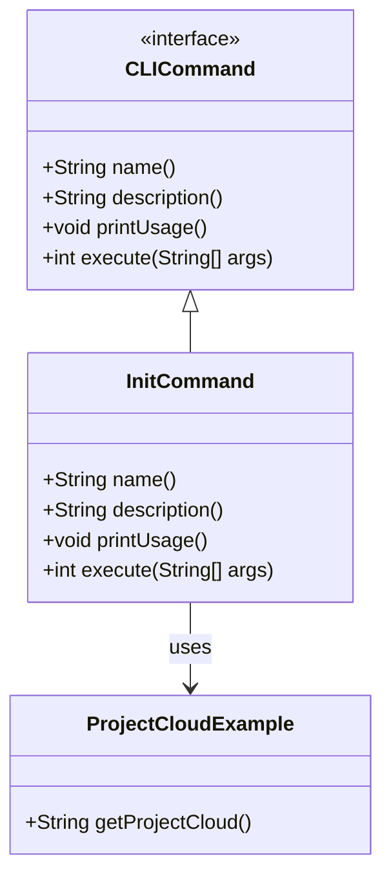
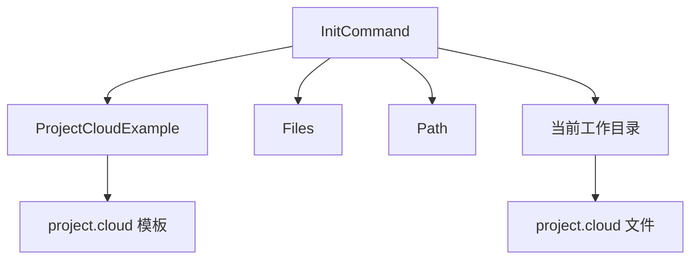
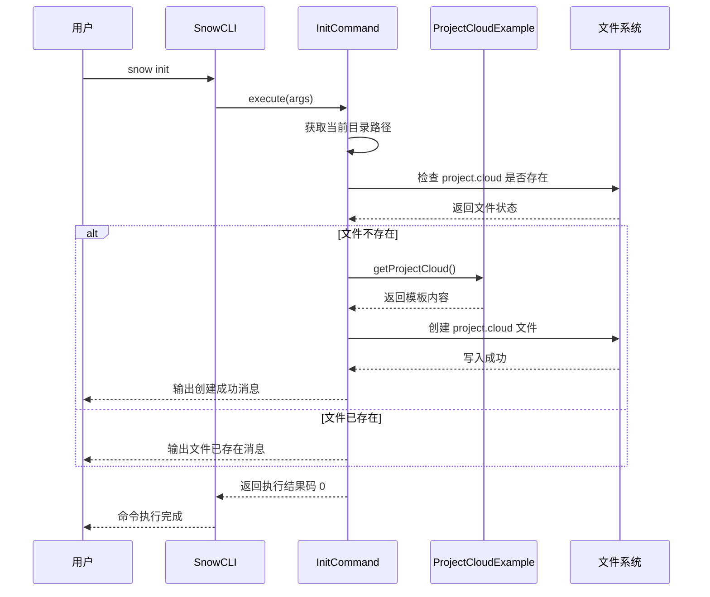
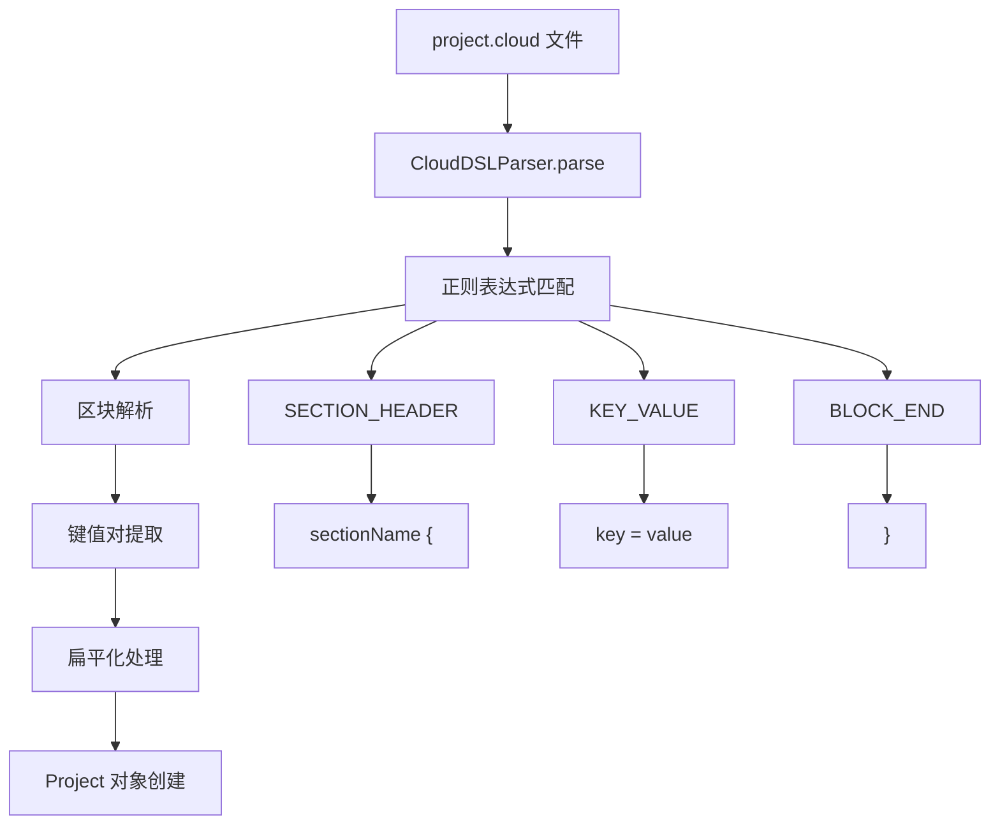
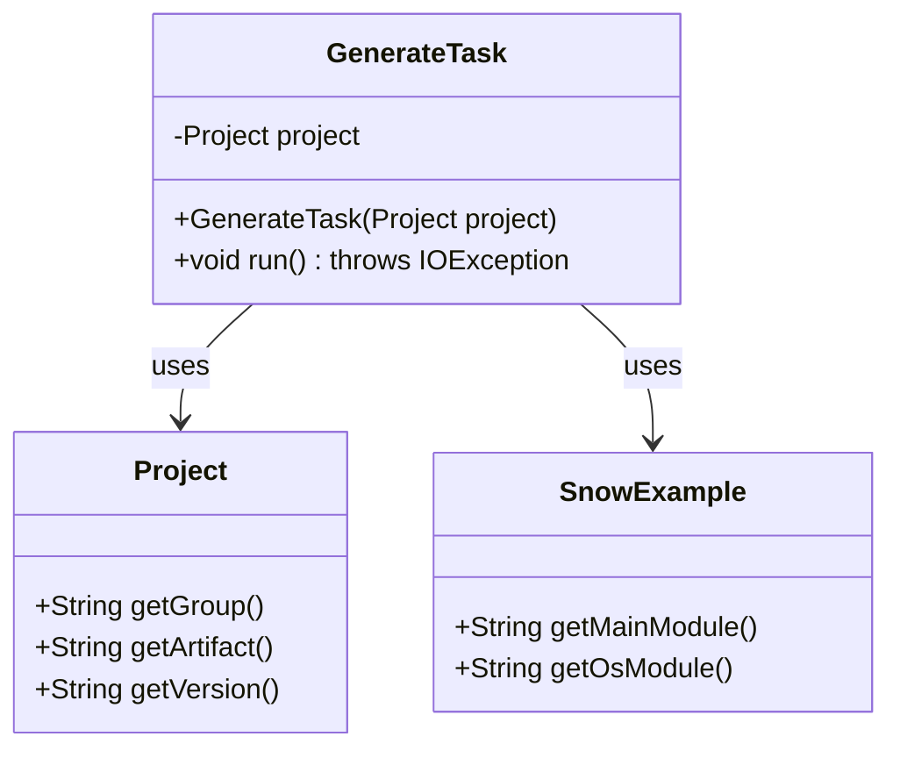
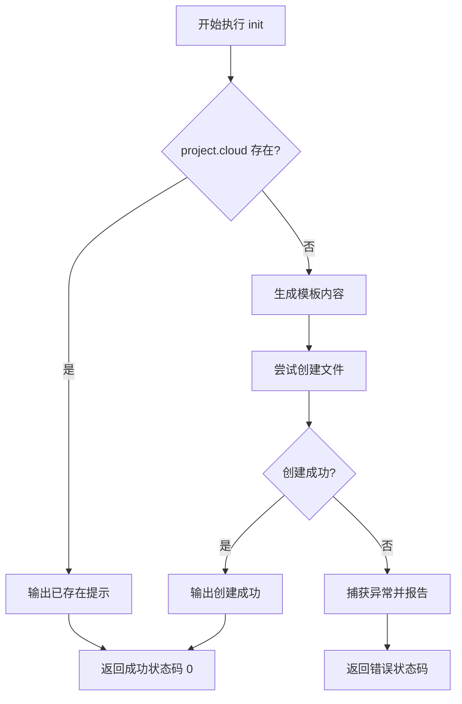
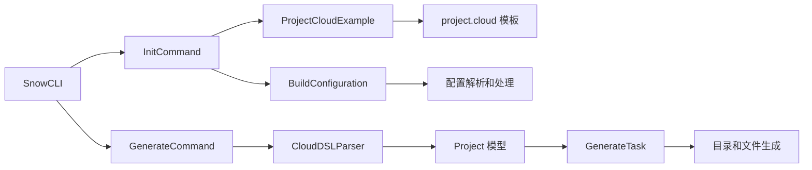
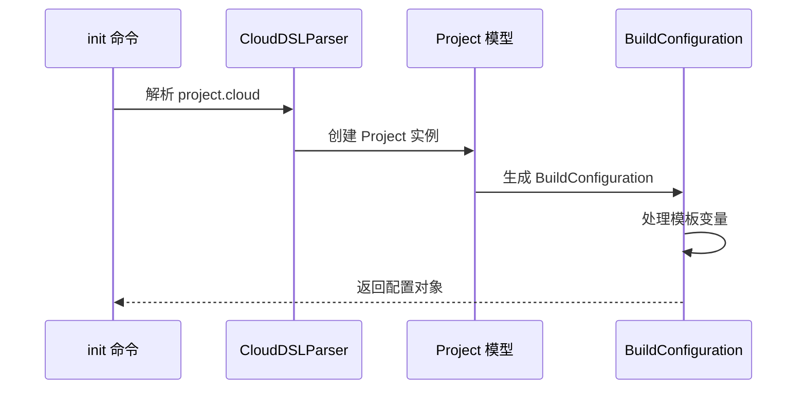
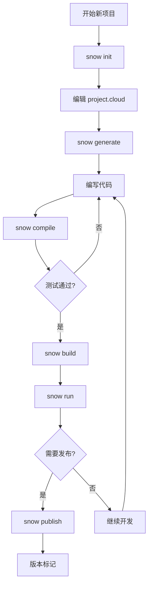

# init 命令详细文档

<cite>
**本文档引用的文件**
- [InitCommand.java](file://src/main/java/org/jcnc/snow/cli/commands/InitCommand.java)
- [ProjectCloudExample.java](file://src/main/java/org/jcnc/snow/cli/utils/ProjectCloudExample.java)
- [SnowExample.java](file://src/main/java/org/jcnc/snow/pkg/utils/SnowExample.java)
- [CloudDSLParser.java](file://src/main/java/org/jcnc/snow/pkg/dsl/CloudDSLParser.java)
- [BuildConfiguration.java](file://src/main/java/org/jcnc/snow/pkg/model/BuildConfiguration.java)
- [GenerateTask.java](file://src/main/java/org/jcnc/snow/pkg/tasks/GenerateTask.java)
- [CLICommand.java](file://src/main/java/org/jcnc/snow/cli/api/CLICommand.java)
- [SnowCLI.java](file://src/main/java/org/jcnc/snow/cli/SnowCLI.java)
- [README.md](file://README.md)
</cite>

## 目录
1. [简介](#简介)
2. [命令概述](#命令概述)
3. [核心组件分析](#核心组件分析)
4. [执行流程详解](#执行流程详解)
5. [配置文件生成](#配置文件生成)
6. [项目骨架生成](#项目骨架生成)
7. [错误处理机制](#错误处理机制)
8. [使用示例](#使用示例)
9. [与其他模块的集成](#与其他模块的集成)
10. [最佳实践](#最佳实践)

## 简介

`init` 命令是 Snow 编程语言项目初始化的核心工具，用于快速创建新的 Snow 项目的基础结构。该命令通过生成标准的项目配置文件和目录结构，为开发者提供了一个良好的项目起点，支持从零开始构建 Snow 应用程序。

## 命令概述

### 命令基本信息

| 属性 | 值 |
|------|-----|
| 命令名称 | `init` |
| 功能描述 | 初始化新项目，生成 project.cloud 配置文件 |
| 所属模块 | CLI 命令系统 |
| 实现类 | `InitCommand` |
| 接口 | `CLICommand` |

### 命令语法

```bash
snow init
```

### 参数说明

`init` 命令不接受任何参数，它会在当前工作目录执行初始化操作。

## 核心组件分析

### InitCommand 类架构



**图表来源**
- [InitCommand.java](file://src/main/java/org/jcnc/snow/cli/commands/InitCommand.java#L1-L72)
- [CLICommand.java](file://src/main/java/org/jcnc/snow/cli/api/CLICommand.java#L1-L48)
- [ProjectCloudExample.java](file://src/main/java/org/jcnc/snow/cli/utils/ProjectCloudExample.java#L1-L32)

### 关键依赖关系



**图表来源**
- [InitCommand.java](file://src/main/java/org/jcnc/snow/cli/commands/InitCommand.java#L55-L70)

**章节来源**
- [InitCommand.java](file://src/main/java/org/jcnc/snow/cli/commands/InitCommand.java#L1-L72)
- [ProjectCloudExample.java](file://src/main/java/org/jcnc/snow/cli/utils/ProjectCloudExample.java#L1-L32)

## 执行流程详解

### 命令执行序列图



**图表来源**
- [InitCommand.java](file://src/main/java/org/jcnc/snow/cli/commands/InitCommand.java#L55-L70)

### 执行步骤分解

1. **路径解析阶段**
   - 获取当前工作目录的绝对路径
   - 构建目标文件路径 `project.cloud`

2. **文件存在性检查**
   - 使用 `Files.notExists()` 检查目标文件是否存在
   - 避免重复创建相同的配置文件

3. **模板生成阶段**
   - 调用 `ProjectCloudExample.getProjectCloud()` 获取配置模板
   - 模板包含项目基本信息和构建配置

4. **文件创建阶段**
   - 使用 `Files.writeString()` 创建新文件
   - 写入预定义的项目配置内容

5. **结果反馈**
   - 成功创建时输出文件路径
   - 文件已存在时给出友好提示

**章节来源**
- [InitCommand.java](file://src/main/java/org/jcnc/snow/cli/commands/InitCommand.java#L55-L70)

## 配置文件生成

### project.cloud 模板内容

`init` 命令生成的 `project.cloud` 文件包含以下标准配置：

```yaml
# Generated by snow init
project {
    group    = "com.example"
    artifact = "demo-app"
    version  = "0.0.1-SNAPSHOT"
}

build {
    srcDir = "src"
    output = "build/demo-app"
}
```

### 配置项说明

| 配置区块 | 配置项 | 默认值 | 说明 |
|----------|--------|--------|------|
| project | group | "com.example" | 项目组标识符，用于包命名空间 |
| project | artifact | "demo-app" | 项目名称，用于构建产物命名 |
| project | version | "0.0.1-SNAPSHOT" | 项目版本号 |
| build | srcDir | "src" | 源代码目录路径 |
| build | output | "build/demo-app" | 构建输出目录路径 |

### CloudDSLParser 解析机制



**图表来源**
- [CloudDSLParser.java](file://src/main/java/org/jcnc/snow/pkg/dsl/CloudDSLParser.java#L50-L146)

**章节来源**
- [ProjectCloudExample.java](file://src/main/java/org/jcnc/snow/cli/utils/ProjectCloudExample.java#L15-L31)
- [CloudDSLParser.java](file://src/main/java/org/jcnc/snow/pkg/dsl/CloudDSLParser.java#L50-L146)

## 项目骨架生成

### GenerateTask 项目生成器

虽然 `init` 命令主要负责生成配置文件，但它与 `generate` 命令配合使用时，可以创建完整的项目骨架：



**图表来源**
- [GenerateTask.java](file://src/main/java/org/jcnc/snow/pkg/tasks/GenerateTask.java#L1-L90)
- [SnowExample.java](file://src/main/java/org/jcnc/snow/pkg/utils/SnowExample.java#L1-L57)

### 自动生成的目录结构

基于 `project.cloud` 配置，`generate` 命令会创建以下目录结构：

```
project-root/
├── src/                    # 源代码根目录
│   └── com/
│       └── example/        # 根据 group 配置创建的包路径
│       │   ├── main.snow   # 主入口模块
│       │   └── OS.snow     # 系统库模块
│       └── test/           # 测试代码目录
├── build/                  # 编译输出目录
├── dist/                   # 打包输出目录
└── project.cloud           # 项目配置文件
```

### 示例文件内容

#### main.snow 模块
```snow
module: main
    import: os
    function: main
        returns: void
        body:
            os.print("Hello" + " "+"World!")
        end body
    end function
end module
```

#### OS.snow 模块
```snow
module: os
    function: print
        params:
            declare i1: any
        returns: void
        body:
            syscall("PRINT", i1)
        end body
    end function
    function: println
        params:
            declare i1: any
        returns: void
        body:
            syscall("PRINTLN", i1)
        end body
    end function
end module
```

**章节来源**
- [GenerateTask.java](file://src/main/java/org/jcnc/snow/pkg/tasks/GenerateTask.java#L45-L89)
- [SnowExample.java](file://src/main/java/org/jcnc/snow/pkg/utils/SnowExample.java#L15-L56)

## 错误处理机制

### 边界情况处理

`init` 命令实现了完善的错误处理机制：

1. **文件存在性检查**
   - 检查 `project.cloud` 是否已存在
   - 避免重复创建相同文件
   - 提供友好的用户反馈

2. **文件系统异常处理**
   - 捕获文件创建过程中的 I/O 异常
   - 提供清晰的错误信息
   - 确保命令执行的原子性

3. **权限问题处理**
   - 检查目标目录的写入权限
   - 提供适当的错误提示

### 错误处理流程



**图表来源**
- [InitCommand.java](file://src/main/java/org/jcnc/snow/cli/commands/InitCommand.java#L55-L70)

**章节来源**
- [InitCommand.java](file://src/main/java/org/jcnc/snow/cli/commands/InitCommand.java#L55-L70)

## 使用示例

### 基础使用示例

#### 示例 1：初始化新项目

```bash
# 进入目标目录
cd ~/projects/my-snow-app

# 执行初始化命令
snow init

# 输出示例
[init] created project.cloud
```

#### 示例 2：检查项目状态

```bash
# 检查项目是否已初始化
ls -la project.cloud

# 输出示例
-rw-r--r--  1 user  staff  123 Oct 10 10:30 project.cloud
```

#### 示例 3：生成项目骨架

```bash
# 先初始化项目
snow init

# 生成完整的项目结构
snow generate

# 输出示例
[generate] created directory src
[generate] created directory test
[generate] created directory build
[generate] created directory dist
[generate] created directory src/com/example
[generate] created main.snow
[generate] created OS.snow
[generate] project scaffold is ready.
```

### 完整项目初始化流程

```bash
#!/bin/bash
# Snow 项目初始化脚本示例

echo "=== Snow 项目初始化 ==="

# 1. 创建项目目录
mkdir -p my-snow-app/src/com/example
cd my-snow-app

# 2. 初始化项目配置
echo "[init] 正在初始化项目..."
snow init

# 3. 生成项目骨架
echo "[generate] 正在生成项目结构..."
snow generate

# 4. 验证项目结构
echo "[verify] 项目结构验证:"
find . -name "*.snow" -o -name "project.cloud" | sort

echo "=== 项目初始化完成 ==="
echo "项目位于: $(pwd)"
echo "配置文件: project.cloud"
echo "源代码目录: src/com/example/"
```

### 常见使用场景

#### 场景 1：快速原型开发
```bash
# 快速创建原型项目
mkdir prototype && cd prototype
snow init
snow generate
# 开始编写代码...
```

#### 场景 2：团队项目初始化
```bash
# 团队协作项目初始化
git init
snow init
# 编辑 project.cloud 配置
git add project.cloud
git commit -m "Initial project configuration"
```

#### 场景 3：教育和学习
```bash
# 学习 Snow 语言
mkdir learn-snow && cd learn-snow
snow init
# 查看生成的配置文件
cat project.cloud
# 开始学习 Snow 语法
```

## 与其他模块的集成

### 与 pkg 模块的集成关系



**图表来源**
- [InitCommand.java](file://src/main/java/org/jcnc/snow/cli/commands/InitCommand.java#L1-L72)
- [GenerateCommand.java](file://src/main/java/org/jcnc/snow/cli/commands/GenerateCommand.java#L1-L86)
- [SnowCLI.java](file://src/main/java/org/jcnc/snow/cli/SnowCLI.java#L35-L45)

### 生命周期管理集成

`init` 命令作为项目生命周期的初始阶段，与 Snow 的完整构建流程紧密集成：

1. **INIT 阶段**：项目初始化
2. **RESOLVE_DEPENDENCIES 阶段**：依赖解析
3. **COMPILE 阶段**：代码编译
4. **PACKAGE 阶段**：产物打包
5. **PUBLISH 阶段**：制品发布

### 配置继承机制



**图表来源**
- [CloudDSLParser.java](file://src/main/java/org/jcnc/snow/pkg/dsl/CloudDSLParser.java#L50-L146)
- [BuildConfiguration.java](file://src/main/java/org/jcnc/snow/pkg/model/BuildConfiguration.java#L30-L50)

**章节来源**
- [InitCommand.java](file://src/main/java/org/jcnc/snow/cli/commands/InitCommand.java#L1-L72)
- [CloudDSLParser.java](file://src/main/java/org/jcnc/snow/pkg/dsl/CloudDSLParser.java#L50-L146)
- [BuildConfiguration.java](file://src/main/java/org/jcnc/snow/pkg/model/BuildConfiguration.java#L30-L50)

## 最佳实践

### 项目初始化最佳实践

1. **选择合适的项目名称**
   - 使用有意义的项目名称
   - 避免特殊字符和空格
   - 考虑团队命名规范

2. **合理配置项目组标识**
   - 使用反向域名格式（如 `com.example`）
   - 考虑组织架构和项目分类
   - 便于依赖管理和包冲突避免

3. **版本号策略**
   - 遵循语义化版本控制（SemVer）
   - 使用快照版本进行开发测试
   - 发布版本时更新版本号

4. **目录结构规划**
   - 根据项目规模调整目录结构
   - 考虑测试代码的组织方式
   - 保持与标准约定的一致性

### 开发工作流建议



### 团队协作建议

1. **版本控制集成**
   - 将 `project.cloud` 添加到版本控制
   - 定期同步配置变更
   - 使用分支策略管理不同环境配置

2. **CI/CD 集成**
   - 在持续集成中包含 `snow init` 步骤
   - 自动化项目结构验证
   - 确保构建环境一致性

3. **文档维护**
   - 记录项目配置的变更历史
   - 提供项目初始化的文档说明
   - 建立新成员的项目设置指南

### 性能优化建议

1. **构建配置优化**
   - 合理设置 `srcDir` 和 `output` 路径
   - 避免不必要的目录层级
   - 考虑并行编译的可能性

2. **依赖管理**
   - 在 `project.cloud` 中明确依赖关系
   - 使用稳定的依赖版本
   - 定期更新依赖库

3. **开发环境配置**
   - 配置适当的编译选项
   - 设置调试和生产环境的不同配置
   - 优化构建缓存策略

通过遵循这些最佳实践，开发者可以充分利用 `init` 命令的功能，建立高质量、可维护的 Snow 项目结构，为后续的开发工作奠定坚实的基础。