# install 命令详细文档

<cite>
**本文档中引用的文件**
- [InstallCommand.java](file://src/main/java/org/jcnc/snow/cli/commands/InstallCommand.java)
- [DependencyResolver.java](file://src/main/java/org/jcnc/snow/pkg/resolver/DependencyResolver.java)
- [Dependency.java](file://src/main/java/org/jcnc/snow/pkg/model/Dependency.java)
- [Repository.java](file://src/main/java/org/jcnc/snow/pkg/model/Repository.java)
- [Project.java](file://src/main/java/org/jcnc/snow/pkg/model/Project.java)
- [CloudDSLParser.java](file://src/main/java/org/jcnc/snow/pkg/dsl/CloudDSLParser.java)
- [BuildConfiguration.java](file://src/main/java/org/jcnc/snow/pkg/model/BuildConfiguration.java)
- [SnowConfig.java](file://src/main/java/org/jcnc/snow/common/SnowConfig.java)
- [project.cloud](file://playground/PerformanceTest/project.cloud)
</cite>

## 目录
1. [概述](#概述)
2. [命令功能](#命令功能)
3. [核心组件架构](#核心组件架构)
4. [依赖解析流程](#依赖解析流程)
5. [CloudDSL 配置文件解析](#clouddsl-配置文件解析)
6. [依赖模型与仓库管理](#依赖模型与仓库管理)
7. [缓存机制与存储策略](#缓存机制与存储策略)
8. [错误处理与网络故障](#错误处理与网络故障)
9. [使用示例](#使用示例)
10. [最佳实践](#最佳实践)

## 概述

`snow install` 命令是 Snow 编程语言生态系统中的核心依赖管理工具，负责解析项目依赖并将其下载到本地缓存仓库。该命令实现了完整的依赖解析、下载和缓存管理功能，支持离线开发和快速构建场景。

## 命令功能

### 主要特性

- **自动依赖解析**：读取 CloudDSL 配置文件，解析项目依赖树
- **本地缓存管理**：智能缓存机制，避免重复下载
- **多仓库支持**：支持从多个远程仓库下载依赖
- **版本冲突处理**：基于单一仓库的依赖解析策略
- **离线开发支持**：预下载依赖，支持完全离线使用

### 命令语法

```bash
snow install
```

### 命令行为

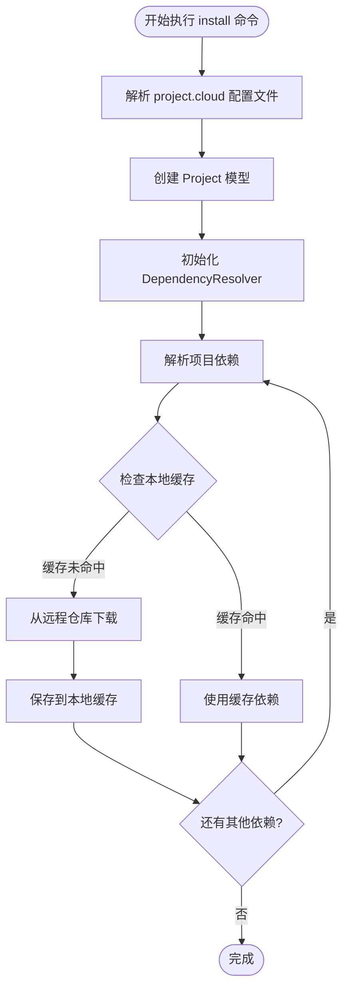

**图表来源**
- [InstallCommand.java](file://src/main/java/org/jcnc/snow/cli/commands/InstallCommand.java#L54-L65)
- [DependencyResolver.java](file://src/main/java/org/jcnc/snow/pkg/resolver/DependencyResolver.java#L42-L83)

**章节来源**
- [InstallCommand.java](file://src/main/java/org/jcnc/snow/cli/commands/InstallCommand.java#L1-L66)

## 核心组件架构

### 系统架构图

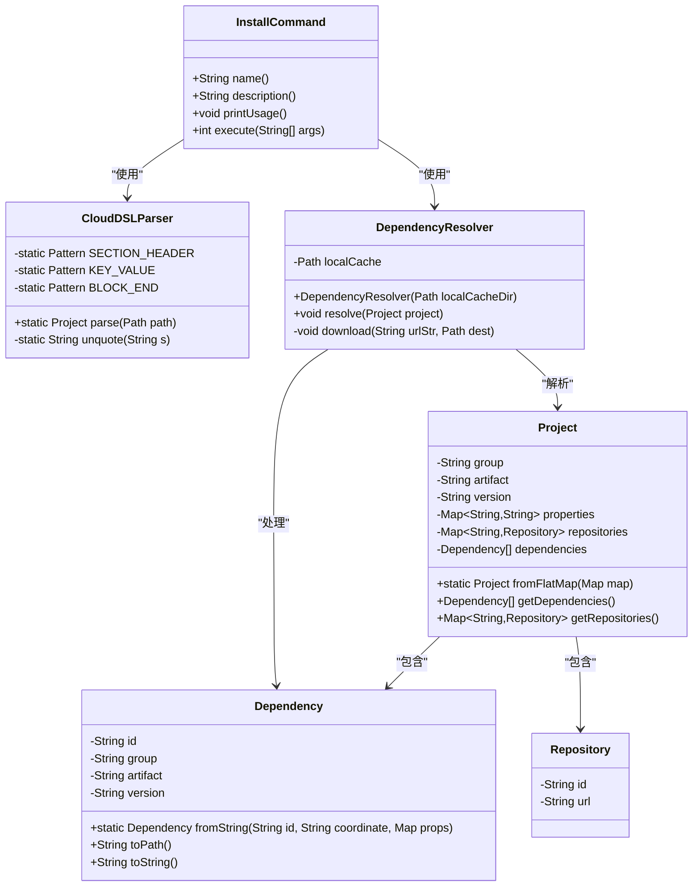

**图表来源**
- [InstallCommand.java](file://src/main/java/org/jcnc/snow/cli/commands/InstallCommand.java#L1-L66)
- [CloudDSLParser.java](file://src/main/java/org/jcnc/snow/pkg/dsl/CloudDSLParser.java#L1-L147)
- [DependencyResolver.java](file://src/main/java/org/jcnc/snow/pkg/resolver/DependencyResolver.java#L1-L85)
- [Project.java](file://src/main/java/org/jcnc/snow/pkg/model/Project.java#L1-L235)
- [Dependency.java](file://src/main/java/org/jcnc/snow/pkg/model/Dependency.java#L1-L88)
- [Repository.java](file://src/main/java/org/jcnc/snow/pkg/model/Repository.java#L1-L19)

### 组件交互序列图

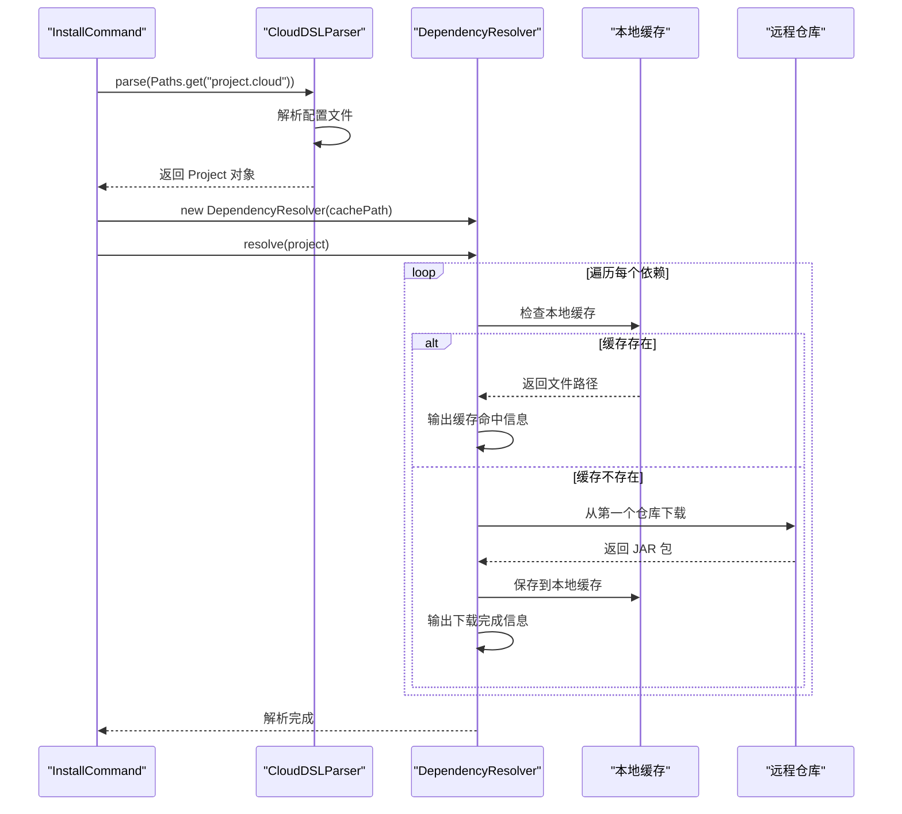

**图表来源**
- [InstallCommand.java](file://src/main/java/org/jcnc/snow/cli/commands/InstallCommand.java#L54-L65)
- [DependencyResolver.java](file://src/main/java/org/jcnc/snow/pkg/resolver/DependencyResolver.java#L42-L83)

**章节来源**
- [InstallCommand.java](file://src/main/java/org/jcnc/snow/cli/commands/InstallCommand.java#L1-L66)
- [DependencyResolver.java](file://src/main/java/org/jcnc/snow/pkg/resolver/DependencyResolver.java#L1-L85)

## 依赖解析流程

### 解析步骤详解

依赖解析过程遵循以下步骤：

1. **配置文件读取**：从项目根目录读取 `project.cloud` 文件
2. **项目模型构建**：将配置转换为 `Project` 对象
3. **依赖提取**：从项目中提取所有依赖声明
4. **缓存检查**：检查本地缓存中是否存在对应依赖
5. **远程下载**：对于缺失的依赖，从配置的仓库下载
6. **缓存更新**：将下载的依赖保存到本地缓存

### 依赖解析算法

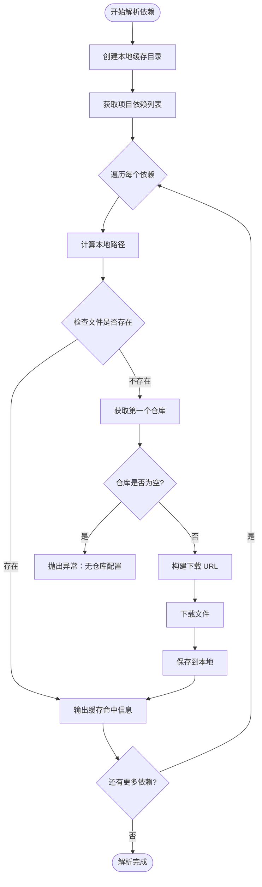

**图表来源**
- [DependencyResolver.java](file://src/main/java/org/jcnc/snow/pkg/resolver/DependencyResolver.java#L42-L83)

**章节来源**
- [DependencyResolver.java](file://src/main/java/org/jcnc/snow/pkg/resolver/DependencyResolver.java#L42-L83)

## CloudDSL 配置文件解析

### 配置文件结构

CloudDSL 是 Snow 项目的专用配置语言，支持区块语法和嵌套结构：

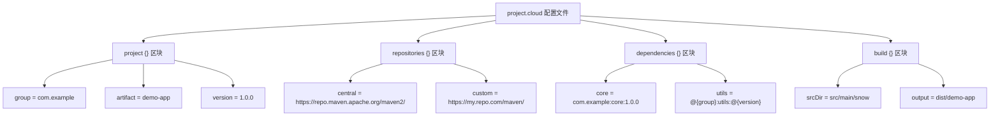

**图表来源**
- [CloudDSLParser.java](file://src/main/java/org/jcnc/snow/pkg/dsl/CloudDSLParser.java#L15-L30)
- [project.cloud](file://playground/PerformanceTest/project.cloud#L1-L11)

### 解析规则

CloudDSL 解析器遵循以下规则：

| 规则类型 | 语法格式 | 示例 | 说明 |
|---------|---------|------|------|
| 区块定义 | `sectionName {` | `project {` | 区块以 `{` 开始 |
| 区块结束 | `}` | `}` | 单独一行的 `}` |
| 键值对 | `key = value` | `group = com.example` | 支持注释（`#`） |
| 嵌套支持 | `parent.child = value` | `build.srcDir = src` | 自动展平为点号分隔 |
| 引号处理 | `"value"` 或 `'value'` | `artifact = "demo-app"` | 自动去除首尾引号 |

### 配置文件示例

```cloud
# 项目基本信息
project {
    group    = "com.example"
    artifact = "demo-app"
    version  = "1.0.0"
    name     = "Demo Application"
    description = "示例 Snow 应用程序"
}

# 仓库配置
repositories {
    central = https://repo.maven.apache.org/maven2/
    snapshot = https://oss.sonatype.org/content/repositories/snapshots/
}

# 依赖声明
dependencies {
    core     = com.example:snow-core:1.0.0
    utils    = @{group}:snow-utils:@{version}
    logging  = ch.qos.logback:logback-classic:1.4.11
    test     = org.junit.jupiter:junit-jupiter:5.10.0
}

# 构建配置
build {
    srcDir = src/main/snow
    output = target/snow
    compile {
        enabled = true
        optimize = false
    }
}
```

**章节来源**
- [CloudDSLParser.java](file://src/main/java/org/jcnc/snow/pkg/dsl/CloudDSLParser.java#L1-L147)
- [project.cloud](file://playground/PerformanceTest/project.cloud#L1-L11)

## 依赖模型与仓库管理

### Dependency 模型

`Dependency` 类表示一个完整的依赖坐标，支持占位符替换：

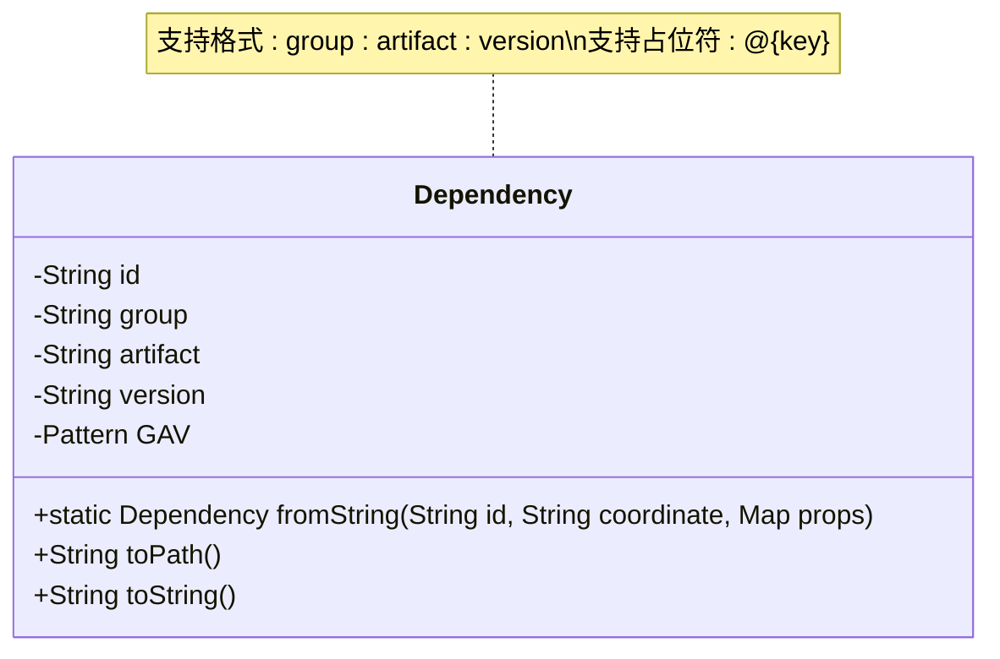

**图表来源**
- [Dependency.java](file://src/main/java/org/jcnc/snow/pkg/model/Dependency.java#L25-L88)

### 依赖路径生成

依赖的本地存储路径遵循特定格式：

| 组件 | 格式 | 示例 |
|------|------|------|
| 组织路径 | `group.replace('.', '/')` | `com/example` |
| 构件路径 | `artifact` | `core` |
| 版本路径 | `version` | `1.0.0` |
| 文件名 | `artifact + ".snow"` | `core.snow` |
| **完整路径** | `group/artifact/version/artifact.snow` | `com/example/core/1.0.0/core.snow` |

### Repository 模型

`Repository` 类表示远程仓库的基本信息：

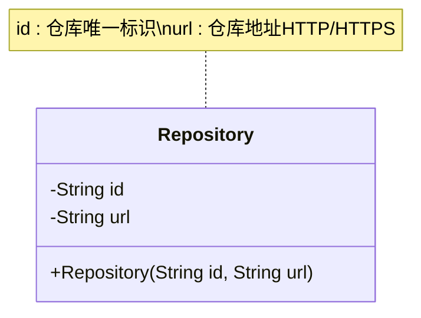

**图表来源**
- [Repository.java](file://src/main/java/org/jcnc/snow/pkg/model/Repository.java#L1-L19)

### 依赖解析策略

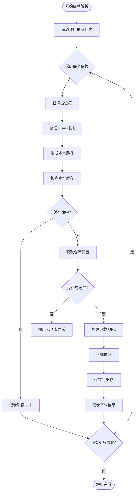

**图表来源**
- [DependencyResolver.java](file://src/main/java/org/jcnc/snow/pkg/resolver/DependencyResolver.java#L42-L83)
- [Dependency.java](file://src/main/java/org/jcnc/snow/pkg/model/Dependency.java#L45-L86)

**章节来源**
- [Dependency.java](file://src/main/java/org/jcnc/snow/pkg/model/Dependency.java#L1-L88)
- [Repository.java](file://src/main/java/org/jcnc/snow/pkg/model/Repository.java#L1-L19)
- [DependencyResolver.java](file://src/main/java/org/jcnc/snow/pkg/resolver/DependencyResolver.java#L42-L83)

## 缓存机制与存储策略

### 本地缓存架构

Snow 使用分层本地缓存系统来优化依赖管理性能：

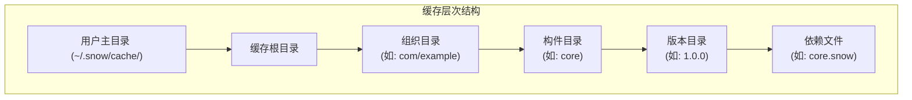

**图表来源**
- [DependencyResolver.java](file://src/main/java/org/jcnc/snow/pkg/resolver/DependencyResolver.java#L25-L30)

### 缓存管理策略

| 策略类型 | 实现方式 | 优势 | 注意事项 |
|---------|---------|------|----------|
| **本地优先** | 检查本地缓存 → 下载远程 | 减少网络流量，提高速度 | 需要定期清理过期缓存 |
| **原子操作** | 使用 `StandardCopyOption.REPLACE_EXISTING` | 防止文件损坏 | 确保磁盘空间充足 |
| **目录创建** | `Files.createDirectories()` | 自动创建必要目录 | 权限检查 |
| **路径解析** | `localCache.resolve(dep.toPath())` | 确保路径正确性 | 跨平台兼容性 |

### 缓存清理建议

为了维护缓存的健康状态，建议定期执行以下操作：

```bash
# 清理整个缓存目录
rm -rf ~/.snow/cache/

# 清理特定版本的依赖
rm -rf ~/.snow/cache/com/example/core/1.0.0/

# 清理未使用的依赖（手动检查）
find ~/.snow/cache/ -type f -mtime +30 -delete
```

**章节来源**
- [DependencyResolver.java](file://src/main/java/org/jcnc/snow/pkg/resolver/DependencyResolver.java#L25-L30)
- [Dependency.java](file://src/main/java/org/jcnc/snow/pkg/model/Dependency.java#L65-L75)

## 错误处理与网络故障

### 异常处理机制

`DependencyResolver` 实现了完善的错误处理机制：

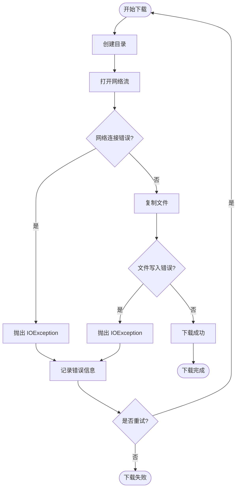

**图表来源**
- [DependencyResolver.java](file://src/main/java/org/jcnc/snow/pkg/resolver/DependencyResolver.java#L65-L83)

### 常见错误类型

| 错误类型 | 异常类 | 原因 | 解决方案 |
|---------|--------|------|----------|
| **网络超时** | `IOException` | 网络连接不稳定 | 检查网络连接，重试下载 |
| **仓库配置缺失** | `IOException` | 项目未配置仓库 | 添加 `repositories` 配置 |
| **文件权限错误** | `IOException` | 缓存目录权限不足 | 修改目录权限或更换位置 |
| **磁盘空间不足** | `IOException` | 磁盘空间不够 | 清理磁盘空间 |
| **URI 格式错误** | `URISyntaxException` | 仓库 URL 格式错误 | 检查仓库配置 |

### 错误恢复策略

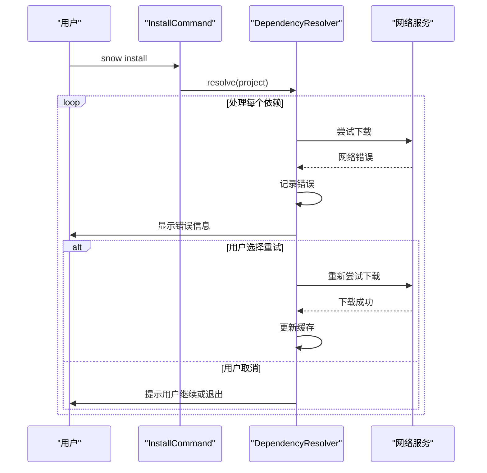

**图表来源**
- [DependencyResolver.java](file://src/main/java/org/jcnc/snow/pkg/resolver/DependencyResolver.java#L42-L83)

### 网络故障诊断

当遇到网络相关问题时，可以按照以下步骤进行诊断：

1. **检查网络连接**
   ```bash
   ping repo.maven.apache.org
   curl -I https://repo.maven.apache.org/maven2/
   ```

2. **验证代理设置**
   ```bash
   echo $HTTP_PROXY
   echo $HTTPS_PROXY
   ```

3. **检查防火墙规则**
   ```bash
   telnet repo.maven.apache.org 443
   ```

4. **查看详细日志**
   ```bash
   snow install --debug  # 如果支持调试模式
   ```

**章节来源**
- [DependencyResolver.java](file://src/main/java/org/jcnc/snow/pkg/resolver/DependencyResolver.java#L65-L83)

## 使用示例

### 基础安装示例

```bash
# 进入项目目录
cd my-snow-project/

# 执行安装命令
snow install

# 输出示例
[dependency] com.example:core:1.0.0 resolved from cache.
[download] https://repo.maven.apache.org/maven2/com/example/core/1.0.0/core.snow
[saved] ~/.snow/cache/com/example/core/1.0.0/core.snow
[dependency] org.junit.jupiter:junit-jupiter:5.10.0 resolved from cache.
```

### 多仓库配置示例

```cloud
# project.cloud
project {
    group    = "com.mycompany"
    artifact = "my-app"
    version  = "1.0.0"
}

repositories {
    central = https://repo.maven.apache.org/maven2/
    company = https://nexus.company.com/repository/maven-public/
    snapshot = https://nexus.company.com/repository/maven-snapshots/
}

dependencies {
    core     = com.mycompany:snow-core:1.0.0
    utils    = com.mycompany:utils:1.0.0-SNAPSHOT
    external = org.apache.commons:commons-lang3:3.12.0
}
```

### 版本占位符示例

```cloud
# project.cloud
project {
    group    = "com.example"
    artifact = "demo-app"
    version  = "1.0.0"
}

properties {
    snow_version = "1.2.3"
    junit_version = "5.10.0"
}

dependencies {
    core     = com.example:snow-core:@{snow_version}
    test     = org.junit.jupiter:junit-jupiter:@{junit_version}
    utils    = com.example:utils:@{version}-SNAPSHOT
}
```

### 离线开发准备

```bash
# 在有网络的环境中预下载所有依赖
snow install

# 将整个缓存目录打包备份
tar -czf snow-cache-backup.tar.gz ~/.snow/cache/

# 在离线环境中恢复缓存
tar -xzf snow-cache-backup.tar.gz -C ~/.snow/
```

### 构建配置示例

```cloud
# project.cloud
project {
    group    = "com.example"
    artifact = "web-app"
    version  = "1.0.0"
}

repositories {
    central = https://repo.maven.apache.org/maven2/
    spring  = https://repo.spring.io/release/
}

dependencies {
    web-core   = org.springframework.boot:spring-boot-starter-web:3.1.0
    data-jpa   = org.springframework.boot:spring-boot-starter-data-jpa:3.1.0
    security   = org.springframework.boot:spring-boot-starter-security:3.1.0
    test       = org.springframework.boot:spring-boot-starter-test:3.1.0
}

build {
    srcDir = src/main/snow
    output = target/snow
    compile {
        enabled = true
        optimize = false
        debug = true
    }
    package {
        enabled = true
        type = jar
    }
}
```

**章节来源**
- [project.cloud](file://playground/PerformanceTest/project.cloud#L1-L11)
- [InstallCommand.java](file://src/main/java/org/jcnc/snow/cli/commands/InstallCommand.java#L15-L25)

## 最佳实践

### 项目配置最佳实践

1. **合理组织依赖**
   - 将核心依赖放在前面
   - 按功能模块分组依赖
   - 使用版本范围（如果需要）

2. **仓库配置策略**
   - 优先使用中央仓库
   - 为内部依赖配置专用仓库
   - 为快照版本配置专门仓库

3. **版本管理**
   - 使用语义化版本号
   - 为快照版本添加时间戳
   - 定期更新依赖版本

### 性能优化建议

1. **缓存管理**
   ```bash
   # 定期清理过期缓存
   find ~/.snow/cache/ -type d -mtime +30 -empty -delete
   
   # 监控缓存大小
   du -sh ~/.snow/cache/
   ```

2. **网络优化**
   ```bash
   # 配置代理（如果需要）
   export HTTP_PROXY=http://proxy.company.com:8080
   export HTTPS_PROXY=https://proxy.company.com:8080
   
   # 使用镜像仓库
   echo "mirror.repo.url=https://mirror.company.com/maven/" >> ~/.snow/config
   ```

3. **并发控制**
   ```bash
   # 限制同时下载的依赖数量
   export SNOW_MAX_DOWNLOADS=4
   
   # 使用本地网络更好的机器
   ssh -L 8080:repo.maven.apache.org:443 remote-server
   ```

### 故障排除指南

1. **常见问题及解决方案**

| 问题症状 | 可能原因 | 解决方案 |
|---------|---------|----------|
| 依赖下载失败 | 网络连接问题 | 检查网络连接，使用代理 |
| 仓库访问被拒绝 | 认证失败 | 检查仓库凭据配置 |
| 版本找不到 | 版本不存在或仓库配置错误 | 验证版本号和仓库URL |
| 缓存损坏 | 文件传输中断 | 删除损坏的缓存文件 |

2. **调试技巧**
   ```bash
   # 启用详细日志（如果支持）
   export SNOW_DEBUG=true
   
   # 手动测试仓库连接
   curl -I https://repo.maven.apache.org/maven2/com/example/core/1.0.0/core.snow
   
   # 检查本地缓存完整性
   find ~/.snow/cache/ -name "*.snow" -size 0
   ```

3. **监控和维护**
   ```bash
   # 定期检查依赖完整性
   find ~/.snow/cache/ -name "*.snow" -exec sha256sum {} \;
   
   # 监控磁盘使用情况
   df -h ~/.snow/cache/
   
   # 备份重要配置
   cp project.cloud ~/.snow/config/
   ```

### 团队协作建议

1. **共享配置**
   - 将 `project.cloud` 文件纳入版本控制
   - 使用团队统一的仓库配置
   - 定期同步依赖版本

2. **CI/CD 集成**
   ```yaml
   # GitHub Actions 示例
   - name: Install Snow Dependencies
     run: snow install
     env:
       MAVEN_REPO_URL: https://repo.maven.apache.org/maven2/
   
   # 缓存依赖以加速构建
   - name: Cache Snow Dependencies
     uses: actions/cache@v3
     with:
       path: ~/.snow/cache
       key: snow-deps-${{ hashFiles('project.cloud') }}
   ```

3. **文档维护**
   - 记录关键依赖的作用
   - 说明版本升级的影响
   - 维护依赖兼容性矩阵

通过遵循这些最佳实践，可以确保 Snow 项目的依赖管理既高效又可靠，为开发团队提供稳定的基础支撑。