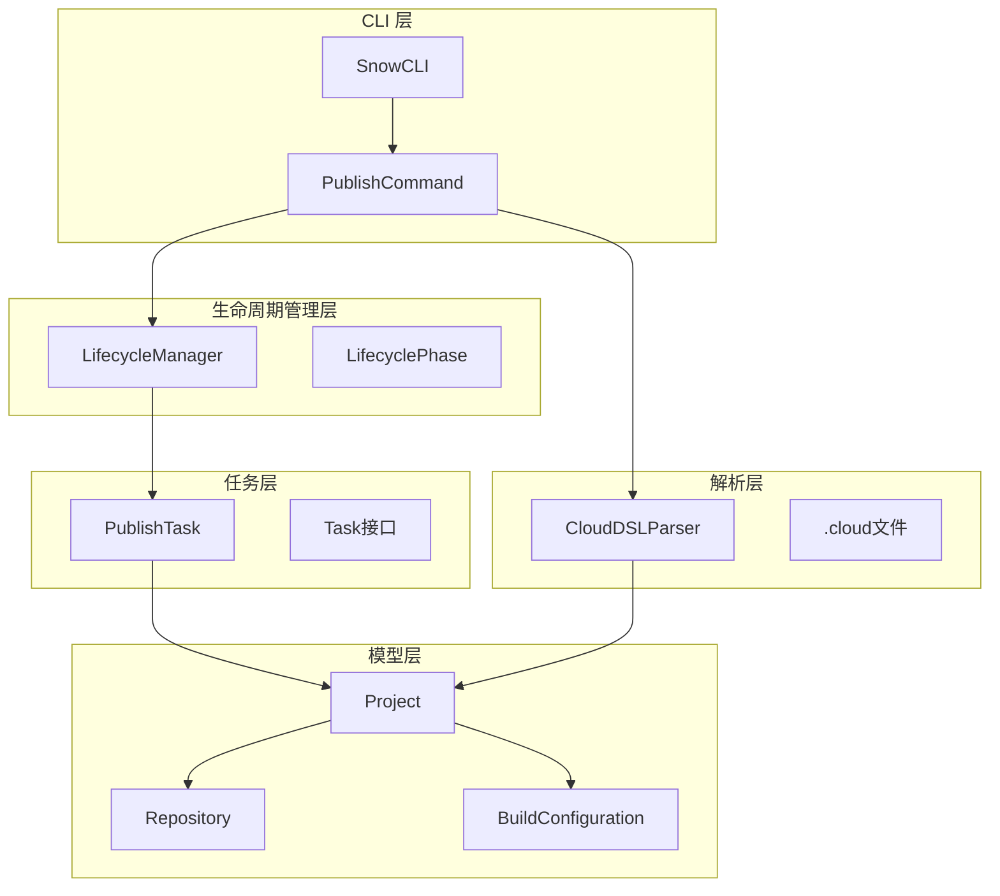
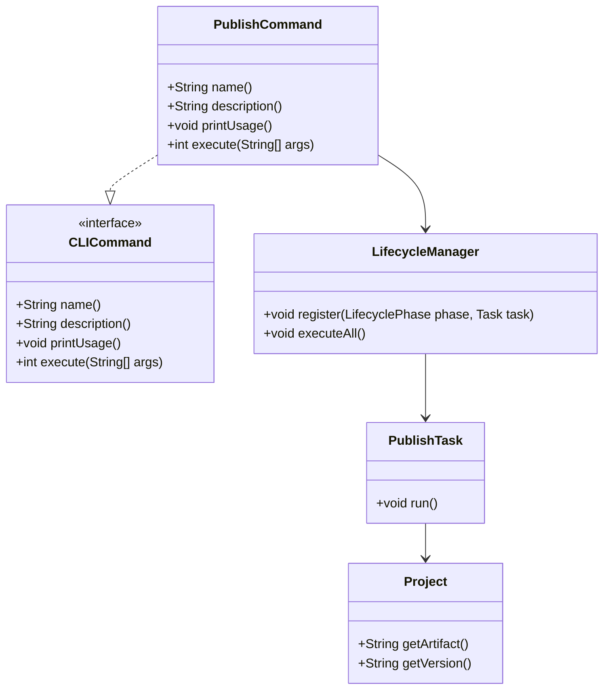
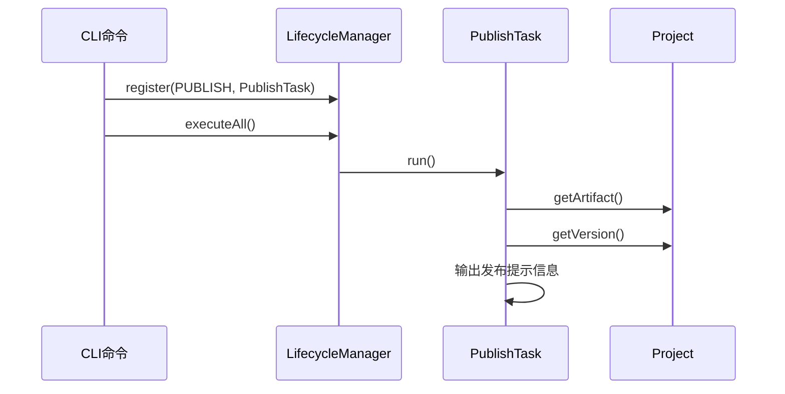
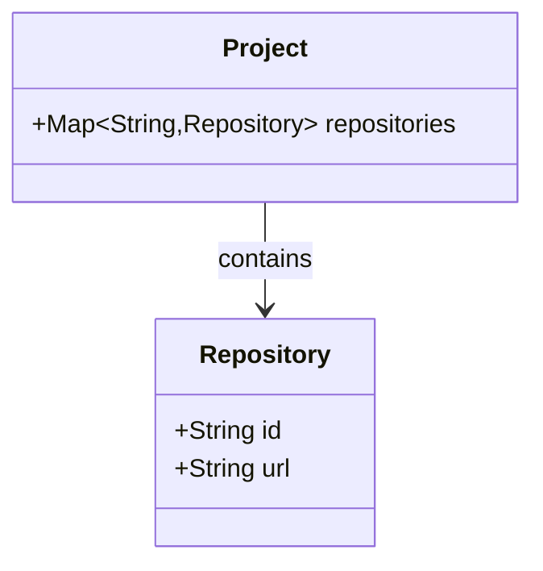
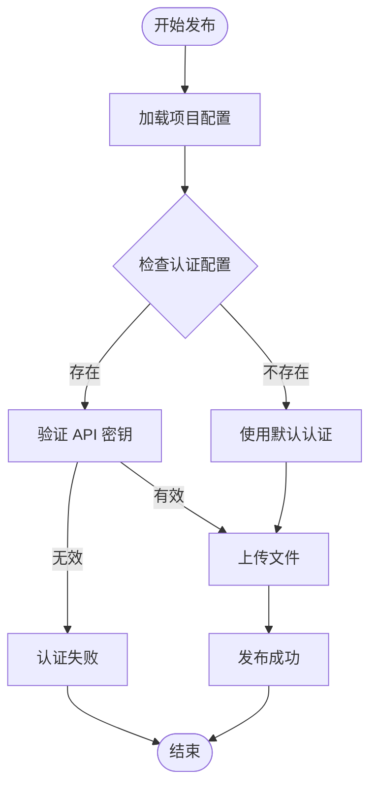
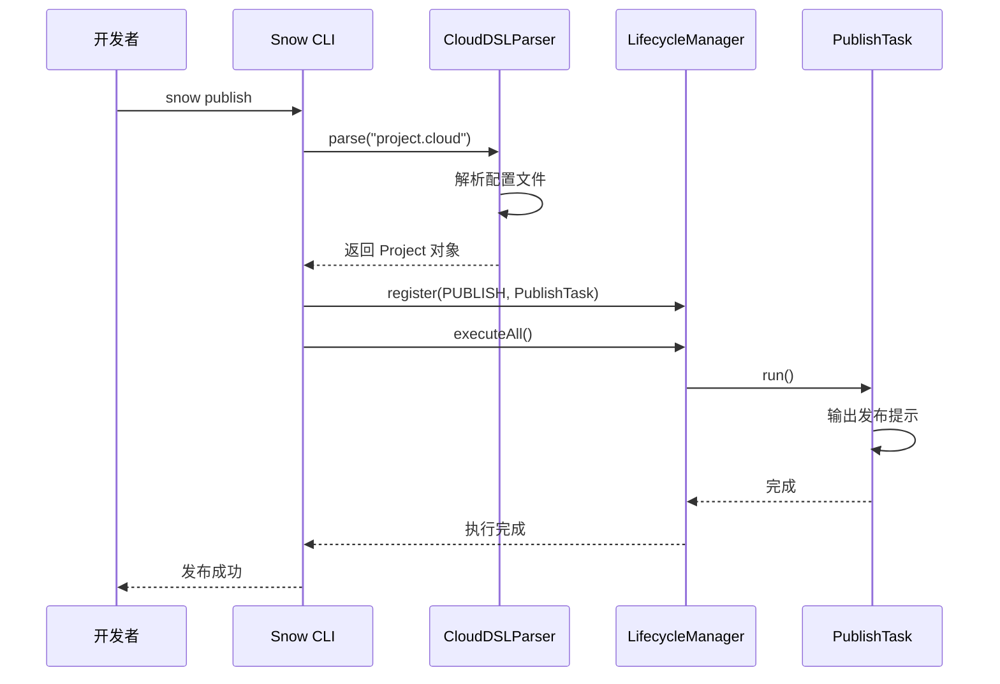
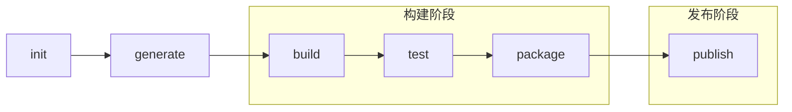

# publish 命令

<cite>
**本文档引用的文件**
- [PublishCommand.java](file://src/main/java/org/jcnc/snow/cli/commands/PublishCommand.java)
- [PublishTask.java](file://src/main/java/org/jcnc/snow/pkg/tasks/PublishTask.java)
- [Repository.java](file://src/main/java/org/jcnc/snow/pkg/model/Repository.java)
- [Project.java](file://src/main/java/org/jcnc/snow/pkg/model/Project.java)
- [LifecycleManager.java](file://src/main/java/org/jcnc/snow/pkg/lifecycle/LifecycleManager.java)
- [LifecyclePhase.java](file://src/main/java/org/jcnc/snow/pkg/lifecycle/LifecyclePhase.java)
- [CloudDSLParser.java](file://src/main/java/org/jcnc/snow/pkg/dsl/CloudDSLParser.java)
- [BuildConfiguration.java](file://src/main/java/org/jcnc/snow/pkg/model/BuildConfiguration.java)
- [Dependency.java](file://src/main/java/org/jcnc/snow/pkg/model/Dependency.java)
- [project.cloud](file://playground/PerformanceTest/project.cloud)
- [SnowConfig.java](file://src/main/java/org/jcnc/snow/common/SnowConfig.java)
</cite>

## 目录
1. [简介](#简介)
2. [命令概述](#命令概述)
3. [架构设计](#架构设计)
4. [核心组件分析](#核心组件分析)
5. [认证机制](#认证机制)
6. [版本发布策略](#版本发布策略)
7. [使用示例](#使用示例)
8. [CI/CD 集成](#cicd-集成)
9. [与 build 命令的协作](#与-build-命令的协作)
10. [故障排除](#故障排除)
11. [总结](#总结)

## 简介

Snow 的 `publish` 命令是一个专门用于将编译打包好的制品（如 `.snowpkg`）发布到远程仓库的 CLI 工具。该命令作为 Snow 包管理系统的重要组成部分，支持持续集成、交付和项目分发场景，为开发者提供了完整的自动化发布解决方案。

## 命令概述

### 基本功能

`publish` 命令的主要功能包括：
- 解析项目描述文件（`project.cloud`）
- 注册并执行发布生命周期阶段的任务
- 输出制品发布提示信息
- 为未来的远程仓库上传功能预留接口

### 命令语法

```bash
snow publish
```

### 支持的场景

- **持续集成（CI）**：在 CI/CD 流水线中自动发布制品
- **持续交付（CD）**：将构建好的制品部署到生产环境
- **项目分发**：将项目制品发布到远程仓库供其他项目使用

## 架构设计

Snow 的 publish 命令采用模块化的架构设计，主要包含以下几个层次：



**图表来源**
- [PublishCommand.java](file://src/main/java/org/jcnc/snow/cli/commands/PublishCommand.java#L1-L75)
- [LifecycleManager.java](file://src/main/java/org/jcnc/snow/pkg/lifecycle/LifecycleManager.java#L1-L67)
- [PublishTask.java](file://src/main/java/org/jcnc/snow/pkg/tasks/PublishTask.java#L1-L36)

## 核心组件分析

### PublishCommand - 命令入口

`PublishCommand` 是 publish 命令的主入口点，实现了 `CLICommand` 接口：



**图表来源**
- [PublishCommand.java](file://src/main/java/org/jcnc/snow/cli/commands/PublishCommand.java#L20-L75)
- [LifecycleManager.java](file://src/main/java/org/jcnc/snow/pkg/lifecycle/LifecycleManager.java#L20-L67)
- [PublishTask.java](file://src/main/java/org/jcnc/snow/pkg/tasks/PublishTask.java#L15-L36)

**章节来源**
- [PublishCommand.java](file://src/main/java/org/jcnc/snow/cli/commands/PublishCommand.java#L1-L75)

### PublishTask - 发布任务

`PublishTask` 负责执行具体的发布逻辑：



**图表来源**
- [PublishTask.java](file://src/main/java/org/jcnc/snow/pkg/tasks/PublishTask.java#L25-L35)
- [LifecycleManager.java](file://src/main/java/org/jcnc/snow/pkg/lifecycle/LifecycleManager.java#L50-L67)

**章节来源**
- [PublishTask.java](file://src/main/java/org/jcnc/snow/pkg/tasks/PublishTask.java#L1-L36)

### 项目模型 - Project

`Project` 类包含了发布所需的所有项目元数据：

| 属性 | 类型 | 描述 | 必需 |
|------|------|------|------|
| group | String | 组织/分组名（如 com.example） | 否 |
| artifact | String | 构件/模块名（如 app-core） | 是 |
| version | String | 版本号（如 1.0.0） | 是 |
| name | String | 项目展示名称 | 否 |
| description | String | 项目描述 | 否 |
| license | String | 许可证标识 | 否 |
| homepage | String | 项目主页 URL | 否 |

**章节来源**
- [Project.java](file://src/main/java/org/jcnc/snow/pkg/model/Project.java#L20-L50)

### 仓库模型 - Repository

`Repository` 表示远程仓库的基本信息：



**图表来源**
- [Repository.java](file://src/main/java/org/jcnc/snow/pkg/model/Repository.java#L15-L19)

**章节来源**
- [Repository.java](file://src/main/java/org/jcnc/snow/pkg/model/Repository.java#L1-L19)

## 认证机制

虽然当前的 `PublishTask` 实现尚未包含实际的认证机制，但系统架构已经为未来的认证功能预留了扩展空间。以下是认证机制的设计考虑：

### API 密钥支持

系统可以通过以下方式支持 API 密钥认证：

1. **环境变量配置**：通过 `SNOW_API_KEY` 环境变量传递认证凭据
2. **配置文件**：在 `.cloud` 文件中添加认证配置
3. **命令行参数**：通过 `--api-key` 参数传递密钥

### 认证流程设计



## 版本发布策略

### 版本号管理

Snow 支持多种版本号格式：

| 版本类型 | 示例 | 描述 |
|----------|------|------|
| 稳定版本 | 1.0.0 | 正式发布的稳定版本 |
| 预览版本 | 1.0.0-alpha | 预览或测试版本 |
| 快照版本 | 1.0.0-SNAPSHOT | 开发中的快照版本 |
| 修订版本 | 1.0.1 | 修复 bug 的修订版本 |

### 版本唯一性保证

系统通过以下机制确保版本号的唯一性：

1. **项目元数据验证**：检查 `project.cloud` 文件中的版本号
2. **冲突检测**：在发布前验证目标仓库中是否已存在相同版本
3. **原子操作**：确保发布过程的原子性，避免部分成功的情况

## 使用示例

### 基本使用

```bash
# 发布当前项目
snow publish
```

### 项目配置示例

以下是一个典型的 `project.cloud` 配置文件：

```cloud
project {
    group    = "com.example"
    artifact = "my-library"
    version  = "1.0.0"
    description = "A sample library for Snow projects"
    license = "Apache-2.0"
}

repositories {
    central = "https://repo.maven.apache.org/maven2/"
}

dependencies {
    math = "org.snow:math:@{version}"
}

build {
    srcDir = "./src"
    output = "my-library"
}
```

### 发布流程示例



**图表来源**
- [PublishCommand.java](file://src/main/java/org/jcnc/snow/cli/commands/PublishCommand.java#L60-L73)
- [CloudDSLParser.java](file://src/main/java/org/jcnc/snow/pkg/dsl/CloudDSLParser.java#L70-L146)

**章节来源**
- [project.cloud](file://playground/PerformanceTest/project.cloud#L1-L11)

## CI/CD 集成

### GitHub Actions 集成

以下是一个 GitHub Actions 工作流示例：

```yaml
name: Publish Snow Package

on:
  push:
    tags:
      - 'v*'

jobs:
  publish:
    runs-on: ubuntu-latest
    steps:
      - uses: actions/checkout@v2
      
      - name: Setup Snow
        run: |
          wget https://github.com/jcnc-org/snow/releases/latest/download/snow-linux.zip
          unzip snow-linux.zip
          
      - name: Build Project
        run: ./snow build
        
      - name: Publish Package
        run: ./snow publish
        env:
          SNOW_API_KEY: ${{ secrets.SNOW_API_KEY }}
```

### GitLab CI 集成

```yaml
stages:
  - build
  - publish

build:
  stage: build
  script:
    - wget https://github.com/jcnc-org/snow/releases/latest/download/snow-linux.zip
    - unzip snow-linux.zip
    - ./snow build

publish:
  stage: publish
  script:
    - ./snow publish
  only:
    - tags
```

### Jenkins 集成

```groovy
pipeline {
    agent any
    
    stages {
        stage('Build') {
            steps {
                sh '''
                    wget https://github.com/jcnc-org/snow/releases/latest/download/snow-linux.zip
                    unzip snow-linux.zip
                    ./snow build
                '''
            }
        }
        
        stage('Publish') {
            steps {
                sh './snow publish'
            }
            post {
                always {
                    archiveArtifacts artifacts: '**/*.snowpkg', fingerprint: true
                }
            }
        }
    }
}
```

## 与 build 命令的协作

### 自动化发布流程

Snow 提供了完整的自动化发布流水线，通过 `build` 和 `publish` 命令的协同工作：



### 发布前检查清单

在执行 `publish` 命令之前，建议进行以下检查：

1. **构建状态检查**：确保 `build` 命令成功完成
2. **版本号验证**：确认 `project.cloud` 中的版本号正确
3. **依赖完整性**：验证所有依赖项已正确解析
4. **测试通过**：确保所有测试用例都已通过
5. **文档更新**：检查项目文档是否已更新

### 发布最佳实践

1. **版本控制**：始终使用带有标签的版本进行发布
2. **自动化测试**：在发布前运行完整的测试套件
3. **文档同步**：确保发布文档与代码版本保持一致
4. **回滚准备**：准备好快速回滚方案
5. **监控告警**：设置发布后的监控和告警机制

## 故障排除

### 常见问题及解决方案

#### 1. 项目配置文件缺失

**问题**：找不到 `project.cloud` 文件

**解决方案**：
```bash
# 检查当前目录
ls -la project.cloud

# 如果不存在，初始化项目
snow init
```

#### 2. 权限不足

**问题**：无法访问目标仓库

**解决方案**：
```bash
# 检查仓库配置
cat project.cloud | grep repositories

# 验证网络连接
curl -I https://your-repository-url
```

#### 3. 版本冲突

**问题**：目标版本已存在

**解决方案**：
```bash
# 检查现有版本
snow search my-library

# 更新版本号
# 修改 project.cloud 中的 version 字段
```

#### 4. 发布失败

**问题**：发布过程中出现错误

**解决方案**：
```bash
# 启用调试模式
export SNOW_DEBUG=true
snow publish --verbose

# 检查网络连接
ping your-repository-host

# 验证认证信息
echo $SNOW_API_KEY
```

### 调试技巧

1. **启用详细输出**：使用 `SNOW_DEBUG=true` 环境变量
2. **检查日志文件**：查看 Snow 的日志输出
3. **网络诊断**：使用 `curl` 或 `wget` 测试仓库连接
4. **权限验证**：确认 API 密钥的有效性

## 总结

Snow 的 `publish` 命令提供了一个强大而灵活的发布解决方案，具有以下特点：

### 主要优势

1. **模块化设计**：清晰的架构分离，便于维护和扩展
2. **配置驱动**：通过 `project.cloud` 文件集中管理项目配置
3. **生命周期管理**：完整的任务生命周期支持
4. **CI/CD 友好**：易于集成到各种 CI/CD 平台
5. **扩展性强**：为未来的功能增强预留了充分的空间

### 技术特色

- **类型安全**：使用 Java 的强类型系统确保数据完整性
- **不可变对象**：Project 和其他核心模型采用不可变设计
- **接口抽象**：通过接口实现松耦合的组件设计
- **异常处理**：完善的错误处理和异常传播机制

### 发展方向

随着 Snow 语言生态系统的不断发展，`publish` 命令将在以下方面继续演进：

1. **认证机制**：支持更丰富的认证方式
2. **上传协议**：实现 HTTP PUT/POST 等标准协议
3. **仓库支持**：支持更多类型的远程仓库
4. **性能优化**：优化大型项目的发布流程
5. **用户体验**：提供更友好的错误提示和进度反馈

通过本文档的详细介绍，开发者可以全面了解 Snow `publish` 命令的功能特性和使用方法，为项目的自动化发布流程提供可靠的技术支撑。