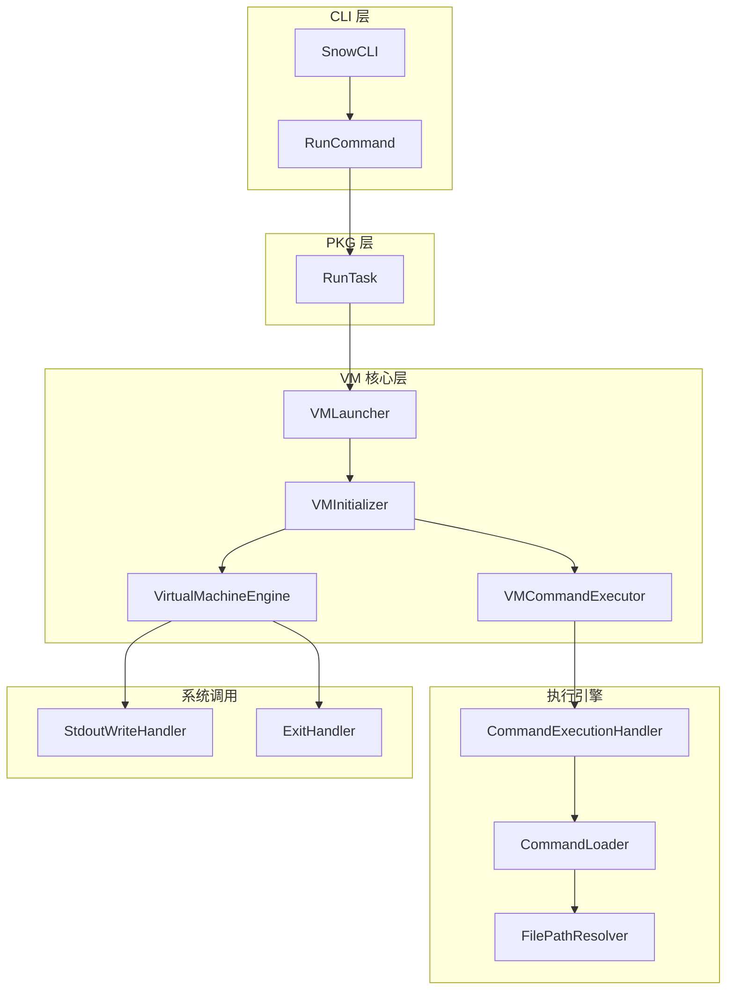
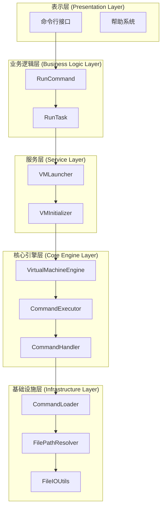
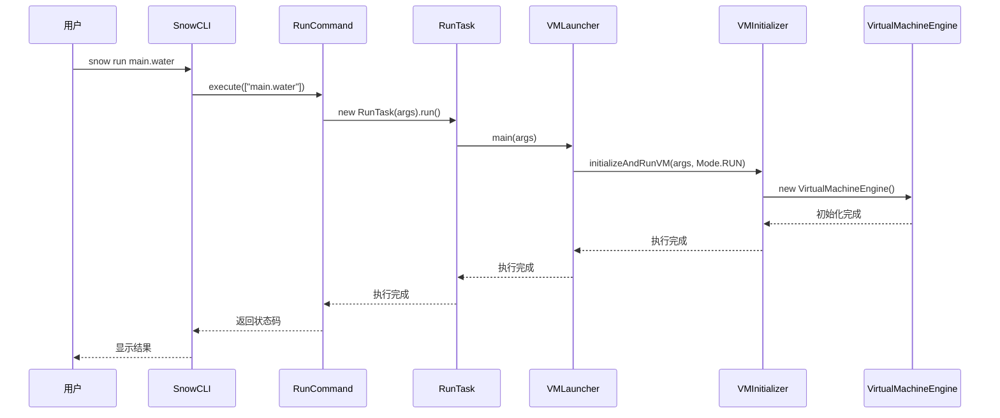
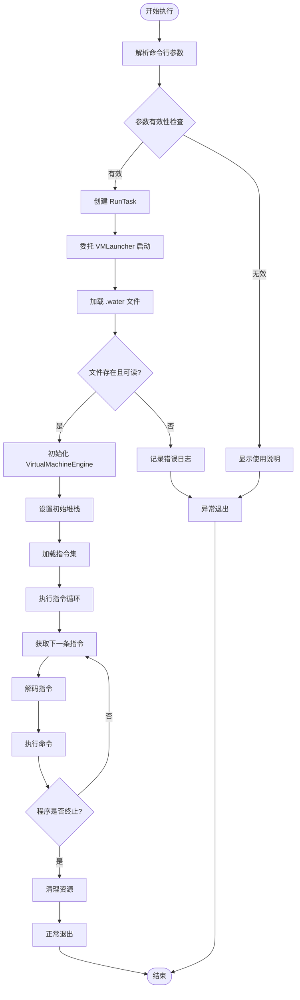
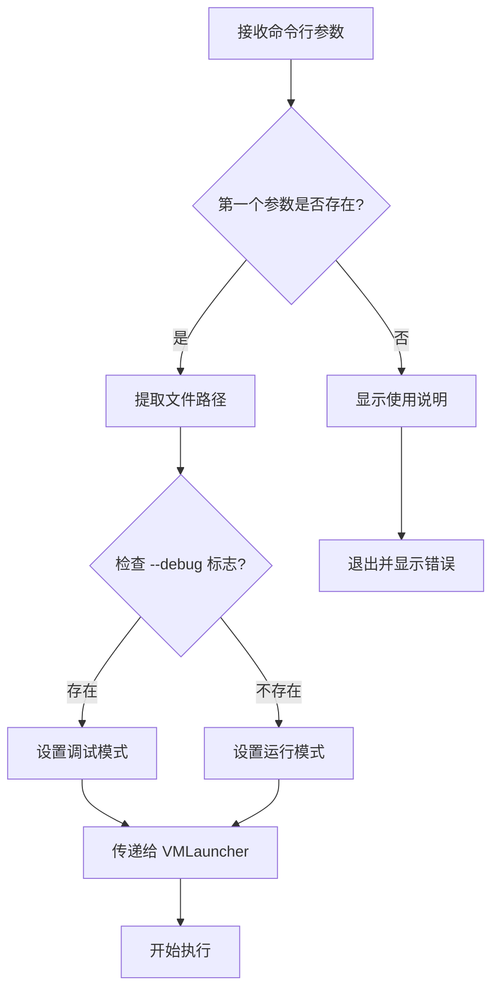
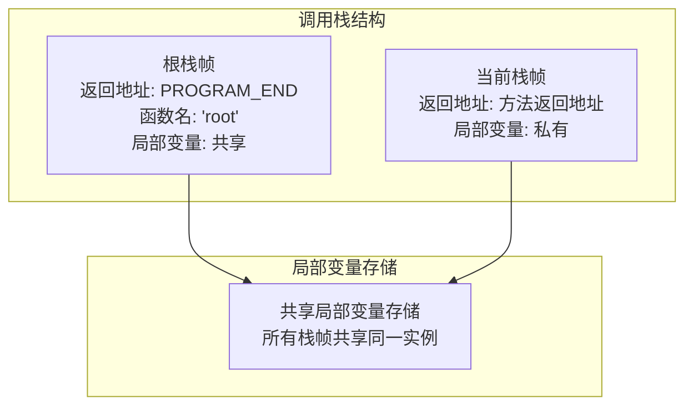
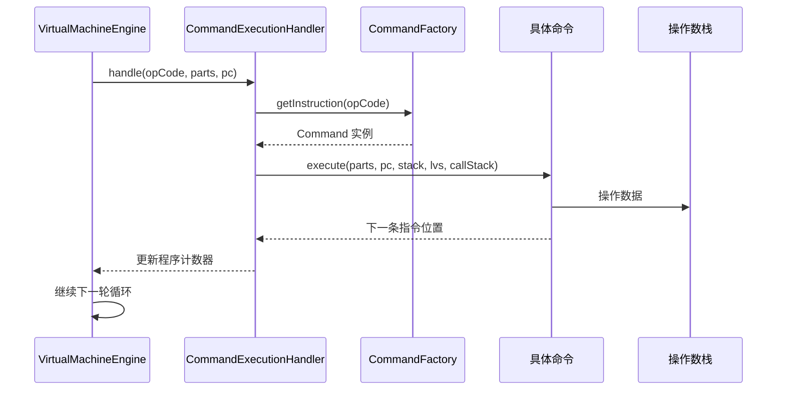
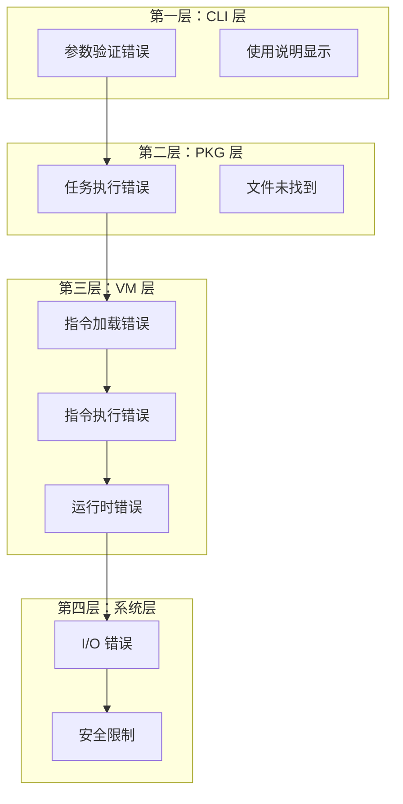
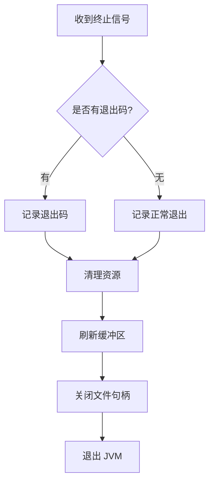

# run 命令详细文档

<cite>
**本文档中引用的文件**
- [RunCommand.java](file://src/main/java/org/jcnc/snow/cli/commands/RunCommand.java)
- [RunTask.java](file://src/main/java/org/jcnc/snow/pkg/tasks/RunTask.java)
- [VMLauncher.java](file://src/main/java/org/jcnc/snow/vm/VMLauncher.java)
- [VMInitializer.java](file://src/main/java/org/jcnc/snow/vm/VMInitializer.java)
- [VirtualMachineEngine.java](file://src/main/java/org/jcnc/snow/vm/engine/VirtualMachineEngine.java)
- [VMCommandExecutor.java](file://src/main/java/org/jcnc/snow/vm/engine/VMCommandExecutor.java)
- [CommandExecutionHandler.java](file://src/main/java/org/jcnc/snow/vm/execution/CommandExecutionHandler.java)
- [CommandLoader.java](file://src/main/java/org/jcnc/snow/vm/execution/CommandLoader.java)
- [FilePathResolver.java](file://src/main/java/org/jcnc/snow/vm/io/FilePathResolver.java)
- [Mode.java](file://src/main/java/org/jcnc/snow/common/Mode.java)
- [StdoutWriteHandler.java](file://src/main/java/org/jcnc/snow/vm/commands/system/control/console/StdoutWriteHandler.java)
- [ExitHandler.java](file://src/main/java/org/jcnc/snow/vm/commands/system/control/process/ExitHandler.java)
- [SnowCLI.java](file://src/main/java/org/jcnc/snow/cli/SnowCLI.java)
</cite>

## 目录
1. [简介](#简介)
2. [命令结构概览](#命令结构概览)
3. [核心组件分析](#核心组件分析)
4. [架构详细说明](#架构详细说明)
5. [执行流程详解](#执行流程详解)
6. [参数和选项](#参数和选项)
7. [使用示例](#使用示例)
8. [VM 模块交互](#vm-模块交互)
9. [错误处理机制](#错误处理机制)
10. [性能考虑](#性能考虑)
11. [故障排除指南](#故障排除指南)
12. [总结](#总结)

## 简介

`run` 命令是 Snow 编程语言的核心命令之一，专门用于执行已编译的 `.water` 字节码文件。该命令作为用户与虚拟机之间的桥梁，负责启动 VMLauncher、加载字节码并初始化 VirtualMachineEngine 来执行程序。

该命令的设计遵循了分层架构原则，CLI 层负责参数解析和命令分发，pkg 层处理任务执行逻辑，而 VM 层则专注于字节码的解释和执行。这种设计确保了系统的可维护性和扩展性。

## 命令结构概览



**图表来源**
- [SnowCLI.java](file://src/main/java/org/jcnc/snow/cli/SnowCLI.java#L1-L99)
- [RunCommand.java](file://src/main/java/org/jcnc/snow/cli/commands/RunCommand.java#L1-L67)
- [RunTask.java](file://src/main/java/org/jcnc/snow/pkg/tasks/RunTask.java#L1-L42)
- [VMLauncher.java](file://src/main/java/org/jcnc/snow/vm/VMLauncher.java#L1-L51)

## 核心组件分析

### RunCommand - CLI 命令处理器

RunCommand 是命令行界面的入口点，实现了 CLICommand 接口，负责解析用户输入并委托给 RunTask 执行实际的运行逻辑。

**主要功能：**
- 命令名称识别（"run"）
- 命令描述提供
- 参数验证和错误处理
- 委托执行给 RunTask

**关键特性：**
- 保持 CLI 层的轻量级和无状态设计
- 提供清晰的错误提示和使用说明
- 支持参数长度检查和帮助信息显示

**章节来源**
- [RunCommand.java](file://src/main/java/org/jcnc/snow/cli/commands/RunCommand.java#L1-L67)

### RunTask - 任务执行器

RunTask 采用记录类（record）设计模式，封装了运行任务的所有必要信息和执行逻辑。

**核心职责：**
- 参数验证和文件路径检查
- 委托给 VMLauncher.main() 启动虚拟机
- 异常传播和错误处理

**设计优势：**
- 不可变性保证数据一致性
- 简洁的构造函数设计
- 明确的任务边界定义

**章节来源**
- [RunTask.java](file://src/main/java/org/jcnc/snow/pkg/tasks/RunTask.java#L1-L42)

### VMLauncher - 虚拟机启动器

VMLauncher 作为虚拟机的主入口点，负责协调整个启动过程。

**启动序列：**
1. 接收命令行参数
2. 调用 VMInitializer.initializeAndRunVM()
3. 设置运行模式为 Mode.RUN
4. 启动虚拟机执行流程

**章节来源**
- [VMLauncher.java](file://src/main/java/org/jcnc/snow/vm/VMLauncher.java#L1-L51)

## 架构详细说明

### 分层架构设计

Snow 的 run 命令采用了清晰的分层架构：



**图表来源**
- [SnowCLI.java](file://src/main/java/org/jcnc/snow/cli/SnowCLI.java#L20-L35)
- [RunCommand.java](file://src/main/java/org/jcnc/snow/cli/commands/RunCommand.java#L15-L25)
- [RunTask.java](file://src/main/java/org/jcnc/snow/pkg/tasks/RunTask.java#L15-L25)

### 组件间通信机制

各组件之间通过明确定义的接口进行通信：



**图表来源**
- [SnowCLI.java](file://src/main/java/org/jcnc/snow/cli/SnowCLI.java#L50-L80)
- [RunCommand.java](file://src/main/java/org/jcnc/snow/cli/commands/RunCommand.java#L40-L55)
- [RunTask.java](file://src/main/java/org/jcnc/snow/pkg/tasks/RunTask.java#L35-L42)

## 执行流程详解

### 完整执行流程



**图表来源**
- [RunCommand.java](file://src/main/java/org/jcnc/snow/cli/commands/RunCommand.java#L40-L55)
- [RunTask.java](file://src/main/java/org/jcnc/snow/pkg/tasks/RunTask.java#L35-L42)
- [VMInitializer.java](file://src/main/java/org/jcnc/snow/vm/VMInitializer.java#L40-L65)

### 虚拟机引擎初始化

VirtualMachineEngine 的初始化过程包含以下关键步骤：

1. **运行时数据结构创建**
   - 创建操作数栈 (OperandStack)
   - 创建局部变量存储 (LocalVariableStore)
   - 创建调用栈 (CallStack)
   - 创建命令执行处理器 (CommandExecutionHandler)

2. **根帧确保**
   - 确保根栈帧的存在
   - 设置根帧的返回地址为 PROGRAM_END
   - 初始化共享的局部变量存储

3. **程序计数器设置**
   - 初始化程序计数器为 0
   - 准备开始指令执行循环

**章节来源**
- [VirtualMachineEngine.java](file://src/main/java/org/jcnc/snow/vm/engine/VirtualMachineEngine.java#L50-L70)

## 参数和选项

### 基本语法

```bash
snow run <program.water> [--debug]
```

### 参数说明

| 参数 | 类型 | 必需 | 描述 |
|------|------|------|------|
| `<program.water>` | 字符串 | 是 | 要执行的 .water 字节码文件路径 |
| `--debug` | 标志 | 否 | 启用调试模式（目前在 VM 层实现） |

### 参数处理流程



**图表来源**
- [RunCommand.java](file://src/main/java/org/jcnc/snow/cli/commands/RunCommand.java#L40-L55)
- [Mode.java](file://src/main/java/org/jcnc/snow/common/Mode.java#L10-L20)

## 使用示例

### 基本用法示例

```bash
# 执行简单的水语言程序
snow run build/main.water

# 执行带有调试信息的程序
snow run build/main.water --debug

# 在不同目录下执行程序
snow run ./programs/utils/math.water

# 从相对路径执行
snow run ../examples/hello.world.water
```

### 高级使用场景

```bash
# 结合管道重定向
snow run program.water > output.txt

# 在脚本中使用
#!/bin/bash
result=$(snow run calc.water 5 10 +)
echo "计算结果: $result"

# 条件执行
if snow run test.water; then
    echo "测试通过"
else
    echo "测试失败"
fi
```

### 错误情况示例

```bash
# 未提供文件路径
snow run
# 输出: Usage:
#      snow run <program.water>

# 文件不存在
snow run nonexistent.water
# 输出: No valid file path provided.

# 文件权限不足
snow run restricted.water
# 输出: Failed to read instructions or the instruction list is empty
```

## VM 模块交互

### 初始堆栈设置

VirtualMachineEngine 在启动时会建立一个特殊的根栈帧：



**图表来源**
- [VirtualMachineEngine.java](file://src/main/java/org/jcnc/snow/vm/engine/VirtualMachineEngine.java#L120-L140)

### 内置系统调用处理器

VM 模块提供了丰富的系统调用处理器来支持程序的各种需求：

#### 标准输出处理器 (StdoutWriteHandler)

负责处理标准输出写入操作，支持多种数据类型的输出：

- **字节数组输出**：直接按原始字节输出
- **字符串输出**：调用 toString() 后以 UTF-8 编码输出  
- **null 值处理**：输出字符串 "null"
- **其他对象**：调用 toString() 方法转换后输出

#### 程序终止处理器 (ExitHandler)

提供程序正常退出的功能：

- **退出码参数**：从操作数栈获取退出码
- **JVM 终止**：调用 System.exit() 安全终止
- **异常处理**：处理安全管理器限制等异常情况

**章节来源**
- [StdoutWriteHandler.java](file://src/main/java/org/jcnc/snow/vm/commands/system/control/console/StdoutWriteHandler.java#L15-L41)
- [ExitHandler.java](file://src/main/java/org/jcnc/snow/vm/commands/system/control/process/ExitHandler.java#L15-L38)

### 指令执行流程



**图表来源**
- [VirtualMachineEngine.java](file://src/main/java/org/jcnc/snow/vm/engine/VirtualMachineEngine.java#L80-L110)
- [CommandExecutionHandler.java](file://src/main/java/org/jcnc/snow/vm/execution/CommandExecutionHandler.java#L40-L60)

## 错误处理机制

### 多层次错误处理

Snow 的 run 命令实现了多层次的错误处理机制：



**图表来源**
- [RunCommand.java](file://src/main/java/org/jcnc/snow/cli/commands/RunCommand.java#L40-L55)
- [RunTask.java](file://src/main/java/org/jcnc/snow/pkg/tasks/RunTask.java#L35-L42)
- [VMCommandExecutor.java](file://src/main/java/org/jcnc/snow/vm/engine/VMCommandExecutor.java#L35-L45)

### 异常类型和处理策略

| 异常类型 | 触发条件 | 处理策略 | 返回码 |
|----------|----------|----------|--------|
| IllegalArgumentException | 参数无效或缺失 | 显示使用说明 | 1 |
| FileNotFoundException | 文件不存在 | 记录错误日志 | 1 |
| IOException | 文件读取错误 | 记录错误详情 | 1 |
| SecurityException | 安全限制 | 记录安全错误 | 1 |
| RuntimeException | 运行时错误 | 终止程序执行 | 1 |
| VMError | 虚拟机内部错误 | 安全终止 | 1 |

### 程序终止处理

当程序正常退出或遇到致命错误时，系统会执行以下终止流程：



**图表来源**
- [ExitHandler.java](file://src/main/java/org/jcnc/snow/vm/commands/system/control/process/ExitHandler.java#L30-L38)

## 性能考虑

### 启动性能优化

1. **延迟初始化**：只有在需要时才创建虚拟机引擎实例
2. **参数验证缓存**：避免重复的参数解析开销
3. **文件访问优化**：使用高效的文件读取机制

### 执行性能优化

1. **指令缓存**：预解析的指令格式提高执行效率
2. **栈操作优化**：高效的栈数据结构减少内存分配
3. **垃圾回收友好**：避免频繁的对象创建和销毁

### 内存使用优化

1. **共享局部变量存储**：多个栈帧共享同一局部变量存储
2. **紧凑化机制**：定期清理未使用的局部变量槽位
3. **流式处理**：大文件的流式读取避免内存溢出

## 故障排除指南

### 常见问题及解决方案

#### 1. 文件路径问题

**问题症状：**
```
No valid file path provided.
```

**解决方案：**
- 检查文件路径是否正确
- 确认文件是否存在且可读
- 使用绝对路径代替相对路径

#### 2. 文件格式问题

**问题症状：**
```
Failed to read instructions or the instruction list is empty
```

**解决方案：**
- 验证 .water 文件格式是否正确
- 检查文件是否被正确编译
- 确认文件编码格式

#### 3. 权限问题

**问题症状：**
```
Access denied
```

**解决方案：**
- 检查文件读取权限
- 确认用户对文件所在目录有访问权限
- 检查操作系统安全策略

#### 4. 内存不足

**问题症状：**
```
OutOfMemoryError
```

**解决方案：**
- 增加 JVM 堆内存大小
- 优化程序内存使用
- 检查是否存在内存泄漏

### 调试技巧

#### 启用详细日志

虽然 run 命令本身不直接提供调试选项，但可以通过以下方式获得更多信息：

```bash
# 重定向标准输出和错误输出
snow run program.water > output.log 2>&1

# 使用 strace 跟踪系统调用
strace -o trace.log snow run program.water
```

#### 检查文件完整性

```bash
# 验证文件大小
ls -la program.water

# 检查文件头部
head -n 10 program.water

# 验证文件末尾
tail -n 10 program.water
```

**章节来源**
- [FilePathResolver.java](file://src/main/java/org/jcnc/snow/vm/io/FilePathResolver.java#L30-L44)
- [CommandLoader.java](file://src/main/java/org/jcnc/snow/vm/execution/CommandLoader.java#L35-L49)

## 总结

Snow 的 run 命令是一个精心设计的系统组件，它成功地将复杂的虚拟机执行过程封装在一个简洁的命令接口之后。通过分层架构设计，该命令实现了：

### 主要优势

1. **清晰的职责分离**：CLI、PKG 和 VM 层各司其职，保持了良好的架构隔离
2. **强大的错误处理**：多层次的错误检测和恢复机制
3. **灵活的扩展性**：模块化设计便于添加新的系统调用和功能
4. **优秀的用户体验**：简洁的命令语法和清晰的错误信息

### 技术特点

- **无状态设计**：CLI 层保持无状态，提高并发安全性
- **委托模式**：通过委托实现职责转移，简化复杂逻辑
- **工厂模式**：使用工厂模式创建和管理各种组件
- **记录类设计**：RunTask 采用记录类简化任务封装

### 应用价值

run 命令不仅是一个简单的程序执行工具，更是 Snow 编程语言生态系统的重要组成部分。它为开发者提供了可靠、高效的程序执行环境，同时为系统的可维护性和扩展性奠定了坚实基础。

通过深入理解 run 命令的工作原理，开发者可以更好地利用 Snow 语言的强大功能，并在需要时进行适当的定制和扩展。