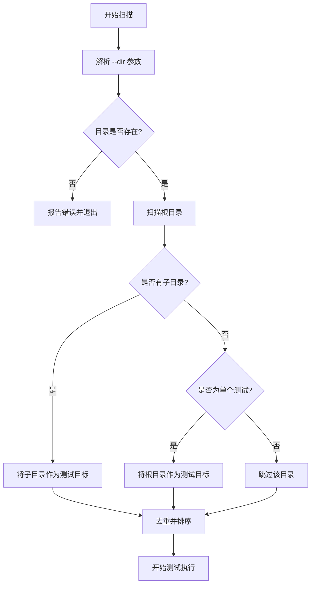
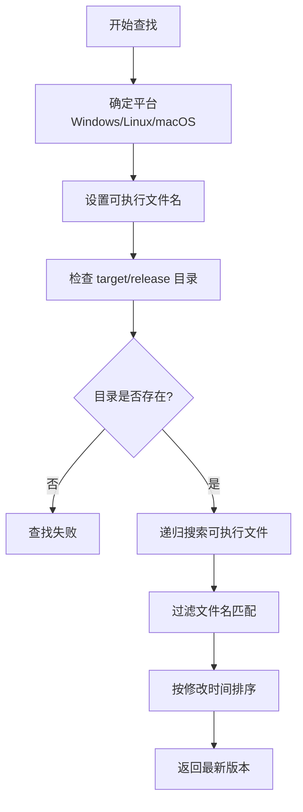
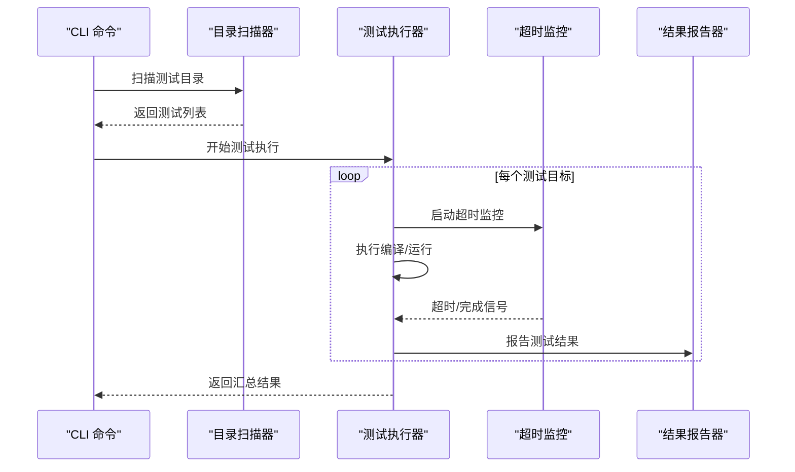
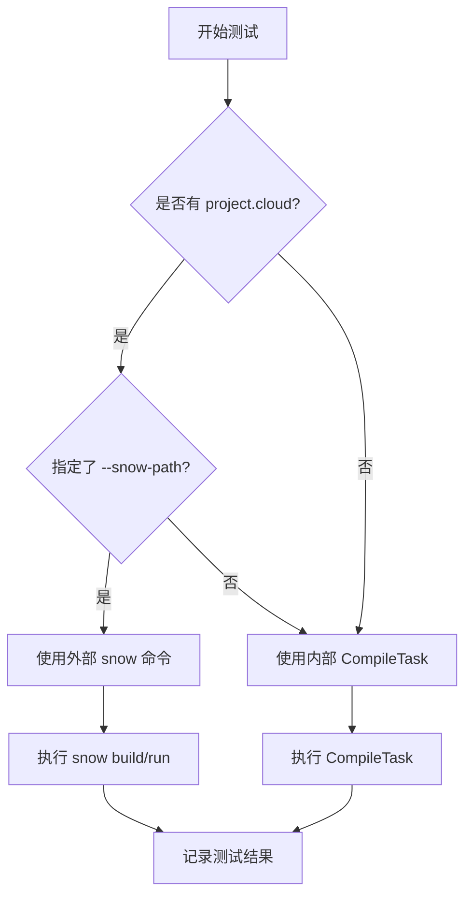
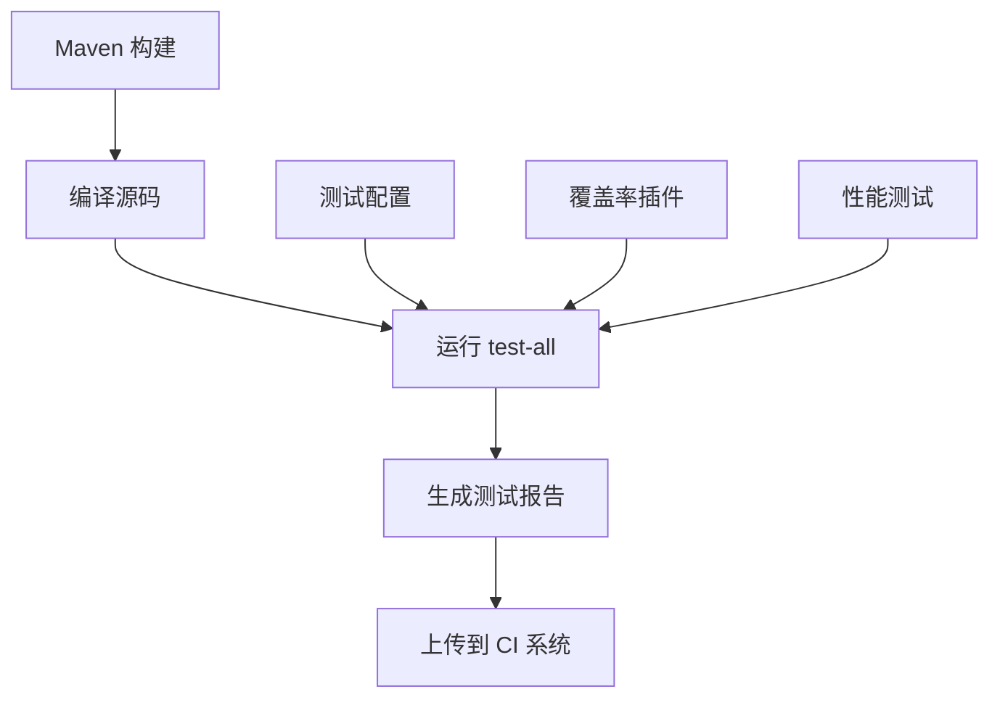
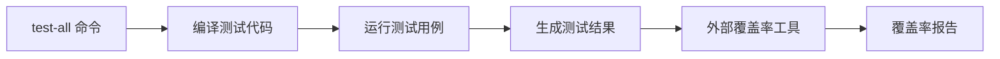
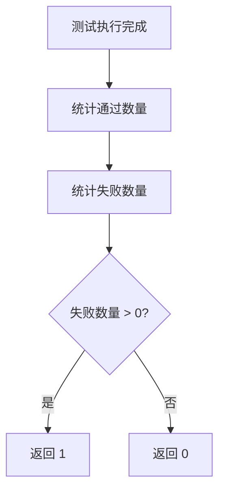

# test-all 命令详细文档

<cite>
**本文档引用的文件**
- [TestAllCommand.java](file://src/main/java/org/jcnc/snow/cli/commands/TestAllCommand.java)
- [README.md](file://README.md)
- [pom.xml](file://pom.xml)
- [playground/Test/README.md](file://playground/Test/README.md)
- [playground/PerformanceTest/PERFORMANCE_TESTING_GUIDE.md](file://playground/PerformanceTest/PERFORMANCE_TESTING_GUIDE.md)
</cite>

## 目录
1. [概述](#概述)
2. [命令语法与参数](#命令语法与参数)
3. [测试发现机制](#测试发现机制)
4. [执行模式](#执行模式)
5. [结果报告格式](#结果报告格式)
6. [使用示例](#使用示例)
7. [测试框架集成](#测试框架集成)
8. [覆盖率数据收集](#覆盖率数据收集)
9. [退出码说明](#退出码说明)
10. [CI 系统集成](#ci-系统集成)
11. [故障排除](#故障排除)

## 概述

`test-all` 命令是 Snow 编译器项目的核心测试工具，用于批量编译和运行项目中的所有示例工程。该命令支持多种测试场景，包括单元测试、集成测试和性能测试，能够有效验证编译器的各个组件是否正常工作。

### 主要特性

- **批量测试**：同时测试多个目录下的示例工程
- **灵活配置**：支持多种命令行参数定制测试行为
- **超时控制**：防止测试用例无限期挂起
- **中断支持**：运行时可随时跳过当前测试
- **详细报告**：提供丰富的测试结果信息
- **外部集成**：支持使用外部 snow 可执行文件

## 命令语法与参数

### 基本语法

```bash
snow test-all [options]
```

### 参数说明

| 参数 | 描述 | 默认值 |
|------|------|--------|
| `--dir=<path>` | 指定要测试的根目录，可重复使用 | `playground/Demo/DemoA` |
| `--no-run` | 仅编译不运行测试 | 关闭 |
| `--verbose` | 输出详细测试信息 | 关闭 |
| `--stop-on-failure` | 首次失败/异常时立即终止 | 关闭 |
| `--timeout=<ms>` | 单个 Demo 的最大执行时间（毫秒） | 2000 |
| `--snow-path=<path\|auto>` | 指定 snow 可执行文件路径 | 内部 CompileTask |

### 使用示例

```bash
# 基本用法
snow test-all

# 指定多个测试目录
snow test-all --dir=playground/Demo/DemoA --dir=playground/Demo/DemoB

# 详细输出模式
snow test-all --verbose

# 仅编译不运行
snow test-all --no-run

# 设置超时时间为5秒
snow test-all --timeout=5000

# 使用外部 snow 可执行文件
snow test-all --snow-path=/usr/local/bin/snow

# 自动查找 snow 可执行文件
snow test-all --snow-path=auto
```

**章节来源**
- [TestAllCommand.java](file://src/main/java/org/jcnc/snow/cli/commands/TestAllCommand.java#L130-L150)

## 测试发现机制

### 目录扫描策略

`test-all` 命令采用智能的测试发现机制，能够自动识别和处理不同类型的测试目录：



**图表来源**
- [TestAllCommand.java](file://src/main/java/org/jcnc/snow/cli/commands/TestAllCommand.java#L209-L261)

### 测试目标识别

系统通过以下规则识别有效的测试目标：

1. **project.cloud 存在**：检查目录下是否存在 `project.cloud` 文件
2. **project.snow 存在**：检查是否存在 `project.snow` 文件  
3. **src 目录存在**：检查是否存在 `src/` 源码目录

只有满足以上任一条件的目录才会被识别为有效的测试目标。

### 外部 snow 可执行文件检测

当使用 `--snow-path=auto` 时，系统会自动在以下位置查找 snow 可执行文件：



**图表来源**
- [TestAllCommand.java](file://src/main/java/org/jcnc/snow/cli/commands/TestAllCommand.java#L92-L115)

**章节来源**
- [TestAllCommand.java](file://src/main/java/org/jcnc/snow/cli/commands/TestAllCommand.java#L209-L261)

## 执行模式

### 串行执行

`test-all` 命令采用串行执行模式，确保测试的稳定性和可重现性：



**图表来源**
- [TestAllCommand.java](file://src/main/java/org/jcnc/snow/cli/commands/TestAllCommand.java#L289-L428)

### 并行控制

虽然采用串行执行，但系统在以下方面进行了优化：

1. **输入监听线程**：后台监听键盘输入，支持随时跳过测试
2. **异步任务执行**：使用 `ExecutorService` 管理测试任务
3. **超时机制**：每个测试都有独立的超时控制

### 测试模式选择

系统根据测试目标的特点自动选择合适的执行模式：



**图表来源**
- [TestAllCommand.java](file://src/main/java/org/jcnc/snow/cli/commands/TestAllCommand.java#L317-L342)

**章节来源**
- [TestAllCommand.java](file://src/main/java/org/jcnc/snow/cli/commands/TestAllCommand.java#L289-L428)

## 结果报告格式

### 输出样式

`test-all` 命令提供了丰富的输出样式，支持简洁模式和详细模式：

#### 简洁模式输出

```
Found 5 demo directories from 1 root paths. Starting tests...

Timeout per demo: 2000 ms
[提示] 测试进行时可随时按 [Enter] 跳过当前 demo

....F?S
```

#### 详细模式输出

```
Found 5 demo directories from 1 root paths. Starting tests...

Timeout per demo: 2000 ms
[提示] 测试进行时可随时按 [Enter] 跳过当前 demo

Testing DemoA (/path/to/DemoA)...
✓ DemoA PASSED
Testing DemoB (/path/to/DemoB)...
✗ DemoB FAILED (exit=1)
Testing DemoC (/path/to/DemoC)...
? DemoC TIMEOUT > 2000ms
Testing DemoD (/path/to/DemoD)...
! DemoD SKIPPED by Enter
```

### 状态标识符

| 标识符 | 含义 | 颜色 |
|--------|------|------|
| `.` | 测试通过 | 绿色 |
| `F` | 测试失败 | 红色 |
| `?` | 测试超时 | 黄色 |
| `S` | 被用户跳过 | 黄色 |
| `E` | 异常错误 | 红色 |

### 汇总报告

测试完成后，系统会生成详细的汇总报告：

```
=== Test Summary ===
Passed: 3
Failed: 2
Total:  5

Failed tests:
  - DemoB (exit=1)
  - DemoC (Timeout > 2000ms)
  - DemoE (Exception: ...)
```

**章节来源**
- [TestAllCommand.java](file://src/main/java/org/jcnc/snow/cli/commands/TestAllCommand.java#L429-L459)

## 使用示例

### 基本测试

```bash
# 运行默认的 Demo 测试
snow test-all

# 运行特定目录的测试
snow test-all --dir=playground/Demo/DemoA
```

### 详细测试

```bash
# 详细输出模式
snow test-all --verbose

# 详细输出并显示跳过的测试
snow test-all --verbose --dir=playground/Test
```

### 性能测试

```bash
# 设置较长的超时时间
snow test-all --timeout=10000 --dir=playground/PerformanceTest

# 仅编译不运行
snow test-all --no-run --dir=playground/Demo
```

### 多目录测试

```bash
# 测试多个不同的目录
snow test-all \
  --dir=playground/Demo/DemoA \
  --dir=playground/Demo/DemoB \
  --dir=playground/Test/basic_tests \
  --dir=playground/Test/advanced_tests
```

### 外部 snow 集成

```bash
# 使用外部 snow 可执行文件
snow test-all --snow-path=/usr/local/bin/snow

# 自动查找 snow 可执行文件
snow test-all --snow-path=auto
```

### 调试模式

```bash
# 首次失败时停止
snow test-all --stop-on-failure --verbose

# 快速跳过测试
# 在测试进行时按下 Enter 键
```

**章节来源**
- [TestAllCommand.java](file://src/main/java/org/jcnc/snow/cli/commands/TestAllCommand.java#L130-L150)

## 测试框架集成

### 与 Maven 的集成

虽然 Snow 项目主要使用自定义的测试框架，但它与 Maven 构建系统紧密集成：



### 项目配置文件

测试框架支持以下配置文件：

1. **project.cloud**：项目配置文件，用于集成编译模式
2. **project.snow**：单文件项目配置
3. **标准目录结构**：包含 `src/` 源码目录

### 测试分类

基于 playground 目录结构，测试可以分为以下类别：

| 类别 | 目录 | 描述 |
|------|------|------|
| 基础测试 | `playground/Test/basic_tests/` | 基本语法特性测试 |
| 高级测试 | `playground/Test/advanced_tests/` | 高级语言特性测试 |
| 综合测试 | `playground/Test/comprehensive_tests/` | 全面的功能测试 |
| 性能测试 | `playground/PerformanceTest/` | 性能基准测试 |

**章节来源**
- [playground/Test/README.md](file://playground/Test/README.md#L1-L40)
- [playground/PerformanceTest/PERFORMANCE_TESTING_GUIDE.md](file://playground/PerformanceTest/PERFORMANCE_TESTING_GUIDE.md#L174-L174)

## 覆盖率数据收集

### 当前实现

虽然 `test-all` 命令本身不直接提供覆盖率数据收集功能，但它支持与外部覆盖率工具的集成：



### 集成建议

1. **JaCoCo 集成**：可以通过 Maven JaCoCo 插件收集覆盖率数据
2. **自定义标记**：在测试代码中添加覆盖率标记注释
3. **报告生成**：结合 CI 系统生成 HTML 或 XML 格式的覆盖率报告

### 覆盖率指标

理想的覆盖率指标包括：

- **行覆盖率**：执行的代码行数占总行数的比例
- **分支覆盖率**：执行的分支数占总分支数的比例
- **方法覆盖率**：执行的方法数占总方法数的比例
- **类覆盖率**：测试覆盖的类数占总类数的比例

## 退出码说明

### 退出码含义

`test-all` 命令使用标准的 Unix 退出码来表示测试结果：

| 退出码 | 含义 | 描述 |
|--------|------|------|
| `0` | 成功 | 所有测试用例均通过 |
| `1` | 失败 | 存在至少一个失败的测试用例 |
| `其他` | 错误 | 命令执行过程中发生错误 |

### 退出码生成逻辑



**图表来源**
- [TestAllCommand.java](file://src/main/java/org/jcnc/snow/cli/commands/TestAllCommand.java#L459-L463)

### 退出码使用场景

1. **CI/CD 集成**：CI 系统可以根据退出码判断构建是否成功
2. **脚本控制**：在 shell 脚本中根据退出码决定后续操作
3. **自动化测试**：与其他测试工具配合使用

**章节来源**
- [TestAllCommand.java](file://src/main/java/org/jcnc/snow/cli/commands/TestAllCommand.java#L459-L463)

## CI 系统集成

### 支持的 CI 平台

`test-all` 命令设计时充分考虑了 CI/CD 环境的需求，支持以下主流 CI 平台：

1. **GitHub Actions**
2. **GitLab CI**
3. **Jenkins**
4. **Azure DevOps**
5. **Travis CI**

### CI 集成配置

#### GitHub Actions 示例

```yaml
name: Snow Tests
on: [push, pull_request]
jobs:
  test:
    runs-on: ubuntu-latest
    steps:
    - uses: actions/checkout@v2
    - name: Setup Java
      uses: actions/setup-java@v2
      with:
        java-version: '25'
        distribution: 'temurin'
    - name: Run tests
      run: |
        ./mvnw clean test
        snow test-all --verbose
    - name: Upload test results
      uses: actions/upload-artifact@v2
      if: always()
      with:
        name: test-results
        path: target/test-results/
```

#### Jenkins Pipeline 示例

```groovy
pipeline {
    agent any
    stages {
        stage('Test') {
            steps {
                sh './mvnw clean test'
                sh 'snow test-all --timeout=30000 --verbose'
            }
            post {
                always {
                    publishTestResults '**/TEST-*.xml'
                }
            }
        }
    }
    post {
        failure {
            echo '测试失败，检查测试报告'
        }
    }
}
```

### CI 最佳实践

1. **并行执行**：在 CI 环境中可以并行运行多个测试套件
2. **超时设置**：合理设置测试超时时间，避免长时间挂起
3. **结果报告**：上传测试结果和覆盖率报告
4. **失败通知**：测试失败时及时通知开发团队
5. **历史对比**：比较当前测试结果与历史数据

### 性能优化

在 CI 环境中，可以通过以下方式优化测试性能：

```bash
# 使用外部 snow 可执行文件加速
snow test-all --snow-path=auto --timeout=10000

# 仅编译不运行以快速验证
snow test-all --no-run

# 跳过耗时的测试
snow test-all --dir=playground/Demo/DemoA
```

**章节来源**
- [TestAllCommand.java](file://src/main/java/org/jcnc/snow/cli/commands/TestAllCommand.java#L130-L150)

## 故障排除

### 常见问题

#### 1. 目录不存在错误

**问题**：`Demo directory not found: /path/to/directory`

**原因**：指定的测试目录不存在

**解决方案**：
```bash
# 检查目录是否存在
ls -la /path/to/directory

# 使用正确的默认目录
snow test-all
```

#### 2. 外部 snow 可执行文件找不到

**问题**：`Specified snow executable not found`

**原因****：指定的 snow 可执行文件路径无效

**解决方案**：
```bash
# 检查可执行文件权限
ls -la /path/to/snow

# 使用 auto 模式自动查找
snow test-all --snow-path=auto

# 或使用内部编译器
snow test-all --no-run
```

#### 3. 测试超时

**问题**：测试用例超时退出

**原因**：测试用例执行时间超过设定的超时限制

**解决方案**：
```bash
# 增加超时时间
snow test-all --timeout=10000

# 跳过耗时的测试
# 在测试进行时按下 Enter 键
```

#### 4. 权限问题

**问题**：无法执行 snow 可执行文件

**原因**：可执行文件缺少执行权限

**解决方案**：
```bash
# 添加执行权限
chmod +x /path/to/snow

# 或使用内部编译器
snow test-all --no-run
```

### 调试技巧

#### 1. 详细模式调试

```bash
# 启用详细输出
snow test-all --verbose

# 查看详细的测试过程
snow test-all --verbose --stop-on-failure
```

#### 2. 分步调试

```bash
# 仅编译不运行
snow test-all --no-run --verbose

# 单独测试某个目录
snow test-all --dir=path/to/test --verbose
```

#### 3. 环境诊断

```bash
# 检查 Java 环境
java -version
javac -version

# 检查 snow 可执行文件
which snow
snow --version

# 检查项目结构
find . -name "*.snow" -o -name "project.cloud" | head -20
```

### 日志分析

#### 测试失败分析

当测试失败时，系统会提供详细的错误信息：

```
✗ DemoB FAILED (exit=1)
  Failed tests:
    - DemoB (exit=1)
```

#### 性能问题诊断

```bash
# 监控测试性能
time snow test-all --timeout=30000

# 分析单个测试的性能
cd path/to/test && time snow compile run
```

### 支持资源

1. **官方文档**：查阅 Snow 语言的完整文档
2. **社区支持**：在 GitHub Issues 中寻求帮助
3. **示例代码**：参考 playground 目录中的示例
4. **性能测试指南**：阅读性能测试相关文档

**章节来源**
- [TestAllCommand.java](file://src/main/java/org/jcnc/snow/cli/commands/TestAllCommand.java#L177-L208)
- [TestAllCommand.java](file://src/main/java/org/jcnc/snow/cli/commands/TestAllCommand.java#L395-L428)