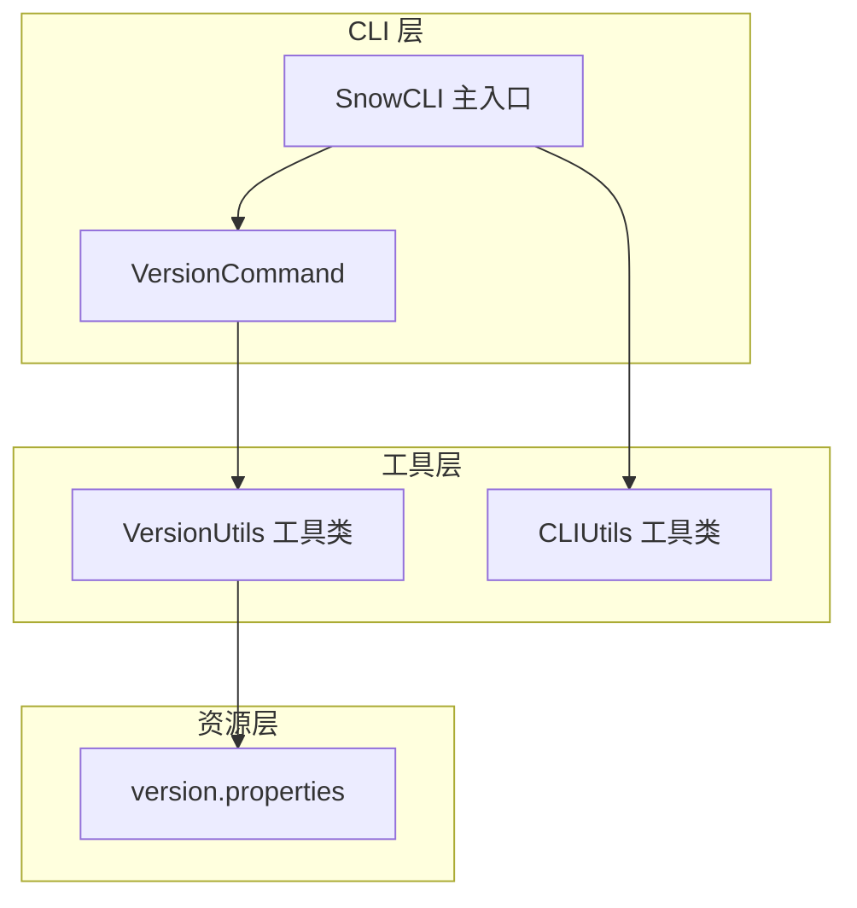
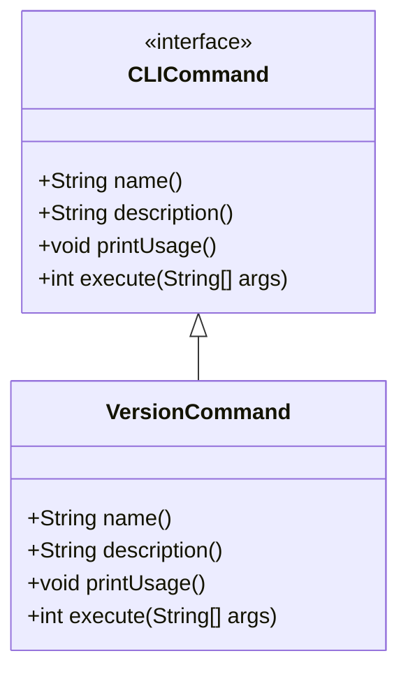
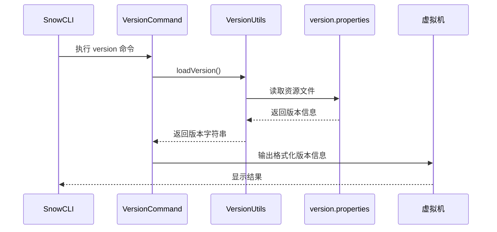
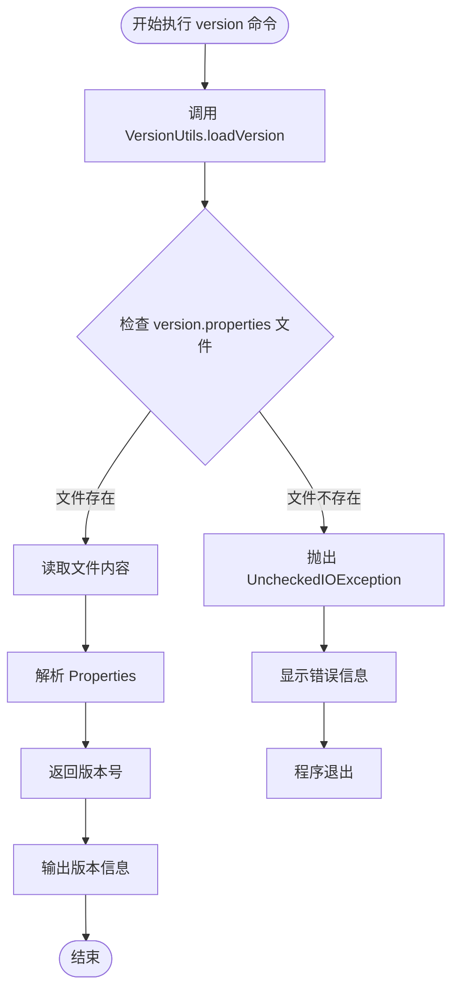

# version 命令

<cite>
**本文档引用的文件**
- [VersionCommand.java](file://src/main/java/org/jcnc/snow/cli/commands/VersionCommand.java)
- [SnowCLI.java](file://src/main/java/org/jcnc/snow/cli/SnowCLI.java)
- [VersionUtils.java](file://src/main/java/org/jcnc/snow/cli/utils/VersionUtils.java)
- [CLIUtils.java](file://src/main/java/org/jcnc/snow/cli/utils/CLIUtils.java)
- [version.properties](file://src/main/resources/version.properties)
- [README.md](file://README.md)
</cite>

## 目录
1. [简介](#简介)
2. [命令功能](#命令功能)
3. [使用方法](#使用方法)
4. [输出格式](#输出格式)
5. [技术实现](#技术实现)
6. [实际使用示例](#实际使用示例)
7. [错误处理](#错误处理)
8. [应用场景](#应用场景)
9. [故障排除](#故障排除)
10. [总结](#总结)

## 简介

Snow 编程语言的 `version` 命令是一个专门用于显示当前 Snow 工具版本号的 CLI 子命令。该命令提供了简洁明了的版本信息输出功能，帮助用户快速确认 Snow 工具的安装状态和版本兼容性。

## 命令功能

`version` 命令的主要功能包括：

- **版本信息显示**：输出 Snow 编程语言的当前版本号
- **格式化输出**：提供标准的版本号格式化显示
- **无参数调用**：支持直接调用，无需额外参数
- **全局访问**：可在任何位置通过 `snow version` 快速访问

## 使用方法

### 基本语法

```bash
snow version
```

### 参数说明

该命令不接受任何参数，直接执行即可。

## 输出格式

`version` 命令的标准输出格式为：

```
snow version "X.X.X"
```

其中：
- `snow`：标识 Snow 编程语言
- `version`：版本信息标识符
- `"X.X.X"`：具体的版本号，采用主版本号.次版本号.修订号的格式

### 示例输出

```bash
$ snow version
snow version "1.0.0"
```

## 技术实现

### 架构概览



**图表来源**
- [SnowCLI.java](file://src/main/java/org/jcnc/snow/cli/SnowCLI.java#L1-L99)
- [VersionCommand.java](file://src/main/java/org/jcnc/snow/cli/commands/VersionCommand.java#L1-L60)
- [VersionUtils.java](file://src/main/java/org/jcnc/snow/cli/utils/VersionUtils.java#L1-L42)

### 核心组件分析

#### 1. VersionCommand 类

`VersionCommand` 是 `version` 命令的具体实现，继承自 `CLICommand` 接口：



**图表来源**
- [VersionCommand.java](file://src/main/java/org/jcnc/snow/cli/commands/VersionCommand.java#L15-L60)

#### 2. 版本信息加载机制



**图表来源**
- [SnowCLI.java](file://src/main/java/org/jcnc/snow/cli/SnowCLI.java#L20-L21)
- [VersionCommand.java](file://src/main/java/org/jcnc/snow/cli/commands/VersionCommand.java#L48-L51)
- [VersionUtils.java](file://src/main/java/org/jcnc/snow/cli/utils/VersionUtils.java#L30-L41)

**章节来源**
- [VersionCommand.java](file://src/main/java/org/jcnc/snow/cli/commands/VersionCommand.java#L1-L60)
- [VersionUtils.java](file://src/main/java/org/jcnc/snow/cli/utils/VersionUtils.java#L1-L42)
- [SnowCLI.java](file://src/main/java/org/jcnc/snow/cli/SnowCLI.java#L1-L99)

## 实际使用示例

### 基本使用场景

1. **检查安装状态**
   ```bash
   $ snow version
   snow version "1.0.0"
   ```

2. **验证版本兼容性**
   ```bash
   $ snow version
   snow version "1.0.0"
   
   # 对比不同环境的版本
   $ ssh remote-server "snow version"
   snow version "1.0.0"
   ```

3. **脚本自动化**
   ```bash
   # 在部署脚本中检查版本
   if [ "$(snow version)" = "snow version \"1.0.0\"" ]; then
       echo "版本验证通过"
   else
       echo "版本不匹配"
       exit 1
   fi
   ```

### 开发环境验证

```bash
# 开发环境初始化时验证
$ cd my-snow-project
$ snow version
snow version "1.0.0"

# 确认项目使用的 Snow 版本
$ cat project.cloud | grep snow-version
```

### 生产环境监控

```bash
# 监控生产环境中 Snow 版本的一致性
$ for server in server1 server2 server3; do
    echo "服务器 $server:"
    ssh $server "snow version"
done
```

## 错误处理

### 版本文件缺失

当 `version.properties` 文件不存在时，系统会抛出异常：



**图表来源**
- [VersionUtils.java](file://src/main/java/org/jcnc/snow/cli/utils/VersionUtils.java#L30-L41)

### 异常情况处理

1. **文件读取失败**
   - 当 `version.properties` 文件无法读取时，系统会抛出 `UncheckedIOException`
   - 错误信息格式：`Failed to load version from /version.properties`

2. **版本号格式错误**
   - 如果 `version.properties` 文件中缺少 `snow.version` 属性
   - 系统会返回空字符串或默认值

**章节来源**
- [VersionUtils.java](file://src/main/java/org/jcnc/snow/cli/utils/VersionUtils.java#L30-L41)

## 应用场景

### 开发阶段

1. **版本验证**
   - 确认编译器版本是否符合项目要求
   - 验证不同开发环境的一致性

2. **调试辅助**
   - 在调试过程中确认使用的 Snow 版本
   - 识别版本相关的兼容性问题

3. **构建脚本**
   - 自动化构建过程中检查版本
   - 条件性执行基于版本的构建步骤

### 部署阶段

1. **环境一致性检查**
   - 验证生产环境与开发环境的版本一致性
   - 确保部署的 Snow 版本符合要求

2. **版本回滚**
   - 在出现问题时快速确认当前版本
   - 辅助版本回滚决策

3. **运维监控**
   - 定期检查系统中 Snow 版本的状态
   - 监控版本升级的进度

### 用户支持

1. **问题诊断**
   - 收集用户报告的问题时确认版本信息
   - 帮助定位版本相关的 bug

2. **文档参考**
   - 在文档中引用特定版本的功能
   - 确保文档与实际版本一致

## 故障排除

### 常见问题及解决方案

1. **版本信息为空**
   ```
   问题：snow version 输出为空
   解决方案：
   - 检查 Snow 是否正确安装
   - 验证 version.properties 文件是否存在
   - 查看是否有权限访问资源文件
   ```

2. **版本号格式错误**
   ```
   问题：输出的版本号格式不正确
   解决方案：
   - 检查 version.properties 文件内容
   - 确认文件编码格式（推荐 UTF-8）
   - 验证 Maven 构建过程是否正确替换 ${project.version}
   ```

3. **权限问题**
   ```
   问题：无法读取版本信息
   解决方案：
   - 检查文件权限设置
   - 确认 JVM 有足够的权限访问资源文件
   - 验证 CLASSPATH 设置是否正确
   ```

### 调试技巧

1. **直接检查资源文件**
   ```bash
   # 检查资源文件是否存在
   jar tf snow.jar | grep version.properties
   
   # 直接查看文件内容
   unzip -p snow.jar version.properties
   ```

2. **验证版本加载**
   ```bash
   # 使用 Java 命令直接测试版本加载
   java -cp snow.jar org.jcnc.snow.cli.utils.VersionUtils
   ```

**章节来源**
- [VersionUtils.java](file://src/main/java/org/jcnc/snow/cli/utils/VersionUtils.java#L30-L41)

## 总结

Snow 编程语言的 `version` 命令是一个设计精良的工具，具有以下特点：

### 优势

1. **简洁性**：仅需一个命令即可获取版本信息
2. **一致性**：提供统一的版本信息格式
3. **可靠性**：从资源文件中可靠地读取版本信息
4. **易用性**：无需参数，易于记忆和使用

### 最佳实践

1. **定期验证**：在关键操作前验证 Snow 版本
2. **文档记录**：在项目文档中标明所需的 Snow 版本
3. **自动化集成**：在 CI/CD 流程中包含版本检查步骤
4. **环境同步**：确保开发、测试、生产环境的版本一致性

### 发展方向

随着 Snow 语言的不断发展，`version` 命令可能会扩展更多功能，如：
- 支持版本比较操作
- 提供更详细的版本信息（构建时间、提交哈希等）
- 支持版本历史查询

通过这个简洁而强大的命令，用户可以轻松掌握 Snow 编程语言的版本状态，为开发和部署工作提供重要保障。