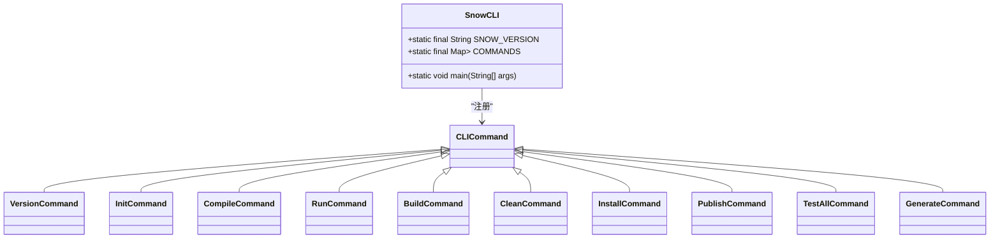

# 命令行参考

<cite>
**本文档引用的文件**   
- [SnowCLI.java](file://src/main/java/org/jcnc/snow/cli/SnowCLI.java)
- [CLICommand.java](file://src/main/java/org/jcnc/snow/cli/api/CLICommand.java)
- [VersionCommand.java](file://src/main/java/org/jcnc/snow/cli/commands/VersionCommand.java)
- [InitCommand.java](file://src/main/java/org/jcnc/snow/cli/commands/InitCommand.java)
- [CompileCommand.java](file://src/main/java/org/jcnc/snow/cli/commands/CompileCommand.java)
- [RunCommand.java](file://src/main/java/org/jcnc/snow/cli/commands/RunCommand.java)
- [BuildCommand.java](file://src/main/java/org/jcnc/snow/cli/commands/BuildCommand.java)
- [CleanCommand.java](file://src/main/java/org/jcnc/snow/cli/commands/CleanCommand.java)
- [InstallCommand.java](file://src/main/java/org/jcnc/snow/cli/commands/InstallCommand.java)
- [PublishCommand.java](file://src/main/java/org/jcnc/snow/cli/commands/PublishCommand.java)
- [TestAllCommand.java](file://src/main/java/org/jcnc/snow/cli/commands/TestAllCommand.java)
- [GenerateCommand.java](file://src/main/java/org/jcnc/snow/cli/commands/GenerateCommand.java)
- [CLIUtils.java](file://src/main/java/org/jcnc/snow/cli/utils/CLIUtils.java)
- [ProjectCloudExample.java](file://src/main/java/org/jcnc/snow/cli/utils/ProjectCloudExample.java)
- [version.properties](file://src/main/resources/version.properties)
</cite>

## 目录
1. [简介](#简介)
2. [命令概览](#命令概览)
3. [命令详解](#命令详解)
   - [version](#version)
   - [init](#init)
   - [generate](#generate)
   - [compile](#compile)
   - [run](#run)
   - [build](#build)
   - [clean](#clean)
   - [install](#install)
   - [publish](#publish)
   - [test-all](#test-all)
4. [工作流集成](#工作流集成)
5. [退出码与错误处理](#退出码与错误处理)
6. [扩展机制](#扩展机制)

## 简介

Snow命令行工具（CLI）是Snow编程语言的核心交互接口，提供了一套完整的命令集，用于项目初始化、编译、运行、构建和测试等全生命周期管理。该工具设计简洁，遵循`snow <command> [options]`的通用语法，支持全局选项和命令特定选项。

**命令行入口**
Snow CLI的主入口是`SnowCLI`类，它负责解析命令行参数、调度子命令并处理全局帮助和版本请求。所有子命令都实现了`CLICommand`接口，确保了统一的执行模式和错误处理。


**命令源**
- [SnowCLI.java](file://src/main/java/org/jcnc/snow/cli/SnowCLI.java#L1-L98)
- [CLICommand.java](file://src/main/java/org/jcnc/snow/cli/api/CLICommand.java#L1-L47)

## 命令概览

Snow CLI提供了以下核心命令，覆盖了从项目创建到发布的完整工作流。

| 命令 | 描述 |
| :--- | :--- |
| `version` | 打印Snow工具的版本号 |
| `init` | 初始化新项目，生成`project.cloud`配置文件 |
| `generate` | 根据`project.cloud`文件生成项目目录结构 |
| `compile` | 将`.snow`源文件编译成虚拟机字节码（`.water`） |
| `run` | 运行已编译的`.water`字节码文件 |
| `build` | 构建项目，依次执行依赖解析、编译和打包 |
| `clean` | 清理构建输出和本地缓存 |
| `install` | 解析并下载项目依赖到本地缓存 |
| `publish` | 将构建好的包发布到远程仓库 |
| `test-all` | 编译并运行指定目录下的所有示例工程 |

**命令注册**
所有命令都在`SnowCLI`类的`COMMANDS`静态映射中注册，通过命令名进行调度。



**命令源**
- [SnowCLI.java](file://src/main/java/org/jcnc/snow/cli/SnowCLI.java#L30-L45)

## 命令详解

### version

`version`命令用于输出当前Snow工具的版本信息，是诊断环境和确认兼容性的基础命令。

#### 语法
```bash
snow version
```

#### 参数与选项
此命令无参数和选项。

#### 使用示例
```bash
$ snow version
snow version "v0.11.0"
```

#### 输出说明
命令执行后，会直接输出版本号，格式为`snow version "<version>"`。版本号从`src/main/resources/version.properties`文件中加载。

#### 工作流程
1. 调用`VersionUtils.loadVersion()`从资源文件读取版本号。
2. 将版本号格式化并输出到标准输出。


**命令源**
- [VersionCommand.java](file://src/main/java/org/jcnc/snow/cli/commands/VersionCommand.java#L1-L59)
- [VersionUtils.java](file://src/main/java/org/jcnc/snow/cli/utils/VersionUtils.java#L1-L41)
- [version.properties](file://src/main/resources/version.properties#L1-L1)

### init

`init`命令用于初始化一个新的Snow项目，快速生成`project.cloud`配置文件。

#### 语法
```bash
snow init
```

#### 参数与选项
此命令无参数和选项。

#### 使用示例
```bash
$ snow init
[init] created /path/to/project/project.cloud
```

如果`project.cloud`文件已存在：
```bash
$ snow init
[init] project.cloud already exists
```

#### 输出说明
- 成功：输出创建的文件路径。
- 失败：如果文件已存在，输出提示信息。

#### 工作流程
1. 检查当前目录下是否存在`project.cloud`文件。
2. 如果不存在，则从`ProjectCloudExample`获取示例配置内容并写入文件。
3. 如果已存在，则输出提示信息。


**命令源**
- [InitCommand.java](file://src/main/java/org/jcnc/snow/cli/commands/InitCommand.java#L1-L71)
- [ProjectCloudExample.java](file://src/main/java/org/jcnc/snow/cli/utils/ProjectCloudExample.java)

### generate

`generate`命令根据`project.cloud`文件中的配置，自动生成项目的目录结构。

#### 语法
```bash
snow generate
```

#### 参数与选项
此命令无参数和选项。

#### 使用示例
```bash
$ snow generate
```
执行成功后，会根据`project.cloud`中的配置创建相应的目录和文件。

#### 输出说明
- 成功：无输出或由`GenerateTask`输出创建的文件。
- 失败：如果`project.cloud`文件不存在，会输出错误信息并返回退出码1。

#### 工作流程
1. 检查`project.cloud`文件是否存在。
2. 如果不存在，输出错误信息并退出。
3. 如果存在，使用`CloudDSLParser`解析文件。
4. 通过`LifecycleManager`在`INIT`阶段执行`GenerateTask`来生成目录结构。

**命令源**
- [GenerateCommand.java](file://src/main/java/org/jcnc/snow/cli/commands/GenerateCommand.java#L1-L87)

### compile

`compile`命令将Snow源代码编译为虚拟机字节码（`.water`文件），支持两种工作模式：Cloud模式和Local模式。

#### 语法
```bash
# Cloud 模式 (使用 project.cloud)
snow compile [run]

# Local 模式 (传统模式)
snow compile [run] [-o <name>] [-d <srcDir>] [file1.snow …]
```

#### 参数与选项
- `run`: 编译后立即运行生成的字节码。
- `-o <name>`: 指定输出文件名（不带`.water`后缀）。
- `-d <srcDir>`: 指定源码目录。

#### 使用示例
**Cloud模式：**
```bash
$ snow compile
```
此命令会读取`project.cloud`文件，自动获取源码目录和输出名称。

**Local模式：**
```bash
$ snow compile -d src -o myapp main.snow utils.snow
```
此命令会编译`src`目录下的`main.snow`和`utils.snow`文件，并输出为`myapp.water`。

#### 输出说明
编译过程会输出AST、IR和VM字节码等中间表示。如果使用`run`参数，还会在编译后立即执行程序。

#### 工作流程
1. 检查`project.cloud`文件是否存在。
2. **Cloud模式**：解析`project.cloud`，提取`srcDir`和`output`等配置，构建内部编译参数。
3. **Local模式**：直接使用用户提供的命令行参数。
4. 将最终参数传递给`CompileTask`执行实际编译。


**命令源**
- [CompileCommand.java](file://src/main/java/org/jcnc/snow/cli/commands/CompileCommand.java#L1-L92)

### run

`run`命令用于执行已编译的`.water`字节码文件。

#### 语法
```bash
snow run <program.water>
```

#### 参数与选项
- `<program.water>`: 必需，指定要运行的字节码文件路径。

#### 使用示例
```bash
$ snow run target/myapp.water
=== Launching VM ===
...
=== VM exited ===
```

#### 输出说明
命令会启动Snow虚拟机（SnowVM），加载并执行指定的字节码文件。执行过程中的输出（如`stdout`）会直接打印到终端。

#### 工作流程
1. 检查是否提供了字节码文件路径。
2. 如果未提供，打印用法信息并返回退出码1。
3. 创建`RunTask`实例并执行。


**命令源**
- [RunCommand.java](file://src/main/java/org/jcnc/snow/cli/commands/RunCommand.java#L1-L66)

### build

`build`命令执行完整的项目构建流程，包括依赖解析、编译和打包。

#### 语法
```bash
snow build
```

#### 参数与选项
此命令无参数和选项。

#### 使用示例
```bash
$ snow build
```
此命令会依次执行依赖解析、编译和打包三个阶段。

#### 输出说明
命令会输出每个阶段的执行日志。成功时无错误信息，失败时会输出具体的错误原因。

#### 工作流程
1. 解析`project.cloud`文件获取项目配置。
2. 创建`DependencyResolver`用于解析依赖。
3. 创建`LifecycleManager`并注册三个阶段的任务：
   - `RESOLVE_DEPENDENCIES`: 执行依赖解析。
   - `COMPILE`: 执行`CompileTask`。
   - `PACKAGE`: 执行`PackageTask`。
4. 按顺序执行所有注册的生命周期阶段。

**命令源**
- [BuildCommand.java](file://src/main/java/org/jcnc/snow/cli/commands/BuildCommand.java#L1-L86)

### clean

`clean`命令用于清理项目构建产生的中间文件和缓存。

#### 语法
```bash
snow clean
```

#### 参数与选项
此命令无参数和选项。

#### 使用示例
```bash
$ snow clean
```
执行后，`build`、`dist`等目录将被删除。

#### 输出说明
命令执行成功时通常无输出，失败时会抛出异常。

#### 工作流程
1. 创建`LifecycleManager`。
2. 在`CLEAN`阶段注册`CleanTask`。
3. 执行所有生命周期阶段（即执行清理任务）。

**命令源**
- [CleanCommand.java](file://src/main/java/org/jcnc/snow/cli/commands/CleanCommand.java#L1-L63)

### install

`install`命令用于解析并下载项目的所有依赖到本地缓存。

#### 语法
```bash
snow install
```

#### 参数与选项
此命令无参数和选项。

#### 使用示例
```bash
$ snow install
```
此命令会读取`project.cloud`文件，解析`dependencies`区块，并将依赖下载到`~/.snow/cache`目录。

#### 输出说明
命令会输出依赖解析和下载的进度信息。

#### 工作流程
1. 解析`project.cloud`文件。
2. 创建`DependencyResolver`，指定本地缓存路径（`~/.snow/cache`）。
3. 调用`resolver.resolve(project)`执行依赖解析和下载。

**命令源**
- [InstallCommand.java](file://src/main/java/org/jcnc/snow/cli/commands/InstallCommand.java#L1-L65)

### publish

`publish`命令将构建好的项目包发布到远程仓库。

#### 语法
```bash
snow publish
```

#### 参数与选项
此命令无参数和选项。

#### 使用示例
```bash
$ snow publish
```
此命令会执行发布生命周期阶段的任务。

#### 输出说明
命令会输出发布过程的日志，包括与远程仓库的通信状态。

#### 工作流程
1. 解析`project.cloud`文件。
2. 创建`LifecycleManager`。
3. 在`PUBLISH`阶段注册`PublishTask`。
4. 执行所有生命周期阶段。

**命令源**
- [PublishCommand.java](file://src/main/java/org/jcnc/snow/cli/commands/PublishCommand.java#L1-L74)

### test-all

`test-all`命令用于批量编译和运行多个示例工程，是自动化测试的核心命令。

#### 语法
```bash
snow test-all [options]
```

#### 参数与选项
- `--dir=<path>`: 指定要测试的根目录，可重复使用。
- `--no-run`: 仅编译，不运行。
- `--verbose`: 输出详细信息。
- `--stop-on-failure`: 首次失败时停止。
- `--timeout=<ms>`: 设置单个Demo的超时时间（默认2000毫秒）。
- `--snow-path=<path|auto>`: 指定`snow`可执行文件路径，`auto`时自动查找。

#### 使用示例
```bash
# 测试默认目录
$ snow test-all

# 测试指定目录
$ snow test-all --dir=playground/Demo/DemoA

# 测试多个目录
$ snow test-all --dir=demo/set1 --dir=demo/set2

# 仅编译不运行，超时5000毫秒
$ snow test-all --no-run --timeout=5000
```

#### 输出说明
命令会以进度条形式输出测试结果（`.`表示通过，`F`表示失败，`?`表示超时，`S`表示跳过）。测试结束后会输出总结报告。

#### 工作流程
1. 解析命令行参数。
2. 收集所有要测试的目录。
3. 对每个目录：
   - 判断是否使用外部`snow`可执行文件。
   - 提交一个编译和运行任务到线程池。
   - 监听超时和用户输入（按Enter跳过）。
4. 统计并输出测试结果。


**命令源**
- [TestAllCommand.java](file://src/main/java/org/jcnc/snow/cli/commands/TestAllCommand.java#L1-L483)

## 工作流集成

Snow CLI命令可以组合成一个完整的开发工作流。典型的项目开发流程如下：


### 典型工作流示例

1. **初始化项目**
    ```bash
    snow init
    snow generate
    ```
    这两条命令创建了`project.cloud`文件并生成了项目目录结构。

2. **编译并运行**
    ```bash
    snow compile
    snow run target/myapp.water
    ```
    或者一步完成：
    ```bash
    snow compile run
    ```

3. **完整构建**
    ```bash
    snow clean
    snow install
    snow build
    ```
    这个流程清理了旧的构建产物，下载了最新的依赖，并执行了完整的构建。

4. **发布前测试**
    ```bash
    snow test-all --stop-on-failure
    ```
    在发布前运行所有测试用例，确保代码质量。

## 退出码与错误处理

Snow CLI命令通过进程退出码向外部环境报告执行状态。

| 退出码 | 含义 |
| :--- | :--- |
| `0` | 命令成功执行 |
| `1` | 命令执行失败或发生错误 |
| `2` | 命令行参数错误（如未知命令） |

**错误处理机制**
- **参数验证**：在`execute`方法开始时验证参数，无效时打印用法信息并返回非零退出码。
- **异常捕获**：`SnowCLI.main`方法捕获所有命令执行过程中的异常，打印错误消息并返回退出码1。
- **资源清理**：对于可能抛出异常的操作（如文件I/O），使用`try-with-resources`确保资源被正确释放。

**命令源**
- [SnowCLI.java](file://src/main/java/org/jcnc/snow/cli/SnowCLI.java#L70-L98)

## 扩展机制

Snow CLI的设计支持通过实现`CLICommand`接口来扩展自定义命令。

### 自定义命令开发步骤

1. **创建命令类**
    创建一个新类，实现`CLICommand`接口。

    ```java
    public final class MyCustomCommand implements CLICommand {
        @Override
        public String name() {
            return "my-command";
        }

        @Override
        public String description() {
            return "My custom command.";
        }

        @Override
        public int execute(String[] args) throws Exception {
            // 实现命令逻辑
            System.out.println("Hello from my custom command!");
            return 0;
        }
    }
    ```

2. **注册命令**
    在`SnowCLI`类的`COMMANDS`映射中添加新命令。

    ```java
    private static final Map<String, Supplier<CLICommand>> COMMANDS = Map.of(
        // ... existing commands
        "my-command", MyCustomCommand::new
    );
    ```

3. **编译并使用**
    重新编译Snow工具，即可使用新命令：
    ```bash
    snow my-command
    ```

**扩展点**
- `CLICommand`接口定义了命令的统一契约。
- `COMMANDS`映射是命令注册的中心点。
- `CLIUtils`提供了打印帮助和处理全局选项的工具方法。

**命令源**
- [CLICommand.java](file://src/main/java/org/jcnc/snow/cli/api/CLICommand.java#L1-L47)
- [CLIUtils.java](file://src/main/java/org/jcnc/snow/cli/utils/CLIUtils.java#L1-L79)