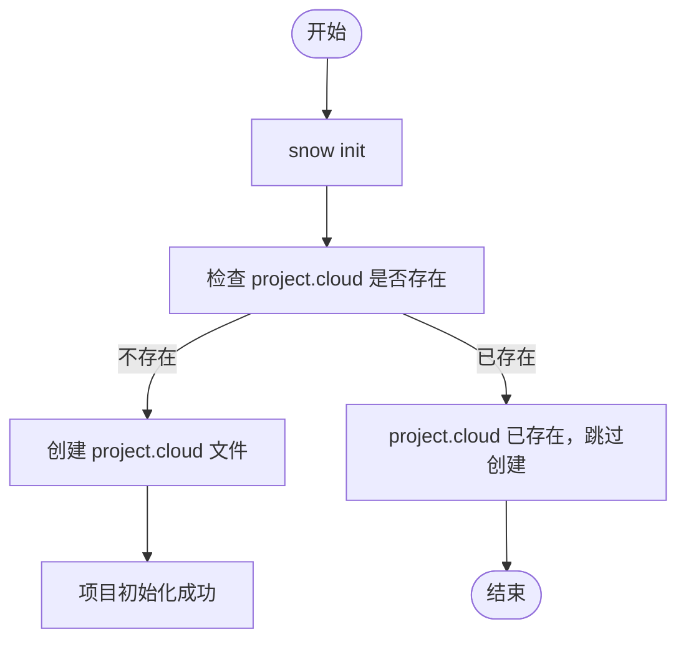
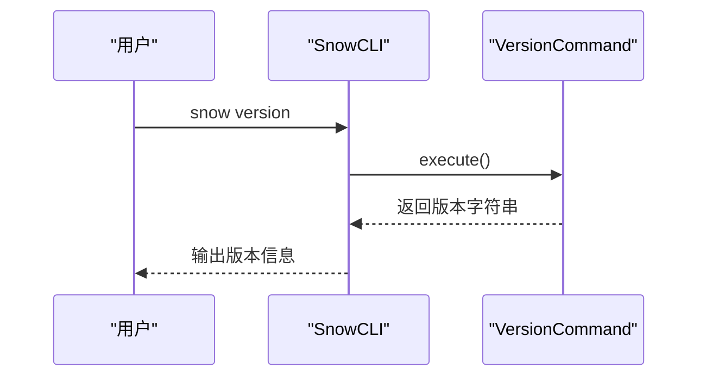
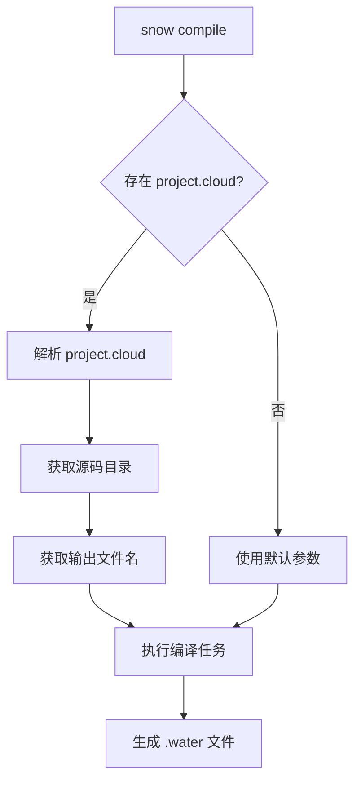

# 快速入门

<cite>
**本文档中引用的文件**  
- [README.md](file://README.md)
- [pom.xml](file://pom.xml)
- [SnowCLI.java](file://src/main/java/org/jcnc/snow/cli/SnowCLI.java)
- [VersionCommand.java](file://src/main/java/org/jcnc/snow/cli/commands/VersionCommand.java)
- [InitCommand.java](file://src/main/java/org/jcnc/snow/cli/commands/InitCommand.java)
- [CompileCommand.java](file://src/main/java/org/jcnc/snow/cli/commands/CompileCommand.java)
- [RunCommand.java](file://src/main/java/org/jcnc/snow/cli/commands/RunCommand.java)
- [BuildCommand.java](file://src/main/java/org/jcnc/snow/cli/commands/BuildCommand.java)
- [Project.java](file://src/main/java/org/jcnc/snow/pkg/model/Project.java)
- [ProjectCloudExample.java](file://src/main/java/org/jcnc/snow/cli/utils/ProjectCloudExample.java)
- [version.properties](file://src/main/resources/version.properties)
- [project.cloud](file://playground/PerformanceTest/project.cloud)
- [basic_module.snow](file://playground/Test/basic_tests/basic_module.snow)
- [Main.snow](file://playground/PerformanceTest/Main.snow)
</cite>

## 目录

1. [简介](#简介)
2. [安装与环境配置](#安装与环境配置)
3. [核心概念](#核心概念)
4. [创建第一个Snow程序](#创建第一个snow程序)
5. [基本命令详解](#基本命令详解)
6. [项目结构与配置](#项目结构与配置)
7. [常见问题与故障排除](#常见问题与故障排除)
8. [学习路径建议](#学习路径建议)

## 简介

Snow是一门面向AI时代的新型编程语言，其设计初衷是让大模型（LLM）更容易生成和理解代码，从而提升人与AI协同编程的效率。Snow语言通过完整的编译-执行链路，将`.snow`源文件编译为`.water`虚拟机指令，并在SnowVM上运行。本指南将帮助您快速掌握Snow语言的安装、项目初始化、代码编写、编译和运行等核心流程。

**Section sources**
- [README.md](file://README.md#L1-L638)

## 安装与环境配置

要开始使用Snow编程语言，您需要完成以下环境配置步骤：

### 1. 安装Java开发环境
Snow编译器基于Java开发，需要安装GraalVM JDK 25或更高版本。推荐使用GraalVM，因为它支持原生镜像构建，可以生成独立的可执行文件。

### 2. 获取Snow发行版
您可以通过以下方式获取Snow发行版：
- 从Gitee发布页面下载：[https://gitee.com/jcnc-org/snow/releases](https://gitee.com/jcnc-org/snow/releases)
- 对于Arch Linux用户，可通过AUR仓库安装：
  ```bash
  yay -Syu snow
  ```

### 3. 验证安装
安装完成后，可以通过`version`命令验证安装是否成功：
```bash
snow version
```
此命令将输出Snow的版本信息，确认环境配置正确。

**Section sources**
- [README.md](file://README.md#L1-L638)
- [pom.xml](file://pom.xml#L1-L227)
- [version.properties](file://src/main/resources/version.properties#L1-L2)

## 核心概念

在开始编写Snow程序之前，需要了解几个关键概念：

### .snow文件
`.snow`文件是Snow语言的源代码文件，包含用Snow语法编写的程序代码。这些文件遵循特定的模块化结构，以`module:`关键字开始定义模块。

### .water字节码
`.water`是Snow虚拟机（SnowVM）的字节码文件格式。当`.snow`源文件被编译时，编译器会生成对应的`.water`文件，该文件可以在SnowVM上执行。

### SnowVM
Snow虚拟机是Snow语言的运行时环境，负责加载和执行`.water`字节码文件。它提供了完整的执行引擎、内存管理和系统调用支持。

**Section sources**
- [README.md](file://README.md#L1-L638)

## 创建第一个Snow程序

让我们通过一个完整的流程来创建您的第一个Snow程序。

### 1. 初始化项目
使用`init`命令创建一个新的Snow项目：
```bash
snow init
```
此命令会在当前目录生成一个`project.cloud`配置文件，包含项目的基本信息。



**Diagram sources**
- [InitCommand.java](file://src/main/java/org/jcnc/snow/cli/commands/InitCommand.java#L1-L71)
- [ProjectCloudExample.java](file://src/main/java/org/jcnc/snow/cli/utils/ProjectCloudExample.java#L1-L31)

### 2. 编写代码
创建`src`目录并在其中创建`main.snow`文件：
```snow
module: Main
    function: main
        returns: int
        body:
            return 0
        end body
    end function
end module
```

### 3. 编译程序
使用`compile`命令将源代码编译为字节码：
```bash
snow compile
```
此命令会读取`project.cloud`配置，自动查找`src`目录下的`.snow`文件并编译生成`.water`文件。

### 4. 运行程序
使用`run`命令执行编译后的程序：
```bash
snow run main.water
```
您将看到程序执行结果。

**Section sources**
- [README.md](file://README.md#L1-L638)
- [basic_module.snow](file://playground/Test/basic_tests/basic_module.snow#L1-L10)

## 基本命令详解

Snow CLI提供了多个实用命令来管理您的项目。

### version命令
显示当前Snow的版本信息：
```bash
snow version
```
此命令输出类似于`snow version "0.11.0"`的信息。



**Diagram sources**
- [SnowCLI.java](file://src/main/java/org/jcnc/snow/cli/SnowCLI.java#L1-L98)
- [VersionCommand.java](file://src/main/java/org/jcnc/snow/cli/commands/VersionCommand.java#L1-L59)

### init命令
初始化新项目，生成`project.cloud`配置文件：
```bash
snow init
```
如果`project.cloud`已存在，命令会提示并跳过创建。

### compile命令
编译`.snow`源文件为`.water`字节码：
```bash
snow compile
```
支持两种模式：
- **Cloud模式**：当存在`project.cloud`文件时，使用其中的配置进行编译
- **Local模式**：直接编译指定的`.snow`文件



**Diagram sources**
- [CompileCommand.java](file://src/main/java/org/jcnc/snow/cli/commands/CompileCommand.java#L1-L92)
- [Project.java](file://src/main/java/org/jcnc/snow/pkg/model/Project.java#L1-L234)

### run命令
运行已编译的`.water`字节码文件：
```bash
snow run program.water
```
此命令会启动SnowVM并执行指定的字节码文件。

**Section sources**
- [RunCommand.java](file://src/main/java/org/jcnc/snow/cli/commands/RunCommand.java#L1-L66)
- [CompileCommand.java](file://src/main/java/org/jcnc/snow/cli/commands/CompileCommand.java#L1-L92)

## 项目结构与配置

### 项目目录结构
典型的Snow项目结构如下：
```
项目根目录/
├── project.cloud     # 项目配置文件
├── src/             # 源代码目录
│   └── main.snow
└── target/          # 编译输出目录
    └── main.water
```

### project.cloud配置文件
`project.cloud`是Snow项目的配置文件，使用DSL语法定义项目元数据和构建配置：
```cloud
# 由 snow init 生成
project {
    group    = "com.example"
    artifact = "demo-app"
    version  = "0.0.1-SNAPSHOT"
}

build {
    srcDir = "src"
    output = "build/demo-app"
}
```
该文件定义了项目的基本信息和构建参数，被`compile`和`build`命令使用。

**Section sources**
- [ProjectCloudExample.java](file://src/main/java/org/jcnc/snow/cli/utils/ProjectCloudExample.java#L1-L31)
- [project.cloud](file://playground/PerformanceTest/project.cloud#L1-L10)

## 常见问题与故障排除

### 命令未找到
如果执行`snow`命令时提示"command not found"，请检查：
1. Snow是否已正确安装
2. 安装目录是否已添加到系统PATH环境变量中

### 编译错误
当编译失败时，请检查：
1. `.snow`文件语法是否正确
2. `project.cloud`配置是否完整
3. 源码目录是否存在且包含有效的`.snow`文件

### 运行时错误
如果程序运行失败，请：
1. 确认`.water`文件已成功生成
2. 检查字节码文件路径是否正确
3. 查看详细的错误输出信息

**Section sources**
- [README.md](file://README.md#L1-L638)

## 学习路径建议

对于初学者，建议按照以下路径学习Snow语言：

1. **基础阶段**：掌握安装、初始化、编译和运行的基本流程
2. **语法学习**：学习Snow的基本语法，包括变量、函数、控制结构等
3. **项目实践**：创建实际项目，练习模块化编程和项目配置
4. **高级特性**：探索Snow的高级特性，如结构体、继承和系统调用
5. **性能优化**：了解SnowVM的执行机制，进行性能调优

有经验的开发者可以直接参考文档和示例代码，快速上手Snow语言的高级特性。

**Section sources**
- [README.md](file://README.md#L1-L638)
- [Main.snow](file://playground/PerformanceTest/Main.snow#L1-L20)