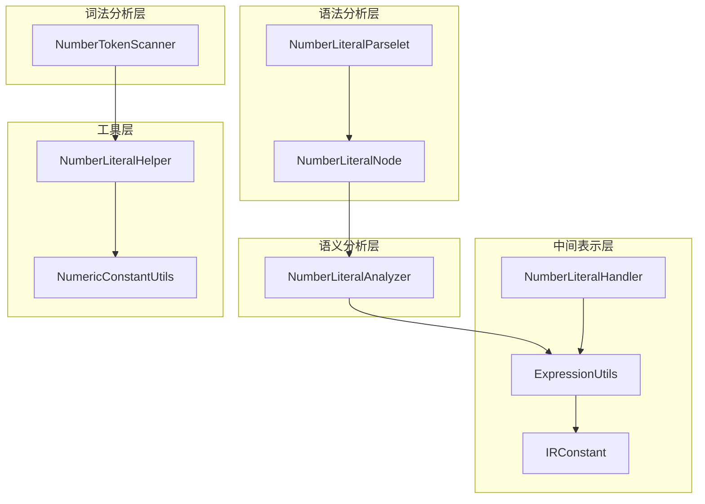
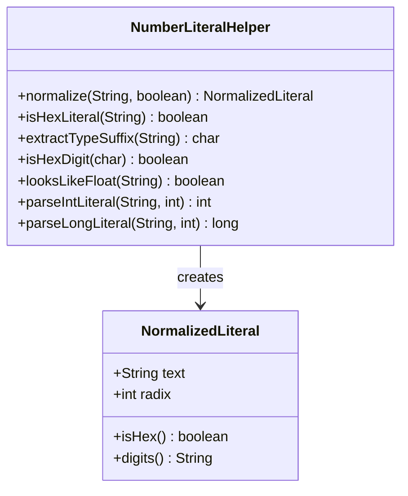
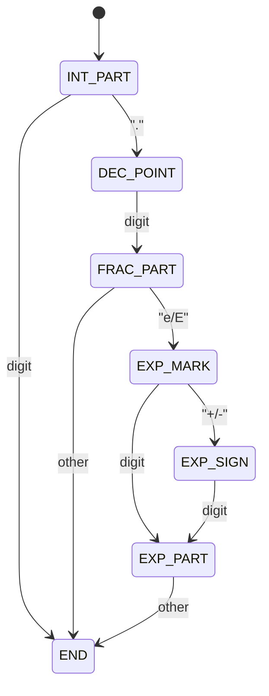
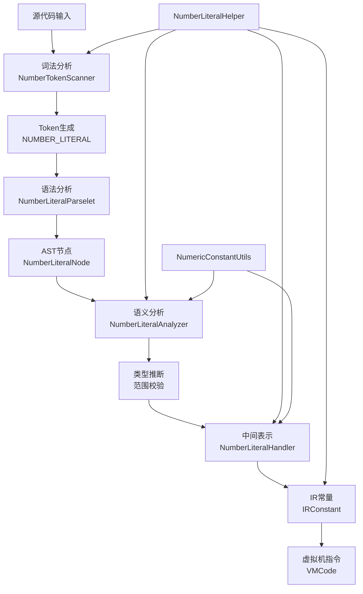
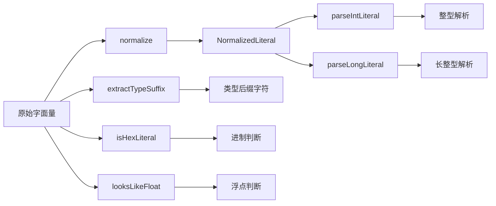
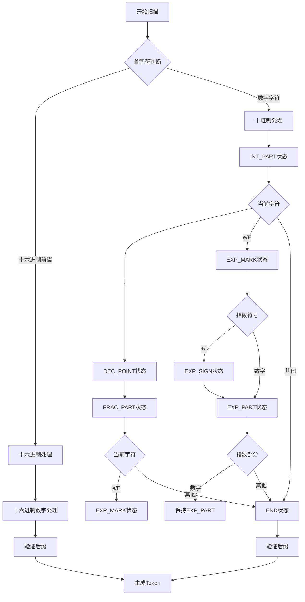
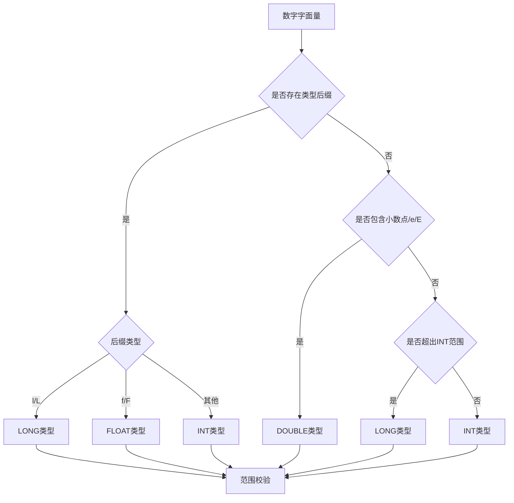
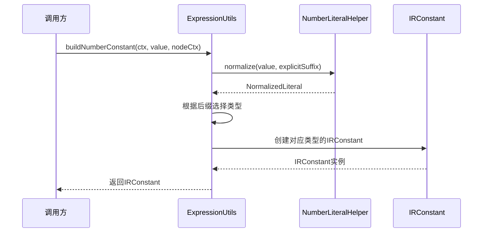
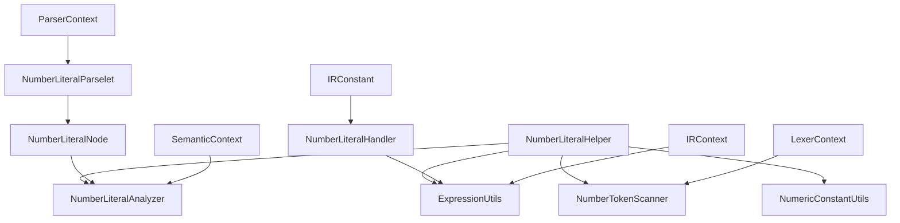

# Number Literal Helper - 数字字面量助手

<cite>
**本文档引用的文件**
- [NumberLiteralHelper.java](file://src/main/java/org/jcnc/snow/compiler/common/NumberLiteralHelper.java)
- [NumberTokenScanner.java](file://src/main/java/org/jcnc/snow/compiler/lexer/scanners/NumberTokenScanner.java)
- [NumberLiteralHandler.java](file://src/main/java/org/jcnc/snow/compiler/ir/builder/handlers/NumberLiteralHandler.java)
- [NumberLiteralAnalyzer.java](file://src/main/java/org/jcnc/snow/compiler/semantic/analyzers/expression/NumberLiteralAnalyzer.java)
- [NumberLiteralParselet.java](file://src/main/java/org/jcnc/snow/compiler/parser/expression/NumberLiteralParselet.java)
- [NumberLiteralNode.java](file://src/main/java/org/jcnc/snow/compiler/parser/ast/NumberLiteralNode.java)
- [ExpressionUtils.java](file://src/main/java/org/jcnc/snow/compiler/ir/utils/ExpressionUtils.java)
- [NumericConstantUtils.java](file://src/main/java/org/jcnc/snow/compiler/semantic/utils/NumericConstantUtils.java)
- [IRConstant.java](file://src/main/java/org/jcnc/snow/compiler/ir/value/IRConstant.java)
</cite>

## 目录
1. [简介](#简介)
2. [项目结构](#项目结构)
3. [核心组件](#核心组件)
4. [架构概览](#架构概览)
5. [详细组件分析](#详细组件分析)
6. [依赖关系分析](#依赖关系分析)
7. [性能考虑](#性能考虑)
8. [故障排除指南](#故障排除指南)
9. [结论](#结论)

## 简介

NumberLiteralHelper是Snow编程语言编译器中一个核心的数字字面量处理工具类。它在整个编译流程中扮演着统一的数字字面量预处理角色，为词法分析、语法分析、语义分析、中间表示生成和虚拟机指令生成等多个阶段提供一致的数字字面量处理能力。

该组件的主要职责包括：
- 统一的数字字面量规整处理
- 类型后缀识别与提取
- 进制判断（十进制/十六进制）
- 智能错误提示与建议
- 编译期常量求值支持

## 项目结构

Snow编译器采用模块化架构，数字字面量处理分布在多个层次中：



**图表来源**
- [NumberTokenScanner.java](file://src/main/java/org/jcnc/snow/compiler/lexer/scanners/NumberTokenScanner.java#L1-L50)
- [NumberLiteralParselet.java](file://src/main/java/org/jcnc/snow/compiler/parser/expression/NumberLiteralParselet.java#L1-L30)
- [NumberLiteralAnalyzer.java](file://src/main/java/org/jcnc/snow/compiler/semantic/analyzers/expression/NumberLiteralAnalyzer.java#L1-L50)

## 核心组件

### NumberLiteralHelper - 统一处理核心

NumberLiteralHelper是整个数字字面量处理体系的核心工具类，提供了统一的规整化接口：



**图表来源**
- [NumberLiteralHelper.java](file://src/main/java/org/jcnc/snow/compiler/common/NumberLiteralHelper.java#L20-L180)

### NumberTokenScanner - 词法分析器

负责将源码中的数字字符串切分为NUMBER_LITERAL token：



**图表来源**
- [NumberTokenScanner.java](file://src/main/java/org/jcnc/snow/compiler/lexer/scanners/NumberTokenScanner.java#L325-L357)

**章节来源**
- [NumberLiteralHelper.java](file://src/main/java/org/jcnc/snow/compiler/common/NumberLiteralHelper.java#L1-L180)
- [NumberTokenScanner.java](file://src/main/java/org/jcnc/snow/compiler/lexer/scanners/NumberTokenScanner.java#L1-L357)

## 架构概览

数字字面量处理遵循编译器的经典流水线架构：



**图表来源**
- [NumberTokenScanner.java](file://src/main/java/org/jcnc/snow/compiler/lexer/scanners/NumberTokenScanner.java#L66-L80)
- [NumberLiteralParselet.java](file://src/main/java/org/jcnc/snow/compiler/parser/expression/NumberLiteralParselet.java#L26-L30)
- [NumberLiteralAnalyzer.java](file://src/main/java/org/jcnc/snow/compiler/semantic/analyzers/expression/NumberLiteralAnalyzer.java#L241-L282)

## 详细组件分析

### 1. NumberLiteralHelper - 统一规整化处理

#### 核心功能

NumberLiteralHelper提供了六个核心方法，每个都针对不同的处理需求：



**图表来源**
- [NumberLiteralHelper.java](file://src/main/java/org/jcnc/snow/compiler/common/NumberLiteralHelper.java#L33-L180)

#### NormalizedLiteral结构

NormalizedLiteral是NumberLiteralHelper的核心返回类型，封装了规整化后的字面量信息：

| 属性 | 类型 | 描述 |
|------|------|------|
| text | String | 去除下划线与可选类型后缀后的文本 |
| radix | int | 数值进制（10 或 16） |

| 方法 | 返回类型 | 功能描述 |
|------|----------|----------|
| isHex() | boolean | 是否为十六进制字面量 |
| digits() | String | 不带前缀的数字部分 |

**章节来源**
- [NumberLiteralHelper.java](file://src/main/java/org/jcnc/snow/compiler/common/NumberLiteralHelper.java#L128-L180)

### 2. NumberTokenScanner - 词法分析器

#### 状态机设计

NumberTokenScanner采用有限状态机（FSM）模式处理复杂的数字字面量格式：



**图表来源**
- [NumberTokenScanner.java](file://src/main/java/org/jcnc/snow/compiler/lexer/scanners/NumberTokenScanner.java#L325-L357)

#### 支持的数字格式

| 格式类型 | 示例 | 规则说明 |
|----------|------|----------|
| 十进制整数 | 42, 123456 | 基础整数格式 |
| 十进制小数 | 3.14, 0.5 | 必须包含小数点 |
| 科学计数法 | 1e3, -2.5E-4 | 指数标记后可选正负号 |
| 十六进制 | 0x1A, 0XFF | 以0x或0X开头 |
| 类型后缀 | 42L, 3.14F | 支持l、f后缀 |

**章节来源**
- [NumberTokenScanner.java](file://src/main/java/org/jcnc/snow/compiler/lexer/scanners/NumberTokenScanner.java#L1-L357)

### 3. NumberLiteralAnalyzer - 语义分析器

#### 类型推断规则

NumberLiteralAnalyzer实现了严格的类型推断机制：



**图表来源**
- [NumberLiteralAnalyzer.java](file://src/main/java/org/jcnc/snow/compiler/semantic/analyzers/expression/NumberLiteralAnalyzer.java#L60-L81)

#### 智能错误提示

当数字字面量超出目标类型的表示范围时，Analyzer会提供智能建议：

| 类型范围 | 错误提示策略 | 建议方案 |
|----------|--------------|----------|
| INT越界 | 检查LONG范围 | 添加'L'后缀 |
| FLOAT越界 | 检查DOUBLE范围 | 使用默认DOUBLE |
| 超出所有范围 | 直接报错 | 明确范围限制 |

**章节来源**
- [NumberLiteralAnalyzer.java](file://src/main/java/org/jcnc/snow/compiler/semantic/analyzers/expression/NumberLiteralAnalyzer.java#L1-L282)

### 4. ExpressionUtils - 表达式工具

#### 类型解析与指令生成

ExpressionUtils负责将数字字面量转换为相应的IR常量：



**图表来源**
- [ExpressionUtils.java](file://src/main/java/org/jcnc/snow/compiler/ir/utils/ExpressionUtils.java#L64-L111)

**章节来源**
- [ExpressionUtils.java](file://src/main/java/org/jcnc/snow/compiler/ir/utils/ExpressionUtils.java#L1-L282)

### 5. NumericConstantUtils - 编译期求值

#### 常量折叠支持

NumericConstantUtils提供了编译期整型常量求值能力：

```mermaid
flowchart TD
A[表达式节点] --> B{节点类型}
B --> |NumberLiteral| C[解析整数字面量]
B --> |UnaryExpression| D[递归求值操作数]
B --> |BinaryExpression| E[递归求值操作数]
C --> F{是否为整数}
F --> |是| G[返回BigInteger]
F --> |否| H[返回empty]
D --> I{操作符}
I --> |+| J[保持原值]
I --> |-| K[取反]
I --> |其他| L[返回empty]
E --> M{操作符}
M --> |+/-/*//|%| N[执行运算]
M --> |<<>>| O[位移运算]
M --> |其他| L
N --> P[返回结果]
O --> P
J --> P
K --> P
```

**图表来源**
- [NumericConstantUtils.java](file://src/main/java/org/jcnc/snow/compiler/semantic/utils/NumericConstantUtils.java#L54-L96)

**章节来源**
- [NumericConstantUtils.java](file://src/main/java/org/jcnc/snow/compiler/semantic/utils/NumericConstantUtils.java#L1-L189)

## 依赖关系分析

### 组件间依赖图



**图表来源**
- [NumberTokenScanner.java](file://src/main/java/org/jcnc/snow/compiler/lexer/scanners/NumberTokenScanner.java#L3-L8)
- [NumberLiteralAnalyzer.java](file://src/main/java/org/jcnc/snow/compiler/semantic/analyzers/expression/NumberLiteralAnalyzer.java#L3-L12)

### 关键依赖关系

1. **NumberLiteralHelper ↔ NumberTokenScanner**: 统一的数字规整化标准
2. **NumberLiteralHelper ↔ NumberLiteralAnalyzer**: 类型推断一致性保证
3. **NumberLiteralHelper ↔ ExpressionUtils**: IR常量生成基础
4. **NumberLiteralHelper ↔ NumericConstantUtils**: 编译期求值支持

**章节来源**
- [NumberLiteralHelper.java](file://src/main/java/org/jcnc/snow/compiler/common/NumberLiteralHelper.java#L1-L180)
- [NumberTokenScanner.java](file://src/main/java/org/jcnc/snow/compiler/lexer/scanners/NumberTokenScanner.java#L1-L357)

## 性能考虑

### 优化策略

1. **延迟解析**: 只在需要时才进行完整的数值解析
2. **缓存机制**: 对频繁使用的规整化结果进行缓存
3. **快速路径**: 为常见格式提供专门的处理路径
4. **内存优化**: 使用Record结构减少对象创建开销

### 时间复杂度分析

| 操作 | 时间复杂度 | 说明 |
|------|------------|------|
| normalize | O(n) | n为字面量长度 |
| isHexLiteral | O(1) | 固定长度检查 |
| extractTypeSuffix | O(1) | 常数时间后缀提取 |
| looksLikeFloat | O(n) | 需要遍历整个字符串 |
| parseIntLiteral | O(log n) | 基于Radix的解析 |

### 内存使用优化

- 使用StringBuilder进行字符串操作
- Record结构减少GC压力
- ThreadLocal缓存避免全局锁竞争

## 故障排除指南

### 常见问题及解决方案

#### 1. 数字字面量解析错误

**症状**: 编译时报错"非法数字字面量"

**原因**: 
- 下划线位置不正确
- 十六进制数字包含非法字符
- 科学计数法格式错误

**解决方法**:
- 检查下划线不能出现在小数点前或指数标记前
- 确保十六进制数字只包含0-9,a-f,A-F
- 验证指数部分必须是有效的整数

#### 2. 类型推断错误

**症状**: 类型推断不符合预期

**原因**:
- 后缀使用不当
- 数值超出目标类型范围

**解决方法**:
- 使用明确的类型后缀
- 对于大数值使用LONG类型（添加L后缀）

#### 3. 智能建议不准确

**症状**: 错误提示不够友好

**原因**: 
- 数值范围边界计算错误
- 提示信息模板不完善

**解决方法**:
- 检查数值范围边界定义
- 优化错误提示信息模板

**章节来源**
- [NumberTokenScanner.java](file://src/main/java/org/jcnc/snow/compiler/lexer/scanners/NumberTokenScanner.java#L100-L250)
- [NumberLiteralAnalyzer.java](file://src/main/java/org/jcnc/snow/compiler/semantic/analyzers/expression/NumberLiteralAnalyzer.java#L122-L127)

## 结论

NumberLiteralHelper作为Snow编译器中数字字面量处理的核心组件，展现了优秀的软件设计原则：

### 设计优势

1. **单一职责**: 专注于数字字面量的规整化处理
2. **高内聚低耦合**: 与其他组件通过明确定义的接口交互
3. **可扩展性**: 支持新的数字格式和类型后缀
4. **错误处理**: 提供智能的错误提示和修复建议

### 技术亮点

1. **状态机模式**: NumberTokenScanner采用FSM处理复杂数字格式
2. **类型推断算法**: 智能的类型推断和范围校验机制
3. **编译期优化**: 支持常量折叠和类型提升
4. **跨阶段一致性**: 在词法、语法、语义各阶段保持处理逻辑一致

### 应用价值

NumberLiteralHelper不仅提高了Snow编译器的稳定性和用户体验，还为其他编译器项目提供了优秀的参考实现。其模块化设计和清晰的职责划分使其成为编译器前端开发的最佳实践案例。

通过统一的数字字面量处理接口，该组件确保了整个编译流程中数字处理的一致性和可靠性，为Snow语言的高质量编译奠定了坚实基础。