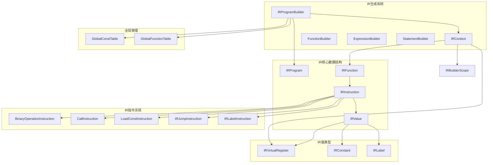
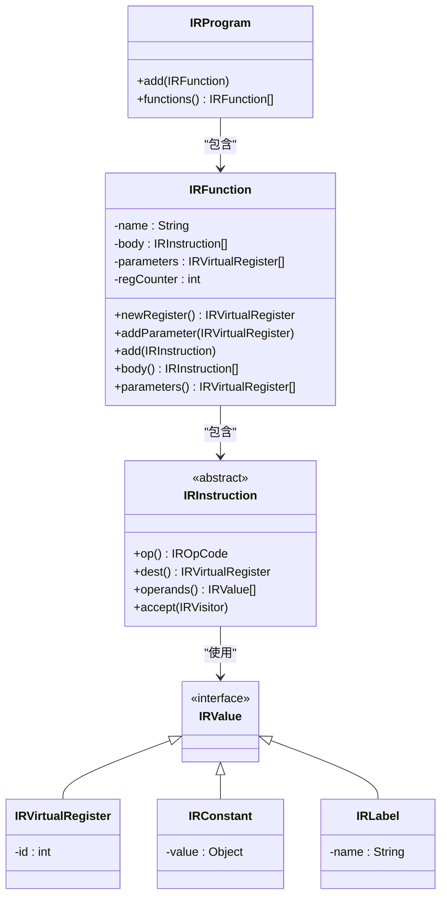
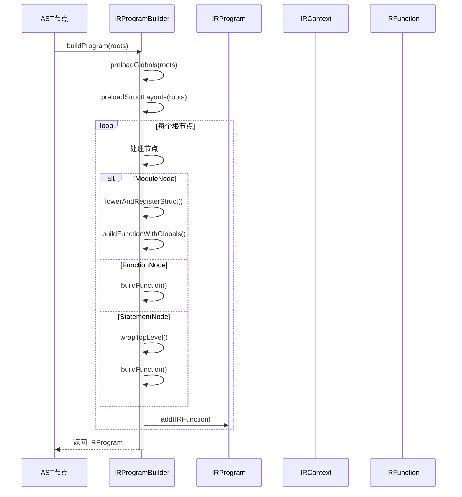
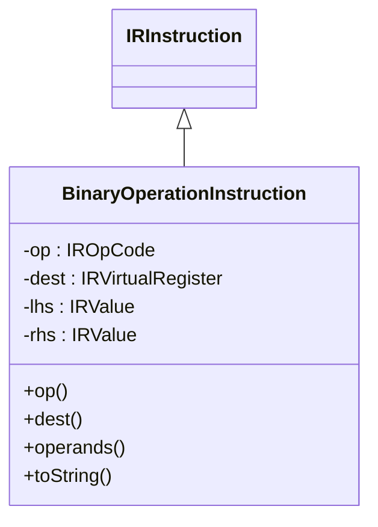
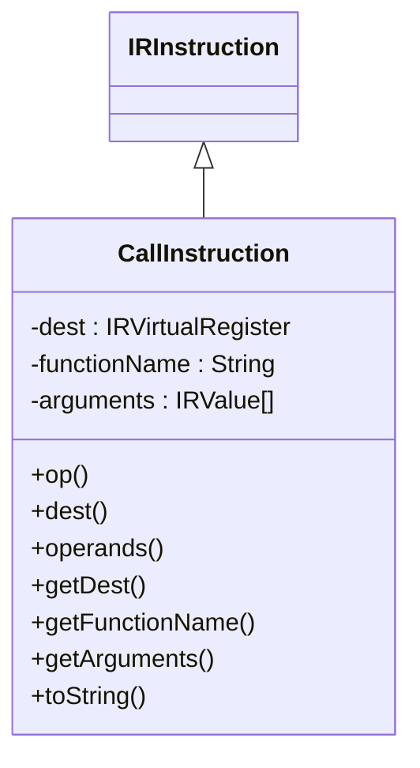
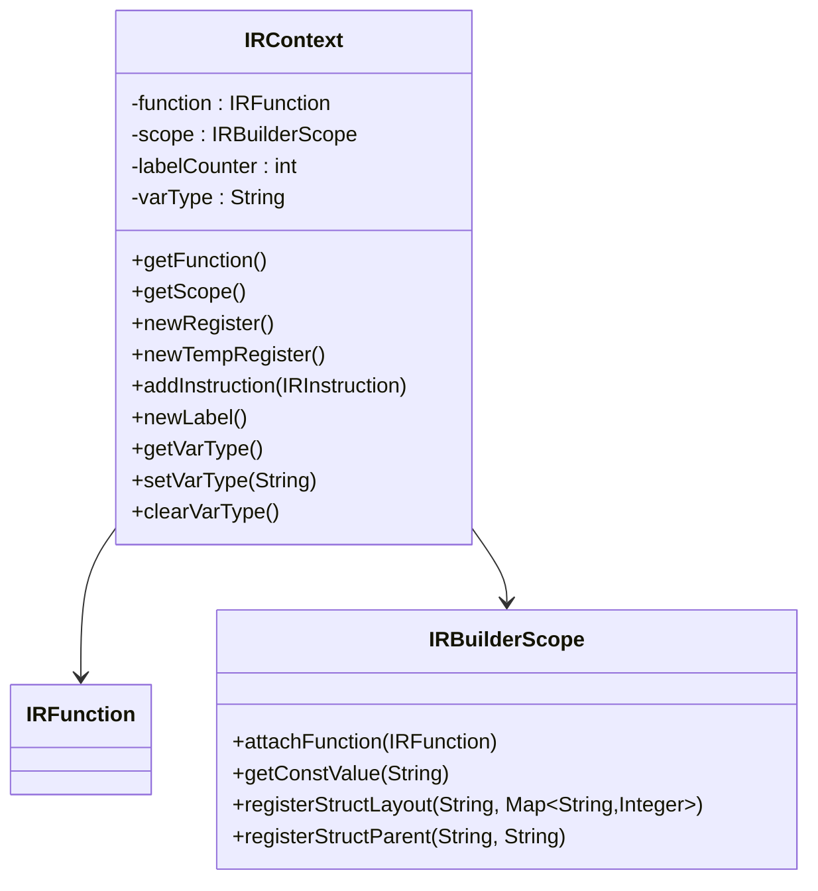
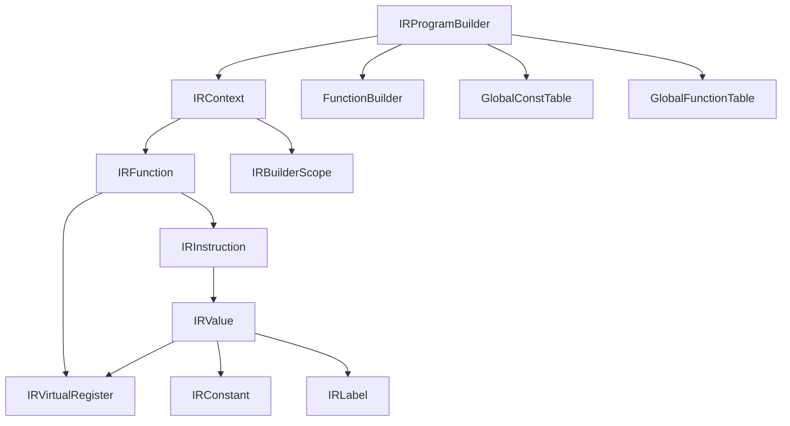

# 中间表示生成

<cite>
**本文档引用的文件**
- [IRProgramBuilder.java](file://src/main/java/org/jcnc/snow/compiler/ir/builder/core/IRProgramBuilder.java)
- [IRProgram.java](file://src/main/java/org/jcnc/snow/compiler/ir/core/IRProgram.java)
- [IRFunction.java](file://src/main/java/org/jcnc/snow/compiler/ir/core/IRFunction.java)
- [IRInstruction.java](file://src/main/java/org/jcnc/snow/compiler/ir/core/IRInstruction.java)
- [IRVirtualRegister.java](file://src/main/java/org/jcnc/snow/compiler/ir/value/IRVirtualRegister.java)
- [BinaryOperationInstruction.java](file://src/main/java/org/jcnc/snow/compiler/ir/instruction/BinaryOperationInstruction.java)
- [CallInstruction.java](file://src/main/java/org/jcnc/snow/compiler/ir/instruction/CallInstruction.java)
- [IRContext.java](file://src/main/java/org/jcnc/snow/compiler/ir/builder/core/IRContext.java)
- [IRPrinter.java](file://src/main/java/org/jcnc/snow/compiler/ir/core/IRPrinter.java)
- [GlobalConstTable.java](file://src/main/java/org/jcnc/snow/compiler/ir/common/GlobalConstTable.java)
- [TryFoldConst.java](file://src/main/java/org/jcnc/snow/compiler/ir/builder/utils/TryFoldConst.java)
- [IRLabelInstruction.java](file://src/main/java/org/jcnc/snow/compiler/ir/instruction/IRLabelInstruction.java)
- [IRJumpInstruction.java](file://src/main/java/org/jcnc/snow/compiler/ir/instruction/IRJumpInstruction.java)
- [LoadConstInstruction.java](file://src/main/java/org/jcnc/snow/compiler/ir/instruction/LoadConstInstruction.java)
- [IRConstant.java](file://src/main/java/org/jcnc/snow/compiler/ir/value/IRConstant.java)
- [IRLabel.java](file://src/main/java/org/jcnc/snow/compiler/ir/value/IRLabel.java)
</cite>

## 目录
1. [项目结构](#项目结构)
2. [核心组件](#核心组件)
3. [架构概述](#架构概述)
4. [详细组件分析](#详细组件分析)
5. [依赖分析](#依赖分析)
6. [性能考虑](#性能考虑)
7. [故障排除指南](#故障排除指南)
8. [结论](#结论)

## 项目结构
Snow语言的中间表示（IR）生成系统位于`src/main/java/org/jcnc/snow/compiler/ir`目录下，采用分层设计。核心结构包括`builder`（构建器）、`core`（核心数据结构）、`instruction`（指令实现）、`value`（值类型）和`common`（全局表）等包。该结构支持从AST到IR的转换、SSA形式的管理、指令生成和IR优化。

**图示来源**
- [IRProgramBuilder.java](file://src/main/java/org/jcnc/snow/compiler/ir/builder/core/IRProgramBuilder.java)
- [IRProgram.java](file://src/main/java/org/jcnc/snow/compiler/ir/core/IRProgram.java)
- [IRFunction.java](file://src/main/java/org/jcnc/snow/compiler/ir/core/IRFunction.java)
- [IRInstruction.java](file://src/main/java/org/jcnc/snow/compiler/ir/core/IRInstruction.java)
- [IRVirtualRegister.java](file://src/main/java/org/jcnc/snow/compiler/ir/value/IRVirtualRegister.java)

**章节来源**
- [IRProgramBuilder.java](file://src/main/java/org/jcnc/snow/compiler/ir/builder/core/IRProgramBuilder.java)
- [IRProgram.java](file://src/main/java/org/jcnc/snow/compiler/ir/core/IRProgram.java)

## 核心组件
本系统的核心组件包括`IRProgramBuilder`（程序构建器）、`IRProgram`（程序容器）、`IRFunction`（函数表示）、`IRInstruction`（指令基类）和`IRVirtualRegister`（虚拟寄存器）。`IRProgramBuilder`负责将AST转换为`IRProgram`，后者包含一个或多个`IRFunction`。每个`IRFunction`由一系列`IRInstruction`组成，并使用`IRVirtualRegister`在SSA形式下管理变量。

**章节来源**
- [IRProgramBuilder.java](file://src/main/java/org/jcnc/snow/compiler/ir/builder/core/IRProgramBuilder.java)
- [IRProgram.java](file://src/main/java/org/jcnc/snow/compiler/ir/core/IRProgram.java)
- [IRFunction.java](file://src/main/java/org/jcnc/snow/compiler/ir/core/IRFunction.java)
- [IRInstruction.java](file://src/main/java/org/jcnc/snow/compiler/ir/core/IRInstruction.java)
- [IRVirtualRegister.java](file://src/main/java/org/jcnc/snow/compiler/ir/value/IRVirtualRegister.java)

## 架构概述
Snow语言的IR生成系统采用经典的三地址码形式，基于静态单赋值（SSA）原则。`IRProgramBuilder`作为入口点，扫描AST并预处理全局常量和结构体布局。随后，它将函数和语句转换为`IRFunction`对象。`IRContext`在构建过程中管理当前函数的状态，包括作用域、寄存器分配和指令添加。指令以线性序列的形式存储在`IRFunction`中，通过`IRInstruction`的继承体系表示不同的操作。

**图示来源**
- [IRProgram.java](file://src/main/java/org/jcnc/snow/compiler/ir/core/IRProgram.java)
- [IRFunction.java](file://src/main/java/org/jcnc/snow/compiler/ir/core/IRFunction.java)
- [IRInstruction.java](file://src/main/java/org/jcnc/snow/compiler/ir/core/IRInstruction.java)
- [IRVirtualRegister.java](file://src/main/java/org/jcnc/snow/compiler/ir/value/IRVirtualRegister.java)
- [IRConstant.java](file://src/main/java/org/jcnc/snow/compiler/ir/value/IRConstant.java)
- [IRLabel.java](file://src/main/java/org/jcnc/snow/compiler/ir/value/IRLabel.java)

## 详细组件分析
### IRProgramBuilder分析
`IRProgramBuilder`是IR生成的入口点，负责将AST的顶层节点转换为`IRProgram`。它执行预扫描以收集全局常量和结构体布局，然后处理模块、函数和顶层语句。

**图示来源**
- [IRProgramBuilder.java](file://src/main/java/org/jcnc/snow/compiler/ir/builder/core/IRProgramBuilder.java)

**章节来源**
- [IRProgramBuilder.java](file://src/main/java/org/jcnc/snow/compiler/ir/builder/core/IRProgramBuilder.java)

### IRFunction与IRInstruction分析
`IRFunction`表示一个函数的IR，包含函数名、参数列表、指令体和寄存器计数器。`IRInstruction`是所有指令的抽象基类，定义了操作码、目标寄存器、操作数和访问者模式。

#### 二元操作指令
`BinaryOperationInstruction`表示形如`dest = lhs OP rhs`的二元运算。

**图示来源**
- [BinaryOperationInstruction.java](file://src/main/java/org/jcnc/snow/compiler/ir/instruction/BinaryOperationInstruction.java)

#### 函数调用指令
`CallInstruction`表示函数调用，格式为`dest = CALL functionName, args...`。

**图示来源**
- [CallInstruction.java](file://src/main/java/org/jcnc/snow/compiler/ir/instruction/CallInstruction.java)

### IRContext分析
`IRContext`封装了当前正在构建的`IRFunction`和作用域管理器`IRBuilderScope`，简化了寄存器分配和指令添加。

**图示来源**
- [IRContext.java](file://src/main/java/org/jcnc/snow/compiler/ir/builder/core/IRContext.java)

**章节来源**
- [IRContext.java](file://src/main/java/org/jcnc/snow/compiler/ir/builder/core/IRContext.java)

## 依赖分析
IR生成系统内部组件之间存在紧密的依赖关系。`IRProgramBuilder`依赖于`IRContext`和`FunctionBuilder`来构建`IRFunction`。`IRFunction`依赖于`IRInstruction`和`IRVirtualRegister`。`IRContext`作为协调者，依赖于`IRFunction`和`IRBuilderScope`。指令类依赖于`IRValue`的实现。

**图示来源**
- [IRProgramBuilder.java](file://src/main/java/org/jcnc/snow/compiler/ir/builder/core/IRProgramBuilder.java)
- [IRContext.java](file://src/main/java/org/jcnc/snow/compiler/ir/builder/core/IRContext.java)
- [IRFunction.java](file://src/main/java/org/jcnc/snow/compiler/ir/core/IRFunction.java)
- [IRInstruction.java](file://src/main/java/org/jcnc/snow/compiler/ir/core/IRInstruction.java)

**章节来源**
- [IRProgramBuilder.java](file://src/main/java/org/jcnc/snow/compiler/ir/builder/core/IRProgramBuilder.java)
- [IRContext.java](file://src/main/java/org/jcnc/snow/compiler/ir/builder/core/IRContext.java)
- [IRFunction.java](file://src/main/java/org/jcnc/snow/compiler/ir/core/IRFunction.java)

## 性能考虑
IR生成过程中的性能关键点包括常量折叠和SSA形式的维护。`GlobalConstTable`允许在编译期进行跨模块常量折叠，减少运行时计算。`TryFoldConst`工具类尝试在编译期将表达式计算为常量值。`IRVirtualRegister`的分配是高效的，因为`IRFunction`使用简单的计数器。指令的线性化表示便于后续的优化和代码生成。

**章节来源**
- [GlobalConstTable.java](file://src/main/java/org/jcnc/snow/compiler/ir/common/GlobalConstTable.java)
- [TryFoldConst.java](file://src/main/java/org/jcnc/snow/compiler/ir/builder/utils/TryFoldConst.java)
- [IRVirtualRegister.java](file://src/main/java/org/jcnc/snow/compiler/ir/value/IRVirtualRegister.java)

## 故障排除指南
当IR生成出现问题时，应首先检查`IRProgramBuilder`的预扫描阶段是否正确处理了全局常量和结构体。其次，验证`IRContext`是否正确管理了作用域和寄存器分配。使用`IRPrinter`可以打印IR代码，便于调试。确保所有AST节点都被正确处理，特别是`ModuleNode`、`FunctionNode`和`StatementNode`。

**章节来源**
- [IRProgramBuilder.java](file://src/main/java/org/jcnc/snow/compiler/ir/builder/core/IRProgramBuilder.java)
- [IRContext.java](file://src/main/java/org/jcnc/snow/compiler/ir/builder/core/IRContext.java)
- [IRPrinter.java](file://src/main/java/org/jcnc/snow/compiler/ir/core/IRPrinter.java)

## 结论
Snow语言的中间表示生成系统设计精良，实现了从AST到低级IR的高效转换。它利用SSA形式和三地址码来简化后续的优化和代码生成。`IRProgramBuilder`作为入口点，协调了全局信息的收集和函数的构建。`IRContext`提供了构建过程所需的上下文。丰富的指令集支持了语言的各种特性。该系统为实现高级优化（如常量传播、死代码消除）和目标代码生成奠定了坚实的基础。