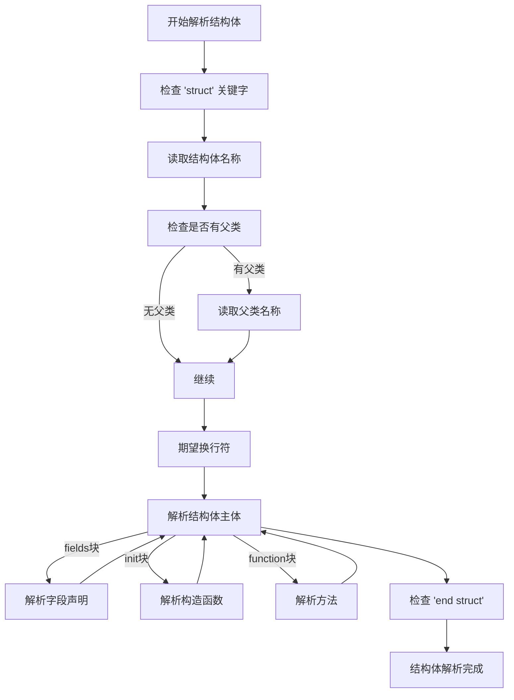
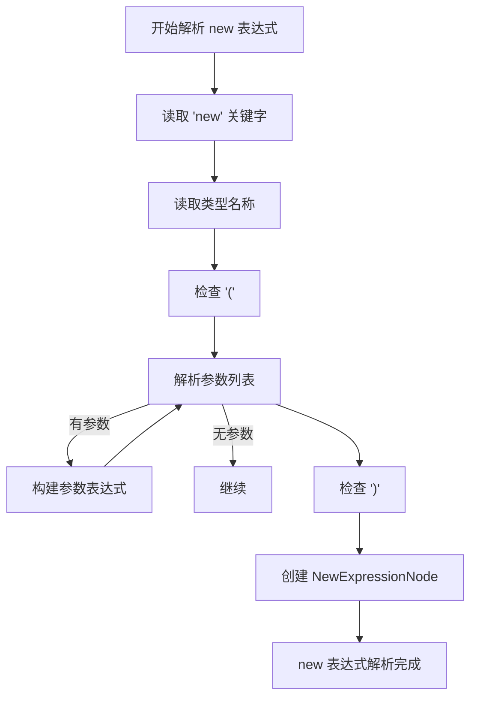
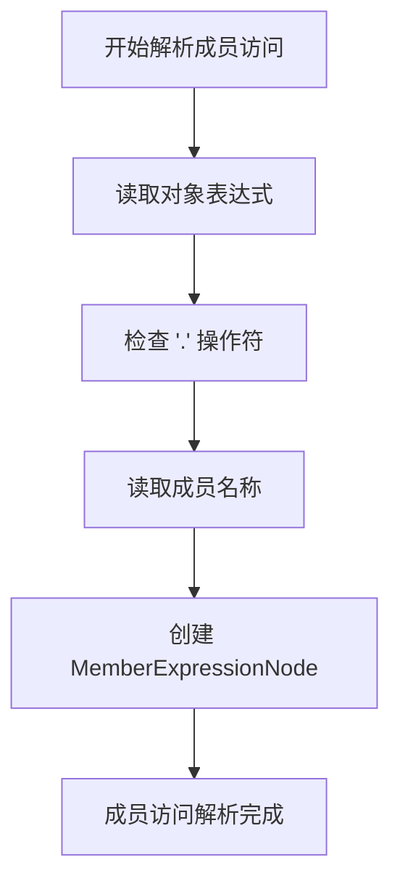
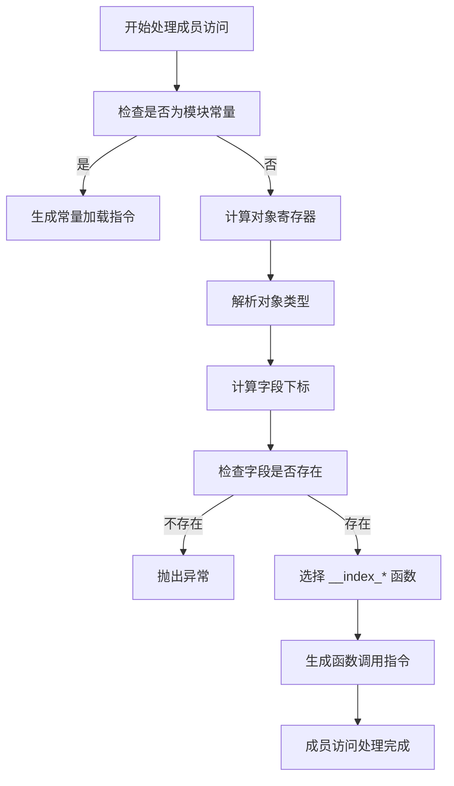
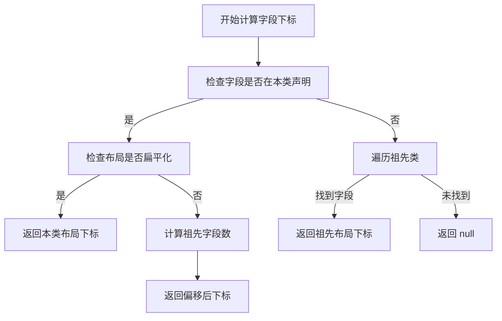
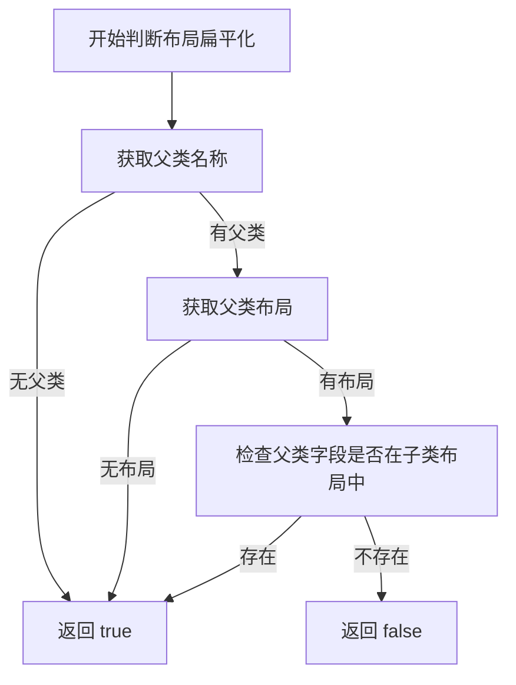
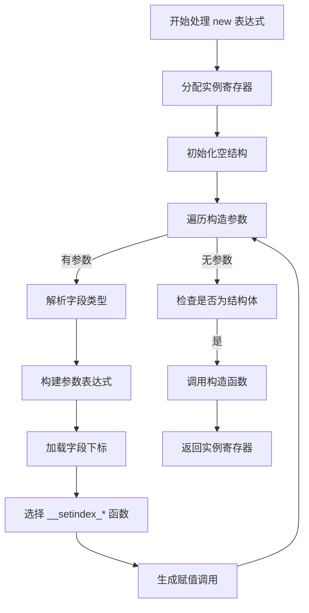
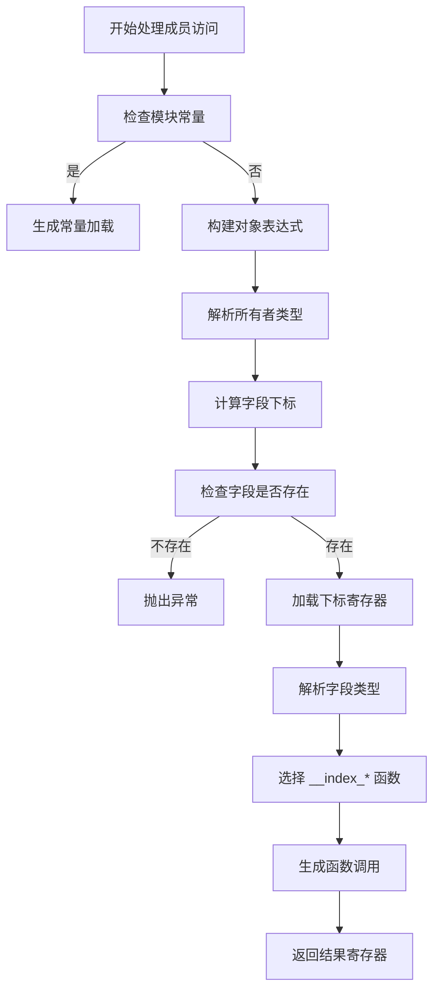

# 结构体实例化与字段访问

<cite>
**本文档引用的文件**   
- [StructNode.java](file://src/main/java/org/jcnc/snow/compiler/parser/ast/StructNode.java)
- [NewExpressionNode.java](file://src/main/java/org/jcnc/snow/compiler/parser/ast/NewExpressionNode.java)
- [NewObjectParselet.java](file://src/main/java/org/jcnc/snow/compiler/parser/expression/NewObjectParselet.java)
- [NewHandler.java](file://src/main/java/org/jcnc/snow/compiler/ir/builder/handlers/NewHandler.java)
- [MemberExpressionNode.java](file://src/main/java/org/jcnc/snow/compiler/parser/ast/MemberExpressionNode.java)
- [MemberParselet.java](file://src/main/java/org/jcnc/snow/compiler/parser/expression/MemberParselet.java)
- [MemberHandler.java](file://src/main/java/org/jcnc/snow/compiler/ir/builder/handlers/MemberHandler.java)
- [IRBuilderScope.java](file://src/main/java/org/jcnc/snow/compiler/ir/builder/core/IRBuilderScope.java)
- [IRProgramBuilder.java](file://src/main/java/org/jcnc/snow/compiler/ir/builder/core/IRProgramBuilder.java)
- [StructParser.java](file://src/main/java/org/jcnc/snow/compiler/parser/struct/StructParser.java)
</cite>

## 目录
1. [简介](#简介)
2. [结构体定义与解析](#结构体定义与解析)
3. [结构体实例化](#结构体实例化)
4. [字段访问机制](#字段访问机制)
5. [继承与字段布局](#继承与字段布局)
6. [字段访问IR生成](#字段访问IR生成)
7. [总结](#总结)

## 简介
本文档详细分析Snow编译器中结构体实例化与字段访问的实现机制。通过解析器、语义分析和中间代码生成三个阶段，系统地阐述了从源代码到中间表示的转换过程。重点包括结构体的定义语法、`new`表达式的解析、成员访问操作的处理，以及继承场景下的字段布局管理。

## 结构体定义与解析
Snow语言中的结构体通过`struct`关键字定义，支持字段、构造函数和方法的声明。结构体可以继承父类，形成继承链。

**图示来源**
- [StructParser.java](file://src/main/java/org/jcnc/snow/compiler/parser/struct/StructParser.java#L1-L186)

**本节来源**
- [StructNode.java](file://src/main/java/org/jcnc/snow/compiler/parser/ast/StructNode.java#L1-L52)
- [StructParser.java](file://src/main/java/org/jcnc/snow/compiler/parser/struct/StructParser.java#L1-L186)

## 结构体实例化
结构体实例化通过`new`关键字完成，语法为`new TypeName(arg1, arg2, ...)`。该过程涉及解析、语义分析和中间代码生成三个阶段。

### 解析阶段
`NewObjectParselet`负责解析`new`表达式，生成`NewExpressionNode` AST节点。

**图示来源**
- [NewObjectParselet.java](file://src/main/java/org/jcnc/snow/compiler/parser/expression/NewObjectParselet.java#L1-L64)

### 语义分析
`NewExpressionAnalyzer`对`new`表达式进行类型检查，确保目标类型存在且构造函数参数匹配。

**本节来源**
- [NewExpressionNode.java](file://src/main/java/org/jcnc/snow/compiler/parser/ast/NewExpressionNode.java#L1-L51)
- [NewObjectParselet.java](file://src/main/java/org/jcnc/snow/compiler/parser/expression/NewObjectParselet.java#L1-L64)
- [NewExpressionAnalyzer.java](file://src/main/java/org/jcnc/snow/compiler/semantic/analyzers/expression/NewExpressionAnalyzer.java#L1-L31)

## 字段访问机制
字段访问通过点操作符`.`实现，语法为`object.field`。该机制支持普通对象字段访问、模块常量访问和继承链上的字段查找。

### 解析阶段
`MemberParselet`负责解析成员访问表达式，生成`MemberExpressionNode` AST节点。

**图示来源**
- [MemberParselet.java](file://src/main/java/org/jcnc/snow/compiler/parser/expression/MemberParselet.java#L1-L50)

### 中间代码生成
`MemberHandler`将成员访问表达式转换为底层的`__index_*`函数调用，根据字段类型选择合适的访问通道。

**图示来源**
- [MemberHandler.java](file://src/main/java/org/jcnc/snow/compiler/ir/builder/handlers/MemberHandler.java#L1-L198)

**本节来源**
- [MemberExpressionNode.java](file://src/main/java/org/jcnc/snow/compiler/parser/ast/MemberExpressionNode.java#L1-L35)
- [MemberParselet.java](file://src/main/java/org/jcnc/snow/compiler/parser/expression/MemberParselet.java#L1-L50)
- [MemberHandler.java](file://src/main/java/org/jcnc/snow/compiler/ir/builder/handlers/MemberHandler.java#L1-L198)

## 继承与字段布局
Snow支持结构体继承，通过`parent`字段指定父类。字段布局管理确保继承链上的字段下标正确计算，避免重复累计。

### 字段下标计算
`resolveFieldIndex`方法根据结构体继承链计算字段的全局下标。

**图示来源**
- [MemberHandler.java](file://src/main/java/org/jcnc/snow/compiler/ir/builder/handlers/MemberHandler.java#L123-L157)

### 布局扁平化判断
`isFlattenedWithParent`方法判断子类布局是否已包含父类字段。

**图示来源**
- [MemberHandler.java](file://src/main/java/org/jcnc/snow/compiler/ir/builder/handlers/MemberHandler.java#L168-L176)

**本节来源**
- [IRBuilderScope.java](file://src/main/java/org/jcnc/snow/compiler/ir/builder/core/IRBuilderScope.java#L1-L200)
- [IRProgramBuilder.java](file://src/main/java/org/jcnc/snow/compiler/ir/builder/core/IRProgramBuilder.java#L98-L154)
- [MemberHandler.java](file://src/main/java/org/jcnc/snow/compiler/ir/builder/handlers/MemberHandler.java#L110-L198)

## 中间表示（IR）生成
结构体实例化和字段访问的中间表示生成涉及多个处理器的协作，最终转换为底层的函数调用和指令。

### 实例化IR生成
`NewHandler`将`new`表达式转换为IR指令序列。

**图示来源**
- [NewHandler.java](file://src/main/java/org/jcnc/snow/compiler/ir/builder/handlers/NewHandler.java#L33-L131)

### 字段访问IR生成
`MemberHandler`将成员访问转换为`__index_*`函数调用。

**图示来源**
- [MemberHandler.java](file://src/main/java/org/jcnc/snow/compiler/ir/builder/handlers/MemberHandler.java#L48-L113)

**本节来源**
- [NewHandler.java](file://src/main/java/org/jcnc/snow/compiler/ir/builder/handlers/NewHandler.java#L33-L131)
- [MemberHandler.java](file://src/main/java/org/jcnc/snow/compiler/ir/builder/handlers/MemberHandler.java#L48-L113)

## 总结
Snow编译器通过多层次的解析和转换机制，实现了结构体实例化与字段访问的完整支持。从源代码解析到AST构建，再到语义分析和中间表示生成，每个阶段都精心设计以确保类型安全和运行效率。继承机制和字段布局管理使得结构体能够灵活地组织数据，而`__index_*`和`__setindex_*`系列函数则提供了高效的底层访问通道。