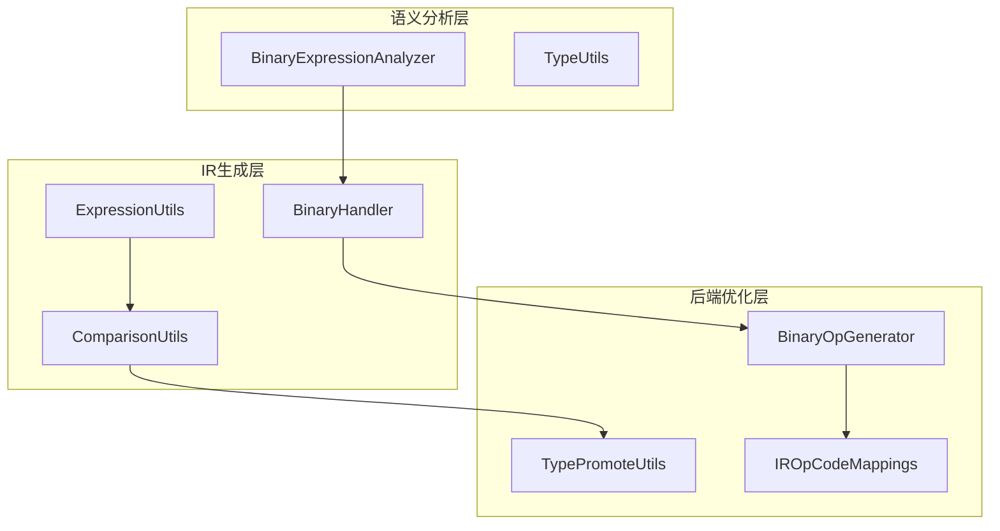
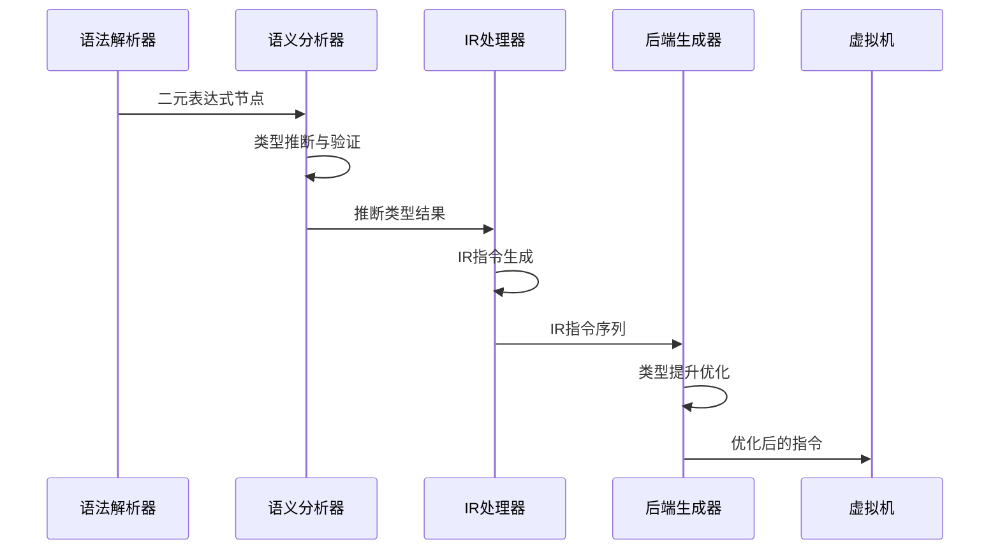
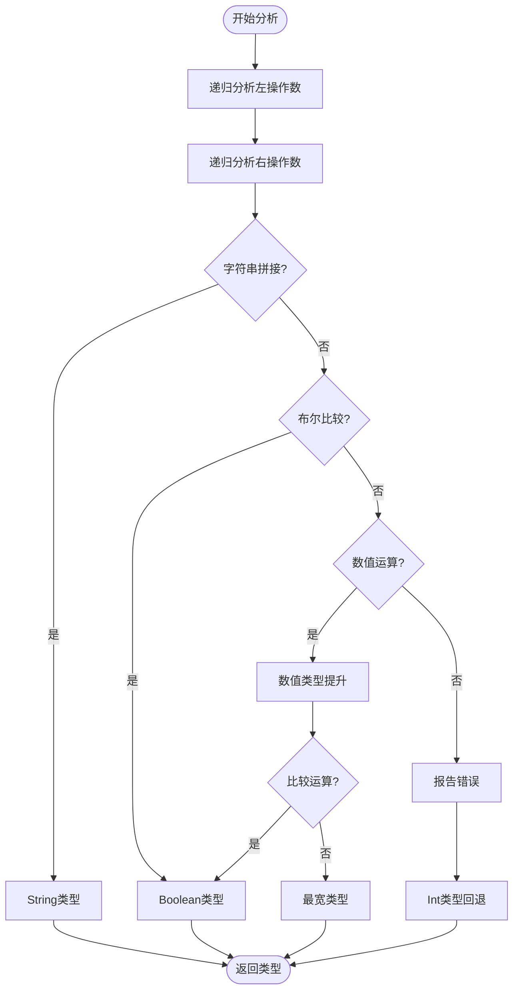
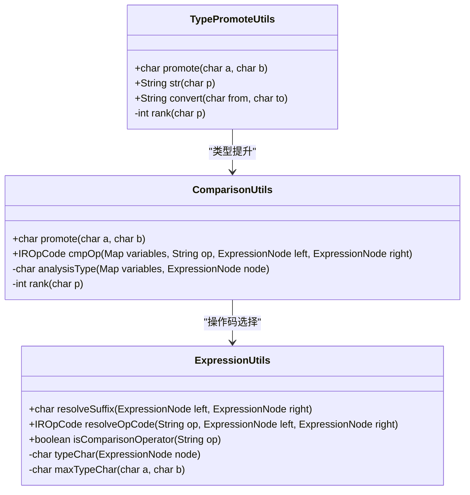
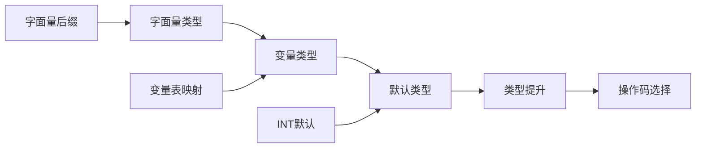
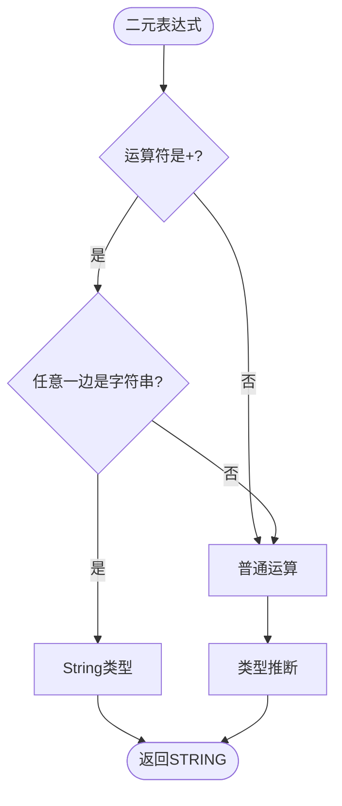

# 二元运算类型推断

<cite>
**本文档中引用的文件**
- [BinaryExpressionAnalyzer.java](file://src/main/java/org/jcnc/snow/compiler/semantic/analyzers/expression/BinaryExpressionAnalyzer.java)
- [BinaryHandler.java](file://src/main/java/org/jcnc/snow/compiler/ir/builder/handlers/BinaryHandler.java)
- [BinaryOpGenerator.java](file://src/main/java/org/jcnc/snow/compiler/backend/generator/BinaryOpGenerator.java)
- [TypePromoteUtils.java](file://src/main/java/org/jcnc/snow/compiler/backend/utils/TypePromoteUtils.java)
- [ComparisonUtils.java](file://src/main/java/org/jcnc/snow/compiler/ir/utils/ComparisonUtils.java)
- [ExpressionUtils.java](file://src/main/java/org/jcnc/snow/compiler/ir/utils/ExpressionUtils.java)
- [IROpCodeMappings.java](file://src/main/java/org/jcnc/snow/compiler/ir/core/IROpCodeMappings.java)
- [IROpCode.java](file://src/main/java/org/jcnc/snow/compiler/ir/core/IROpCode.java)
- [BuiltinType.java](file://src/main/java/org/jcnc/snow/compiler/semantic/type/BuiltinType.java)
</cite>

## 目录
1. [简介](#简介)
2. [项目结构概览](#项目结构概览)
3. [核心组件分析](#核心组件分析)
4. [架构概览](#架构概览)
5. [详细组件分析](#详细组件分析)
6. [类型推断算法](#类型推断算法)
7. [性能考虑](#性能考虑)
8. [故障排除指南](#故障排除指南)
9. [结论](#结论)

## 简介

Snow编译器的二元运算类型推断系统是一个复杂而精密的多阶段类型检查和优化机制。该系统负责在编译时确定二元表达式的类型，并生成相应的中间表示指令。系统涵盖了数值运算、比较运算、字符串拼接等多种运算类型，每种都有其特定的类型推断规则和优化策略。

## 项目结构概览

Snow编译器采用分层架构设计，二元运算类型推断涉及多个层次的组件协作：

**图表来源**
- [BinaryExpressionAnalyzer.java](file://src/main/java/org/jcnc/snow/compiler/semantic/analyzers/expression/BinaryExpressionAnalyzer.java#L1-L111)
- [BinaryHandler.java](file://src/main/java/org/jcnc/snow/compiler/ir/builder/handlers/BinaryHandler.java#L1-L156)
- [BinaryOpGenerator.java](file://src/main/java/org/jcnc/snow/compiler/backend/generator/BinaryOpGenerator.java#L1-L161)

## 核心组件分析

### 语义分析阶段

语义分析阶段的主要职责是确定二元表达式的类型，并进行类型兼容性检查。

**章节来源**
- [BinaryExpressionAnalyzer.java](file://src/main/java/org/jcnc/snow/compiler/semantic/analyzers/expression/BinaryExpressionAnalyzer.java#L28-L111)

### IR生成阶段

IR生成阶段负责将AST节点转换为中间表示指令，同时进行类型推断和优化。

**章节来源**
- [BinaryHandler.java](file://src/main/java/org/jcnc/snow/compiler/ir/builder/handlers/BinaryHandler.java#L30-L156)

### 后端优化阶段

后端优化阶段专注于生成高效的机器码，包括类型提升、指令选择和Peephole优化。

**章节来源**
- [BinaryOpGenerator.java](file://src/main/java/org/jcnc/snow/compiler/backend/generator/BinaryOpGenerator.java#L80-L161)

## 架构概览

二元运算类型推断系统采用多阶段流水线架构，每个阶段都有明确的职责分工：

**图表来源**
- [BinaryExpressionAnalyzer.java](file://src/main/java/org/jcnc/snow/compiler/semantic/analyzers/expression/BinaryExpressionAnalyzer.java#L37-L43)
- [BinaryHandler.java](file://src/main/java/org/jcnc/snow/compiler/ir/builder/handlers/BinaryHandler.java#L32-L42)
- [BinaryOpGenerator.java](file://src/main/java/org/jcnc/snow/compiler/backend/generator/BinaryOpGenerator.java#L92-L107)

## 详细组件分析

### 二元表达式语义分析器

二元表达式语义分析器是类型推断的第一道关卡，负责验证运算符的合法性并确定结果类型。

**图表来源**
- [BinaryExpressionAnalyzer.java](file://src/main/java/org/jcnc/snow/compiler/semantic/analyzers/expression/BinaryExpressionAnalyzer.java#L37-L96)

**章节来源**
- [BinaryExpressionAnalyzer.java](file://src/main/java/org/jcnc/snow/compiler/semantic/analyzers/expression/BinaryExpressionAnalyzer.java#L28-L111)

### 类型提升工具类

类型提升工具类提供了核心的类型转换和提升算法，确保数值运算的一致性和正确性。

**图表来源**
- [TypePromoteUtils.java](file://src/main/java/org/jcnc/snow/compiler/backend/utils/TypePromoteUtils.java#L22-L161)
- [ComparisonUtils.java](file://src/main/java/org/jcnc/snow/compiler/ir/utils/ComparisonUtils.java#L27-L159)
- [ExpressionUtils.java](file://src/main/java/org/jcnc/snow/compiler/ir/utils/ExpressionUtils.java#L185-L267)

**章节来源**
- [TypePromoteUtils.java](file://src/main/java/org/jcnc/snow/compiler/backend/utils/TypePromoteUtils.java#L1-L161)
- [ComparisonUtils.java](file://src/main/java/org/jcnc/snow/compiler/ir/utils/ComparisonUtils.java#L1-L159)
- [ExpressionUtils.java](file://src/main/java/org/jcnc/snow/compiler/ir/utils/ExpressionUtils.java#L1-L267)

### IR二元运算处理器

IR处理器负责将AST节点转换为具体的IR指令，同时处理不同类型运算的特殊需求。

**章节来源**
- [BinaryHandler.java](file://src/main/java/org/jcnc/snow/compiler/ir/builder/handlers/BinaryHandler.java#L1-L156)

### 后端二元运算生成器

后端生成器专注于生成高效的机器码，包括类型提升、指令选择和各种优化技术。

**章节来源**
- [BinaryOpGenerator.java](file://src/main/java/org/jcnc/snow/compiler/backend/generator/BinaryOpGenerator.java#L1-L161)

## 类型推断算法

### 数值类型提升规则

Snow编译器采用严格的数值类型提升规则，确保运算的一致性和正确性：

| 原始类型 | 提升后类型 | 优先级 |
|---------|-----------|--------|
| BYTE | INT | 3 |
| SHORT | INT | 3 |
| INT | INT | 3 |
| LONG | LONG | 4 |
| FLOAT | FLOAT | 5 |
| DOUBLE | DOUBLE | 6 |
| STRING | STRING | 7 |

### 比较运算类型推断

比较运算的类型推断遵循以下优先级：

**图表来源**
- [ComparisonUtils.java](file://src/main/java/org/jcnc/snow/compiler/ir/utils/ComparisonUtils.java#L118-L157)

### 字符串拼接处理

字符串拼接具有特殊的类型推断规则，优先考虑引用类型：

**图表来源**
- [BinaryHandler.java](file://src/main/java/org/jcnc/snow/compiler/ir/builder/handlers/BinaryHandler.java#L44-L48)

## 性能考虑

### 类型推断优化策略

1. **早期短路**: 对于布尔逻辑运算，尽早确定结果类型
2. **缓存机制**: 缓存常见的类型组合结果
3. **指令选择优化**: 根据类型选择最优的操作码
4. **Peephole优化**: 检测并优化常见的模式（如加零优化）

### 内存使用优化

- 使用字符标记而非完整类型对象进行类型比较
- 延迟类型推断直到必要时才进行完整分析
- 复用类型推断结果避免重复计算

## 故障排除指南

### 常见类型推断错误

1. **不支持的类型组合**
   - 错误信息: "运算符 'op' 不支持类型: type1 和 type2"
   - 解决方案: 检查运算符是否支持这些类型，或添加适当的类型转换

2. **类型不兼容**
   - 错误信息: "类型不兼容"
   - 解决方案: 添加显式类型转换或调整表达式结构

3. **未识别的类型**
   - 错误信息: "未知类型"
   - 解决方案: 确保所有使用的类型都已正确定义和导入

### 调试技巧

1. **启用详细日志**: 在语义分析器中启用类型推断日志
2. **检查类型映射**: 验证类型到操作码的映射是否正确
3. **测试边界情况**: 测试最小值、最大值和特殊值的情况

**章节来源**
- [BinaryExpressionAnalyzer.java](file://src/main/java/org/jcnc/snow/compiler/semantic/analyzers/expression/BinaryExpressionAnalyzer.java#L88-L96)

## 结论

Snow编译器的二元运算类型推断系统展现了现代编译器设计的最佳实践。通过分层架构、严格类型规则和智能优化，系统能够高效地处理各种二元运算场景。

### 主要优势

1. **类型安全性**: 严格的类型检查确保运行时安全
2. **性能优化**: 多层次的优化策略提高执行效率
3. **扩展性**: 清晰的架构便于添加新的运算类型
4. **可维护性**: 模块化的设计便于理解和维护

### 未来发展方向

1. **更复杂的类型推断**: 支持泛型和高级类型系统
2. **更好的错误报告**: 提供更详细的类型错误信息
3. **性能进一步优化**: 利用现代CPU特性进行优化
4. **类型推断算法改进**: 更智能的类型推断和优化策略

这个系统不仅展示了编译器内部复杂的类型推断机制，也为理解现代编程语言编译器的设计提供了宝贵的参考。