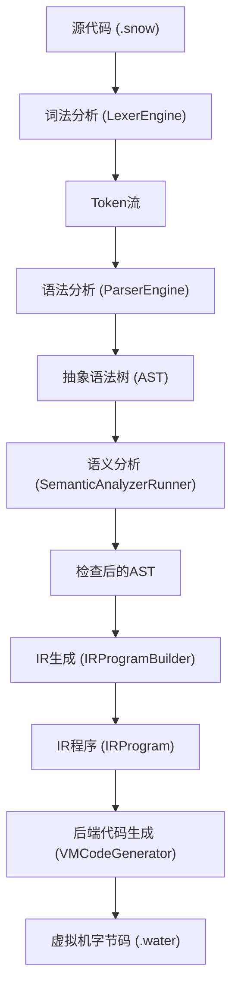
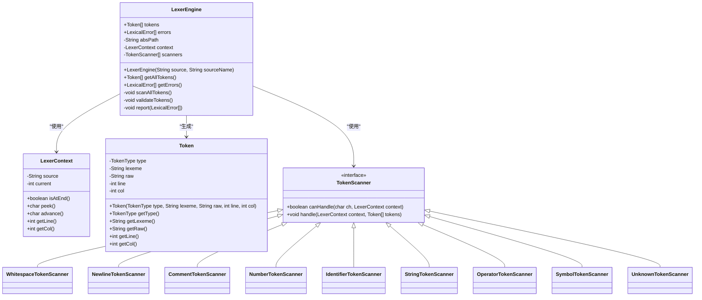
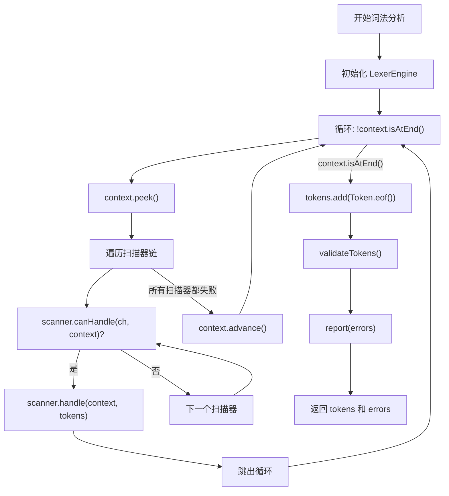
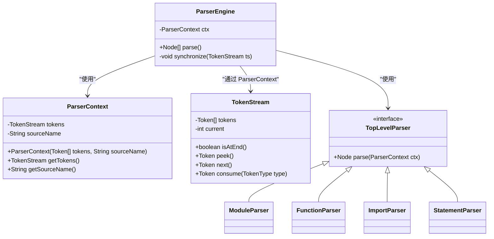
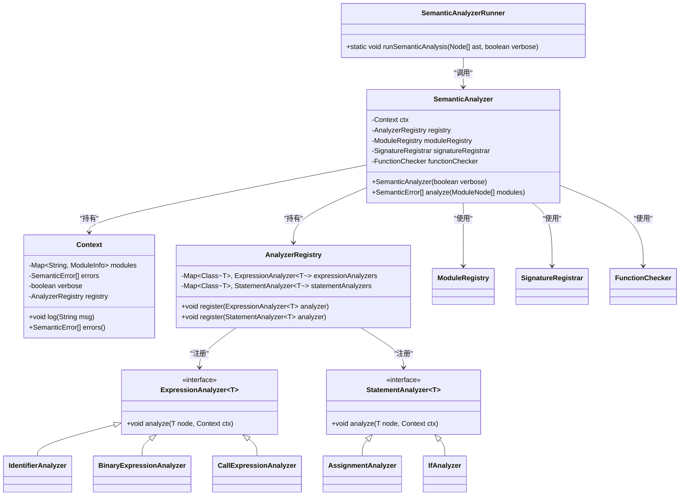
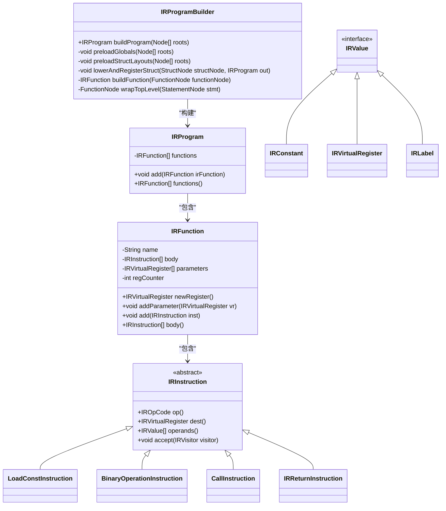
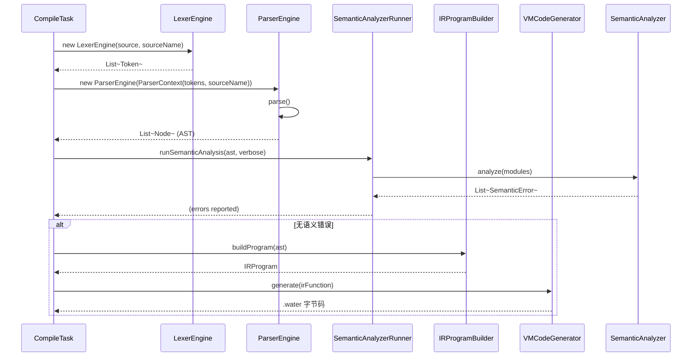

# 编译器架构

<cite>
**本文档引用的文件**  
- [LexerEngine.java](file://src/main/java/org/jcnc/snow/compiler/lexer/core/LexerEngine.java)
- [ParserEngine.java](file://src/main/java/org/jcnc/snow/compiler/parser/core/ParserEngine.java)
- [SemanticAnalyzerRunner.java](file://src/main/java/org/jcnc/snow/compiler/semantic/core/SemanticAnalyzerRunner.java)
- [IRProgram.java](file://src/main/java/org/jcnc/snow/compiler/ir/core/IRProgram.java)
- [IRProgramBuilder.java](file://src/main/java/org/jcnc/snow/compiler/ir/builder/core/IRProgramBuilder.java)
- [VMCodeGenerator.java](file://src/main/java/org/jcnc/snow/compiler/backend/builder/VMCodeGenerator.java)
- [Token.java](file://src/main/java/org/jcnc/snow/compiler/lexer/token/Token.java)
- [ParserContext.java](file://src/main/java/org/jcnc/snow/compiler/parser/context/ParserContext.java)
- [IRFunction.java](file://src/main/java/org/jcnc/snow/compiler/ir/core/IRFunction.java)
- [IRInstruction.java](file://src/main/java/org/jcnc/snow/compiler/ir/core/IRInstruction.java)
- [CompileTask.java](file://src/main/java/org/jcnc/snow/pkg/tasks/CompileTask.java)
</cite>

## 目录
1. [简介](#简介)
2. [编译流程概述](#编译流程概述)
3. [词法分析](#词法分析)
4. [语法分析](#语法分析)
5. [语义分析](#语义分析)
6. [中间表示生成](#中间表示生成)
7. [组件间数据流与控制流](#组件间数据流与控制流)
8. [扩展点开发指南](#扩展点开发指南)
9. [性能优化建议](#性能优化建议)
10. [常见编译错误诊断](#常见编译错误诊断)
11. [结论](#结论)

## 简介
Snow编译器是一个完整的编译工具链，负责将Snow语言的源代码转换为可在Snow虚拟机上执行的字节码。该编译器采用经典的多阶段架构，包括词法分析、语法分析、语义分析和中间表示生成四个主要阶段。每个阶段都有明确的职责和输出，确保编译过程的正确性和可维护性。本架构文档详细描述了从源代码到中间表示的完整流程，以及各核心组件的实现细节。

## 编译流程概述
Snow编译器的编译流程遵循典型的编译器前端架构，分为四个连续的阶段：词法分析、语法分析、语义分析和中间表示生成。整个流程由`CompileTask`类驱动，该类作为编译任务的入口点，协调各个阶段的执行。编译器采用“先扫描 → 后批量校验 → 统一报告”的策略，确保错误能够被集中处理和报告。每个阶段的输出作为下一阶段的输入，形成一个清晰的数据流管道。词法分析器将字符流转换为Token流，语法分析器将Token流解析为抽象语法树（AST），语义分析器对AST进行类型检查和符号解析，最后IR生成器将AST转换为中间表示（IR）程序。

**编译流程图**

**图示来源**
- [CompileTask.java](file://src/main/java/org/jcnc/snow/pkg/tasks/CompileTask.java)

## 词法分析
词法分析阶段由`LexerEngine`类实现，其主要职责是将源代码的字符流转换为有意义的Token序列。`LexerEngine`采用扫描器链（Scanner Chain）模式，通过一系列`TokenScanner`实现类来识别不同类型的Token。这些扫描器按优先级顺序排列，包括空白字符扫描器、换行符扫描器、注释扫描器、数字扫描器、标识符扫描器、字符串扫描器、操作符扫描器、符号扫描器和未知字符扫描器。当`LexerEngine`处理输入时，它会逐个字符地检查，并尝试让每个扫描器处理当前字符。一旦某个扫描器成功处理，流程就会跳转到下一个字符。

`LexerEngine`的构造函数接收源代码字符串和源文件名，初始化`LexerContext`用于管理字符流的位置信息，并创建扫描器链。核心方法`scanAllTokens()`负责执行扫描过程，它通过`LexerContext`的`peek()`和`advance()`方法来查看和移动字符指针。对于每个字符，它会遍历扫描器链，调用`canHandle()`方法判断该扫描器是否能处理当前字符，如果可以，则调用`handle()`方法进行实际的Token生成。如果所有扫描器都无法处理，字符将被简单地跳过。

除了基本的Token生成，`LexerEngine`还实现了后置的Token序列校验。`validateTokens()`方法会检查Token序列的上下文有效性，例如`declare`关键字后必须紧跟一个合法的标识符。这种设计将扫描和校验分离，提高了代码的模块化程度。所有发现的词法错误都会被收集到`errors`列表中，并在最后通过`report()`方法统一输出，避免了在扫描过程中频繁中断。

**词法分析器类图**

**图示来源**
- [LexerEngine.java](file://src/main/java/org/jcnc/snow/compiler/lexer/core/LexerEngine.java)
- [LexerContext.java](file://src/main/java/org/jcnc/snow/compiler/lexer/core/LexerContext.java)
- [Token.java](file://src/main/java/org/jcnc/snow/compiler/lexer/token/Token.java)
- [TokenScanner.java](file://src/main/java/org/jcnc/snow/compiler/lexer/base/TokenScanner.java)

**词法分析流程图**

**图示来源**
- [LexerEngine.java](file://src/main/java/org/jcnc/snow/compiler/lexer/core/LexerEngine.java)

## 语法分析
语法分析阶段由`ParserEngine`类实现，其主要职责是将`LexerEngine`生成的Token流解析为抽象语法树（AST）。`ParserEngine`采用递归下降解析（Recursive Descent Parsing）和Pratt解析（Pratt Parsing）相结合的策略。它接收一个`ParserContext`对象，该对象封装了`TokenStream`和源文件名，为解析过程提供上下文信息。

`ParserEngine`的核心方法是`parse()`，它在一个主循环中处理Token流，直到遇到文件结束（EOF）Token。循环会跳过空行，然后根据当前Token的词素（lexeme）查找对应的`TopLevelParser`。`TopLevelParserFactory`负责根据Token的类型（如`function`、`module`、`import`）创建相应的解析器实例。如果解析成功，生成的AST节点将被添加到结果列表中。如果在解析过程中抛出`ParseException`，`ParserEngine`会捕获该异常，将其转换为`ParseError`并收集到错误列表中，然后调用`synchronize()`方法尝试从错误中恢复。

`synchronize()`方法是`ParserEngine`错误恢复机制的核心。它会跳过当前行或直到遇到一个已注册的顶层关键字（如`function`、`module`）为止，从而将解析指针重新定位到一个可能的合法解析起点。这种机制可以防止因单个语法错误导致整个解析过程崩溃，允许编译器继续分析后续代码并报告更多错误。

**语法分析器类图**

**图示来源**
- [ParserEngine.java](file://src/main/java/org/jcnc/snow/compiler/parser/core/ParserEngine.java)
- [ParserContext.java](file://src/main/java/org/jcnc/snow/compiler/parser/context/ParserContext.java)
- [TokenStream.java](file://src/main/java/org/jcnc/snow/compiler/parser/context/TokenStream.java)
- [TopLevelParser.java](file://src/main/java/org/jcnc/snow/compiler/parser/base/TopLevelParser.java)

## 语义分析
语义分析阶段由`SemanticAnalyzerRunner`和`SemanticAnalyzer`类协同实现，其主要职责是对语法分析生成的AST进行类型检查、符号解析和作用域分析。`SemanticAnalyzerRunner`是语义分析的统一入口，它负责调用`SemanticAnalyzer`并处理结果。`SemanticAnalyzer`是实际的分析调度器，它维护一个`Context`对象，用于存储全局模块表、符号表、错误列表和分析器注册表。

`SemanticAnalyzer`的分析流程分为三个阶段：
1.  **模块注册**：`ModuleRegistry`将所有用户定义的模块名称注册到全局模块表中，以便后续的导入检查。
2.  **函数签名注册**：`SignatureRegistrar`遍历所有模块，提取函数的名称和类型信息，并将其注册到对应的`ModuleInfo`中。
3.  **函数体检查**：`FunctionChecker`遍历每个函数体，对其中的每条语句和表达式进行详细的语义验证。

`SemanticAnalyzer`使用`AnalyzerRegistry`来管理不同类型的AST节点与对应的分析器之间的映射关系。例如，`IdentifierAnalyzer`负责分析标识符表达式，`BinaryExpressionAnalyzer`负责分析二元运算表达式，`AssignmentAnalyzer`负责分析赋值语句等。当需要分析一个节点时，`SemanticAnalyzer`会根据节点类型从注册表中获取相应的分析器，并调用其`analyze()`方法。

**语义分析器类图**

**图示来源**
- [SemanticAnalyzerRunner.java](file://src/main/java/org/jcnc/snow/compiler/semantic/core/SemanticAnalyzerRunner.java)
- [SemanticAnalyzer.java](file://src/main/java/org/jcnc/snow/compiler/semantic/core/SemanticAnalyzer.java)
- [Context.java](file://src/main/java/org/jcnc/snow/compiler/semantic/core/Context.java)
- [AnalyzerRegistry.java](file://src/main/java/org/jcnc/snow/compiler/semantic/analyzers/AnalyzerRegistry.java)

## 中间表示生成
中间表示（IR）生成阶段由`IRProgramBuilder`类实现，其主要职责是将经过语义分析的AST转换为一个可执行的`IRProgram`。`IRProgram`是编译器后端处理的核心数据结构，它包含一个`IRFunction`的有序列表，每个`IRFunction`代表一个函数的中间代码。

`IRProgramBuilder`的工作流程如下：
1.  **预扫描**：首先调用`preloadGlobals()`和`preloadStructLayouts()`方法，分别收集全局常量和注册结构体的字段布局。这为后续的常量折叠和成员访问提供了支持。
2.  **遍历根节点**：`buildProgram()`方法遍历AST的根节点列表。根据节点类型，它会执行不同的处理逻辑：
    *   对于`ModuleNode`，它会先处理结构体（`lowerAndRegisterStruct`），然后处理模块内的函数。
    *   对于`FunctionNode`，它会直接调用`buildFunction()`进行构建。
    *   对于`StatementNode`，它会将其包装成一个名为`_start`的特殊函数，以支持脚本模式。
3.  **函数构建**：`FunctionBuilder`负责将`FunctionNode`转换为`IRFunction`。它会遍历函数体中的每条语句，并调用相应的`IStatementHandler`（如`ReturnHandler`、`CallHandler`）来生成IR指令。

`IRFunction`是IR程序的基本执行单元，它包含一个函数名、一个参数寄存器列表、一个指令体列表和一个寄存器计数器。`IRInstruction`是所有IR指令的抽象基类，具体的指令如`LoadConstInstruction`、`BinaryOperationInstruction`、`CallInstruction`等都继承自它。`IRValue`是IR中值的抽象，包括`IRConstant`、`IRVirtualRegister`和`IRLabel`。

**IR生成器类图**

**图示来源**
- [IRProgramBuilder.java](file://src/main/java/org/jcnc/snow/compiler/ir/builder/core/IRProgramBuilder.java)
- [IRProgram.java](file://src/main/java/org/jcnc/snow/compiler/ir/core/IRProgram.java)
- [IRFunction.java](file://src/main/java/org/jcnc/snow/compiler/ir/core/IRFunction.java)
- [IRInstruction.java](file://src/main/java/org/jcnc/snow/compiler/ir/core/IRInstruction.java)
- [IRValue.java](file://src/main/java/org/jcnc/snow/compiler/ir/value/IRValue.java)

## 组件间数据流与控制流
Snow编译器的各个组件通过明确定义的接口和数据结构进行交互，形成了一个清晰的数据流和控制流。整个编译流程由`CompileTask`启动，它首先调用`LexerEngine`将源代码转换为Token流。然后，它创建一个`ParserContext`，并将Token流传递给`ParserEngine`。`ParserEngine`解析Token流，生成AST节点列表。

接下来，`CompileTask`将AST列表传递给`SemanticAnalyzerRunner`。`SemanticAnalyzerRunner`调用`SemanticAnalyzer`对AST进行完整的语义分析。如果分析成功，`CompileTask`将继续执行IR生成阶段。它创建一个`IRProgramBuilder`实例，并调用其`buildProgram()`方法，将AST列表作为输入。`IRProgramBuilder`返回一个`IRProgram`对象。

最后，`CompileTask`将`IRProgram`传递给后端的`VMCodeGenerator`。`VMCodeGenerator`遍历`IRProgram`中的每个`IRFunction`，并使用`InstructionGenerator`注册表将每条`IRInstruction`转换为具体的虚拟机指令，最终输出`.water`字节码文件。

**编译器数据流与控制流图**

**图示来源**
- [CompileTask.java](file://src/main/java/org/jcnc/snow/pkg/tasks/CompileTask.java)
- [LexerEngine.java](file://src/main/java/org/jcnc/snow/compiler/lexer/core/LexerEngine.java)
- [ParserEngine.java](file://src/main/java/org/jcnc/snow/compiler/parser/core/ParserEngine.java)
- [SemanticAnalyzerRunner.java](file://src/main/java/org/jcnc/snow/compiler/semantic/core/SemanticAnalyzerRunner.java)
- [IRProgramBuilder.java](file://src/main/java/org/jcnc/snow/compiler/ir/builder/core/IRProgramBuilder.java)
- [VMCodeGenerator.java](file://src/main/java/org/jcnc/snow/compiler/backend/builder/VMCodeGenerator.java)

## 扩展点开发指南
Snow编译器的设计考虑了可扩展性，允许开发者通过实现特定接口来添加自定义功能。主要的扩展点包括自定义解析器和自定义分析器。

### 实现自定义解析器
要实现一个自定义的顶层解析器，需要创建一个实现`TopLevelParser`接口的类。该接口定义了一个`parse(ParserContext ctx)`方法，该方法接收一个`ParserContext`并返回一个`Node`。开发者需要在`parse()`方法中编写具体的解析逻辑，通常会使用`ParserContext`提供的`TokenStream`来消费Token并构建相应的AST节点。

例如，要添加一个`class`关键字的解析器，可以创建一个`ClassParser`类。在`parse()`方法中，它会期望一个`class`关键字，然后读取类名，接着解析类体（包括字段和方法）。解析完成后，它会返回一个`ClassNode`对象。最后，需要在`TopLevelParserFactory`中注册这个新的解析器，以便`ParserEngine`能够在遇到`class` Token时调用它。

### 实现自定义分析器
要实现一个自定义的语义分析器，需要创建一个实现`ExpressionAnalyzer`或`StatementAnalyzer`接口的类。这些接口定义了一个`analyze(T node, Context ctx)`方法，该方法接收一个AST节点和一个`Context`对象。

例如，要为一个新的`match`表达式添加类型检查，可以创建一个`MatchExpressionAnalyzer`类。在`analyze()`方法中，它会遍历`match`表达式的每个分支，检查模式和守卫的类型是否正确，并确保所有分支的返回类型一致。分析完成后，它会将推导出的类型信息存储在节点上或上下文中。最后，需要在`AnalyzerRegistrar`的`registerAll()`方法中注册这个新的分析器，以便`SemanticAnalyzer`能够调用它。

## 性能优化建议
为了提高Snow编译器的性能，可以考虑以下优化建议：

1.  **缓存解析结果**：对于大型项目，可以实现一个源文件到AST的缓存机制。如果源文件的修改时间没有变化，可以直接从缓存中加载AST，跳过词法和语法分析阶段。
2.  **增量编译**：实现增量编译功能，只重新编译那些被修改的文件以及受其影响的依赖文件，而不是每次都编译整个项目。
3.  **并行处理**：利用多核CPU的优势，将独立的编译任务（如解析多个源文件）并行化处理。Java的`ForkJoinPool`或`CompletableFuture`可以用于实现这一点。
4.  **减少对象分配**：在`LexerEngine`和`ParserEngine`中，频繁地创建`Token`和`Node`对象可能会导致垃圾回收压力。可以考虑使用对象池（Object Pool）来重用这些短生命周期的对象。
5.  **优化IR生成**：在`IRProgramBuilder`中，`preloadGlobals()`和`preloadStructLayouts()`方法会遍历整个AST。如果AST非常大，可以考虑在AST构建时就进行这些预处理，或者使用更高效的数据结构来存储和查询信息。

## 常见编译错误诊断
了解常见的编译错误及其诊断方法对于开发者至关重要。以下是Snow编译器中一些常见错误的诊断指南：

1.  **词法错误**：这类错误通常由`LexerEngine`报告，例如“无效的数字字面量”或“未闭合的字符串”。诊断时应检查源代码中对应行和列的字符，确认是否存在拼写错误或格式问题。
2.  **语法错误**：这类错误由`ParserEngine`报告，例如“期望';'但得到'{'”或“意外的Token”。`ParserEngine`的`synchronize()`方法会尝试恢复，因此可能会报告多个相关错误。应首先关注第一个错误，修复后重新编译。
3.  **语义错误**：这类错误由`SemanticAnalyzer`报告，例如“未声明的标识符”或“类型不匹配”。这些错误通常需要检查变量的作用域、函数签名和类型声明。`SemanticAnalyzerRunner`会一次性报告所有错误，有助于批量修复。
4.  **IR生成错误**：这类错误较少见，通常是由于AST结构不完整或`IRProgramBuilder`中的逻辑缺陷导致的。如果遇到此类错误，应检查AST的生成和语义分析阶段是否正确。

## 结论
Snow编译器通过一个清晰、模块化的四阶段架构，成功地将Snow语言的源代码转换为可执行的虚拟机字节码。从`LexerEngine`的字符扫描，到`ParserEngine`的语法解析，再到`SemanticAnalyzer`的深度语义检查，最后到`IRProgramBuilder`的中间代码生成，每个组件都各司其职，共同构成了一个健壮的编译工具链。其设计不仅保证了编译的正确性，还通过错误恢复和统一报告机制提升了用户体验。通过理解其内部架构和数据流，开发者可以更有效地使用和扩展Snow编译器。