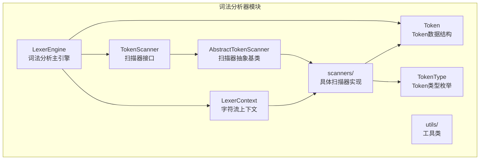
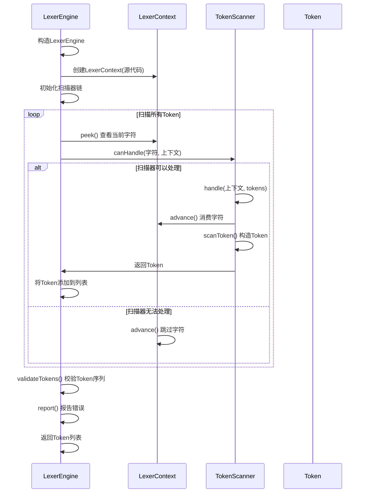
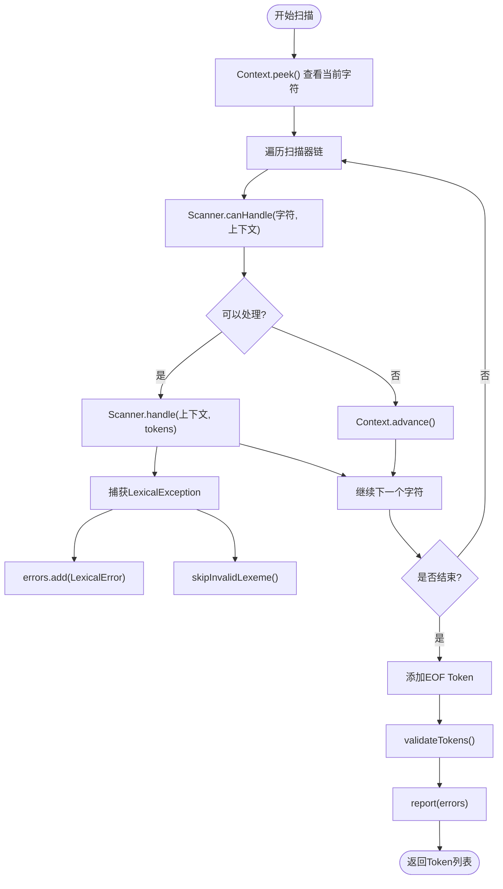
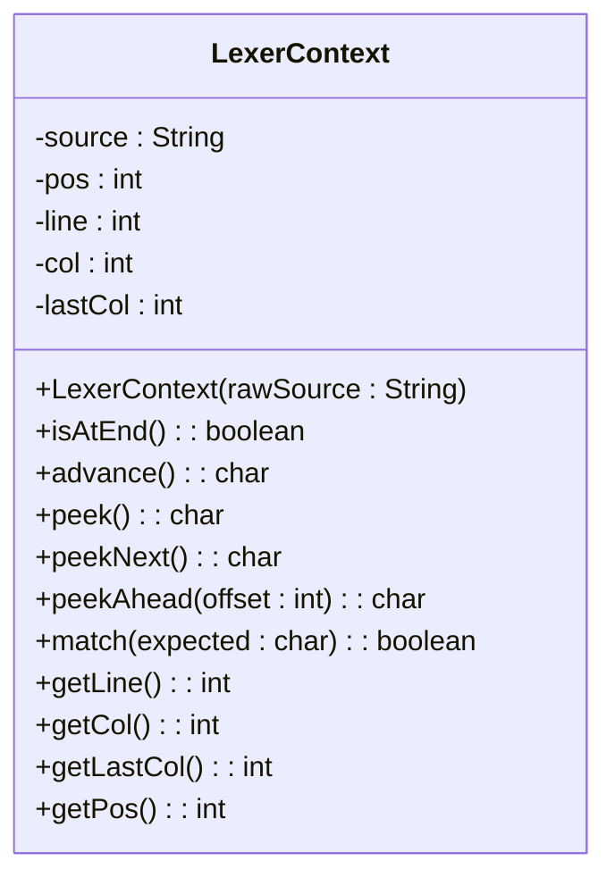
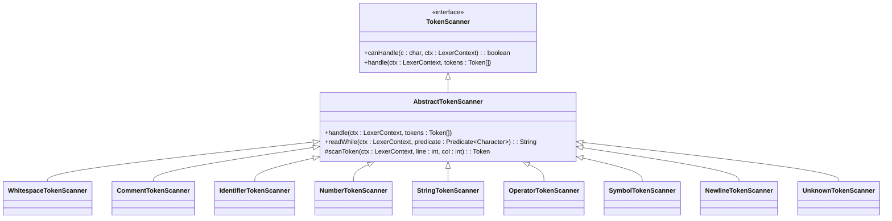
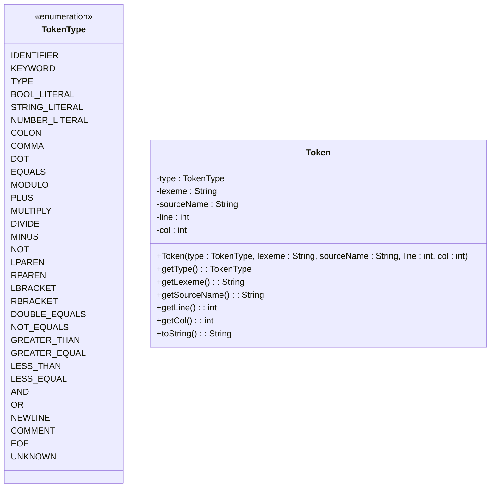
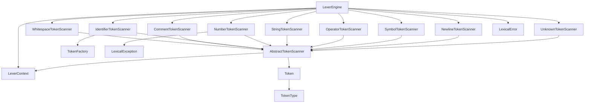

# 词法分析

<cite>
**本文档引用的文件**  
- [LexerEngine.java](file://src/main/java/org/jcnc/snow/compiler/lexer/core/LexerEngine.java)
- [LexerContext.java](file://src/main/java/org/jcnc/snow/compiler/lexer/core/LexerContext.java)
- [TokenScanner.java](file://src/main/java/org/jcnc/snow/compiler/lexer/base/TokenScanner.java)
- [AbstractTokenScanner.java](file://src/main/java/org/jcnc/snow/compiler/lexer/scanners/AbstractTokenScanner.java)
- [TokenType.java](file://src/main/java/org/jcnc/snow/compiler/lexer/token/TokenType.java)
- [Token.java](file://src/main/java/org/jcnc/snow/compiler/lexer/token/Token.java)
- [WhitespaceTokenScanner.java](file://src/main/java/org/jcnc/snow/compiler/lexer/scanners/WhitespaceTokenScanner.java)
- [CommentTokenScanner.java](file://src/main/java/org/jcnc/snow/compiler/lexer/scanners/CommentTokenScanner.java)
- [IdentifierTokenScanner.java](file://src/main/java/org/jcnc/snow/compiler/lexer/scanners/IdentifierTokenScanner.java)
- [NumberTokenScanner.java](file://src/main/java/org/jcnc/snow/compiler/lexer/scanners/NumberTokenScanner.java)
- [StringTokenScanner.java](file://src/main/java/org/jcnc/snow/compiler/lexer/scanners/StringTokenScanner.java)
- [OperatorTokenScanner.java](file://src/main/java/org/jcnc/snow/compiler/lexer/scanners/OperatorTokenScanner.java)
- [SymbolTokenScanner.java](file://src/main/java/org/jcnc/snow/compiler/lexer/scanners/SymbolTokenScanner.java)
- [NewlineTokenScanner.java](file://src/main/java/org/jcnc/snow/compiler/lexer/scanners/NewlineTokenScanner.java)
- [UnknownTokenScanner.java](file://src/main/java/org/jcnc/snow/compiler/lexer/scanners/UnknownTokenScanner.java)
- [LexicalError.java](file://src/main/java/org/jcnc/snow/compiler/lexer/core/LexicalError.java)
- [LexicalException.java](file://src/main/java/org/jcnc/snow/compiler/lexer/core/LexicalException.java)
</cite>

## 目录
1. [引言](#引言)
2. [项目结构](#项目结构)
3. [核心组件](#核心组件)
4. [架构概述](#架构概述)
5. [详细组件分析](#详细组件分析)
6. [依赖分析](#依赖分析)
7. [性能考虑](#性能考虑)
8. [故障排除指南](#故障排除指南)
9. [结论](#结论)

## 引言
本文档详细描述了Snow语言词法分析器的实现机制。重点阐述了`LexerEngine`如何将源代码字符流转换为Token流的完整流程，`LexerContext`作为字符流处理器的角色，以及`TokenScanner`扫描器链的工作机制。文档详细说明了`WhitespaceTokenScanner`、`CommentTokenScanner`等具体扫描器的职责划分与协作方式，Token类型系统（`TokenType`）的设计与分类，以及`LexicalError`错误报告机制的实现细节和常见词法错误的诊断方法。最后，文档还说明了如何扩展自定义`TokenScanner`以支持新的语法元素。

## 项目结构
Snow语言的词法分析器模块位于`src/main/java/org/jcnc/snow/compiler/lexer`目录下，采用清晰的分层设计。该模块主要由核心引擎、扫描器、Token定义和工具类四大部分组成。

**图源**
- [LexerEngine.java](file://src/main/java/org/jcnc/snow/compiler/lexer/core/LexerEngine.java#L1-L185)
- [LexerContext.java](file://src/main/java/org/jcnc/snow/compiler/lexer/core/LexerContext.java#L1-L162)
- [TokenScanner.java](file://src/main/java/org/jcnc/snow/compiler/lexer/base/TokenScanner.java#L1-L45)
- [AbstractTokenScanner.java](file://src/main/java/org/jcnc/snow/compiler/lexer/scanners/AbstractTokenScanner.java#L1-L64)
- [TokenType.java](file://src/main/java/org/jcnc/snow/compiler/lexer/token/TokenType.java#L1-L174)
- [Token.java](file://src/main/java/org/jcnc/snow/compiler/lexer/token/Token.java#L1-L50)

**本节来源**
- [LexerEngine.java](file://src/main/java/org/jcnc/snow/compiler/lexer/core/LexerEngine.java#L1-L185)
- [LexerContext.java](file://src/main/java/org/jcnc/snow/compiler/lexer/core/LexerContext.java#L1-L162)

## 核心组件
Snow词法分析器的核心由`LexerEngine`、`LexerContext`和`TokenScanner`接口构成。`LexerEngine`是词法分析的主控引擎，负责协调整个分析流程。`LexerContext`封装了源代码字符流及其位置信息，为所有扫描器提供统一的访问接口。`TokenScanner`接口定义了所有扫描器必须实现的行为规范，确保了扫描器链的统一性和可扩展性。

**本节来源**
- [LexerEngine.java](file://src/main/java/org/jcnc/snow/compiler/lexer/core/LexerEngine.java#L1-L185)
- [LexerContext.java](file://src/main/java/org/jcnc/snow/compiler/lexer/core/LexerContext.java#L1-L162)
- [TokenScanner.java](file://src/main/java/org/jcnc/snow/compiler/lexer/base/TokenScanner.java#L1-L45)

## 架构概述
Snow词法分析器采用“扫描器链（Chain of Scanners）+ 状态机（FSM）”的设计模式。其核心架构如图所示，`LexerEngine`作为主控引擎，维护一个`LexerContext`实例和一个`TokenScanner`扫描器链。分析过程从`LexerEngine`开始，它循环读取字符流，将每个字符依次交给扫描器链中的各个扫描器进行判断。一旦某个扫描器声明可以处理当前字符，`LexerEngine`就会将控制权交给该扫描器，由其完成一个完整Token的提取。

**图源**
- [LexerEngine.java](file://src/main/java/org/jcnc/snow/compiler/lexer/core/LexerEngine.java#L1-L185)
- [LexerContext.java](file://src/main/java/org/jcnc/snow/compiler/lexer/core/LexerContext.java#L1-L162)
- [TokenScanner.java](file://src/main/java/org/jcnc/snow/compiler/lexer/base/TokenScanner.java#L1-L45)

## 详细组件分析
本节将深入分析词法分析器的各个关键组件，包括核心引擎、上下文管理、扫描器机制和Token类型系统。

### LexerEngine分析
`LexerEngine`是词法分析过程的总调度器。它在构造时接收源代码字符串和源文件名，然后立即执行“扫描-校验-报告”三步流程。其核心方法`scanAllTokens()`实现了主扫描循环：通过`LexerContext`的`peek()`方法查看当前字符，然后遍历预定义的扫描器链，调用每个扫描器的`canHandle()`方法进行判断。一旦找到能处理的扫描器，就调用其`handle()`方法，并通过异常捕获机制将`LexicalException`转换为`LexicalError`，确保分析过程的健壮性。

**图源**
- [LexerEngine.java](file://src/main/java/org/jcnc/snow/compiler/lexer/core/LexerEngine.java#L1-L185)

**本节来源**
- [LexerEngine.java](file://src/main/java/org/jcnc/snow/compiler/lexer/core/LexerEngine.java#L1-L185)

### LexerContext分析
`LexerContext`是词法分析的基础设施，它封装了源代码字符流，并提供了丰富的操作接口。其主要职责包括：1) 管理字符流的读取位置（`pos`）；2) 追踪当前的行列号（`line`, `col`），并自动在遇到换行符时更新；3) 提供`advance()`、`peek()`、`peekNext()`和`peekAhead()`等方法，支持向前查看而不移动游标；4) 在构造时将Windows风格的换行符`\r\n`统一转换为Unix风格的`\n`，确保跨平台一致性。

**图源**
- [LexerContext.java](file://src/main/java/org/jcnc/snow/compiler/lexer/core/LexerContext.java#L1-L162)

**本节来源**
- [LexerContext.java](file://src/main/java/org/jcnc/snow/compiler/lexer/core/LexerContext.java#L1-L162)

### TokenScanner机制分析
`TokenScanner`接口定义了所有扫描器的统一行为规范，其核心是`canHandle()`和`handle()`两个方法。`AbstractTokenScanner`作为抽象基类，实现了`handle()`方法的模板逻辑：先获取当前行列号，然后调用抽象的`scanToken()`方法，最后将生成的Token添加到结果列表中。这种设计模式（模板方法模式）极大地简化了具体扫描器的实现，使开发者只需专注于`scanToken()`中的核心扫描逻辑。

**图源**
- [TokenScanner.java](file://src/main/java/org/jcnc/snow/compiler/lexer/base/TokenScanner.java#L1-L45)
- [AbstractTokenScanner.java](file://src/main/java/org/jcnc/snow/compiler/lexer/scanners/AbstractTokenScanner.java#L1-L64)

**本节来源**
- [TokenScanner.java](file://src/main/java/org/jcnc/snow/compiler/lexer/base/TokenScanner.java#L1-L45)
- [AbstractTokenScanner.java](file://src/main/java/org/jcnc/snow/compiler/lexer/scanners/AbstractTokenScanner.java#L1-L64)

### Token类型系统分析
`TokenType`枚举定义了Snow语言中所有可能的Token类型，是词法分析的核心分类系统。它将Token分为基础类型（如`IDENTIFIER`、`KEYWORD`）、字面量（如`STRING_LITERAL`、`NUMBER_LITERAL`）、分隔符（如`COMMA`、`COLON`）、运算符（如`PLUS`、`AND`）和特殊符号（如`NEWLINE`、`EOF`）等几大类。`Token`类则封装了Token的具体信息，包括类型、词素（`lexeme`）、源文件名、行号和列号，为后续的语法分析和错误报告提供了完整的上下文信息。

**图源**
- [TokenType.java](file://src/main/java/org/jcnc/snow/compiler/lexer/token/TokenType.java#L1-L174)
- [Token.java](file://src/main/java/org/jcnc/snow/compiler/lexer/token/Token.java#L1-L50)

**本节来源**
- [TokenType.java](file://src/main/java/org/jcnc/snow/compiler/lexer/token/TokenType.java#L1-L174)
- [Token.java](file://src/main/java/org/jcnc/snow/compiler/lexer/token/Token.java#L1-L50)

### 具体扫描器分析
本节分析几种关键的具体扫描器实现。

#### WhitespaceTokenScanner与CommentTokenScanner
`WhitespaceTokenScanner`和`CommentTokenScanner`负责处理源代码中的空白字符和注释。它们的`canHandle()`方法分别检查当前字符是否为空白字符或注释起始符（`#`）。一旦匹配，它们会调用`readWhile()`工具方法，连续读取所有连续的空白字符或直到行尾的注释内容。这些Token通常在后续的语法分析阶段被忽略，但保留它们有助于保持源代码的原始结构和进行精确的错误定位。

**本节来源**
- [WhitespaceTokenScanner.java](file://src/main/java/org/jcnc/snow/compiler/lexer/scanners/WhitespaceTokenScanner.java#L1-L30)
- [CommentTokenScanner.java](file://src/main/java/org/jcnc/snow/compiler/lexer/scanners/CommentTokenScanner.java#L1-L40)

#### IdentifierTokenScanner与NumberTokenScanner
`IdentifierTokenScanner`负责识别标识符和关键字。它首先检查字符是否为字母或下划线，然后调用`readWhile()`读取所有后续的字母、数字或下划线。最后，通过`TokenFactory`判断该词素是否为关键字，并返回相应的`TokenType`。`NumberTokenScanner`则采用有限状态机（FSM）来解析数字字面量，支持整数、小数和带后缀的数字（如`2.0f`），确保了数字解析的准确性和可扩展性。

**本节来源**
- [IdentifierTokenScanner.java](file://src/main/java/org/jcnc/snow/compiler/lexer/scanners/IdentifierTokenScanner.java#L1-L29)
- [NumberTokenScanner.java](file://src/main/java/org/jcnc/snow/compiler/lexer/scanners/NumberTokenScanner.java#L1-L33)

#### StringTokenScanner与OperatorTokenScanner
`StringTokenScanner`处理由双引号包围的字符串字面量，并支持常见的转义字符（如`\n`、`\"`）。它通过一个简单的状态机来区分普通字符和转义序列。`OperatorTokenScanner`则负责识别各种运算符和符号，如`+`、`==`、`&&`等。它通过检查当前字符和下一个字符（`peekNext()`）来区分单字符和双字符运算符，确保了运算符识别的准确性。

**本节来源**
- [StringTokenScanner.java](file://src/main/java/org/jcnc/snow/compiler/lexer/scanners/StringTokenScanner.java#L1-L38)
- [OperatorTokenScanner.java](file://src/main/java/org/jcnc/snow/compiler/lexer/scanners/OperatorTokenScanner.java#L1-L35)

## 依赖分析
词法分析器模块内部组件之间存在紧密的依赖关系。`LexerEngine`直接依赖`LexerContext`和所有`TokenScanner`实现类。所有扫描器都依赖`LexerContext`来访问字符流，并依赖`Token`和`TokenType`来构建结果。`AbstractTokenScanner`作为基类，被所有具体扫描器继承，形成了清晰的继承层次。这种设计实现了高内聚、低耦合，使得添加新的扫描器变得非常简单。

**图源**
- [LexerEngine.java](file://src/main/java/org/jcnc/snow/compiler/lexer/core/LexerEngine.java#L1-L185)
- [AbstractTokenScanner.java](file://src/main/java/org/jcnc/snow/compiler/lexer/scanners/AbstractTokenScanner.java#L1-L64)

**本节来源**
- [LexerEngine.java](file://src/main/java/org/jcnc/snow/compiler/lexer/core/LexerEngine.java#L1-L185)
- [AbstractTokenScanner.java](file://src/main/java/org/jcnc/snow/compiler/lexer/scanners/AbstractTokenScanner.java#L1-L64)

## 性能考虑
Snow词法分析器的设计在性能方面进行了优化。首先，`LexerContext`将源代码字符串存储在内存中，避免了I/O开销。其次，`scanAllTokens()`方法采用单次遍历的方式，时间复杂度为O(n)，其中n是源代码的字符数。扫描器链的顺序经过精心设计，将最常见的情况（如空白字符、标识符）放在前面，以减少平均判断次数。此外，`readWhile()`等工具方法使用`StringBuilder`高效地构建字符串，避免了频繁的字符串拼接操作。

## 故障排除指南
词法分析器通过`LexicalError`类报告错误。`LexerEngine`采用“先扫描，后报告”的策略，将所有错误收集在`errors`列表中，最后统一输出。这避免了因单个错误而中断整个分析过程。`skipInvalidLexeme()`方法是错误恢复的关键，它会跳过无法识别的字符序列，防止错误扩散。常见的词法错误包括：非法字符、不完整的字符串字面量、数字格式错误等。通过查看`LexicalError`中的行列号信息，可以精确定位错误位置。

**本节来源**
- [LexerEngine.java](file://src/main/java/org/jcnc/snow/compiler/lexer/core/LexerEngine.java#L1-L185)
- [LexicalError.java](file://src/main/java/org/jcnc/snow/compiler/lexer/core/LexicalError.java#L1-L20)
- [LexicalException.java](file://src/main/java/org/jcnc/snow/compiler/lexer/core/LexicalException.java#L1-L15)

## 结论
Snow语言的词法分析器采用模块化、可扩展的设计，通过`LexerEngine`、`LexerContext`和`TokenScanner`链的协同工作，高效地将源代码转换为结构化的Token流。其“扫描器链+状态机”的架构清晰、易于维护和扩展。通过分析源码，我们可以看到其设计的精巧之处，如统一的上下文管理、模板方法模式的应用、以及健壮的错误处理机制。该词法分析器为Snow编译器的后续阶段（如语法分析和语义分析）提供了坚实可靠的基础。