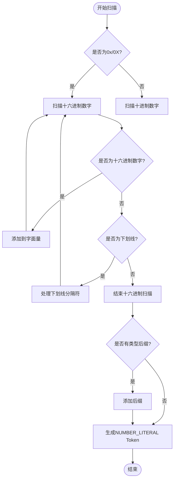
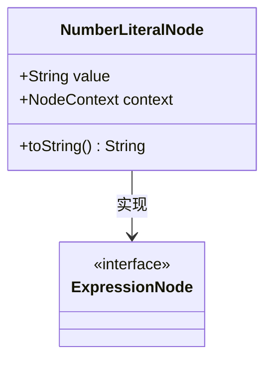
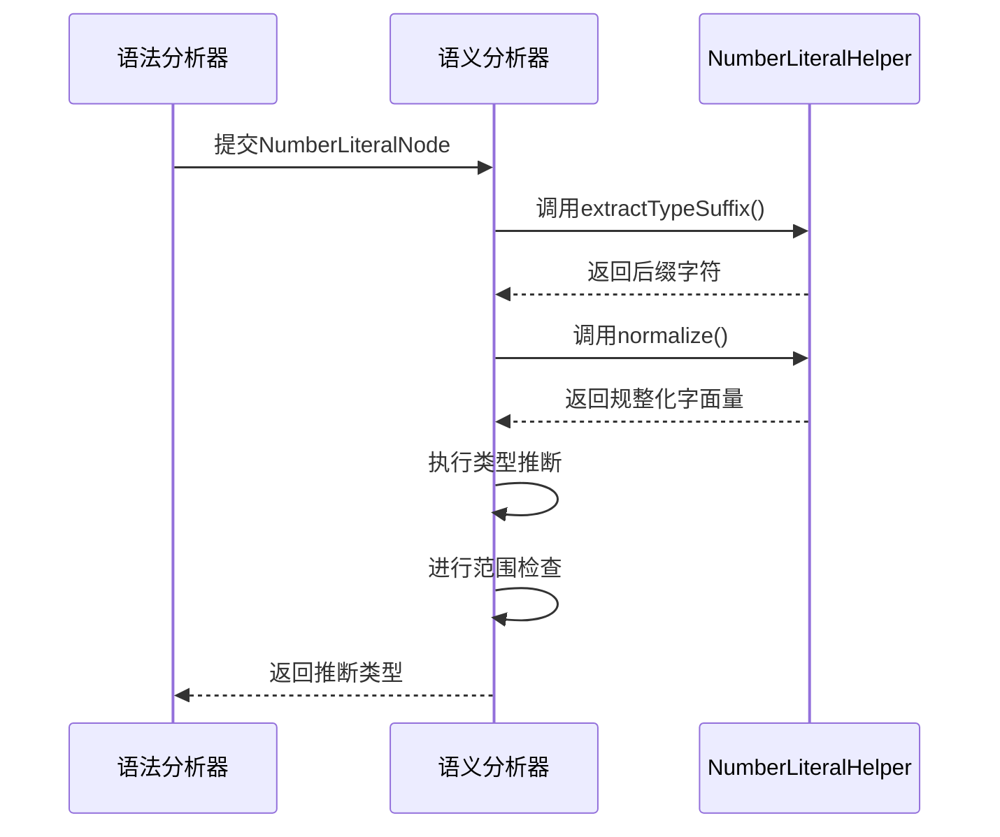

# 十六进制字面量支持

<cite>
**本文档引用的文件**  
- [NumberTokenScanner.java](file://src/main/java/org/jcnc/snow/compiler/lexer/scanners/NumberTokenScanner.java)
- [NumberLiteralHelper.java](file://src/main/java/org/jcnc/snow/compiler/common/NumberLiteralHelper.java)
- [NumberLiteralNode.java](file://src/main/java/org/jcnc/snow/compiler/parser/ast/NumberLiteralNode.java)
- [NumberLiteralHandler.java](file://src/main/java/org/jcnc/snow/compiler/ir/builder/handlers/NumberLiteralHandler.java)
- [NumberLiteralAnalyzer.java](file://src/main/java/org/jcnc/snow/compiler/semantic/analyzers/expression/NumberLiteralAnalyzer.java)
- [ExpressionUtils.java](file://src/main/java/org/jcnc/snow/compiler/ir/utils/ExpressionUtils.java)
</cite>

## 目录
1. [简介](#简介)
2. [词法分析阶段](#词法分析阶段)
3. [语法分析阶段](#语法分析阶段)
4. [语义分析阶段](#语义分析阶段)
5. [中间表示生成阶段](#中间表示生成阶段)
6. [十六进制字面量处理流程](#十六进制字面量处理流程)
7. [错误处理与验证](#错误处理与验证)
8. [总结](#总结)

## 简介
本项目实现了对十六进制字面量的完整支持，从词法分析到中间表示生成的整个编译流程中，十六进制数字（以0x或0X开头）被正确识别、解析和处理。该功能允许开发者在源代码中使用十六进制表示法来定义整数常量，如`0xFF`、`0x1A2B`等，增强了语言的表达能力和灵活性。

## 词法分析阶段
在词法分析阶段，`NumberTokenScanner`类负责识别和处理数字字面量，包括十六进制格式。当扫描器遇到以'0'开头且后跟'x'或'X'的字符序列时，会触发十六进制字面量的专用处理逻辑。



**图示来源**  
- [NumberTokenScanner.java](file://src/main/java/org/jcnc/snow/compiler/lexer/scanners/NumberTokenScanner.java#L263-L316)

**本节来源**  
- [NumberTokenScanner.java](file://src/main/java/org/jcnc/snow/compiler/lexer/scanners/NumberTokenScanner.java#L82-L84)

## 语法分析阶段
在语法分析阶段，`NumberLiteralParselet`将词法分析器生成的`NUMBER_LITERAL` Token转换为抽象语法树（AST）中的`NumberLiteralNode`节点。这个节点以字符串形式存储原始的字面量值，为后续的语义分析提供基础。



**图示来源**  
- [NumberLiteralNode.java](file://src/main/java/org/jcnc/snow/compiler/parser/ast/NumberLiteralNode.java#L17-L20)

**本节来源**  
- [NumberLiteralParselet.java](file://src/main/java/org/jcnc/snow/compiler/parser/expression/NumberLiteralParselet.java#L27-L28)
- [NumberLiteralNode.java](file://src/main/java/org/jcnc/snow/compiler/parser/ast/NumberLiteralNode.java#L17-L20)

## 语义分析阶段
语义分析阶段由`NumberLiteralAnalyzer`负责，它对`NumberLiteralNode`进行类型推断和范围检查。对于十六进制字面量，分析器会根据上下文类型或字面量特征自动推断其具体类型（如int、long等）。



**图示来源**  
- [NumberLiteralAnalyzer.java](file://src/main/java/org/jcnc/snow/compiler/semantic/analyzers/expression/NumberLiteralAnalyzer.java#L241-L254)
- [NumberLiteralHelper.java](file://src/main/java/org/jcnc/snow/compiler/common/NumberLiteralHelper.java#L83-L95)

**本节来源**  
- [NumberLiteralAnalyzer.java](file://src/main/java/org/jcnc/snow/compiler/semantic/analyzers/expression/NumberLiteralAnalyzer.java#L241-L254)

## 中间表示生成阶段
在中间表示（IR）生成阶段，`NumberLiteralHandler`将`NumberLiteralNode`转换为IR指令。它利用`ExpressionUtils`中的工具方法来构建相应的`IRConstant`，并生成`LoadConstInstruction`指令。

```mermaid
flowchart LR
A[NumberLiteralNode] --> B{是否为十六进制?}
B --> |是| C[调用NumberLiteralHelper.parseIntLiteral()]
B --> |否| D[常规数字解析]
C --> E[创建IRConstant]
D --> E
E --> F[分配虚拟寄存器]
F --> G[生成LoadConstInstruction]
G --> H[添加到IR程序]
```

**图示来源**  
- [NumberLiteralHandler.java](file://src/main/java/org/jcnc/snow/compiler/ir/builder/handlers/NumberLiteralHandler.java#L26-L32)
- [ExpressionUtils.java](file://src/main/java/org/jcnc/snow/compiler/ir/utils/ExpressionUtils.java#L64-L108)

**本节来源**  
- [NumberLiteralHandler.java](file://src/main/java/org/jcnc/snow/compiler/ir/builder/handlers/NumberLiteralHandler.java#L26-L32)

## 十六进制字面量处理流程
十六进制字面量的完整处理流程涉及多个组件的协同工作。从源代码中的`0xFF`到最终的IR常量，整个过程如下：

```mermaid
graph TD
A[源代码: 0xFF] --> B(NumberTokenScanner)
B --> C{识别为十六进制}
C --> |是| D[调用scanHexLiteral()]
D --> E[验证十六进制字符]
E --> F[生成NUMBER_LITERAL Token]
F --> G(NumberLiteralParselet)
G --> H[创建NumberLiteralNode]
H --> I(NumberLiteralAnalyzer)
I --> J[提取后缀并规整]
J --> K[类型推断]
K --> L(NumberLiteralHandler)
L --> M[构建IRConstant]
M --> N[生成LoadConstInstruction]
N --> O[最终IR程序]
```

**图示来源**  
- [NumberTokenScanner.java](file://src/main/java/org/jcnc/snow/compiler/lexer/scanners/NumberTokenScanner.java#L266-L316)
- [NumberLiteralHelper.java](file://src/main/java/org/jcnc/snow/compiler/common/NumberLiteralHelper.java#L33-L55)
- [ExpressionUtils.java](file://src/main/java/org/jcnc/snow/compiler/ir/utils/ExpressionUtils.java#L64-L108)

**本节来源**  
- [NumberTokenScanner.java](file://src/main/java/org/jcnc/snow/compiler/lexer/scanners/NumberTokenScanner.java#L82-L84)
- [NumberLiteralHelper.java](file://src/main/java/org/jcnc/snow/compiler/common/NumberLiteralHelper.java#L33-L55)

## 错误处理与验证
系统对十六进制字面量的格式和内容进行了严格的验证，确保代码的正确性。主要的错误检查包括：

- **起始验证**：必须以`0x`或`0X`开头
- **字符验证**：只能包含0-9、a-f、A-F的十六进制数字
- **下划线规则**：不能以下划线开头或结尾，不能有连续的下划线
- **后缀验证**：支持的类型后缀（如l、f、d）只能出现一次

这些验证规则在`NumberTokenScanner`和`NumberLiteralHelper`中实现，确保了十六进制字面量的语法正确性。

**本节来源**  
- [NumberTokenScanner.java](file://src/main/java/org/jcnc/snow/compiler/lexer/scanners/NumberTokenScanner.java#L274-L295)
- [NumberLiteralHelper.java](file://src/main/java/org/jcnc/snow/compiler/common/NumberLiteralHelper.java#L103-L107)

## 总结
本项目通过`NumberTokenScanner`、`NumberLiteralHelper`、`NumberLiteralAnalyzer`和`NumberLiteralHandler`等组件的协同工作，实现了对十六进制字面量的完整支持。从词法分析到中间表示生成，每个阶段都对十六进制格式进行了正确的处理和验证，确保了编译器能够准确地解析和处理十六进制数字常量。这一功能的实现增强了语言的表达能力，使开发者能够更灵活地使用不同的数字表示法。