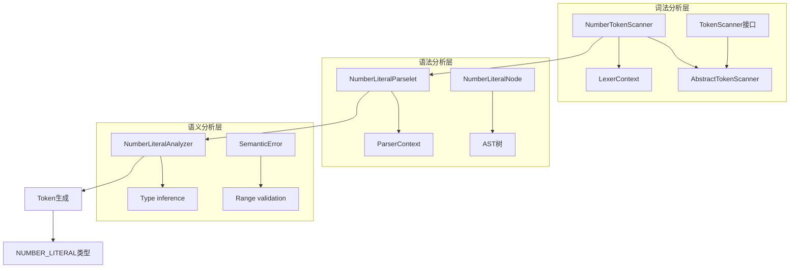
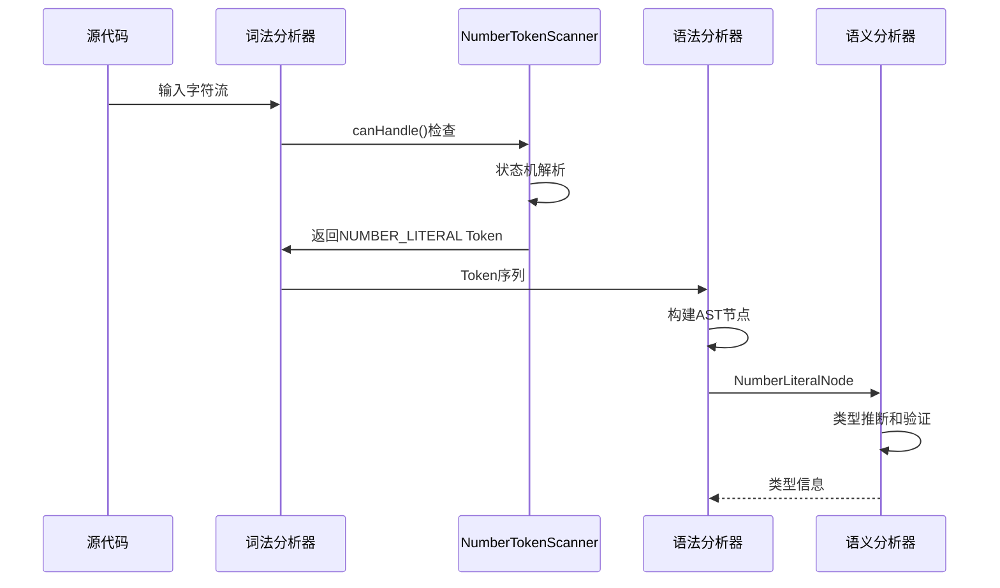
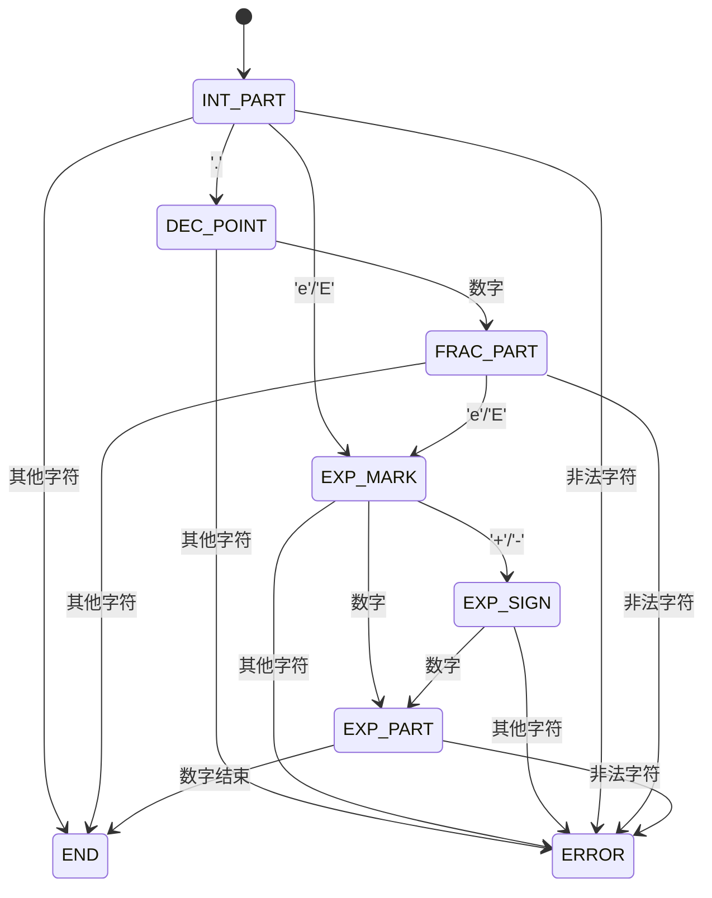
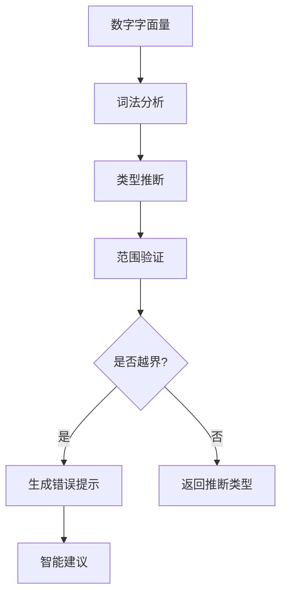

# 科学计数法数字扫描

<cite>
**本文档引用的文件**
- [NumberTokenScanner.java](file://src/main/java/org/jcnc/snow/compiler/lexer/scanners/NumberTokenScanner.java)
- [TokenScanner.java](file://src/main/java/org/jcnc/snow/compiler/lexer/base/TokenScanner.java)
- [LexerContext.java](file://src/main/java/org/jcnc/snow/compiler/lexer/core/LexerContext.java)
- [TokenType.java](file://src/main/java/org/jcnc/snow/compiler/lexer/token/TokenType.java)
- [Token.java](file://src/main/java/org/jcnc/snow/compiler/lexer/token/Token.java)
- [NumberLiteralAnalyzer.java](file://src/main/java/org/jcnc/snow/compiler/semantic/analyzers/expression/NumberLiteralAnalyzer.java)
- [NumberLiteralParselet.java](file://src/main/java/org/jcnc/snow/compiler/parser/expression/NumberLiteralParselet.java)
</cite>

## 目录
1. [简介](#简介)
2. [项目结构](#项目结构)
3. [核心组件](#核心组件)
4. [架构概览](#架构概览)
5. [详细组件分析](#详细组件分析)
6. [科学计数法支持](#科学计数法支持)
7. [错误处理机制](#错误处理机制)
8. [性能考虑](#性能考虑)
9. [故障排除指南](#故障排除指南)
10. [结论](#结论)

## 简介

Snow编译器的科学计数法数字扫描功能是一个基于有限状态机（FSM）的词法分析器组件，专门负责识别和解析源代码中的科学计数法数字字面量。该功能支持标准的科学计数法表示，包括正负指数、小数部分以及各种类型后缀。

科学计数法数字扫描器能够处理以下格式的数字：
- 基本整数：`123`, `42`, `0`
- 十进制小数：`3.14`, `0.5`
- 科学计数法：`1e3`, `-2.5E-4`, `6.02e23`
- 类型后缀：`2.0f`, `255B`

## 项目结构

Snow编译器采用模块化设计，科学计数法数字扫描功能分布在词法分析器的不同层次中：

**图表来源**
- [NumberTokenScanner.java](file://src/main/java/org/jcnc/snow/compiler/lexer/scanners/NumberTokenScanner.java#L48-L286)
- [TokenScanner.java](file://src/main/java/org/jcnc/snow/compiler/lexer/base/TokenScanner.java#L20-L46)

## 核心组件

### NumberTokenScanner类

`NumberTokenScanner`是科学计数法数字扫描的核心实现，继承自`AbstractTokenScanner`，实现了基于有限状态机的数字解析算法。

#### 主要特性
- **状态机驱动**：使用五个核心状态处理不同类型的数字结构
- **下划线支持**：支持数字中的下划线分隔符（指数部分除外）
- **类型后缀**：支持单字符类型后缀（b, s, l, f, d）
- **错误检测**：严格的语法验证和错误报告机制

#### 支持的状态
- `INT_PART`：整数部分扫描
- `DEC_POINT`：小数点后等待数字
- `FRAC_PART`：小数部分扫描  
- `EXP_MARK`：指数标记'e/E'后
- `EXP_SIGN`：指数符号'+'/'-'后
- `EXP_PART`：指数数字部分
- `END`：主体扫描结束

**章节来源**
- [NumberTokenScanner.java](file://src/main/java/org/jcnc/snow/compiler/lexer/scanners/NumberTokenScanner.java#L48-L286)

## 架构概览

科学计数法数字扫描的整体架构遵循编译器前端的标准流程：

**图表来源**
- [LexerContext.java](file://src/main/java/org/jcnc/snow/compiler/lexer/core/LexerContext.java#L20-L163)
- [NumberTokenScanner.java](file://src/main/java/org/jcnc/snow/compiler/lexer/scanners/NumberTokenScanner.java#L79-L251)

## 详细组件分析

### 有限状态机实现

科学计数法数字扫描器的核心是一个复杂的有限状态机，能够处理各种数字格式的转换：

**图表来源**
- [NumberTokenScanner.java](file://src/main/java/org/jcnc/snow/compiler/lexer/scanners/NumberTokenScanner.java#L256-L285)

### 数字解析算法

数字解析过程包含三个主要阶段：

#### 1. 主体扫描阶段
- **整数部分**：处理基本整数和小数点前的数字
- **小数部分**：处理小数点后的数字序列
- **指数部分**：处理科学计数法的指数标记和数值

#### 2. 后缀检查阶段
- 验证类型后缀的合法性
- 检查后缀后的非法字符
- 处理标识符冲突情况

#### 3. Token生成阶段
- 移除下划线字符
- 创建NUMBER_LITERAL类型的Token
- 设置正确的行列位置信息

**章节来源**
- [NumberTokenScanner.java](file://src/main/java/org/jcnc/snow/compiler/lexer/scanners/NumberTokenScanner.java#L80-L251)

## 科学计数法支持

### 基本科学计数法格式

科学计数法数字扫描器支持以下格式：

| 格式 | 示例 | 描述 |
|------|------|------|
| 基本指数 | `1e3` | 1 × 10³ |
| 负指数 | `1e-3` | 1 × 10⁻³ |
| 小数指数 | `2.5E-4` | 2.5 × 10⁻⁴ |
| 负数指数 | `-3.14e+2` | -3.14 × 10² |

### 指数处理规则

指数部分的处理遵循严格的规则：

1. **指数标记**：必须是'e'或'E'
2. **可选符号**：指数可以带有'+'或'-'符号
3. **必需数字**：指数部分必须包含至少一个数字
4. **位置限制**：下划线不能出现在指数标记前

### 特殊处理场景

#### 负数科学计数法
- 支持负数的科学计数法表示
- 符号位置不影响指数解析
- 如：`-2.5e3` 和 `2.5e-3`

#### 零值处理
- 支持科学计数法的零值表示
- 如：`0e3` 表示 0 × 10³ = 0
- 非零文本但零值的情况会被特殊标记

**章节来源**
- [NumberTokenScanner.java](file://src/main/java/org/jcnc/snow/compiler/lexer/scanners/NumberTokenScanner.java#L113-L201)

## 错误处理机制

科学计数法数字扫描器实现了全面的错误检测和报告机制：

### 错误类型分类

| 错误类型 | 触发条件 | 错误消息示例 |
|----------|----------|--------------|
| 数字格式错误 | 非法数字组合 | "指数标记前必须是合法数字" |
| 下划线错误 | 下划线位置不当 | "数字中下划线不能连续出现" |
| 小数点错误 | 小数点后缺失数字 | "小数点后必须跟数字" |
| 后缀错误 | 后缀后接非法字符 | "数字类型后缀只能是单字符" |
| 指数错误 | 指数部分不完整 | "指数部分缺少数字" |

### 错误恢复策略

1. **即时抛出**：发现错误立即抛出`LexicalException`
2. **位置信息**：提供准确的行列号定位
3. **上下文信息**：包含错误发生的源代码片段
4. **智能提示**：提供可能的修复建议

### 语义分析层验证

除了词法分析阶段的验证，语义分析器还进行额外的范围检查：

**图表来源**
- [NumberLiteralAnalyzer.java](file://src/main/java/org/jcnc/snow/compiler/semantic/analyzers/expression/NumberLiteralAnalyzer.java#L260-L361)

**章节来源**
- [NumberTokenScanner.java](file://src/main/java/org/jcnc/snow/compiler/lexer/scanners/NumberTokenScanner.java#L114-L213)

## 性能考虑

### 状态机优化

科学计数法数字扫描器采用了多项性能优化措施：

1. **单次遍历**：整个数字解析过程只需要一次字符遍历
2. **状态缓存**：避免重复的状态检查和转换
3. **早期终止**：发现错误时立即停止解析
4. **内存效率**：使用StringBuilder进行高效的字符串构建

### 时间复杂度分析

- **最佳情况**：O(1)，对于简单的整数或小数
- **平均情况**：O(n)，n为数字字符数
- **最坏情况**：O(n)，需要处理完整的科学计数法格式

### 空间复杂度

- **状态空间**：固定大小的枚举状态
- **字符缓冲**：O(n)的StringBuilder存储
- **临时变量**：常数级的布尔标志和计数器

## 故障排除指南

### 常见问题诊断

#### 问题1：科学计数法解析失败
**症状**：编译器报告数字格式错误
**可能原因**：
- 指数标记前没有数字
- 指数部分缺少数字
- 下划线位置不当

**解决方案**：
检查数字格式是否符合科学计数法规范

#### 问题2：类型推断错误
**症状**：语义分析阶段报告类型错误
**可能原因**：
- 数字超出目标类型的表示范围
- 后缀使用不当

**解决方案**：
- 检查数字是否在目标类型范围内
- 确认类型后缀的正确使用

#### 问题3：下划线处理问题
**症状**：下划线导致解析错误
**可能原因**：
- 下划线出现在不允许的位置
- 连续下划线

**解决方案**：
- 移除非法位置的下划线
- 避免连续下划线

### 调试技巧

1. **启用详细日志**：查看词法分析过程中的状态转换
2. **检查Token输出**：验证生成的Token是否符合预期
3. **逐步验证**：从简单数字开始，逐步增加复杂性

**章节来源**
- [NumberTokenScanner.java](file://src/main/java/org/jcnc/snow/compiler/lexer/scanners/NumberTokenScanner.java#L40-L46)

## 结论

Snow编译器的科学计数法数字扫描功能是一个设计精良、功能完备的词法分析组件。它通过有限状态机实现了对科学计数法数字的全面支持，包括：

### 主要优势
- **完整性**：支持所有标准的科学计数法格式
- **健壮性**：完善的错误检测和报告机制
- **性能**：高效的单次遍历解析算法
- **可扩展性**：模块化设计便于功能扩展

### 技术特点
- 基于有限状态机的确定性解析
- 严格的语法验证和错误处理
- 支持下划线分隔符和类型后缀
- 与语义分析器的紧密集成

### 应用价值
该功能为Snow编程语言提供了强大的数值处理能力，支持科学计算、工程应用等领域的复杂数值表达需求。其设计模式和实现技术也为其他编译器项目的词法分析器开发提供了有价值的参考。