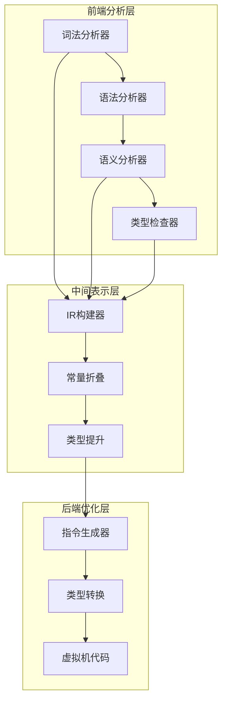
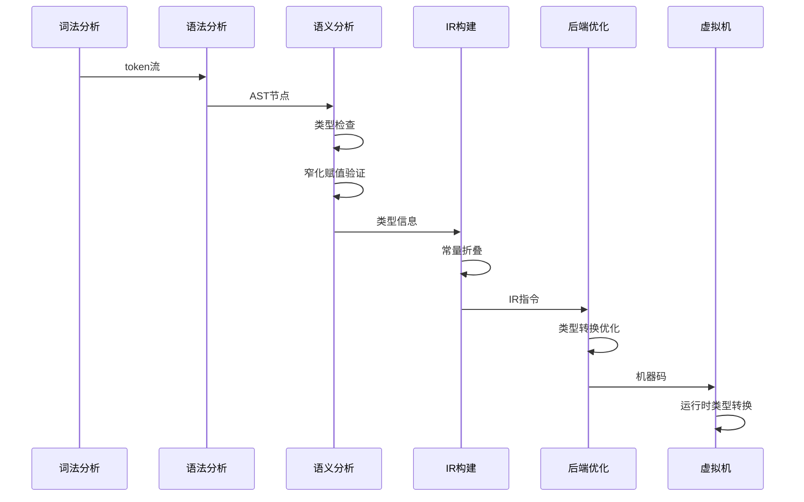
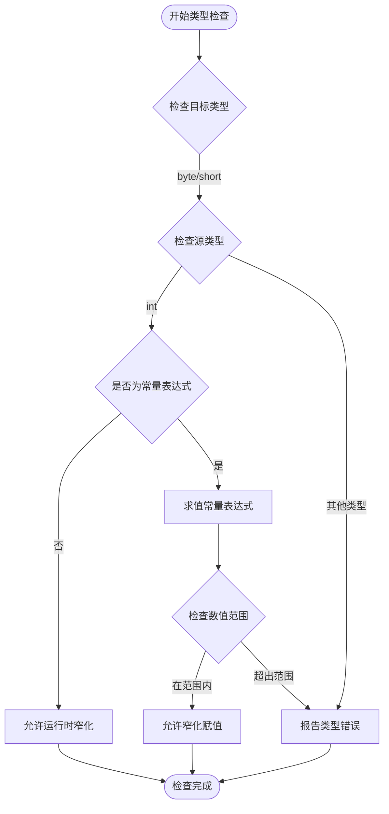
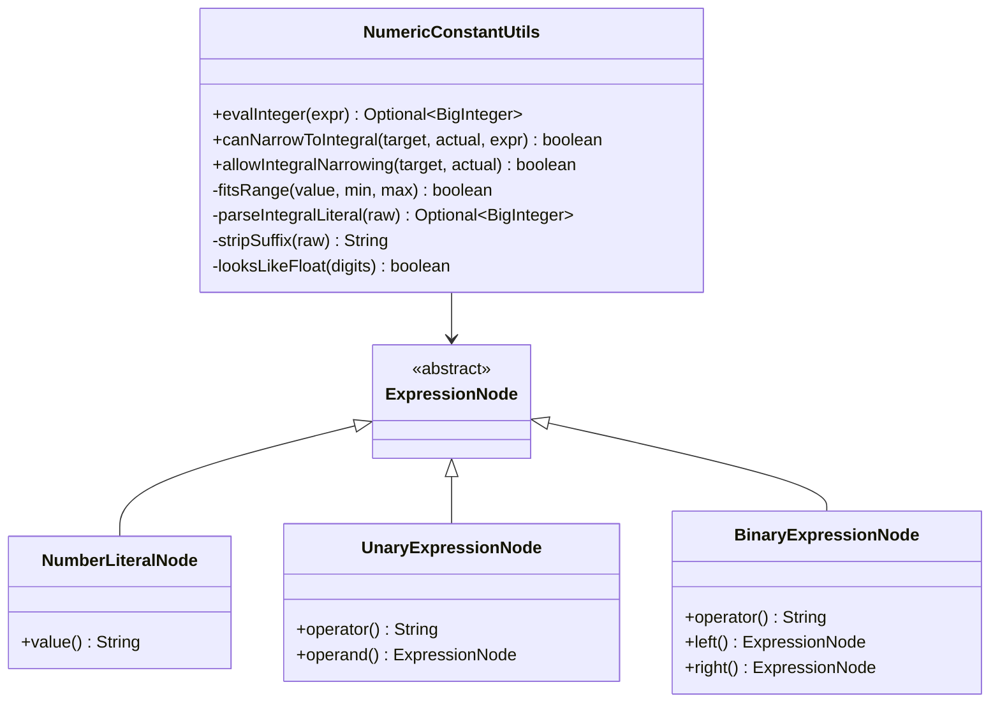
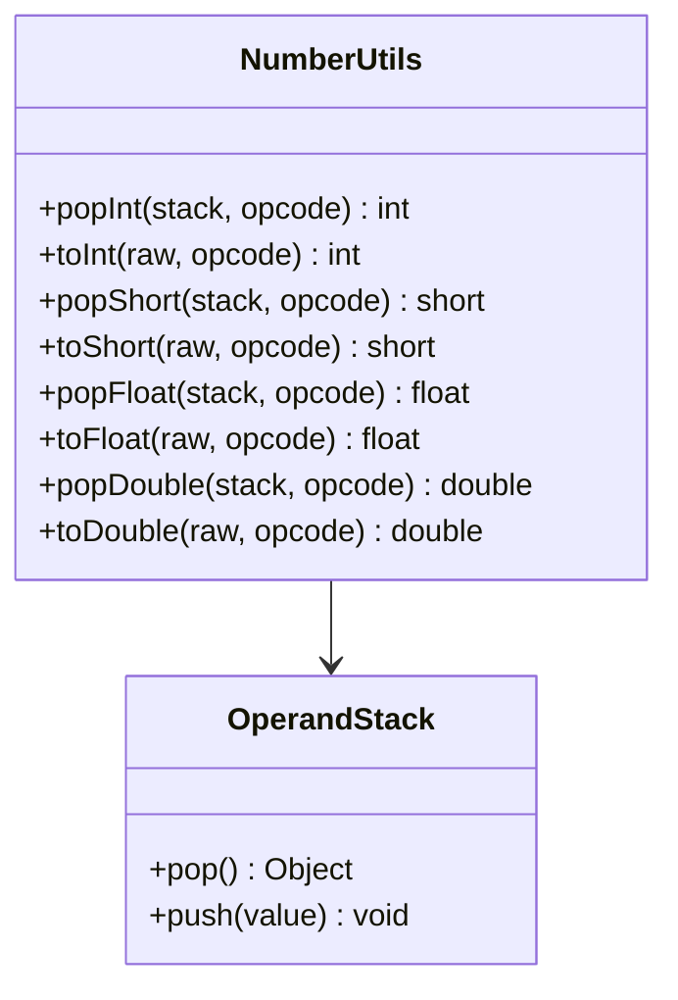
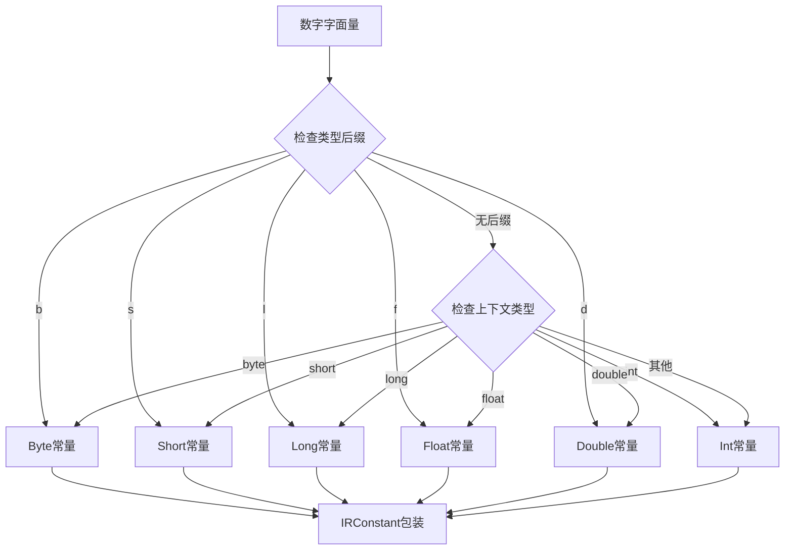
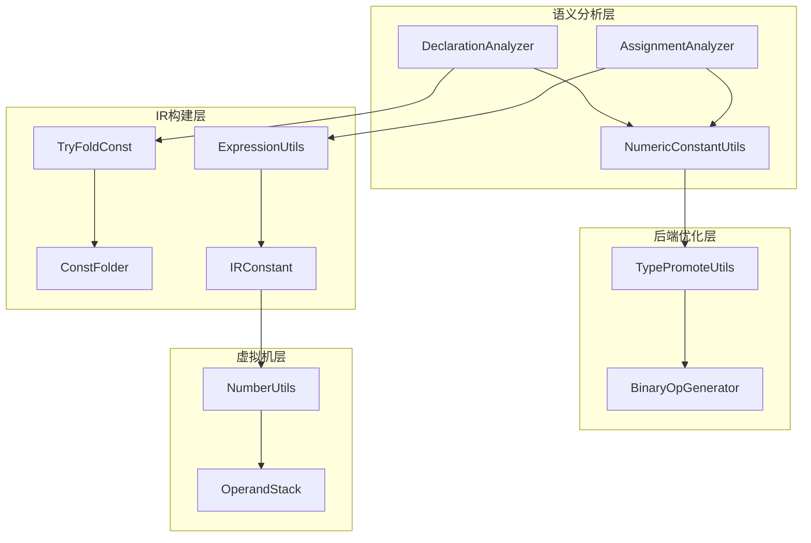

# 数值常量窄化赋值

<cite>
**本文档中引用的文件**
- [NumericConstantUtils.java](file://src/main/java/org/jcnc/snow/compiler/semantic/utils/NumericConstantUtils.java)
- [TypePromoteUtils.java](file://src/main/java/org/jcnc/snow/compiler/backend/utils/TypePromoteUtils.java)
- [TryFoldConst.java](file://src/main/java/org/jcnc/snow/compiler/ir/builder/utils/TryFoldConst.java)
- [ConstFolder.java](file://src/main/java/org/jcnc/snow/compiler/ir/builder/statement/utils/ConstFolder.java)
- [DeclarationAnalyzer.java](file://src/main/java/org/jcnc/snow/compiler/semantic/analyzers/statement/DeclarationAnalyzer.java)
- [AssignmentAnalyzer.java](file://src/main/java/org/jcnc/snow/compiler/semantic/analyzers/statement/AssignmentAnalyzer.java)
- [ExpressionUtils.java](file://src/main/java/org/jcnc/snow/compiler/ir/utils/ExpressionUtils.java)
- [IRConstant.java](file://src/main/java/org/jcnc/snow/compiler/ir/value/IRConstant.java)
- [NumberUtils.java](file://src/main/java/org/jcnc/snow/vm/utils/NumberUtils.java)
- [BuiltinType.java](file://src/main/java/org/jcnc/snow/compiler/semantic/type/BuiltinType.java)
- [Type.java](file://src/main/java/org/jcnc/snow/compiler/semantic/type/Type.java)
</cite>

## 目录
1. [简介](#简介)
2. [项目结构概述](#项目结构概述)
3. [核心组件分析](#核心组件分析)
4. [架构概览](#架构概览)
5. [详细组件分析](#详细组件分析)
6. [依赖关系分析](#依赖关系分析)
7. [性能考虑](#性能考虑)
8. [故障排除指南](#故障排除指南)
9. [结论](#结论)

## 简介

数值常量窄化赋值是Snow编译器中的一个重要特性，它允许开发者在编译期安全地将整型常量赋值给byte或short类型的变量。这种机制通过严格的范围检查和类型推断，在保证类型安全的前提下提供了灵活的数值处理能力。

该功能主要涉及以下几个方面：
- **编译期常量求值**：在编译阶段对表达式进行求值
- **类型范围检查**：确保窄化赋值不会导致数据丢失
- **运行时类型转换**：在虚拟机层面处理窄化类型
- **语义分析验证**：在语义分析阶段进行类型兼容性检查

## 项目结构概述

Snow编译器采用多阶段编译架构，数值常量窄化赋值功能分布在多个层次中：

**图表来源**
- [DeclarationAnalyzer.java](file://src/main/java/org/jcnc/snow/compiler/semantic/analyzers/statement/DeclarationAnalyzer.java#L1-L99)
- [ExpressionUtils.java](file://src/main/java/org/jcnc/snow/compiler/ir/utils/ExpressionUtils.java#L1-L309)

## 核心组件分析

### 数值常量工具类 (NumericConstantUtils)

这是窄化赋值功能的核心工具类，提供了编译期常量求值和范围检查功能。

**主要功能**：
- **表达式求值**：支持数字字面量、一元运算和二元运算的求值
- **范围检查**：验证常量值是否在目标类型的范围内
- **类型兼容性**：判断窄化赋值是否安全

**关键方法**：
- `evalInteger()`：递归求值表达式
- `canNarrowToIntegral()`：检查窄化赋值安全性
- `allowIntegralNarrowing()`：运行时窄化允许性检查

**章节来源**
- [NumericConstantUtils.java](file://src/main/java/org/jcnc/snow/compiler/semantic/utils/NumericConstantUtils.java#L1-L137)

### 类型提升工具类 (TypePromoteUtils)

负责数值类型之间的提升和转换，支持编译期类型推断。

**主要功能**：
- **类型优先级**：定义byte→short→int→long→float→double的优先级
- **类型提升**：自动提升较低优先级的类型
- **类型转换**：生成JVM层面的类型转换指令

**章节来源**
- [TypePromoteUtils.java](file://src/main/java/org/jcnc/snow/compiler/backend/utils/TypePromoteUtils.java#L1-L161)

### 常量折叠工具

在IR生成阶段进行常量折叠，优化表达式计算。

**章节来源**
- [TryFoldConst.java](file://src/main/java/org/jcnc/snow/compiler/ir/builder/utils/TryFoldConst.java#L1-L84)
- [ConstFolder.java](file://src/main/java/org/jcnc/snow/compiler/ir/builder/statement/utils/ConstFolder.java#L1-L82)

## 架构概览

数值常量窄化赋值功能遵循编译器的多阶段处理流程：

**图表来源**
- [DeclarationAnalyzer.java](file://src/main/java/org/jcnc/snow/compiler/semantic/analyzers/statement/DeclarationAnalyzer.java#L76-L96)
- [AssignmentAnalyzer.java](file://src/main/java/org/jcnc/snow/compiler/semantic/analyzers/statement/AssignmentAnalyzer.java#L68-L86)

## 详细组件分析

### 语义分析阶段的窄化赋值检查

在语义分析阶段，编译器会对变量声明和赋值语句进行严格的类型检查：

**图表来源**
- [DeclarationAnalyzer.java](file://src/main/java/org/jcnc/snow/compiler/semantic/analyzers/statement/DeclarationAnalyzer.java#L83-L95)
- [AssignmentAnalyzer.java](file://src/main/java/org/jcnc/snow/compiler/semantic/analyzers/statement/AssignmentAnalyzer.java#L73-L85)

**章节来源**
- [DeclarationAnalyzer.java](file://src/main/java/org/jcnc/snow/compiler/semantic/analyzers/statement/DeclarationAnalyzer.java#L76-L96)
- [AssignmentAnalyzer.java](file://src/main/java/org/jcnc/snow/compiler/semantic/analyzers/statement/AssignmentAnalyzer.java#L49-L86)

### 编译期常量求值机制

编译器通过递归方式对表达式进行求值，支持多种表达式类型：

**图表来源**
- [NumericConstantUtils.java](file://src/main/java/org/jcnc/snow/compiler/semantic/utils/NumericConstantUtils.java#L30-L64)

**章节来源**
- [NumericConstantUtils.java](file://src/main/java/org/jcnc/snow/compiler/semantic/utils/NumericConstantUtils.java#L30-L64)

### 运行时类型转换处理

在虚拟机层面，系统提供了灵活的类型转换机制：

**图表来源**
- [NumberUtils.java](file://src/main/java/org/jcnc/snow/vm/utils/NumberUtils.java#L1-L180)

**章节来源**
- [NumberUtils.java](file://src/main/java/org/jcnc/snow/vm/utils/NumberUtils.java#L1-L180)

### IR常量处理

在中间表示层，系统对数值常量进行精确处理：

**图表来源**
- [IRConstant.java](file://src/main/java/org/jcnc/snow/compiler/ir/value/IRConstant.java#L32-L60)
- [ExpressionUtils.java](file://src/main/java/org/jcnc/snow/compiler/ir/utils/ExpressionUtils.java#L79-L124)

**章节来源**
- [IRConstant.java](file://src/main/java/org/jcnc/snow/compiler/ir/value/IRConstant.java#L32-L60)
- [ExpressionUtils.java](file://src/main/java/org/jcnc/snow/compiler/ir/utils/ExpressionUtils.java#L79-L124)

## 依赖关系分析

数值常量窄化赋值功能涉及多个模块间的协作：

**图表来源**
- [DeclarationAnalyzer.java](file://src/main/java/org/jcnc/snow/compiler/semantic/analyzers/statement/DeclarationAnalyzer.java#L1-L99)
- [NumericConstantUtils.java](file://src/main/java/org/jcnc/snow/compiler/semantic/utils/NumericConstantUtils.java#L1-L137)

**章节来源**
- [DeclarationAnalyzer.java](file://src/main/java/org/jcnc/snow/compiler/semantic/analyzers/statement/DeclarationAnalyzer.java#L1-L99)
- [AssignmentAnalyzer.java](file://src/main/java/org/jcnc/snow/compiler/semantic/analyzers/statement/AssignmentAnalyzer.java#L1-L88)

## 性能考虑

数值常量窄化赋值功能在设计时充分考虑了性能因素：

### 编译期优化
- **早期错误检测**：在语义分析阶段尽早发现类型不兼容问题
- **常量折叠**：减少运行时计算开销
- **类型推断缓存**：避免重复的类型计算

### 运行时优化
- **类型转换指令**：利用JVM的原生类型转换指令
- **栈操作优化**：最小化堆分配和GC压力
- **分支预测友好**：类型检查逻辑经过优化

## 故障排除指南

### 常见问题及解决方案

#### 1. 类型不匹配错误
**问题描述**：尝试将超出范围的值赋值给byte或short类型
**解决方案**：
- 使用显式类型转换
- 检查常量表达式的值范围
- 考虑使用更大的整型类型

#### 2. 编译期常量求值失败
**问题描述**：复杂表达式无法在编译期求值
**解决方案**：
- 简化表达式结构
- 使用已知常量
- 检查表达式中是否存在非编译期可求值的元素

#### 3. 运行时类型转换异常
**问题描述**：运行时发生类型转换错误
**解决方案**：
- 确保编译期检查正确
- 检查虚拟机类型转换逻辑
- 验证操作数类型一致性

**章节来源**
- [NumericConstantUtils.java](file://src/main/java/org/jcnc/snow/compiler/semantic/utils/NumericConstantUtils.java#L74-L95)
- [NumberUtils.java](file://src/main/java/org/jcnc/snow/vm/utils/NumberUtils.java#L1-L180)

## 结论

数值常量窄化赋值功能是Snow编译器类型系统的重要组成部分，它在保证类型安全的前提下提供了灵活的数值处理能力。通过编译期常量求值、运行时类型转换和严格的安全检查，该功能实现了高性能和强类型约束的平衡。

### 主要优势
- **类型安全**：编译期严格检查，防止运行时类型错误
- **性能优化**：编译期常量折叠减少运行时开销
- **灵活性**：支持多种数值类型和表达式形式
- **兼容性**：与Java类型系统保持一致

### 技术特点
- 采用递归求值算法处理复杂表达式
- 实现了完整的类型提升和转换机制
- 提供了完善的错误检测和诊断功能
- 支持运行时动态类型转换

该功能的成功实现展示了Snow编译器在类型系统设计方面的深度思考，为开发者提供了既安全又高效的数值处理体验。