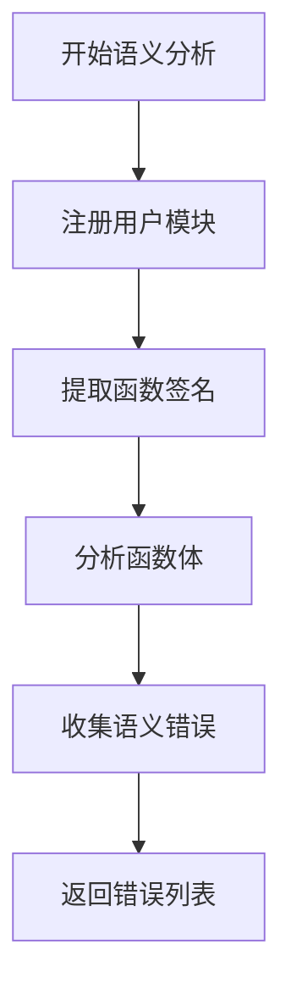
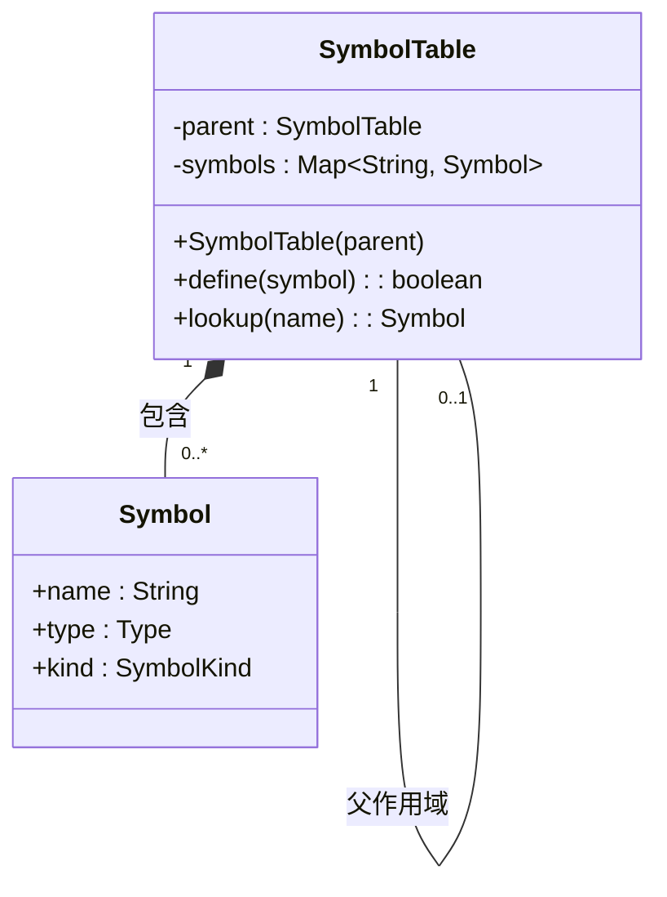
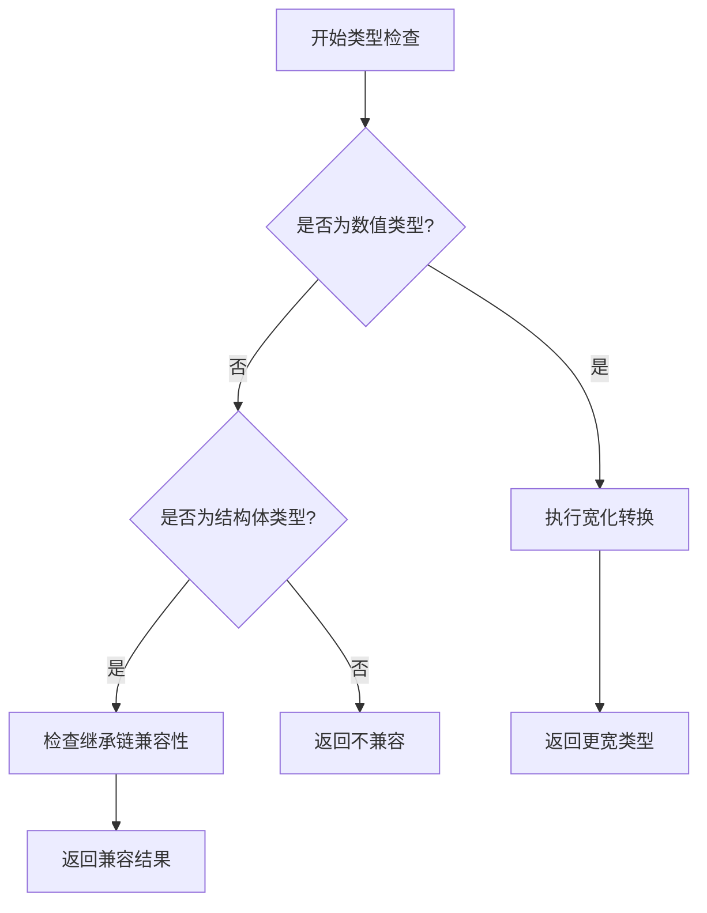
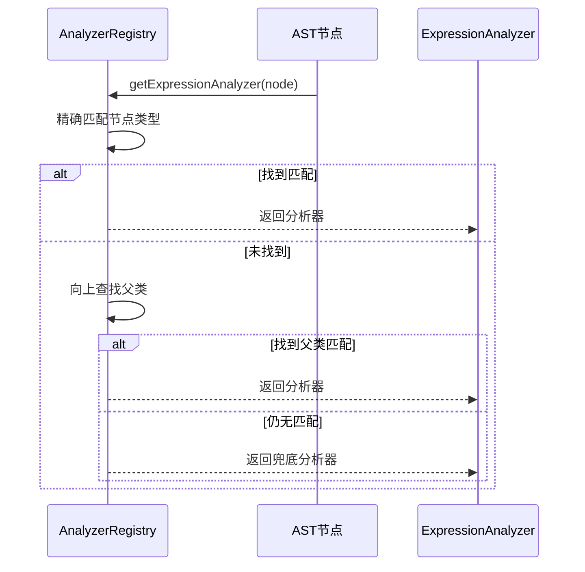
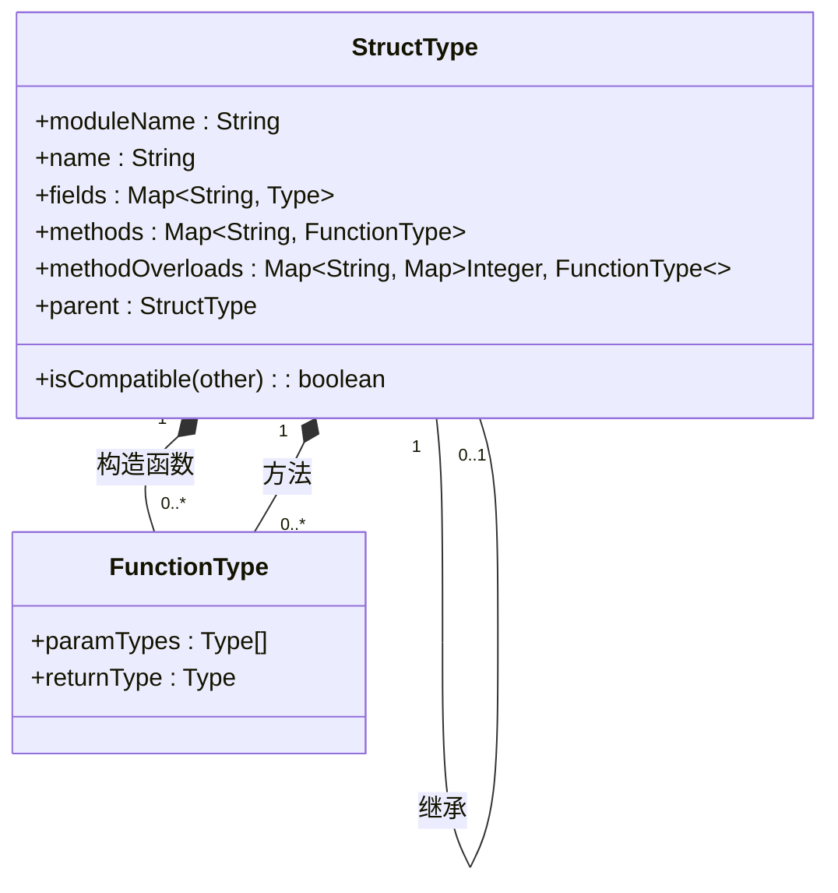
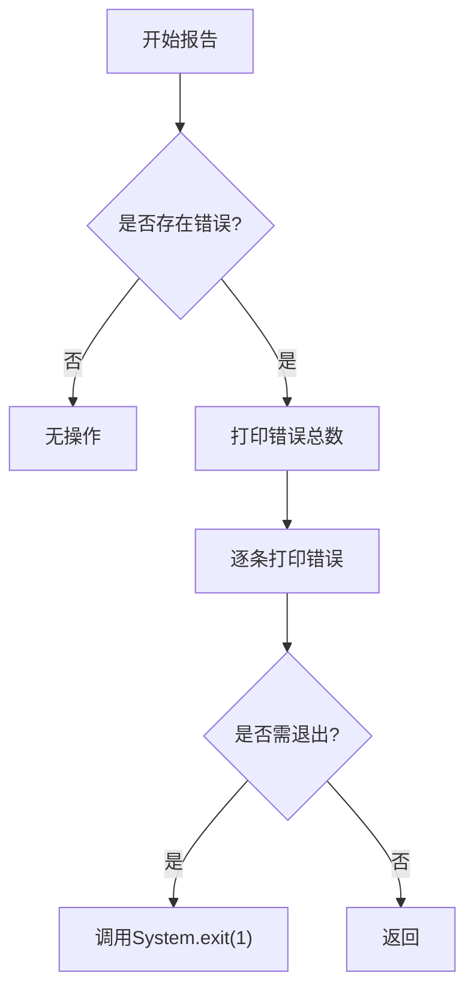

# 语义分析

<cite>
**本文档引用文件**  
- [SemanticAnalyzer.java](file://src/main/java/org/jcnc/snow/compiler/semantic/core/SemanticAnalyzer.java)
- [AnalyzerRegistry.java](file://src/main/java/org/jcnc/snow/compiler/semantic/analyzers/AnalyzerRegistry.java)
- [SymbolTable.java](file://src/main/java/org/jcnc/snow/compiler/semantic/symbol/SymbolTable.java)
- [StructType.java](file://src/main/java/org/jcnc/snow/compiler/semantic/type/StructType.java)
- [BuiltinType.java](file://src/main/java/org/jcnc/snow/compiler/semantic/type/BuiltinType.java)
- [SemanticError.java](file://src/main/java/org/jcnc/snow/compiler/semantic/error/SemanticError.java)
- [SemanticAnalysisReporter.java](file://src/main/java/org/jcnc/snow/compiler/semantic/utils/SemanticAnalysisReporter.java)
- [FunctionChecker.java](file://src/main/java/org/jcnc/snow/compiler/semantic/core/FunctionChecker.java)
- [Context.java](file://src/main/java/org/jcnc/snow/compiler/semantic/core/Context.java)
- [AnalyzerRegistrar.java](file://src/main/java/org/jcnc/snow/compiler/semantic/core/AnalyzerRegistrar.java)
</cite>

## 目录
1. [引言](#引言)
2. [语义分析器架构](#语义分析器架构)
3. [符号表与作用域管理](#符号表与作用域管理)
4. [类型系统与类型检查](#类型系统与类型检查)
5. [分析器注册与分发机制](#分析器注册与分发机制)
6. [函数与结构体语义分析](#函数与结构体语义分析)
7. [错误处理与报告机制](#错误处理与报告机制)
8. [结论](#结论)

## 引言

Snow语言的语义分析阶段是编译器前端的核心环节，负责在抽象语法树（AST）基础上执行类型检查、符号解析和作用域分析。本文档深入解析语义分析器的实现机制，涵盖符号表结构、类型系统、分析器调度、错误报告等关键组件，为开发者提供权威的技术参考。

## 语义分析器架构

Snow的语义分析器采用模块化设计，由`SemanticAnalyzer`作为顶层调度器，协调多个子组件完成分析任务。其核心流程分为三个阶段：模块注册、函数签名注册和函数体检查。

**图示来源**  
- [SemanticAnalyzer.java](file://src/main/java/org/jcnc/snow/compiler/semantic/core/SemanticAnalyzer.java#L27-L63)

**本节来源**  
- [SemanticAnalyzer.java](file://src/main/java/org/jcnc/snow/compiler/semantic/core/SemanticAnalyzer.java#L1-L87)

## 符号表与作用域管理

符号表（`SymbolTable`）是语义分析的基础数据结构，用于管理命名实体（如变量、函数、模块等）的符号信息。它支持嵌套作用域结构，通过父作用域引用实现多层级作用域链上的符号解析。

每个符号表包含一个符号映射表（符号名 → `Symbol`），并可挂接一个父作用域。当在当前作用域未找到符号时，会向上查找父作用域，直至根作用域。

**图示来源**  
- [SymbolTable.java](file://src/main/java/org/jcnc/snow/compiler/semantic/symbol/SymbolTable.java#L1-L36)

**本节来源**  
- [SymbolTable.java](file://src/main/java/org/jcnc/snow/compiler/semantic/symbol/SymbolTable.java#L1-L36)
- [FunctionChecker.java](file://src/main/java/org/jcnc/snow/compiler/semantic/core/FunctionChecker.java#L29-L58)

## 类型系统与类型检查

Snow语言的类型系统由`Type`接口统一表示，所有类型（内置类型、函数类型、结构体类型等）均实现此接口。类型检查的核心功能包括类型兼容性判断、数值类型宽化转换和类型推断。

### 内置类型

`BuiltinTypeRegistry`负责注册和管理所有内置基础类型，如`int`、`float`、`double`等。这些类型通过静态映射表`BUILTIN_TYPES`进行全局管理，支持快速查找。

### 类型兼容性

类型兼容性检查通过`isCompatible(Type other)`方法实现。对于数值类型，支持按`byte→short→int→long→float→double`顺序的宽化转换。对于结构体类型，支持继承链上的类型兼容（父类引用）。

**本节来源**  
- [Type.java](file://src/main/java/org/jcnc/snow/compiler/semantic/type/Type.java#L0-L56)
- [BuiltinTypeRegistry.java](file://src/main/java/org/jcnc/snow/compiler/semantic/core/BuiltinTypeRegistry.java#L0-L41)
- [Context.java](file://src/main/java/org/jcnc/snow/compiler/semantic/core/Context.java#L162-L201)

## 分析器注册与分发机制

`AnalyzerRegistry`是语义分析器的注册与分发中心，维护AST节点类型与相应分析器实例的映射关系。它通过访问者模式调度`ExpressionAnalyzer`和`StatementAnalyzer`进行节点遍历。

### 分析器注册

`AnalyzerRegistrar`负责将所有语句与表达式的语义分析器统一注册到`AnalyzerRegistry`中。注册内容包括：
- 所有标准语句节点（如变量声明、赋值、条件、循环、返回等）的分析器
- 所有标准表达式节点（如字面量、标识符、函数调用、二元表达式等）的分析器
- 对不支持或未实现的表达式节点提供兜底分析器`UnsupportedExpressionAnalyzer`

### 分析器分发

`AnalyzerRegistry`提供两种获取分析器的方法：
- `getStatementAnalyzer()`：仅支持精确类型匹配
- `getExpressionAnalyzer()`：支持“最近父类匹配”查找机制，若未找到则返回兜底分析器

**图示来源**  
- [AnalyzerRegistry.java](file://src/main/java/org/jcnc/snow/compiler/semantic/analyzers/AnalyzerRegistry.java#L0-L110)

**本节来源**  
- [AnalyzerRegistry.java](file://src/main/java/org/jcnc/snow/compiler/semantic/analyzers/AnalyzerRegistry.java#L0-L110)
- [AnalyzerRegistrar.java](file://src/main/java/org/jcnc/snow/compiler/semantic/core/AnalyzerRegistrar.java#L0-L53)

## 函数与结构体语义分析

### 函数分析

`FunctionChecker`负责对所有模块的函数体进行两遍扫描式语义检查：
1. 第一遍：构建并注册各模块全局符号表，处理全局变量/常量声明
2. 第二遍：分析函数体语句，检查参数、返回值等

函数体分析确保：
- 所有函数参数注册为局部变量
- 非void返回类型的函数必须有至少一条return语句
- 类型未知或变量/常量重复声明时收集为语义错误

### 结构体分析

`StructType`表示用户自定义结构体类型，包含字段定义、方法签名、构造函数等元信息。其核心特性包括：
- 由（moduleName, structName）唯一标识，支持跨模块同名结构体
- 支持方法重载，按“方法名+参数个数”建立索引
- 支持继承，通过`parent`字段引用父类类型

**图示来源**  
- [StructType.java](file://src/main/java/org/jcnc/snow/compiler/semantic/type/StructType.java#L0-L280)

**本节来源**  
- [FunctionChecker.java](file://src/main/java/org/jcnc/snow/compiler/semantic/core/FunctionChecker.java#L0-L29)
- [StructType.java](file://src/main/java/org/jcnc/snow/compiler/semantic/type/StructType.java#L0-L280)
- [CallExpressionAnalyzer.java](file://src/main/java/org/jcnc/snow/compiler/semantic/analyzers/expression/CallExpressionAnalyzer.java#L156-L186)

## 错误处理与报告机制

### 语义错误模型

`SemanticError`记录语义分析阶段的错误信息，包含：
- 出错的AST节点（用于定位位置）
- 错误消息（人类可读的描述）

错误信息格式化为“文件:行:列: 错误消息”，便于调试和IDE集成。

### 错误报告策略

`SemanticAnalysisReporter`提供两种错误报告策略：
- `report()`：仅打印错误，不终止进程
- `reportAndExitIfNecessary()`：打印错误并在存在错误时以状态码1退出，适用于CLI工具

**本节来源**  
- [SemanticError.java](file://src/main/java/org/jcnc/snow/compiler/semantic/error/SemanticError.java#L0-L57)
- [SemanticAnalysisReporter.java](file://src/main/java/org/jcnc/snow/compiler/semantic/utils/SemanticAnalysisReporter.java#L0-L50)

## 结论

Snow语言的语义分析器通过模块化设计实现了类型检查、符号解析和作用域分析的核心功能。其基于`AnalyzerRegistry`的访问者模式调度机制、层次化的`SymbolTable`作用域管理、完整的类型系统以及健壮的错误报告策略，共同构成了一个高效、可靠的语义分析框架。该设计既保证了分析的准确性，又提供了良好的扩展性，为语言的持续演进奠定了坚实基础。