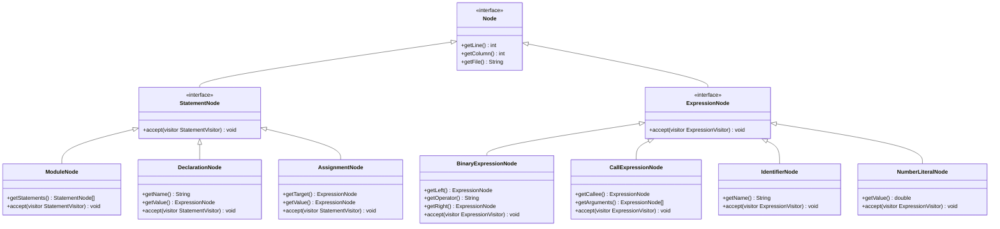
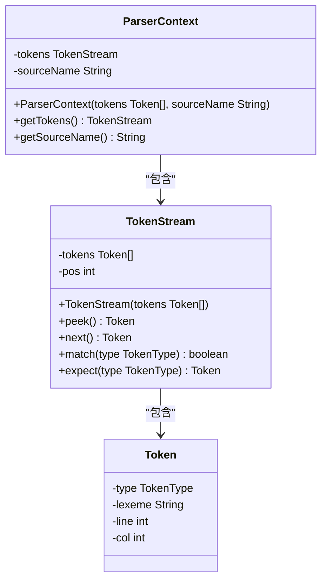

# 语法分析

<cite>
**本文档引用的文件**  
- [PrattExpressionParser.java](file://src/main/java/org/jcnc/snow/compiler/parser/expression/PrattExpressionParser.java)
- [ParserContext.java](file://src/main/java/org/jcnc/snow/compiler/parser/context/ParserContext.java)
- [TokenStream.java](file://src/main/java/org/jcnc/snow/compiler/parser/context/TokenStream.java)
- [TopLevelParserFactory.java](file://src/main/java/org/jcnc/snow/compiler/parser/factory/TopLevelParserFactory.java)
- [StatementParser.java](file://src/main/java/org/jcnc/snow/compiler/parser/statement/StatementParser.java)
- [ExpressionParser.java](file://src/main/java/org/jcnc/snow/compiler/parser/expression/base/ExpressionParser.java)
- [Precedence.java](file://src/main/java/org/jcnc/snow/compiler/parser/expression/Precedence.java)
- [BinaryOperatorParselet.java](file://src/main/java/org/jcnc/snow/compiler/parser/expression/BinaryOperatorParselet.java)
- [AST节点相关类](file://src/main/java/org/jcnc/snow/compiler/parser/ast/base/)
- [AST节点相关类](file://src/main/java/org/jcnc/snow/compiler/parser/ast/)
</cite>

## 目录
1. [简介](#简介)
2. [核心组件](#核心组件)
3. [Pratt表达式解析算法](#pratt表达式解析算法)
4. [解析器工厂模式](#解析器工厂模式)
5. [AST节点层次结构](#ast节点层次结构)
6. [解析上下文与Token流](#解析上下文与token流)
7. [语法错误检测与恢复](#语法错误检测与恢复)
8. [自定义Parselet扩展](#自定义parselet扩展)
9. [结论](#结论)

## 简介
Snow语言语法分析器采用模块化设计，基于递归下降与Pratt表达式解析相结合的策略，将词法单元流转换为结构化的抽象语法树（AST）。该系统通过工厂模式动态创建解析器，利用Pratt算法高效处理运算符优先级和结合性，并通过清晰的AST节点层次结构表示源代码的语法结构。

## 核心组件

Snow语言语法分析器的核心组件包括ParserEngine、PrattExpressionParser、StatementParser、ExpressionParser、TopLevelParserFactory、ParserContext和TokenStream。这些组件协同工作，完成从Token流到AST的完整解析过程。

**Section sources**
- [PrattExpressionParser.java](file://src/main/java/org/jcnc/snow/compiler/parser/expression/PrattExpressionParser.java#L1-L29)
- [ParserContext.java](file://src/main/java/org/jcnc/snow/compiler/parser/context/ParserContext.java#L1-L37)
- [TokenStream.java](file://src/main/java/org/jcnc/snow/compiler/parser/context/TokenStream.java#L1-L41)

## Pratt表达式解析算法

```mermaid
sequenceDiagram
    participant Parser as PrattExpressionParser
    participant Context as ParserContext
    participant Stream as TokenStream
    participant Prefix as PrefixParselet
    participant Infix as InfixParselet
    participant Node as ExpressionNode
    Parser->>Context: "parse(ParserContext)"
    Context->>Stream: "next()"
    Stream-->>Context: "Token"
    Context->>Parser: "查找PrefixParselet"
    alt "找到前缀解析器"
        Parser->>Prefix: "parse(ParserContext)"
        Prefix-->>Parser: "ExpressionNode"
        loop "优先级驱动"
            Context->>Stream: "peek()"
            Stream-->>Context: "下一个Token"
            Context->>Parser: "查找InfixParselet"
            alt "找到中缀解析器且优先级足够"
                Parser->>Infix: "parse(ParserContext, leftNode)"
                Infix-->>Parser: "新ExpressionNode"
                Parser->>Parser: "更新leftNode"
            else "优先级不足或无匹配"
                break
            end
        end
        Parser-->>Node: "返回最终表达式节点"
    end
    alt "未找到前缀解析器"
        Parser-->>Context: "抛出UnsupportedFeature异常"
    end
```

**Diagram sources**
- [PrattExpressionParser.java](file://src/main/java/org/jcnc/snow/compiler/parser/expression/PrattExpressionParser.java#L103-L138)
- [BinaryOperatorParselet.java](file://src/main/java/org/jcnc/snow/compiler/parser/expression/BinaryOperatorParselet.java#L33-L63)

Pratt表达式解析算法通过前缀（Prefix）和中缀（Infix）解析器的组合，递归地构建表达式AST。算法从最低优先级开始，先通过前缀解析器处理表达式的起始部分，然后在循环中根据运算符的优先级和结合性，逐步吸收中缀操作符及其右侧操作数。

**Section sources**
- [PrattExpressionParser.java](file://src/main/java/org/jcnc/snow/compiler/parser/expression/PrattExpressionParser.java#L103-L138)
- [Precedence.java](file://src/main/java/org/jcnc/snow/compiler/parser/expression/Precedence.java#L1-L57)

## 解析器工厂模式

```mermaid
classDiagram
class TopLevelParserFactory {
+static get(keyword String) TopLevelParser
+static isRegistered(keyword String) boolean
}
class StatementParserFactory {
+static get(keyword String) StatementParser
}
class TopLevelParser {
<<interface>>
+parse(ctx ParserContext) ModuleNode
}
class StatementParser {
<<interface>>
+parse(ctx ParserContext) StatementNode
}
class ModuleParser {
+parse(ctx ParserContext) ModuleNode
}
class FunctionParser {
+parse(ctx ParserContext) ModuleNode
}
class ScriptTopLevelParser {
+parse(ctx ParserContext) ModuleNode
}
class DeclarationStatementParser {
+parse(ctx ParserContext) StatementNode
}
class IfStatementParser {
+parse(ctx ParserContext) StatementNode
}
class LoopStatementParser {
+parse(ctx ParserContext) StatementNode
}
class ReturnStatementParser {
+parse(ctx ParserContext) StatementNode
}
class ExpressionStatementParser {
+parse(ctx ParserContext) StatementNode
}
TopLevelParserFactory --> TopLevelParser : "创建"
StatementParserFactory --> StatementParser : "创建"
TopLevelParserFactory --> ModuleParser : "注册"
TopLevelParserFactory --> FunctionParser : "注册"
TopLevelParserFactory --> ScriptTopLevelParser : "默认"
StatementParserFactory --> DeclarationStatementParser : "注册"
StatementParserFactory --> IfStatementParser : "注册"
StatementParserFactory --> LoopStatementParser : "注册"
StatementParserFactory --> ReturnStatementParser : "注册"
StatementParserFactory --> ExpressionStatementParser : "默认"
ModuleParser ..|> TopLevelParser
FunctionParser ..|> TopLevelParser
ScriptTopLevelParser ..|> TopLevelParser
DeclarationStatementParser ..|> StatementParser
IfStatementParser ..|> StatementParser
LoopStatementParser ..|> StatementParser
ReturnStatementParser ..|> StatementParser
ExpressionStatementParser ..|> StatementParser
```



**Diagram sources**
- [TopLevelParserFactory.java](file://src/main/java/org/jcnc/snow/compiler/parser/factory/TopLevelParserFactory.java#L1-L50)
- [StatementParserFactory.java](file://src/main/java/org/jcnc/snow/compiler/parser/factory/StatementParserFactory.java#L1-L47)

TopLevelParserFactory和StatementParserFactory采用工厂模式，根据源码中的关键字动态创建相应的解析器。TopLevelParserFactory处理模块、函数等顶层结构，而StatementParserFactory处理声明、条件、循环等语句。未注册的关键字将回退到默认解析器，确保解析过程的健壮性。

**Section sources**
- [TopLevelParserFactory.java](file://src/main/java/org/jcnc/snow/compiler/parser/factory/TopLevelParserFactory.java#L1-L50)
- [StatementParserFactory.java](file://src/main/java/org/jcnc/snow/compiler/parser/factory/StatementParserFactory.java#L1-L47)

## AST节点层次结构



**Diagram sources**
- [Node.java](file://src/main/java/org/jcnc/snow/compiler/parser/ast/base/Node.java)
- [StatementNode.java](file://src/main/java/org/jcnc/snow/compiler/parser/ast/base/StatementNode.java)
- [ExpressionNode.java](file://src/main/java/org/jcnc/snow/compiler/parser/ast/base/ExpressionNode.java)
- [ModuleNode.java](file://src/main/java/org/jcnc/snow/compiler/parser/ast/ModuleNode.java)
- [DeclarationNode.java](file://src/main/java/org/jcnc/snow/compiler/parser/ast/DeclarationNode.java)

AST节点层次结构以Node接口为根，派生出StatementNode和ExpressionNode两大分支。StatementNode表示语句，如声明、赋值、控制流等；ExpressionNode表示表达式，如二元运算、函数调用、字面量等。这种设计支持访问者模式，便于后续的语义分析和代码生成。

**Section sources**
- [Node.java](file://src/main/java/org/jcnc/snow/compiler/parser/ast/base/Node.java)
- [StatementNode.java](file://src/main/java/org/jcnc/snow/compiler/parser/ast/base/StatementNode.java)
- [ExpressionNode.java](file://src/main/java/org/jcnc/snow/compiler/parser/ast/base/ExpressionNode.java)

## 解析上下文与Token流



**Diagram sources**
- [ParserContext.java](file://src/main/java/org/jcnc/snow/compiler/parser/context/ParserContext.java#L1-L62)
- [TokenStream.java](file://src/main/java/org/jcnc/snow/compiler/parser/context/TokenStream.java#L1-L41)

ParserContext封装了解析过程中的共享状态，包括TokenStream和源文件名。TokenStream提供对Token序列的遍历操作，如peek（预览）、next（消费）、match（匹配）和expect（断言），并自动跳过注释Token，确保语法分析的流畅性。

**Section sources**
- [ParserContext.java](file://src/main/java/org/jcnc/snow/compiler/parser/context/ParserContext.java#L1-L62)
- [TokenStream.java](file://src/main/java/org/jcnc/snow/compiler/parser/context/TokenStream.java#L1-L41)

## 语法错误检测与恢复

语法分析器通过断言（expect）和异常机制检测常见语法错误，如不匹配的括号、缺失分号等。当遇到非法Token时，抛出UnsupportedFeature或ParseException异常，包含详细的错误位置信息。解析器工厂的默认回退机制也提供了一定的错误恢复能力，避免解析过程因单个错误而完全中断。

**Section sources**
- [ParserContext.java](file://src/main/java/org/jcnc/snow/compiler/parser/context/ParserContext.java#L1-L62)
- [TokenStream.java](file://src/main/java/org/jcnc/snow/compiler/parser/context/TokenStream.java#L1-L41)
- [PrattExpressionParser.java](file://src/main/java/org/jcnc/snow/compiler/parser/expression/PrattExpressionParser.java#L103-L138)

## 自定义Parselet扩展

通过实现PrefixParselet或InfixParselet接口，并在PrattExpressionParser中注册，可以轻松扩展新的语法结构。例如，添加新的运算符只需创建对应的BinaryOperatorParselet实例并注册到解析器中。这种设计使得语法扩展变得简单而灵活。

**Section sources**
- [PrattExpressionParser.java](file://src/main/java/org/jcnc/snow/compiler/parser/expression/PrattExpressionParser.java#L1-L29)
- [BinaryOperatorParselet.java](file://src/main/java/org/jcnc/snow/compiler/parser/expression/BinaryOperatorParselet.java#L1-L63)

## 结论

Snow语言语法分析器采用先进的Pratt表达式解析算法和工厂模式，构建了一个高效、灵活且易于扩展的解析系统。其清晰的AST节点层次结构和健壮的错误处理机制，为后续的语义分析和代码生成奠定了坚实的基础。