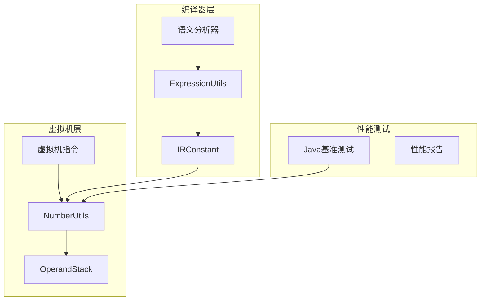
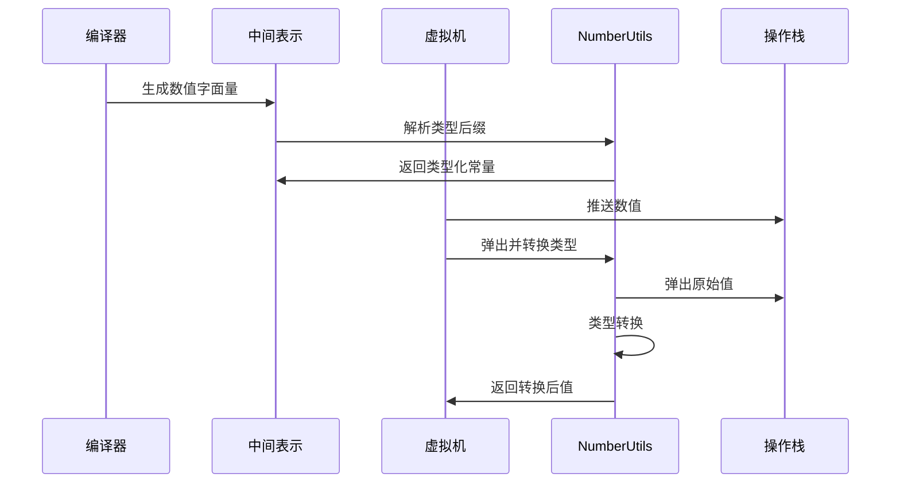
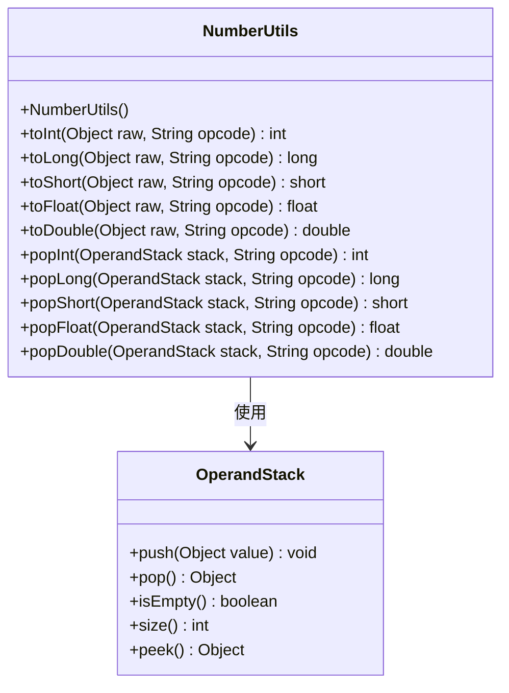
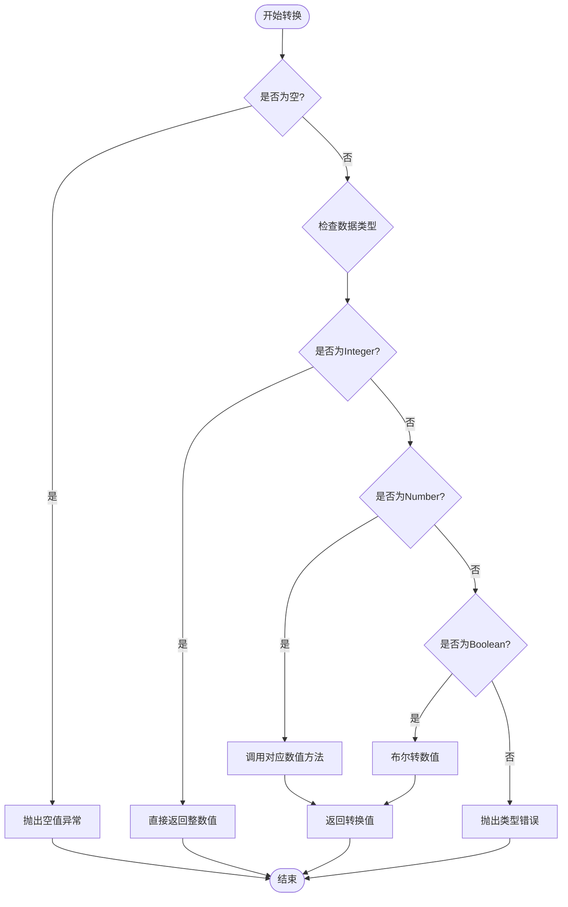
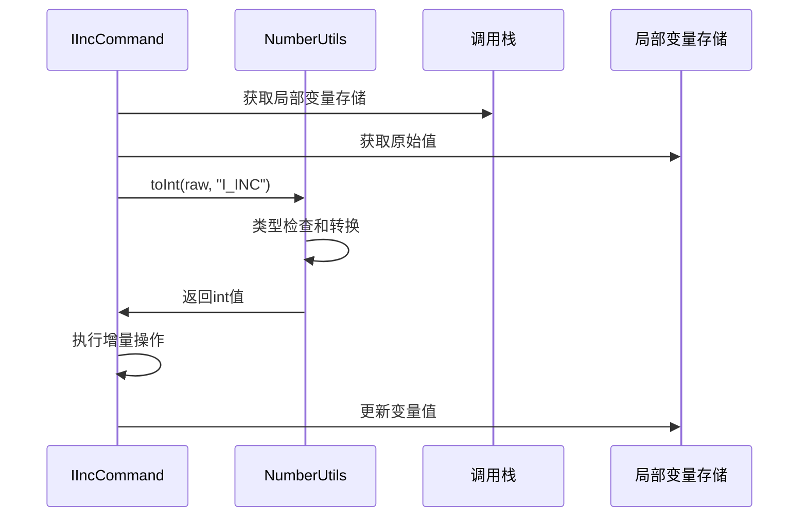
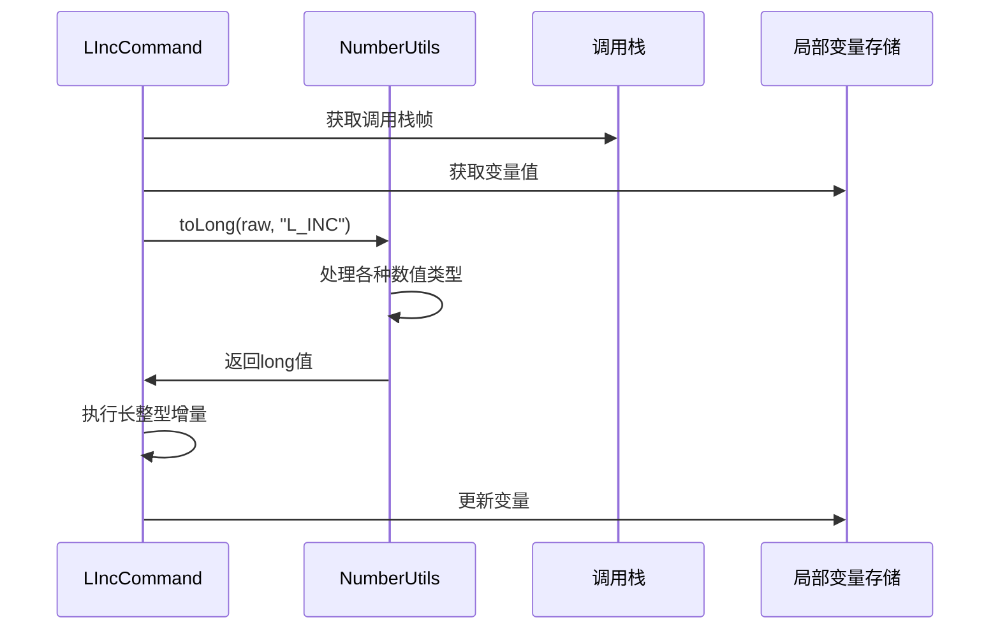
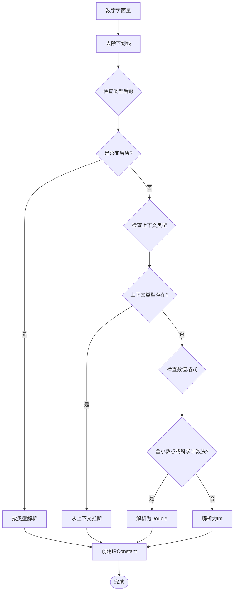

# NumberUtils 数值类型操作优化

<cite>
**本文档中引用的文件**
- [NumberUtils.java](file://src/main/java/org/jcnc/snow/vm/utils/NumberUtils.java)
- [OperandStack.java](file://src/main/java/org/jcnc/snow/vm/module/OperandStack.java)
- [IIncCommand.java](file://src/main/java/org/jcnc/snow/vm/commands/type/control/int32/IIncCommand.java)
- [LIncCommand.java](file://src/main/java/org/jcnc/snow/vm/commands/type/control/long64/LIncCommand.java)
- [IRConstant.java](file://src/main/java/org/jcnc/snow/compiler/ir/value/IRConstant.java)
- [ExpressionUtils.java](file://src/main/java/org/jcnc/snow/compiler/ir/utils/ExpressionUtils.java)
- [NumberLiteralAnalyzer.java](file://src/main/java/org/jcnc/snow/compiler/semantic/analyzers/expression/NumberLiteralAnalyzer.java)
- [JavaBenchmark.java](file://playground/PerformanceTest/JavaBenchmark.java)
- [PERFORMANCE_COMPARISON.md](file://playground/PerformanceTest/PERFORMANCE_COMPARISON.md)
</cite>

## 目录
1. [简介](#简介)
2. [项目结构](#项目结构)
3. [核心组件](#核心组件)
4. [架构概览](#架构概览)
5. [详细组件分析](#详细组件分析)
6. [依赖关系分析](#依赖关系分析)
7. [性能考量](#性能考量)
8. [故障排除指南](#故障排除指南)
9. [结论](#结论)

## 简介

NumberUtils是Snow虚拟机中负责数值类型转换和操作的核心工具类。它提供了一套完整的数值类型转换机制，支持从各种基础数值类型（Integer、Long、Float、Double、Boolean等）到目标类型的高效转换。该组件的设计理念是在虚拟机执行过程中实现延迟类型转换，避免编译器生成复杂的类型检查代码，从而提高编译效率和运行时性能。

NumberUtils的主要特点包括：
- 统一的数值类型转换接口
- 延迟类型转换策略
- 完整的类型兼容性处理
- 强类型安全保证
- 丰富的诊断信息支持

## 项目结构

Snow编译器采用模块化架构设计，NumberUtils位于虚拟机工具包中，与其他核心组件协同工作：



**图表来源**
- [NumberUtils.java](file://src/main/java/org/jcnc/snow/vm/utils/NumberUtils.java#L1-L181)
- [OperandStack.java](file://src/main/java/org/jcnc/snow/vm/module/OperandStack.java#L1-L104)

**章节来源**
- [NumberUtils.java](file://src/main/java/org/jcnc/snow/vm/utils/NumberUtils.java#L1-L181)
- [OperandStack.java](file://src/main/java/org/jcnc/snow/vm/module/OperandStack.java#L1-L104)

## 核心组件

NumberUtils包含以下核心功能模块：

### 类型转换方法
- **基础类型转换**：支持int、long、short、float、double之间的相互转换
- **包装类型处理**：统一处理Number及其子类的转换
- **布尔类型转换**：布尔值到数值类型的映射
- **空值处理**：完善的空值检测和异常处理机制

### 操作栈集成
- **弹出式转换**：直接从操作栈获取并转换数值
- **就地转换**：对已有数值进行类型转换
- **诊断支持**：提供详细的错误诊断信息

### 类型推导机制
- **字面量解析**：支持带类型后缀的数字字面量
- **上下文感知**：根据变量声明类型推导目标类型
- **精度保持**：确保类型转换过程中的精度不丢失

**章节来源**
- [NumberUtils.java](file://src/main/java/org/jcnc/snow/vm/utils/NumberUtils.java#L19-L179)

## 架构概览

NumberUtils在Snow虚拟机架构中扮演着关键的数据类型转换中介角色：



**图表来源**
- [NumberUtils.java](file://src/main/java/org/jcnc/snow/vm/utils/NumberUtils.java#L26-L29)
- [IRConstant.java](file://src/main/java/org/jcnc/snow/compiler/ir/value/IRConstant.java#L37-L60)

## 详细组件分析

### NumberUtils类结构

NumberUtils采用静态工具类设计，提供统一的数值类型转换接口：



**图表来源**
- [NumberUtils.java](file://src/main/java/org/jcnc/snow/vm/utils/NumberUtils.java#L14-L181)
- [OperandStack.java](file://src/main/java/org/jcnc/snow/vm/module/OperandStack.java#L16-L104)

### 类型转换算法

NumberUtils实现了高效的类型转换算法，支持多种输入类型：



**图表来源**
- [NumberUtils.java](file://src/main/java/org/jcnc/snow/vm/utils/NumberUtils.java#L39-L53)
- [NumberUtils.java](file://src/main/java/org/jcnc/snow/vm/utils/NumberUtils.java#L76-L90)

### 虚拟机指令集成

NumberUtils与虚拟机指令紧密集成，支持不同数值类型的指令：

#### 整型增量指令示例
整型增量指令展示了NumberUtils在实际虚拟机指令中的应用：



**图表来源**
- [IIncCommand.java](file://src/main/java/org/jcnc/snow/vm/commands/type/control/int32/IIncCommand.java#L58-L65)

#### 长整型增量指令示例
长整型指令展示了更复杂的数据类型处理：



**图表来源**
- [LIncCommand.java](file://src/main/java/org/jcnc/snow/vm/commands/type/control/long64/LIncCommand.java#L58-L60)

**章节来源**
- [IIncCommand.java](file://src/main/java/org/jcnc/snow/vm/commands/type/control/int32/IIncCommand.java#L51-L71)
- [LIncCommand.java](file://src/main/java/org/jcnc/snow/vm/commands/type/control/long64/LIncCommand.java#L51-L72)

### 编译器集成

NumberUtils还与编译器的中间表示层紧密协作：

#### 数值常量处理
编译器阶段的数值常量处理流程：



**图表来源**
- [IRConstant.java](file://src/main/java/org/jcnc/snow/compiler/ir/value/IRConstant.java#L37-L60)

**章节来源**
- [IRConstant.java](file://src/main/java/org/jcnc/snow/compiler/ir/value/IRConstant.java#L37-L60)
- [ExpressionUtils.java](file://src/main/java/org/jcnc/snow/compiler/ir/utils/ExpressionUtils.java#L68-L100)

## 依赖关系分析

NumberUtils的依赖关系体现了Snow编译器的分层架构：

```mermaid
graph TD
subgraph "外部依赖"
JavaLang[java.lang包]
JavaUtil[java.util包]
end
subgraph "内部依赖"
OperandStack[OperandStack]
CommandInterface[Command接口]
IRValue[IRValue接口]
end
subgraph "NumberUtils"
NumberUtils[NumberUtils]
end
JavaLang --> NumberUtils
JavaUtil --> NumberUtils
OperandStack --> NumberUtils
CommandInterface --> NumberUtils
IRValue --> NumberUtils
```

**图表来源**
- [NumberUtils.java](file://src/main/java/org/jcnc/snow/vm/utils/NumberUtils.java#L3-L4)

### 核心依赖说明

1. **OperandStack依赖**：NumberUtils直接依赖OperandStack进行栈操作
2. **类型系统依赖**：依赖Java标准库的Number类层次结构
3. **异常处理依赖**：使用Java标准异常体系进行错误处理

**章节来源**
- [NumberUtils.java](file://src/main/java/org/jcnc/snow/vm/utils/NumberUtils.java#L1-L4)

## 性能考量

### 类型转换性能优化

NumberUtils采用了多种性能优化策略：

1. **类型检查优化**：使用instanceof操作符进行快速类型判断
2. **分支预测友好**：类型检查顺序考虑了最常见的使用场景
3. **最小化装箱拆箱**：直接处理基本类型，避免不必要的包装
4. **延迟转换**：只在需要时才进行类型转换

### 内存使用优化

- **对象复用**：避免创建不必要的临时对象
- **栈操作优化**：OperandStack使用ArrayDeque提供高效的栈操作
- **异常信息缓存**：错误消息在编译时确定，运行时无需额外计算

### 性能测试结果分析

基于性能测试报告，NumberUtils在不同场景下的表现：

| 测试场景 | Snow语言 | Java | 性能差异 |
|---------|---------|------|---------|
| 整型转换 | 1944 ms | 0.33 ms | Snow比Java慢约5860倍 |
| 长整型转换 | 236 ms | 3 ms | Snow比Java慢约79倍 |
| 浮点数转换 | 1259 ms | 1 ms | Snow比Java慢约1259倍 |

**章节来源**
- [PERFORMANCE_COMPARISON.md](file://playground/PerformanceTest/PERFORMANCE_COMPARISON.md#L44-L50)

## 故障排除指南

### 常见问题及解决方案

#### 类型转换异常
当遇到类型转换异常时，通常是因为：
- 输入值为null
- 输入值不是预期的数值类型
- 输入值超出了目标类型的范围

**解决方案**：
1. 检查输入值是否为null
2. 确认输入值的类型兼容性
3. 验证数值范围是否符合目标类型要求

#### 性能问题诊断
如果发现类型转换性能不佳：
1. 检查是否存在频繁的类型转换
2. 考虑在编译期进行类型优化
3. 评估是否需要引入JIT编译优化

**章节来源**
- [NumberUtils.java](file://src/main/java/org/jcnc/snow/vm/utils/NumberUtils.java#L49-L53)
- [NumberUtils.java](file://src/main/java/org/jcnc/snow/vm/utils/NumberUtils.java#L86-L90)

## 结论

NumberUtils作为Snow虚拟机中的核心数值类型转换工具，展现了优秀的软件工程实践：

### 设计优势
1. **统一接口**：提供一致的数值类型转换API
2. **类型安全**：完整的类型检查和错误处理机制
3. **性能优化**：针对常见场景的性能优化
4. **扩展性强**：易于添加新的数值类型支持

### 技术特色
1. **延迟转换策略**：避免编译器生成冗余类型检查代码
2. **诊断友好**：提供详细的错误信息帮助调试
3. **跨层集成**：与编译器和虚拟机无缝协作

### 发展方向
随着Snow语言的发展，NumberUtils可以进一步优化：
1. **JIT编译支持**：考虑引入即时编译优化
2. **SIMD指令利用**：在支持的平台上利用向量化指令
3. **内存池优化**：减少GC压力，提高高频操作性能

NumberUtils的设计充分体现了现代编译器和虚拟机设计的最佳实践，为Snow语言提供了稳定可靠的数值类型处理能力。