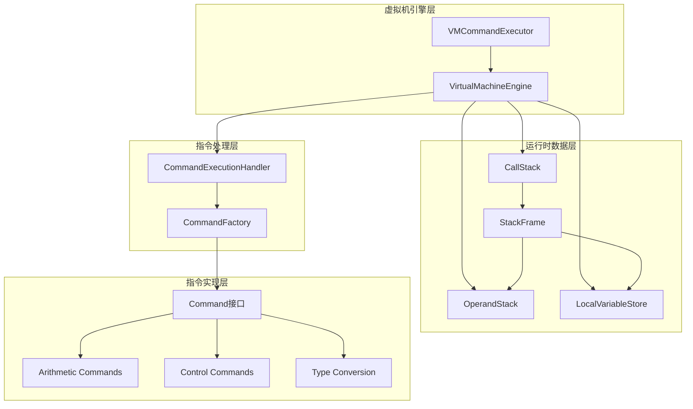
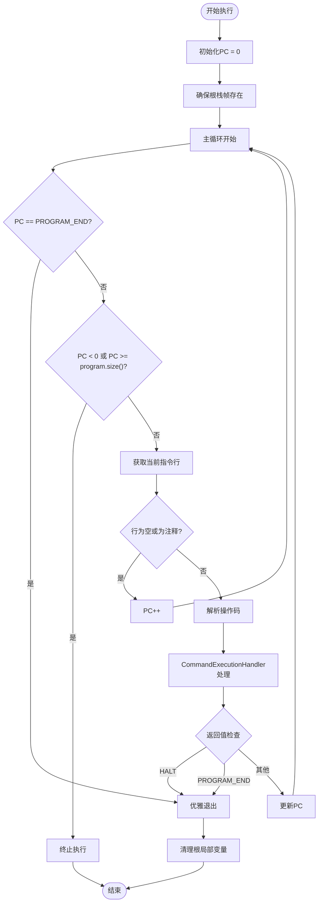
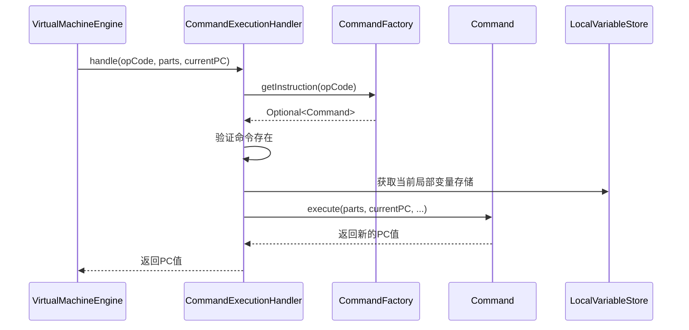
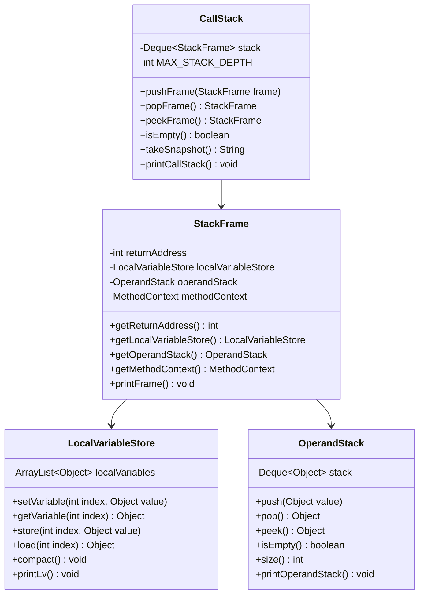
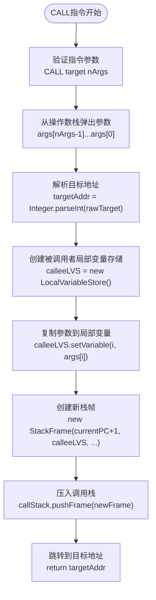
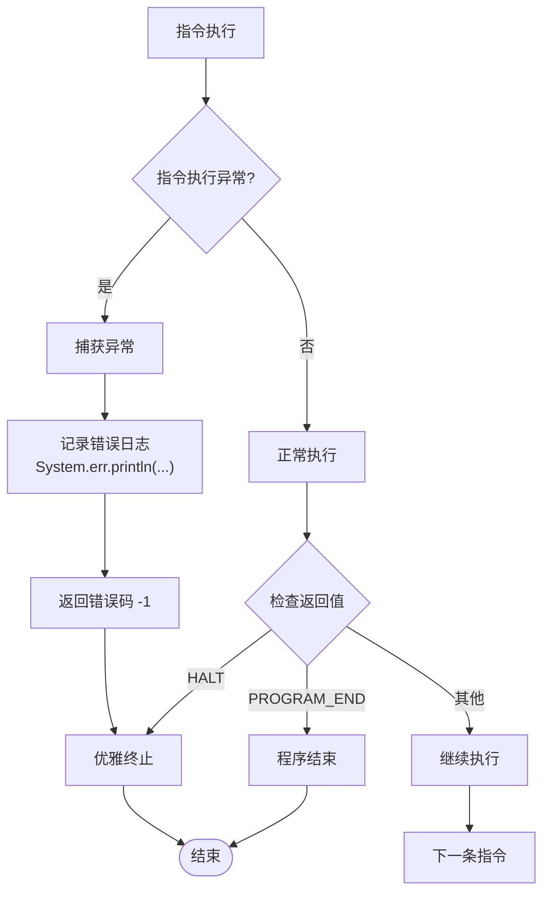
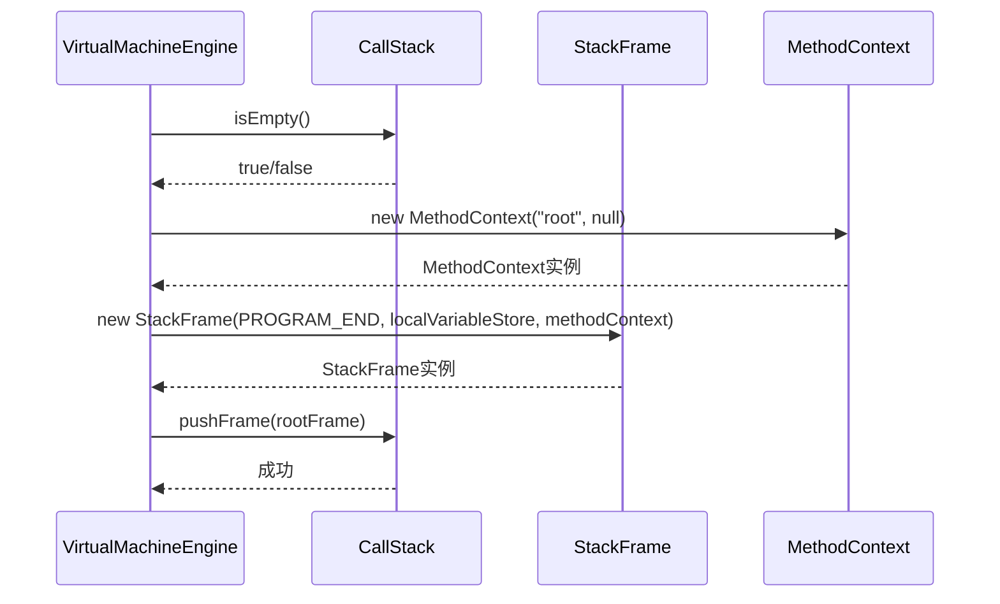
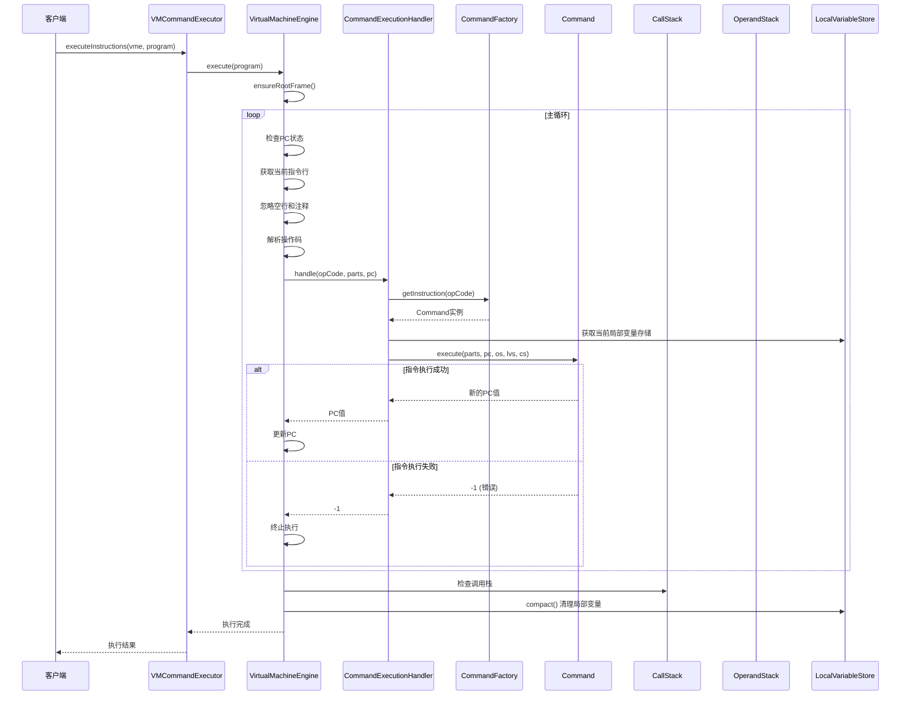
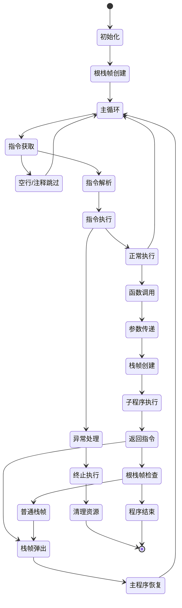

# 执行模型

<cite>
**本文档中引用的文件**
- [VirtualMachineEngine.java](file://src/main/java/org/jcnc/snow/vm/engine/VirtualMachineEngine.java)
- [VMCommandExecutor.java](file://src/main/java/org/jcnc/snow/vm/engine/VMCommandExecutor.java)
- [CommandExecutionHandler.java](file://src/main/java/org/jcnc/snow/vm/execution/CommandExecutionHandler.java)
- [Command.java](file://src/main/java/org/jcnc/snow/vm/interfaces/Command.java)
- [CommandFactory.java](file://src/main/java/org/jcnc/snow/vm/factories/CommandFactory.java)
- [CallStack.java](file://src/main/java/org/jcnc/snow/vm/module/CallStack.java)
- [OperandStack.java](file://src/main/java/org/jcnc/snow/vm/module/OperandStack.java)
- [LocalVariableStore.java](file://src/main/java/org/jcnc/snow/vm/module/LocalVariableStore.java)
- [StackFrame.java](file://src/main/java/org/jcnc/snow/vm/module/StackFrame.java)
- [CallCommand.java](file://src/main/java/org/jcnc/snow/vm/commands/flow/control/CallCommand.java)
- [RetCommand.java](file://src/main/java/org/jcnc/snow/vm/commands/flow/control/RetCommand.java)
- [JumpCommand.java](file://src/main/java/org/jcnc/snow/vm/commands/flow/control/JumpCommand.java)
- [VMOpCode.java](file://src/main/java/org/jcnc/snow/vm/engine/VMOpCode.java)
- [LoggingUtils.java](file://src/main/java/org/jcnc/snow/vm/utils/LoggingUtils.java)
</cite>

## 目录
1. [简介](#简介)
2. [核心架构概览](#核心架构概览)
3. [VirtualMachineEngine主循环机制](#virtualmachineengine主循环机制)
4. [指令处理流程](#指令处理流程)
5. [运行时数据结构](#运行时数据结构)
6. [控制流指令](#控制流指令)
7. [异常处理机制](#异常处理机制)
8. [根栈帧管理](#根栈帧管理)
9. [执行流程时序图](#执行流程时序图)
10. [状态转换图](#状态转换图)
11. [性能考虑](#性能考虑)
12. [故障排除指南](#故障排除指南)
13. [总结](#总结)

## 简介

Snow虚拟机执行模型是一个基于栈的虚拟机系统，采用解释器模式执行字节码指令。该模型的核心是VirtualMachineEngine类，它维护程序计数器（PC）、操作数栈、局部变量存储和调用栈，实现了完整的指令获取、解析和执行循环。

虚拟机支持多种数据类型的操作码，包括字节、短整型、整型、长整型、浮点型和双精度型等，每种类型都有对应的算术运算、比较运算和类型转换指令。

## 核心架构概览

Snow虚拟机的执行模型由以下核心组件构成：



**图表来源**
- [VirtualMachineEngine.java](file://src/main/java/org/jcnc/snow/vm/engine/VirtualMachineEngine.java#L1-L191)
- [CommandExecutionHandler.java](file://src/main/java/org/jcnc/snow/vm/execution/CommandExecutionHandler.java#L1-L61)
- [CommandFactory.java](file://src/main/java/org/jcnc/snow/vm/factories/CommandFactory.java#L1-L286)

## VirtualMachineEngine主循环机制

VirtualMachineEngine是虚拟机的核心执行引擎，其主循环负责指令的获取、解析和执行。主循环的工作机制如下：

### 程序计数器管理

程序计数器（PC）是虚拟机的关键状态变量，用于跟踪当前正在执行的指令位置：



**图表来源**
- [VirtualMachineEngine.java](file://src/main/java/org/jcnc/snow/vm/engine/VirtualMachineEngine.java#L75-L140)

### 指令获取和解析

虚拟机的指令获取过程包含以下步骤：

1. **边界检查**：验证PC是否在有效范围内
2. **空行和注释处理**：跳过空行和以'#'开头的注释行
3. **指令分割**：将指令字符串按空格分割成操作码和参数
4. **操作码解析**：将操作码字符串转换为整数值

**章节来源**
- [VirtualMachineEngine.java](file://src/main/java/org/jcnc/snow/vm/engine/VirtualMachineEngine.java#L95-L120)

## 指令处理流程

### CommandExecutionHandler的作用

CommandExecutionHandler是指令分发的核心组件，负责根据操作码查找对应的指令对象并执行：



**图表来源**
- [CommandExecutionHandler.java](file://src/main/java/org/jcnc/snow/vm/execution/CommandExecutionHandler.java#L35-L55)

### VMCommandExecutor封装

VMCommandExecutor提供了统一的指令执行入口，封装了异常处理和日志记录：

**章节来源**
- [VMCommandExecutor.java](file://src/main/java/org/jcnc/snow/vm/engine/VMCommandExecutor.java#L25-L45)

## 运行时数据结构

### 调用栈管理

CallStack维护方法调用层次结构，支持栈帧的压入和弹出：



**图表来源**
- [CallStack.java](file://src/main/java/org/jcnc/snow/vm/module/CallStack.java#L1-L97)
- [StackFrame.java](file://src/main/java/org/jcnc/snow/vm/module/StackFrame.java#L1-L104)
- [LocalVariableStore.java](file://src/main/java/org/jcnc/snow/vm/module/LocalVariableStore.java#L1-L182)
- [OperandStack.java](file://src/main/java/org/jcnc/snow/vm/module/OperandStack.java#L1-L104)

### 局部变量存储

LocalVariableStore提供动态大小的局部变量表，支持随机访问和自动扩展：

**章节来源**
- [LocalVariableStore.java](file://src/main/java/org/jcnc/snow/vm/module/LocalVariableStore.java#L40-L80)

### 操作数栈

OperandStack实现基本的栈操作，支持任意类型的对象存储：

**章节来源**
- [OperandStack.java](file://src/main/java/org/jcnc/snow/vm/module/OperandStack.java#L25-L60)

## 控制流指令

### 函数调用指令（CALL）

Call指令实现函数调用，涉及参数传递、局部变量初始化和栈帧创建：



**图表来源**
- [CallCommand.java](file://src/main/java/org/jcnc/snow/vm/commands/flow/control/CallCommand.java#L35-L80)

### 返回指令（RET）

Ret指令处理函数返回，区分根栈帧和普通栈帧的不同处理逻辑：

```mermaid
flowchart TD
Start([RET指令开始]) --> CheckStack{"调用栈是否为空?"}
CheckStack --> |是| ThrowError["抛出IllegalStateException"]
CheckStack --> |否| PeekFrame["查看顶部栈帧"]
PeekFrame --> CheckRoot{"返回地址 == PROGRAM_END?"}
CheckRoot --> |是| RootFrame["根栈帧处理"]
CheckRoot --> |否| NormalFrame["普通栈帧处理"]
RootFrame --> LogEnd["记录程序结束<br/>LoggingUtils.logInfo(\"Return <root>\")"]
LogEnd --> ReturnEnd["返回PROGRAM_END<br/>VM主循环应终止"]
NormalFrame --> PopFrame["弹出栈帧<br/>callStack.popFrame()"]
PopFrame --> ClearLocals["清空局部变量<br/>finished.getLocalVariableStore().clearVariables()"]
ClearLocals --> GetReturnAddr["获取返回地址<br/>returnAddr = finished.getReturnAddress()"]
GetReturnAddr --> ReturnAddr["返回返回地址"]
```

**图表来源**
- [RetCommand.java](file://src/main/java/org/jcnc/snow/vm/commands/flow/control/RetCommand.java#L25-L55)

### 无条件跳转指令（JUMP）

Jump指令实现无条件跳转，支持目标地址验证：

**章节来源**
- [JumpCommand.java](file://src/main/java/org/jcnc/snow/vm/commands/flow/control/JumpCommand.java#L50-L73)

## 异常处理机制

### 异常处理策略

虚拟机采用多层次的异常处理策略：

1. **指令级异常**：每个指令实现自己的错误处理
2. **执行级异常**：CommandExecutionHandler捕获指令执行异常
3. **引擎级异常**：VirtualMachineEngine处理整体执行异常

### 异常传播流程



**图表来源**
- [CommandExecutionHandler.java](file://src/main/java/org/jcnc/snow/vm/execution/CommandExecutionHandler.java#L45-L55)

### 日志记录机制

LoggingUtils提供统一的日志记录功能：

**章节来源**
- [LoggingUtils.java](file://src/main/java/org/jcnc/snow/vm/utils/LoggingUtils.java#L35-L58)

## 根栈帧管理

### 根栈帧的创建

根栈帧是虚拟机执行的起点，具有特殊的返回地址：



**图表来源**
- [VirtualMachineEngine.java](file://src/main/java/org/jcnc/snow/vm/engine/VirtualMachineEngine.java#L145-L160)

### 优雅终止机制

当根栈帧的RET指令执行时，虚拟机会优雅地终止：

**章节来源**
- [VirtualMachineEngine.java](file://src/main/java/org/jcnc/snow/vm/engine/VirtualMachineEngine.java#L165-L175)

## 执行流程时序图

以下是完整的指令执行时序图：



**图表来源**
- [VirtualMachineEngine.java](file://src/main/java/org/jcnc/snow/vm/engine/VirtualMachineEngine.java#L75-L140)
- [VMCommandExecutor.java](file://src/main/java/org/jcnc/snow/vm/engine/VMCommandExecutor.java#L35-L45)

## 状态转换图

虚拟机的状态转换遵循严格的控制流规则：



## 性能考虑

### 指令分发优化

CommandFactory使用数组索引实现O(1)时间复杂度的指令查找：

**章节来源**
- [CommandFactory.java](file://src/main/java/org/jcnc/snow/vm/factories/CommandFactory.java#L25-L285)

### 内存管理

1. **栈深度限制**：CallStack设置最大栈深度防止栈溢出
2. **局部变量压缩**：执行完成后压缩局部变量存储
3. **垃圾回收友好**：及时清理不再需要的栈帧

### 执行效率

1. **直接跳转**：支持高效的无条件跳转
2. **参数传递优化**：函数调用时的参数高效传递
3. **类型特定指令**：针对不同数据类型优化的指令集

## 故障排除指南

### 常见问题及解决方案

1. **StackOverflowError**
   - 原因：递归调用过深或无限递归
   - 解决：检查递归终止条件，增加栈深度限制

2. **IllegalStateException: CALL stack is empty**
   - 原因：RET指令在空调用栈上执行
   - 解决：确保每次RET都有对应的CALL

3. **IllegalArgumentException: Invalid opcode**
   - 原因：无效的操作码
   - 解决：检查指令格式和操作码定义

4. **IndexOutOfBoundsException**
   - 原因：访问越界的局部变量索引
   - 解决：验证变量索引范围

### 调试技巧

1. **启用调试模式**：使用printStack()和printLocalVariables()方法
2. **日志分析**：利用LoggingUtils记录详细的执行信息
3. **状态快照**：使用takeSnapshot()方法获取调用栈状态

**章节来源**
- [VirtualMachineEngine.java](file://src/main/java/org/jcnc/snow/vm/engine/VirtualMachineEngine.java#L175-L191)

## 总结

Snow虚拟机执行模型是一个设计精良的解释器系统，具有以下特点：

1. **模块化设计**：清晰的分层架构便于维护和扩展
2. **类型安全**：强类型指令系统确保执行正确性
3. **异常处理**：完善的异常处理机制保证系统稳定性
4. **性能优化**：高效的指令分发和内存管理
5. **可调试性**：丰富的调试工具和日志记录

该执行模型为Snow语言提供了坚实的基础，支持复杂的程序执行和类型安全的指令操作。通过合理的架构设计和优化策略，虚拟机能够在保持灵活性的同时提供良好的性能表现。