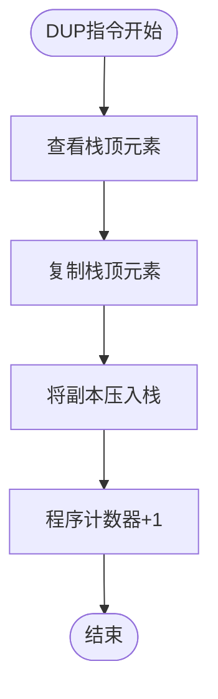

# 指令集架构

<cite>
**本文档中引用的文件**
- [VMOpCode.java](file://src/main/java/org/jcnc/snow/vm/engine/VMOpCode.java)
- [Command.java](file://src/main/java/org/jcnc/snow/vm/interfaces/Command.java)
- [DupCommand.java](file://src/main/java/org/jcnc/snow/vm/commands/stack/control/DupCommand.java)
- [JumpCommand.java](file://src/main/java/org/jcnc/snow/vm/commands/flow/control/JumpCommand.java)
- [BAddCommand.java](file://src/main/java/org/jcnc/snow/vm/commands/type/control/byte8/BAddCommand.java)
- [IAddCommand.java](file://src/main/java/org/jcnc/snow/vm/commands/type/control/int32/IAddCommand.java)
- [BCECommand.java](file://src/main/java/org/jcnc/snow/vm/commands/type/control/byte8/BCECommand.java)
- [B2SCommand.java](file://src/main/java/org/jcnc/snow/vm/commands/type/conversion/B2SCommand.java)
- [LocalVariableStore.java](file://src/main/java/org/jcnc/snow/vm/module/LocalVariableStore.java)
- [SyscallOpCode.java](file://src/main/java/org/jcnc/snow/vm/engine/SyscallOpCode.java)
- [ArrGetHandler.java](file://src/main/java/org/jcnc/snow/vm/commands/system/control/array/ArrGetHandler.java)
- [ArrSetHandler.java](file://src/main/java/org/jcnc/snow/vm/commands/system/control/array/ArrSetHandler.java)
- [ArrLenHandler.java](file://src/main/java/org/jcnc/snow/vm/commands/system/control/array/ArrLenHandler.java)
- [ArrPushHandler.java](file://src/main/java/org/jcnc/snow/vm/commands/system/control/array/ArrPushHandler.java)
- [ArrPopHandler.java](file://src/main/java/org/jcnc/snow/vm/commands/system/control/array/ArrPopHandler.java)
- [ArrInsertHandler.java](file://src/main/java/org/jcnc/snow/vm/commands/system/control/array/ArrInsertHandler.java)
- [ArrRemoveHandler.java](file://src/main/java/org/jcnc/snow/vm/commands/system/control/array/ArrRemoveHandler.java)
- [ArrResizeHandler.java](file://src/main/java/org/jcnc/snow/vm/commands/system/control/array/ArrResizeHandler.java)
- [ArrClearHandler.java](file://src/main/java/org/jcnc/snow/vm/commands/system/control/array/ArrClearHandler.java)
</cite>

## 更新摘要
**变更内容**
- 在“指令分类体系”章节中新增了“数组操作指令”类别
- 新增“数组操作指令”章节，详细描述了新增的数组系统调用
- 在“指令编码规范”章节中更新了系统控制指令的操作码范围
- 在“指令速查表”章节中添加了完整的数组操作指令列表
- 更新了“系统控制指令速查”表格，包含新增的数组操作指令

## 目录
1. [概述](#概述)
2. [指令集架构设计](#指令集架构设计)
3. [指令分类体系](#指令分类体系)
4. [数据类型指令族](#数据类型指令族)
5. [算术运算指令](#算术运算指令)
6. [比较运算指令](#比较运算指令)
7. [逻辑运算指令](#逻辑运算指令)
8. [栈操作指令](#栈操作指令)
9. [控制流指令](#控制流指令)
10. [类型转换指令](#类型转换指令)
11. [数组操作指令](#数组操作指令)
12. [指令编码规范](#指令编码规范)
13. [指令速查表](#指令速查表)
14. [性能优化考虑](#性能优化考虑)
15. [总结](#总结)

## 概述

Snow虚拟机采用紧凑的指令集架构设计，通过统一的操作码（Opcode）编码体系支持多种数据类型的运算和控制流操作。指令集按照功能域进行逻辑分组，每个指令都有明确的操作语义和执行步骤，确保了虚拟机的高效执行和可维护性。近期新增了数组操作的系统调用，扩展了虚拟机对动态数据结构的支持能力。

## 指令集架构设计

### 核心设计理念

Snow虚拟机指令集采用以下核心设计原则：

1. **类型安全**：每种数据类型都有对应的指令族，确保类型安全的运算
2. **统一接口**：所有指令都实现Command接口，提供一致的执行模型
3. **紧凑编码**：使用32位操作码，支持高效的指令解码
4. **层次化组织**：按功能域分层，便于理解和维护

### 指令执行模型


**图表来源**
- [Command.java](file://src/main/java/org/jcnc/snow/vm/interfaces/Command.java#L1-L54)
- [VMOpCode.java](file://src/main/java/org/jcnc/snow/vm/engine/VMOpCode.java#L1-L100)

**章节来源**
- [Command.java](file://src/main/java/org/jcnc/snow/vm/interfaces/Command.java#L1-L54)
- [VMOpCode.java](file://src/main/java/org/jcnc/snow/vm/engine/VMOpCode.java#L1-L200)

## 指令分类体系

Snow虚拟机指令集按照功能域分为以下主要类别：


**图表来源**
- [VMOpCode.java](file://src/main/java/org/jcnc/snow/vm/engine/VMOpCode.java#L20-L2794)

## 数据类型指令族

Snow虚拟机支持六种基本数据类型，每种类型都有完整的指令族支持：

### 字节类型（byte8）

| 操作码 | 指令名称 | 功能描述 |
|--------|----------|----------|
| 0x0000 | B_ADD | 字节加法运算 |
| 0x0001 | B_SUB | 字节减法运算 |
| 0x0002 | B_MUL | 字节乘法运算 |
| 0x0003 | B_DIV | 字节除法运算 |
| 0x0004 | B_MOD | 字节取模运算 |
| 0x0005 | B_NEG | 字节取反运算 |
| 0x0006 | B_INC | 字节递增运算 |
| 0x0007 | B_AND | 字节按位与 |
| 0x0008 | B_OR | 字节按位或 |
| 0x0009 | B_XOR | 字节按位异或 |
| 0x000A | B_PUSH | 压入字节常量 |
| 0x000B | B_LOAD | 加载字节变量 |
| 0x000C | B_STORE | 存储字节变量 |
| 0x000D | B_CE | 字节相等跳转 |
| 0x000E | B_CNE | 字节不等跳转 |
| 0x000F | B_CG | 字节大于跳转 |
| 0x0010 | B_CGE | 字节大于等于跳转 |
| 0x0011 | B_CL | 字节小于跳转 |
| 0x0012 | B_CLE | 字节小于等于跳转 |

### 短整型（short16）

| 操作码 | 指令名称 | 功能描述 |
|--------|----------|----------|
| 0x0020 | S_ADD | 短整型加法 |
| 0x0021 | S_SUB | 短整型减法 |
| 0x0022 | S_MUL | 短整型乘法 |
| 0x0023 | S_DIV | 短整型除法 |
| 0x0024 | S_MOD | 短整型取模 |
| 0x0025 | S_NEG | 短整型取反 |
| 0x0026 | S_INC | 短整型递增 |
| 0x0027 | S_AND | 短整型按位与 |
| 0x0028 | S_OR | 短整型按位或 |
| 0x0029 | S_XOR | 短整型按位异或 |
| 0x002A | S_PUSH | 压入短整型常量 |
| 0x002B | S_LOAD | 加载短整型变量 |
| 0x002C | S_STORE | 存储短整型变量 |
| 0x002D | S_CE | 短整型相等跳转 |
| 0x002E | S_CNE | 短整型不等跳转 |
| 0x002F | S_CG | 短整型大于跳转 |
| 0x0030 | S_CGE | 短整型大于等于跳转 |
| 0x0031 | S_CL | 短整型小于跳转 |
| 0x0032 | S_CLE | 短整型小于等于跳转 |

### 整型（int32）

| 操作码 | 指令名称 | 功能描述 |
|--------|----------|----------|
| 0x0040 | I_ADD | 整型加法 |
| 0x0041 | I_SUB | 整型减法 |
| 0x0042 | I_MUL | 整型乘法 |
| 0x0043 | I_DIV | 整型除法 |
| 0x0044 | I_MOD | 整型取模 |
| 0x0045 | I_NEG | 整型取反 |
| 0x0046 | I_INC | 整型递增 |
| 0x0047 | I_AND | 整型按位与 |
| 0x0048 | I_OR | 整型按位或 |
| 0x0049 | I_XOR | 整型按位异或 |
| 0x004A | I_PUSH | 压入整型常量 |
| 0x004B | I_LOAD | 加载整型变量 |
| 0x004C | I_STORE | 存储整型变量 |
| 0x004D | I_CE | 整型相等跳转 |
| 0x004E | I_CNE | 整型不等跳转 |
| 0x004F | I_CG | 整型大于跳转 |
| 0x0050 | I_CGE | 整型大于等于跳转 |
| 0x0051 | I_CL | 整型小于跳转 |
| 0x0052 | I_CLE | 整型小于等于跳转 |

### 长整型（long64）

| 操作码 | 指令名称 | 功能描述 |
|--------|----------|----------|
| 0x0060 | L_ADD | 长整型加法 |
| 0x0061 | L_SUB | 长整型减法 |
| 0x0062 | L_MUL | 长整型乘法 |
| 0x0063 | L_DIV | 长整型除法 |
| 0x0064 | L_MOD | 长整型取模 |
| 0x0065 | L_NEG | 长整型取反 |
| 0x0066 | L_INC | 长整型递增 |
| 0x0067 | L_AND | 长整型按位与 |
| 0x0068 | L_OR | 长整型按位或 |
| 0x0069 | L_XOR | 长整型按位异或 |
| 0x006A | L_PUSH | 压入长整型常量 |
| 0x006B | L_LOAD | 加载长整型变量 |
| 0x006C | L_STORE | 存储长整型变量 |
| 0x006D | L_CE | 长整型相等跳转 |
| 0x006E | L_CNE | 长整型不等跳转 |
| 0x006F | L_CG | 长整型大于跳转 |
| 0x0070 | L_CGE | 长整型大于等于跳转 |
| 0x0071 | L_CL | 长整型小于跳转 |
| 0x0072 | L_CLE | 长整型小于等于跳转 |

### 单精度浮点（float32）

| 操作码 | 指令名称 | 功能描述 |
|--------|----------|----------|
| 0x0080 | F_ADD | 浮点加法 |
| 0x0081 | F_SUB | 浮点减法 |
| 0x0082 | F_MUL | 浮点乘法 |
| 0x0083 | F_DIV | 浮点除法 |
| 0x0084 | F_MOD | 浮点取模 |
| 0x0085 | F_NEG | 浮点取反 |
| 0x0086 | F_INC | 浮点递增 |
| 0x0087 | F_PUSH | 压入浮点常量 |
| 0x0088 | F_LOAD | 加载浮点变量 |
| 0x0089 | F_STORE | 存储浮点变量 |
| 0x008A | F_CE | 浮点相等跳转 |
| 0x008B | F_CNE | 浮点不等跳转 |
| 0x008C | F_CG | 浮点大于跳转 |
| 0x008D | F_CGE | 浮点大于等于跳转 |
| 0x008E | F_CL | 浮点小于跳转 |
| 0x008F | F_CLE | 浮点小于等于跳转 |

### 双精度浮点（double64）

| 操作码 | 指令名称 | 功能描述 |
|--------|----------|----------|
| 0x00A0 | D_ADD | 双精度加法 |
| 0x00A1 | D_SUB | 双精度减法 |
| 0x00A2 | D_MUL | 双精度乘法 |
| 0x00A3 | D_DIV | 双精度除法 |
| 0x00A4 | D_MOD | 双精度取模 |
| 0x00A5 | D_NEG | 双精度取反 |
| 0x00A6 | D_INC | 双精度递增 |
| 0x00A7 | D_PUSH | 压入双精度常量 |
| 0x00A8 | D_LOAD | 加载双精度变量 |
| 0x00A9 | D_STORE | 存储双精度变量 |
| 0x00AA | D_CE | 双精度相等跳转 |
| 0x00AB | D_CNE | 双精度不等跳转 |
| 0x00AC | D_CG | 双精度大于跳转 |
| 0x00AD | D_CGE | 双精度大于等于跳转 |
| 0x00AE | D_CL | 双精度小于跳转 |
| 0x00AF | D_CLE | 双精度小于等于跳转 |

**章节来源**
- [VMOpCode.java](file://src/main/java/org/jcnc/snow/vm/engine/VMOpCode.java#L20-L2400)

## 算术运算指令

### 基本算术运算

Snow虚拟机为每种数据类型提供了完整的算术运算指令，包括加法、减法、乘法、除法和取模运算。

#### 加法运算流程


**图表来源**
- [BAddCommand.java](file://src/main/java/org/jcnc/snow/vm/commands/type/control/byte8/BAddCommand.java#L35-L58)
- [IAddCommand.java](file://src/main/java/org/jcnc/snow/vm/commands/type/control/int32/IAddCommand.java#L35-L58)

#### 除法运算特殊处理

除法运算需要特别处理除零错误：


**图表来源**
- [VMOpCode.java](file://src/main/java/org/jcnc/snow/vm/engine/VMOpCode.java#L100-L150)

**章节来源**
- [BAddCommand.java](file://src/main/java/org/jcnc/snow/vm/commands/type/control/byte8/BAddCommand.java#L1-L59)
- [IAddCommand.java](file://src/main/java/org/jcnc/snow/vm/commands/type/control/int32/IAddCommand.java#L1-L59)

## 比较运算指令

### 条件跳转机制

Snow虚拟机使用条件跳转指令实现分支控制，每种数据类型都有对应的相等、不等和大小比较指令。

#### 相等比较流程


**图表来源**
- [BCECommand.java](file://src/main/java/org/jcnc/snow/vm/commands/type/control/byte8/BCECommand.java#L55-L75)

#### 大小比较指令族

| 比较类型 | 字节类型 | 整型类型 | 长整型类型 | 浮点类型 | 双精度类型 |
|----------|----------|----------|------------|----------|------------|
| 大于 | B_CG | I_CG | L_CG | F_CG | D_CG |
| 大于等于 | B_CGE | I_CGE | L_CGE | F_CGE | D_CGE |
| 小于 | B_CL | I_CL | L_CL | F_CL | D_CL |
| 小于等于 | B_CLE | I_CLE | L_CLE | F_CLE | D_CLE |

**章节来源**
- [BCECommand.java](file://src/main/java/org/jcnc/snow/vm/commands/type/control/byte8/BCECommand.java#L1-L76)

## 逻辑运算指令

### 按位运算

Snow虚拟机为整型和长整型提供了完整的按位运算指令：

#### 按位与运算

按位与运算逐位比较两个操作数的对应位，只有当两个位都为1时结果位才为1。

#### 按位或运算

按位或运算逐位比较两个操作数的对应位，只要有一个位为1结果位就为1。

#### 按位异或运算

按位异或运算逐位比较两个操作数的对应位，当两个位不同时结果位为1。

**章节来源**
- [VMOpCode.java](file://src/main/java/org/jcnc/snow/vm/engine/VMOpCode.java#L100-L200)

## 栈操作指令

### 栈管理机制

Snow虚拟机的栈操作指令提供了基本的栈管理功能：

#### DUP指令（复制指令）



**图表来源**
- [DupCommand.java](file://src/main/java/org/jcnc/snow/vm/commands/stack/control/DupCommand.java#L55-L67)

#### POP指令（弹栈指令）

弹栈指令移除栈顶元素但不返回其值，主要用于清理操作数栈。

#### SWAP指令（交换指令）

交换指令将栈顶的两个元素位置互换，用于调整操作数顺序。

**章节来源**
- [DupCommand.java](file://src/main/java/org/jcnc/snow/vm/commands/stack/control/DupCommand.java#L1-L68)

## 控制流指令

### 跳转指令

#### JUMP指令（无条件跳转）


**图表来源**
- [JumpCommand.java](file://src/main/java/org/jcnc/snow/vm/commands/flow/control/JumpCommand.java#L55-L73)

#### CALL指令（函数调用）

函数调用指令创建新的栈帧并转移控制流到目标函数。

#### RET指令（函数返回）

函数返回指令恢复调用前的程序状态并返回到调用者。

**章节来源**
- [JumpCommand.java](file://src/main/java/org/jcnc/snow/vm/commands/flow/control/JumpCommand.java#L1-L74)

## 类型转换指令

### 全组合转换矩阵

Snow虚拟机支持25种类型转换指令，覆盖了所有可能的数据类型转换组合：

#### 字节类型转换

| 源类型 | 目标类型 | 操作码 | 转换说明 |
|--------|----------|--------|----------|
| byte8 | short16 | B2S | 符号扩展 |
| byte8 | int32 | B2I | 符号扩展 |
| byte8 | long64 | B2L | 符号扩展 |
| byte8 | float32 | B2F | 数值转换 |
| byte8 | double64 | B2D | 数值转换 |

#### 整型转换

| 源类型 | 目标类型 | 操作码 | 转换说明 |
|--------|----------|--------|----------|
| int32 | byte8 | I2B | 截断高位 |
| int32 | short16 | I2S | 截断高位 |
| int32 | long64 | I2L | 符号扩展 |
| int32 | float32 | I2F | 数值转换 |
| int32 | double64 | I2D | 数值转换 |

#### 浮点类型转换

| 源类型 | 目标类型 | 操作码 | 转换说明 |
|--------|----------|--------|----------|
| float32 | byte8 | F2B | 截断小数部分 |
| float32 | short16 | F2S | 截断小数部分 |
| float32 | int32 | F2I | 截断小数部分 |
| float32 | long64 | F2L | 截断小数部分 |
| float32 | double64 | F2D | 精度提升 |

**章节来源**
- [B2SCommand.java](file://src/main/java/org/jcnc/snow/vm/commands/type/conversion/B2SCommand.java#L1-L48)

## 数组操作指令

### 数组操作指令族

Snow虚拟机新增了对数组操作的系统调用支持，通过系统调用指令实现对数组、列表等动态数据结构的操作。这些指令通过操作码0x1800-0x18FF范围内的系统调用实现，支持Java的List、原生数组和字符序列等类型。

### 数组操作指令功能

#### ARR_LEN指令（获取长度）

| 操作码 | 指令名称 | 功能描述 |
|--------|----------|----------|
| 0x1801 | ARR_LEN | 获取数组/列表/字符串的长度 |

**执行流程**


**章节来源**
- [ArrLenHandler.java](file://src/main/java/org/jcnc/snow/vm/commands/system/control/array/ArrLenHandler.java#L32-L54)

#### ARR_GET指令（元素读取）

| 操作码 | 指令名称 | 功能描述 |
|--------|----------|----------|
| 0x1802 | ARR_GET | 获取数组/列表指定索引位置的元素 |

**执行流程**


**章节来源**
- [ArrGetHandler.java](file://src/main/java/org/jcnc/snow/vm/commands/system/control/array/ArrGetHandler.java#L46-L79)

#### ARR_SET指令（元素写入）

| 操作码 | 指令名称 | 功能描述 |
|--------|----------|----------|
| 0x1803 | ARR_SET | 设置数组/列表指定索引位置的元素 |

**执行流程**


**章节来源**
- [ArrSetHandler.java](file://src/main/java/org/jcnc/snow/vm/commands/system/control/array/ArrSetHandler.java#L49-L79)

#### ARR_PUSH指令（尾部追加）

| 操作码 | 指令名称 | 功能描述 |
|--------|----------|----------|
| 0x1810 | ARR_PUSH | 向列表尾部追加元素 |

**执行流程**


**章节来源**
- [ArrPushHandler.java](file://src/main/java/org/jcnc/snow/vm/commands/system/control/array/ArrPushHandler.java#L34-L48)

#### ARR_POP指令（尾部弹出）

| 操作码 | 指令名称 | 功能描述 |
|--------|----------|----------|
| 0x1811 | ARR_POP | 移除并返回列表末尾的元素 |

**执行流程**


**章节来源**
- [ArrPopHandler.java](file://src/main/java/org/jcnc/snow/vm/commands/system/control/array/ArrPopHandler.java#L35-L58)

#### ARR_INSERT指令（指定插入）

| 操作码 | 指令名称 | 功能描述 |
|--------|----------|----------|
| 0x1812 | ARR_INSERT | 在指定索引位置插入元素 |

**执行流程**


**章节来源**
- [ArrInsertHandler.java](file://src/main/java/org/jcnc/snow/vm/commands/system/control/array/ArrInsertHandler.java#L36-L61)

#### ARR_REMOVE指令（指定删除）

| 操作码 | 指令名称 | 功能描述 |
|--------|----------|----------|
| 0x1813 | ARR_REMOVE | 删除指定索引位置的元素并返回 |

**执行流程**


**章节来源**
- [ArrRemoveHandler.java](file://src/main/java/org/jcnc/snow/vm/commands/system/control/array/ArrRemoveHandler.java#L36-L61)

#### ARR_RESIZE指令（调整大小）

| 操作码 | 指令名称 | 功能描述 |
|--------|----------|----------|
| 0x1814 | ARR_RESIZE | 调整列表长度 |

**执行流程**


**章节来源**
- [ArrResizeHandler.java](file://src/main/java/org/jcnc/snow/vm/commands/system/control/array/ArrResizeHandler.java#L40-L69)

#### ARR_CLEAR指令（清空列表）

| 操作码 | 指令名称 | 功能描述 |
|--------|----------|----------|
| 0x1815 | ARR_CLEAR | 清空列表 |

**执行流程**


**章节来源**
- [ArrClearHandler.java](file://src/main/java/org/jcnc/snow/vm/commands/system/control/array/ArrClearHandler.java#L32-L41)

## 指令编码规范

### 操作码编码规则

Snow虚拟机指令采用紧凑的32位编码格式：

#### 指令格式结构

```
+------------------+------------------+------------------+------------------+
|      字节 0      |      字节 1      |      字节 2      |      字节 3      |
+------------------+------------------+------------------+------------------+
|    操作码高8位   |    操作码低8位   |    参数1高8位    |    参数1低8位    |
+------------------+------------------+------------------+------------------+
|    参数2高8位    |    参数2低8位    |    参数3高8位    |    参数3低8位    |
+------------------+------------------+------------------+------------------+
```

#### 操作码范围分配

| 指令类别 | 操作码范围 | 说明 |
|----------|------------|------|
| 算术指令 | 0x0000-0x00BF | 包含所有数据类型的算术运算 |
| 类型转换 | 0x00C0-0x00DF | 字节到其他类型的转换 |
| 引用控制 | 0x00E0-0x00EF | 对象引用操作 |
| 栈控制 | 0x0100-0x01FF | 栈操作指令 |
| 控制流 | 0x0200-0x02FF | 分支和函数调用 |
| 寄存器控制 | 0x0300-0x03FF | 局部变量操作 |
| 系统控制 | 0x0400-0x04FF | 系统级操作，包括新增的数组操作指令 |
| 数组操作 | 0x1800-0x18FF | 数组/列表操作的系统调用 |

### 参数格式规范

指令参数根据指令类型有不同的格式：

1. **立即数参数**：直接嵌入在指令中的常量值
2. **索引参数**：指向局部变量表的索引
3. **地址参数**：目标指令的绝对地址
4. **标签参数**：目标指令的相对偏移量

**章节来源**
- [VMOpCode.java](file://src/main/java/org/jcnc/snow/vm/engine/VMOpCode.java#L1-L50)
- [SyscallOpCode.java](file://src/main/java/org/jcnc/snow/vm/engine/SyscallOpCode.java#L1004-L1171)

## 指令速查表

### 完整指令列表

| 操作码 | 指令名称 | 数据类型 | 功能描述 |
|--------|----------|----------|----------|
| 0x0000 | B_ADD | byte8 | 字节加法 |
| 0x0001 | B_SUB | byte8 | 字节减法 |
| 0x0002 | B_MUL | byte8 | 字节乘法 |
| 0x0003 | B_DIV | byte8 | 字节除法 |
| 0x0004 | B_MOD | byte8 | 字节取模 |
| 0x0005 | B_NEG | byte8 | 字节取反 |
| 0x0006 | B_INC | byte8 | 字节递增 |
| 0x0007 | B_AND | byte8 | 字节按位与 |
| 0x0008 | B_OR | byte8 | 字节按位或 |
| 0x0009 | B_XOR | byte8 | 字节按位异或 |
| 0x000A | B_PUSH | byte8 | 压入字节常量 |
| 0x000B | B_LOAD | byte8 | 加载字节变量 |
| 0x000C | B_STORE | byte8 | 存储字节变量 |
| 0x000D | B_CE | byte8 | 字节相等跳转 |
| 0x000E | B_CNE | byte8 | 字节不等跳转 |
| 0x000F | B_CG | byte8 | 字节大于跳转 |
| 0x0010 | B_CGE | byte8 | 字节大于等于跳转 |
| 0x0011 | B_CL | byte8 | 字节小于跳转 |
| 0x0012 | B_CLE | byte8 | 字节小于等于跳转 |

### 控制流指令速查

| 操作码 | 指令名称 | 参数类型 | 功能描述 |
|--------|----------|----------|----------|
| 0x0200 | JUMP | 地址 | 无条件跳转 |
| 0x0201 | CALL | 地址 | 函数调用 |
| 0x0202 | RET | 无 | 函数返回 |

### 栈操作指令速查

| 操作码 | 指令名称 | 参数类型 | 功能描述 |
|--------|----------|----------|----------|
| 0x0100 | POP | 无 | 弹栈 |
| 0x0101 | DUP | 无 | 复制栈顶 |
| 0x0102 | SWAP | 无 | 交换栈顶两元素 |

### 数组操作指令速查

| 操作码 | 指令名称 | 参数类型 | 功能描述 |
|--------|----------|----------|----------|
| 0x1801 | ARR_LEN | 数组对象 | 获取数组/列表/字符串的长度 |
| 0x1802 | ARR_GET | 数组对象, 索引 | 获取数组/列表指定索引位置的元素 |
| 0x1803 | ARR_SET | 数组对象, 索引, 值 | 设置数组/列表指定索引位置的元素 |
| 0x1810 | ARR_PUSH | 数组对象, 值 | 向列表尾部追加元素 |
| 0x1811 | ARR_POP | 数组对象 | 移除并返回列表末尾的元素 |
| 0x1812 | ARR_INSERT | 数组对象, 索引, 值 | 在指定索引位置插入元素 |
| 0x1813 | ARR_REMOVE | 数组对象, 索引 | 删除指定索引位置的元素并返回 |
| 0x1814 | ARR_RESIZE | 数组对象, 新长度 | 调整列表长度 |
| 0x1815 | ARR_CLEAR | 数组对象 | 清空列表 |

## 性能优化考虑

### 指令流水线优化

Snow虚拟机指令集设计考虑了以下性能优化策略：

1. **指令长度统一**：所有指令占用相同字节数，简化解码逻辑
2. **操作数栈设计**：减少内存访问次数，提高缓存命中率
3. **类型内聚**：同类型指令使用相似的操作模式
4. **分支预测友好**：条件跳转指令支持常见的分支模式

### 内存访问优化

1. **局部变量存储**：使用索引快速访问局部变量
2. **操作数栈缓存**：减少频繁的堆分配
3. **指令预取**：连续指令的高效执行

### 并发安全考虑

1. **原子操作**：支持基本的原子指令
2. **内存屏障**：确保多线程环境下的正确性
3. **锁机制**：提供同步原语

## 总结

Snow虚拟机指令集架构通过精心设计的指令分类体系和统一的执行模型，实现了高效、类型安全的虚拟机指令系统。指令集涵盖了算术运算、逻辑运算、控制流、栈操作、类型转换和数组操作等各个方面，为上层语言编译器提供了丰富的底层支持。

### 主要特点

1. **类型安全**：每种数据类型都有对应的指令族
2. **统一接口**：所有指令实现相同的Command接口
3. **高效执行**：紧凑的指令编码和优化的执行模型
4. **易于扩展**：模块化的指令设计便于添加新指令
5. **全面的数组支持**：新增的数组操作指令族提供了对动态数据结构的完整支持

### 应用价值

Snow虚拟机指令集架构为现代虚拟机设计提供了有价值的参考，特别是在指令分类、类型系统和性能优化方面的设计思路，对于理解虚拟机内部工作机制具有重要意义。新增的数组操作指令扩展了虚拟机对高级数据结构的支持能力，使得上层语言可以更方便地实现复杂的数据处理逻辑。