# Snow虚拟机控制流指令

<cite>
**本文档中引用的文件**
- [CallCommand.java](file://src/main/java/org/jcnc/snow/vm/commands/flow/control/CallCommand.java)
- [JumpCommand.java](file://src/main/java/org/jcnc/snow/vm/commands/flow/control/JumpCommand.java)
- [RetCommand.java](file://src/main/java/org/jcnc/snow/vm/commands/flow/control/RetCommand.java)
- [StackFrame.java](file://src/main/java/org/jcnc/snow/vm/module/StackFrame.java)
- [CallStack.java](file://src/main/java/org/jcnc/snow/vm/module/CallStack.java)
- [LocalVariableStore.java](file://src/main/java/org/jcnc/snow/vm/module/LocalVariableStore.java)
- [OperandStack.java](file://src/main/java/org/jcnc/snow/vm/module/OperandStack.java)
- [MethodContext.java](file://src/main/java/org/jcnc/snow/vm/module/MethodContext.java)
- [VirtualMachineEngine.java](file://src/main/java/org/jcnc/snow/vm/engine/VirtualMachineEngine.java)
- [CommandExecutionHandler.java](file://src/main/java/org/jcnc/snow/vm/execution/CommandExecutionHandler.java)
- [CallGenerator.java](file://src/main/java/org/jcnc/snow/compiler/backend/generator/CallGenerator.java)
- [ReturnGenerator.java](file://src/main/java/org/jcnc/snow/compiler/backend/generator/ReturnGenerator.java)
- [JumpGenerator.java](file://src/main/java/org/jcnc/snow/compiler/backend/generator/JumpGenerator.java)
</cite>

## 目录
1. [简介](#简介)
2. [项目结构概览](#项目结构概览)
3. [核心组件分析](#核心组件分析)
4. [架构概览](#架构概览)
5. [详细组件分析](#详细组件分析)
6. [栈帧结构管理](#栈帧结构管理)
7. [指令执行流程](#指令执行流程)
8. [性能考虑](#性能考虑)
9. [调试支持](#调试支持)
10. [结论](#结论)

## 简介

Snow虚拟机的控制流指令系统是整个虚拟机的核心组成部分，负责管理函数调用、返回和跳转等关键操作。本文档深入分析了Call、Ret和Jump三种主要控制流指令的实现机制，详细说明了它们如何协同工作来维护函数调用栈、管理局部变量和操作数栈，并提供了完整的内存布局变化图解。

该虚拟机采用了基于栈的架构，通过精心设计的栈帧结构来支持递归调用、尾调用优化以及完善的错误处理机制。系统还提供了强大的调试支持，包括栈回溯、调用栈快照和详细的运行时状态监控。

## 项目结构概览

Snow虚拟机的控制流指令实现分布在多个模块中，形成了清晰的层次结构：

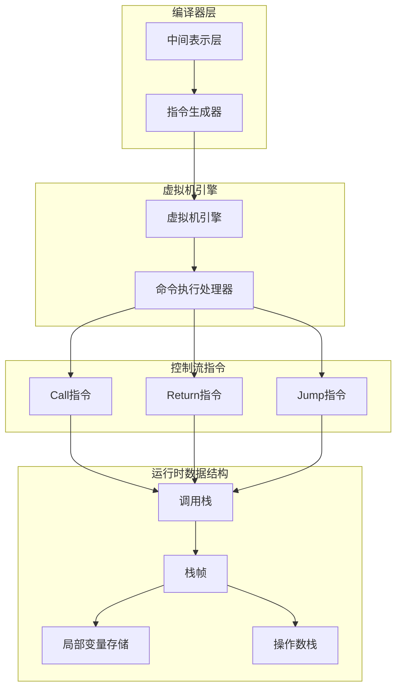

**图表来源**
- [VirtualMachineEngine.java](file://src/main/java/org/jcnc/snow/vm/engine/VirtualMachineEngine.java#L1-L50)
- [CommandExecutionHandler.java](file://src/main/java/org/jcnc/snow/vm/execution/CommandExecutionHandler.java#L1-L30)

**章节来源**
- [VirtualMachineEngine.java](file://src/main/java/org/jcnc/snow/vm/engine/VirtualMachineEngine.java#L1-L191)
- [CallCommand.java](file://src/main/java/org/jcnc/snow/vm/commands/flow/control/CallCommand.java#L1-L82)

## 核心组件分析

### 控制流指令接口体系

Snow虚拟机的控制流指令遵循统一的Command接口设计，确保了指令执行的一致性和可扩展性：

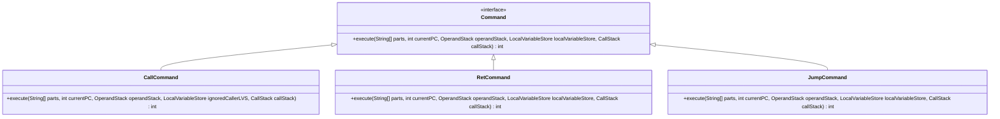

**图表来源**
- [CallCommand.java](file://src/main/java/org/jcnc/snow/vm/commands/flow/control/CallCommand.java#L15-L82)
- [RetCommand.java](file://src/main/java/org/jcnc/snow/vm/commands/flow/control/RetCommand.java#L15-L55)
- [JumpCommand.java](file://src/main/java/org/jcnc/snow/vm/commands/flow/control/JumpCommand.java#L15-L74)

### 虚拟机引擎核心

虚拟机引擎是整个控制流系统的核心协调者，负责指令解析、执行调度和状态管理：

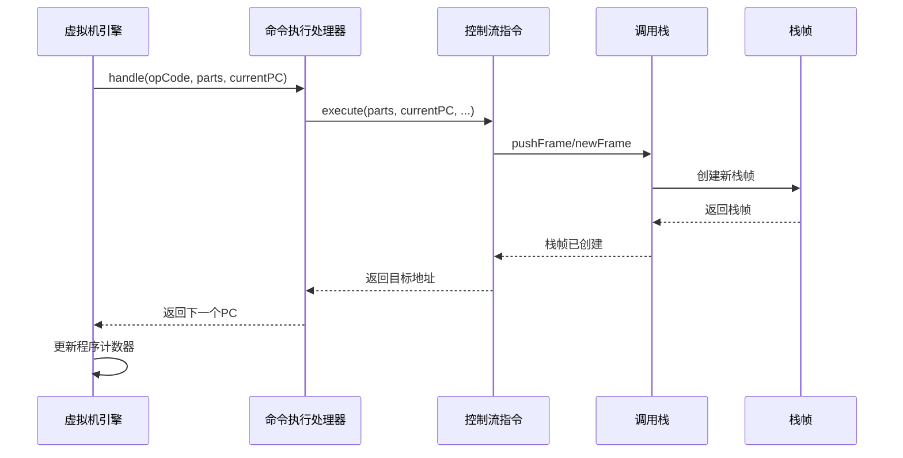

**图表来源**
- [VirtualMachineEngine.java](file://src/main/java/org/jcnc/snow/vm/engine/VirtualMachineEngine.java#L70-L120)
- [CommandExecutionHandler.java](file://src/main/java/org/jcnc/snow/vm/execution/CommandExecutionHandler.java#L35-L60)

**章节来源**
- [VirtualMachineEngine.java](file://src/main/java/org/jcnc/snow/vm/engine/VirtualMachineEngine.java#L40-L100)
- [CommandExecutionHandler.java](file://src/main/java/org/jcnc/snow/vm/execution/CommandExecutionHandler.java#L15-L61)

## 架构概览

Snow虚拟机的控制流指令架构采用了分层设计，从底层的指令实现到高层的虚拟机引擎，每一层都有明确的职责分工：

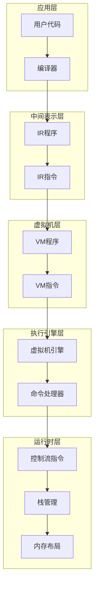

**图表来源**
- [VirtualMachineEngine.java](file://src/main/java/org/jcnc/snow/vm/engine/VirtualMachineEngine.java#L15-L35)
- [CallGenerator.java](file://src/main/java/org/jcnc/snow/compiler/backend/generator/CallGenerator.java#L15-L50)

## 详细组件分析

### Call指令实现机制

Call指令是函数调用的核心实现，负责保存调用上下文、创建新栈帧并传递参数：

#### 指令执行流程

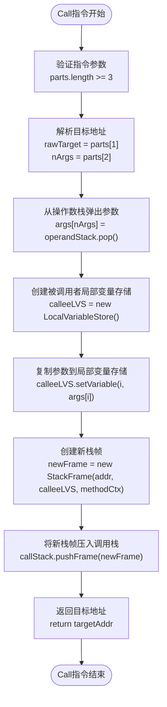

**图表来源**
- [CallCommand.java](file://src/main/java/org/jcnc/snow/vm/commands/flow/control/CallCommand.java#L35-L82)

#### 参数传递机制

Call指令采用从左到右的参数传递策略，参数在调用前被压入操作数栈：

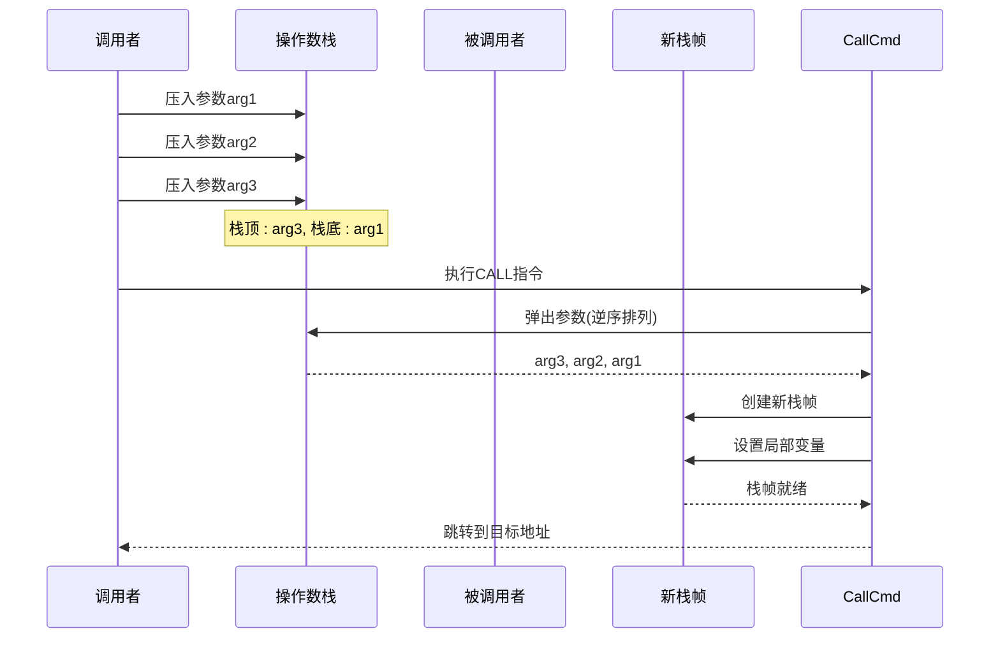

**图表来源**
- [CallCommand.java](file://src/main/java/org/jcnc/snow/vm/commands/flow/control/CallCommand.java#L45-L65)

**章节来源**
- [CallCommand.java](file://src/main/java/org/jcnc/snow/vm/commands/flow/control/CallCommand.java#L1-L82)

### Return指令实现机制

Return指令负责从函数返回，恢复调用者的上下文并清理栈帧：

#### 返回处理逻辑

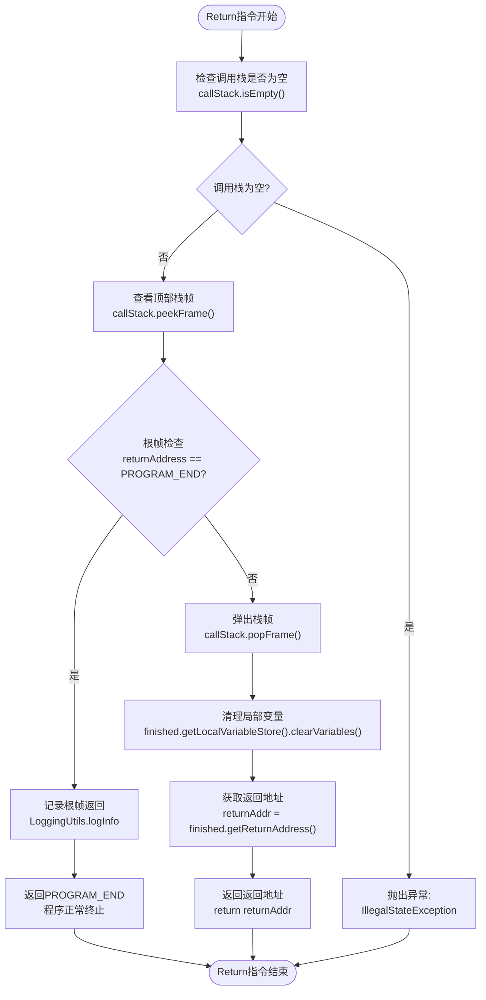

**图表来源**
- [RetCommand.java](file://src/main/java/org/jcnc/snow/vm/commands/flow/control/RetCommand.java#L25-L55)

#### 根帧保护机制

Ret指令实现了根帧保护机制，防止程序意外终止：

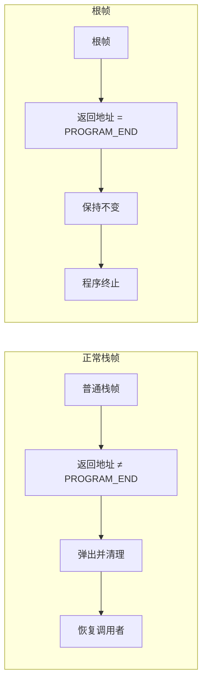

**图表来源**
- [RetCommand.java](file://src/main/java/org/jcnc/snow/vm/commands/flow/control/RetCommand.java#L30-L45)

**章节来源**
- [RetCommand.java](file://src/main/java/org/jcnc/snow/vm/commands/flow/control/RetCommand.java#L1-L55)

### Jump指令实现机制

Jump指令提供无条件跳转功能，支持程序流程的任意转移：

#### 跳转验证机制

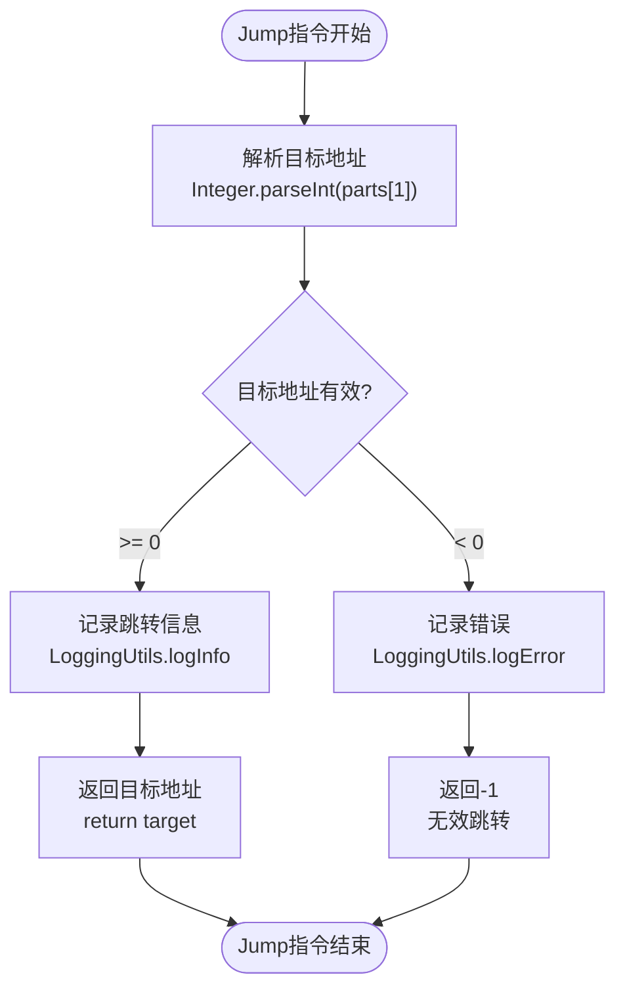

**图表来源**
- [JumpCommand.java](file://src/main/java/org/jcnc/snow/vm/commands/flow/control/JumpCommand.java#L55-L74)

**章节来源**
- [JumpCommand.java](file://src/main/java/org/jcnc/snow/vm/commands/flow/control/JumpCommand.java#L1-L74)

## 栈帧结构管理

### 栈帧数据结构

每个栈帧包含完整的函数执行上下文，支持复杂的函数调用场景：

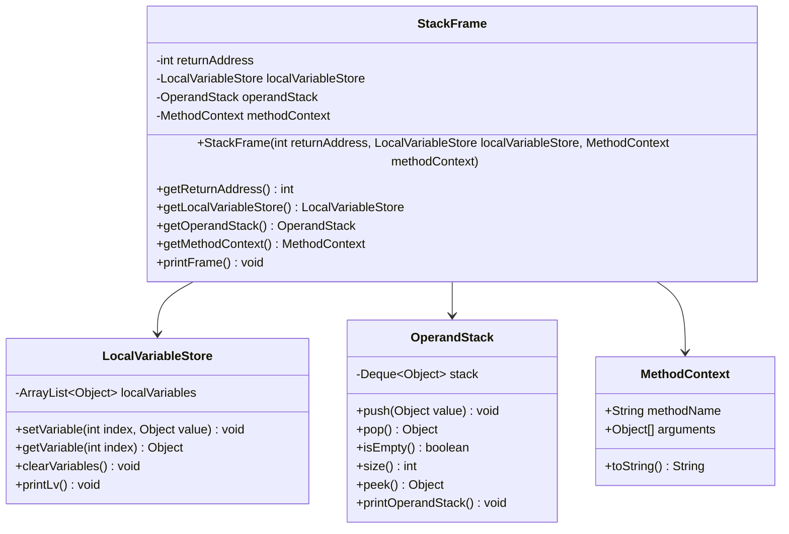

**图表来源**
- [StackFrame.java](file://src/main/java/org/jcnc/snow/vm/module/StackFrame.java#L15-L104)
- [LocalVariableStore.java](file://src/main/java/org/jcnc/snow/vm/module/LocalVariableStore.java#L25-L182)
- [OperandStack.java](file://src/main/java/org/jcnc/snow/vm/module/OperandStack.java#L15-L104)
- [MethodContext.java](file://src/main/java/org/jcnc/snow/vm/module/MethodContext.java#L15-L41)

### 内存布局变化

函数调用过程中的内存布局变化可以通过以下时序图展示：

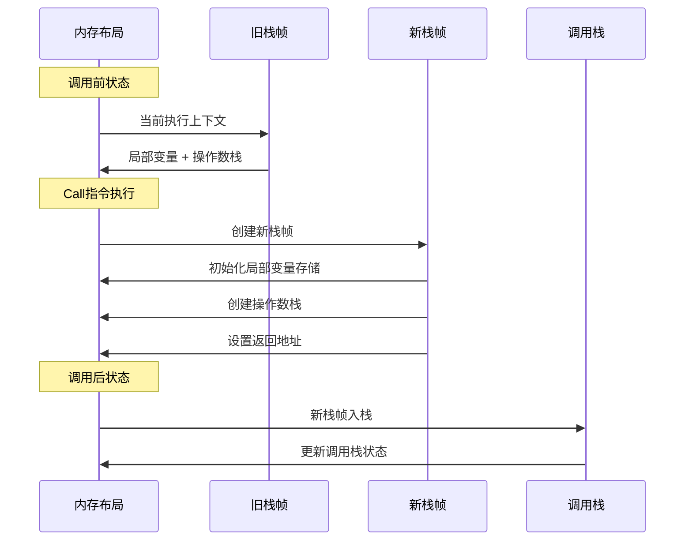

**图表来源**
- [StackFrame.java](file://src/main/java/org/jcnc/snow/vm/module/StackFrame.java#L40-L50)
- [CallStack.java](file://src/main/java/org/jcnc/snow/vm/module/CallStack.java#L25-L45)

**章节来源**
- [StackFrame.java](file://src/main/java/org/jcnc/snow/vm/module/StackFrame.java#L1-L104)
- [LocalVariableStore.java](file://src/main/java/org/jcnc/snow/vm/module/LocalVariableStore.java#L1-L182)
- [OperandStack.java](file://src/main/java/org/jcnc/snow/vm/module/OperandStack.java#L1-L104)

## 指令执行流程

### 虚拟机主循环

虚拟机引擎维护一个主循环来执行指令序列：

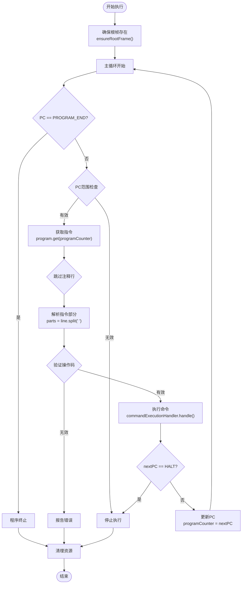

**图表来源**
- [VirtualMachineEngine.java](file://src/main/java/org/jcnc/snow/vm/engine/VirtualMachineEngine.java#L70-L120)

### 指令分发机制

命令执行处理器负责将操作码映射到具体的指令实现：

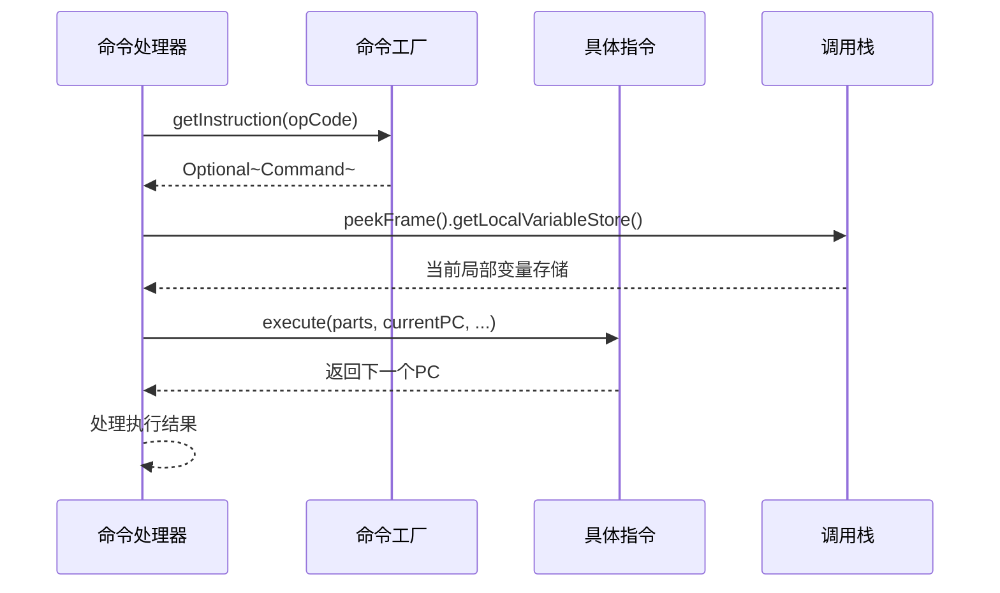

**图表来源**
- [CommandExecutionHandler.java](file://src/main/java/org/jcnc/snow/vm/execution/CommandExecutionHandler.java#L35-L60)

**章节来源**
- [VirtualMachineEngine.java](file://src/main/java/org/jcnc/snow/vm/engine/VirtualMachineEngine.java#L60-L150)
- [CommandExecutionHandler.java](file://src/main/java/org/jcnc/snow/vm/execution/CommandExecutionHandler.java#L1-L61)

## 性能考虑

### 栈深度限制

为了防止栈溢出，虚拟机实现了严格的栈深度限制：

| 配置项 | 默认值 | 说明 |
|--------|--------|------|
| 最大栈深度 | 1024 | 防止无限递归导致的栈溢出 |
| 栈帧大小 | 动态 | 根据局部变量数量动态分配 |
| 操作数栈容量 | 动态增长 | 基于表达式复杂度自动调整 |

### 内存管理优化

虚拟机采用了多种内存管理策略来提高性能：

1. **延迟初始化**: 栈帧只在需要时才创建
2. **对象复用**: 局部变量存储支持重复使用
3. **紧凑化**: 程序终止后自动清理null槽位
4. **缓存友好**: 栈结构采用连续内存布局

### 编译时优化

编译器层面也实现了多项优化措施：

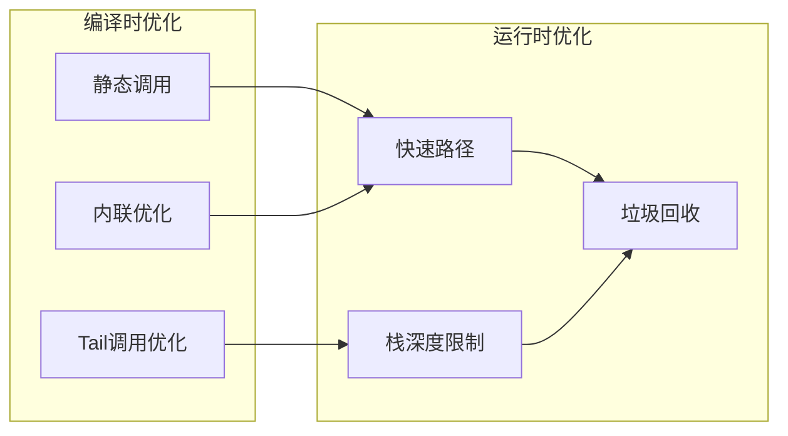

**章节来源**
- [CallStack.java](file://src/main/java/org/jcnc/snow/vm/module/CallStack.java#L15-L25)
- [CallGenerator.java](file://src/main/java/org/jcnc/snow/compiler/backend/generator/CallGenerator.java#L300-L350)

## 调试支持

### 栈回溯机制

虚拟机提供了完整的栈回溯功能，支持异常处理和调试：

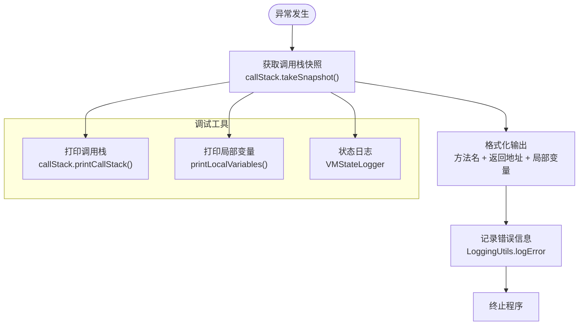

**图表来源**
- [CallStack.java](file://src/main/java/org/jcnc/snow/vm/module/CallStack.java#L55-L75)

### 调试信息输出

虚拟机提供了丰富的调试信息输出功能：

| 调试功能 | 方法 | 输出内容 |
|----------|------|----------|
| 调用栈快照 | `takeSnapshot()` | 方法名、返回地址、局部变量 |
| 栈帧详情 | `printFrame()` | 完整栈帧信息 |
| 局部变量 | `printLv()` | 变量索引和值 |
| 操作数栈 | `printOperandStack()` | 栈内容和大小 |
| 整体状态 | `printStack()` | 栈和调用栈状态 |

### 错误处理机制

虚拟机实现了多层次的错误处理：

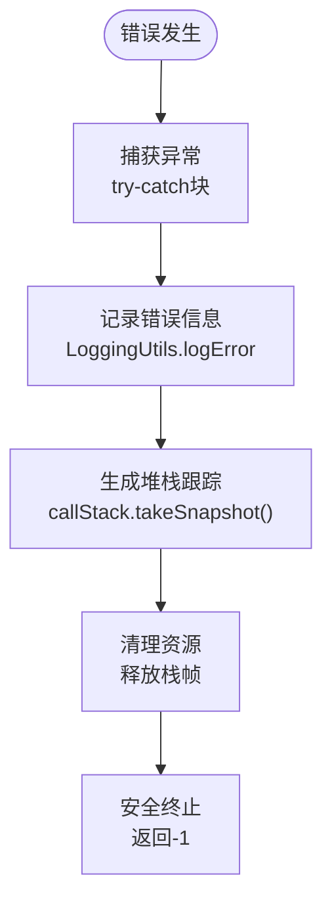

**图表来源**
- [CommandExecutionHandler.java](file://src/main/java/org/jcnc/snow/vm/execution/CommandExecutionHandler.java#L50-L61)

**章节来源**
- [CallStack.java](file://src/main/java/org/jcnc/snow/vm/module/CallStack.java#L50-L97)
- [VirtualMachineEngine.java](file://src/main/java/org/jcnc/snow/vm/engine/VirtualMachineEngine.java#L170-L191)

## 结论

Snow虚拟机的控制流指令系统展现了现代虚拟机设计的最佳实践。通过精心设计的栈帧结构、完善的错误处理机制和强大的调试支持，该系统能够高效地管理函数调用、返回和跳转操作。

### 主要优势

1. **类型安全**: 统一的指令接口确保了类型安全的指令执行
2. **性能优化**: 多层次的优化策略保证了良好的执行性能
3. **调试友好**: 丰富的调试信息和栈回溯功能便于问题诊断
4. **扩展性强**: 清晰的架构设计支持未来的功能扩展

### 设计亮点

- **根帧保护机制**: 防止程序意外终止的安全设计
- **栈深度限制**: 有效的栈溢出防护
- **动态栈帧管理**: 根据实际需求动态分配内存
- **统一的错误处理**: 一致的异常处理和恢复机制

该控制流指令系统为Snow语言提供了坚实的基础，支持复杂的函数调用模式，包括递归调用和尾调用优化，同时保持了良好的性能和可维护性。