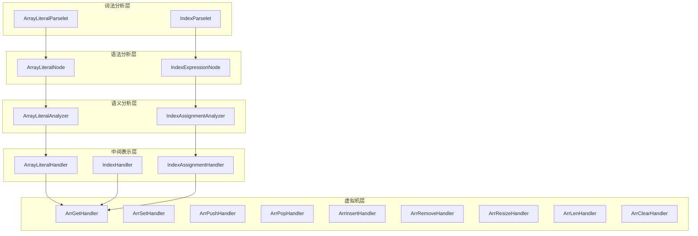
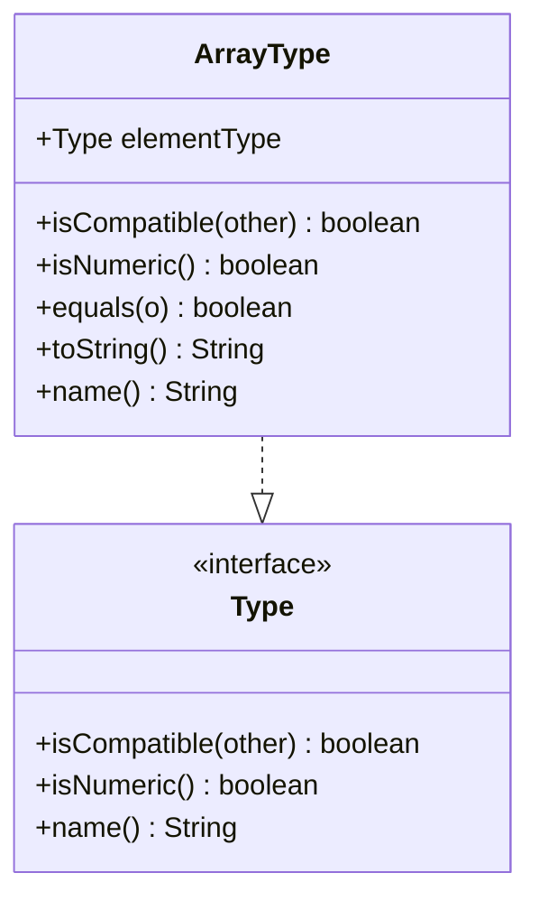
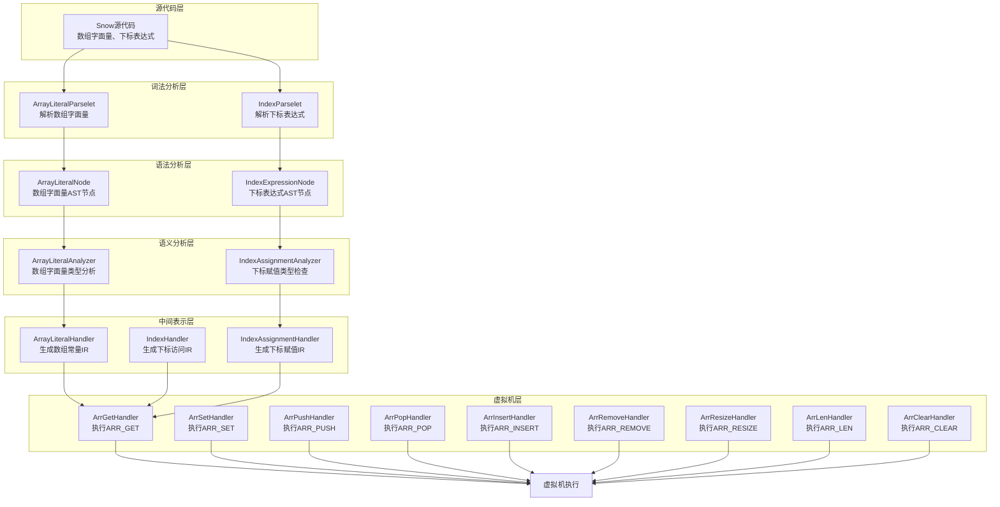
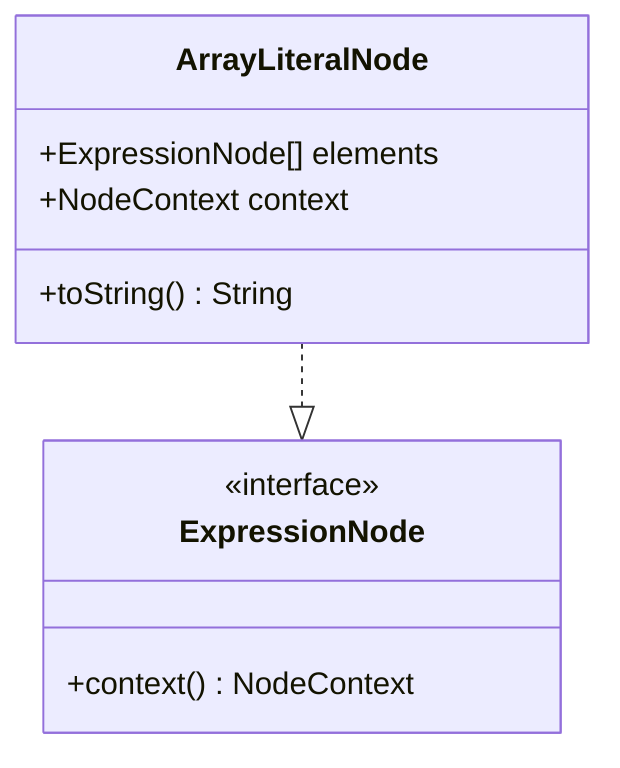
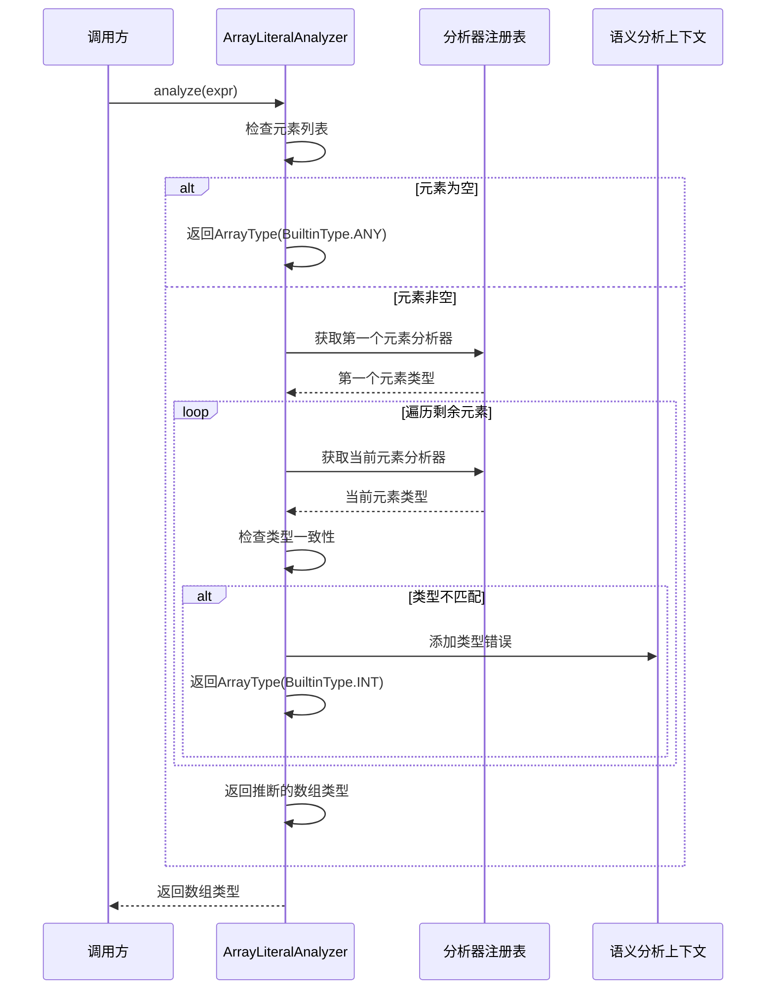
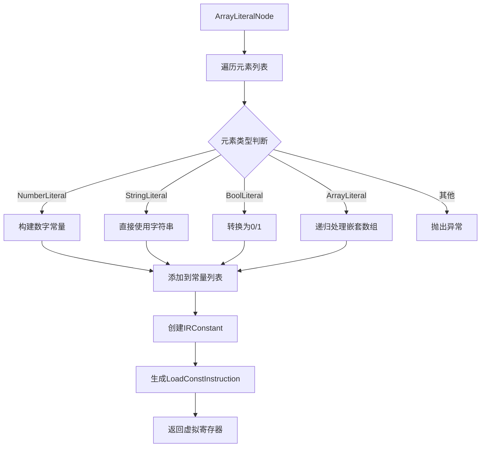
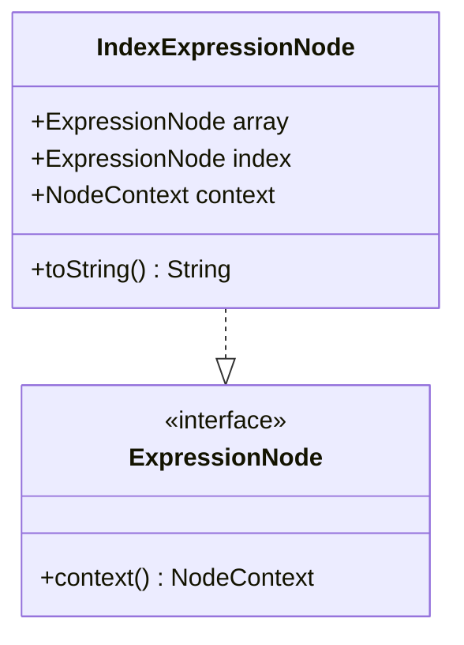
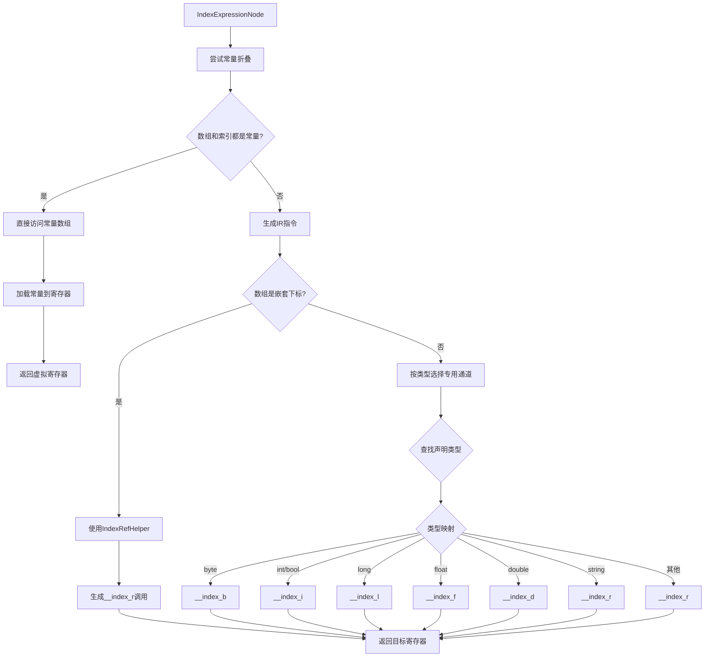
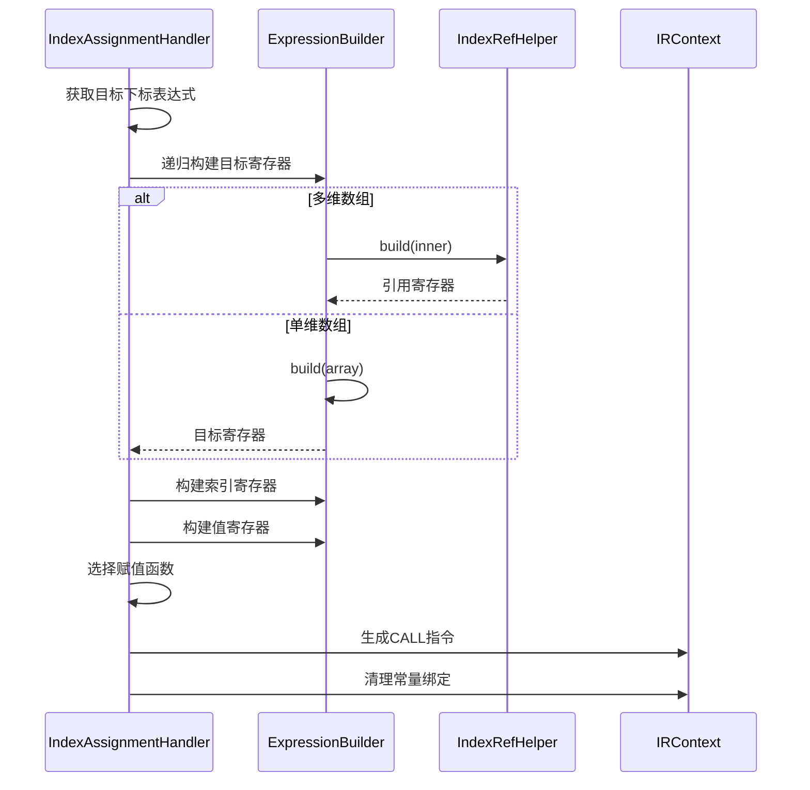
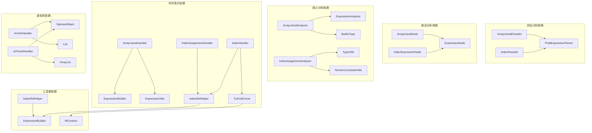

# 数组操作

<cite>
**本文档中引用的文件**
- [SyscallOpCode.java](file://src/main/java/org/jcnc/snow/vm/engine/SyscallOpCode.java)
- [ArrGetHandler.java](file://src/main/java/org/jcnc/snow/vm/commands/system/control/array/ArrGetHandler.java)
- [ArrSetHandler.java](file://src/main/java/org/jcnc/snow/vm/commands/system/control/array/ArrSetHandler.java)
- [ArrPushHandler.java](file://src/main/java/org/jcnc/snow/vm/commands/system/control/array/ArrPushHandler.java)
- [ArrPopHandler.java](file://src/main/java/org/jcnc/snow/vm/commands/system/control/array/ArrPopHandler.java)
- [ArrInsertHandler.java](file://src/main/java/org/jcnc/snow/vm/commands/system/control/array/ArrInsertHandler.java)
- [ArrRemoveHandler.java](file://src/main/java/org/jcnc/snow/vm/commands/system/control/array/ArrRemoveHandler.java)
- [ArrResizeHandler.java](file://src/main/java/org/jcnc/snow/vm/commands/system/control/array/ArrResizeHandler.java)
- [ArrLenHandler.java](file://src/main/java/org/jcnc/snow/vm/commands/system/control/array/ArrLenHandler.java)
- [ArrClearHandler.java](file://src/main/java/org/jcnc/snow/vm/commands/system/control/array/ArrClearHandler.java)
- [ArrayLiteralHandler.java](file://src/main/java/org/jcnc/snow/compiler/ir/builder/handlers/ArrayLiteralHandler.java)
- [ArrayLiteralAnalyzer.java](file://src/main/java/org/jcnc/snow/compiler/semantic/analyzers/expression/ArrayLiteralAnalyzer.java)
- [ArrayLiteralNode.java](file://src/main/java/org/jcnc/snow/compiler/parser/ast/ArrayLiteralNode.java)
- [ArrayLiteralParselet.java](file://src/main/java/org/jcnc/snow/compiler/parser/expression/ArrayLiteralParselet.java)
- [IndexExpressionNode.java](file://src/main/java/org/jcnc/snow/compiler/parser/ast/IndexExpressionNode.java)
- [IndexParselet.java](file://src/main/java/org/jcnc/snow/compiler/parser/expression/IndexParselet.java)
- [IndexHandler.java](file://src/main/java/org/jcnc/snow/compiler/ir/builder/handlers/IndexHandler.java)
- [IndexAssignmentHandler.java](file://src/main/java/org/jcnc/snow/compiler/ir/builder/statement/handlers/IndexAssignmentHandler.java)
- [IndexAssignmentAnalyzer.java](file://src/main/java/org/jcnc/snow/compiler/semantic/analyzers/statement/IndexAssignmentAnalyzer.java)
- [ArrayType.java](file://src/main/java/org/jcnc/snow/compiler/semantic/type/ArrayType.java)
- [IndexRefHelper.java](file://src/main/java/org/jcnc/snow/compiler/ir/builder/utils/IndexRefHelper.java)
</cite>

## 目录
1. [简介](#简介)
2. [项目结构](#项目结构)
3. [核心组件](#核心组件)
4. [架构概览](#架构概览)
5. [详细组件分析](#详细组件分析)
6. [依赖关系分析](#依赖关系分析)
7. [性能考虑](#性能考虑)
8. [故障排除指南](#故障排除指南)
9. [结论](#结论)

## 简介

Snow编译器的数组操作功能提供了完整的数组处理能力，包括数组字面量创建、下标访问、元素操作和类型检查。该系统采用分层架构设计，从词法分析到虚拟机执行，每个阶段都有专门的组件负责特定的功能。

数组操作涵盖了以下核心功能：
- 数组字面量的解析和编译
- 下标访问和赋值操作
- 动态数组操作（增删改查）
- 类型安全的数组访问
- 多维数组支持

## 项目结构

Snow编译器的数组操作功能分布在多个模块中，形成了完整的编译流水线：



**图表来源**
- [ArrayLiteralParselet.java](file://src/main/java/org/jcnc/snow/compiler/parser/expression/ArrayLiteralParselet.java#L1-L80)
- [IndexParselet.java](file://src/main/java/org/jcnc/snow/compiler/parser/expression/IndexParselet.java#L1-L51)
- [ArrayLiteralHandler.java](file://src/main/java/org/jcnc/snow/compiler/ir/builder/handlers/ArrayLiteralHandler.java#L1-L82)
- [IndexHandler.java](file://src/main/java/org/jcnc/snow/compiler/ir/builder/handlers/IndexHandler.java#L1-L80)

## 核心组件

### 系统调用码定义

Snow虚拟机定义了一套完整的数组操作系统调用码，每个操作都有唯一的标识符：

| 操作 | 系统调用码 | 功能描述 |
|------|------------|----------|
| ARR_LEN | 0x1801 | 获取数组/列表/字符串长度 |
| ARR_GET | 0x1802 | 获取数组/列表指定索引元素 |
| ARR_SET | 0x1803 | 设置数组/列表指定索引元素 |
| ARR_PUSH | 0x1810 | 向列表尾部添加元素 |
| ARR_POP | 0x1811 | 从列表尾部移除元素 |
| ARR_INSERT | 0x1812 | 在指定位置插入元素 |
| ARR_REMOVE | 0x1813 | 移除指定索引位置的元素 |
| ARR_RESIZE | 0x1814 | 调整列表长度 |
| ARR_CLEAR | 0x1815 | 清空列表 |

**章节来源**
- [SyscallOpCode.java](file://src/main/java/org/jcnc/snow/vm/engine/SyscallOpCode.java#L1034-L1144)

### 数组类型系统

数组类型系统提供了类型安全的数组操作支持：



**图表来源**
- [ArrayType.java](file://src/main/java/org/jcnc/snow/compiler/semantic/type/ArrayType.java#L11-L74)

**章节来源**
- [ArrayType.java](file://src/main/java/org/jcnc/snow/compiler/semantic/type/ArrayType.java#L1-L74)

## 架构概览

Snow编译器的数组操作采用多层架构设计，每层负责不同的处理职责：



**图表来源**
- [ArrayLiteralParselet.java](file://src/main/java/org/jcnc/snow/compiler/parser/expression/ArrayLiteralParselet.java#L1-L80)
- [IndexParselet.java](file://src/main/java/org/jcnc/snow/compiler/parser/expression/IndexParselet.java#L1-L51)
- [ArrayLiteralHandler.java](file://src/main/java/org/jcnc/snow/compiler/ir/builder/handlers/ArrayLiteralHandler.java#L1-L82)
- [IndexHandler.java](file://src/main/java/org/jcnc/snow/compiler/ir/builder/handlers/IndexHandler.java#L1-L80)

## 详细组件分析

### 数组字面量处理

#### 词法分析阶段

数组字面量的词法分析通过`ArrayLiteralParselet`实现，支持多行书写和灵活的语法结构：

```mermaid
flowchart TD
A[左中括号 '['] --> B[跳过换行符]
B --> C{是否遇到右中括号?}
C --> |是| D[创建空数组节点]
C --> |否| E[解析元素表达式]
E --> F[添加到元素列表]
F --> G{下一个字符是逗号?}
G --> |是| H[跳过换行符]
H --> E
G --> |否| I{下一个字符是右中括号?}
I --> |是| J[创建数组节点]
I --> |否| K[语法错误]
D --> L[返回ArrayLiteralNode]
J --> L
K --> M[抛出语法异常]
```

**图表来源**
- [ArrayLiteralParselet.java](file://src/main/java/org/jcnc/snow/compiler/parser/expression/ArrayLiteralParselet.java#L46-L79)

#### 语法分析阶段

`ArrayLiteralNode`记录了数组的所有元素表达式和源代码上下文信息：



**图表来源**
- [ArrayLiteralNode.java](file://src/main/java/org/jcnc/snow/compiler/parser/ast/ArrayLiteralNode.java#L19-L40)

#### 语义分析阶段

`ArrayLiteralAnalyzer`负责推断数组类型并检查元素类型一致性：



**图表来源**
- [ArrayLiteralAnalyzer.java](file://src/main/java/org/jcnc/snow/compiler/semantic/analyzers/expression/ArrayLiteralAnalyzer.java#L39-L63)

#### 中间表示生成

`ArrayLiteralHandler`将数组字面量转换为编译期常量数组：



**图表来源**
- [ArrayLiteralHandler.java](file://src/main/java/org/jcnc/snow/compiler/ir/builder/handlers/ArrayLiteralHandler.java#L54-L81)

**章节来源**
- [ArrayLiteralParselet.java](file://src/main/java/org/jcnc/snow/compiler/parser/expression/ArrayLiteralParselet.java#L1-L80)
- [ArrayLiteralNode.java](file://src/main/java/org/jcnc/snow/compiler/parser/ast/ArrayLiteralNode.java#L1-L40)
- [ArrayLiteralAnalyzer.java](file://src/main/java/org/jcnc/snow/compiler/semantic/analyzers/expression/ArrayLiteralAnalyzer.java#L1-L64)
- [ArrayLiteralHandler.java](file://src/main/java/org/jcnc/snow/compiler/ir/builder/handlers/ArrayLiteralHandler.java#L1-L82)

### 下标访问处理

#### 下标表达式解析

下标表达式支持多维数组和嵌套访问：



**图表来源**
- [IndexExpressionNode.java](file://src/main/java/org/jcnc/snow/compiler/parser/ast/IndexExpressionNode.java#L16-L42)

#### 下标访问优化

`IndexHandler`实现了多种优化策略：



**图表来源**
- [IndexHandler.java](file://src/main/java/org/jcnc/snow/compiler/ir/builder/handlers/IndexHandler.java#L31-L80)

#### 下标赋值处理

`IndexAssignmentHandler`负责处理数组元素赋值：



**图表来源**
- [IndexAssignmentHandler.java](file://src/main/java/org/jcnc/snow/compiler/ir/builder/statement/handlers/IndexAssignmentHandler.java#L50-L101)

**章节来源**
- [IndexExpressionNode.java](file://src/main/java/org/jcnc/snow/compiler/parser/ast/IndexExpressionNode.java#L1-L42)
- [IndexParselet.java](file://src/main/java/org/jcnc/snow/compiler/parser/expression/IndexParselet.java#L1-L51)
- [IndexHandler.java](file://src/main/java/org/jcnc/snow/compiler/ir/builder/handlers/IndexHandler.java#L1-L80)
- [IndexAssignmentHandler.java](file://src/main/java/org/jcnc/snow/compiler/ir/builder/statement/handlers/IndexAssignmentHandler.java#L1-L101)

### 虚拟机数组操作

#### 数组长度获取

`ArrLenHandler`提供了统一的长度获取接口：

```mermaid
flowchart TD
A[操作数栈] --> B[弹出数组对象]
B --> C{对象类型判断}
C --> |null| D[返回长度0]
C --> |List| E[调用list.size()]
C --> |数组| F[调用Array.getLength]
C --> |CharSequence| G[调用s.length]
C --> |其他| H[抛出IllegalArgumentException]
D --> I[压入长度值]
E --> I
F --> I
G --> I
H --> J[异常处理]
```

**图表来源**
- [ArrLenHandler.java](file://src/main/java/org/jcnc/snow/vm/commands/system/control/array/ArrLenHandler.java#L35-L54)

#### 数组元素访问

`ArrGetHandler`实现了灵活的元素访问机制：

```mermaid
flowchart TD
A[操作数栈] --> B[弹出索引对象]
A --> C[弹出数组对象]
B --> D[转换为int索引]
C --> E{数组类型判断}
E --> |List| F[list.get(idx)]
E --> |原生数组| G[java.lang.reflect.Array.get]
E --> |其他| H[抛出IllegalArgumentException]
F --> I{元素类型判断}
G --> I
I --> |Number| J[直接压栈]
I --> |Boolean| K[转换为0/1压栈]
I --> |其他| L[直接压栈]
J --> M[完成]
K --> M
L --> M
H --> N[异常处理]
```

**图表来源**
- [ArrGetHandler.java](file://src/main/java/org/jcnc/snow/vm/commands/system/control/array/ArrGetHandler.java#L43-L81)

#### 动态数组操作

各种动态数组操作遵循相似的模式：

| 操作 | 处理器 | 主要特点 |
|------|--------|----------|
| Push | ArrPushHandler | 向列表尾部添加元素，返回新长度 |
| Pop | ArrPopHandler | 移除并返回列表末尾元素，检查空列表 |
| Insert | ArrInsertHandler | 在指定位置插入元素，支持边界检查 |
| Remove | ArrRemoveHandler | 移除指定索引元素，返回被移除值 |
| Resize | ArrResizeHandler | 调整列表长度，自动填充null或截断 |
| Clear | ArrClearHandler | 清空列表，返回长度0 |

**章节来源**
- [ArrLenHandler.java](file://src/main/java/org/jcnc/snow/vm/commands/system/control/array/ArrLenHandler.java#L1-L55)
- [ArrGetHandler.java](file://src/main/java/org/jcnc/snow/vm/commands/system/control/array/ArrGetHandler.java#L1-L81)
- [ArrPushHandler.java](file://src/main/java/org/jcnc/snow/vm/commands/system/control/array/ArrPushHandler.java#L1-L50)
- [ArrPopHandler.java](file://src/main/java/org/jcnc/snow/vm/commands/system/control/array/ArrPopHandler.java#L1-L60)
- [ArrInsertHandler.java](file://src/main/java/org/jcnc/snow/vm/commands/system/control/array/ArrInsertHandler.java#L1-L63)
- [ArrRemoveHandler.java](file://src/main/java/org/jcnc/snow/vm/commands/system/control/array/ArrRemoveHandler.java#L1-L63)
- [ArrResizeHandler.java](file://src/main/java/org/jcnc/snow/vm/commands/system/control/array/ArrResizeHandler.java#L1-L73)
- [ArrClearHandler.java](file://src/main/java/org/jcnc/snow/vm/commands/system/control/array/ArrClearHandler.java#L1-L44)

## 依赖关系分析

Snow编译器的数组操作组件之间存在复杂的依赖关系：



**图表来源**
- [ArrayLiteralParselet.java](file://src/main/java/org/jcnc/snow/compiler/parser/expression/ArrayLiteralParselet.java#L1-L80)
- [ArrayLiteralHandler.java](file://src/main/java/org/jcnc/snow/compiler/ir/builder/handlers/ArrayLiteralHandler.java#L1-L82)
- [IndexHandler.java](file://src/main/java/org/jcnc/snow/compiler/ir/builder/handlers/IndexHandler.java#L1-L80)

**章节来源**
- [ArrayLiteralParselet.java](file://src/main/java/org/jcnc/snow/compiler/parser/expression/ArrayLiteralParselet.java#L1-L80)
- [ArrayLiteralHandler.java](file://src/main/java/org/jcnc/snow/compiler/ir/builder/handlers/ArrayLiteralHandler.java#L1-L82)
- [IndexHandler.java](file://src/main/java/org/jcnc/snow/compiler/ir/builder/handlers/IndexHandler.java#L1-L80)

## 性能考虑

### 编译期优化

1. **常量折叠**：在IR生成阶段，数组字面量会被完全展开为常量数组
2. **类型分派**：根据数组元素类型选择最优的访问路径
3. **多维数组优化**：使用`IndexRefHelper`避免重复计算中间层引用

### 运行时优化

1. **类型检查缓存**：虚拟机层面缓存类型信息，减少运行时开销
2. **内存布局优化**：数组元素按类型对齐，提高访问效率
3. **边界检查优化**：在编译期尽可能消除不必要的边界检查

### 内存管理

1. **垃圾回收友好**：使用Java标准集合类，利用JVM GC
2. **引用计数**：对于复杂的数据结构，实现适当的引用管理
3. **内存池化**：对于频繁创建的小数组，考虑使用对象池

## 故障排除指南

### 常见编译错误

1. **数组元素类型不匹配**
   - 错误信息：`数组元素类型不一致`
   - 解决方案：确保数组中所有元素具有相同类型

2. **下标类型错误**
   - 错误信息：`数组下标必须是数值类型`
   - 解决方案：确保下标表达式计算结果为整数类型

3. **非常量数组元素**
   - 错误信息：`暂不支持含非常量元素的数组字面量`
   - 解决方案：使用编译期可确定的常量表达式

### 运行时错误

1. **数组越界**
   - 异常：`IndexOutOfBoundsException`
   - 解决方案：在访问前检查数组长度

2. **类型不匹配**
   - 异常：`IllegalArgumentException`
   - 解决方案：确保操作的数组类型正确

3. **空指针异常**
   - 异常：`NullPointerException`
   - 解决方案：检查数组对象是否为null

**章节来源**
- [ArrayLiteralAnalyzer.java](file://src/main/java/org/jcnc/snow/compiler/semantic/analyzers/expression/ArrayLiteralAnalyzer.java#L56-L62)
- [IndexAssignmentAnalyzer.java](file://src/main/java/org/jcnc/snow/compiler/semantic/analyzers/statement/IndexAssignmentAnalyzer.java#L59-L80)

## 结论

Snow编译器的数组操作功能展现了现代编译器设计的最佳实践。通过分层架构，从词法分析到虚拟机执行，每个阶段都有明确的职责和优化策略。

### 主要优势

1. **类型安全**：完整的类型检查和类型推断系统
2. **性能优化**：多层次的编译期和运行时优化
3. **扩展性**：模块化设计支持功能扩展
4. **易用性**：直观的语法和丰富的操作接口

### 技术特色

1. **多维数组支持**：通过嵌套下标表达式实现真正的多维数组
2. **类型分派**：根据元素类型选择最优的访问路径
3. **常量折叠**：编译期优化减少运行时开销
4. **统一接口**：虚拟机层面提供一致的操作接口

### 发展方向

1. **性能优化**：进一步优化数组访问和操作的性能
2. **功能扩展**：支持更多数组操作和算法
3. **类型系统**：增强类型系统的表达能力
4. **工具支持**：提供更好的调试和分析工具

通过这套完整的数组操作体系，Snow编译器为开发者提供了强大而灵活的数组处理能力，同时保持了语言的简洁性和易用性。