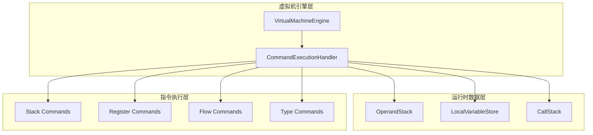
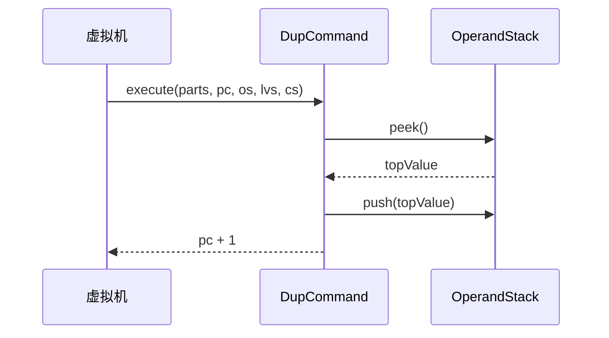
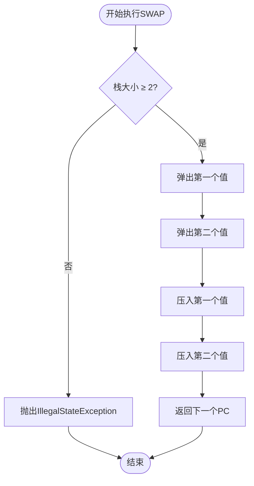
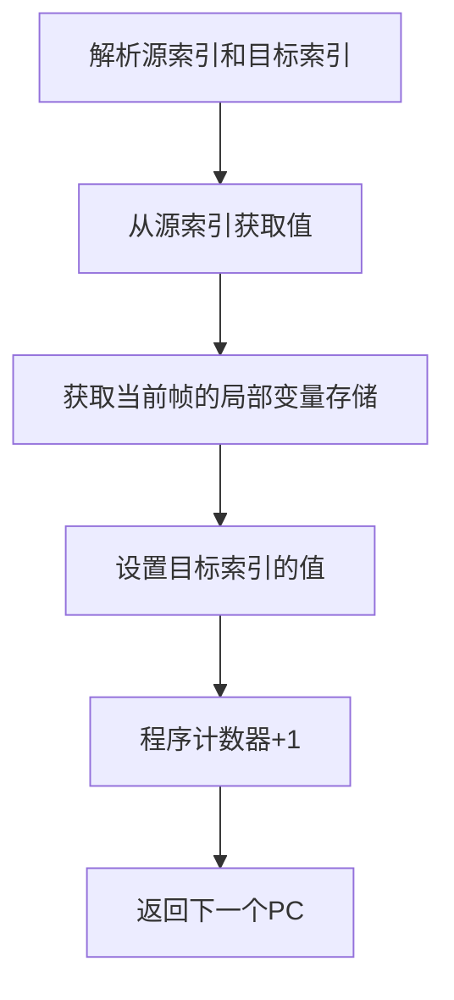
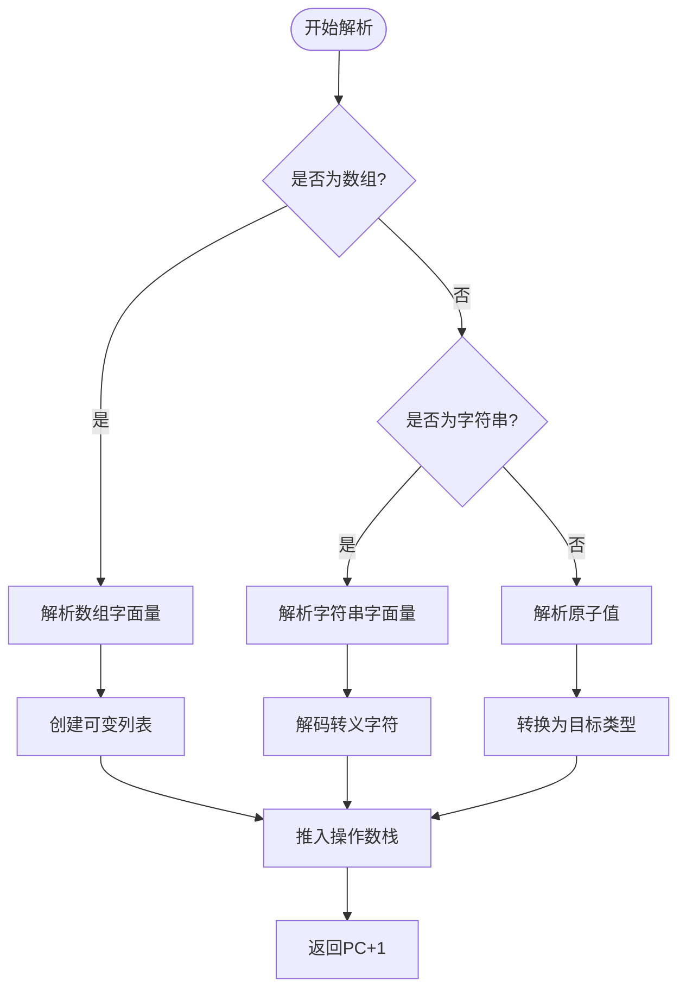
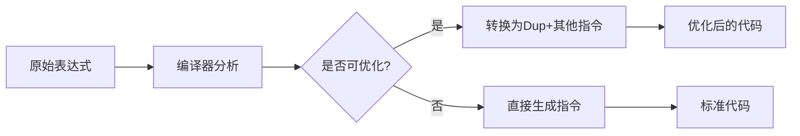
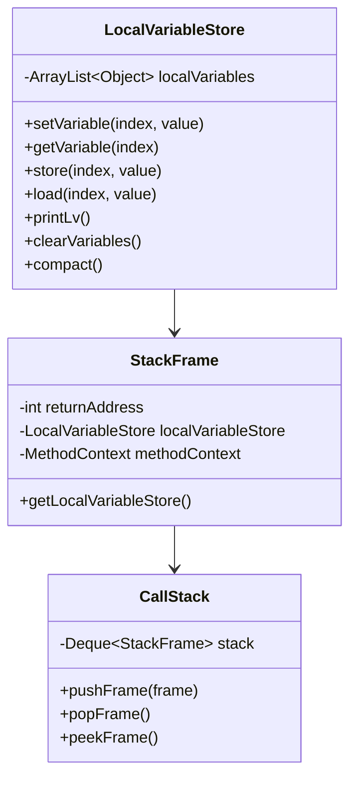
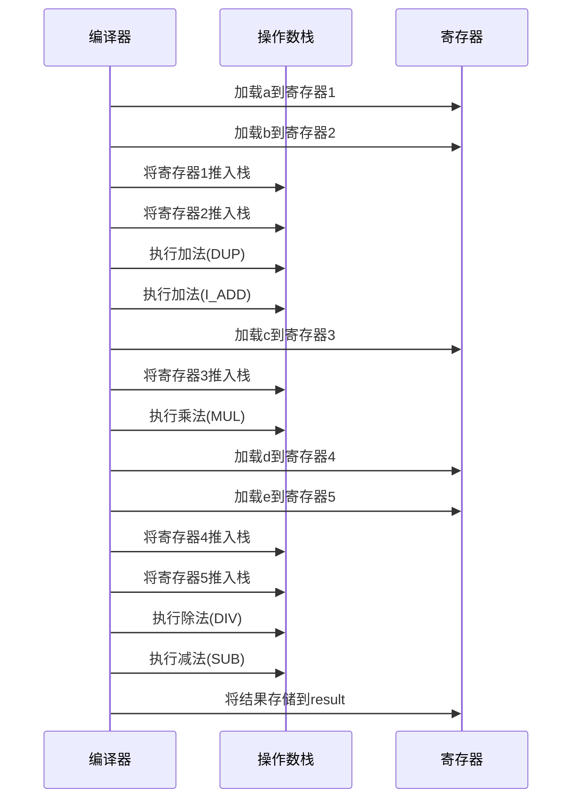
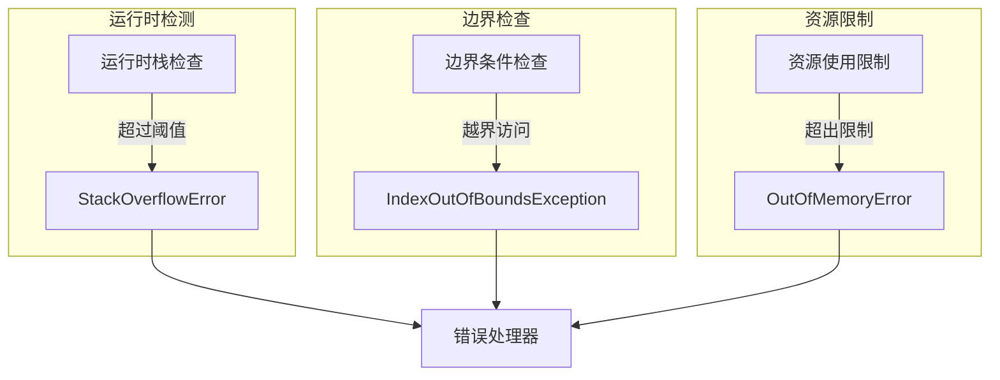
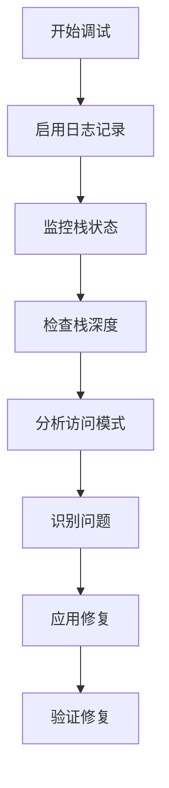

# 栈与寄存器指令

<cite>
**本文档中引用的文件**
- [OperandStack.java](file://src/main/java/org/jcnc/snow/vm/module/OperandStack.java)
- [DupCommand.java](file://src/main/java/org/jcnc/snow/vm/commands/stack/control/DupCommand.java)
- [SwapCommand.java](file://src/main/java/org/jcnc/snow/vm/commands/stack/control/SwapCommand.java)
- [PopCommand.java](file://src/main/java/org/jcnc/snow/vm/commands/stack/control/PopCommand.java)
- [MovCommand.java](file://src/main/java/org/jcnc/snow/vm/commands/register/control/MovCommand.java)
- [LocalVariableStore.java](file://src/main/java/org/jcnc/snow/vm/module/LocalVariableStore.java)
- [RPushCommand.java](file://src/main/java/org/jcnc/snow/vm/commands/ref/control/RPushCommand.java)
- [RStoreCommand.java](file://src/main/java/org/jcnc/snow/vm/commands/ref/control/RStoreCommand.java)
- [RLoadCommand.java](file://src/main/java/org/jcnc/snow/vm/commands/ref/control/RLoadCommand.java)
- [VirtualMachineEngine.java](file://src/main/java/org/jcnc/snow/vm/engine/VirtualMachineEngine.java)
- [Command.java](file://src/main/java/org/jcnc/snow/vm/interfaces/Command.java)
- [CallStack.java](file://src/main/java/org/jcnc/snow/vm/module/CallStack.java)
</cite>

## 目录
1. [引言](#引言)
2. [虚拟机架构概览](#虚拟机架构概览)
3. [栈操作指令详解](#栈操作指令详解)
4. [寄存器操作指令详解](#寄存器操作指令详解)
5. [操作数栈的作用与优化](#操作数栈的作用与优化)
6. [虚拟寄存器模型](#虚拟寄存器模型)
7. [复杂表达式编译优化](#复杂表达式编译优化)
8. [性能影响分析](#性能影响分析)
9. [栈溢出检测机制](#栈溢出检测机制)
10. [故障排除指南](#故障排除指南)
11. [总结](#总结)

## 引言

Snow虚拟机采用基于栈的架构设计，通过精心设计的栈操作指令和寄存器操作指令来实现高效的表达式求值和数据处理。本文档系统性地阐述了虚拟机中栈与寄存器指令的功能、语义及其在表达式编译和执行过程中的重要作用。

虚拟机的核心组件包括操作数栈（OperandStack）、本地变量存储（LocalVariableStore）、调用栈（CallStack）以及各种指令执行器。这些组件协同工作，为Snow语言提供了强大而灵活的运行时环境。

## 虚拟机架构概览

Snow虚拟机采用分层架构设计，主要包含以下几个核心模块：



**图表来源**
- [VirtualMachineEngine.java](file://src/main/java/org/jcnc/snow/vm/engine/VirtualMachineEngine.java#L35-L76)
- [Command.java](file://src/main/java/org/jcnc/snow/vm/interfaces/Command.java#L15-L53)

**章节来源**
- [VirtualMachineEngine.java](file://src/main/java/org/jcnc/snow/vm/engine/VirtualMachineEngine.java#L1-L191)

## 栈操作指令详解

### 复制指令（DupCommand）

DupCommand实现了栈顶元素的复制操作，是表达式求值过程中不可或缺的基础指令。

#### 功能特性
- **单元素复制**：复制栈顶元素并重新压入栈
- **类型保持**：保持被复制对象的原始类型不变
- **无副作用**：不影响其他栈元素的状态

#### 执行流程



**图表来源**
- [DupCommand.java](file://src/main/java/org/jcnc/snow/vm/commands/stack/control/DupCommand.java#L50-L67)

#### 应用场景
Dup指令在以下场景中发挥重要作用：
- 表达式求值：需要重复使用栈顶值进行多次计算
- 参数传递：函数调用前复制参数值
- 条件判断：比较操作前备份操作数

**章节来源**
- [DupCommand.java](file://src/main/java/org/jcnc/snow/vm/commands/stack/control/DupCommand.java#L1-L68)

### 交换指令（SwapCommand）

SwapCommand实现了栈顶两个元素的交换操作，为复杂的栈操作提供了基础原子操作。

#### 功能特性
- **双元素交换**：确保栈至少有两个元素才能执行
- **原子操作**：交换操作具有原子性，保证数据一致性
- **异常保护**：栈元素不足时抛出明确的异常信息

#### 安全检查机制



**图表来源**
- [SwapCommand.java](file://src/main/java/org/jcnc/snow/vm/commands/stack/control/SwapCommand.java#L50-L74)

#### 性能考虑
Swap指令的时间复杂度为O(1)，空间复杂度为O(1)，是最高效的栈操作之一。

**章节来源**
- [SwapCommand.java](file://src/main/java/org/jcnc/snow/vm/commands/stack/control/SwapCommand.java#L1-L75)

### 弹出指令（PopCommand）

PopCommand负责移除栈顶元素，是栈清理和资源管理的重要指令。

#### 实现特点
- **简单高效**：直接调用栈的pop方法
- **异常处理**：依赖底层栈的异常机制
- **状态维护**：自动维护栈的大小计数

#### 使用模式
Pop指令通常与其他指令配合使用：
- 在函数返回前清理临时结果
- 在条件跳转前移除不必要的中间值
- 在循环结束时释放栈空间

**章节来源**
- [PopCommand.java](file://src/main/java/org/jcnc/snow/vm/commands/stack/control/PopCommand.java#L1-L65)

## 寄存器操作指令详解

### 移动指令（MovCommand）

MovCommand实现了本地变量之间的值转移，是寄存器操作的核心指令。

#### 指令格式
```
MOV <source_index> <destination_index>
```

#### 执行步骤



**图表来源**
- [MovCommand.java](file://src/main/java/org/jcnc/snow/vm/commands/register/control/MovCommand.java#L45-L67)

#### 类型安全
Mov指令确保类型安全：
- 源值的类型自动传播到目标位置
- 支持不同类型的本地变量间的数据传输
- 运行时类型检查防止非法转换

**章节来源**
- [MovCommand.java](file://src/main/java/org/jcnc/snow/vm/commands/register/control/MovCommand.java#L1-L68)

### 引用推送指令（RPushCommand）

RPushCommand负责将引用类型值推送到操作数栈，支持多种字面量格式。

#### 支持的字面量类型
- **字符串字面量**：支持转义序列和多行文本
- **数组字面量**：支持嵌套数组和混合类型
- **原子值**：数字、布尔值等基本类型

#### 解析算法



**图表来源**
- [RPushCommand.java](file://src/main/java/org/jcnc/snow/vm/commands/ref/control/RPushCommand.java#L200-L250)

**章节来源**
- [RPushCommand.java](file://src/main/java/org/jcnc/snow/vm/commands/ref/control/RPushCommand.java#L1-L340)

### 引用存储指令（RStoreCommand）

RStoreCommand将操作数栈顶的引用对象存储到本地变量表中。

#### 执行流程
1. 解析存储槽位索引
2. 从操作数栈弹出引用对象
3. 存储到当前栈帧的局部变量存储
4. 更新程序计数器

#### 错误处理
- **栈空异常**：当操作数栈为空时抛出EmptyStackException
- **索引异常**：无效的槽位索引导致NumberFormatException
- **类型不匹配**：运行时类型检查失败

**章节来源**
- [RStoreCommand.java](file://src/main/java/org/jcnc/snow/vm/commands/ref/control/RStoreCommand.java#L1-L59)

### 引用加载指令（RLoadCommand）

RLoadCommand从本地变量表加载引用对象并推送到操作数栈。

#### 关键特性
- **即时加载**：直接从当前栈帧的局部变量存储读取
- **类型保持**：保持加载对象的原始类型
- **边界检查**：自动扩展局部变量存储以避免越界

**章节来源**
- [RLoadCommand.java](file://src/main/java/org/jcnc/snow/vm/commands/ref/control/RLoadCommand.java#L1-L55)

## 操作数栈的作用与优化

### 栈在表达式求值中的角色

操作数栈是Snow虚拟机表达式求值的核心组件，承担以下重要职责：

#### 值暂存
- **中间结果存储**：保存算术运算的中间结果
- **参数传递**：作为函数调用的参数传递通道
- **控制流标记**：标记条件判断和循环控制点

#### 内存管理
- **自动增长**：根据需要动态扩展容量
- **垃圾回收准备**：为后续的垃圾回收机制提供基础
- **栈帧隔离**：确保不同函数调用间的栈空间独立

### Dup指令优化策略

#### 编译时优化


#### 运行时优化
- **栈深度监控**：跟踪栈的使用情况
- **内存预分配**：预先分配常用大小的栈空间
- **缓存友好访问**：优化栈访问模式

**章节来源**
- [OperandStack.java](file://src/main/java/org/jcnc/snow/vm/module/OperandStack.java#L1-L104)

## 虚拟寄存器模型

### 物理寄存器映射

Snow虚拟机采用虚拟寄存器模型，通过本地变量存储实现寄存器功能：



**图表来源**
- [LocalVariableStore.java](file://src/main/java/org/jcnc/snow/vm/module/LocalVariableStore.java#L25-L50)
- [CallStack.java](file://src/main/java/org/jcnc/snow/vm/module/CallStack.java#L10-L25)

### 寄存器分配策略

#### 静态分配
- **函数参数**：按声明顺序分配到固定槽位
- **局部变量**：根据作用域自动分配连续槽位
- **临时变量**：由编译器动态分配

#### 寄存器重用
- **生命周期管理**：变量超出作用域时自动释放
- **内存压缩**：程序终止前压缩局部变量表
- **垃圾回收**：标记不再使用的寄存器引用

**章节来源**
- [LocalVariableStore.java](file://src/main/java/org/jcnc/snow/vm/module/LocalVariableStore.java#L1-L182)

## 复杂表达式编译优化

### 优化示例

考虑以下复杂表达式：
```
result = (a + b) * c - (d / e)
```

#### 编译过程


### 性能优化技术

#### 指令融合
- **复合指令**：将多个简单操作合并为单一指令
- **常量折叠**：编译时计算常量表达式
- **死代码消除**：移除不会被执行的代码分支

#### 栈操作优化
- **栈深度最小化**：减少不必要的栈操作
- **局部性原理**：优先使用最近访问的栈元素
- **预取策略**：提前加载可能需要的栈元素

## 性能影响分析

### 栈操作性能特征

#### 时间复杂度分析

| 操作 | 平均时间复杂度 | 最坏时间复杂度 | 空间复杂度 |
|------|----------------|----------------|------------|
| Push | O(1)* | O(n) | O(1) |
| Pop | O(1) | O(1) | O(1) |
| Peek | O(1) | O(1) | O(1) |
| Swap | O(1) | O(1) | O(1) |
| Dup | O(1) | O(1) | O(1) |

*平均情况下的摊销时间复杂度

#### 空间复杂度分析
- **栈空间**：与活跃栈帧数量成正比
- **局部变量**：与函数局部变量数量成正比
- **调用栈**：与函数调用深度成正比

### 性能优化建议

#### 栈使用最佳实践
1. **避免深层递归**：控制递归深度防止栈溢出
2. **及时清理**：函数返回前清理不需要的栈元素
3. **批量操作**：尽可能使用批量栈操作减少开销

#### 内存管理策略
- **栈预分配**：为常见场景预分配适当大小的栈空间
- **内存池化**：复用栈对象减少GC压力
- **监控告警**：实时监控栈使用情况

## 栈溢出检测机制

### 多层次防护体系

Snow虚拟机实现了多层次的栈溢出检测机制：



**图表来源**
- [CallStack.java](file://src/main/java/org/jcnc/snow/vm/module/CallStack.java#L10-L25)
- [VirtualMachineEngine.java](file://src/main/java/org/jcnc/snow/vm/engine/VirtualMachineEngine.java#L80-L120)

### 检测机制详解

#### 调用栈深度检测
- **最大深度限制**：默认1024个栈帧
- **动态调整**：根据系统资源动态调整限制
- **异常报告**：提供详细的堆栈跟踪信息

#### 操作数栈溢出检测
- **容量监控**：实时监控栈容量使用情况
- **预警机制**：接近容量上限时发出警告
- **自动扩容**：必要时自动扩展栈容量

#### 局部变量存储检测
- **索引验证**：所有变量访问都经过索引验证
- **类型检查**：确保类型兼容性
- **生命周期管理**：跟踪变量的生命周期

**章节来源**
- [CallStack.java](file://src/main/java/org/jcnc/snow/vm/module/CallStack.java#L1-L43)

## 故障排除指南

### 常见问题诊断

#### 栈溢出问题
**症状**：StackOverflowError异常
**原因**：递归过深或无限递归
**解决方案**：
1. 检查递归终止条件
2. 增加最大栈深度限制
3. 转换为迭代实现

#### 栈空异常
**症状**：EmptyStackException异常
**原因**：栈操作前没有足够的元素
**解决方案**：
1. 添加栈元素检查
2. 确保正确的操作顺序
3. 使用安全的栈操作包装器

#### 寄存器访问错误
**症状**：IndexOutOfBoundsException异常
**原因**：访问不存在的局部变量槽位
**解决方案**：
1. 检查变量声明和使用范围
2. 验证槽位索引的有效性
3. 使用类型安全的访问接口

### 调试工具和技术

#### 栈状态监控


#### 性能分析
- **执行时间测量**：记录各指令的执行时间
- **内存使用跟踪**：监控栈和局部变量的内存使用
- **热点识别**：识别频繁执行的指令序列

## 总结

Snow虚拟机的栈与寄存器指令系统体现了现代虚拟机设计的最佳实践。通过精心设计的指令集、高效的执行引擎和完善的错误处理机制，为Snow语言提供了强大而可靠的运行时环境。

### 关键优势
1. **高性能**：基于栈的架构提供了优秀的表达式求值性能
2. **类型安全**：完整的类型检查和错误处理机制
3. **可扩展性**：模块化的指令设计支持功能扩展
4. **调试友好**：丰富的调试信息和监控工具

### 发展方向
- **指令集扩展**：支持更多高级语言特性的指令
- **性能优化**：进一步优化热点指令的执行效率
- **内存管理**：改进垃圾回收和内存分配策略
- **并发支持**：增强多线程环境下的栈操作安全性

通过深入理解和正确使用这些栈与寄存器指令，开发者可以编写出既高效又可靠的Snow程序，充分发挥虚拟机的强大功能。