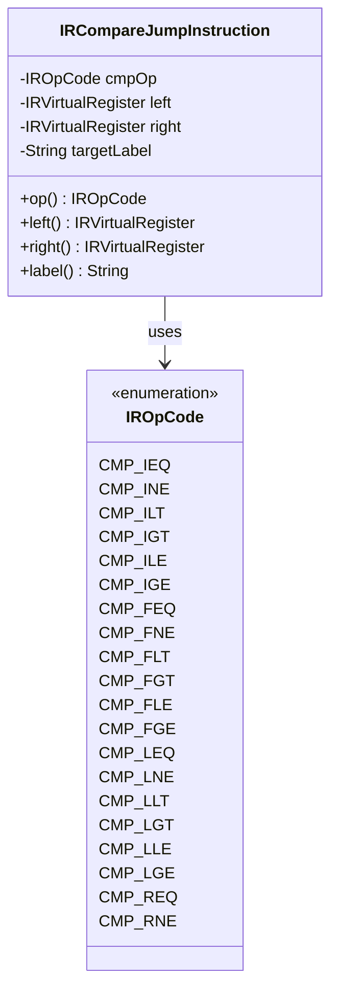
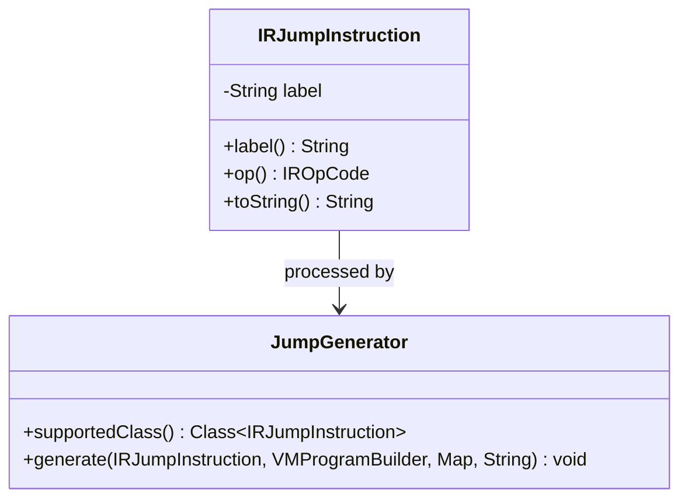
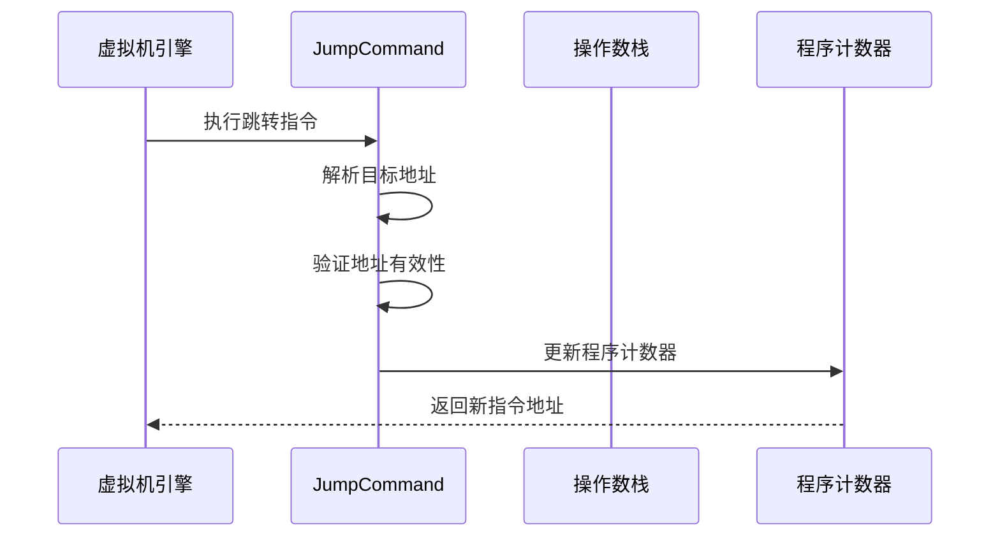
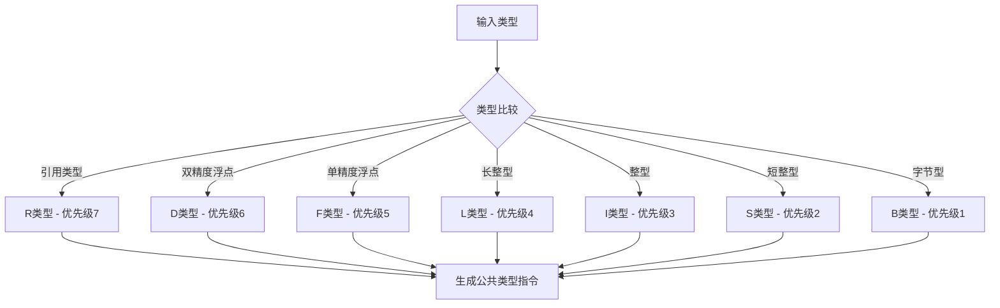
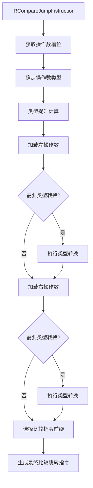
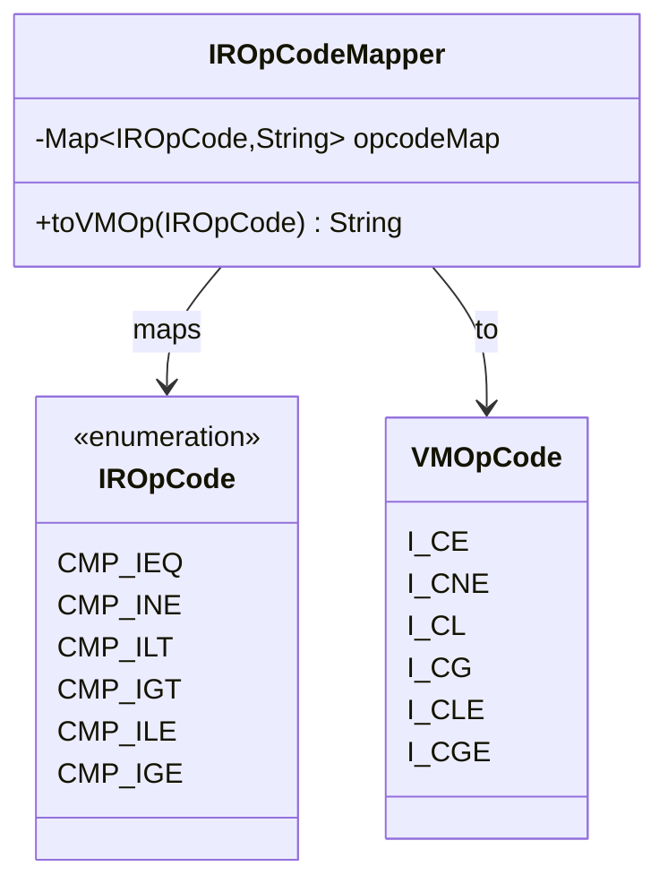
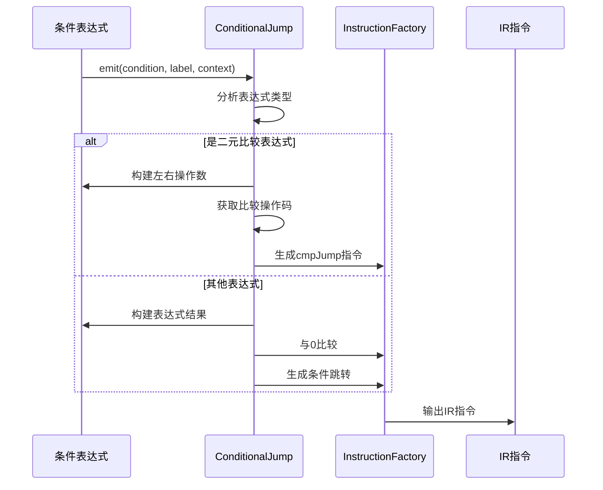
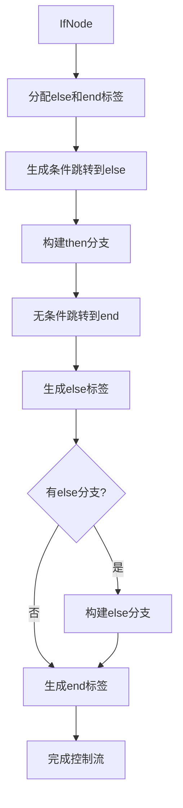
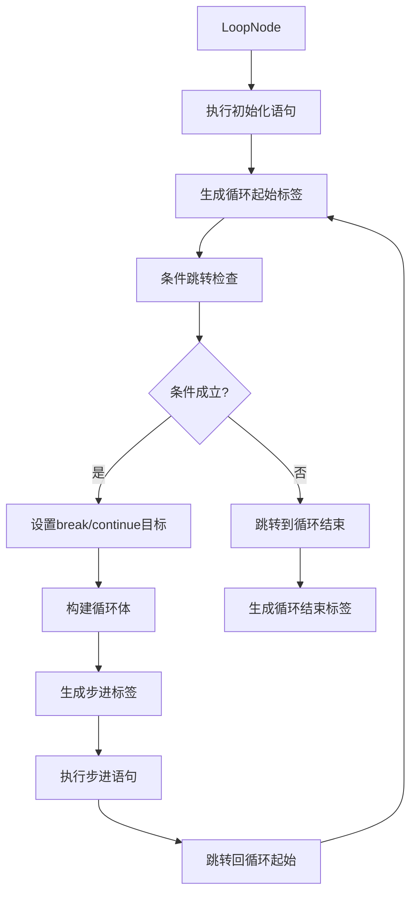

# 比较与跳转指令

<cite>
**本文档中引用的文件**
- [IRCompareJumpInstruction.java](file://src/main/java/org/jcnc/snow/compiler/ir/instruction/IRCompareJumpInstruction.java)
- [IRJumpInstruction.java](file://src/main/java/org/jcnc/snow/compiler/ir/instruction/IRJumpInstruction.java)
- [CmpJumpGenerator.java](file://src/main/java/org/jcnc/snow/compiler/backend/generator/CmpJumpGenerator.java)
- [JumpGenerator.java](file://src/main/java/org/jcnc/snow/compiler/backend/generator/JumpGenerator.java)
- [IROpCode.java](file://src/main/java/org/jcnc/snow/compiler/ir/core/IROpCode.java)
- [TypePromoteUtils.java](file://src/main/java/org/jcnc/snow/compiler/backend/utils/TypePromoteUtils.java)
- [IROpCodeMapper.java](file://src/main/java/org/jcnc/snow/compiler/backend/utils/IROpCodeMapper.java)
- [ComparisonUtils.java](file://src/main/java/org/jcnc/snow/compiler/ir/utils/ComparisonUtils.java)
- [VMOpCode.java](file://src/main/java/org/jcnc/snow/vm/engine/VMOpCode.java)
- [JumpCommand.java](file://src/main/java/org/jcnc/snow/vm/commands/flow/control/JumpCommand.java)
- [IRLabelInstruction.java](file://src/main/java/org/jcnc/snow/compiler/ir/instruction/IRLabelInstruction.java)
- [ConditionalJump.java](file://src/main/java/org/jcnc/snow/compiler/ir/builder/statement/utils/ConditionalJump.java)
- [IfHandler.java](file://src/main/java/org/jcnc/snow/compiler/ir/builder/statement/handlers/IfHandler.java)
- [LoopHandler.java](file://src/main/java/org/jcnc/snow/compiler/ir/builder/statement/handlers/LoopHandler.java)
</cite>

## 目录
1. [概述](#概述)
2. [比较指令架构](#比较指令架构)
3. [跳转指令系统](#跳转指令系统)
4. [类型提升与转换机制](#类型提升与转换机制)
5. [指令生成流程](#指令生成流程)
6. [控制流实现](#控制流实现)
7. [性能优化考虑](#性能优化考虑)
8. [实际应用示例](#实际应用示例)
9. [总结](#总结)

## 概述

Snow虚拟机的比较与跳转指令系统是控制流实现的核心组件，负责处理条件判断、分支跳转和循环控制。该系统采用分层设计，从高级的中间表示（IR）到低级的虚拟机指令，提供了完整的比较与跳转功能。

### 核心特性

- **类型安全的比较操作**：支持多种数据类型的比较，包括整数、浮点数和引用类型
- **智能类型提升**：自动处理不同类型的运算和比较
- **高效的指令生成**：优化的指令序列生成策略
- **灵活的控制流**：支持复杂的if-else和循环结构

## 比较指令架构

### IR层比较指令

Snow的IR层定义了全面的比较操作码，覆盖所有基本数据类型：



**图表来源**
- [IRCompareJumpInstruction.java](file://src/main/java/org/jcnc/snow/compiler/ir/instruction/IRCompareJumpInstruction.java#L13-L56)
- [IROpCode.java](file://src/main/java/org/jcnc/snow/compiler/ir/core/IROpCode.java#L75-L122)

### 比较操作码分类

系统按数据类型族组织比较操作码：

| 数据类型 | 比较操作码前缀 | 操作 |
|---------|---------------|------|
| 8位整数 | `CMP_BEQ` | 相等比较 |
| 16位整数 | `CMP_SEQ` | 相等比较 |
| 32位整数 | `CMP_IEQ` | 相等比较 |
| 64位整数 | `CMP_LEQ` | 相等比较 |
| 32位浮点 | `CMP_FEQ` | 相等比较 |
| 64位浮点 | `CMP_DEQ` | 相等比较 |
| 引用类型 | `CMP_REQ` | 引用相等 |

**节来源**
- [IROpCode.java](file://src/main/java/org/jcnc/snow/compiler/ir/core/IROpCode.java#L75-L122)

## 跳转指令系统

### 无条件跳转

无条件跳转指令提供基础的控制流转移功能：



**图表来源**
- [IRJumpInstruction.java](file://src/main/java/org/jcnc/snow/compiler/ir/instruction/IRJumpInstruction.java#L12-L67)
- [JumpGenerator.java](file://src/main/java/org/jcnc/snow/compiler/backend/generator/JumpGenerator.java#L17-L45)

### 虚拟机跳转命令

VM层的跳转命令负责实际的指令执行：



**图表来源**
- [JumpCommand.java](file://src/main/java/org/jcnc/snow/vm/commands/flow/control/JumpCommand.java#L40-L73)

**节来源**
- [JumpCommand.java](file://src/main/java/org/jcnc/snow/vm/commands/flow/control/JumpCommand.java#L40-L73)

## 类型提升与转换机制

### 类型优先级系统

Snow使用类型优先级系统来处理不同类型的比较操作：



**图表来源**
- [TypePromoteUtils.java](file://src/main/java/org/jcnc/snow/compiler/backend/utils/TypePromoteUtils.java#L25-L45)

### 类型转换规则

类型提升遵循严格的转换规则：

| 源类型 | 目标类型 | 转换指令 |
|--------|----------|----------|
| byte | short/int/long/float/double | B2S/B2I/B2L/B2F/B2D |
| short | int/long/float/double | S2I/S2L/S2F/S2D |
| int | long/float/double | I2L/I2F/I2D |
| long | float/double | L2F/L2D |
| float | double | F2D |

**节来源**
- [TypePromoteUtils.java](file://src/main/java/org/jcnc/snow/compiler/backend/utils/TypePromoteUtils.java#L100-L160)

## 指令生成流程

### 比较跳转指令生成

CmpJumpGenerator负责将IR比较跳转指令转换为VM指令序列：



**图表来源**
- [CmpJumpGenerator.java](file://src/main/java/org/jcnc/snow/compiler/backend/generator/CmpJumpGenerator.java#L45-L95)

### 指令映射机制

IROpCodeMapper提供IR操作码到VM指令的映射：



**图表来源**
- [IROpCodeMapper.java](file://src/main/java/org/jcnc/snow/compiler/backend/utils/IROpCodeMapper.java#L15-L180)

**节来源**
- [CmpJumpGenerator.java](file://src/main/java/org/jcnc/snow/compiler/backend/generator/CmpJumpGenerator.java#L45-L95)
- [IROpCodeMapper.java](file://src/main/java/org/jcnc/snow/compiler/backend/utils/IROpCodeMapper.java#L15-L180)

## 控制流实现

### 条件跳转工具类

ConditionalJump类提供高级条件跳转生成功能：



**图表来源**
- [ConditionalJump.java](file://src/main/java/org/jcnc/snow/compiler/ir/builder/statement/utils/ConditionalJump.java#L29-L64)

### IF语句处理

IfHandler负责将if语句转换为IR指令序列：



**图表来源**
- [IfHandler.java](file://src/main/java/org/jcnc/snow/compiler/ir/builder/statement/handlers/IfHandler.java#L34-L65)

### 循环结构处理

LoopHandler实现复杂的循环控制流：



**图表来源**
- [LoopHandler.java](file://src/main/java/org/jcnc/snow/compiler/ir/builder/statement/handlers/LoopHandler.java#L45-L87)

**节来源**
- [ConditionalJump.java](file://src/main/java/org/jcnc/snow/compiler/ir/builder/statement/utils/ConditionalJump.java#L29-L64)
- [IfHandler.java](file://src/main/java/org/jcnc/snow/compiler/ir/builder/statement/handlers/IfHandler.java#L34-L65)
- [LoopHandler.java](file://src/main/java/org/jcnc/snow/compiler/ir/builder/statement/handlers/LoopHandler.java#L45-L87)

## 性能优化考虑

### 分支预测友好设计

Snow虚拟机的设计考虑了现代CPU的分支预测机制：

1. **条件跳转优化**：比较指令直接生成条件跳转，减少不必要的指令
2. **类型提升缓存**：避免重复的类型计算和转换
3. **指令流水线友好**：合理的指令排列提高流水线效率

### 内存访问优化

- **局部变量优化**：优先使用局部变量槽位，减少内存访问
- **栈操作优化**：最小化栈的频繁操作
- **指令长度优化**：选择最短的指令序列

### 数值比较特殊处理

对于浮点数比较，系统特别注意NaN值的处理：

- **NaN比较行为**：NaN与其他任何值都不相等
- **比较指令安全性**：确保比较指令不会产生未定义行为
- **类型一致性**：保持比较操作的类型一致性

## 实际应用示例

### 简单if-else结构

编译后的指令序列示例：

```
# 条件判断
I_LOAD 1        ; 加载变量1
I_LOAD 2        ; 加载变量2
I_CLE lbl_true  ; 小于等于跳转
I_PUSH 0        ; 压入false
JUMP lbl_end    ; 跳过true分支
lbl_true:
I_PUSH 1        ; 压入true
lbl_end:
I_STORE 3       ; 存储结果
```

### while循环结构

循环的指令生成过程：

```
# 循环起始
lbl_start:
# 条件检查
I_LOAD 1        ; 加载循环条件
I_CLE lbl_end   ; 条件不成立跳转
# 循环体
...
# 步进操作
I_LOAD 1        ; 加载计数器
I_PUSH 1        ; 常量1
I_ADD           ; 计数器++
I_STORE 1       ; 存储新值
# 循环继续
JUMP lbl_start  ; 回到循环起始
lbl_end:
# 循环结束
```

### 复杂嵌套结构

多层嵌套的控制流处理：

```
# 外层if
I_LOAD 1
I_PUSH 0
I_CNE lbl_else1
# then分支
...
JUMP lbl_end1
lbl_else1:
# else分支
I_LOAD 2
I_PUSH 5
I_CLE lbl_else2
# 嵌套if
...
JUMP lbl_end2
lbl_else2:
# 嵌套else
...
lbl_end2:
lbl_end1:
```

## 总结

Snow虚拟机的比较与跳转指令系统展现了现代编译器设计的精妙之处：

### 关键优势

1. **类型安全**：完整的类型系统确保运行时安全
2. **性能优化**：智能的指令生成和类型提升
3. **语义清晰**：直观的控制流表示
4. **扩展性强**：易于添加新的数据类型和操作

### 设计亮点

- **分层架构**：从IR到VM的清晰映射
- **类型系统**：完善的类型提升和转换机制
- **控制流**：灵活的if-else和循环结构支持
- **性能考虑**：分支预测和指令优化

该系统为Snow语言提供了坚实的控制流基础，支持复杂的编程模式，同时保持了良好的性能特征。通过深入理解这些机制，开发者可以更好地利用Snow语言的特性，编写高效、可靠的程序。