# 算术与逻辑指令

<cite>
**本文档引用文件**  
- [VMOpCode.java](file://src/main/java/org/jcnc/snow/vm/engine/VMOpCode.java)
- [CommandFactory.java](file://src/main/java/org/jcnc/snow/vm/factories/CommandFactory.java)
- [IAddCommand.java](file://src/main/java/org/jcnc/snow/vm/commands/type/control/int32/IAddCommand.java)
- [BAddCommand.java](file://src/main/java/org/jcnc/snow/vm/commands/type/control/byte8/BAddCommand.java)
- [FAddCommand.java](file://src/main/java/org/jcnc/snow/vm/commands/type/control/float32/FAddCommand.java)
- [LAddCommand.java](file://src/main/java/org/jcnc/snow/vm/commands/type/control/long64/LAddCommand.java)
- [TypePromoteUtils.java](file://src/main/java/org/jcnc/snow/compiler/backend/utils/TypePromoteUtils.java)
- [BinaryOpGenerator.java](file://src/main/java/org/jcnc/snow/compiler/backend/generator/BinaryOpGenerator.java)
- [ExpressionUtils.java](file://src/main/java/org/jcnc/snow/compiler/ir/utils/ExpressionUtils.java)
</cite>

## 目录
1. [引言](#引言)
2. [指令编码与操作数栈](#指令编码与操作数栈)
3. [基本算术指令](#基本算术指令)
   - [加法指令 (ADD)](#加法指令-add)
   - [减法指令 (SUB)](#减法指令-sub)
   - [乘法指令 (MUL)](#乘法指令-mul)
   - [除法指令 (DIV)](#除法指令-div)
   - [取模指令 (MOD)](#取模指令-mod)
   - [负号指令 (NEG)](#负号指令-neg)
4. [位逻辑指令](#位逻辑指令)
   - [与指令 (AND)](#与指令-and)
   - [或指令 (OR)](#或指令-or)
   - [异或指令 (XOR)](#异或指令-xor)
   - [取反指令](#取反指令)
5. [按数据类型组织的指令](#按数据类型组织的指令)
   - [byte8 类型](#byte8-类型)
   - [short16 类型](#short16-类型)
   - [int32 类型](#int32-类型)
   - [long64 类型](#long64-类型)
   - [float32 类型](#float32-类型)
   - [double64 类型](#double64-类型)
6. [Add指令实现对比与泛化设计](#add指令实现对比与泛化设计)
7. [整数与浮点数运算的精度处理差异](#整数与浮点数运算的精度处理差异)
8. [典型使用场景代码示例](#典型使用场景代码示例)
9. [指令设计对高效数值计算的支持](#指令设计对高效数值计算的支持)
10. [溢出与精度丢失问题及规避策略](#溢出与精度丢失问题及规避策略)
11. [结论](#结论)

## 引言
Snow虚拟机提供了一套完整的算术与逻辑指令集，支持多种基本数据类型。本文档系统性地描述了所有基本算术操作（加、减、乘、除、模、负号）和位逻辑操作（与、或、异或、取反）指令，按数据类型（byte8、short16、int32、long64、float32、double64）进行组织。详细说明了每条指令的操作码编码、操作数格式、执行流程和对操作数栈的影响，分析了指令设计如何支持高效的数值计算，并讨论了潜在的溢出和精度丢失问题及其规避策略。

## 指令编码与操作数栈
Snow虚拟机采用基于栈的架构，所有算术和逻辑指令都从操作数栈中获取操作数，并将结果压回栈中。每条指令由一个操作码（Opcode）唯一标识，操作码在`VMOpCode.java`中定义，采用十六进制编码，按功能和数据类型进行分组。

**Section sources**
- [VMOpCode.java](file://src/main/java/org/jcnc/snow/vm/engine/VMOpCode.java#L0-L2794)

## 基本算术指令

### 加法指令 (ADD)
加法指令用于将操作数栈顶的两个值相加。执行时，虚拟机从栈顶弹出两个操作数，执行加法运算，并将结果压回栈顶。

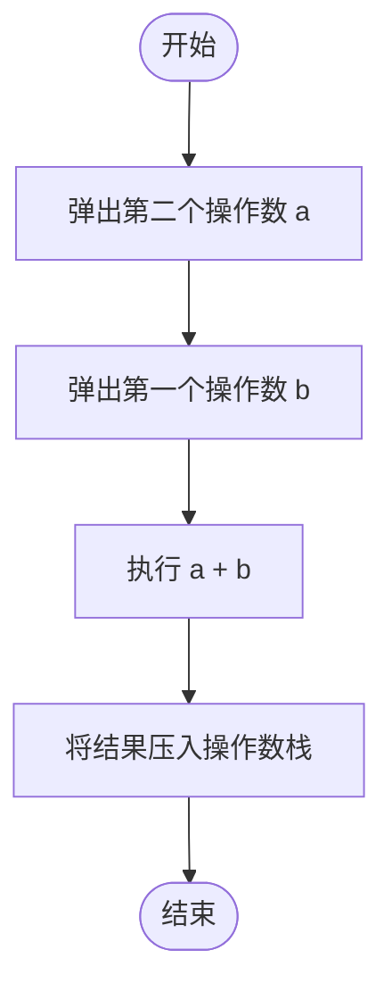

**Diagram sources**
- [VMOpCode.java](file://src/main/java/org/jcnc/snow/vm/engine/VMOpCode.java#L0-L2794)

### 减法指令 (SUB)
减法指令用于从操作数栈顶的第二个值中减去第一个值。执行时，虚拟机从栈顶弹出两个操作数，执行减法运算（minuend - subtrahend），并将结果压回栈顶。

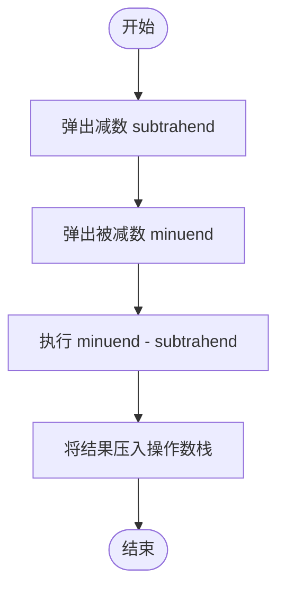

**Diagram sources**
- [VMOpCode.java](file://src/main/java/org/jcnc/snow/vm/engine/VMOpCode.java#L0-L2794)

### 乘法指令 (MUL)
乘法指令用于将操作数栈顶的两个值相乘。执行时，虚拟机从栈顶弹出两个操作数，执行乘法运算，并将结果压回栈顶。

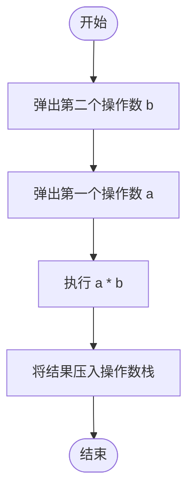

**Diagram sources**
- [VMOpCode.java](file://src/main/java/org/jcnc/snow/vm/engine/VMOpCode.java#L0-L2794)

### 除法指令 (DIV)
除法指令用于将操作数栈顶的第二个值除以第一个值。执行时，虚拟机从栈顶弹出两个操作数，检查除数是否为零，若为零则抛出`ArithmeticException`，否则执行除法运算，并将结果压回栈顶。

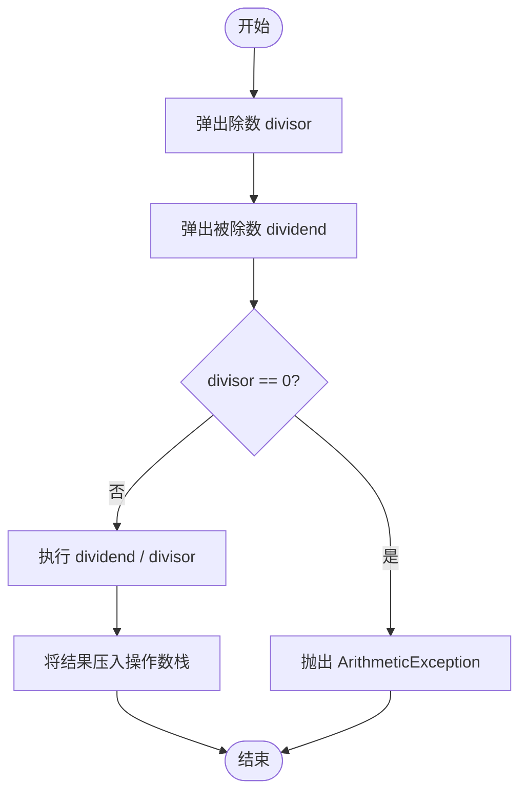

**Diagram sources**
- [VMOpCode.java](file://src/main/java/org/jcnc/snow/vm/engine/VMOpCode.java#L0-L2794)

### 取模指令 (MOD)
取模指令用于计算操作数栈顶的两个值相除后的余数。执行流程与除法指令类似，同样需要检查除数为零的情况。

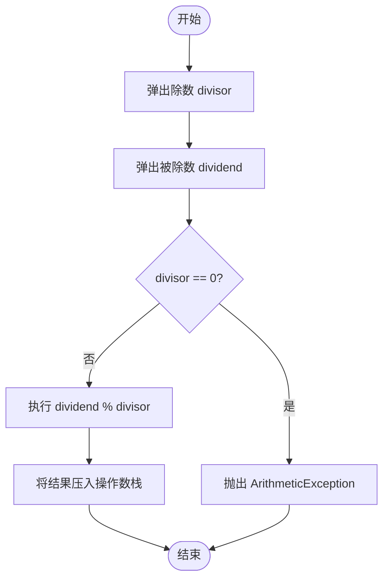

**Diagram sources**
- [VMOpCode.java](file://src/main/java/org/jcnc/snow/vm/engine/VMOpCode.java#L0-L2794)

### 负号指令 (NEG)
负号指令用于对操作数栈顶的值取负。执行时，虚拟机从栈顶弹出一个操作数，执行取负运算，并将结果压回栈顶。

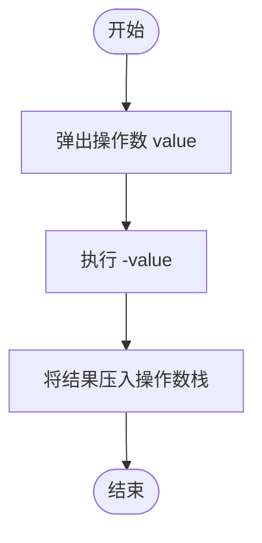

**Diagram sources**
- [VMOpCode.java](file://src/main/java/org/jcnc/snow/vm/engine/VMOpCode.java#L0-L2794)

## 位逻辑指令

### 与指令 (AND)
与指令用于对操作数栈顶的两个值进行按位与运算。执行时，虚拟机从栈顶弹出两个操作数，对它们的二进制表示进行按位与操作，并将结果压回栈顶。

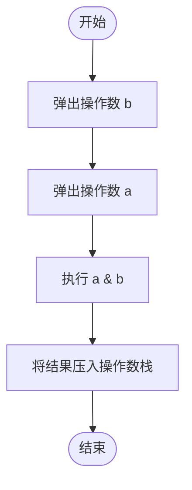

**Diagram sources**
- [VMOpCode.java](file://src/main/java/org/jcnc/snow/vm/engine/VMOpCode.java#L0-L2794)

### 或指令 (OR)
或指令用于对操作数栈顶的两个值进行按位或运算。执行时，虚拟机从栈顶弹出两个操作数，对它们的二进制表示进行按位或操作，并将结果压回栈顶。

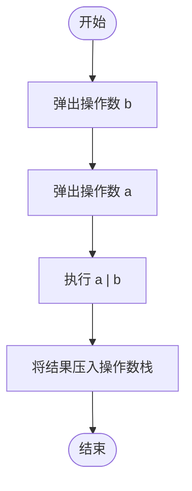

**Diagram sources**
- [VMOpCode.java](file://src/main/java/org/jcnc/snow/vm/engine/VMOpCode.java#L0-L2794)

### 异或指令 (XOR)
异或指令用于对操作数栈顶的两个值进行按位异或运算。执行时，虚拟机从栈顶弹出两个操作数，对它们的二进制表示进行按位异或操作，并将结果压回栈顶。

**Diagram sources**
- [VMOpCode.java](file://src/main/java/org/jcnc/snow/vm/engine/VMOpCode.java#L0-L2794)

### 取反指令
取反指令用于对操作数栈顶的值进行按位取反运算。执行时，虚拟机从栈顶弹出一个操作数，对其二进制表示进行按位取反操作，并将结果压回栈顶。

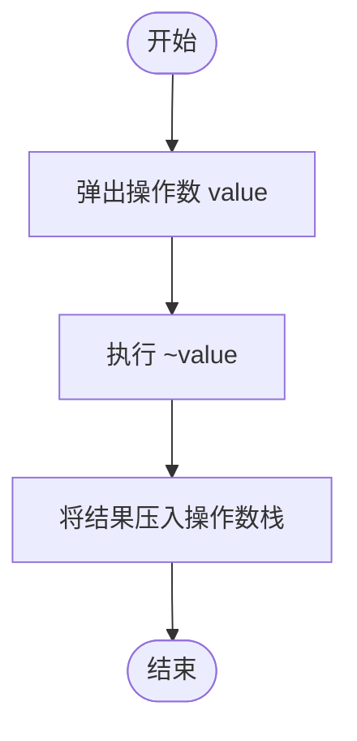

**Diagram sources**
- [VMOpCode.java](file://src/main/java/org/jcnc/snow/vm/engine/VMOpCode.java#L0-L2794)

## 按数据类型组织的指令
Snow虚拟机为每种基本数据类型都提供了独立的指令集，通过操作码前缀区分。

### byte8 类型
byte8类型的指令操作码范围为`0x0000-0x001F`，包括`B_ADD`、`B_SUB`等。这些指令在执行时会将操作数视为8位有符号整数。

**Section sources**
- [VMOpCode.java](file://src/main/java/org/jcnc/snow/vm/engine/VMOpCode.java#L0-L2794)

### short16 类型
short16类型的指令操作码范围为`0x0020-0x003F`，包括`S_ADD`、`S_SUB`等。这些指令在执行时会将操作数视为16位有符号整数。

**Section sources**
- [VMOpCode.java](file://src/main/java/org/jcnc/snow/vm/engine/VMOpCode.java#L0-L2794)

### int32 类型
int32类型的指令操作码范围为`0x0040-0x005F`，包括`I_ADD`、`I_SUB`等。这些指令在执行时会将操作数视为32位有符号整数。

**Section sources**
- [VMOpCode.java](file://src/main/java/org/jcnc/snow/vm/engine/VMOpCode.java#L0-L2794)

### long64 类型
long64类型的指令操作码范围为`0x0060-0x007F`，包括`L_ADD`、`L_SUB`等。这些指令在执行时会将操作数视为64位有符号整数。

**Section sources**
- [VMOpCode.java](file://src/main/java/org/jcnc/snow/vm/engine/VMOpCode.java#L0-L2794)

### float32 类型
float32类型的指令操作码范围为`0x0080-0x009F`，包括`F_ADD`、`F_SUB`等。这些指令遵循IEEE 754单精度浮点数标准。

**Section sources**
- [VMOpCode.java](file://src/main/java/org/jcnc/snow/vm/engine/VMOpCode.java#L0-L2794)

### double64 类型
double64类型的指令操作码范围为`0x00A0-0x00BF`，包括`D_ADD`、`D_SUB`等。这些指令遵循IEEE 754双精度浮点数标准。

**Section sources**
- [VMOpCode.java](file://src/main/java/org/jcnc/snow/vm/engine/VMOpCode.java#L0-L2794)

## Add指令实现对比与泛化设计
通过对不同数据类型的Add指令实现进行对比，可以发现Snow虚拟机采用了高度泛化的设计模式。

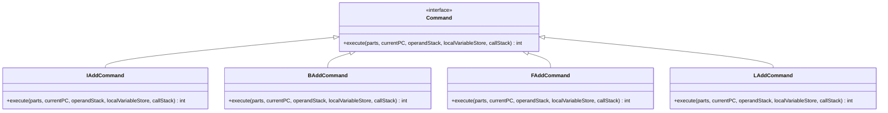

**Diagram sources**
- [IAddCommand.java](file://src/main/java/org/jcnc/snow/vm/commands/type/control/int32/IAddCommand.java#L0-L59)
- [BAddCommand.java](file://src/main/java/org/jcnc/snow/vm/commands/type/control/byte8/BAddCommand.java#L0-L59)
- [FAddCommand.java](file://src/main/java/org/jcnc/snow/vm/commands/type/control/float32/FAddCommand.java#L0-L59)
- [LAddCommand.java](file://src/main/java/org/jcnc/snow/vm/commands/type/control/long64/LAddCommand.java#L0-L59)

所有Add指令都实现了`Command`接口，遵循相同的执行流程：从操作数栈弹出两个操作数，执行加法运算，将结果压回栈中。这种设计模式确保了指令执行逻辑的一致性和可维护性。

**Section sources**
- [IAddCommand.java](file://src/main/java/org/jcnc/snow/vm/commands/type/control/int32/IAddCommand.java#L0-L59)
- [BAddCommand.java](file://src/main/java/org/jcnc/snow/vm/commands/type/control/byte8/BAddCommand.java#L0-L59)
- [FAddCommand.java](file://src/main/java/org/jcnc/snow/vm/commands/type/control/float32/FAddCommand.java#L0-L59)
- [LAddCommand.java](file://src/main/java/org/jcnc/snow/vm/commands/type/control/long64/LAddCommand.java#L0-L59)

## 整数与浮点数运算的精度处理差异
整数运算和浮点数运算在精度处理上存在本质差异。

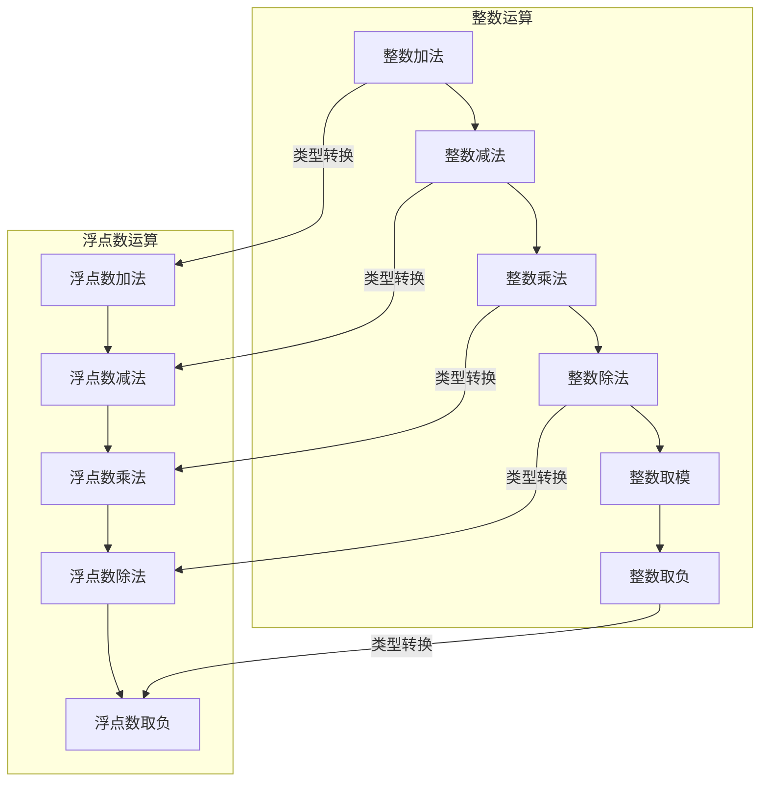

**Diagram sources**
- [TypePromoteUtils.java](file://src/main/java/org/jcnc/snow/compiler/backend/utils/TypePromoteUtils.java#L0-L161)

整数运算是精确的，但可能发生溢出。浮点数运算遵循IEEE 754标准，可能产生舍入误差、无穷大或NaN值。编译器在生成指令时，会根据`TypePromoteUtils`中的类型提升规则，将低优先级类型的操作数转换为高优先级类型。

**Section sources**
- [TypePromoteUtils.java](file://src/main/java/org/jcnc/snow/compiler/backend/utils/TypePromoteUtils.java#L0-L161)

## 典型使用场景代码示例
以下代码示例展示了如何在Snow语言中使用算术与逻辑指令：

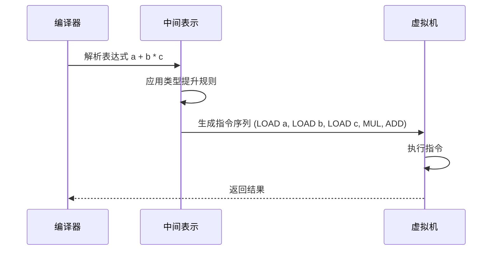

**Diagram sources**
- [BinaryOpGenerator.java](file://src/main/java/org/jcnc/snow/compiler/backend/generator/BinaryOpGenerator.java#L134-L164)
- [ExpressionUtils.java](file://src/main/java/org/jcnc/snow/compiler/ir/utils/ExpressionUtils.java#L223-L261)

**Section sources**
- [BinaryOpGenerator.java](file://src/main/java/org/jcnc/snow/compiler/backend/generator/BinaryOpGenerator.java#L134-L164)
- [ExpressionUtils.java](file://src/main/java/org/jcnc/snow/compiler/ir/utils/ExpressionUtils.java#L223-L261)

## 指令设计对高效数值计算的支持
Snow虚拟机的指令设计通过以下方式支持高效的数值计算：
1. **栈式架构**：简化了指令格式，减少了内存访问。
2. **类型专用指令**：避免了运行时类型检查的开销。
3. **操作码预分配**：`CommandFactory`使用数组存储指令实例，实现O(1)的指令查找。
4. **类型提升机制**：在编译期完成类型转换，减少运行时开销。

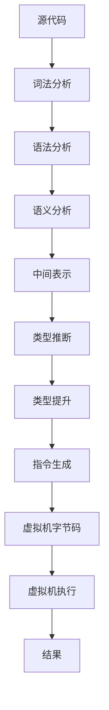

**Diagram sources**
- [CommandFactory.java](file://src/main/java/org/jcnc/snow/vm/factories/CommandFactory.java#L0-L286)

**Section sources**
- [CommandFactory.java](file://src/main/java/org/jcnc/snow/vm/factories/CommandFactory.java#L0-L286)

## 溢出与精度丢失问题及规避策略
### 整数溢出
整数运算可能导致溢出，结果超出数据类型的表示范围。规避策略包括：
- 使用更大范围的数据类型（如从int32升级到long64）
- 在关键计算前进行范围检查
- 使用专门的溢出检测指令

### 浮点数精度丢失
浮点数运算由于二进制表示的限制，必然存在精度丢失。规避策略包括：
- 使用double64代替float32以获得更高精度
- 避免对相近的大数进行减法运算
- 在比较浮点数时使用容差（epsilon）而非精确相等

**Section sources**
- [VMOpCode.java](file://src/main/java/org/jcnc/snow/vm/engine/VMOpCode.java#L0-L2794)

## 结论
Snow虚拟机的算术与逻辑指令集设计精良，通过为每种数据类型提供专用指令、采用栈式架构和编译期类型提升，实现了高效且精确的数值计算。开发者在使用时应充分理解不同类型运算的特性，特别是整数溢出和浮点数精度丢失的风险，并采取相应的规避策略。