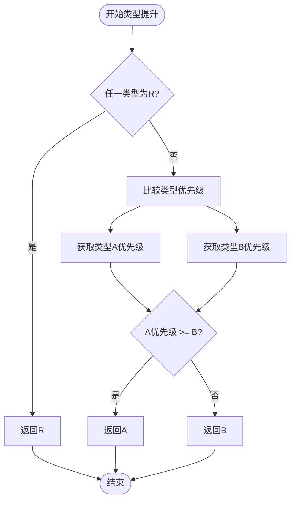

# 类型转换指令

<cite>
**本文档引用的文件**  
- [B2ICommand.java](file://src/main/java/org/jcnc/snow/vm/commands/type/conversion/B2ICommand.java)
- [I2FCommand.java](file://src/main/java/org/jcnc/snow/vm/commands/type/conversion/I2FCommand.java)
- [F2ICommand.java](file://src/main/java/org/jcnc/snow/vm/commands/type/conversion/F2ICommand.java)
- [I2BCommand.java](file://src/main/java/org/jcnc/snow/vm/commands/type/conversion/I2BCommand.java)
- [VMOpCode.java](file://src/main/java/org/jcnc/snow/vm/engine/VMOpCode.java)
- [TypePromoteUtils.java](file://src/main/java/org/jcnc/snow/compiler/backend/utils/TypePromoteUtils.java)
- [BinaryOpGenerator.java](file://src/main/java/org/jcnc/snow/compiler/backend/generator/BinaryOpGenerator.java)
</cite>

## 目录
1. [引言](#引言)
2. [类型转换指令矩阵](#类型转换指令矩阵)
3. [转换语义与精度损失](#转换语义与精度损失)
4. [表达式类型统一与函数参数传递](#表达式类型统一与函数参数传递)
5. [隐式与显式类型转换示例](#隐式与显式类型转换示例)
6. [浮点数到整数转换的边界情况](#浮点数到整数转换的边界情况)
7. [类型安全与运行时性能](#类型安全与运行时性能)
8. [结论](#结论)

## 引言

Snow虚拟机支持丰富的数值类型间转换指令，这些指令在表达式求值、函数调用和类型统一过程中起着关键作用。本文档详细描述所有支持的数值类型转换指令，包括字节（byte8）、短整型（short16）、整型（int32）、长整型（long64）、单精度浮点数（float32）和双精度浮点数（double64）之间的相互转换。通过分析转换语义、精度损失、边界情况和编译优化，本文档旨在为开发者提供完整的类型转换行为参考。

**Section sources**
- [VMOpCode.java](file://src/main/java/org/jcnc/snow/vm/engine/VMOpCode.java#L2200-L2400)

## 类型转换指令矩阵

Snow虚拟机提供了完整的数值类型转换指令集，形成一个全组合的转换矩阵。所有转换指令遵循“源类型到目标类型”的命名约定（如B2I表示byte8到int32）。下表总结了所有支持的转换指令：

| 源类型 | 目标类型 | 转换指令 | 转换类型 |
|--------|--------|---------|---------|
| byte8 (B) | short16 (S) | B2S | 拓宽 |
| byte8 (B) | int32 (I) | B2I | 拓宽 |
| byte8 (B) | long64 (L) | B2L | 拓宽 |
| byte8 (B) | float32 (F) | B2F | 拓宽 |
| byte8 (B) | double64 (D) | B2D | 拓宽 |
| short16 (S) | byte8 (B) | S2B | 窄化 |
| short16 (S) | int32 (I) | S2I | 拓宽 |
| short16 (S) | long64 (L) | S2L | 拓宽 |
| short16 (S) | float32 (F) | S2F | 拓宽 |
| short16 (S) | double64 (D) | S2D | 拓宽 |
| int32 (I) | byte8 (B) | I2B | 窄化 |
| int32 (I) | short16 (S) | I2S | 窄化 |
| int32 (I) | long64 (L) | I2L | 拓宽 |
| int32 (I) | float32 (F) | I2F | 拓宽 |
| int32 (I) | double64 (D) | I2D | 拓宽 |
| long64 (L) | byte8 (B) | L2B | 窄化 |
| long64 (L) | short16 (S) | L2S | 窄化 |
| long64 (L) | int32 (I) | L2I | 窄化 |
| long64 (L) | float32 (F) | L2F | 拓宽 |
| long64 (L) | double64 (D) | L2D | 拓宽 |
| float32 (F) | byte8 (B) | F2B | 窄化 |
| float32 (F) | short16 (S) | F2S | 窄化 |
| float32 (F) | int32 (I) | F2I | 窄化 |
| float32 (F) | long64 (L) | F2L | 拓宽 |
| float32 (F) | double64 (D) | F2D | 拓宽 |
| double64 (D) | byte8 (B) | D2B | 窄化 |
| double64 (D) | short16 (S) | D2S | 窄化 |
| double64 (D) | int32 (I) | D2I | 窄化 |
| double64 (D) | long64 (L) | D2L | 窄化 |
| double64 (D) | float32 (F) | D2F | 窄化 |

**Section sources**
- [VMOpCode.java](file://src/main/java/org/jcnc/snow/vm/engine/VMOpCode.java#L2200-L2400)

## 转换语义与精度损失

每种类型转换指令都有明确的语义和潜在的精度损失。转换可分为两类：拓宽转换（widening conversion）和窄化转换（narrowing conversion）。

### 拓宽转换

拓宽转换将较小范围或较低精度的类型转换为较大范围或较高精度的类型，这种转换是安全的，不会丢失信息。例如：
- **整数拓宽**：从byte8到int32的B2I转换使用符号扩展，保持数值的符号和大小不变。
- **浮点数拓宽**：从float32到double64的F2D转换保持完全精度，因为double64具有更大的尾数位。

### 窄化转换

窄化转换将较大范围或较高精度的类型转换为较小范围或较低精度的类型，这种转换可能导致精度损失或溢出。例如：
- **整数窄化**：从int32到byte8的I2B转换会截断高位字节，只保留低8位。
- **浮点数窄化**：从float32到int32的F2I转换会向零截断小数部分。

特别地，从浮点数到整数的转换（如F2I、F2B）总是涉及截断（truncation），即向零舍入，而不是四舍五入。

**Section sources**
- [F2ICommand.java](file://src/main/java/org/jcnc/snow/vm/commands/type/conversion/F2ICommand.java#L0-L48)
- [I2BCommand.java](file://src/main/java/org/jcnc/snow/vm/commands/type/conversion/I2BCommand.java#L0-L48)
- [B2ICommand.java](file://src/main/java/org/jcnc/snow/vm/commands/type/conversion/B2ICommand.java#L0-L47)

## 表达式类型统一与函数参数传递

类型转换指令在表达式类型统一和函数参数传递中扮演核心角色。当表达式中操作数类型不一致时，编译器会自动插入转换指令以统一类型。

### 类型提升规则

Snow编译器使用`TypePromoteUtils`类实现类型提升。类型优先级从高到低为：R(引用) > D(double) > F(float) > L(long) > I(int) > S(short) > B(byte)。在二元运算中，较低优先级的类型会被提升到较高优先级类型。



**Diagram sources**
- [TypePromoteUtils.java](file://src/main/java/org/jcnc/snow/compiler/backend/utils/TypePromoteUtils.java#L0-L160)

### 函数参数传递

在函数调用时，如果实参类型与形参类型不匹配，编译器会生成相应的转换指令。这确保了类型安全，同时允许一定程度的类型灵活性。

**Section sources**
- [TypePromoteUtils.java](file://src/main/java/org/jcnc/snow/compiler/backend/utils/TypePromoteUtils.java#L0-L160)
- [BinaryOpGenerator.java](file://src/main/java/org/jcnc/snow/compiler/backend/generator/BinaryOpGenerator.java#L0-L188)

## 隐式与显式类型转换示例

### 隐式转换

隐式转换由编译器自动插入，无需程序员显式指定。例如，在int32和float32相加时：

```java
int a = 10;
float b = 3.14f;
float c = a + b; // a被隐式转换为float
```

编译器会生成I2F指令将int32转换为float32。

### 显式转换

显式转换由程序员使用转换操作符指定。例如：

```java
float f = 3.7f;
int i = (int)f; // 显式转换，截断小数部分
```

这会生成F2I指令，将float32转换为int32。

**Section sources**
- [BinaryOpGenerator.java](file://src/main/java/org/jcnc/snow/compiler/backend/generator/BinaryOpGenerator.java#L0-L188)

## 浮点数到整数转换的边界情况

浮点数到整数的转换（如F2I、D2I）需要特别注意边界情况：

1. **溢出**：当浮点数值超出目标整数类型的表示范围时，结果是未定义的或依赖于具体实现。
2. **NaN**：将NaN转换为整数通常会产生0或未定义值。
3. **无穷大**：正无穷大和负无穷大转换为整数会产生最大值或最小值。
4. **舍入模式**：Snow虚拟机使用向零截断（truncation）作为默认舍入模式，而不是四舍五入。

这些边界情况的处理确保了运行时的可预测性，但程序员应避免依赖这些行为。

**Section sources**
- [F2ICommand.java](file://src/main/java/org/jcnc/snow/vm/commands/type/conversion/F2ICommand.java#L0-L48)
- [D2FCommand.java](file://src/main/java/org/jcnc/snow/vm/commands/type/conversion/D2FCommand.java#L0-L47)

## 类型安全与运行时性能

Snow虚拟机的类型转换设计在类型安全和运行时性能之间取得了平衡。

### 类型安全

通过在编译时进行类型检查和在运行时执行明确的转换指令，Snow确保了类型安全。所有转换都是显式的或由明确定义的规则指导，避免了意外的类型转换。

### 运行时性能

转换指令被设计为高效的操作：
- 拓宽转换通常只需简单的位操作或复制。
- 窄化转换虽然可能涉及截断或舍入，但也是原子操作。
- 编译器优化（如常量折叠）可以消除不必要的转换。

此外，`TypePromoteUtils`中的`convert`方法缓存了转换指令的字符串表示，减少了运行时开销。

**Section sources**
- [TypePromoteUtils.java](file://src/main/java/org/jcnc/snow/compiler/backend/utils/TypePromoteUtils.java#L0-L160)
- [VMOpCode.java](file://src/main/java/org/jcnc/snow/vm/engine/VMOpCode.java#L2200-L2400)

## 结论

Snow虚拟机提供了全面且一致的类型转换指令集，支持所有基本数值类型间的相互转换。通过明确定义的转换语义、自动类型提升机制和对边界情况的谨慎处理，Snow在保证类型安全的同时提供了灵活的数值操作能力。开发者应理解不同转换的语义，特别是窄化转换和浮点数转换的潜在精度损失，以编写正确和高效的代码。