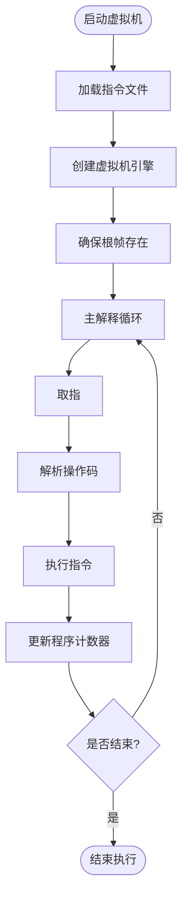
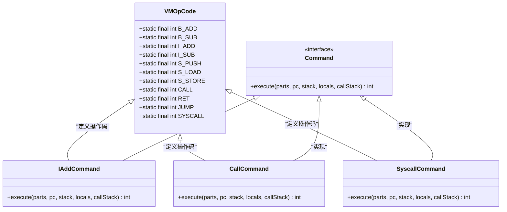
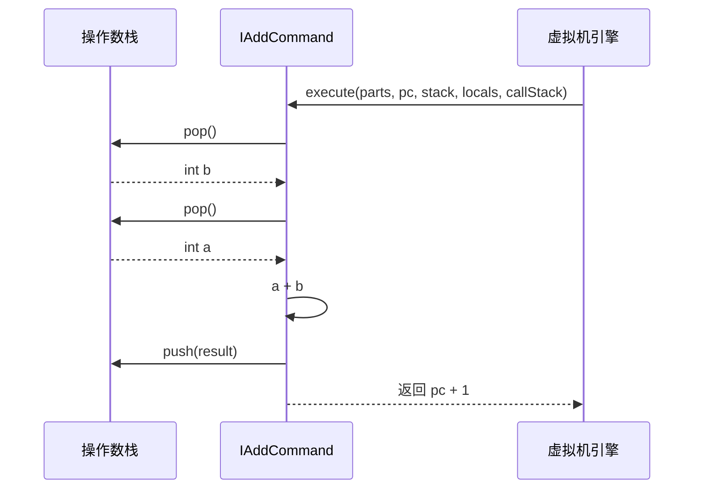
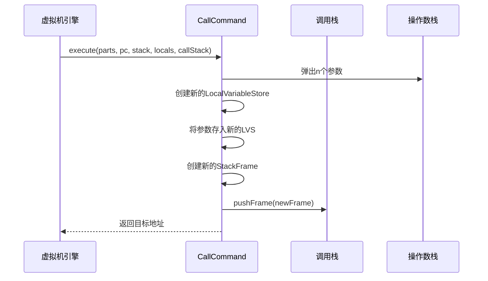
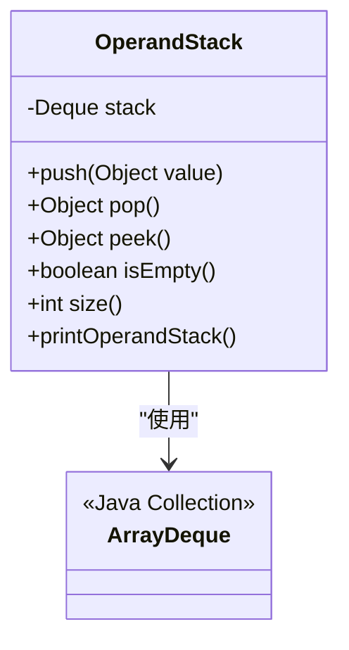
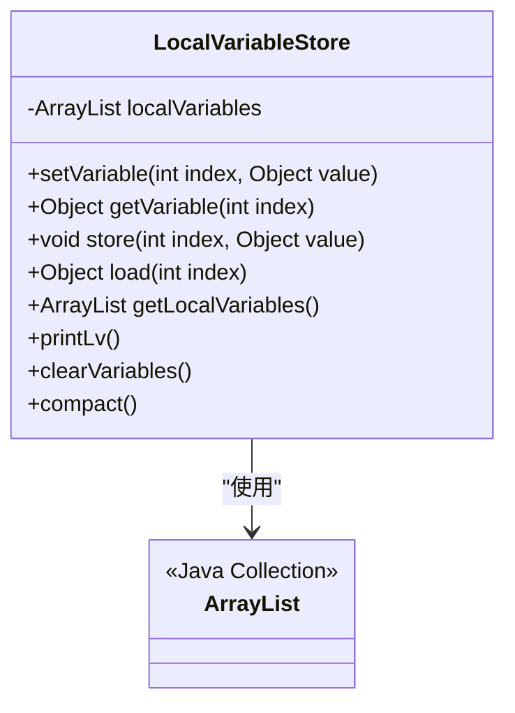
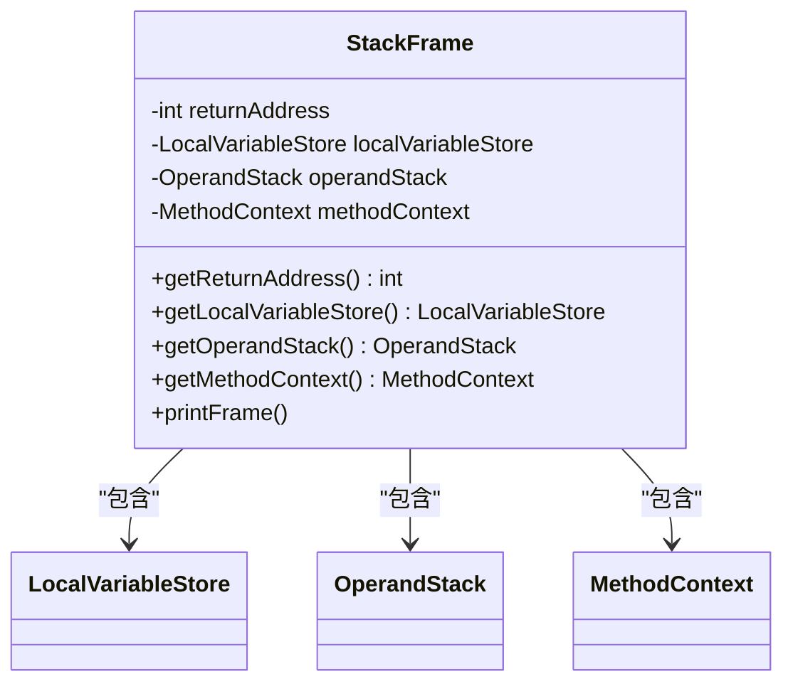
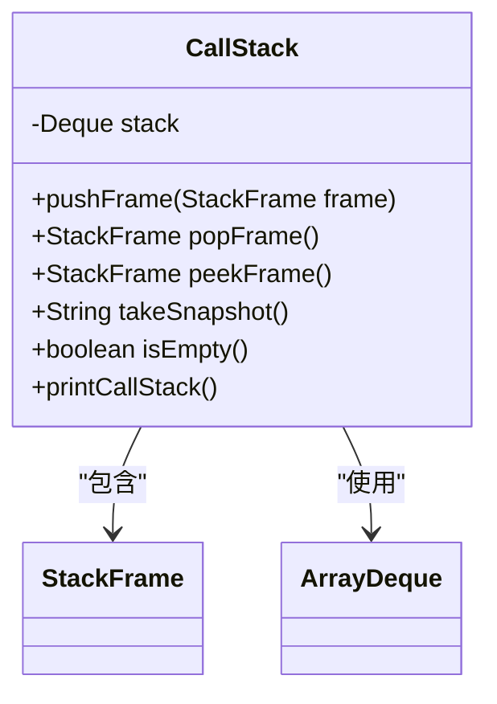
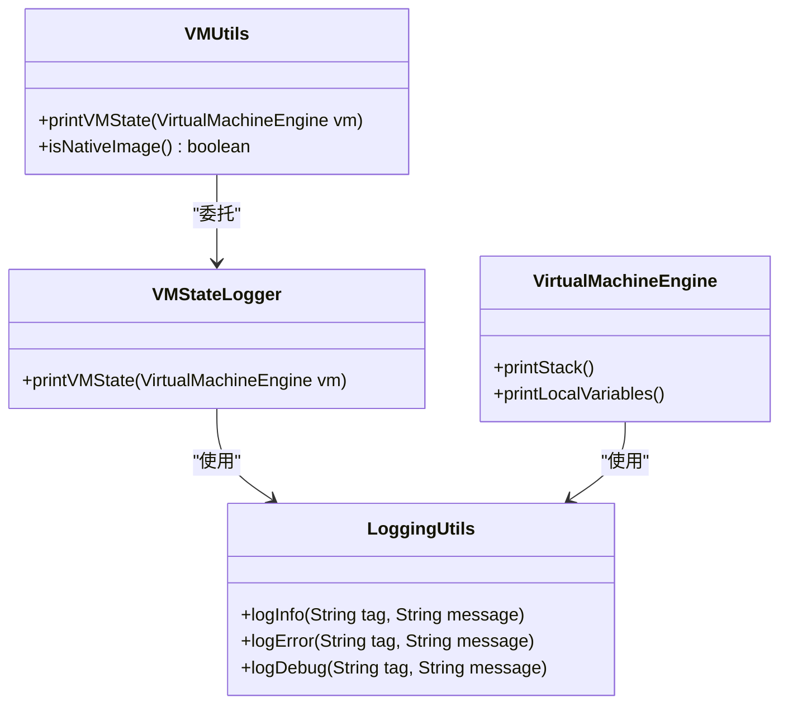
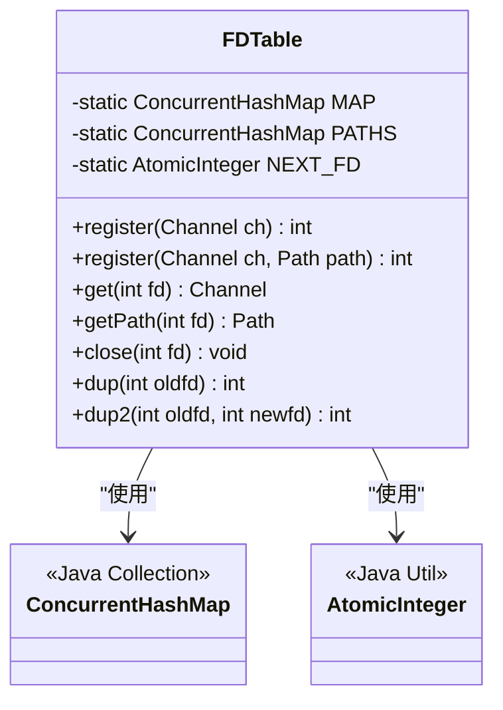

# 虚拟机

<cite>
**本文档引用的文件**  
- [VMOpCode.java](file://src/main/java/org/jcnc/snow/vm/engine/VMOpCode.java)
- [VirtualMachineEngine.java](file://src/main/java/org/jcnc/snow/vm/engine/VirtualMachineEngine.java)
- [OperandStack.java](file://src/main/java/org/jcnc/snow/vm/module/OperandStack.java)
- [LocalVariableStore.java](file://src/main/java/org/jcnc/snow/vm/module/LocalVariableStore.java)
- [StackFrame.java](file://src/main/java/org/jcnc/snow/vm/module/StackFrame.java)
- [CallStack.java](file://src/main/java/org/jcnc/snow/vm/module/CallStack.java)
- [CommandExecutionHandler.java](file://src/main/java/org/jcnc/snow/vm/execution/CommandExecutionHandler.java)
- [CommandLoader.java](file://src/main/java/org/jcnc/snow/vm/execution/CommandLoader.java)
- [IAddCommand.java](file://src/main/java/org/jcnc/snow/vm/commands/type/control/int32/IAddCommand.java)
- [CallCommand.java](file://src/main/java/org/jcnc/snow/vm/commands/flow/control/CallCommand.java)
- [SyscallCommand.java](file://src/main/java/org/jcnc/snow/vm/commands/system/control/SyscallCommand.java)
- [FileIOUtils.java](file://src/main/java/org/jcnc/snow/vm/io/FileIOUtils.java)
- [FDTable.java](file://src/main/java/org/jcnc/snow/vm/io/FDTable.java)
- [VMInitializer.java](file://src/main/java/org/jcnc/snow/vm/VMInitializer.java)
- [VMUtils.java](file://src/main/java/org/jcnc/snow/vm/utils/VMUtils.java)
</cite>

## 目录
1. [简介](#简介)
2. [执行模型](#执行模型)
3. [指令集架构](#指令集架构)
4. [运行时数据结构](#运行时数据结构)
5. [内存管理机制](#内存管理机制)
6. [性能监控与调试工具](#性能监控与调试工具)
7. [虚拟机扩展开发](#虚拟机扩展开发)
8. [系统调用与I/O管理](#系统调用与io管理)

## 简介
Snow虚拟机是一个基于栈的虚拟机，采用分层架构设计，支持多种数据类型的算术运算、控制流操作、内存管理和系统调用。虚拟机通过解释执行字节码指令来运行程序，其核心组件包括指令解码器、执行引擎、运行时数据结构和系统调用处理器。虚拟机的设计注重可扩展性和调试能力，提供了丰富的调试工具和API接口，便于开发人员进行虚拟机扩展和性能优化。

## 执行模型

Snow虚拟机采用基于栈的执行模型，通过程序计数器（PC）控制指令的执行流程。虚拟机从指定的指令文件中加载指令序列，并逐条解释执行。执行过程中，虚拟机维护一个主循环，不断获取当前指令、解析操作码、执行对应操作，并更新程序计数器以指向下一个指令。当遇到控制流指令（如跳转、调用）时，程序计数器会被修改为新的目标地址，从而改变执行流程。

虚拟机的执行流程从`VMInitializer`类的`initializeAndRunVM`方法开始，该方法负责初始化虚拟机、加载指令并启动执行。执行引擎`VirtualMachineEngine`维护着程序计数器和运行时数据结构，通过`CommandExecutionHandler`分发和处理各种操作码。指令执行过程中，虚拟机会进行边界检查和异常处理，确保执行的安全性和稳定性。

**图源**  
- [VMInitializer.java](file://src/main/java/org/jcnc/snow/vm/VMInitializer.java#L45-L60)
- [VirtualMachineEngine.java](file://src/main/java/org/jcnc/snow/vm/engine/VirtualMachineEngine.java#L85-L150)

**本节来源**  
- [VMInitializer.java](file://src/main/java/org/jcnc/snow/vm/VMInitializer.java#L45-L60)
- [VirtualMachineEngine.java](file://src/main/java/org/jcnc/snow/vm/engine/VirtualMachineEngine.java#L85-L150)

## 指令集架构

Snow虚拟机的指令集架构由`VMOpCode`类定义，采用紧凑的16位操作码设计，按逻辑类别组织。指令集分为多个类别，包括算术运算、控制流、内存管理、类型转换和系统调用等。每个操作码都有唯一的整数值，对应特定的执行逻辑。

指令集按数据类型和操作类别进行组织，主要分为以下几类：

- **类型控制指令**：针对不同数据类型（byte8、short16、int32、long64、float32、double64）的算术运算、逻辑运算和比较操作
- **引用控制指令**：用于对象引用的操作，如加载、存储和引用运算
- **寄存器控制指令**：用于寄存器间的数据移动
- **栈控制指令**：用于操作数栈的管理，如压栈、弹栈和交换
- **流程控制指令**：用于控制程序执行流程，如调用、返回和跳转
- **系统控制指令**：用于系统调用、内存管理和I/O操作

每条指令的执行都由对应的`Command`实现类处理，这些类实现了统一的`execute`方法接口。指令执行时，从操作数栈获取操作数，执行相应操作，并将结果放回操作数栈或更新程序状态。

**图源**  
- [VMOpCode.java](file://src/main/java/org/jcnc/snow/vm/engine/VMOpCode.java#L1-L100)
- [IAddCommand.java](file://src/main/java/org/jcnc/snow/vm/commands/type/control/int32/IAddCommand.java#L1-L10)
- [CallCommand.java](file://src/main/java/org/jcnc/snow/vm/commands/flow/control/CallCommand.java#L1-L10)
- [SyscallCommand.java](file://src/main/java/org/jcnc/snow/vm/commands/system/control/SyscallCommand.java#L1-L10)

**本节来源**  
- [VMOpCode.java](file://src/main/java/org/jcnc/snow/vm/engine/VMOpCode.java#L1-L100)

### 算术与逻辑指令
算术与逻辑指令是虚拟机中最基本的指令类别，用于执行各种数学运算和位操作。这些指令按数据类型分为多个子类，每个子类包含加、减、乘、除、取模、取负等基本算术运算，以及与、或、异或等位逻辑运算。

以`I_ADD`（int32加法）指令为例，其执行过程包括：从操作数栈弹出两个int32值，执行加法运算，将结果压回操作数栈。类似的，`B_AND`（byte8与运算）指令会从栈中弹出两个byte8值，执行按位与操作，并将结果压栈。

**图源**  
- [IAddCommand.java](file://src/main/java/org/jcnc/snow/vm/commands/type/control/int32/IAddCommand.java#L45-L55)
- [OperandStack.java](file://src/main/java/org/jcnc/snow/vm/module/OperandStack.java#L45-L60)

**本节来源**  
- [IAddCommand.java](file://src/main/java/org/jcnc/snow/vm/commands/type/control/int32/IAddCommand.java#L45-L55)

### 控制流指令
控制流指令用于改变程序的执行顺序，包括条件跳转、无条件跳转、函数调用和返回等。这些指令通过修改程序计数器的值来实现控制流的转移。

`CALL`指令用于调用子程序，其执行过程包括：解析目标地址和参数数量，从操作数栈弹出参数并按正确顺序排列，创建新的栈帧并压入调用栈，设置返回地址，最后将程序计数器更新为目标地址。`RET`指令则用于从子程序返回，它会弹出当前栈帧，并将程序计数器恢复为返回地址。

**图源**  
- [CallCommand.java](file://src/main/java/org/jcnc/snow/vm/commands/flow/control/CallCommand.java#L45-L75)
- [CallStack.java](file://src/main/java/org/jcnc/snow/vm/module/CallStack.java#L45-L60)

**本节来源**  
- [CallCommand.java](file://src/main/java/org/jcnc/snow/vm/commands/flow/control/CallCommand.java#L45-L75)

### 系统调用指令
系统调用指令`SYSCALL`是虚拟机与外部系统交互的桥梁。该指令通过操作码路由到不同的系统调用处理器，实现文件I/O、网络通信、进程管理等功能。

`SyscallCommand`作为系统调用的分发器，根据操作码查找对应的`SyscallHandler`，然后调用处理器的`handle`方法。系统调用的成功或失败状态通过操作数栈传递，失败时会压入错误码和错误信息。

**本节来源**  
- [SyscallCommand.java](file://src/main/java/org/jcnc/snow/vm/commands/system/control/SyscallCommand.java#L1-L80)

## 运行时数据结构

Snow虚拟机的核心运行时数据结构包括操作数栈、局部变量存储、栈帧和调用栈。这些数据结构共同构成了虚拟机的执行环境，管理着程序执行过程中的数据和状态。

### OperandStack
`OperandStack`类实现了虚拟机的操作数栈，使用`ArrayDeque`作为底层数据结构。操作数栈用于存储指令执行过程中的临时值，支持压栈、弹栈、查看栈顶等基本操作。栈中存储的对象类型包括各种基本数据类型和引用类型。

**图源**  
- [OperandStack.java](file://src/main/java/org/jcnc/snow/vm/module/OperandStack.java#L1-L20)

**本节来源**  
- [OperandStack.java](file://src/main/java/org/jcnc/snow/vm/module/OperandStack.java#L1-L20)

### LocalVariableStore
`LocalVariableStore`类表示虚拟机的局部变量存储，用于存储方法调用中的局部变量。它使用`ArrayList`作为底层存储，支持通过索引随机访问变量。局部变量存储可以动态扩展，当访问的索引超出当前容量时，会自动填充`null`值。

**图源**  
- [LocalVariableStore.java](file://src/main/java/org/jcnc/snow/vm/module/LocalVariableStore.java#L1-L20)

**本节来源**  
- [LocalVariableStore.java](file://src/main/java/org/jcnc/snow/vm/module/LocalVariableStore.java#L1-L20)

### StackFrame
`StackFrame`类表示调用栈中的一个栈帧，包含方法调用的执行上下文。每个栈帧包含返回地址、局部变量存储、操作数栈和方法上下文。栈帧在方法调用时创建，在方法返回时销毁。

**图源**  
- [StackFrame.java](file://src/main/java/org/jcnc/snow/vm/module/StackFrame.java#L1-L20)

**本节来源**  
- [StackFrame.java](file://src/main/java/org/jcnc/snow/vm/module/StackFrame.java#L1-L20)

### CallStack
`CallStack`类管理虚拟机的调用栈，使用`ArrayDeque`存储栈帧。调用栈负责维护函数调用的层次结构，支持栈帧的压入、弹出和查看。调用栈还提供了栈溢出保护，限制最大栈深度为1024。

**图源**  
- [CallStack.java](file://src/main/java/org/jcnc/snow/vm/module/CallStack.java#L1-L20)

**本节来源**  
- [CallStack.java](file://src/main/java/org/jcnc/snow/vm/module/CallStack.java#L1-L20)

## 内存管理机制

Snow虚拟机的内存管理机制主要包括运行时数据结构的内存分配和垃圾回收策略。虚拟机使用Java的自动内存管理机制，依赖JVM的垃圾回收器来回收不再使用的对象。

虚拟机的内存布局主要包括以下几个区域：

- **操作数栈**：存储指令执行过程中的临时值
- **局部变量存储**：存储方法调用中的局部变量
- **调用栈**：存储方法调用的上下文信息
- **常量池**：存储程序中的常量值
- **堆内存**：存储动态分配的对象

虚拟机通过`LocalVariableStore`的`compact`方法优化内存使用，在程序执行结束后移除尾部的`null`槽位，减少内存占用。此外，虚拟机还提供了`clearVariables`方法，在栈帧弹出时清除局部变量，帮助垃圾回收器及时回收内存。

**本节来源**  
- [LocalVariableStore.java](file://src/main/java/org/jcnc/snow/vm/module/LocalVariableStore.java#L150-L180)
- [CallStack.java](file://src/main/java/org/jcnc/snow/vm/module/CallStack.java#L60-L70)

## 性能监控与调试工具

Snow虚拟机提供了多种性能监控和调试工具，帮助开发人员分析和优化程序性能。这些工具包括状态打印、调用栈快照、日志记录等。

`VMUtils`类提供了`printVMState`方法，可以打印虚拟机的当前状态，包括操作数栈和局部变量存储的内容。`VirtualMachineEngine`类也提供了`printStack`和`printLocalVariables`方法，用于调试目的。

`CallStack`类的`takeSnapshot`方法可以生成调用栈的快照，这对于异常处理和调试非常有用。`LoggingUtils`类提供了统一的日志记录接口，支持不同级别的日志输出。

**图源**  
- [VMUtils.java](file://src/main/java/org/jcnc/snow/vm/utils/VMUtils.java#L1-L20)
- [VMStateLogger.java](file://src/main/java/org/jcnc/snow/vm/utils/VMStateLogger.java#L1-L10)
- [LoggingUtils.java](file://src/main/java/org/jcnc/snow/vm/utils/LoggingUtils.java#L1-L10)

**本节来源**  
- [VMUtils.java](file://src/main/java/org/jcnc/snow/vm/utils/VMUtils.java#L1-L20)
- [VirtualMachineEngine.java](file://src/main/java/org/jcnc/snow/vm/engine/VirtualMachineEngine.java#L170-L180)

## 虚拟机扩展开发

Snow虚拟机的设计支持扩展开发，开发人员可以通过实现`Command`接口来添加新的指令，或通过继承现有类来扩展功能。

扩展开发的最佳实践包括：

1. **遵循接口规范**：新指令必须实现`Command`接口的`execute`方法，确保与虚拟机的执行引擎兼容
2. **保持线程安全**：如果指令涉及共享资源的访问，需要确保操作的线程安全性
3. **合理使用异常处理**：在指令执行过程中，应妥善处理可能出现的异常情况
4. **优化性能**：尽量减少不必要的对象创建和内存分配，提高指令执行效率
5. **提供充分的文档**：为新指令编写详细的文档，说明其功能、参数和使用方法

虚拟机的模块化设计使得扩展开发相对简单，开发人员可以专注于特定功能的实现，而无需了解整个虚拟机的内部细节。

**本节来源**  
- [Command.java](file://src/main/java/org/jcnc/snow/vm/interfaces/Command.java#L1-L10)
- [IAddCommand.java](file://src/main/java/org/jcnc/snow/vm/commands/type/control/int32/IAddCommand.java#L1-L10)

## 系统调用与I/O管理

Snow虚拟机通过`FDTable`类管理文件描述符，实现了对文件I/O、网络通信等系统资源的统一管理。`FDTable`维护了一个全局的文件描述符到通道的映射表，支持标准输入输出（0/1/2）及所有动态分配的fd。

文件描述符的管理是线程安全的，支持注册、查找、关闭、复制等操作。`register`方法用于注册新的通道并分配文件描述符，`get`方法通过文件描述符获取对应的通道，`close`方法用于关闭并移除文件描述符。

**图源**  
- [FDTable.java](file://src/main/java/org/jcnc/snow/vm/io/FDTable.java#L1-L20)

**本节来源**  
- [FDTable.java](file://src/main/java/org/jcnc/snow/vm/io/FDTable.java#L1-L20)