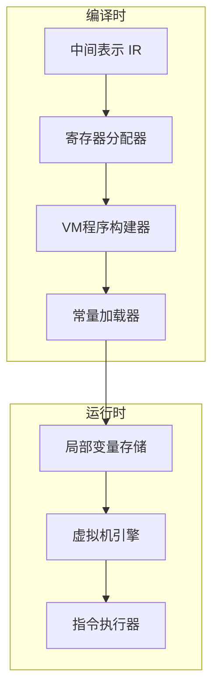
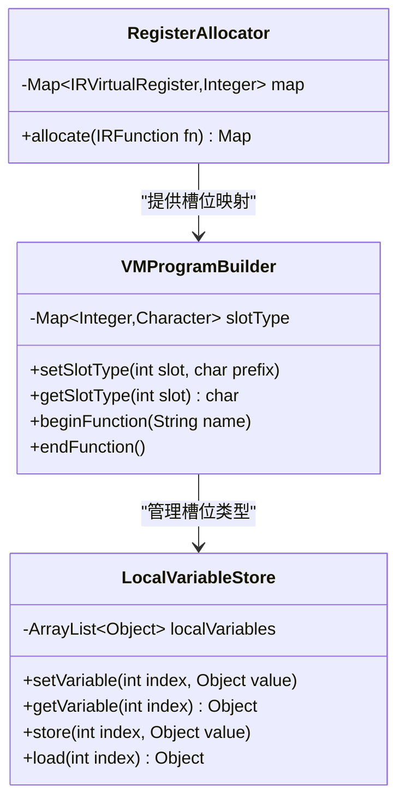
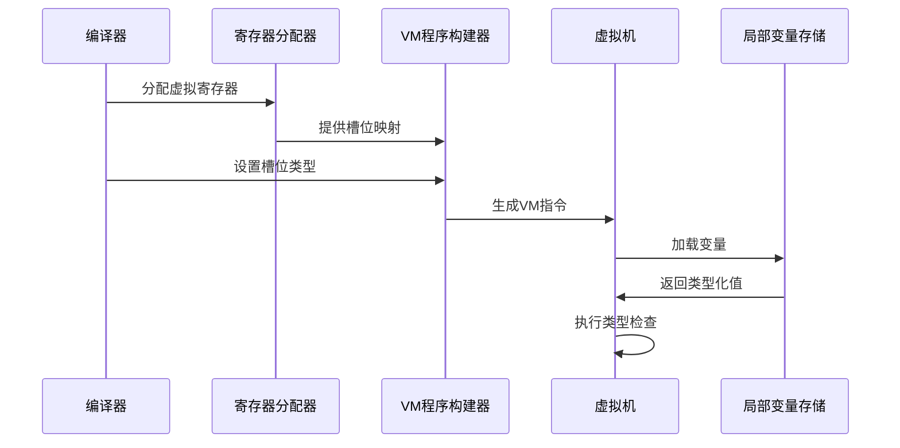
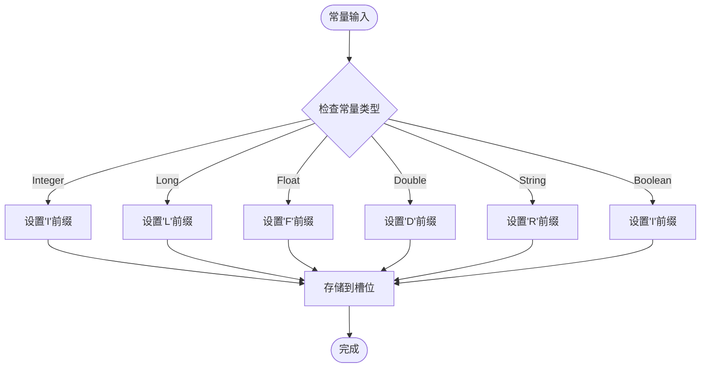
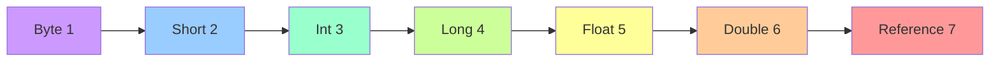
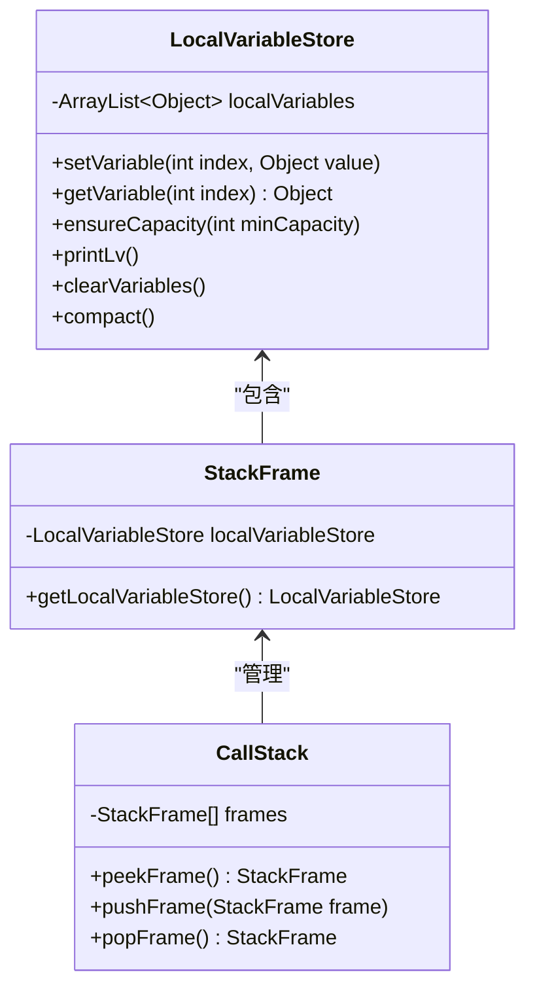
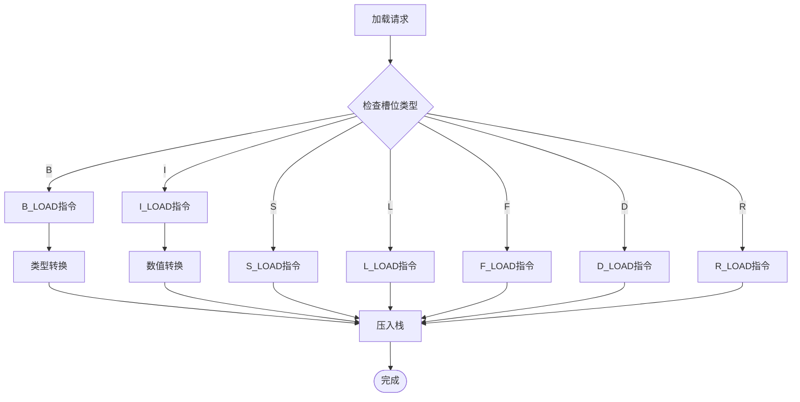
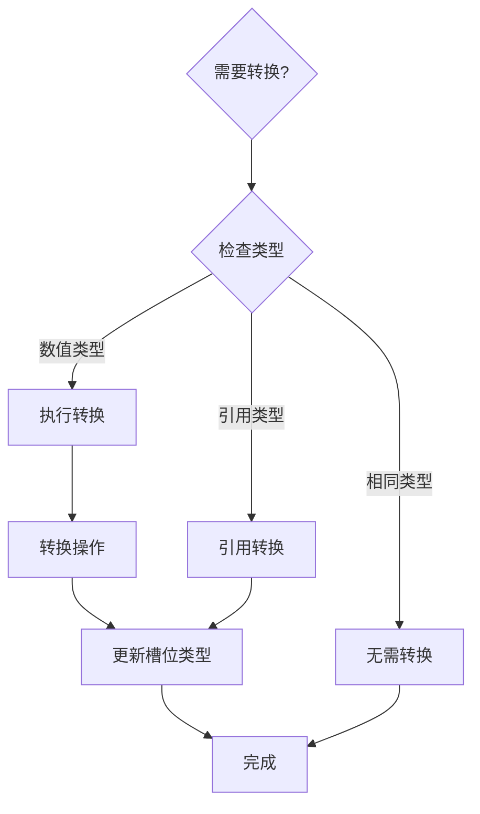
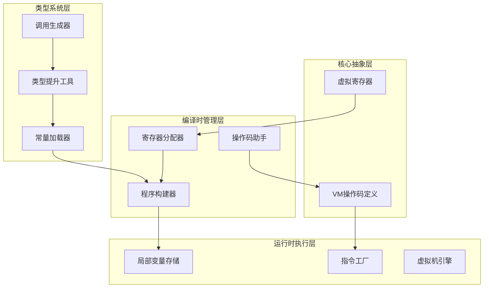
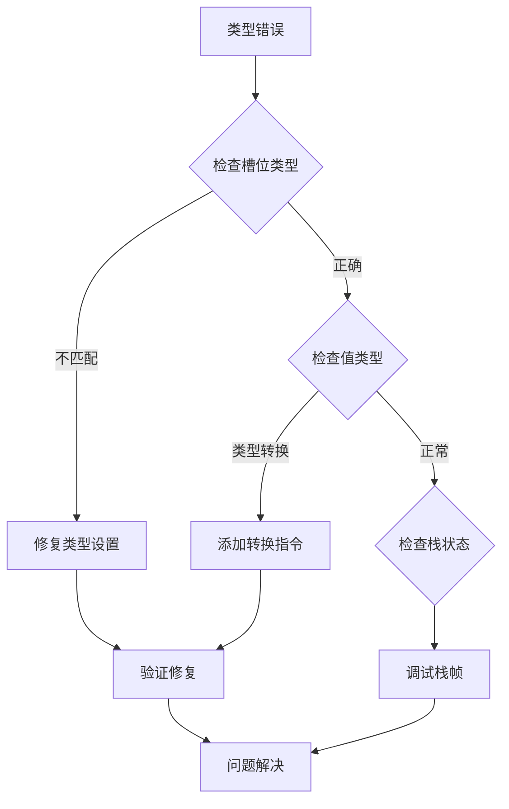

# 虚拟机槽位类型前缀

<cite>
**本文档中引用的文件**
- [VMOpCode.java](file://src/main/java/org/jcnc/snow/vm/engine/VMOpCode.java)
- [VMProgramBuilder.java](file://src/main/java/org/jcnc/snow/compiler/backend/builder/VMProgramBuilder.java)
- [LocalVariableStore.java](file://src/main/java/org/jcnc/snow/vm/module/LocalVariableStore.java)
- [RegisterAllocator.java](file://src/main/java/org/jcnc/snow/compiler/backend/alloc/RegisterAllocator.java)
- [LoadConstGenerator.java](file://src/main/java/org/jcnc/snow/compiler/backend/generator/LoadConstGenerator.java)
- [OpHelper.java](file://src/main/java/org/jcnc/snow/compiler/backend/utils/OpHelper.java)
- [TypePromoteUtils.java](file://src/main/java/org/jcnc/snow/compiler/backend/utils/TypePromoteUtils.java)
- [CallGenerator.java](file://src/main/java/org/jcnc/snow/compiler/backend/generator/CallGenerator.java)
- [BLoadCommand.java](file://src/main/java/org/jcnc/snow/vm/commands/type/control/byte8/BLoadCommand.java)
- [ILoadCommand.java](file://src/main/java/org/jcnc/snow/vm/commands/type/control/int32/ILoadCommand.java)
- [IRVirtualRegister.java](file://src/main/java/org/jcnc/snow/compiler/ir/value/IRVirtualRegister.java)
</cite>

## 目录
1. [简介](#简介)
2. [项目结构概览](#项目结构概览)
3. [核心组件分析](#核心组件分析)
4. [架构概览](#架构概览)
5. [详细组件分析](#详细组件分析)
6. [依赖关系分析](#依赖关系分析)
7. [性能考虑](#性能考虑)
8. [故障排除指南](#故障排除指南)
9. [结论](#结论)

## 简介

Snow虚拟机的槽位类型前缀系统是一个精心设计的类型管理系统，用于在虚拟机执行过程中维护和验证数据类型的一致性。该系统通过为每个局部变量槽位分配特定的类型前缀（如'B'、'S'、'I'、'L'、'F'、'D'、'R'），确保类型安全的同时提供高效的运行时性能。

该系统的核心价值在于：
- **类型安全性**：通过严格的类型前缀管理防止类型混淆
- **运行时效率**：避免不必要的类型转换开销
- **编译时优化**：支持基于类型信息的代码优化
- **内存管理**：合理利用局部变量槽位的空间

## 项目结构概览

Snow虚拟机采用分层架构设计，槽位类型前缀系统贯穿整个编译和运行时阶段：

**图表来源**
- [VMProgramBuilder.java](file://src/main/java/org/jcnc/snow/compiler/backend/builder/VMProgramBuilder.java#L1-L50)
- [LocalVariableStore.java](file://src/main/java/org/jcnc/snow/vm/module/LocalVariableStore.java#L1-L50)

## 核心组件分析

### 槽位类型前缀定义

Snow虚拟机使用以下类型前缀来标识不同的数据类型：

| 前缀 | 类型 | 大小 | 描述 |
|------|------|------|------|
| B | Byte | 8位 | 字节类型，用于最小内存占用场景 |
| S | Short | 16位 | 短整型，平衡内存和性能需求 |
| I | Int | 32位 | 整型，最常见的数值类型 |
| L | Long | 64位 | 长整型，用于大数值计算 |
| F | Float | 32位 | 单精度浮点型 |
| D | Double | 64位 | 双精度浮点型 |
| R | Reference | 动态 | 引用类型，包括字符串、数组等 |

### 类型前缀管理机制

**图表来源**
- [VMProgramBuilder.java](file://src/main/java/org/jcnc/snow/compiler/backend/builder/VMProgramBuilder.java#L33-L97)
- [LocalVariableStore.java](file://src/main/java/org/jcnc/snow/vm/module/LocalVariableStore.java#L29-L110)
- [RegisterAllocator.java](file://src/main/java/org/jcnc/snow/compiler/backend/alloc/RegisterAllocator.java#L35-L76)

**章节来源**
- [VMProgramBuilder.java](file://src/main/java/org/jcnc/snow/compiler/backend/builder/VMProgramBuilder.java#L85-L97)
- [LocalVariableStore.java](file://src/main/java/org/jcnc/snow/vm/module/LocalVariableStore.java#L52-L104)

## 架构概览

槽位类型前缀系统采用编译时类型推断和运行时类型验证相结合的设计模式：

**图表来源**
- [RegisterAllocator.java](file://src/main/java/org/jcnc/snow/compiler/backend/alloc/RegisterAllocator.java#L52-L76)
- [VMProgramBuilder.java](file://src/main/java/org/jcnc/snow/compiler/backend/builder/VMProgramBuilder.java#L85-L97)

## 详细组件分析

### 编译时类型推断

#### 常量类型推断

常量加载器负责根据常量值自动推断类型前缀：

**图表来源**
- [LoadConstGenerator.java](file://src/main/java/org/jcnc/snow/compiler/backend/generator/LoadConstGenerator.java#L159-L171)

#### 类型提升系统

类型提升系统确保数值运算中的类型一致性：

**图表来源**
- [TypePromoteUtils.java](file://src/main/java/org/jcnc/snow/compiler/backend/utils/TypePromoteUtils.java#L43-L53)

**章节来源**
- [LoadConstGenerator.java](file://src/main/java/org/jcnc/snow/compiler/backend/generator/LoadConstGenerator.java#L140-L178)
- [TypePromoteUtils.java](file://src/main/java/org/jcnc/snow/compiler/backend/utils/TypePromoteUtils.java#L43-L76)

### 运行时类型验证

#### 局部变量存储管理

局部变量存储器提供类型安全的变量访问机制：

**图表来源**
- [LocalVariableStore.java](file://src/main/java/org/jcnc/snow/vm/module/LocalVariableStore.java#L29-L110)

#### 指令执行中的类型检查

不同类型的加载指令具有不同的行为：

**图表来源**
- [BLoadCommand.java](file://src/main/java/org/jcnc/snow/vm/commands/type/control/byte8/BLoadCommand.java#L54-L64)
- [ILoadCommand.java](file://src/main/java/org/jcnc/snow/vm/commands/type/control/int32/ILoadCommand.java#L77-L92)

**章节来源**
- [LocalVariableStore.java](file://src/main/java/org/jcnc/snow/vm/module/LocalVariableStore.java#L52-L104)
- [BLoadCommand.java](file://src/main/java/org/jcnc/snow/vm/commands/type/control/byte8/BLoadCommand.java#L52-L66)

### 类型转换机制

#### 自动类型转换

系统支持多种类型的自动转换：

| 源类型 | 目标类型 | 转换规则 |
|--------|----------|----------|
| B → S | 类型提升 | 无损失转换 |
| S → I | 类型提升 | 无损失转换 |
| I → L | 类型提升 | 无损失转换 |
| F → D | 类型提升 | 无损失转换 |
| L → I | 截断 | 可能丢失精度 |
| D → F | 截断 | 可能丢失精度 |

#### 条件类型转换

**图表来源**
- [CallGenerator.java](file://src/main/java/org/jcnc/snow/compiler/backend/generator/CallGenerator.java#L417-L427)

**章节来源**
- [CallGenerator.java](file://src/main/java/org/jcnc/snow/compiler/backend/generator/CallGenerator.java#L383-L427)

## 依赖关系分析

槽位类型前缀系统的依赖关系呈现清晰的层次结构：

**图表来源**
- [VMOpCode.java](file://src/main/java/org/jcnc/snow/vm/engine/VMOpCode.java#L1-L25)
- [VMProgramBuilder.java](file://src/main/java/org/jcnc/snow/compiler/backend/builder/VMProgramBuilder.java#L1-L35)

**章节来源**
- [VMOpCode.java](file://src/main/java/org/jcnc/snow/vm/engine/VMOpCode.java#L1-L25)
- [VMProgramBuilder.java](file://src/main/java/org/jcnc/snow/compiler/backend/builder/VMProgramBuilder.java#L1-L35)

## 性能考虑

### 内存效率优化

槽位类型前缀系统通过以下方式优化内存使用：

1. **紧凑的类型标识**：使用单字符前缀而非完整类型描述
2. **延迟类型检查**：仅在必要时进行类型转换
3. **类型缓存**：避免重复的类型查询操作

### 执行速度优化

1. **分支预测友好**：类型前缀分布均匀，利于CPU分支预测
2. **SIMD友好的布局**：相邻类型在内存中连续存储
3. **内联优化**：常用类型的操作可以直接内联执行

### 编译时优化

1. **类型推断**：减少运行时类型检查开销
2. **死代码消除**：移除不可能到达的类型转换路径
3. **常量折叠**：在编译时确定常量的类型

## 故障排除指南

### 常见问题诊断

#### 类型不匹配错误

当遇到类型不匹配错误时，检查以下方面：

1. **槽位类型设置**：确认`VMProgramBuilder.setSlotType()`正确调用
2. **类型转换链**：检查是否存在意外的类型转换
3. **寄存器分配**：验证寄存器分配器的输出

#### 运行时类型异常

#### 性能问题排查

1. **类型转换热点**：使用性能分析器识别频繁的类型转换
2. **内存访问模式**：检查局部变量存储的访问模式
3. **指令缓存效率**：分析指令执行的缓存命中率

**章节来源**
- [LocalVariableStore.java](file://src/main/java/org/jcnc/snow/vm/module/LocalVariableStore.java#L85-L104)

## 结论

Snow虚拟机的槽位类型前缀系统是一个设计精良的类型管理系统，它成功地在类型安全性和运行时性能之间找到了平衡。通过编译时的类型推断和运行时的类型验证，该系统确保了程序的正确执行，同时保持了高效的执行性能。

### 主要优势

1. **类型安全性**：严格的类型前缀管理防止类型混淆
2. **性能优化**：合理的类型设计减少了运行时开销
3. **可扩展性**：模块化的设计支持未来的新类型扩展
4. **调试友好**：清晰的类型信息便于问题诊断

### 未来发展方向

1. **泛型支持**：扩展类型系统以支持泛型编程
2. **类型推断增强**：改进编译时的类型推断算法
3. **运行时类型检查优化**：进一步减少类型验证的开销
4. **内存布局优化**：探索更高效的局部变量存储布局

该系统为Snow虚拟机提供了坚实的类型基础，是整个虚拟机架构中不可或缺的重要组成部分。