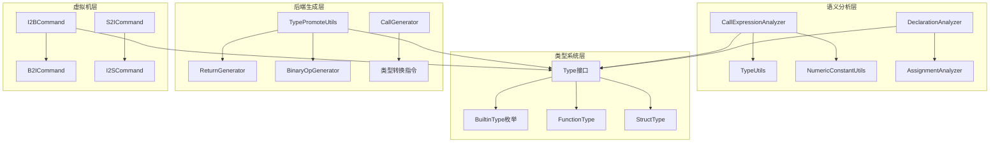
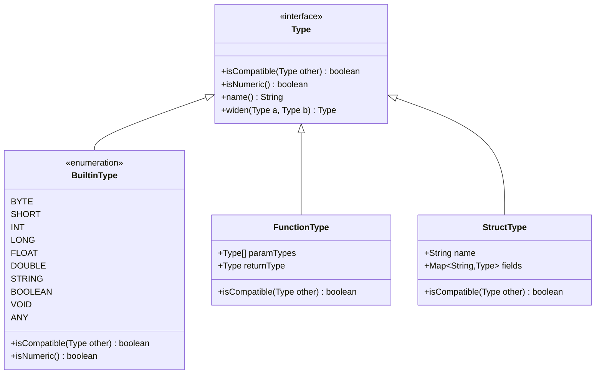
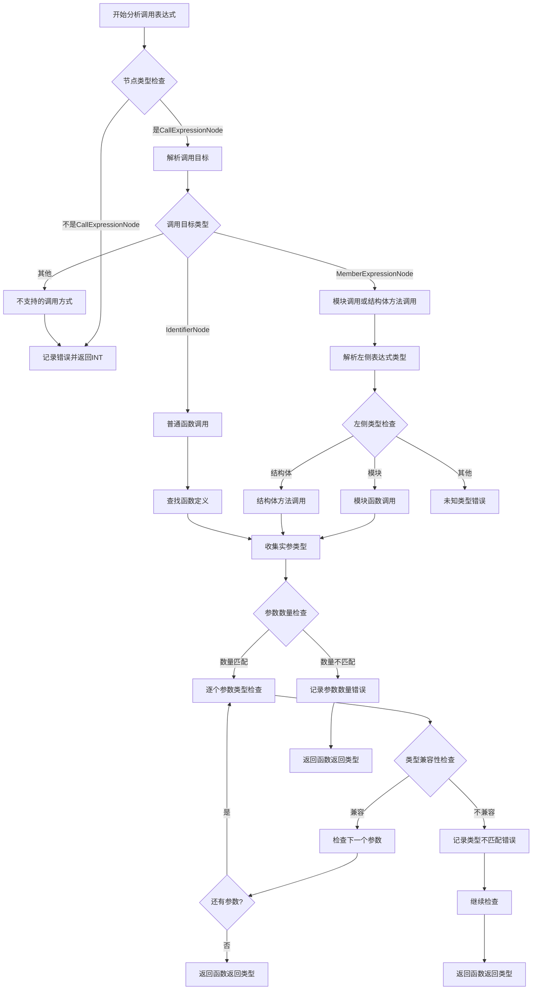
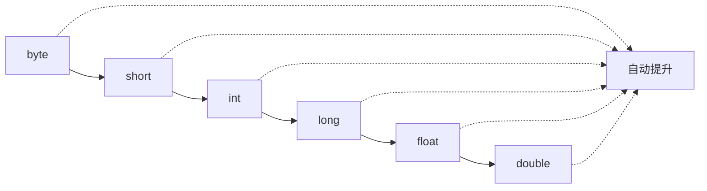
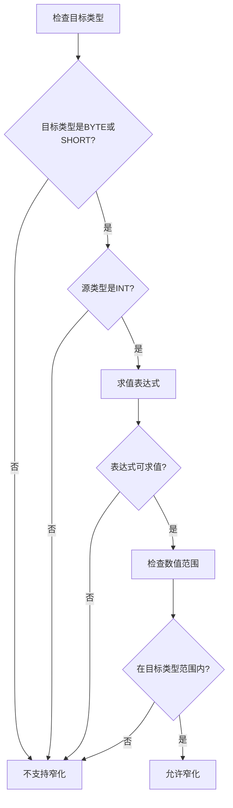
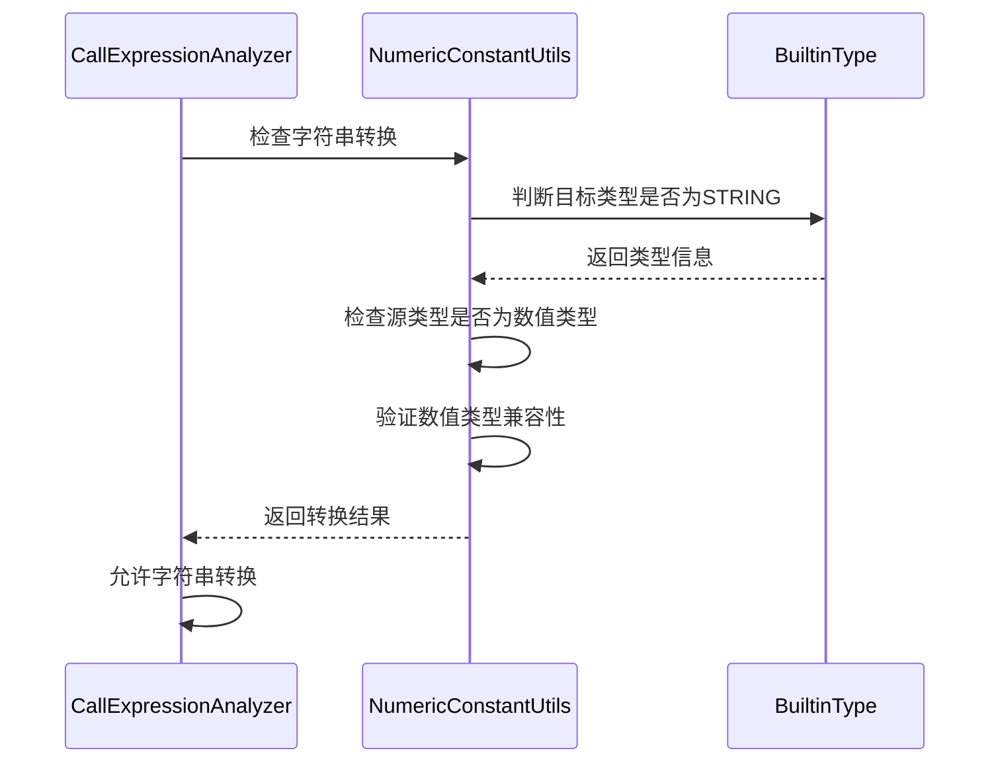
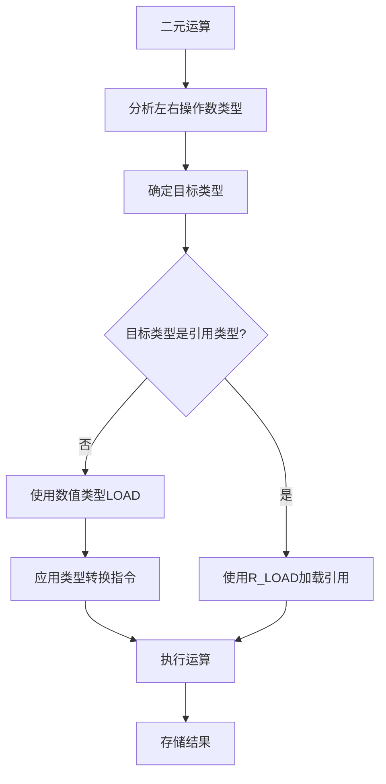

# 调用参数类型检查与转换

<cite>
**本文档中引用的文件**
- [CallExpressionAnalyzer.java](file://src/main/java/org/jcnc/snow/compiler/semantic/analyzers/expression/CallExpressionAnalyzer.java)
- [Type.java](file://src/main/java/org/jcnc/snow/compiler/semantic/type/Type.java)
- [BuiltinType.java](file://src/main/java/org/jcnc/snow/compiler/semantic/type/BuiltinType.java)
- [NumericConstantUtils.java](file://src/main/java/org/jcnc/snow/compiler/semantic/utils/NumericConstantUtils.java)
- [TypePromoteUtils.java](file://src/main/java/org/jcnc/snow/compiler/backend/utils/TypePromoteUtils.java)
- [NumberLiteralAnalyzer.java](file://src/main/java/org/jcnc/snow/compiler/semantic/analyzers/expression/NumberLiteralAnalyzer.java)
- [AssignmentAnalyzer.java](file://src/main/java/org/jcnc/snow/compiler/semantic/analyzers/statement/AssignmentAnalyzer.java)
- [DeclarationAnalyzer.java](file://src/main/java/org/jcnc/snow/compiler/semantic/analyzers/statement/DeclarationAnalyzer.java)
- [StringLiteralAnalyzer.java](file://src/main/java/org/jcnc/snow/compiler/semantic/analyzers/expression/StringLiteralAnalyzer.java)
- [ReturnGenerator.java](file://src/main/java/org/jcnc/snow/compiler/backend/generator/ReturnGenerator.java)
- [BinaryOpGenerator.java](file://src/main/java/org/jcnc/snow/compiler/backend/generator/BinaryOpGenerator.java)
- [CallGenerator.java](file://src/main/java/org/jcnc/snow/compiler/backend/generator/CallGenerator.java)
- [I2BCommand.java](file://src/main/java/org/jcnc/snow/vm/commands/type/conversion/I2BCommand.java)
- [B2ICommand.java](file://src/main/java/org/jcnc/snow/vm/commands/type/conversion/B2ICommand.java)
- [S2ICommand.java](file://src/main/java/org/jcnc/snow/vm/commands/type/conversion/S2ICommand.java)
- [I2SCommand.java](file://src/main/java/org/jcnc/snow/vm/commands/type/conversion/I2SCommand.java)
</cite>

## 目录
1. [简介](#简介)
2. [项目结构概览](#项目结构概览)
3. [核心类型系统](#核心类型系统)
4. [调用参数类型检查机制](#调用参数类型检查机制)
5. [类型转换与提升](#类型转换与提升)
6. [数值类型处理](#数值类型处理)
7. [字符串转换机制](#字符串转换机制)
8. [字节码生成中的类型转换](#字节码生成中的类型转换)
9. [错误处理与诊断](#错误处理与诊断)
10. [性能考虑](#性能考虑)
11. [总结](#总结)

## 简介

Snow编译器是一个复杂的编译系统，其类型检查与转换机制贯穿整个编译过程。本文档深入分析Snow编译器中调用参数类型检查与转换的实现原理，包括语义分析阶段的类型推断、数值类型提升、字符串转换以及字节码生成阶段的类型转换指令生成。

该系统采用多层次的类型检查策略，从AST解析到IR生成再到最终的字节码输出，每一层都有相应的类型验证和转换逻辑，确保类型安全性和编译器的健壮性。

## 项目结构概览

Snow编译器的类型检查与转换功能分布在多个模块中：

**图表来源**
- [CallExpressionAnalyzer.java](file://src/main/java/org/jcnc/snow/compiler/semantic/analyzers/expression/CallExpressionAnalyzer.java#L58-L256)
- [Type.java](file://src/main/java/org/jcnc/snow/compiler/semantic/type/Type.java#L7-L58)
- [TypePromoteUtils.java](file://src/main/java/org/jcnc/snow/compiler/backend/utils/TypePromoteUtils.java#L22-L161)

## 核心类型系统

### 类型接口设计

Snow编译器的类型系统基于统一的Type接口设计，提供了类型兼容性检查、数值类型判断等核心功能：

**图表来源**
- [Type.java](file://src/main/java/org/jcnc/snow/compiler/semantic/type/Type.java#L7-L58)
- [BuiltinType.java](file://src/main/java/org/jcnc/snow/compiler/semantic/type/BuiltinType.java#L23-L123)

### 数值类型优先级

数值类型按照优先级从高到低排列：`R`(引用类型) > `D`(double) > `F`(float) > `L`(long) > `I`(int) > `S`(short) > `B`(byte)。

**章节来源**
- [TypePromoteUtils.java](file://src/main/java/org/jcnc/snow/compiler/backend/utils/TypePromoteUtils.java#L43-L76)

## 调用参数类型检查机制

### 函数调用类型检查流程

CallExpressionAnalyzer是处理函数调用表达式的核心组件，实现了完整的参数类型检查机制：

**图表来源**
- [CallExpressionAnalyzer.java](file://src/main/java/org/jcnc/snow/compiler/semantic/analyzers/expression/CallExpressionAnalyzer.java#L77-L256)

### 参数类型兼容性判断

类型兼容性检查遵循以下规则：

1. **ANY类型兼容性**：任意类型与ANY类型兼容
2. **类型完全一致**：相同类型直接兼容
3. **数值类型宽化**：支持从窄类型到宽类型的自动转换
4. **字符串转换**：数值类型可以隐式转换为字符串类型

**章节来源**
- [CallExpressionAnalyzer.java](file://src/main/java/org/jcnc/snow/compiler/semantic/analyzers/expression/CallExpressionAnalyzer.java#L235-L249)

## 类型转换与提升

### 数值类型提升机制

Snow编译器实现了完整的数值类型提升机制，支持从byte到double的所有数值类型之间的自动转换：

**图表来源**
- [Type.java](file://src/main/java/org/jcnc/snow/compiler/semantic/type/Type.java#L18-L30)
- [TypePromoteUtils.java](file://src/main/java/org/jcnc/snow/compiler/backend/utils/TypePromoteUtils.java#L43-L76)

### 类型转换工具类

TypePromoteUtils提供了完整的类型转换支持：

| 源类型 | 目标类型 | 转换指令 |
|--------|----------|----------|
| B(byte) | S(short) | B2S |
| B(byte) | I(int) | B2I |
| B(byte) | L(long) | B2L |
| B(byte) | F(float) | B2F |
| B(byte) | D(double) | B2D |
| S(short) | I(int) | S2I |
| S(short) | L(long) | S2L |
| S(short) | F(float) | S2F |
| S(short) | D(double) | S2D |
| I(int) | L(long) | I2L |
| I(int) | F(float) | I2F |
| I(int) | D(double) | I2D |
| L(long) | F(float) | L2F |
| L(long) | D(double) | L2D |
| F(float) | D(double) | F2D |

**章节来源**
- [TypePromoteUtils.java](file://src/main/java/org/jcnc/snow/compiler/backend/utils/TypePromoteUtils.java#L119-L158)

## 数值类型处理

### 整型窄化处理

Snow编译器支持编译期常量的整型窄化转换，但有严格的范围检查：

**图表来源**
- [NumericConstantUtils.java](file://src/main/java/org/jcnc/snow/compiler/semantic/utils/NumericConstantUtils.java#L74-L89)

### 数值常量求值

NumericConstantUtils实现了表达式的编译期求值功能：

**章节来源**
- [NumericConstantUtils.java](file://src/main/java/org/jcnc/snow/compiler/semantic/utils/NumericConstantUtils.java#L30-L64)

## 字符串转换机制

### 字符串隐式转换

Snow编译器支持数值类型到字符串类型的隐式转换，这是特殊的类型转换规则：

**图表来源**
- [CallExpressionAnalyzer.java](file://src/main/java/org/jcnc/snow/compiler/semantic/analyzers/expression/CallExpressionAnalyzer.java#L218-L219)

### 字符串字面量处理

StringLiteralAnalyzer专门处理字符串字面量，始终返回STRING类型：

**章节来源**
- [StringLiteralAnalyzer.java](file://src/main/java/org/jcnc/snow/compiler/semantic/analyzers/expression/StringLiteralAnalyzer.java#L38-L44)

## 字节码生成中的类型转换

### 运算类型转换

在二元运算中，编译器会根据操作数类型自动进行类型提升：

**图表来源**
- [BinaryOpGenerator.java](file://src/main/java/org/jcnc/snow/compiler/backend/generator/BinaryOpGenerator.java#L135-L165)

### 返回类型转换

ReturnGenerator负责处理函数返回值的类型转换：

**章节来源**
- [ReturnGenerator.java](file://src/main/java/org/jcnc/snow/compiler/backend/generator/ReturnGenerator.java#L69-L77)

## 错误处理与诊断

### 类型不匹配错误

当类型检查失败时，编译器会生成详细的错误信息：

| 错误类型 | 错误信息格式 | 示例 |
|----------|--------------|------|
| 参数类型不匹配 | "参数类型不匹配 (位置 N): 期望 T1, 实际 T2" | "参数类型不匹配 (位置 0): 期望 int, 实际 string" |
| 参数数量不匹配 | "参数数量不匹配: 期望 N 个，实际 M 个" | "参数数量不匹配: 期望 2 个，实际 3 个" |
| 类型不兼容 | "类型不匹配: 期望 T1, 实际 T2" | "类型不匹配: 期望 int, 实际 float" |

### 智能错误提示

NumberLiteralAnalyzer提供了智能的错误提示功能，帮助开发者快速定位和修复类型问题：

**章节来源**
- [NumberLiteralAnalyzer.java](file://src/main/java/org/jcnc/snow/compiler/semantic/analyzers/expression/NumberLiteralAnalyzer.java#L131-L176)

## 性能考虑

### 类型检查优化

1. **早期错误检测**：在语义分析早期发现类型问题，避免后续不必要的处理
2. **类型缓存**：对常用类型的兼容性检查结果进行缓存
3. **短路评估**：在类型检查中使用短路逻辑，减少不必要的计算

### 内存使用优化

1. **类型对象复用**：重用BuiltinType枚举实例
2. **延迟计算**：只在需要时才进行复杂的类型推断
3. **紧凑的数据结构**：使用char类型表示类型标记，节省内存空间

## 总结

Snow编译器的调用参数类型检查与转换系统是一个完整而精密的类型安全保证机制。它通过多层次的类型检查、智能的类型推断、灵活的类型转换和详细的错误诊断，确保了编译器的可靠性和开发者的编程体验。

该系统的主要特点包括：

1. **完整的类型兼容性检查**：支持多种类型的兼容性判断
2. **智能的类型推断**：能够自动推断表达式的类型
3. **灵活的类型转换**：支持数值类型间的自动转换和特殊转换规则
4. **详细的错误诊断**：提供清晰的错误信息和修复建议
5. **高效的性能表现**：通过各种优化技术确保编译效率

这种设计不仅保证了编译器的类型安全性，也为开发者提供了友好的编程体验，是现代编译器设计的优秀实践。