# 操作数栈与局部变量存储

<cite>
**本文档引用的文件**
- [OperandStack.java](file://src/main/java/org/jcnc/snow/vm/module/OperandStack.java)
- [LocalVariableStore.java](file://src/main/java/org/jcnc/snow/vm/module/LocalVariableStore.java)
- [StackFrame.java](file://src/main/java/org/jcnc/snow/vm/module/StackFrame.java)
- [BLoadCommand.java](file://src/main/java/org/jcnc/snow/vm/commands/type/control/byte8/BLoadCommand.java)
- [IStoreCommand.java](file://src/main/java/org/jcnc/snow/vm/commands/type/control/int32/IStoreCommand.java)
- [VirtualMachineEngine.java](file://src/main/java/org/jcnc/snow/vm/engine/VirtualMachineEngine.java)
- [CallStack.java](file://src/main/java/org/jcnc/snow/vm/module/CallStack.java)
</cite>

## 目录
1. [简介](#简介)
2. [项目结构概览](#项目结构概览)
3. [操作数栈（OperandStack）详解](#操作数栈operandstack详解)
4. [局部变量存储（LocalVariableStore）详解](#局部变量存储localvariablestore详解)
5. [栈帧（StackFrame）架构](#栈帧stackframe架构)
6. [指令执行中的数据流动](#指令执行中的数据流动)
7. [调试与监控工具](#调试与监控工具)
8. [性能特征与线程安全性](#性能特征与线程安全性)
9. [生命周期管理](#生命周期管理)
10. [最佳实践与故障排除](#最佳实践与故障排除)

## 简介

Snow虚拟机的操作数栈（OperandStack）与局部变量存储（LocalVariableStore）是虚拟机执行引擎的核心组件，负责管理方法执行过程中的临时值和局部变量。这两个组件协同工作，为虚拟机提供了高效、可靠的栈式计算环境。

操作数栈采用基于Deque的后进先出（LIFO）语义，支持算术运算和方法调用中的临时值存储。局部变量存储则使用ArrayList实现动态扩容的局部变量表，支持按索引随机访问，为方法参数和局部变量提供持久化存储。

## 项目结构概览

Snow虚拟机的操作数栈与局部变量存储组件位于以下目录结构中：

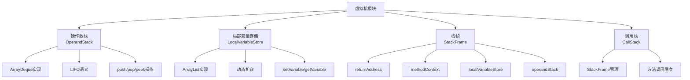

**图表来源**
- [OperandStack.java](file://src/main/java/org/jcnc/snow/vm/module/OperandStack.java#L1-L104)
- [LocalVariableStore.java](file://src/main/java/org/jcnc/snow/vm/module/LocalVariableStore.java#L1-L182)
- [StackFrame.java](file://src/main/java/org/jcnc/snow/vm/module/StackFrame.java#L1-L104)

## 操作数栈（OperandStack）详解

### 核心架构设计

操作数栈基于Java的ArrayDeque实现，提供了高效的栈式操作能力。其设计遵循虚拟机栈的基本原则，确保了操作的原子性和一致性。

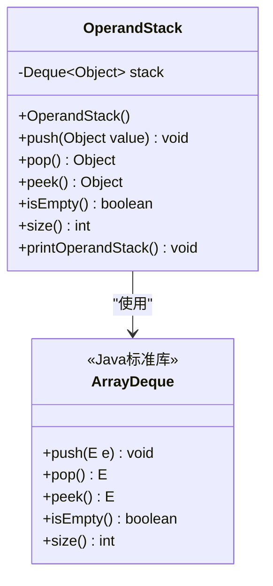

**图表来源**
- [OperandStack.java](file://src/main/java/org/jcnc/snow/vm/module/OperandStack.java#L15-L25)

### 核心操作机制

#### Push操作
Push操作将值添加到栈顶，支持任意类型的对象存储：

- **实现原理**：调用ArrayDeque的push方法
- **数据类型**：支持Object类型的所有子类
- **内存管理**：自动处理内存分配和垃圾回收
- **异常处理**：不抛出异常，依赖ArrayDeque的内部机制

#### Pop操作
Pop操作移除并返回栈顶元素：

- **实现原理**：调用ArrayDeque的pop方法
- **边界检查**：在pop之前检查栈是否为空
- **异常处理**：当栈为空时抛出IllegalStateException
- **性能特征**：O(1)时间复杂度

#### Peek操作
Peek操作返回栈顶元素但不移除：

- **实现原理**：调用ArrayDeque的peek方法
- **异常处理**：当栈为空时抛出EmptyStackException
- **应用场景**：用于查看栈顶值而不修改栈状态

#### 栈状态查询
- **isEmpty()**：检查栈是否为空
- **size()**：获取栈中元素数量
- **打印功能**：通过LoggingUtils记录栈状态

**章节来源**
- [OperandStack.java](file://src/main/java/org/jcnc/snow/vm/module/OperandStack.java#L25-L104)

### 算术运算支持

操作数栈在算术运算中发挥关键作用，作为临时值的存储区：

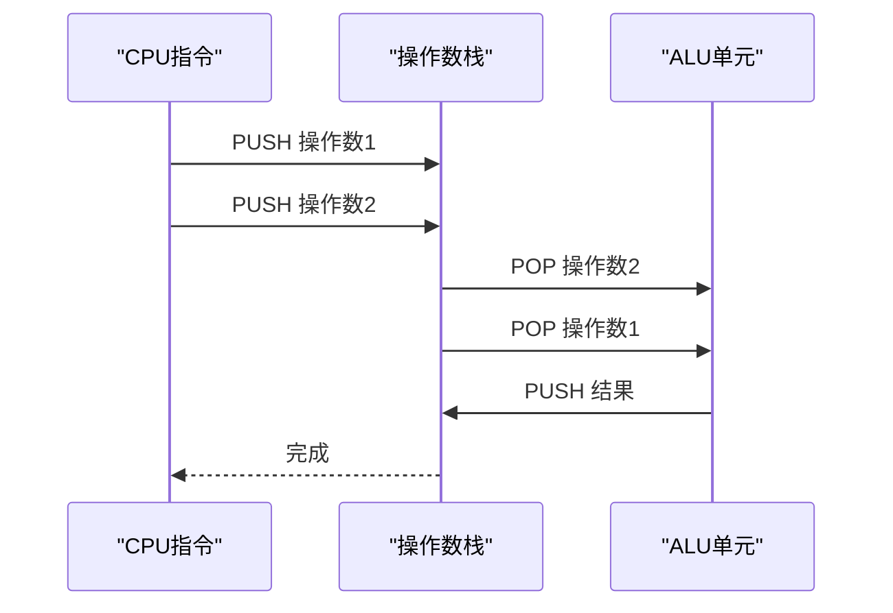

**图表来源**
- [VirtualMachineEngine.java](file://src/main/java/org/jcnc/snow/vm/engine/VirtualMachineEngine.java#L80-L120)

## 局部变量存储（LocalVariableStore）详解

### 动态扩容机制

局部变量存储采用ArrayList实现，支持动态扩容和随机访问：

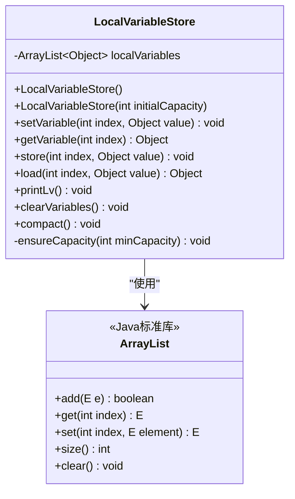

**图表来源**
- [LocalVariableStore.java](file://src/main/java/org/jcnc/snow/vm/module/LocalVariableStore.java#L25-L45)

### 核心访问方法

#### setVariable/getVariable方法
这两个方法实现了自动扩容机制：

- **setVariable(index, value)**：设置指定索引处的值
- **getVariable(index)**：获取指定索引处的值
- **自动扩容**：当索引超出当前容量时自动扩展
- **默认值**：新创建的位置默认值为null

#### store/load别名方法
为了兼容不同的指令解码器：

- **store(index, value)**：setVariable的别名
- **load(index)**：getVariable的别名
- **设计目的**：提高指令解码器的兼容性

### 扩容机制详解

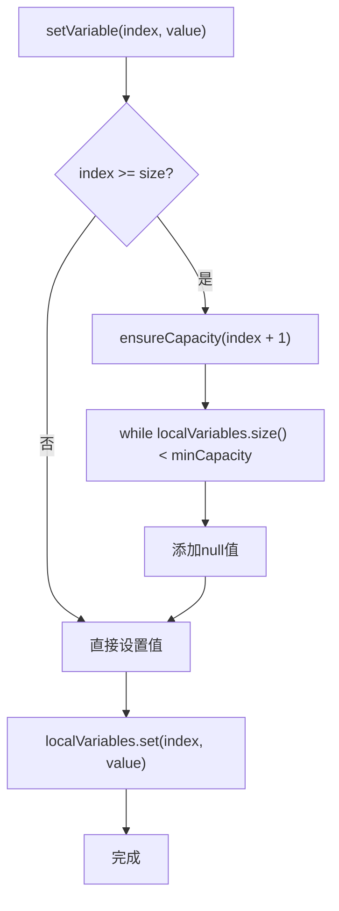

**图表来源**
- [LocalVariableStore.java](file://src/main/java/org/jcnc/snow/vm/module/LocalVariableStore.java#L60-L70)

### 调试与清理功能

#### printLv方法
提供本地变量表的调试输出：

- **格式化输出**：按索引顺序显示所有变量
- **空表检测**：当表为空时输出特殊消息
- **日志集成**：使用LoggingUtils进行日志记录

#### compact方法
清理尾部的null值槽位：

- **目标**：移除执行结束后的多余null值
- **策略**：只删除尾部的null值，保持中间非null值不变
- **时机**：通常在程序终止后调用

**章节来源**
- [LocalVariableStore.java](file://src/main/java/org/jcnc/snow/vm/module/LocalVariableStore.java#L100-L182)

## 栈帧（StackFrame）架构

### 栈帧组成结构

栈帧是方法调用的执行上下文，包含方法执行所需的所有信息：

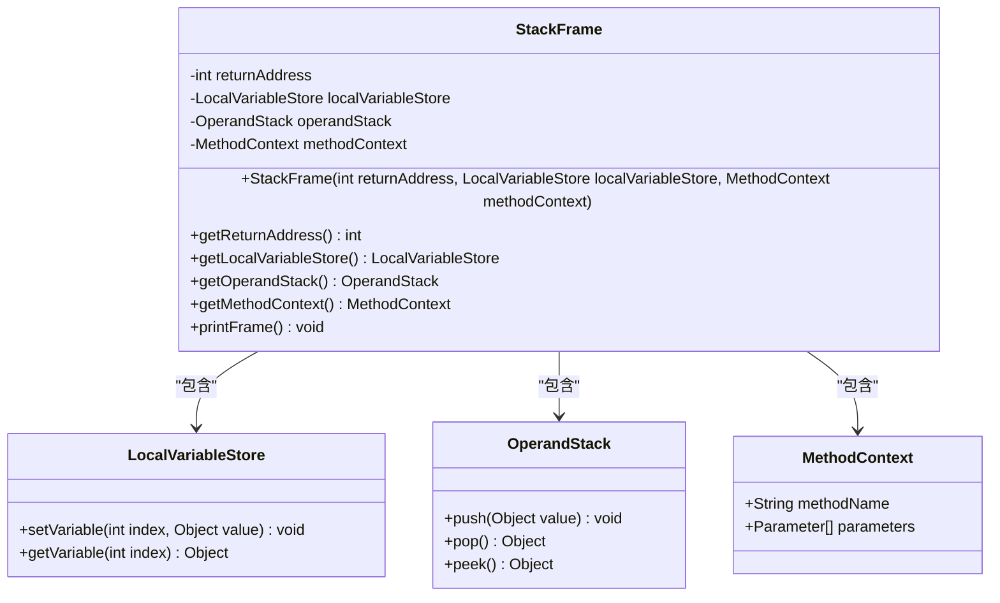

**图表来源**
- [StackFrame.java](file://src/main/java/org/jcnc/snow/vm/module/StackFrame.java#L30-L50)

### 生命周期管理

栈帧的生命周期与方法调用紧密相关：

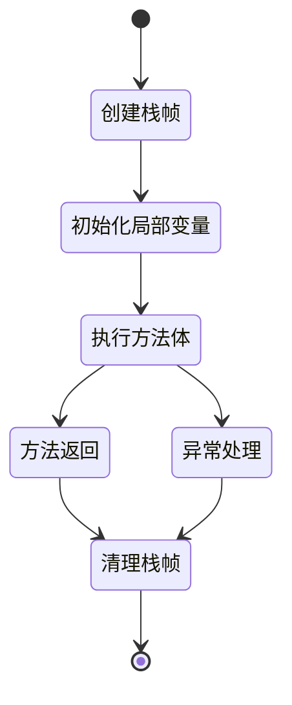

**图表来源**
- [StackFrame.java](file://src/main/java/org/jcnc/snow/vm/module/StackFrame.java#L35-L50)

**章节来源**
- [StackFrame.java](file://src/main/java/org/jcnc/snow/vm/module/StackFrame.java#L1-L104)

## 指令执行中的数据流动

### 加载指令流程

以BLoadCommand为例，展示从局部变量到操作数栈的数据流动：

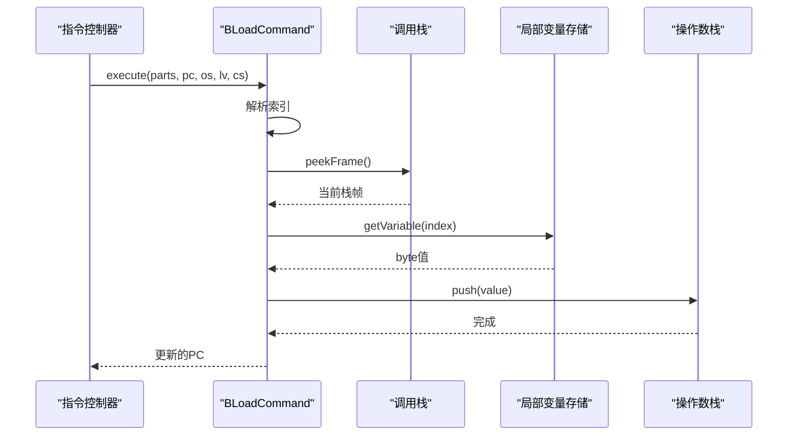

**图表来源**
- [BLoadCommand.java](file://src/main/java/org/jcnc/snow/vm/commands/type/control/byte8/BLoadCommand.java#L50-L66)

### 存储指令流程

以IStoreCommand为例，展示从操作数栈到局部变量的数据流动：

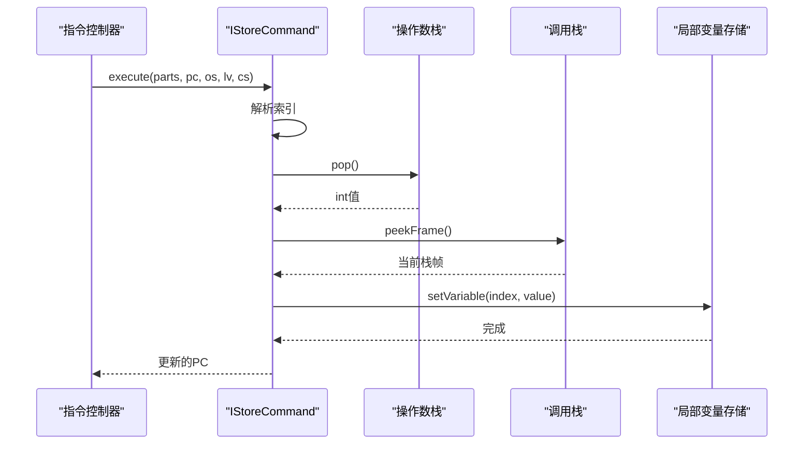

**图表来源**
- [IStoreCommand.java](file://src/main/java/org/jcnc/snow/vm/commands/type/control/int32/IStoreCommand.java#L50-L66)

### 数据类型转换

在数据流动过程中，需要处理不同类型之间的转换：

| 源类型 | 目标类型 | 转换规则 | 示例 |
|--------|----------|----------|------|
| byte | int | 有符号扩展 | 0xFF → -1 |
| int | long | 有符号扩展 | 0x0000FFFF → 0x00000000FFFFFFFF |
| float | double | 精度提升 | 单精度浮点转双精度 |
| Object | String | toString() | 对象转字符串表示 |

**章节来源**
- [BLoadCommand.java](file://src/main/java/org/jcnc/snow/vm/commands/type/control/byte8/BLoadCommand.java#L1-L67)
- [IStoreCommand.java](file://src/main/java/org/jcnc/snow/vm/commands/type/control/int32/IStoreCommand.java#L1-L67)

## 调试与监控工具

### 输出示例

#### 操作数栈调试输出
```
Operand Stack state:
[10, 20, 30, 40]
```

#### 局部变量表调试输出
```
### VM Local Variable Table:
0: 100
1: 200
2: null
3: "Hello World"
```

### 调试辅助方法

#### VirtualMachineEngine提供的调试接口

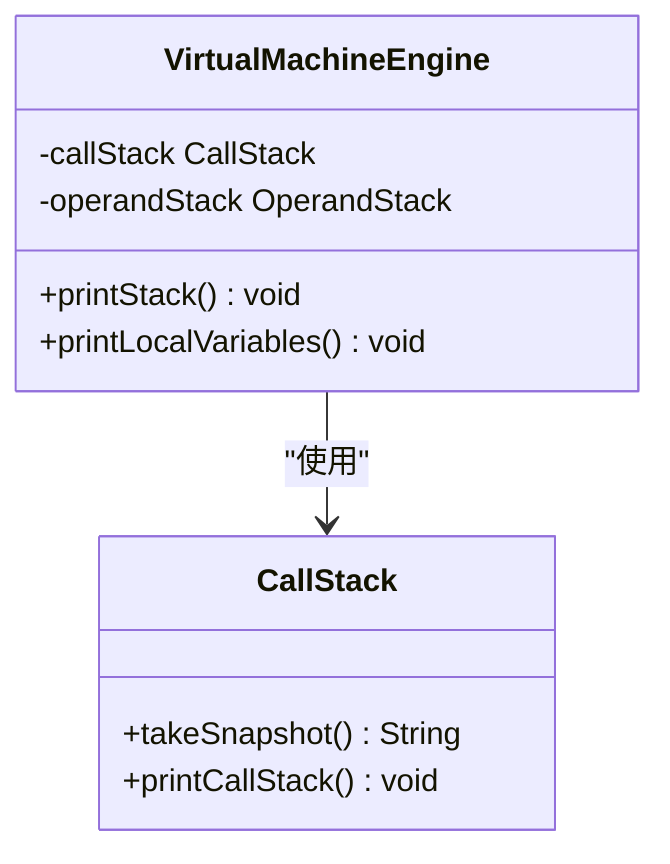

**图表来源**
- [VirtualMachineEngine.java](file://src/main/java/org/jcnc/snow/vm/engine/VirtualMachineEngine.java#L150-L190)

### 性能监控

#### 关键性能指标

| 指标 | 描述 | 监控方法 |
|------|------|----------|
| 栈深度 | 当前栈帧数量 | callStack.size() |
| 栈大小 | 操作数栈元素数量 | operandStack.size() |
| 局部变量数量 | 局部变量表长度 | localVariableStore.size() |
| 内存使用 | 对象占用内存 | JVM监控工具 |

**章节来源**
- [VirtualMachineEngine.java](file://src/main/java/org/jcnc/snow/vm/engine/VirtualMachineEngine.java#L150-L191)

## 性能特征与线程安全性

### 性能特征分析

#### 时间复杂度分析

| 操作 | 时间复杂度 | 说明 |
|------|------------|------|
| push | O(1) | 数组末尾插入，摊销常数时间 |
| pop | O(1) | 数组末尾删除，摊销常数时间 |
| peek | O(1) | 访问数组末尾元素 |
| setVariable | O(n) | 可能需要扩容和复制 |
| getVariable | O(1) | 直接数组访问 |

#### 空间复杂度分析

- **操作数栈**：O(n)，其中n是栈中元素数量
- **局部变量存储**：O(m)，其中m是最大索引+1
- **栈帧**：O(k)，其中k是局部变量数量

### 线程安全性考虑

#### 当前实现的安全性

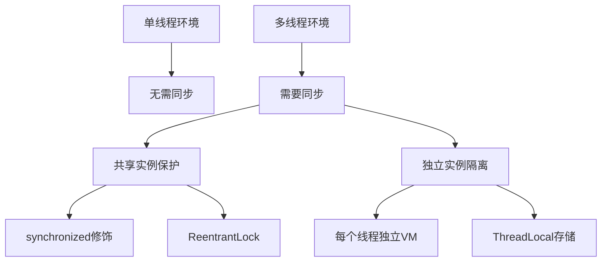

#### 推荐的线程安全策略

1. **独立实例策略**：为每个线程创建独立的虚拟机实例
2. **同步包装策略**：使用synchronized关键字保护共享实例
3. **无状态设计**：避免在组件间共享可变状态

**章节来源**
- [CallStack.java](file://src/main/java/org/jcnc/snow/vm/module/CallStack.java#L1-L82)

## 生命周期管理

### 虚拟机启动阶段

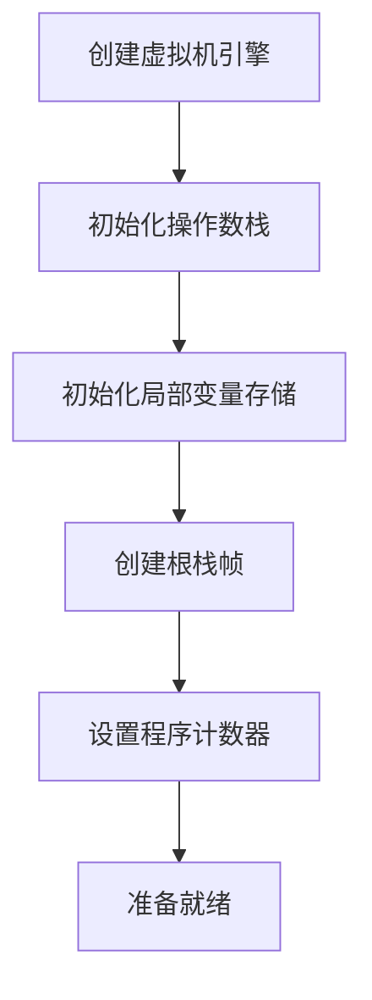

**图表来源**
- [VirtualMachineEngine.java](file://src/main/java/org/jcnc/snow/vm/engine/VirtualMachineEngine.java#L45-L60)

### 方法调用生命周期

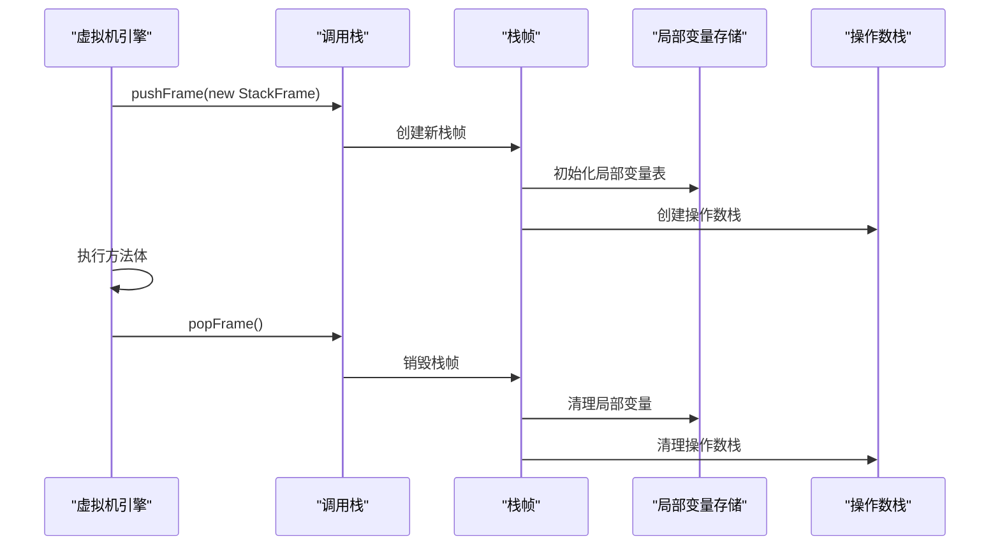

**图表来源**
- [VirtualMachineEngine.java](file://src/main/java/org/jcnc/snow/vm/engine/VirtualMachineEngine.java#L138-L150)

### 资源清理机制

#### 自动清理

- **栈帧销毁**：popFrame时自动清理
- **局部变量清理**：调用clearVariables()
- **操作数栈清理**：调用clear()

#### 手动清理

- **程序终止**：调用compact()清理null值
- **调试输出**：使用printLv()查看状态
- **内存优化**：定期清理无用数据

**章节来源**
- [VirtualMachineEngine.java](file://src/main/java/org/jcnc/snow/vm/engine/VirtualMachineEngine.java#L170-L191)

## 最佳实践与故障排除

### 性能优化建议

#### 操作数栈优化

1. **预分配容量**：对于已知大小的栈，预分配适当容量
2. **避免频繁扩容**：减少不必要的push/pop操作
3. **及时清理**：方法调用完成后及时清理栈空间

#### 局部变量存储优化

1. **合理初始化**：设置合适的初始容量
2. **避免稀疏存储**：不要创建大量未使用的高索引位置
3. **使用别名方法**：根据具体场景选择store/load或setVariable/getVariable

### 常见问题诊断

#### 栈溢出问题

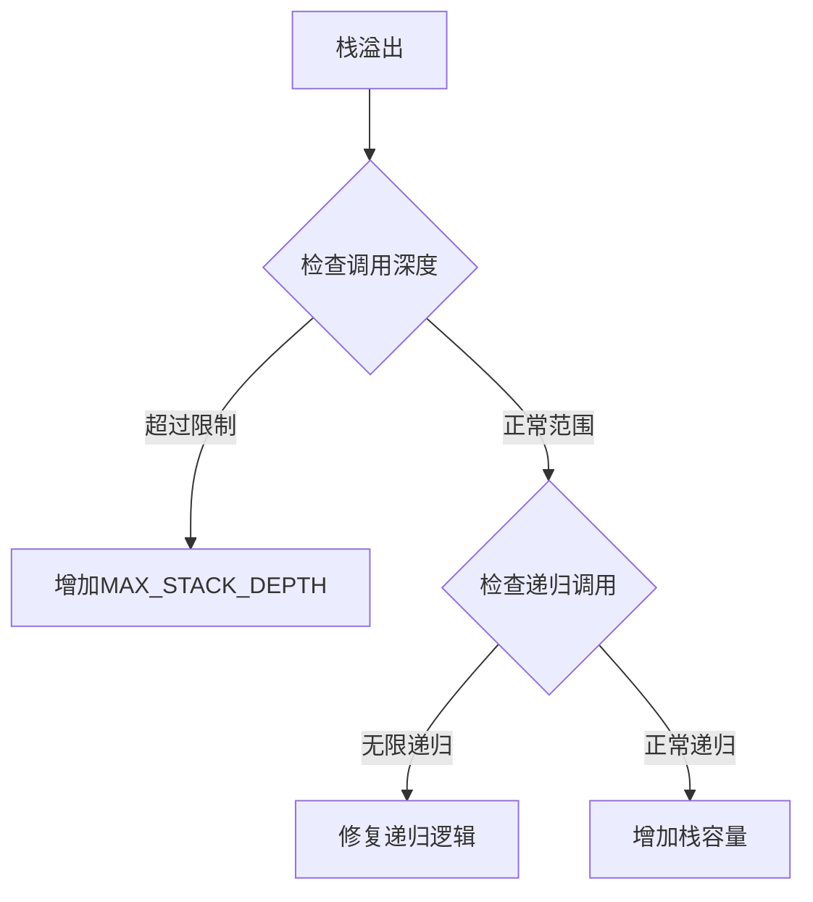

#### 内存泄漏排查

1. **检查栈帧清理**：确保每次方法调用都正确清理栈帧
2. **监控局部变量**：注意长时间存在的大对象引用
3. **分析对象引用链**：使用JVM工具分析内存使用情况

### 调试技巧

#### 使用调试输出

```java
// 在关键位置添加调试输出
virtualMachineEngine.printStack();
virtualMachineEngine.printLocalVariables();
```

#### 性能分析

1. **使用JProfiler**：监控内存使用和GC行为
2. **使用VisualVM**：分析线程状态和堆内存
3. **自定义计数器**：记录关键操作的执行次数

### 故障排除清单

- [ ] 检查栈深度是否超过限制
- [ ] 验证局部变量索引是否越界
- [ ] 确认操作数栈是否平衡
- [ ] 检查异常处理是否正确
- [ ] 验证资源清理是否完整

通过遵循这些最佳实践和故障排除指南，可以确保Snow虚拟机的操作数栈与局部变量存储组件稳定、高效地运行。