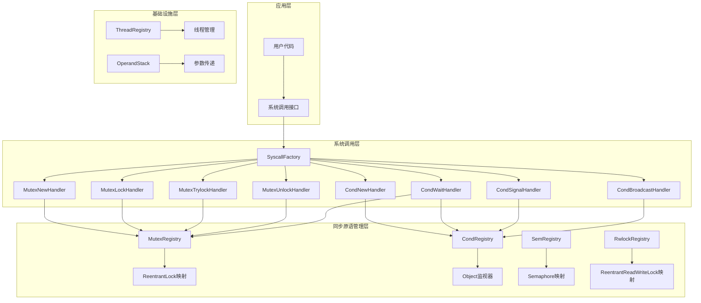
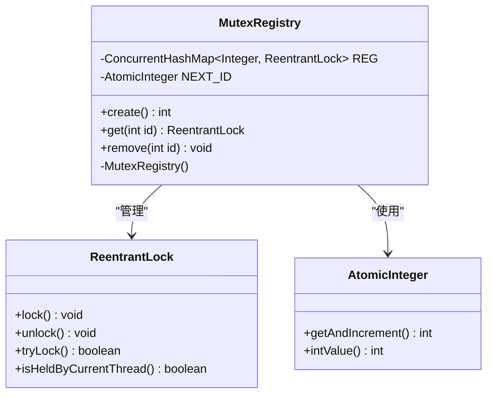
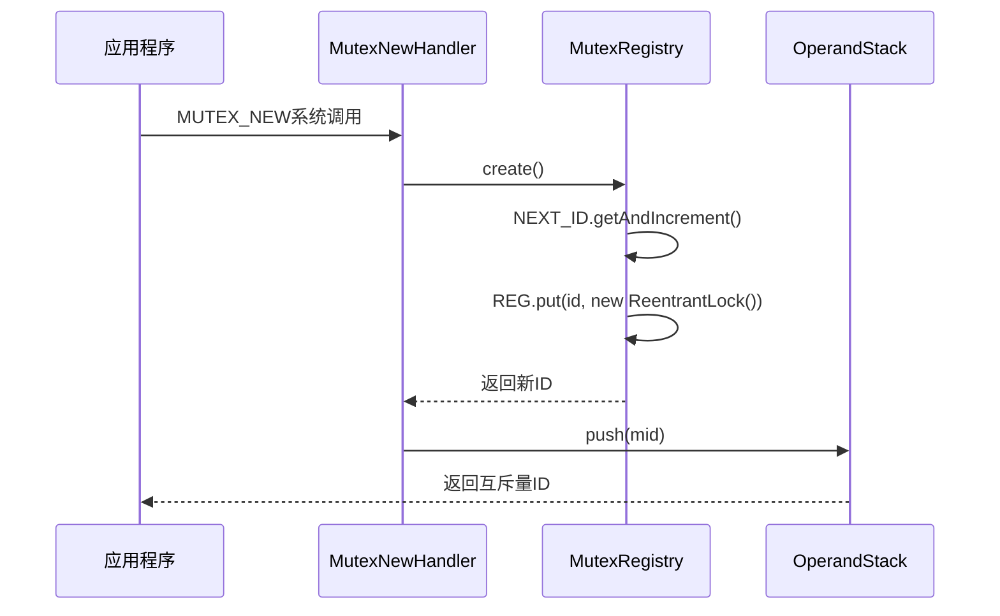
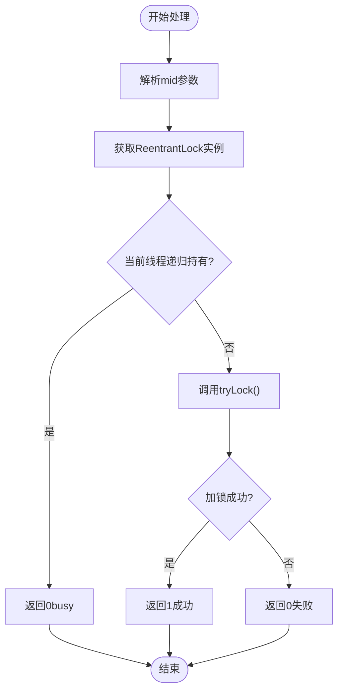
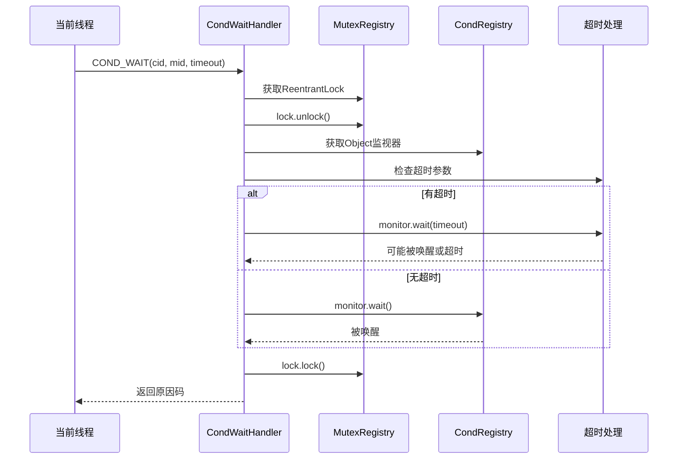
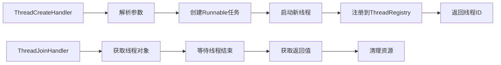
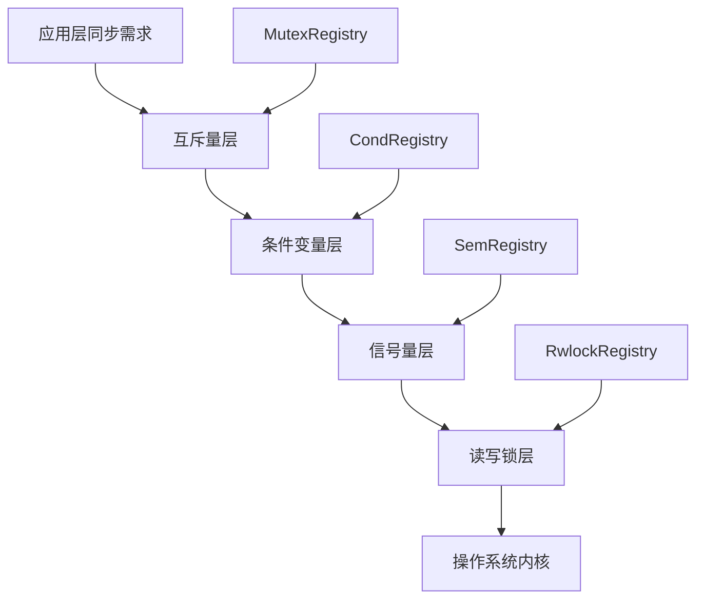

# 同步原语管理

<cite>
**本文档引用的文件**
- [MutexRegistry.java](file://src/main/java/org/jcnc/snow/vm/io/MutexRegistry.java)
- [MutexNewHandler.java](file://src/main/java/org/jcnc/snow/vm/commands/system/control/sync/MutexNewHandler.java)
- [MutexLockHandler.java](file://src/main/java/org/jcnc/snow/vm/commands/system/control/sync/MutexLockHandler.java)
- [MutexTrylockHandler.java](file://src/main/java/org/jcnc/snow/vm/commands/system/control/sync/MutexTrylockHandler.java)
- [MutexUnlockHandler.java](file://src/main/java/org/jcnc/snow/vm/commands/system/control/sync/MutexUnlockHandler.java)
- [CondRegistry.java](file://src/main/java/org/jcnc/snow/vm/io/CondRegistry.java)
- [CondNewHandler.java](file://src/main/java/org/jcnc/snow/vm/commands/system/control/sync/CondNewHandler.java)
- [CondWaitHandler.java](file://src/main/java/org/jcnc/snow/vm/commands/system/control/sync/CondWaitHandler.java)
- [CondSignalHandler.java](file://src/main/java/org/jcnc/snow/vm/commands/system/control/sync/CondSignalHandler.java)
- [CondBroadcastHandler.java](file://src/main/java/org/jcnc/snow/vm/commands/system/control/sync/CondBroadcastHandler.java)
- [SemRegistry.java](file://src/main/java/org/jcnc/snow/vm/io/SemRegistry.java)
- [RwlockRegistry.java](file://src/main/java/org/jcnc/snow/vm/io/RwlockRegistry.java)
- [ThreadRegistry.java](file://src/main/java/org/jcnc/snow/vm/io/ThreadRegistry.java)
- [SyscallFactory.java](file://src/main/java/org/jcnc/snow/vm/commands/system/control/SyscallFactory.java)
- [VirtualMachineEngine.java](file://src/main/java/org/jcnc/snow/vm/engine/VirtualMachineEngine.java)
- [SyscallOpCode.java](file://src/main/java/org/jcnc/snow/vm/engine/SyscallOpCode.java)
- [OperandStack.java](file://src/main/java/org/jcnc/snow/vm/module/OperandStack.java)
</cite>

## 目录
1. [引言](#引言)
2. [系统架构概览](#系统架构概览)
3. [MutexRegistry核心组件](#mutexregistry核心组件)
4. [系统调用处理器详解](#系统调用处理器详解)
5. [条件变量管理](#条件变量管理)
6. [信号量与读写锁](#信号量与读写锁)
7. [线程管理集成](#线程管理集成)
8. [并发控制机制](#并发控制机制)
9. [死锁预防策略](#死锁预防策略)
10. [性能优化考虑](#性能优化考虑)
11. [最佳实践指南](#最佳实践指南)
12. [总结](#总结)

## 引言

Snow虚拟机的同步原语管理系统为多线程环境提供了完整的并发控制机制。该系统通过MutexRegistry为核心，集成了互斥锁、条件变量、信号量和读写锁等多种同步原语，为开发者提供了丰富的并发编程工具。本文档深入解析这些组件的设计原理、实现机制和使用模式，为开发者提供全面的并发编程指导。

## 系统架构概览

Snow虚拟机的同步原语管理系统采用分层架构设计，主要包含以下核心层次：



**图表来源**
- [SyscallFactory.java](file://src/main/java/org/jcnc/snow/vm/commands/system/control/SyscallFactory.java#L94-L115)
- [MutexRegistry.java](file://src/main/java/org/jcnc/snow/vm/io/MutexRegistry.java#L1-L86)
- [CondRegistry.java](file://src/main/java/org/jcnc/snow/vm/io/CondRegistry.java#L1-L61)

## MutexRegistry核心组件

### 设计理念

MutexRegistry是Snow虚拟机同步原语系统的核心组件，采用工具类设计模式，提供互斥量ID与ReentrantLock对象之间的映射管理。其设计遵循以下原则：

- **线程安全**：基于ConcurrentHashMap和AtomicInteger实现完全线程安全
- **高效分配**：使用原子计数器进行ID自增分配
- **资源隔离**：VM级别的互斥量管理，避免与宿主系统冲突
- **简洁接口**：提供create、get、remove三个核心方法

### 核心数据结构



**图表来源**
- [MutexRegistry.java](file://src/main/java/org/jcnc/snow/vm/io/MutexRegistry.java#L30-L86)

### ID分配策略

NEXT_ID原子计数器采用以下策略进行ID分配：

1. **初始值设定**：从1开始，避免与0或其他特殊值冲突
2. **原子性保证**：使用getAndIncrement确保线程安全的自增操作
3. **唯一性保障**：每次调用create方法都会获得新的唯一ID
4. **资源回收**：通过remove方法可以释放ID空间

### 线程安全特性

REG并发哈希表的线程安全特性体现在：

- **无锁读取**：get操作使用ConcurrentHashMap的线程安全读取
- **原子写入**：put和remove操作具有原子性
- **内存可见性**：JMM保证多线程间的内存可见性
- **扩容安全**：ConcurrentHashMap的并发扩容机制

**章节来源**
- [MutexRegistry.java](file://src/main/java/org/jcnc/snow/vm/io/MutexRegistry.java#L30-L86)

## 系统调用处理器详解

### 系统调用映射关系

Snow虚拟机通过SyscallFactory统一管理所有系统调用，同步原语相关的系统调用包括：

| 系统调用码 | 功能描述 | 处理器类 |
|-----------|----------|----------|
| 0x1600 | 创建互斥量 | MutexNewHandler |
| 0x1601 | 加锁互斥量 | MutexLockHandler |
| 0x1602 | 非阻塞加锁 | MutexTrylockHandler |
| 0x1603 | 解锁互斥量 | MutexUnlockHandler |
| 0x1604 | 创建条件变量 | CondNewHandler |
| 0x1605 | 等待条件变量 | CondWaitHandler |
| 0x1606 | 唤醒单个线程 | CondSignalHandler |
| 0x1607 | 唤醒所有线程 | CondBroadcastHandler |

### 互斥量创建流程



**图表来源**
- [MutexNewHandler.java](file://src/main/java/org/jcnc/snow/vm/commands/system/control/sync/MutexNewHandler.java#L28-L32)
- [MutexRegistry.java](file://src/main/java/org/jcnc/snow/vm/io/MutexRegistry.java#L47-L51)

### 互斥量锁定机制

互斥量锁定采用阻塞式加锁策略，支持以下特性：

- **参数解析**：优先从操作数栈读取，支持从局部变量表备用
- **异常处理**：严格的参数类型检查和有效性验证
- **锁获取**：调用ReentrantLock的lock()方法进行阻塞式加锁
- **返回约定**：成功返回0，表示操作成功

### 非阻塞加锁实现

MutexTrylockHandler实现了POSIX语义的非阻塞加锁：



**图表来源**
- [MutexTrylockHandler.java](file://src/main/java/org/jcnc/snow/vm/commands/system/control/sync/MutexTrylockHandler.java#L65-L83)

**章节来源**
- [MutexNewHandler.java](file://src/main/java/org/jcnc/snow/vm/commands/system/control/sync/MutexNewHandler.java#L1-L37)
- [MutexLockHandler.java](file://src/main/java/org/jcnc/snow/vm/commands/system/control/sync/MutexLockHandler.java#L1-L67)
- [MutexTrylockHandler.java](file://src/main/java/org/jcnc/snow/vm/commands/system/control/sync/MutexTrylockHandler.java#L1-L83)
- [MutexUnlockHandler.java](file://src/main/java/org/jcnc/snow/vm/commands/system/control/sync/MutexUnlockHandler.java#L1-L63)

## 条件变量管理

### CondRegistry设计原理

CondRegistry为条件变量提供独立的ID管理和监视器对象维护：

- **独立监控器**：每个条件变量对应一个Object实例作为监视器
- **兼容性设计**：不依赖Java的Condition接口，兼容多种互斥量
- **灵活等待**：支持带超时和无超时的等待机制

### 条件变量等待机制

CondWaitHandler实现了复杂的条件等待逻辑：



**图表来源**
- [CondWaitHandler.java](file://src/main/java/org/jcnc/snow/vm/commands/system/control/sync/CondWaitHandler.java#L33-L89)

### 唤醒机制对比

| 唤醒方式 | 系统调用码 | 功能描述 | 使用场景 |
|---------|-----------|----------|----------|
| 单个唤醒 | COND_SIGNAL (0x1606) | 唤醒一个等待线程 | 精确控制 |
| 批量唤醒 | COND_BROADCAST (0x1607) | 唤醒所有等待线程 | 批处理场景 |

**章节来源**
- [CondRegistry.java](file://src/main/java/org/jcnc/snow/vm/io/CondRegistry.java#L1-L61)
- [CondNewHandler.java](file://src/main/java/org/jcnc/snow/vm/commands/system/control/sync/CondNewHandler.java#L1-L37)
- [CondWaitHandler.java](file://src/main/java/org/jcnc/snow/vm/commands/system/control/sync/CondWaitHandler.java#L1-L89)
- [CondSignalHandler.java](file://src/main/java/org/jcnc/snow/vm/commands/system/control/sync/CondSignalHandler.java#L1-L48)
- [CondBroadcastHandler.java](file://src/main/java/org/jcnc/snow/vm/commands/system/control/sync/CondBroadcastHandler.java#L1-L48)

## 信号量与读写锁

### 信号量管理

SemRegistry提供了信号量的完整生命周期管理：

- **初始化控制**：严格检查初始值的有效性（≥0）
- **公平性选择**：支持公平和非公平两种模式
- **超时等待**：支持带超时的等待机制
- **中断处理**：正确处理InterruptedException

### 读写锁机制

RwlockRegistry实现了读写锁的高级并发控制：

- **读写分离**：允许多个读者同时访问，但写者独占
- **优先级控制**：可配置读者优先或写者优先
- **重入支持**：支持同一线程的重入读写操作
- **状态查询**：提供详细的锁状态信息

**章节来源**
- [SemRegistry.java](file://src/main/java/org/jcnc/snow/vm/io/SemRegistry.java#L1-L84)
- [RwlockRegistry.java](file://src/main/java/org/jcnc/snow/vm/io/RwlockRegistry.java#L1-L84)

## 线程管理集成

### ThreadRegistry功能

ThreadRegistry负责VM内部线程的统一管理：

- **线程注册**：记录线程ID与Thread对象的映射
- **返回值缓存**：存储线程执行结果，支持null值处理
- **生命周期管理**：自动清理已终止线程的资源
- **线程间通信**：为同步原语提供线程标识支持

### 线程创建与管理



**图表来源**
- [ThreadRegistry.java](file://src/main/java/org/jcnc/snow/vm/io/ThreadRegistry.java#L1-L83)

**章节来源**
- [ThreadRegistry.java](file://src/main/java/org/jcnc/snow/vm/io/ThreadRegistry.java#L1-L83)

## 并发控制机制

### 锁的层次结构

Snow虚拟机的同步原语形成了清晰的层次结构：



### 并发模式支持

系统支持以下主要并发模式：

- **生产者-消费者模式**：通过条件变量协调
- **资源池模式**：通过信号量控制资源访问
- **读写分离模式**：通过读写锁实现
- **互斥访问模式**：通过互斥量保证

### 性能特征分析

| 原语类型 | 获取开销 | 释放开销 | 适用场景 |
|---------|----------|----------|----------|
| 互斥量 | 中等 | 中等 | 一般保护 |
| 条件变量 | 高 | 高 | 等待协调 |
| 信号量 | 低 | 低 | 资源计数 |
| 读写锁 | 高 | 高 | 读多写少 |

## 死锁预防策略

### 死锁检测机制

虽然Snow虚拟机没有内置的死锁检测器，但通过以下设计减少了死锁风险：

- **单一锁原则**：尽量避免同时持有多个锁
- **固定顺序**：建议按固定顺序获取多个锁
- **超时机制**：非阻塞操作提供超时选项
- **异常处理**：完善的异常传播机制

### 最佳实践建议

1. **锁粒度控制**：尽可能使用细粒度锁
2. **锁顺序一致性**：建立全局的锁获取顺序
3. **超时设置**：在可能的地方设置超时
4. **资源清理**：确保异常情况下的资源释放

### 条件变量使用注意事项

- **虚假唤醒防护**：在while循环中检查条件
- **互斥量保护**：等待期间释放互斥量
- **超时处理**：合理设置等待超时时间
- **中断处理**：正确处理线程中断

## 性能优化考虑

### 内存优化策略

- **对象复用**：ReentrantLock对象的复用
- **弱引用**：避免不必要的强引用
- **垃圾回收友好**：及时清理不再使用的同步原语

### CPU优化技术

- **无锁算法**：在可能的情况下使用原子操作
- **批量操作**：减少系统调用次数
- **缓存友好**：优化数据结构布局

### 并发度优化

- **锁分离**：读写锁分离读写操作
- **分段锁**：大容量集合的分段实现
- **自旋锁**：短时间等待使用自旋

## 最佳实践指南

### 互斥量使用模式

```java
// 推荐的互斥量使用模式
int mid = MutexNewHandler.create();
try {
    MutexLockHandler.lock(mid);
    // 临界区代码
} finally {
    MutexUnlockHandler.unlock(mid);
}
```

### 条件变量协调模式

```java
// 生产者-消费者模式
int mid = MutexNewHandler.create();
int cid = CondNewHandler.create();

// 生产者线程
MutexLockHandler.lock(mid);
try {
    // 生产数据
    CondSignalHandler.signal(cid);
} finally {
    MutexUnlockHandler.unlock(mid);
}

// 消费者线程  
MutexLockHandler.lock(mid);
try {
    while (!hasData()) {
        CondWaitHandler.wait(cid, mid, timeout);
    }
    // 消费数据
} finally {
    MutexUnlockHandler.unlock(mid);
}
```

### 错误处理策略

- **参数验证**：严格检查输入参数的有效性
- **异常传播**：保持异常的原始堆栈信息
- **资源清理**：确保异常情况下的资源释放
- **日志记录**：记录关键的同步操作

### 性能监控指标

- **锁竞争率**：测量锁的争用程度
- **等待时间**：监控线程的等待时间分布
- **吞吐量**：测量系统的整体处理能力
- **资源利用率**：监控同步原语的使用效率

## 总结

Snow虚拟机的同步原语管理系统通过精心设计的架构，为多线程应用程序提供了完整而高效的并发控制机制。MutexRegistry作为核心组件，通过ReentrantLock与ID映射提供了可靠的互斥访问控制；条件变量系统实现了灵活的线程协调机制；信号量和读写锁扩展了系统的并发模式支持。

该系统的主要优势包括：

- **完整性**：覆盖了主流的同步原语类型
- **线程安全**：基于现代并发工具的安全实现
- **高性能**：优化的数据结构和算法
- **易用性**：简洁的API设计和良好的错误处理

对于开发者而言，理解这些同步原语的工作原理和最佳实践，能够帮助构建更加健壮和高效的并发应用程序。在实际使用中，应当根据具体的应用场景选择合适的同步原语，并遵循相应的设计原则和编码规范。