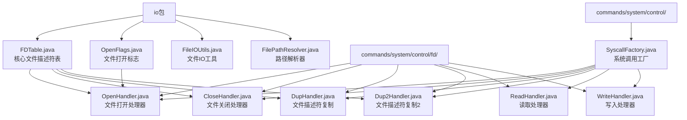
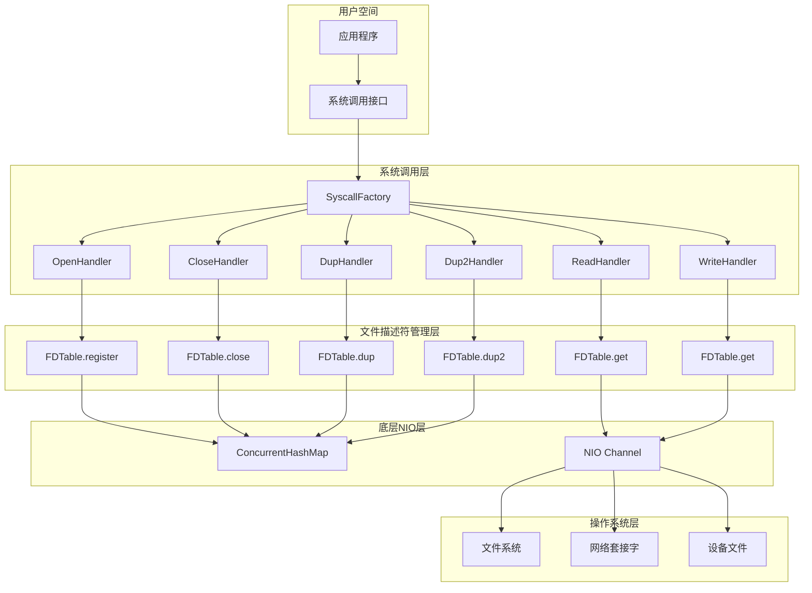
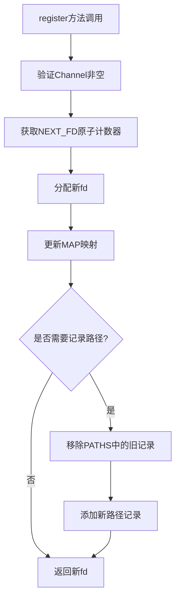
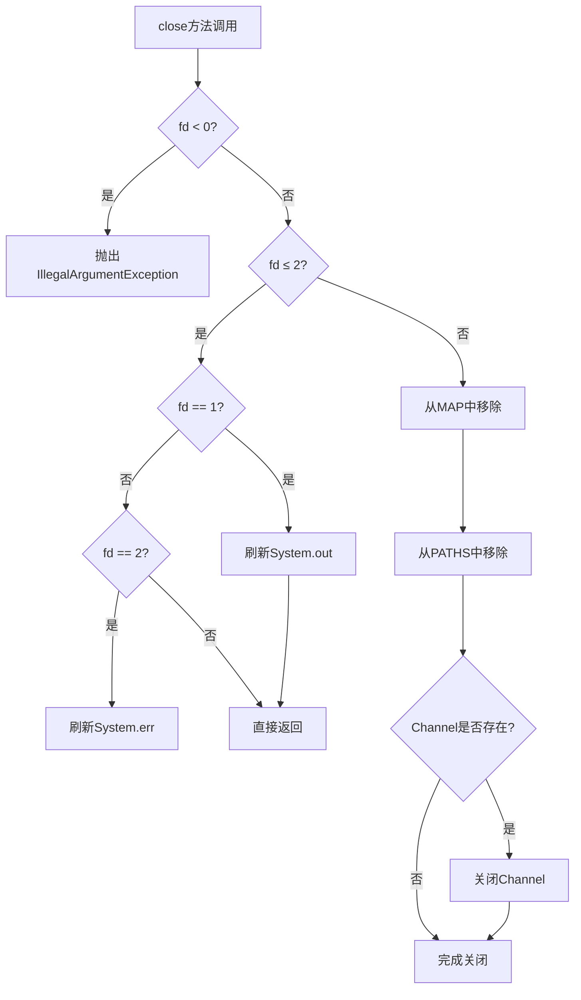
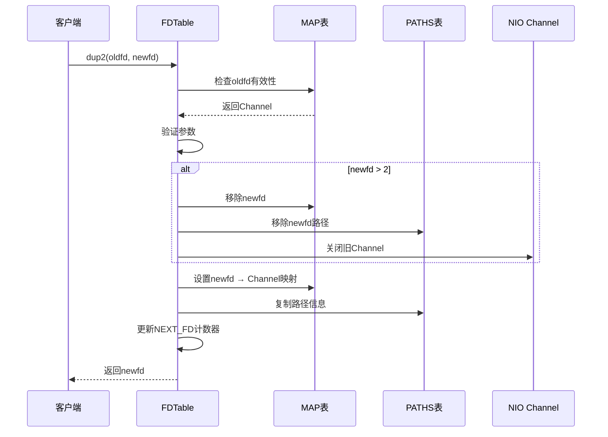
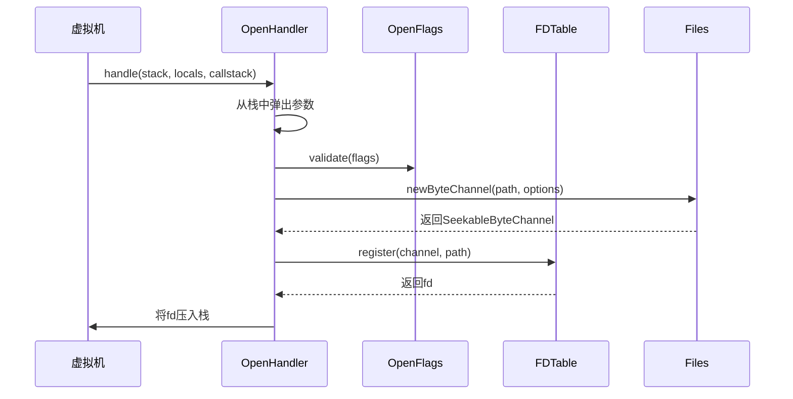
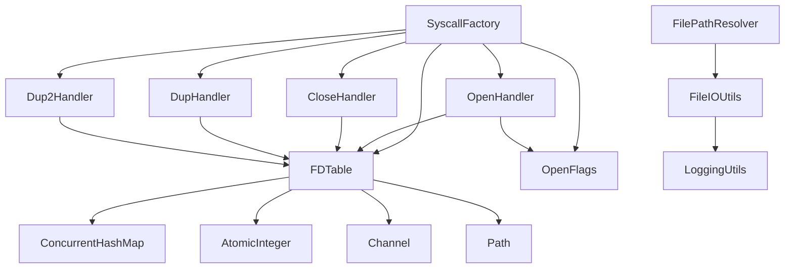

# 文件描述符管理

<cite>
**本文档引用的文件**
- [FDTable.java](file://src/main/java/org/jcnc/snow/vm/io/FDTable.java)
- [OpenHandler.java](file://src/main/java/org/jcnc/snow/vm/commands/system/control/fd/OpenHandler.java)
- [CloseHandler.java](file://src/main/java/org/jcnc/snow/vm/commands/system/control/fd/CloseHandler.java)
- [DupHandler.java](file://src/main/java/org/jcnc/snow/vm/commands/system/control/fd/DupHandler.java)
- [Dup2Handler.java](file://src/main/java/org/jcnc/snow/vm/commands/system/control/fd/Dup2Handler.java)
- [ReadHandler.java](file://src/main/java/org/jcnc/snow/vm/commands/system/control/fd/ReadHandler.java)
- [OpenFlags.java](file://src/main/java/org/jcnc/snow/vm/io/OpenFlags.java)
- [SyscallFactory.java](file://src/main/java/org/jcnc/snow/vm/commands/system/control/SyscallFactory.java)
</cite>

## 目录
1. [简介](#简介)
2. [项目结构](#项目结构)
3. [核心组件](#核心组件)
4. [架构概览](#架构概览)
5. [详细组件分析](#详细组件分析)
6. [依赖关系分析](#依赖关系分析)
7. [性能考虑](#性能考虑)
8. [故障排除指南](#故障排除指南)
9. [结论](#结论)

## 简介

Snow虚拟机的文件描述符管理系统是一个高度优化的I/O资源管理框架，负责维护全局文件描述符（fd）与NIO Channel之间的映射关系。该系统采用线程安全的设计模式，支持从标准输入输出（fd 0/1/2）到动态分配文件描述符（≥3）的完整生命周期管理。

系统的核心设计理念是提供类似于POSIX文件描述符语义的同时，充分利用Java NIO的高性能特性。通过精心设计的数据结构和算法，实现了高效的资源分配、查找、复制和回收机制。

## 项目结构

Snow虚拟机的文件描述符管理模块位于`src/main/java/org/jcnc/snow/vm/io/`目录下，主要包含以下核心文件：



**图表来源**
- [FDTable.java](file://src/main/java/org/jcnc/snow/vm/io/FDTable.java#L1-L187)
- [OpenHandler.java](file://src/main/java/org/jcnc/snow/vm/commands/system/control/fd/OpenHandler.java#L1-L70)
- [SyscallFactory.java](file://src/main/java/org/jcnc/snow/vm/commands/system/control/SyscallFactory.java#L21-L50)

**章节来源**
- [FDTable.java](file://src/main/java/org/jcnc/snow/vm/io/FDTable.java#L1-L187)
- [SyscallFactory.java](file://src/main/java/org/jcnc/snow/vm/commands/system/control/SyscallFactory.java#L1-L154)

## 核心组件

### FDTable - 全局文件描述符表

FDTable是整个文件描述符管理系统的核心组件，采用单例模式设计，维护着全局的文件描述符映射关系。该类提供了完整的文件描述符生命周期管理功能。

#### 主要数据结构

系统使用三个核心数据结构协同工作：

1. **MAP ConcurrentHashMap** - fd到Channel的映射表
2. **PATHS ConcurrentHashMap** - fd到文件路径的元信息映射
3. **NEXT_FD AtomicInteger** - 下一个可用文件描述符的计数器

#### 标准文件描述符初始化

系统在静态初始化块中预分配标准I/O文件描述符：

- fd 0: 标准输入（ReadableByteChannel）
- fd 1: 标准输出（WritableByteChannel）
- fd 2: 标准错误（WritableByteChannel）

**章节来源**
- [FDTable.java](file://src/main/java/org/jcnc/snow/vm/io/FDTable.java#L30-L45)

### OpenFlags - 文件打开标志

OpenFlags类定义了与POSIX标准兼容的文件打开标志，提供了标志位验证和转换功能。

#### 支持的标志位

| 标志位 | 值 | 描述 |
|--------|-----|------|
| O_RDONLY | 0x0 | 只读访问 |
| O_WRONLY | 0x1 | 只写访问 |
| O_RDWR | 0x2 | 读写访问 |
| O_CREAT | 0x40 | 文件不存在时创建 |
| O_EXCL | 0x80 | 仅当文件不存在时创建 |
| O_TRUNC | 0x200 | 打开时截断文件 |
| O_APPEND | 0x400 | 追加写模式 |

**章节来源**
- [OpenFlags.java](file://src/main/java/org/jcnc/snow/vm/io/OpenFlags.java#L15-L40)

## 架构概览

Snow虚拟机的文件描述符管理系统采用分层架构设计，从底层的NIO通道到高层的系统调用接口，形成了完整的I/O处理链路。



**图表来源**
- [SyscallFactory.java](file://src/main/java/org/jcnc/snow/vm/commands/system/control/SyscallFactory.java#L21-L50)
- [FDTable.java](file://src/main/java/org/jcnc/snow/vm/io/FDTable.java#L47-L187)

## 详细组件分析

### FDTable核心方法详解

#### register方法 - 文件描述符注册

register方法负责将新的NIO Channel注册到文件描述符表中，支持两种注册模式：

1. **简单注册** - 仅注册Channel，不记录路径信息
2. **带路径注册** - 注册Channel并保存源文件路径



**图表来源**
- [FDTable.java](file://src/main/java/org/jcnc/snow/vm/io/FDTable.java#L47-L60)

#### close方法 - 文件描述符关闭

close方法实现了智能的资源关闭策略，对不同类型的文件描述符采用不同的处理方式：



**图表来源**
- [FDTable.java](file://src/main/java/org/jcnc/snow/vm/io/FDTable.java#L85-L105)

#### dup和dup2方法 - 文件描述符复制

dup和dup2方法实现了文件描述符的复制功能，支持不同的复制策略：

**dup方法特点：**
- 创建新的文件描述符指向相同的Channel
- 不会覆盖已存在的文件描述符
- 保留原始文件描述符的所有属性

**dup2方法特点：**
- 将旧文件描述符复制到指定的新文件描述符
- 如果目标文件描述符已存在，则先关闭再复制
- 自动处理资源回收和NEXT_FD计数器更新



**图表来源**
- [FDTable.java](file://src/main/java/org/jcnc/snow/vm/io/FDTable.java#L125-L187)

**章节来源**
- [FDTable.java](file://src/main/java/org/jcnc/snow/vm/io/FDTable.java#L47-L187)

### 系统调用处理器分析

#### OpenHandler - 文件打开处理器

OpenHandler实现了OPEN系统调用，负责根据指定的文件路径和打开标志创建新的文件描述符。



**图表来源**
- [OpenHandler.java](file://src/main/java/org/jcnc/snow/vm/commands/system/control/fd/OpenHandler.java#L35-L69)

#### CloseHandler - 文件关闭处理器

CloseHandler实现了CLOSE系统调用，负责关闭指定的文件描述符并释放相关资源。

**章节来源**
- [OpenHandler.java](file://src/main/java/org/jcnc/snow/vm/commands/system/control/fd/OpenHandler.java#L35-L69)
- [CloseHandler.java](file://src/main/java/org/jcnc/snow/vm/commands/system/control/fd/CloseHandler.java#L25-L48)

### 线程安全设计分析

#### 原子计数器NEXT_FD

NEXT_FD使用AtomicInteger确保文件描述符分配的线程安全性：

```java
private static final AtomicInteger NEXT_FD = new AtomicInteger(3);
```

这种设计保证了：
- 多线程环境下文件描述符的唯一性
- 高效的无锁分配机制
- 自动递增的连续性

#### 并发哈希表MAP和PATHS

MAP和PATHS使用ConcurrentHashMap确保并发访问的安全性：

- **MAP** - fd到Channel的映射，支持高并发读写
- **PATHS** - fd到文件路径的映射，支持高效的路径查询

#### 标准IO的特殊处理

对于fd ≤ 2的标准I/O文件描述符，系统采用特殊的处理策略：

- **只刷新不关闭** - 对于标准输出和标准错误，仅执行flush操作而不关闭底层流
- **资源保护** - 防止意外关闭JVM的标准I/O流
- **性能优化** - 避免不必要的I/O操作

**章节来源**
- [FDTable.java](file://src/main/java/org/jcnc/snow/vm/io/FDTable.java#L30-L45)
- [FDTable.java](file://src/main/java/org/jcnc/snow/vm/io/FDTable.java#L85-L105)

## 依赖关系分析

Snow虚拟机的文件描述符管理系统具有清晰的依赖层次结构：



**图表来源**
- [SyscallFactory.java](file://src/main/java/org/jcnc/snow/vm/commands/system/control/SyscallFactory.java#L21-L50)
- [FDTable.java](file://src/main/java/org/jcnc/snow/vm/io/FDTable.java#L1-L15)

### 核心依赖关系

1. **系统调用工厂依赖** - SyscallFactory统一管理所有文件描述符相关的系统调用处理器
2. **标志验证依赖** - OpenFlags提供文件打开标志的验证和转换功能
3. **底层通道依赖** - FDTable依赖Java NIO的Channel和Path API
4. **并发控制依赖** - 使用JUC包提供的并发工具保证线程安全

**章节来源**
- [SyscallFactory.java](file://src/main/java/org/jcnc/snow/vm/commands/system/control/SyscallFactory.java#L21-L50)

## 性能考虑

### 内存使用优化

1. **延迟初始化** - 标准I/O文件描述符在静态初始化时一次性分配
2. **弱引用策略** - 对于临时文件描述符，及时清理不再使用的映射
3. **内存池化** - 复用ByteBuffer对象减少GC压力

### 并发性能优化

1. **无锁设计** - 使用原子操作和并发集合避免锁竞争
2. **细粒度同步** - 只在必要时进行同步操作
3. **读写分离** - 读多写少场景下的性能优化

### I/O性能优化

1. **缓冲策略** - 使用BufferedInputStream和BufferedOutputStream
2. **异步I/O** - 支持非阻塞的NIO通道操作
3. **连接复用** - 通过文件描述符复制实现资源复用

## 故障排除指南

### 常见问题及解决方案

#### 文件描述符泄漏

**症状**：程序运行一段时间后出现"Too many open files"错误
**原因**：文件描述符被分配但未正确关闭
**解决方案**：
1. 检查所有文件操作是否都有对应的关闭调用
2. 使用try-with-resources语句确保资源释放
3. 定期监控文件描述符使用情况

#### 线程安全问题

**症状**：多线程环境下出现文件描述符冲突
**原因**：并发访问导致的数据不一致
**解决方案**：
1. 确保使用FDTable提供的线程安全方法
2. 避免直接操作底层数据结构
3. 使用适当的同步机制

#### 标准I/O损坏

**症状**：标准输出或错误输出无法正常工作
**原因**：误关闭了标准I/O文件描述符
**解决方案**：
1. 避免对fd ≤ 2的文件描述符进行close操作
2. 使用dup2创建备份副本
3. 在关键位置进行I/O状态检查

**章节来源**
- [FDTable.java](file://src/main/java/org/jcnc/snow/vm/io/FDTable.java#L85-L105)

### 最佳实践建议

1. **资源管理**：始终成对使用open/close操作
2. **错误处理**：妥善处理I/O异常和参数验证错误
3. **性能监控**：定期检查文件描述符使用效率
4. **测试覆盖**：编写全面的单元测试和集成测试
5. **文档维护**：保持API文档和使用示例的更新

## 结论

Snow虚拟机的文件描述符管理系统是一个设计精良、功能完备的I/O资源管理框架。通过采用现代Java并发编程技术，实现了高性能、线程安全的文件描述符管理功能。

### 系统优势

1. **线程安全**：使用原子操作和并发集合确保多线程环境下的数据一致性
2. **性能优异**：无锁设计和高效的数据结构选择保证了良好的性能表现
3. **功能完整**：支持POSIX标准的文件描述符语义和扩展功能
4. **易于使用**：简洁的API设计降低了开发者的学习成本
5. **资源保护**：智能的资源管理和保护机制防止系统级资源损坏

### 技术创新点

1. **智能关闭策略**：对标准I/O采用特殊的处理方式
2. **自动资源回收**：dup2操作中的自动资源清理机制
3. **路径信息维护**：同时维护文件描述符和路径的映射关系
4. **标志位验证**：严格的文件打开标志验证确保操作的正确性

该系统为Snow虚拟机提供了坚实的I/O基础设施，支撑了虚拟机的各种文件操作需求，是整个系统架构中的重要组成部分。