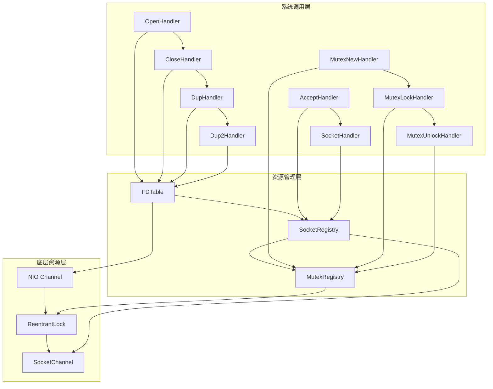
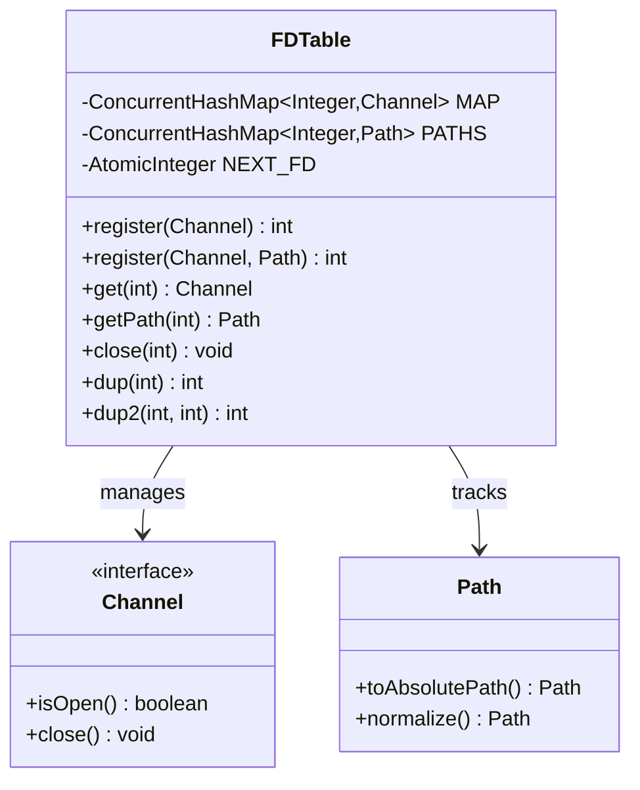
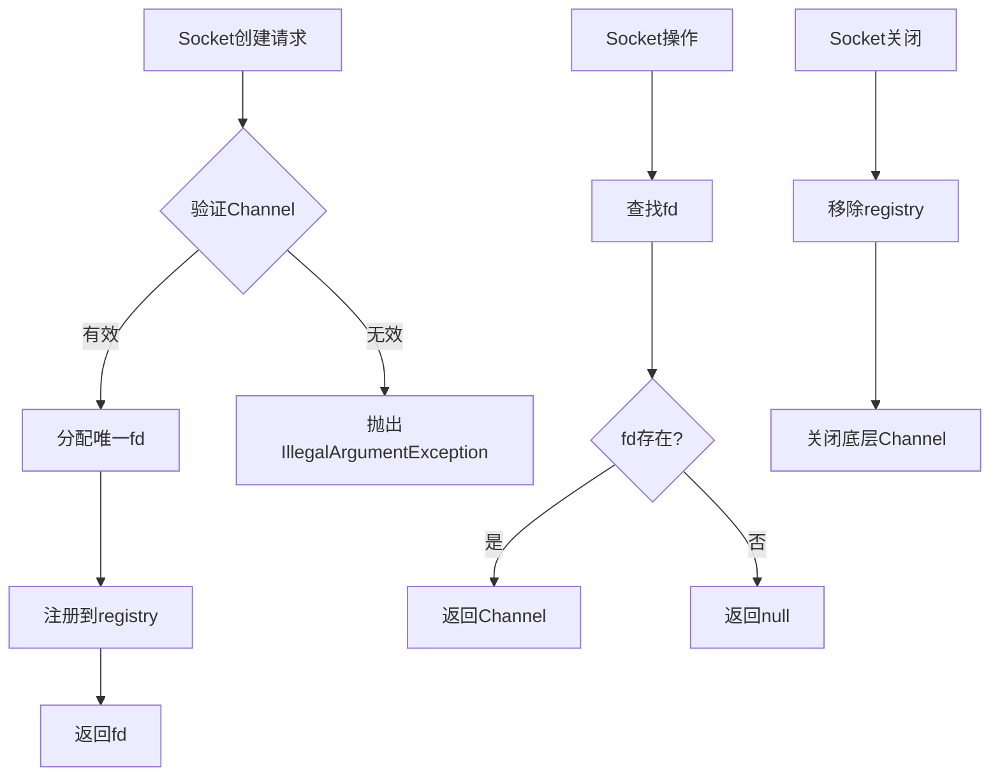
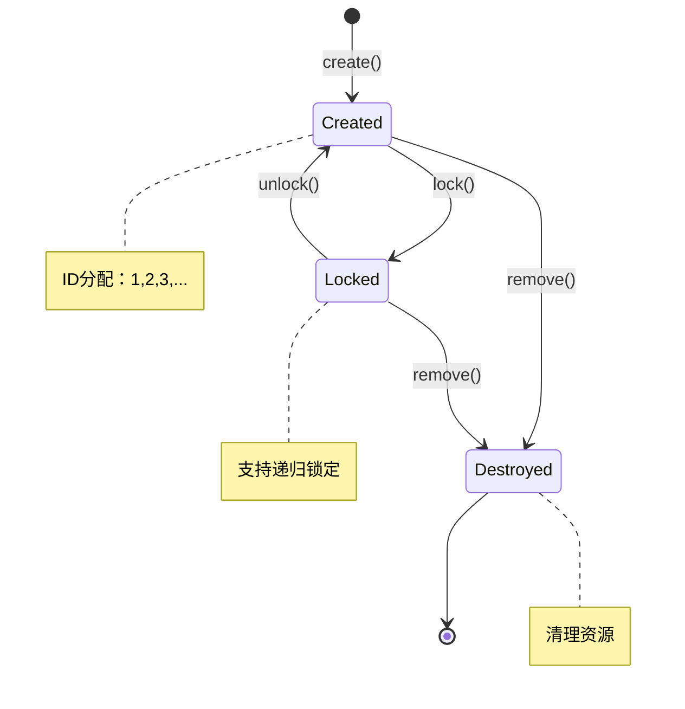
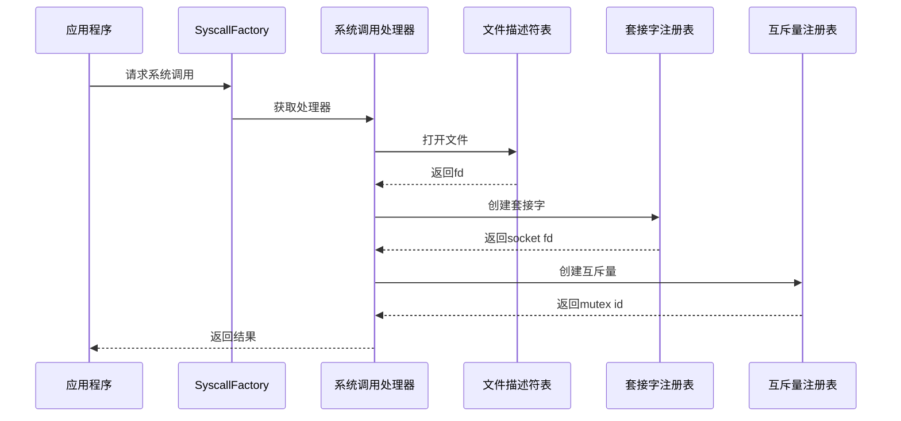
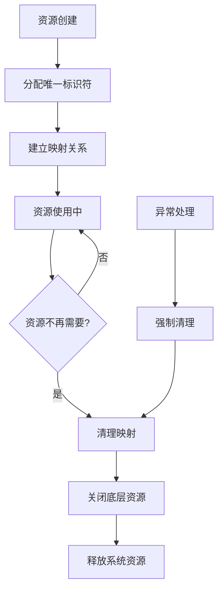

# Snow虚拟机系统资源管理

<cite>
**本文档引用的文件**
- [FDTable.java](file://src/main/java/org/jcnc/snow/vm/io/FDTable.java)
- [SocketRegistry.java](file://src/main/java/org/jcnc/snow/vm/io/SocketRegistry.java)
- [MutexRegistry.java](file://src/main/java/org/jcnc/snow/vm/io/MutexRegistry.java)
- [OpenHandler.java](file://src/main/java/org/jcnc/snow/vm/commands/system/control/fd/OpenHandler.java)
- [DupHandler.java](file://src/main/java/org/jcnc/snow/vm/commands/system/control/fd/DupHandler.java)
- [Dup2Handler.java](file://src/main/java/org/jcnc/snow/vm/commands/system/control/fd/Dup2Handler.java)
- [CloseHandler.java](file://src/main/java/org/jcnc/snow/vm/commands/system/control/fd/CloseHandler.java)
- [MutexNewHandler.java](file://src/main/java/org/jcnc/snow/vm/commands/system/control/sync/MutexNewHandler.java)
- [AcceptHandler.java](file://src/main/java/org/jcnc/snow/vm/commands/system/control/socket/AcceptHandler.java)
- [SyscallFactory.java](file://src/main/java/org/jcnc/snow/vm/commands/system/control/SyscallFactory.java)
- [SyscallOpCode.java](file://src/main/java/org/jcnc/snow/vm/engine/SyscallOpCode.java)
</cite>

## 目录
1. [引言](#引言)
2. [系统架构概览](#系统架构概览)
3. [FDTable文件描述符表](#fdtable文件描述符表)
4. [SocketRegistry套接字注册表](#socketregistry套接字注册表)
5. [MutexRegistry互斥量注册表](#mutexregistry互斥量注册表)
6. [注册表协同工作机制](#注册表协同工作机制)
7. [线程安全设计](#线程安全设计)
8. [资源泄漏防护机制](#资源泄漏防护机制)
9. [系统调用集成](#系统调用集成)
10. [性能考虑](#性能考虑)
11. [故障排除指南](#故障排除指南)
12. [总结](#总结)

## 引言

Snow虚拟机的系统资源管理系统是一个精密设计的三层架构，负责管理虚拟机运行时所需的各种系统资源。该系统通过三个核心注册表——FDTable（文件描述符表）、SocketRegistry（套接字注册表）和MutexRegistry（互斥量注册表）——实现了对I/O资源、网络连接和并发控制的统一管理。

这套资源管理系统的设计目标是在保证高性能的同时，提供完善的线程安全保障和资源泄漏防护机制。通过将虚拟机的抽象资源映射到底层操作系统资源，系统能够为Snow语言程序提供接近原生系统的性能表现。

## 系统架构概览

Snow虚拟机的资源管理系统采用分层架构设计，每一层都有明确的职责分工：

**图表来源**
- [SyscallFactory.java](file://src/main/java/org/jcnc/snow/vm/commands/system/control/SyscallFactory.java#L30-L150)
- [FDTable.java](file://src/main/java/org/jcnc/snow/vm/io/FDTable.java#L1-L50)
- [SocketRegistry.java](file://src/main/java/org/jcnc/snow/vm/io/SocketRegistry.java#L1-L50)
- [MutexRegistry.java](file://src/main/java/org/jcnc/snow/vm/io/MutexRegistry.java#L1-L50)

## FDTable文件描述符表

FDTable是Snow虚拟机的核心资源管理组件，负责维护全局文件描述符（fd）与NIO Channel之间的映射关系。该组件实现了完整的文件描述符生命周期管理，包括分配、注册、查找、复制和关闭等操作。

### 核心数据结构

FDTable使用两个关键的并发数据结构来维护资源映射：

**图表来源**
- [FDTable.java](file://src/main/java/org/jcnc/snow/vm/io/FDTable.java#L25-L45)

### 文件描述符分配策略

FDTable采用智能的文件描述符分配策略，将标准I/O与动态资源分开管理：

| 文件描述符范围 | 资源类型 | 管理方式 | 特殊处理 |
|---------------|----------|----------|----------|
| 0 | 标准输入 | 系统标准输入流 | 只刷新不关闭 |
| 1 | 标准输出 | 系统标准输出流 | 只刷新不关闭 |
| 2 | 标准错误 | 系统标准错误流 | 只刷新不关闭 |
| ≥3 | 动态资源 | 自动递增分配 | 完全管理 |

### 核心操作实现

#### register方法
register方法负责将新的NIO Channel注册到系统中，支持两种注册模式：

- **基础注册**：仅分配文件描述符，不记录路径信息
- **路径注册**：同时记录文件路径，便于后续的文件属性查询

#### dup和dup2方法
这两个方法实现了文件描述符的复制功能：

- **dup**：创建新的文件描述符指向相同的底层通道
- **dup2**：将现有文件描述符复制到指定位置，自动处理冲突

**章节来源**
- [FDTable.java](file://src/main/java/org/jcnc/snow/vm/io/FDTable.java#L50-L185)

## SocketRegistry套接字注册表

SocketRegistry专门负责管理socket类型的文件描述符，提供线程安全的套接字生命周期管理。该组件针对网络编程的特殊需求进行了优化，支持套接字的创建、查找、替换和关闭操作。

### 设计特点

SocketRegistry具有以下设计特点：

**图表来源**
- [SocketRegistry.java](file://src/main/java/org/jcnc/snow/vm/io/SocketRegistry.java#L35-L95)

### 核心功能

#### 注册机制
SocketRegistry使用原子计数器确保每个套接字都能获得唯一的文件描述符，避免fd冲突。

#### 替换功能
replace方法提供了套接字的热更新能力，在不中断连接的情况下更换底层通道。

#### 线程安全保证
所有操作都基于ConcurrentHashMap实现，确保多线程环境下的数据一致性。

**章节来源**
- [SocketRegistry.java](file://src/main/java/org/jcnc/snow/vm/io/SocketRegistry.java#L1-L99)

## MutexRegistry互斥量注册表

MutexRegistry为Snow虚拟机提供并发控制支持，管理互斥量ID与ReentrantLock对象之间的映射关系。该组件是虚拟机内部并发机制的基础，支持复杂的同步原语操作。

### 互斥量生命周期管理

**图表来源**
- [MutexRegistry.java](file://src/main/java/org/jcnc/snow/vm/io/MutexRegistry.java#L45-L85)

### 核心操作详解

#### create方法
create方法创建新的互斥量并分配唯一ID，返回可用于后续操作的互斥量标识符。

#### get方法
get方法根据ID查找对应的ReentrantLock实例，如果ID不存在则抛出异常。

#### remove方法
remove方法清理指定ID的互斥量，通常用于资源回收或测试场景。

**章节来源**
- [MutexRegistry.java](file://src/main/java/org/jcnc/snow/vm/io/MutexRegistry.java#L1-L85)

## 注册表协同工作机制

三个注册表通过系统调用工厂协同工作，形成完整的资源管理体系：

**图表来源**
- [SyscallFactory.java](file://src/main/java/org/jcnc/snow/vm/commands/system/control/SyscallFactory.java#L30-L150)

### 协同工作流程

1. **系统调用路由**：SyscallFactory根据操作码找到对应的处理器
2. **资源分配**：各注册表负责分配相应的资源标识符
3. **映射建立**：将抽象资源映射到底层系统资源
4. **状态维护**：跟踪资源的生命周期状态

**章节来源**
- [SyscallFactory.java](file://src/main/java/org/jcnc/snow/vm/commands/system/control/SyscallFactory.java#L1-L154)

## 线程安全设计

Snow虚拟机的资源管理系统采用了多层次的线程安全保障机制：

### 并发数据结构

| 组件 | 数据结构 | 线程安全级别 | 适用场景 |
|------|----------|--------------|----------|
| FDTable.MAP | ConcurrentHashMap | 完全线程安全 | 文件描述符查找 |
| FDTable.PATHS | ConcurrentHashMap | 完全线程安全 | 路径信息管理 |
| FDTable.NEXT_FD | AtomicInteger | 原子操作 | fd分配 |
| SocketRegistry.registry | ConcurrentHashMap | 完全线程安全 | 套接字管理 |
| SocketRegistry.NEXT_FD | AtomicInteger | 原子操作 | socket fd分配 |
| MutexRegistry.REG | ConcurrentHashMap | 完全线程安全 | 互斥量管理 |
| MutexRegistry.NEXT_ID | AtomicInteger | 原子操作 | mutex id分配 |

### 锁策略

系统采用无锁设计原则，通过以下机制确保线程安全：

1. **原子操作**：使用AtomicInteger进行计数器操作
2. **并发集合**：使用ConcurrentHashMap避免锁竞争
3. **不可变性**：对共享数据采用不可变设计
4. **操作隔离**：不同注册表的操作相互独立

**章节来源**
- [FDTable.java](file://src/main/java/org/jcnc/snow/vm/io/FDTable.java#L30-L40)
- [SocketRegistry.java](file://src/main/java/org/jcnc/snow/vm/io/SocketRegistry.java#L25-L35)
- [MutexRegistry.java](file://src/main/java/org/jcnc/snow/vm/io/MutexRegistry.java#L30-L40)

## 资源泄漏防护机制

Snow虚拟机实现了多层次的资源泄漏防护机制：

### 自动资源管理

### 关键防护措施

#### FDTable的特殊处理
对于标准I/O文件描述符（0、1、2），系统采用特殊的关闭策略：
- **只刷新不关闭**：防止意外关闭系统标准流
- **异常安全**：即使发生异常也保证资源正确释放

#### 套接字的优雅关闭
SocketRegistry提供了完整的套接字生命周期管理：
- **及时清理**：close方法确保底层Channel被正确关闭
- **异常恢复**：replace方法在替换过程中妥善处理异常

#### 互斥量的资源回收
MutexRegistry支持显式的资源回收：
- **主动清理**：remove方法允许主动释放互斥量
- **弱引用**：避免因注册表导致的内存泄漏

**章节来源**
- [FDTable.java](file://src/main/java/org/jcnc/snow/vm/io/FDTable.java#L90-L120)
- [SocketRegistry.java](file://src/main/java/org/jcnc/snow/vm/io/SocketRegistry.java#L60-L80)

## 系统调用集成

Snow虚拟机的资源管理系统深度集成了各种系统调用，为Snow语言程序提供完整的系统编程能力：

### 文件操作系统调用

| 系统调用 | 功能描述 | 资源管理 | 返回值 |
|----------|----------|----------|--------|
| OPEN (0x1000) | 打开文件 | FDTable | 新文件描述符 |
| READ (0x1001) | 读取数据 | FDTable | 读取字节数 |
| WRITE (0x1002) | 写入数据 | FDTable | 写入字节数 |
| CLOSE (0x1004) | 关闭文件 | FDTable | 0（成功） |
| DUP (0x1008) | 复制文件描述符 | FDTable | 新文件描述符 |
| DUP2 (0x1009) | 复制到指定文件描述符 | FDTable | 目标文件描述符 |

### 网络操作系统调用

| 系统调用 | 功能描述 | 资源管理 | 返回值 |
|----------|----------|----------|--------|
| SOCKET (0x1400) | 创建套接字 | SocketRegistry | 套接字文件描述符 |
| BIND (0x1401) | 绑定地址 | SocketRegistry | 0（成功） |
| LISTEN (0x1402) | 监听连接 | SocketRegistry | 0（成功） |
| ACCEPT (0x1403) | 接受连接 | SocketRegistry | 新连接文件描述符 |
| CONNECT (0x1404) | 建立连接 | SocketRegistry | 0（成功） |

### 并发控制系统调用

| 系统调用 | 功能描述 | 资源管理 | 返回值 |
|----------|----------|----------|--------|
| MUTEX_NEW (0x1600) | 创建互斥量 | MutexRegistry | 互斥量ID |
| MUTEX_LOCK (0x1601) | 加锁 | MutexRegistry | 0（成功） |
| MUTEX_TRYLOCK (0x1602) | 尝试加锁 | MutexRegistry | 1（成功）/0（失败） |
| MUTEX_UNLOCK (0x1603) | 解锁 | MutexRegistry | 0（成功） |

**章节来源**
- [SyscallOpCode.java](file://src/main/java/org/jcnc/snow/vm/engine/SyscallOpCode.java#L1-L800)
- [OpenHandler.java](file://src/main/java/org/jcnc/snow/vm/commands/system/control/fd/OpenHandler.java#L30-L68)
- [MutexNewHandler.java](file://src/main/java/org/jcnc/snow/vm/commands/system/control/sync/MutexNewHandler.java#L25-L37)

## 性能考虑

Snow虚拟机的资源管理系统在设计时充分考虑了性能优化：

### 内存优化策略

1. **延迟初始化**：只有在需要时才创建资源对象
2. **对象池化**：重用临时对象减少GC压力
3. **紧凑存储**：使用基本类型而非包装类

### 访问优化技术

1. **缓存友好**：数据结构设计考虑CPU缓存特性
2. **批量操作**：支持批量资源操作减少系统调用
3. **预分配**：预先分配常用资源避免运行时分配

### 并发性能

1. **无锁设计**：最小化锁竞争
2. **细粒度控制**：不同注册表操作相互独立
3. **读写分离**：优化读多写少的场景

## 故障排除指南

### 常见问题诊断

#### 文件描述符耗尽
**症状**：系统调用返回错误，提示文件描述符不足
**原因**：大量文件未正确关闭
**解决方案**：
- 检查应用程序的文件关闭逻辑
- 使用资源监控工具检查fd使用情况
- 实现自动资源清理机制

#### 套接字连接失败
**症状**：网络操作返回异常
**原因**：套接字资源管理错误
**解决方案**：
- 验证套接字创建和关闭的配对
- 检查网络资源的生命周期
- 使用调试工具跟踪套接字状态

#### 互斥量死锁
**症状**：程序出现无限等待
**原因**：互斥量使用不当
**解决方案**：
- 实现超时机制
- 使用RAII模式管理资源
- 添加死锁检测机制

### 调试技巧

1. **资源监控**：定期检查各注册表的使用情况
2. **日志记录**：在关键操作点添加详细的日志
3. **单元测试**：编写全面的资源管理测试用例
4. **压力测试**：模拟高并发场景验证系统稳定性

## 总结

Snow虚拟机的系统资源管理系统通过FDTable、SocketRegistry和MutexRegistry三个核心组件，构建了一个完整、高效、安全的资源管理框架。该系统的主要优势包括：

1. **完整性**：覆盖了Snow语言所需的全部系统编程资源
2. **高性能**：采用无锁设计和优化的数据结构
3. **安全性**：提供完善的线程安全保障和资源泄漏防护
4. **易用性**：为开发者提供了简洁而强大的API接口

通过这种精心设计的资源管理体系，Snow虚拟机能够在保证性能的同时，为Snow语言程序提供接近原生系统的编程体验。这套系统不仅满足了当前的功能需求，也为未来的功能扩展奠定了坚实的基础。