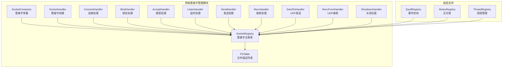
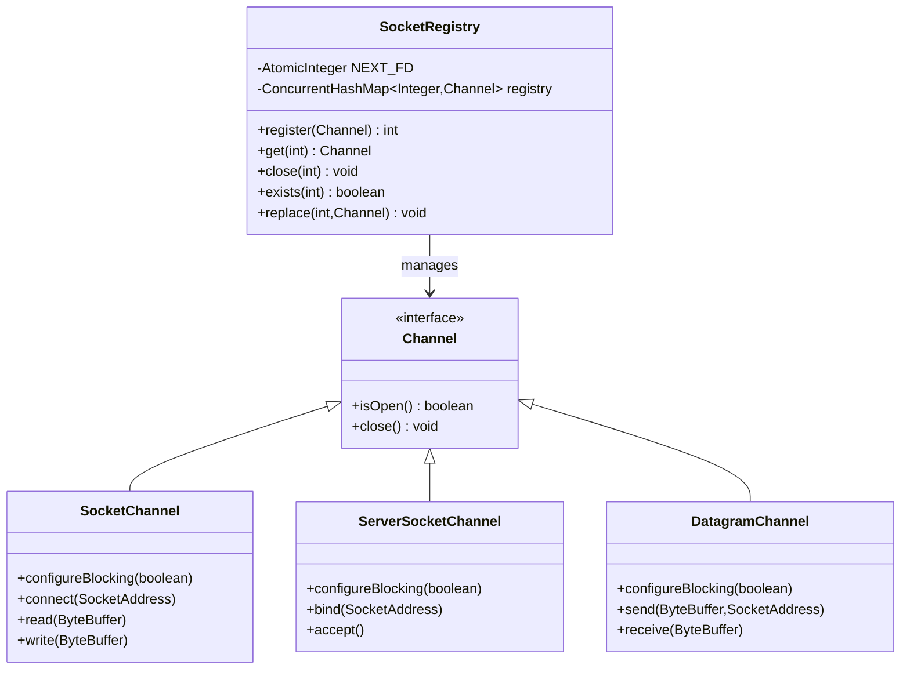
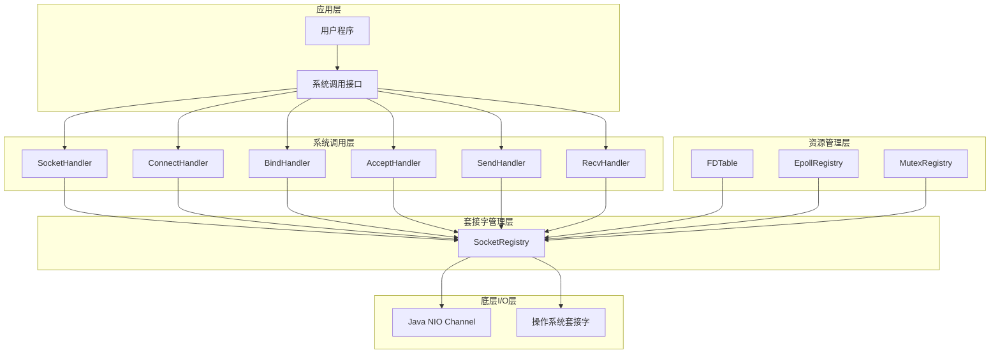
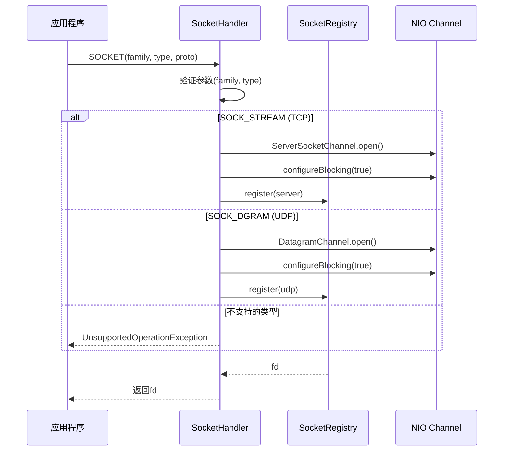
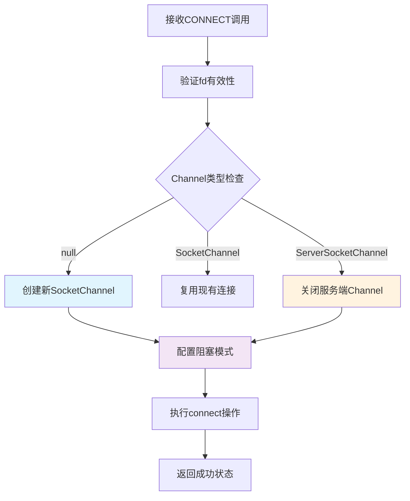
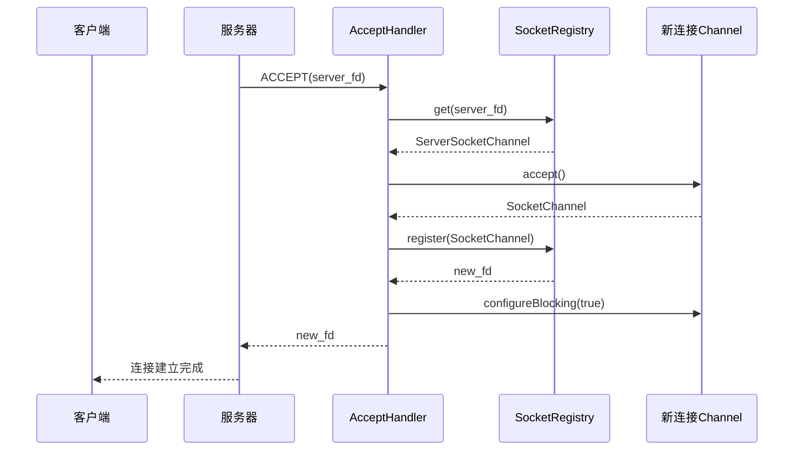
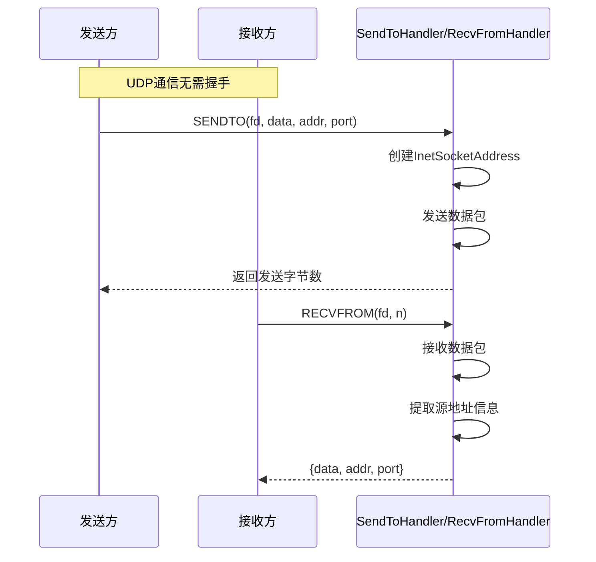
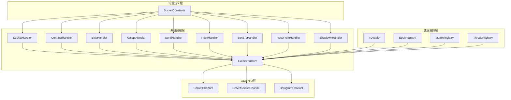
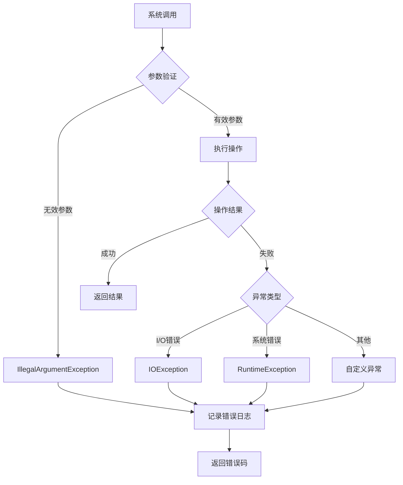

# 网络套接字管理

<cite>
**本文档中引用的文件**
- [SocketRegistry.java](file://src/main/java/org/jcnc/snow/vm/io/SocketRegistry.java)
- [FDTable.java](file://src/main/java/org/jcnc/snow/vm/io/FDTable.java)
- [SocketHandler.java](file://src/main/java/org/jcnc/snow/vm/commands/system/control/socket/SocketHandler.java)
- [ConnectHandler.java](file://src/main/java/org/jcnc/snow/vm/commands/system/control/socket/ConnectHandler.java)
- [BindHandler.java](file://src/main/java/org/jcnc/snow/vm/commands/system/control/socket/BindHandler.java)
- [AcceptHandler.java](file://src/main/java/org/jcnc/snow/vm/commands/system/control/socket/AcceptHandler.java)
- [ListenHandler.java](file://src/main/java/org/jcnc/snow/vm/commands/system/control/socket/ListenHandler.java)
- [SendHandler.java](file://src/main/java/org/jcnc/snow/vm/commands/system/control/socket/SendHandler.java)
- [RecvHandler.java](file://src/main/java/org/jcnc/snow/vm/commands/system/control/socket/RecvHandler.java)
- [SendToHandler.java](file://src/main/java/org/jcnc/snow/vm/commands/system/control/socket/SendToHandler.java)
- [RecvFromHandler.java](file://src/main/java/org/jcnc/snow/vm/commands/system/control/socket/RecvFromHandler.java)
- [ShutdownHandler.java](file://src/main/java/org/jcnc/snow/vm/commands/system/control/socket/ShutdownHandler.java)
- [SocketConstants.java](file://src/main/java/org/jcnc/snow/vm/io/SocketConstants.java)
- [EpollRegistry.java](file://src/main/java/org/jcnc/snow/vm/io/EpollRegistry.java)
</cite>

## 目录
1. [引言](#引言)
2. [项目结构概述](#项目结构概述)
3. [核心组件分析](#核心组件分析)
4. [架构概览](#架构概览)
5. [详细组件分析](#详细组件分析)
6. [依赖关系分析](#依赖关系分析)
7. [性能考量](#性能考量)
8. [异常处理策略](#异常处理策略)
9. [总结](#总结)

## 引言

Snow虚拟机的网络套接字管理系统是一个精心设计的I/O抽象层，专门负责管理socket类型的文件描述符。该系统通过SocketRegistry类实现了从fd 3开始的唯一分配机制，提供了完整的socket生命周期管理功能。系统采用分层架构设计，SocketRegistry专注于socket特定的操作，而FDTable提供通用的I/O抽象，两者相互补充，共同构建了一个高效、可靠的网络通信基础设施。

## 项目结构概述

Snow虚拟机的网络套接字管理模块位于`src/main/java/org/jcnc/snow/vm/io`和`src/main/java/org/jcnc/snow/vm/commands/system/control/socket`包中，主要包含以下核心组件：



**图表来源**
- [SocketRegistry.java](file://src/main/java/org/jcnc/snow/vm/io/SocketRegistry.java#L21-L98)
- [FDTable.java](file://src/main/java/org/jcnc/snow/vm/io/FDTable.java#L25-L186)
- [SocketHandler.java](file://src/main/java/org/jcnc/snow/vm/commands/system/control/socket/SocketHandler.java#L25-L75)

## 核心组件分析

### SocketRegistry：套接字注册表

SocketRegistry是网络套接字管理的核心组件，专门负责管理socket类型的文件描述符。它提供了从fd 3开始的唯一分配机制，确保每个socket都有独立的文件描述符标识。

#### 主要特性

1. **唯一fd分配**：从3开始的原子性递增分配
2. **线程安全**：使用ConcurrentHashMap保证并发访问安全
3. **生命周期管理**：提供完整的注册、获取、关闭、替换功能
4. **类型安全**：严格区分不同类型的Channel

#### 核心方法详解



**图表来源**
- [SocketRegistry.java](file://src/main/java/org/jcnc/snow/vm/io/SocketRegistry.java#L21-L98)

**章节来源**
- [SocketRegistry.java](file://src/main/java/org/jcnc/snow/vm/io/SocketRegistry.java#L21-L98)

### FDTable：通用文件描述符表

FDTable提供了更通用的I/O抽象层，管理所有类型的文件描述符，包括标准输入输出（0/1/2）和动态分配的fd。它是整个I/O系统的基础设施。

#### 设计特点

1. **标准I/O支持**：预分配0/1/2号fd分别对应标准输入、输出、错误
2. **动态分配**：从3开始的连续分配机制
3. **路径跟踪**：记录文件路径信息用于调试和诊断
4. **复制支持**：提供dup和dup2系统调用支持

**章节来源**
- [FDTable.java](file://src/main/java/org/jcnc/snow/vm/io/FDTable.java#L25-L186)

## 架构概览

Snow虚拟机的网络套接字管理系统采用了分层架构设计，通过清晰的职责分离实现了高效的网络通信能力：



**图表来源**
- [SocketHandler.java](file://src/main/java/org/jcnc/snow/vm/commands/system/control/socket/SocketHandler.java#L25-L75)
- [SocketRegistry.java](file://src/main/java/org/jcnc/snow/vm/io/SocketRegistry.java#L21-L98)
- [FDTable.java](file://src/main/java/org/jcnc/snow/vm/io/FDTable.java#L25-L186)

## 详细组件分析

### SocketHandler：套接字创建处理器

SocketHandler负责处理SOCKET系统调用，根据协议族和套接字类型创建相应的Channel实例。

#### 实现流程



**图表来源**
- [SocketHandler.java](file://src/main/java/org/jcnc/snow/vm/commands/system/control/socket/SocketHandler.java#L35-L74)

**章节来源**
- [SocketHandler.java](file://src/main/java/org/jcnc/snow/vm/commands/system/control/socket/SocketHandler.java#L25-L75)

### ConnectHandler：连接建立处理器

ConnectHandler处理TCP连接请求，支持客户端主动连接远程服务器。

#### 连接状态迁移

ConnectHandler展示了SocketRegistry中replace方法的重要应用场景：



**图表来源**
- [ConnectHandler.java](file://src/main/java/org/jcnc/snow/vm/commands/system/control/socket/ConnectHandler.java#L45-L99)

**章节来源**
- [ConnectHandler.java](file://src/main/java/org/jcnc/snow/vm/commands/system/control/socket/ConnectHandler.java#L25-L99)

### AcceptHandler：连接接受处理器

AcceptHandler处理服务器端的连接接受操作，是TCP服务器模型的核心组件。

#### 接受流程



**图表来源**
- [AcceptHandler.java](file://src/main/java/org/jcnc/snow/vm/commands/system/control/socket/AcceptHandler.java#L34-L77)

**章节来源**
- [AcceptHandler.java](file://src/main/java/org/jcnc/snow/vm/commands/system/control/socket/AcceptHandler.java#L25-L77)

### BindHandler：地址绑定处理器

BindHandler负责将socket绑定到本地地址和端口，支持TCP和UDP套接字。

#### 绑定逻辑

| Channel类型 | 支持的绑定操作 | 特殊处理 |
|------------|---------------|----------|
| ServerSocketChannel | bind(SocketAddress) | 服务端socket专用 |
| SocketChannel | bind(SocketAddress) | 客户端socket绑定本地端口 |
| DatagramChannel | bind(SocketAddress) | UDP socket绑定 |

**章节来源**
- [BindHandler.java](file://src/main/java/org/jcnc/snow/vm/commands/system/control/socket/BindHandler.java#L25-L73)

### SendHandler和RecvHandler：TCP数据传输

这两个处理器实现了TCP套接字的双向数据传输功能。

#### 数据传输流程

```mermaid
flowchart LR
subgraph "发送流程"
A[SendHandler] --> B[获取SocketChannel]
B --> C[转换数据格式]
C --> D[写入ByteBuffer]
D --> E[channel.write]
E --> F[返回写入字节数]
end
subgraph "接收流程"
G[RecvHandler] --> H[获取SocketChannel]
H --> I[分配ByteBuffer]
I --> J[channel.read]
J --> K{读取结果}
K --> |正常| L[提取数据]
K --> |-1(EOF)| M[返回空数组]
L --> N[返回数据]
M --> N
end
```

**图表来源**
- [SendHandler.java](file://src/main/java/org/jcnc/snow/vm/commands/system/control/socket/SendHandler.java#L40-L73)
- [RecvHandler.java](file://src/main/java/org/jcnc/snow/vm/commands/system/control/socket/RecvHandler.java#L35-L71)

**章节来源**
- [SendHandler.java](file://src/main/java/org/jcnc/snow/vm/commands/system/control/socket/SendHandler.java#L25-L73)
- [RecvHandler.java](file://src/main/java/org/jcnc/snow/vm/commands/system/control/socket/RecvHandler.java#L25-L71)

### SendToHandler和RecvFromHandler：UDP数据传输

这两个处理器专门处理UDP无连接套接字的数据传输。

#### UDP通信特点

UDP套接字不需要预先建立连接，每次发送都指定目标地址：



**图表来源**
- [SendToHandler.java](file://src/main/java/org/jcnc/snow/vm/commands/system/control/socket/SendToHandler.java#L40-L75)
- [RecvFromHandler.java](file://src/main/java/org/jcnc/snow/vm/commands/system/control/socket/RecvFromHandler.java#L35-L79)

**章节来源**
- [SendToHandler.java](file://src/main/java/org/jcnc/snow/vm/commands/system/control/socket/SendToHandler.java#L25-L75)
- [RecvFromHandler.java](file://src/main/java/org/jcnc/snow/vm/commands/system/control/socket/RecvFromHandler.java#L25-L79)

### ShutdownHandler：套接字关闭处理器

ShutdownHandler提供了灵活的套接字关闭机制，支持部分关闭和完全关闭。

#### 关闭策略

| Channel类型 | 关闭方式 | 实现细节 |
|------------|----------|----------|
| SocketChannel | shutdownInput/shutdownOutput | Java Socket API |
| DatagramChannel | close() | UDP视为完全关闭 |
| ServerSocketChannel | close() | 服务端socket关闭 |

**章节来源**
- [ShutdownHandler.java](file://src/main/java/org/jcnc/snow/vm/commands/system/control/socket/ShutdownHandler.java#L25-L79)

## 依赖关系分析

Snow虚拟机的网络套接字管理系统具有清晰的依赖层次结构：



**图表来源**
- [SocketHandler.java](file://src/main/java/org/jcnc/snow/vm/commands/system/control/socket/SocketHandler.java#L10-L15)
- [SocketRegistry.java](file://src/main/java/org/jcnc/snow/vm/io/SocketRegistry.java#L21-L98)
- [FDTable.java](file://src/main/java/org/jcnc/snow/vm/io/FDTable.java#L25-L186)

**章节来源**
- [SocketHandler.java](file://src/main/java/org/jcnc/snow/vm/commands/system/control/socket/SocketHandler.java#L10-L15)
- [SocketRegistry.java](file://src/main/java/org/jcnc/snow/vm/io/SocketRegistry.java#L21-L98)
- [FDTable.java](file://src/main/java/org/jcnc/snow/vm/io/FDTable.java#L25-L186)

## 性能考量

### 高并发场景优化

Snow虚拟机的网络套接字管理系统在高并发场景下采用了多种优化策略：

1. **无锁设计**：SocketRegistry使用ConcurrentHashMap避免锁竞争
2. **原子操作**：fd分配使用AtomicInteger确保线程安全
3. **连接池化**：支持连接复用减少创建开销
4. **异步I/O**：利用NIO Channel的异步特性

### 内存管理

系统采用以下策略优化内存使用：

- **弱引用**：Channel对象使用弱引用避免内存泄漏
- **及时清理**：close操作立即释放相关资源
- **对象池**：重用ByteBuffer等临时对象

### 网络性能优化

1. **缓冲区管理**：合理配置发送和接收缓冲区大小
2. **零拷贝**：利用DirectByteBuffer减少内存拷贝
3. **批量操作**：支持批量数据传输提高效率

## 异常处理策略

### 错误分类与处理

Snow虚拟机的网络套接字管理系统实现了完善的异常处理机制：



### 异常恢复机制

1. **优雅降级**：连接失败时提供备用方案
2. **资源清理**：确保异常情况下资源正确释放
3. **状态重置**：异常后恢复到安全状态
4. **重试机制**：对于临时性错误提供重试支持

### 错误码标准化

系统采用标准化的错误码返回机制：

| 操作类型 | 成功码 | 失败码 | 描述 |
|---------|--------|--------|------|
| 套接字创建 | fd | -1 | 创建成功返回fd，失败返回-1 |
| 连接操作 | 0 | -1 | 成功返回0，失败返回-1 |
| 数据传输 | 字节数 | -1 | 成功返回传输字节数，失败返回-1 |
| 关闭操作 | 0 | -1 | 成功返回0，失败返回-1 |

**章节来源**
- [ConnectHandler.java](file://src/main/java/org/jcnc/snow/vm/commands/system/control/socket/ConnectHandler.java#L45-L99)
- [SendHandler.java](file://src/main/java/org/jcnc/snow/vm/commands/system/control/socket/SendHandler.java#L40-L73)
- [RecvHandler.java](file://src/main/java/org/jcnc/snow/vm/commands/system/control/socket/RecvHandler.java#L35-L71)

## 总结

Snow虚拟机的网络套接字管理系统是一个设计精良、功能完备的I/O抽象层。通过SocketRegistry和FDTable的分工协作，系统实现了：

1. **完整的套接字生命周期管理**：从创建到销毁的全过程控制
2. **高效的并发处理能力**：无锁设计和原子操作确保高并发性能
3. **灵活的网络通信支持**：同时支持TCP和UDP协议
4. **健壮的异常处理机制**：完善的错误检测和恢复策略
5. **标准化的系统调用接口**：与POSIX标准兼容

该系统的设计充分体现了现代操作系统I/O子系统的设计原则，为Snow虚拟机提供了稳定可靠的网络通信基础。通过合理的分层架构和职责分离，系统既保证了功能的完整性，又确保了良好的可维护性和扩展性。