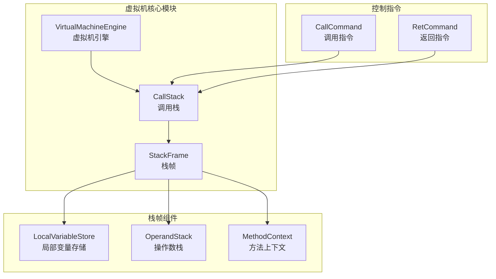
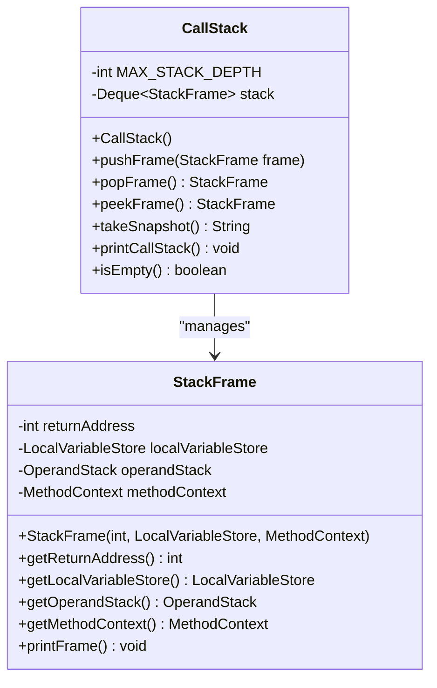
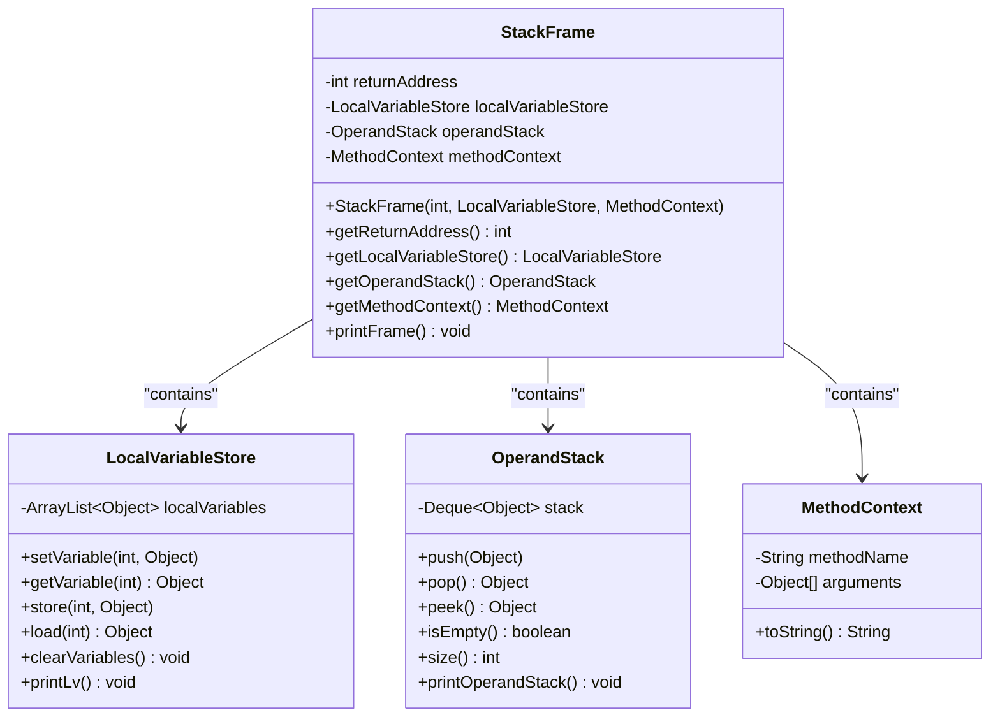
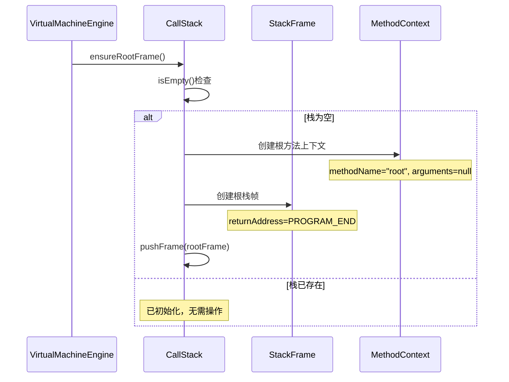
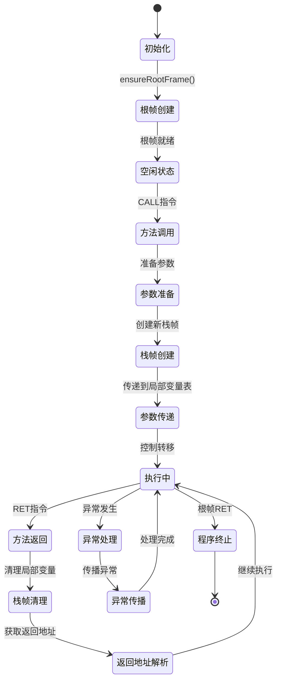
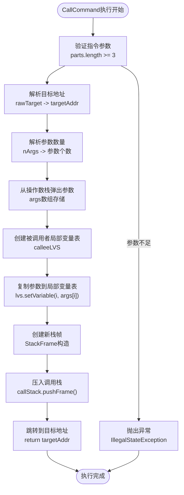
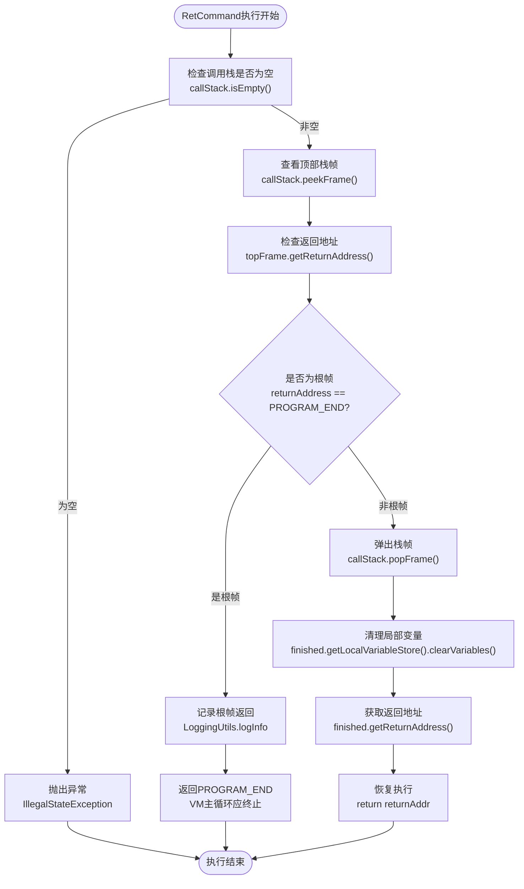
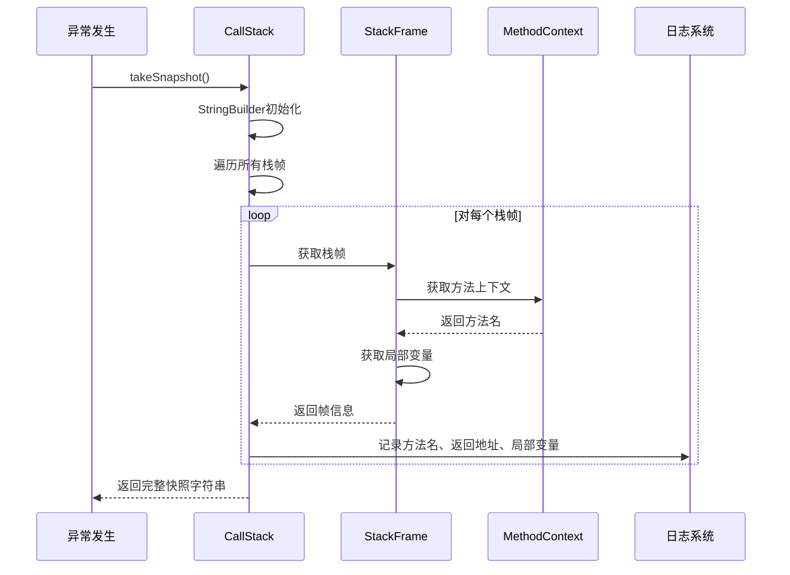
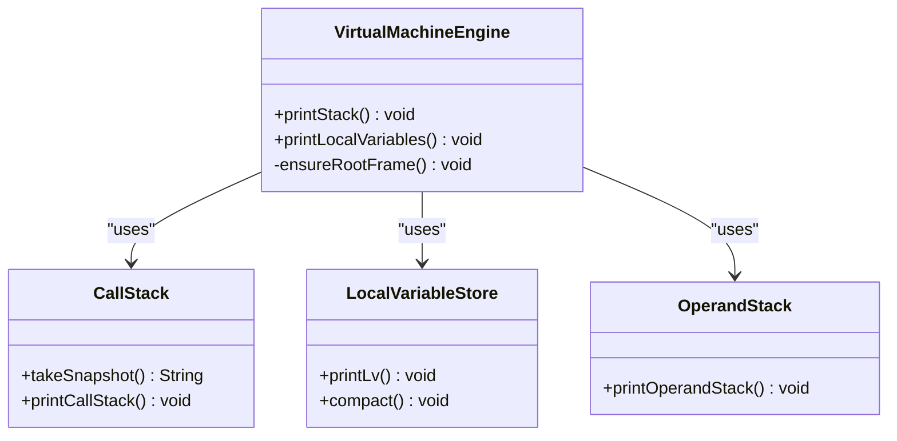
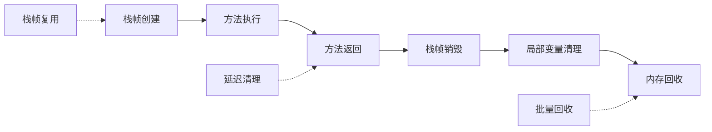

# 调用栈与栈帧

<cite>
**本文档引用的文件**
- [CallStack.java](file://src/main/java/org/jcnc/snow/vm/module/CallStack.java)
- [StackFrame.java](file://src/main/java/org/jcnc/snow/vm/module/StackFrame.java)
- [CallCommand.java](file://src/main/java/org/jcnc/snow/vm/commands/flow/control/CallCommand.java)
- [RetCommand.java](file://src/main/java/org/jcnc/snow/vm/commands/flow/control/RetCommand.java)
- [VirtualMachineEngine.java](file://src/main/java/org/jcnc/snow/vm/engine/VirtualMachineEngine.java)
- [LocalVariableStore.java](file://src/main/java/org/jcnc/snow/vm/module/LocalVariableStore.java)
- [OperandStack.java](file://src/main/java/org/jcnc/snow/vm/module/OperandStack.java)
- [MethodContext.java](file://src/main/java/org/jcnc/snow/vm/module/MethodContext.java)
</cite>

## 目录
1. [简介](#简介)
2. [项目结构概览](#项目结构概览)
3. [CallStack核心组件](#callstack核心组件)
4. [StackFrame组成结构](#stackframe组成结构)
5. [调用栈管理机制](#调用栈管理机制)
6. [方法调用与返回流程](#方法调用与返回流程)
7. [异常处理与调试功能](#异常处理与调试功能)
8. [性能考虑](#性能考虑)
9. [故障排除指南](#故障排除指南)
10. [总结](#总结)

## 简介

Snow虚拟机的调用栈（CallStack）与栈帧（StackFrame）系统是虚拟机执行引擎的核心组件，负责管理程序的方法调用层次结构和执行上下文。该系统通过Deque数据结构实现高效的栈操作，提供完整的调用链跟踪和异常调试功能。

调用栈系统包含以下关键特性：
- 基于ArrayDeque的高效栈实现
- 最大栈深度保护（1024层）
- 完整的栈帧生命周期管理
- 异常调试支持
- 运行时状态可视化

## 项目结构概览

Snow虚拟机的调用栈相关组件分布在以下模块中：



**图表来源**
- [VirtualMachineEngine.java](file://src/main/java/org/jcnc/snow/vm/engine/VirtualMachineEngine.java#L35-L76)
- [CallStack.java](file://src/main/java/org/jcnc/snow/vm/module/CallStack.java#L10-L15)
- [StackFrame.java](file://src/main/java/org/jcnc/snow/vm/module/StackFrame.java#L15-L50)

**章节来源**
- [VirtualMachineEngine.java](file://src/main/java/org/jcnc/snow/vm/engine/VirtualMachineEngine.java#L1-L191)
- [CallStack.java](file://src/main/java/org/jcnc/snow/vm/module/CallStack.java#L1-L97)

## CallStack核心组件

### 核心数据结构

CallStack类使用ArrayDeque作为底层数据结构来管理栈帧，提供高效的LIFO（后进先出）操作。



**图表来源**
- [CallStack.java](file://src/main/java/org/jcnc/snow/vm/module/CallStack.java#L10-L15)
- [StackFrame.java](file://src/main/java/org/jcnc/snow/vm/module/StackFrame.java#L15-L50)

### 栈深度保护机制

CallStack实现了最大栈深度保护机制，防止栈溢出导致的程序崩溃：

| 配置参数 | 默认值 | 作用 | 验证逻辑 |
|---------|--------|------|----------|
| MAX_STACK_DEPTH | 1024 | 最大栈深度限制 | `stack.size() >= MAX_STACK_DEPTH` |
| 异常类型 | StackOverflowError | 溢出时抛出的异常 | "Call stack overflow. Maximum depth: 1024" |

### 核心操作方法

CallStack提供了以下核心操作方法：

| 方法名 | 功能描述 | 参数类型 | 返回类型 | 异常处理 |
|--------|----------|----------|----------|----------|
| pushFrame | 压入新栈帧 | StackFrame | void | StackOverflowError |
| popFrame | 弹出当前栈帧 | 无 | StackFrame | IllegalStateException |
| peekFrame | 查看顶部栈帧 | 无 | StackFrame | IllegalStateException |
| takeSnapshot | 获取栈快照 | 无 | String | 无 |
| printCallStack | 打印栈状态 | 无 | void | 无 |
| isEmpty | 检查是否为空 | 无 | boolean | 无 |

**章节来源**
- [CallStack.java](file://src/main/java/org/jcnc/snow/vm/module/CallStack.java#L20-L97)

## StackFrame组成结构

### 四个核心组件

StackFrame是调用栈中每个方法调用的执行上下文，包含以下四个核心组件：



**图表来源**
- [StackFrame.java](file://src/main/java/org/jcnc/snow/vm/module/StackFrame.java#L15-L50)
- [LocalVariableStore.java](file://src/main/java/org/jcnc/snow/vm/module/LocalVariableStore.java#L25-L50)
- [OperandStack.java](file://src/main/java/org/jcnc/snow/vm/module/OperandStack.java#L15-L30)
- [MethodContext.java](file://src/main/java/org/jcnc/snow/vm/module/MethodContext.java#L15-L25)

### 组件详细说明

#### 1. returnAddress（返回地址）
- **类型**: int
- **作用**: 指示方法执行完成后应返回的程序位置
- **设置时机**: 方法调用时设置为CALL指令后的下一条指令地址
- **返回场景**: 方法正常结束或异常退出时使用

#### 2. localVariableStore（局部变量表）
- **实现**: ArrayList<Object>
- **特点**: 支持随机访问和动态扩展
- **用途**: 存储方法的局部变量、参数和临时值
- **生命周期**: 与栈帧同生共灭

#### 3. operandStack（操作数栈）
- **实现**: ArrayDeque<Object>
- **特点**: LIFO结构，支持基本栈操作
- **用途**: 存储表达式计算过程中的中间结果
- **操作**: push、pop、peek、isEmpty、size

#### 4. methodContext（方法上下文）
- **组成**: 方法名和参数列表
- **用途**: 提供调试信息和方法元数据
- **格式**: "Method: {methodName}, Args: {arguments}"

**章节来源**
- [StackFrame.java](file://src/main/java/org/jcnc/snow/vm/module/StackFrame.java#L15-L104)
- [LocalVariableStore.java](file://src/main/java/org/jcnc/snow/vm/module/LocalVariableStore.java#L25-L182)
- [OperandStack.java](file://src/main/java/org/jcnc/snow/vm/module/OperandStack.java#L15-L104)
- [MethodContext.java](file://src/main/java/org/jcnc/snow/vm/module/MethodContext.java#L15-L41)

## 调用栈管理机制

### 初始化与根帧保护

虚拟机启动时会自动初始化调用栈并创建根帧：



**图表来源**
- [VirtualMachineEngine.java](file://src/main/java/org/jcnc/snow/vm/engine/VirtualMachineEngine.java#L147-L154)
- [CallStack.java](file://src/main/java/org/jcnc/snow/vm/module/CallStack.java#L20-L35)

### 栈帧生命周期管理

调用栈遵循严格的生命周期管理模式：



**图表来源**
- [CallCommand.java](file://src/main/java/org/jcnc/snow/vm/commands/flow/control/CallCommand.java#L35-L81)
- [RetCommand.java](file://src/main/java/org/jcnc/snow/vm/commands/flow/control/RetCommand.java#L25-L54)

**章节来源**
- [VirtualMachineEngine.java](file://src/main/java/org/jcnc/snow/vm/engine/VirtualMachineEngine.java#L147-L154)
- [CallStack.java](file://src/main/java/org/jcnc/snow/vm/module/CallStack.java#L20-L97)

## 方法调用与返回流程

### CallCommand指令执行流程

CallCommand负责处理方法调用指令，建立新的执行上下文：



**图表来源**
- [CallCommand.java](file://src/main/java/org/jcnc/snow/vm/commands/flow/control/CallCommand.java#L35-L81)

### RetCommand指令执行流程

RetCommand处理方法返回指令，恢复上层调用的执行上下文：



**图表来源**
- [RetCommand.java](file://src/main/java/org/jcnc/snow/vm/commands/flow/control/RetCommand.java#L25-L54)

### 虚拟机执行循环中的调用栈管理

在虚拟机的主执行循环中，调用栈的状态直接影响程序的执行流程：

| 执行阶段 | 调用栈状态 | 主要操作 | 异常处理 |
|----------|------------|----------|----------|
| 初始化 | 根帧存在 | ensureRootFrame() | 无 |
| 正常执行 | 栈帧层次化 | CALL/RET指令 | 异常传播 |
| 方法调用 | 新栈帧压入 | pushFrame() | 栈溢出检查 |
| 方法返回 | 当前栈帧弹出 | popFrame() | 栈空检查 |
| 程序终止 | 根帧保留 | 根帧RET | 正常退出 |

**章节来源**
- [CallCommand.java](file://src/main/java/org/jcnc/snow/vm/commands/flow/control/CallCommand.java#L35-L81)
- [RetCommand.java](file://src/main/java/org/jcnc/snow/vm/commands/flow/control/RetCommand.java#L25-L54)
- [VirtualMachineEngine.java](file://src/main/java/org/jcnc/snow/vm/engine/VirtualMachineEngine.java#L80-L130)

## 异常处理与调试功能

### takeSnapshot方法的应用

takeSnapshot方法为异常调试提供完整的调用栈快照：



**图表来源**
- [CallStack.java](file://src/main/java/org/jcnc/snow/vm/module/CallStack.java#L55-L65)

### printCallStack方法的可视化功能

printCallStack方法提供运行时状态的可视化输出：

| 输出内容 | 来源 | 格式 | 用途 |
|----------|------|------|------|
| 方法名称 | MethodContext.methodName() | "Method: {name}" | 调用层次识别 |
| 返回地址 | StackFrame.returnAddress | "Return Address: {address}" | 执行流程追踪 |
| 局部变量 | LocalVariableStore.getLocalVariables() | "Locals: {variables}" | 变量状态检查 |
| 操作数栈 | OperandStack.stack | "Stack: {contents}" | 表达式计算状态 |

### 调试辅助工具

虚拟机提供了多个调试辅助方法：



**图表来源**
- [VirtualMachineEngine.java](file://src/main/java/org/jcnc/snow/vm/engine/VirtualMachineEngine.java#L160-L190)
- [CallStack.java](file://src/main/java/org/jcnc/snow/vm/module/CallStack.java#L55-L97)

**章节来源**
- [CallStack.java](file://src/main/java/org/jcnc/snow/vm/module/CallStack.java#L55-L97)
- [VirtualMachineEngine.java](file://src/main/java/org/jcnc/snow/vm/engine/VirtualMachineEngine.java#L160-L190)

## 性能考虑

### 数据结构选择

调用栈系统采用ArrayDeque作为底层数据结构，具有以下性能优势：

| 操作类型 | ArrayDeque性能 | ArrayList性能 | 时间复杂度 | 空间复杂度 |
|----------|----------------|---------------|------------|------------|
| push/pop | O(1) | O(n) | O(1) | O(1) |
| peek | O(1) | O(1) | O(1) | O(1) |
| 随机访问 | 不支持 | O(1) | 不适用 | O(1) |
| 内存占用 | 较紧凑 | 较宽松 | O(n) | O(n) |

### 栈深度限制策略

MAX_STACK_DEPTH常量（1024）的设计考虑：

- **内存安全**: 防止无限递归导致的内存耗尽
- **性能平衡**: 在栈深度和内存使用之间找到平衡点
- **实用性**: 能够满足大多数实际应用场景的需求
- **可配置性**: 可根据具体需求调整限制值

### 内存管理优化

栈帧的生命周期管理确保内存的有效利用：



**图表来源**
- [CallStack.java](file://src/main/java/org/jcnc/snow/vm/module/CallStack.java#L35-L45)
- [RetCommand.java](file://src/main/java/org/jcnc/snow/vm/commands/flow/control/RetCommand.java#L40-L45)

## 故障排除指南

### 常见异常及解决方案

| 异常类型 | 错误信息 | 可能原因 | 解决方案 |
|----------|----------|----------|----------|
| StackOverflowError | "Call stack overflow. Maximum depth: 1024" | 递归调用过深 | 检查递归逻辑，增加终止条件 |
| IllegalStateException | "Call stack is empty, cannot pop." | 尝试在空栈上弹出 | 检查RET指令的使用 |
| IllegalStateException | "Call stack is empty, cannot peek." | 尝试在空栈上查看 | 检查调用栈状态 |
| IllegalStateException | "CALL requires 2 operands: target and nArgs" | CALL指令格式错误 | 检查指令参数格式 |

### 调试技巧

1. **使用takeSnapshot()方法**:
   ```java
   // 在异常捕获处调用
   String stackSnapshot = callStack.takeSnapshot();
   System.err.println("调用栈快照:\n" + stackSnapshot);
   ```

2. **启用虚拟机状态打印**:
   ```java
   // 在关键执行点调用
   virtualMachineEngine.printStack();
   virtualMachineEngine.printLocalVariables();
   ```

3. **监控栈深度**:
   ```java
   // 检查当前栈深度
   int depth = callStack.size();
   if (depth > MAX_STACK_DEPTH * 0.9) {
       System.warn("警告：栈深度接近限制");
   }
   ```

### 性能监控指标

| 指标名称 | 监控方法 | 正常范围 | 异常阈值 |
|----------|----------|----------|----------|
| 平均栈深度 | callStack.size() | < 100 | > 800 |
| 栈溢出次数 | 异常计数器 | 0 | > 0 |
| 栈帧创建频率 | pushFrame调用统计 | 线性增长 | 指数增长 |
| 内存使用量 | JVM内存监控 | 稳定增长 | 急剧上升 |

**章节来源**
- [CallStack.java](file://src/main/java/org/jcnc/snow/vm/module/CallStack.java#L25-L35)
- [RetCommand.java](file://src/main/java/org/jcnc/snow/vm/commands/flow/control/RetCommand.java#L30-L35)

## 总结

Snow虚拟机的调用栈与栈帧系统是一个设计精良的执行环境管理组件，具有以下核心优势：

### 技术特点
- **高效的数据结构**: 基于ArrayDeque的栈实现，提供O(1)时间复杂度的操作
- **完善的异常保护**: 栈深度限制和运行时状态检查
- **强大的调试支持**: 快照功能和可视化输出
- **灵活的生命周期管理**: 支持递归和嵌套调用

### 架构优势
- **模块化设计**: 各组件职责清晰，便于维护和扩展
- **接口统一**: 通过Command接口实现指令解耦
- **状态隔离**: 每个栈帧独立管理执行上下文
- **异常友好**: 提供丰富的调试信息和错误提示

### 应用价值
该系统不仅为Snow语言提供了可靠的执行环境，也为其他虚拟机系统的实现提供了优秀的参考范例。其设计理念和实现方式在保证性能的同时，充分考虑了可调试性和可维护性，是虚拟机核心技术的重要组成部分。

通过深入理解调用栈与栈帧的工作原理，开发者可以更好地编写高质量的Snow程序，并在遇到问题时快速定位和解决。同时，该系统的设计思路也为虚拟机技术的学习和研究提供了宝贵的参考价值。